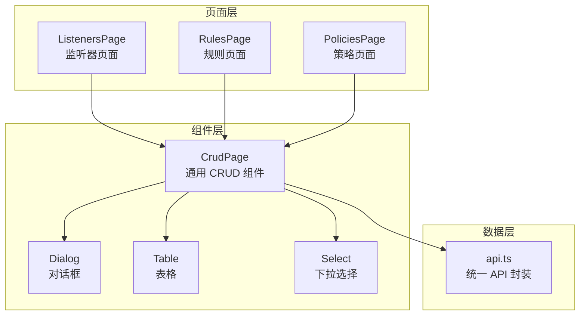
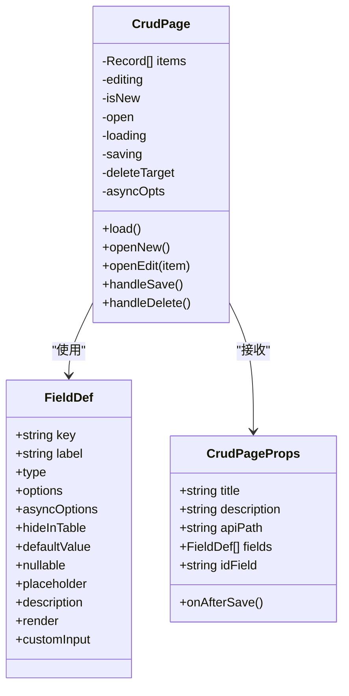
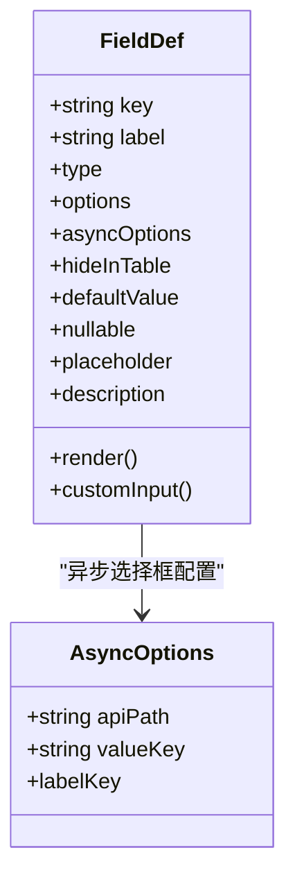
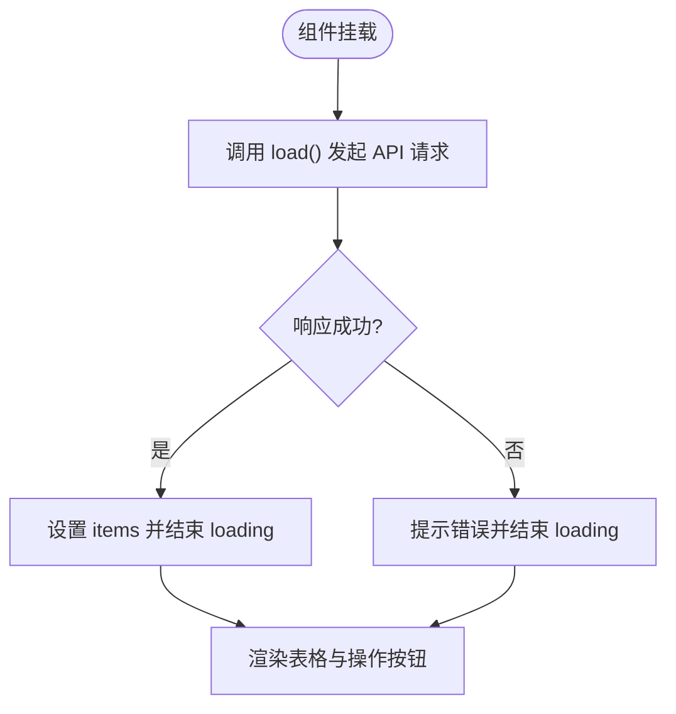
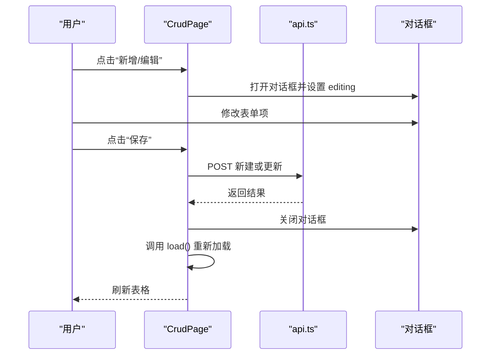
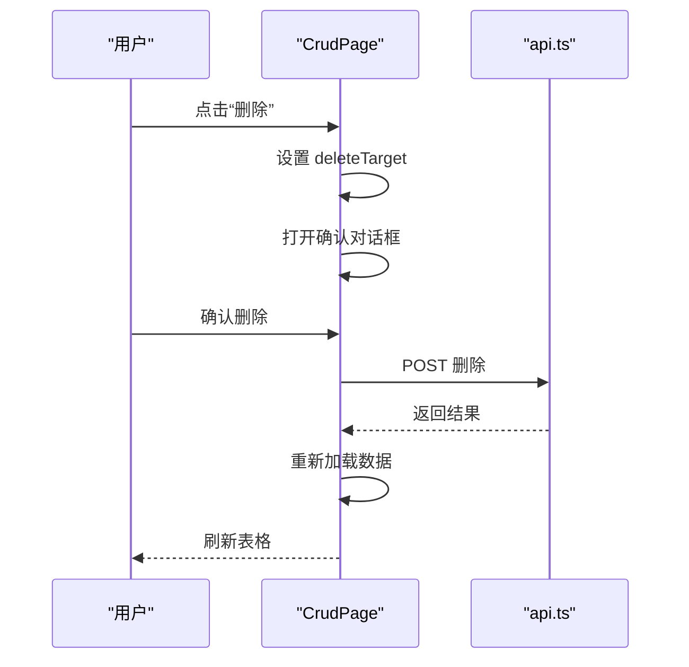
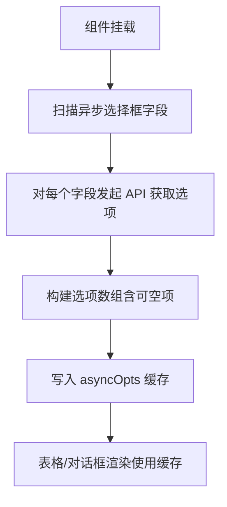
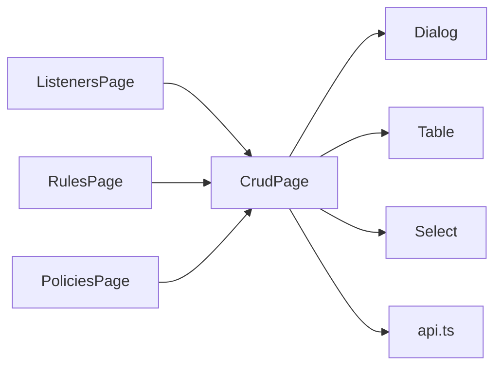

# CRUD 页面组件

<cite>
**本文档引用的文件**
- [crud-page.tsx](file://frontend/components/crud-page.tsx)
- [api.ts](file://frontend/lib/api.ts)
- [dialog.tsx](file://frontend/components/ui/dialog.tsx)
- [table.tsx](file://frontend/components/ui/table.tsx)
- [select.tsx](file://frontend/components/ui/select.tsx)
- [listeners/page.tsx](file://frontend/app/(dashboard)/listeners/page.tsx)
- [rules/page.tsx](file://frontend/app/(dashboard)/rules/page.tsx)
- [policies/page.tsx](file://frontend/app/(dashboard)/policies/page.tsx)
- [sites/page.tsx](file://frontend/app/(dashboard)/sites/page.tsx)
- [cve-rules/page.tsx](file://frontend/app/(dashboard)/cve-rules/page.tsx)
- [ip-lists/page.tsx](file://frontend/app/(dashboard)/ip-lists/page.tsx)
</cite>

## 目录
1. [简介](#简介)
2. [项目结构](#项目结构)
3. [核心组件](#核心组件)
4. [架构总览](#架构总览)
5. [详细组件分析](#详细组件分析)
6. [依赖关系分析](#依赖关系分析)
7. [性能考虑](#性能考虑)
8. [故障排除指南](#故障排除指南)
9. [结论](#结论)
10. [附录](#附录)

## 简介
本文件系统性地解析通用 CRUD 页面组件的设计与实现，涵盖数据加载、表格渲染、表单对话框、删除确认等核心功能；详解字段定义接口 FieldDef 的多种类型与配置项；阐明组件的状态管理机制（数据加载、编辑、保存、删除）；深入说明异步选择框的实现原理（选项缓存与动态加载）；解释自定义输入组件的支持机制；并提供完整的使用示例与最佳实践。

## 项目结构
CRUD 页面组件位于前端组件目录，配合统一的 UI 组件库与 API 封装模块共同工作：
- 组件层：通用 CRUD 页面组件、UI 基础组件（对话框、表格、下拉选择）
- 页面层：多个业务页面通过组合使用 CRUD 组件实现不同实体的管理界面
- 数据层：统一的 API 封装模块负责认证、鉴权、错误处理与响应解析

**图表来源**
- [listeners/page.tsx](file://frontend/app/(dashboard)/listeners/page.tsx#L1-L77)
- [rules/page.tsx](file://frontend/app/(dashboard)/rules/page.tsx#L1-L76)
- [policies/page.tsx](file://frontend/app/(dashboard)/policies/page.tsx#L1-L16)
- [crud-page.tsx:1-358](file://frontend/components/crud-page.tsx#L1-L358)
- [dialog.tsx:1-169](file://frontend/components/ui/dialog.tsx#L1-L169)
- [table.tsx:1-117](file://frontend/components/ui/table.tsx#L1-L117)
- [select.tsx:1-193](file://frontend/components/ui/select.tsx#L1-L193)
- [api.ts:1-317](file://frontend/lib/api.ts#L1-L317)

**章节来源**
- [crud-page.tsx:1-358](file://frontend/components/crud-page.tsx#L1-L358)
- [api.ts:1-317](file://frontend/lib/api.ts#L1-L317)

## 核心组件
- 通用 CRUD 页面组件：提供统一的数据加载、表格渲染、表单对话框、删除确认流程，支持多种字段类型与自定义输入组件。
- UI 基础组件：对话框、表格、下拉选择等，为 CRUD 组件提供基础交互能力。
- API 封装：统一处理认证令牌、刷新、错误码映射与响应解析。

**章节来源**
- [crud-page.tsx:60-358](file://frontend/components/crud-page.tsx#L60-L358)
- [dialog.tsx:10-169](file://frontend/components/ui/dialog.tsx#L10-L169)
- [table.tsx:7-117](file://frontend/components/ui/table.tsx#L7-L117)
- [select.tsx:9-193](file://frontend/components/ui/select.tsx#L9-L193)
- [api.ts:31-88](file://frontend/lib/api.ts#L31-L88)

## 架构总览
CRUD 组件通过 props 接收标题、描述、API 路径、字段定义与回调函数，内部维护多类状态以驱动 UI 更新。字段定义接口 FieldDef 描述每个列/表单项的渲染与输入行为，支持文本、数字、布尔值、普通选择框、异步选择框以及自定义输入组件。异步选择框具备选项缓存与空值处理，确保表格显示与表单编辑的一致性。

**图表来源**
- [crud-page.tsx:28-74](file://frontend/components/crud-page.tsx#L28-L74)
- [crud-page.tsx:51-58](file://frontend/components/crud-page.tsx#L51-L58)
- [crud-page.tsx:60-358](file://frontend/components/crud-page.tsx#L60-L358)

## 详细组件分析

### 字段定义接口 FieldDef
FieldDef 定义了每个字段的元信息与渲染/输入行为：
- 类型：支持文本、数字、多行文本、布尔值、普通选择框、异步选择框。
- 选项：普通选择框的静态选项数组。
- 异步选项：异步选择框的配置，包含 API 路径、值键名、标签键名（字符串或函数）。
- 表格控制：是否隐藏在表格中。
- 默认值与空值：默认值、可空性控制。
- 描述与占位符：增强表单项的可读性。
- 自定义渲染：render 函数用于表格中的自定义展示。
- 自定义输入：customInput 支持注入自定义表单控件。

**图表来源**
- [crud-page.tsx:28-49](file://frontend/components/crud-page.tsx#L28-L49)
- [crud-page.tsx:34-40](file://frontend/components/crud-page.tsx#L34-L40)

**章节来源**
- [crud-page.tsx:28-49](file://frontend/components/crud-page.tsx#L28-L49)

### 状态管理机制
CRUD 组件内部维护以下状态：
- items：表格数据集合
- editing：当前编辑/新建的表单数据快照
- isNew：标识新建或编辑
- open：表单对话框开关
- loading：数据加载状态
- saving：保存状态
- deleteTarget：删除确认的目标项
- asyncOpts：异步选择框的选项缓存（按字段 key 缓存）

这些状态协同驱动 UI 的加载骨架、表格渲染、表单对话框与删除确认弹窗。

**章节来源**
- [crud-page.tsx:60-70](file://frontend/components/crud-page.tsx#L60-L70)

### 数据加载与表格渲染
- 首次挂载时触发数据加载，加载成功后设置 items，失败时提示错误。
- 表格头部固定 ID 列与其他字段列；根据字段定义过滤隐藏列。
- 表格单元格支持：
  - 自定义渲染函数
  - 布尔值显示为勾选/未勾选符号
  - 异步选择框显示对应标签（基于缓存）
- 加载中显示骨架屏，空数据时显示提示。

**图表来源**
- [crud-page.tsx:99-111](file://frontend/components/crud-page.tsx#L99-L111)
- [crud-page.tsx:188-235](file://frontend/components/crud-page.tsx#L188-L235)

**章节来源**
- [crud-page.tsx:99-111](file://frontend/components/crud-page.tsx#L99-L111)
- [crud-page.tsx:188-235](file://frontend/components/crud-page.tsx#L188-L235)

### 表单对话框与保存流程
- 新建/编辑对话框：
  - 新建：基于字段默认值初始化 editing
  - 编辑：复制当前项作为 editing
- 表单项渲染：
  - 多行文本、布尔值、普通选择框、异步选择框、普通输入框
  - 自定义输入组件通过 customInput 注入
- 保存：
  - 新建：POST 到 apiPath
  - 编辑：POST 到 apiPath/{id}/update
  - 成功后关闭对话框、重新加载数据、触发回调

**图表来源**
- [crud-page.tsx:113-148](file://frontend/components/crud-page.tsx#L113-L148)
- [crud-page.tsx:244-319](file://frontend/components/crud-page.tsx#L244-L319)
- [api.ts:31-88](file://frontend/lib/api.ts#L31-L88)

**章节来源**
- [crud-page.tsx:113-148](file://frontend/components/crud-page.tsx#L113-L148)
- [crud-page.tsx:244-319](file://frontend/components/crud-page.tsx#L244-L319)

### 删除确认流程
- 用户点击删除按钮，设置 deleteTarget
- 打开删除确认对话框
- 确认后调用 DELETE API，成功后重新加载数据并触发回调

**图表来源**
- [crud-page.tsx:150-161](file://frontend/components/crud-page.tsx#L150-L161)
- [api.ts:31-88](file://frontend/lib/api.ts#L31-L88)

**章节来源**
- [crud-page.tsx:150-161](file://frontend/components/crud-page.tsx#L150-L161)

### 异步选择框实现原理
- 选项缓存：组件在挂载时扫描所有异步选择框字段，预取选项并缓存到 asyncOpts 中，key 为字段 key。
- 动态加载：当对话框打开时，异步选择框使用缓存的选项进行渲染。
- 空值处理：若字段可空，则在缓存中插入一个“不选择”选项，表单值为特殊标记并在保存前转换为 null。
- 标签生成：支持字符串或函数两种方式生成标签，函数形式可从任意字段派生友好标签。

**图表来源**
- [crud-page.tsx:71-97](file://frontend/components/crud-page.tsx#L71-L97)
- [crud-page.tsx:274-291](file://frontend/components/crud-page.tsx#L274-L291)

**章节来源**
- [crud-page.tsx:71-97](file://frontend/components/crud-page.tsx#L71-L97)
- [crud-page.tsx:274-291](file://frontend/components/crud-page.tsx#L274-L291)

### 自定义输入组件支持机制
- customInput 接收 { value, onChange } 两个参数，返回一个 React 节点。
- 在表单对话框中，若字段定义了 customInput，则直接渲染该组件，否则按字段类型渲染内置控件。
- 这种机制允许在不修改通用组件的前提下扩展复杂输入场景（如规则构建器）。

**章节来源**
- [crud-page.tsx:47-48](file://frontend/components/crud-page.tsx#L47-L48)
- [crud-page.tsx:250-255](file://frontend/components/crud-page.tsx#L250-L255)

### 使用示例与最佳实践

#### 示例一：监听器页面（异步选择框 + 可空 + 自定义描述）
- 字段包含异步选择框（证书），支持可空，标签通过函数生成。
- 隐藏部分字段（如网络协议）以简化表格视图。
- 提供描述帮助用户理解字段含义。

**章节来源**
- [listeners/page.tsx:1-77](file://frontend/app/(dashboard)/listeners/page.tsx#L1-L77)

#### 示例二：规则页面（自定义输入 + 自定义渲染）
- 使用自定义输入组件（规则构建器）替代普通输入框。
- 自定义渲染函数将简单模式串格式化为更友好的展示。

**章节来源**
- [rules/page.tsx:1-76](file://frontend/app/(dashboard)/rules/page.tsx#L1-L76)

#### 示例三：策略页面（最简用法）
- 仅包含一个名称字段，演示最小化配置即可快速搭建 CRUD 页面。

**章节来源**
- [policies/page.tsx:1-16](file://frontend/app/(dashboard)/policies/page.tsx#L1-L16)

#### 最佳实践
- 字段设计：优先使用可空字段处理“未选择”场景；为复杂字段提供描述。
- 渲染优化：对长文本使用自定义渲染，避免表格拥挤。
- 性能优化：合理使用异步选择框并利用缓存；避免在 render 中创建新对象。
- 错误处理：统一依赖 API 封装的错误处理逻辑，保证用户体验一致。

**章节来源**
- [crud-page.tsx:28-49](file://frontend/components/crud-page.tsx#L28-L49)
- [api.ts:31-88](file://frontend/lib/api.ts#L31-L88)

## 依赖关系分析
CRUD 组件与 UI 组件、API 封装之间的依赖关系如下：

**图表来源**
- [crud-page.tsx:1-358](file://frontend/components/crud-page.tsx#L1-L358)
- [dialog.tsx:1-169](file://frontend/components/ui/dialog.tsx#L1-L169)
- [table.tsx:1-117](file://frontend/components/ui/table.tsx#L1-L117)
- [select.tsx:1-193](file://frontend/components/ui/select.tsx#L1-L193)
- [listeners/page.tsx:1-77](file://frontend/app/(dashboard)/listeners/page.tsx#L1-L77)
- [rules/page.tsx:1-76](file://frontend/app/(dashboard)/rules/page.tsx#L1-L76)
- [policies/page.tsx:1-16](file://frontend/app/(dashboard)/policies/page.tsx#L1-L16)

**章节来源**
- [crud-page.tsx:1-358](file://frontend/components/crud-page.tsx#L1-L358)

## 性能考虑
- 异步选择框缓存：在组件挂载时一次性拉取所有异步选项，减少重复请求与闪烁。
- 表格渲染：使用骨架屏提升加载体验；对长列表采用虚拟滚动（如需）进一步优化。
- 状态更新：避免在渲染路径中创建新的对象或函数，减少不必要的重渲染。
- API 错误处理：统一处理 401/403/429 等错误，防止异常中断 UI 流程。

[本节为通用指导，无需特定文件引用]

## 故障排除指南
- 加载失败：检查 API 返回状态与错误消息，确认网络连通与认证令牌有效性。
- 401 未授权：组件会尝试刷新令牌并重试；若仍失败，跳转至登录页。
- 403 权限不足：检查 RBAC 权限配置，确保当前账户具备相应操作权限。
- 429 请求过快：遵循速率限制策略，适当增加请求间隔。
- 异步选择框为空：确认异步 API 返回格式为 { items: [...] }，且 valueKey/labelKey 配置正确。

**章节来源**
- [api.ts:16-88](file://frontend/lib/api.ts#L16-L88)
- [crud-page.tsx:71-97](file://frontend/components/crud-page.tsx#L71-L97)

## 结论
通用 CRUD 页面组件通过清晰的字段定义与状态管理，实现了高度复用的数据管理界面。其对异步选择框、自定义输入组件与表格渲染的灵活支持，使得在不同业务场景下都能快速构建一致、可靠的管理页面。结合统一的 API 封装与 UI 组件库，能够有效提升开发效率与用户体验。

[本节为总结性内容，无需特定文件引用]

## 附录

### API 封装要点
- 认证令牌管理：在模块作用域内存储访问令牌，避免 XSS 风险。
- 自动刷新：遇到 401 且存在旧令牌时自动刷新并重试请求。
- 错误映射：将常见 HTTP 状态映射为用户可读的错误信息。
- 响应解析：统一处理 204 无内容与 JSON 响应。

**章节来源**
- [api.ts:7-114](file://frontend/lib/api.ts#L7-L114)
- [api.ts:118-317](file://frontend/lib/api.ts#L118-L317)