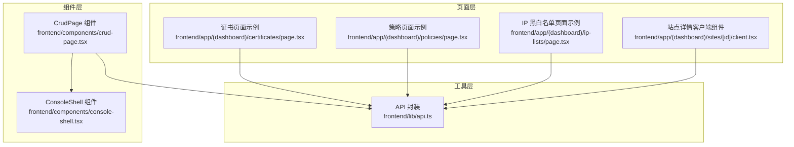
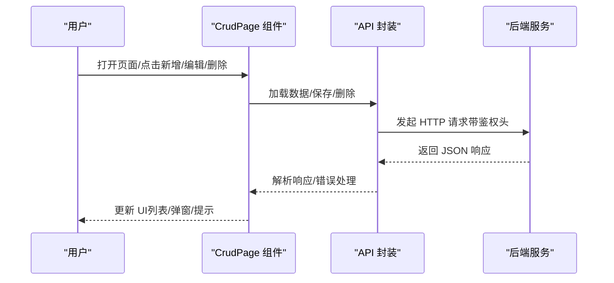
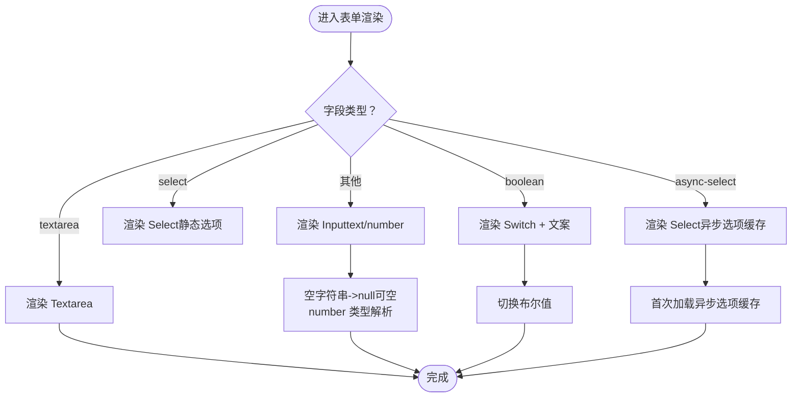
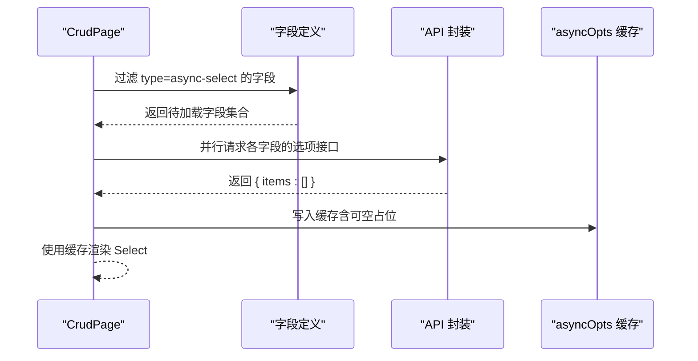
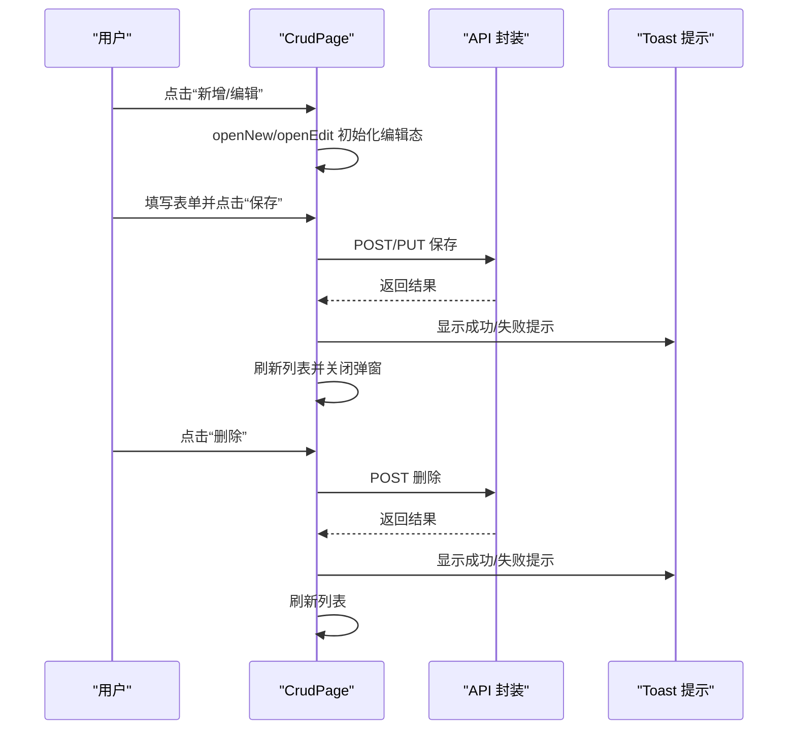
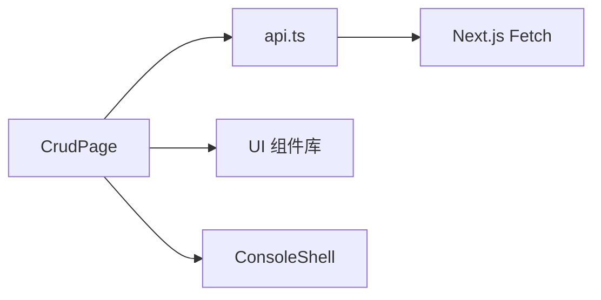

# CRUD 页面组件

<cite>
**本文引用的文件**
- [crud-page.tsx](file://frontend/components/crud-page.tsx)
- [api.ts](file://frontend/lib/api.ts)
- [console-shell.tsx](file://frontend/components/console-shell.tsx)
- [page.tsx](file://frontend/app/(dashboard)/certificates/page.tsx)
- [page.tsx](file://frontend/app/(dashboard)/policies/page.tsx)
- [page.tsx](file://frontend/app/(dashboard)/ip-lists/page.tsx)
- [client.tsx](file://frontend/app/(dashboard)/sites/[id]/client.tsx)
</cite>

## 目录
1. [简介](#简介)
2. [项目结构](#项目结构)
3. [核心组件](#核心组件)
4. [架构总览](#架构总览)
5. [详细组件分析](#详细组件分析)
6. [依赖分析](#依赖分析)
7. [性能考虑](#性能考虑)
8. [故障排查指南](#故障排查指南)
9. [结论](#结论)
10. [附录](#附录)

## 简介
本指南围绕“基于字段定义驱动渲染”的 CRUD 页面组件进行系统化讲解，目标是帮助前端开发者快速构建可复用、可维护的资源管理界面。文档覆盖以下关键主题：
- FieldDef 类型系统的设计理念与使用方法
- 表单输入组件的自动适配机制（文本、数字、开关、选择、异步选择与文本域）
- 异步选项缓存策略的实现细节与性能优化
- 完整 CRUD 操作流程（数据加载、新增/编辑弹窗、删除确认、保存反馈）
- 最佳实践与可复用组件的构建建议

## 项目结构
本项目前端采用 Next.js App Router 结构，CRUD 页面组件位于 frontend/components 下，通用 UI 组件与页面示例分别位于 frontend/components 与 frontend/app。

图表来源
- [crud-page.tsx:1-359](file://frontend/components/crud-page.tsx#L1-L359)
- [console-shell.tsx:1-229](file://frontend/components/console-shell.tsx#L1-L229)
- [api.ts:1-121](file://frontend/lib/api.ts#L1-L121)
- [page.tsx](file://frontend/app/(dashboard)/certificates/page.tsx#L1-L268)
- [page.tsx](file://frontend/app/(dashboard)/policies/page.tsx#L1-L238)
- [page.tsx](file://frontend/app/(dashboard)/ip-lists/page.tsx#L1-L579)
- [client.tsx](file://frontend/app/(dashboard)/sites/[id]/client.tsx#L1-L800)

章节来源
- [crud-page.tsx:1-359](file://frontend/components/crud-page.tsx#L1-L359)
- [api.ts:1-121](file://frontend/lib/api.ts#L1-L121)

## 核心组件
本节聚焦 CrudPage 组件与其依赖的 API 封装与通用布局组件，解释其职责边界与协作方式。

- CrudPage 组件
  - 负责统一的 CRUD 渲染与交互：列表展示、新增/编辑弹窗、删除确认、保存反馈、加载骨架屏等。
  - 通过 FieldDef 字段定义驱动表单与表格渲染，支持多种输入类型与异步选项缓存。
  - 通过 api 封装进行后端通信，内置鉴权与错误处理。

- ConsoleShell 布局组件
  - 提供 PageIntro、Surface、EmptyState 等通用布局与状态提示组件，提升页面一致性与可读性。

- API 封装
  - 统一处理鉴权头、刷新令牌、错误码映射与分页响应结构，简化页面调用。

章节来源
- [crud-page.tsx:56-349](file://frontend/components/crud-page.tsx#L56-L349)
- [console-shell.tsx:7-96](file://frontend/components/console-shell.tsx#L7-L96)
- [api.ts:72-121](file://frontend/lib/api.ts#L72-L121)

## 架构总览
下图展示了 CRUD 页面组件在系统中的位置与交互路径。

图表来源
- [crud-page.tsx:96-164](file://frontend/components/crud-page.tsx#L96-L164)
- [api.ts:72-121](file://frontend/lib/api.ts#L72-L121)

## 详细组件分析

### FieldDef 类型系统与字段驱动渲染
- 设计理念
  - 通过字段定义（FieldDef）描述每个资源字段的元信息，包括键名、标签、类型、选项、占位符、描述、默认值、是否可空、渲染钩子与自定义输入组件等。
  - 表格列、表单输入、单元格渲染均由字段定义自动推导，减少样板代码，提升一致性与可维护性。

- 关键字段说明
  - key：字段唯一标识，用于数据读写与表格列定位
  - label：显示标签
  - type：输入类型（text、number、textarea、boolean、select、async-select）
  - options：静态选项（用于 select）
  - asyncOptions：异步选项配置（apiPath、valueKey、labelKey）
  - hideInTable：是否隐藏在表格中
  - defaultValue：默认值
  - nullable：是否允许为空（对应后端 null）
  - placeholder/description：表单提示与说明
  - render：自定义单元格渲染函数
  - customInput：自定义表单输入组件

- 表单与表格渲染策略
  - 表格：过滤 hideInTable 后生成列，render 优先，否则根据 type 输出文本或布尔文案，异步选择使用缓存选项映射
  - 表单：根据 type 自动选择 Input、Textarea、Switch、Select 或自定义组件；支持数值解析、空字符串转 null、可空下拉的占位选项

章节来源
- [crud-page.tsx:28-45](file://frontend/components/crud-page.tsx#L28-L45)
- [crud-page.tsx:166-249](file://frontend/components/crud-page.tsx#L166-L249)
- [crud-page.tsx:263-323](file://frontend/components/crud-page.tsx#L263-L323)

### 表单输入组件自动适配机制
- 文本与数字
  - 文本：Input[type=text]，支持 placeholder 与受控值
  - 数字：Input[type=number]，空值转 0，可空时空字符串转 null
- 开关
  - Switch + 文案切换，布尔值渲染“已启用/已禁用”
- 选择与异步选择
  - Select 组件，支持静态 options 与异步 asyncOptions 缓存
  - 可空下拉增加“不选择”占位项
- 文本域
  - Textarea，支持最小高度与字体样式
- 自定义输入
  - customInput 支持复杂场景（如多主机输入、富文本）

图表来源
- [crud-page.tsx:263-323](file://frontend/components/crud-page.tsx#L263-L323)
- [crud-page.tsx:74-94](file://frontend/components/crud-page.tsx#L74-L94)

章节来源
- [crud-page.tsx:263-323](file://frontend/components/crud-page.tsx#L263-L323)
- [crud-page.tsx:351-358](file://frontend/components/crud-page.tsx#L351-L358)

### 异步选项缓存策略与性能优化
- 实现细节
  - 组件挂载时扫描所有 async-select 字段，一次性并行发起请求获取选项
  - 使用 asyncOpts 状态缓存结果，避免重复请求
  - 可空字段在选项列表前插入“不选择”占位项，便于用户清空选择
  - 请求失败时回退为空数组，保证 UI 稳定性

- 性能优化效果
  - 并行加载多个异步选项，减少等待时间
  - 本地缓存避免重复网络请求
  - 仅在字段定义变更时重新加载，降低不必要的副作用

图表来源
- [crud-page.tsx:71-94](file://frontend/components/crud-page.tsx#L71-L94)

章节来源
- [crud-page.tsx:67-94](file://frontend/components/crud-page.tsx#L67-L94)

### CRUD 操作流程详解
- 数据加载
  - 组件挂载时调用 api 获取列表数据，支持加载骨架屏与空状态
- 新增/编辑弹窗
  - openNew/openEdit 初始化编辑态，根据字段定义生成表单
  - handleSave 根据 isNew 决定 POST 或 PUT 请求，成功后关闭弹窗并刷新列表
- 删除确认
  - openDelete 设置删除目标，handleDelete 发起删除请求并刷新
- 保存反馈
  - 成功/失败通过 toast 提示，必要时触发 onAfterSave 回调

图表来源
- [crud-page.tsx:113-164](file://frontend/components/crud-page.tsx#L113-L164)
- [api.ts:72-121](file://frontend/lib/api.ts#L72-L121)

章节来源
- [crud-page.tsx:96-164](file://frontend/components/crud-page.tsx#L96-L164)

### 页面示例对比：传统手写 vs 字段驱动
- 传统手写页面（证书、策略、IP 黑白名单）
  - 每个页面自行管理状态、表单、对话框与 API 调用，存在大量重复逻辑
  - 适合简单场景，但扩展与维护成本较高
- 字段驱动页面（推荐）
  - 通过 FieldDef 描述字段，统一渲染与交互，显著减少重复代码
  - 更易扩展新字段类型与新资源类型

章节来源
- [page.tsx](file://frontend/app/(dashboard)/certificates/page.tsx#L1-L268)
- [page.tsx](file://frontend/app/(dashboard)/policies/page.tsx#L1-L238)
- [page.tsx](file://frontend/app/(dashboard)/ip-lists/page.tsx#L1-L579)
- [crud-page.tsx:1-359](file://frontend/components/crud-page.tsx#L1-L359)

### 站点详情客户端组件中的字段驱动实践
- 在站点详情客户端组件中，虽然未直接使用 CrudPage，但其对字段的抽象与表单渲染思路与 CrudPage 的字段驱动理念一致，均可作为字段驱动的参考实现。

章节来源
- [client.tsx:1-800](file://frontend/app/(dashboard)/sites/[id]/client.tsx#L1-L800)

## 依赖分析
- 组件耦合
  - CrudPage 依赖 api 封装与 UI 组件库（Button、Input、Textarea、Switch、Select、Dialog、AlertDialog、Table 等）
  - 通过 ConsoleShell 提供一致的页面结构与状态提示
- 外部依赖
  - Next.js App Router 与 React Hooks（useState/useEffect/useCallback/useRef）
  - lucide-react 图标库与 sonner 提示库

图表来源
- [crud-page.tsx:1-27](file://frontend/components/crud-page.tsx#L1-L27)
- [api.ts:1-121](file://frontend/lib/api.ts#L1-L121)
- [console-shell.tsx:1-34](file://frontend/components/console-shell.tsx#L1-L34)

章节来源
- [crud-page.tsx:1-27](file://frontend/components/crud-page.tsx#L1-L27)
- [api.ts:1-121](file://frontend/lib/api.ts#L1-L121)
- [console-shell.tsx:1-34](file://frontend/components/console-shell.tsx#L1-L34)

## 性能考虑
- 异步选项缓存
  - 首次渲染时并行加载，后续复用缓存，避免重复请求
- 列表渲染优化
  - 使用 Skeleton 骨架屏提升感知性能
  - 表格列按需渲染，隐藏列不参与渲染
- 网络与鉴权
  - API 封装内置鉴权头与令牌刷新，减少页面侧重复逻辑
- 受控表单
  - 输入值解析与空值转换在组件内部完成，避免父组件状态抖动

## 故障排查指南
- 401 未授权
  - API 封装会尝试刷新令牌并重试一次，若仍失败则跳转登录页
- 403 禁止访问
  - 映射为“访问被拒绝”，需检查权限与角色
- 429 请求过于频繁
  - 映射为“请求过多”，需降频或增加节流
- 其他错误
  - 统一捕获 HTTP 状态码与错误体，抛出可读错误消息

章节来源
- [api.ts:81-114](file://frontend/lib/api.ts#L81-L114)

## 结论
通过 FieldDef 字段驱动渲染与 CrudPage 组件，可以高效地构建一致、可扩展且易于维护的 CRUD 页面。配合异步选项缓存、统一的 API 封装与布局组件，能够显著降低重复工作量并提升开发效率。建议在新资源页面优先采用字段驱动方案，并结合页面示例进行定制化扩展。

## 附录
- 最佳实践清单
  - 使用 FieldDef 描述所有字段，明确 type、placeholder、description、nullable 等属性
  - 优先使用异步选项缓存，避免重复请求
  - 为复杂字段提供 customInput，保持表单一致性
  - 使用 ConsoleShell 组件统一页面结构与状态提示
  - 在 onAfterSave 中执行必要的刷新或导航逻辑
  - 对于大型列表，考虑分页与虚拟滚动（如需）