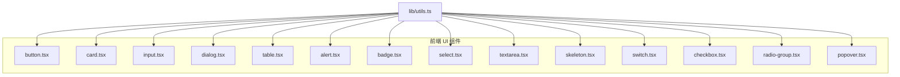
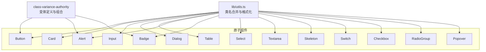
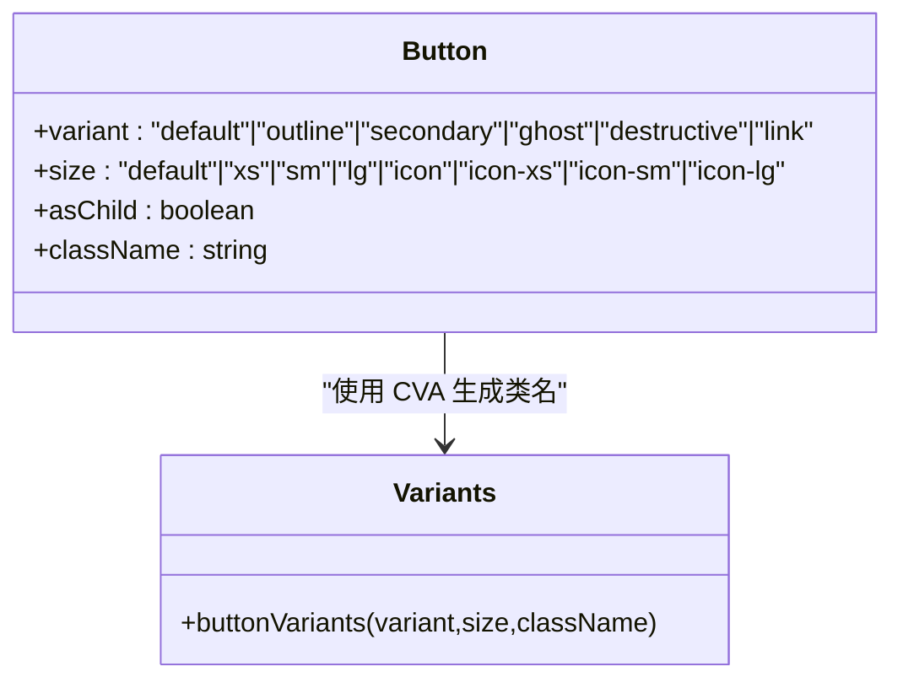
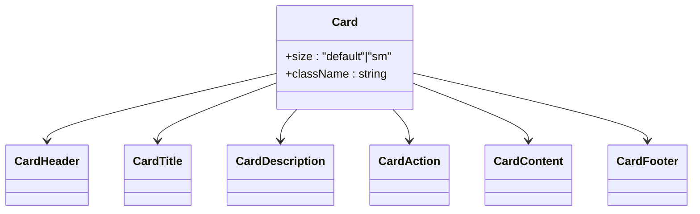
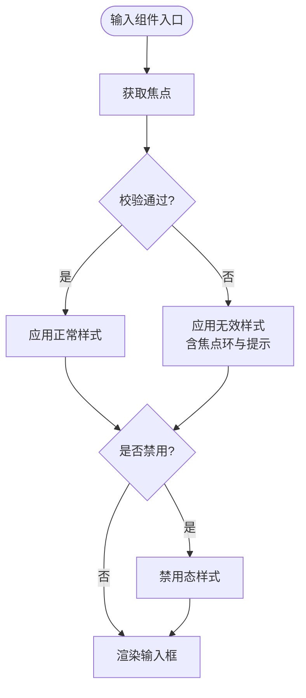
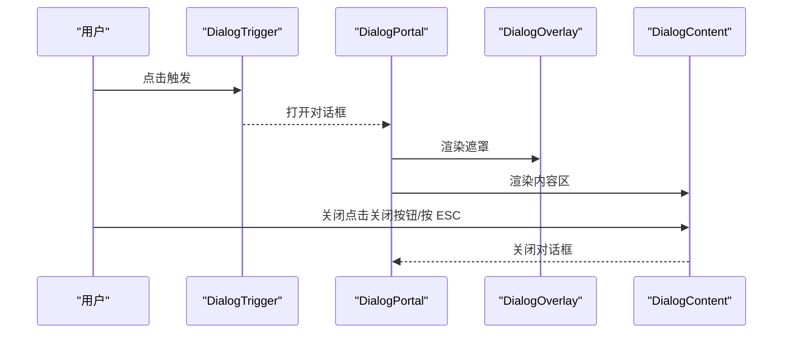
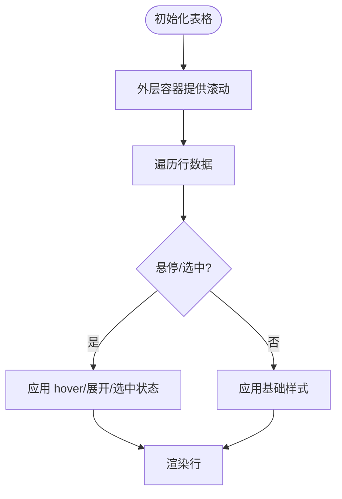
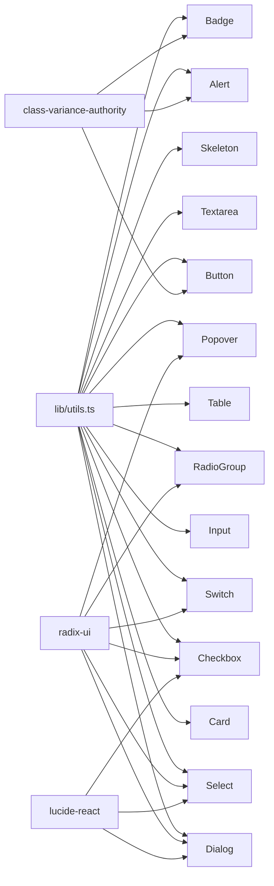

# UI 原子组件模式

> [返回 前端管理界面](../前端管理界面.md)

<cite>
**本文引用的文件**
- [frontend/components/ui/button.tsx](file://frontend/components/ui/button.tsx)
- [frontend/components/ui/card.tsx](file://frontend/components/ui/card.tsx)
- [frontend/components/ui/input.tsx](file://frontend/components/ui/input.tsx)
- [frontend/components/ui/dialog.tsx](file://frontend/components/ui/dialog.tsx)
- [frontend/components/ui/table.tsx](file://frontend/components/ui/table.tsx)
- [frontend/lib/utils.ts](file://frontend/lib/utils.ts)
- [frontend/components/ui/alert.tsx](file://frontend/components/ui/alert.tsx)
- [frontend/components/ui/badge.tsx](file://frontend/components/ui/badge.tsx)
- [frontend/components/ui/select.tsx](file://frontend/components/ui/select.tsx)
- [frontend/components/ui/textarea.tsx](file://frontend/components/ui/textarea.tsx)
- [frontend/components/ui/skeleton.tsx](file://frontend/components/ui/skeleton.tsx)
- [frontend/components/ui/switch.tsx](file://frontend/components/ui/switch.tsx)
- [frontend/components/ui/checkbox.tsx](file://frontend/components/ui/checkbox.tsx)
- [frontend/components/ui/radio-group.tsx](file://frontend/components/ui/radio-group.tsx)
- [frontend/components/ui/popover.tsx](file://frontend/components/ui/popover.tsx)
</cite>

## 目录
1. [引言](#引言)
2. [项目结构](#项目结构)
3. [核心组件](#核心组件)
4. [架构总览](#架构总览)
5. [详细组件分析](#详细组件分析)
6. [依赖分析](#依赖分析)
7. [性能考虑](#性能考虑)
8. [故障排查指南](#故障排查指南)
9. [结论](#结论)
10. [附录](#附录)

## 引言
本设计指南围绕基于 shadcn/ui 的“原子化组件”理念，系统阐述组件变体系统与样式继承机制，聚焦按钮、卡片、输入框、对话框、表格等基础 UI 组件的实现原理与使用方法。文档同时讲解 class-variance-authority（CVA）的变体定义模式，展示如何通过配置实现组件样式的灵活组合，并提供扩展与定制的最佳实践，包括主题适配、尺寸变体与状态管理。

## 项目结构
前端 UI 组件集中于 frontend/components/ui 目录，采用“按组件拆分”的组织方式：每个组件独立文件，便于复用与维护；公共工具函数位于 frontend/lib/utils.ts，统一负责类名合并与日期格式化等通用逻辑。

**图表来源**
- [frontend/components/ui/button.tsx](file://frontend/components/ui/button.tsx)
- [frontend/components/ui/card.tsx](file://frontend/components/ui/card.tsx)
- [frontend/components/ui/input.tsx](file://frontend/components/ui/input.tsx)
- [frontend/components/ui/dialog.tsx](file://frontend/components/ui/dialog.tsx)
- [frontend/components/ui/table.tsx](file://frontend/components/ui/table.tsx)
- [frontend/components/ui/alert.tsx](file://frontend/components/ui/alert.tsx)
- [frontend/components/ui/badge.tsx](file://frontend/components/ui/badge.tsx)
- [frontend/components/ui/select.tsx](file://frontend/components/ui/select.tsx)
- [frontend/components/ui/textarea.tsx](file://frontend/components/ui/textarea.tsx)
- [frontend/components/ui/skeleton.tsx](file://frontend/components/ui/skeleton.tsx)
- [frontend/components/ui/switch.tsx](file://frontend/components/ui/switch.tsx)
- [frontend/components/ui/checkbox.tsx](file://frontend/components/ui/checkbox.tsx)
- [frontend/components/ui/radio-group.tsx](file://frontend/components/ui/radio-group.tsx)
- [frontend/components/ui/popover.tsx](file://frontend/components/ui/popover.tsx)
- [frontend/lib/utils.ts](file://frontend/lib/utils.ts)

**章节来源**
- [frontend/components/ui/button.tsx](file://frontend/components/ui/button.tsx)
- [frontend/components/ui/card.tsx](file://frontend/components/ui/card.tsx)
- [frontend/components/ui/input.tsx](file://frontend/components/ui/input.tsx)
- [frontend/components/ui/dialog.tsx](file://frontend/components/ui/dialog.tsx)
- [frontend/components/ui/table.tsx](file://frontend/components/ui/table.tsx)
- [frontend/lib/utils.ts](file://frontend/lib/utils.ts)

## 核心组件
本节从“原子化组件”的角度，总结各组件的职责边界、变体系统与样式继承机制，并给出使用建议与最佳实践。

- 按钮 Button
  - 变体：default、outline、secondary、ghost、destructive、link
  - 尺寸：default、xs、sm、lg、icon、icon-xs、icon-sm、icon-lg
  - 特性：支持 asChild 使用语义标签包裹；通过 data-slot、data-variant、data-size 标注数据属性，便于主题与测试识别；继承焦点可见性、禁用态、无效态与图标间距等通用行为。
  - 使用建议：优先使用变体表达语义，使用尺寸控制密度；在按钮组中配合 data-slot 选择器进行微调。

- 卡片 Card
  - 尺寸：default、sm
  - 组合部件：CardHeader、CardTitle、CardDescription、CardContent、CardAction、CardFooter
  - 特性：通过 data-size 控制整体密度；内部使用 data-slot 与容器查询（@container）实现复杂布局与响应式行为；footer 与图片首尾元素自动调整内边距与圆角。
  - 使用建议：以卡片为容器，按需组合标题、描述、操作与内容区域；小尺寸卡片用于紧凑信息展示。

- 输入 Input
  - 特性：内置焦点环、禁用态、无效态与暗色主题适配；支持 placeholder 文案与最小宽度约束；通过 data-slot 标识便于主题覆盖。
  - 使用建议：与表单校验联动时，结合 aria-invalid 实现视觉反馈；在复杂输入场景下可搭配 InputGroup 或 Select。

- 对话框 Dialog
  - 组合部件：Dialog、DialogTrigger、DialogPortal、DialogOverlay、DialogContent、DialogHeader、DialogFooter、DialogTitle、DialogDescription、DialogClose
  - 特性：基于 Radix UI 的无障碍原语；支持动画入场/出场；默认提供关闭按钮；支持自定义头部与底部区域。
  - 使用建议：在需要遮罩层与模态交互时优先使用；注意关闭按钮的显隐策略与键盘可达性。

- 表格 Table
  - 组合部件：Table、TableHeader、TableBody、TableFooter、TableRow、TableHead、TableCell、TableCaption
  - 特性：外层容器提供横向滚动；行级 hover、展开与选中状态通过 data 属性与 aria 属性驱动；单元格对齐与间距遵循一致规范。
  - 使用建议：大数据集场景开启横向滚动；为表头与单元格提供语义化 role 以提升可访问性。

- 其他常用原子组件
  - Alert：带变体的提示容器，支持标题、描述与操作区。
  - Badge：轻量标签，支持多种变体与 asChild。
  - Select：下拉选择，支持分组、标签、滚动按钮与多种定位模式。
  - Textarea：多行文本输入，具备与 Input 类似的焦点与无效态样式。
  - Skeleton：占位骨架屏，统一脉动动画。
  - Switch、Checkbox、RadioGroup：原生交互控件，提供尺寸与状态样式。
  - Popover：弹出气泡容器，支持对齐与偏移。

**章节来源**
- [frontend/components/ui/button.tsx](file://frontend/components/ui/button.tsx)
- [frontend/components/ui/card.tsx](file://frontend/components/ui/card.tsx)
- [frontend/components/ui/input.tsx](file://frontend/components/ui/input.tsx)
- [frontend/components/ui/dialog.tsx](file://frontend/components/ui/dialog.tsx)
- [frontend/components/ui/table.tsx](file://frontend/components/ui/table.tsx)
- [frontend/components/ui/alert.tsx](file://frontend/components/ui/alert.tsx)
- [frontend/components/ui/badge.tsx](file://frontend/components/ui/badge.tsx)
- [frontend/components/ui/select.tsx](file://frontend/components/ui/select.tsx)
- [frontend/components/ui/textarea.tsx](file://frontend/components/ui/textarea.tsx)
- [frontend/components/ui/skeleton.tsx](file://frontend/components/ui/skeleton.tsx)
- [frontend/components/ui/switch.tsx](file://frontend/components/ui/switch.tsx)
- [frontend/components/ui/checkbox.tsx](file://frontend/components/ui/checkbox.tsx)
- [frontend/components/ui/radio-group.tsx](file://frontend/components/ui/radio-group.tsx)
- [frontend/components/ui/popover.tsx](file://frontend/components/ui/popover.tsx)

## 架构总览
下图展示了 UI 原子组件的通用架构：每个组件通过 CVA 或直接类名组合实现变体与尺寸；公共工具函数负责类名合并与日期格式化；组件之间通过数据属性与容器查询实现样式继承与布局协同。

**图表来源**
- [frontend/lib/utils.ts](file://frontend/lib/utils.ts)
- [frontend/components/ui/button.tsx](file://frontend/components/ui/button.tsx)
- [frontend/components/ui/alert.tsx](file://frontend/components/ui/alert.tsx)
- [frontend/components/ui/badge.tsx](file://frontend/components/ui/badge.tsx)

## 详细组件分析

### 按钮 Button 组件
- 设计要点
  - 使用 CVA 定义变体与尺寸，通过默认值与传参组合生成最终类名。
  - 支持 asChild 以语义化渲染，避免多余 DOM 结构。
  - 通过 data-slot、data-variant、data-size 标注，便于主题与测试识别。
  - 内置焦点可见性、禁用态、无效态与图标间距等通用行为。
- 最佳实践
  - 优先使用语义化变体（如 destructive 表达危险动作），避免直接硬编码样式。
  - 在按钮组中利用 data-slot 选择器进行微调，保持一致性。
  - 图标按钮使用 icon 尺寸，确保视觉平衡。

**图表来源**
- [frontend/components/ui/button.tsx](file://frontend/components/ui/button.tsx)

**章节来源**
- [frontend/components/ui/button.tsx](file://frontend/components/ui/button.tsx)

### 卡片 Card 组件
- 设计要点
  - 通过 data-size 控制整体密度与内边距；内部使用 data-slot 与容器查询实现复杂布局。
  - 提供 Header、Title、Description、Action、Content、Footer 组合部件，满足常见卡片结构。
  - 图片首尾元素自动圆角，footer 与内容区域自动调整内边距。
- 最佳实践
  - 小尺寸卡片用于信息卡片或列表项；大尺寸卡片用于详情页或面板。
  - 合理使用 Action 区域放置操作按钮，避免与内容重叠。

**图表来源**
- [frontend/components/ui/card.tsx](file://frontend/components/ui/card.tsx)

**章节来源**
- [frontend/components/ui/card.tsx](file://frontend/components/ui/card.tsx)

### 输入 Input 与 Textarea 组件
- 设计要点
  - 统一的焦点环、禁用态与无效态样式；支持 placeholder 文案与最小宽度约束。
  - 通过 data-slot 标识，便于主题覆盖与样式隔离。
- 最佳实践
  - 与表单校验联动时，结合 aria-invalid 实现视觉反馈。
  - 多行输入使用 Textarea，单行输入使用 Input。

**图表来源**
- [frontend/components/ui/input.tsx](file://frontend/components/ui/input.tsx)
- [frontend/components/ui/textarea.tsx](file://frontend/components/ui/textarea.tsx)

**章节来源**
- [frontend/components/ui/input.tsx](file://frontend/components/ui/input.tsx)
- [frontend/components/ui/textarea.tsx](file://frontend/components/ui/textarea.tsx)

### 对话框 Dialog 组件
- 设计要点
  - 基于 Radix UI 的无障碍原语，提供触发器、遮罩、内容区、头部与底部等组合部件。
  - 默认提供关闭按钮；支持动画入场/出场与键盘可达性。
- 最佳实践
  - 在需要遮罩层与模态交互时优先使用；注意关闭按钮的显隐策略与键盘可达性。

**图表来源**
- [frontend/components/ui/dialog.tsx](file://frontend/components/ui/dialog.tsx)

**章节来源**
- [frontend/components/ui/dialog.tsx](file://frontend/components/ui/dialog.tsx)

### 表格 Table 组件
- 设计要点
  - 外层容器提供横向滚动；行级 hover、展开与选中状态通过 data 属性与 aria 属性驱动。
  - 表头与单元格对齐与间距遵循一致规范。
- 最佳实践
  - 大数据集场景开启横向滚动；为表头与单元格提供语义化 role 以提升可访问性。

**图表来源**
- [frontend/components/ui/table.tsx](file://frontend/components/ui/table.tsx)

**章节来源**
- [frontend/components/ui/table.tsx](file://frontend/components/ui/table.tsx)

### 其他原子组件
- Alert：带变体的提示容器，支持标题、描述与操作区。
- Badge：轻量标签，支持多种变体与 asChild。
- Select：下拉选择，支持分组、标签、滚动按钮与多种定位模式。
- Skeleton：占位骨架屏，统一脉动动画。
- Switch、Checkbox、RadioGroup：原生交互控件，提供尺寸与状态样式。
- Popover：弹出气泡容器，支持对齐与偏移。

**章节来源**
- [frontend/components/ui/alert.tsx](file://frontend/components/ui/alert.tsx)
- [frontend/components/ui/badge.tsx](file://frontend/components/ui/badge.tsx)
- [frontend/components/ui/select.tsx](file://frontend/components/ui/select.tsx)
- [frontend/components/ui/skeleton.tsx](file://frontend/components/ui/skeleton.tsx)
- [frontend/components/ui/switch.tsx](file://frontend/components/ui/switch.tsx)
- [frontend/components/ui/checkbox.tsx](file://frontend/components/ui/checkbox.tsx)
- [frontend/components/ui/radio-group.tsx](file://frontend/components/ui/radio-group.tsx)
- [frontend/components/ui/popover.tsx](file://frontend/components/ui/popover.tsx)

## 依赖分析
- 工具函数
  - lib/utils.ts 提供 cn（类名合并）与日期格式化，被所有组件共享，保证样式一致性与可维护性。
- 组件间耦合
  - 组件之间低耦合，通过数据属性与容器查询实现样式继承与布局协同。
- 外部依赖
  - class-variance-authority：用于定义变体系统。
  - radix-ui：用于无障碍交互原语（如 Dialog、Select、Switch、Checkbox、RadioGroup、Popover）。
  - lucide-react：提供图标资源（如 X、Check、ChevronDown、ChevronUp 等）。

**图表来源**
- [frontend/lib/utils.ts](file://frontend/lib/utils.ts)
- [frontend/components/ui/button.tsx](file://frontend/components/ui/button.tsx)
- [frontend/components/ui/alert.tsx](file://frontend/components/ui/alert.tsx)
- [frontend/components/ui/badge.tsx](file://frontend/components/ui/badge.tsx)
- [frontend/components/ui/dialog.tsx](file://frontend/components/ui/dialog.tsx)
- [frontend/components/ui/select.tsx](file://frontend/components/ui/select.tsx)
- [frontend/components/ui/switch.tsx](file://frontend/components/ui/switch.tsx)
- [frontend/components/ui/checkbox.tsx](file://frontend/components/ui/checkbox.tsx)
- [frontend/components/ui/radio-group.tsx](file://frontend/components/ui/radio-group.tsx)
- [frontend/components/ui/popover.tsx](file://frontend/components/ui/popover.tsx)

**章节来源**
- [frontend/lib/utils.ts](file://frontend/lib/utils.ts)
- [frontend/components/ui/button.tsx](file://frontend/components/ui/button.tsx)
- [frontend/components/ui/alert.tsx](file://frontend/components/ui/alert.tsx)
- [frontend/components/ui/badge.tsx](file://frontend/components/ui/badge.tsx)
- [frontend/components/ui/dialog.tsx](file://frontend/components/ui/dialog.tsx)
- [frontend/components/ui/select.tsx](file://frontend/components/ui/select.tsx)
- [frontend/components/ui/switch.tsx](file://frontend/components/ui/switch.tsx)
- [frontend/components/ui/checkbox.tsx](file://frontend/components/ui/checkbox.tsx)
- [frontend/components/ui/radio-group.tsx](file://frontend/components/ui/radio-group.tsx)
- [frontend/components/ui/popover.tsx](file://frontend/components/ui/popover.tsx)

## 性能考虑
- 类名合并
  - 使用 twMerge 与 clsx 合并类名，避免重复与冲突，减少样式覆盖层级。
- 动画与过渡
  - 组件中的动画与过渡效果应尽量使用 CSS 实现，避免 JavaScript 动画带来的性能损耗。
- 滚动与布局
  - 表格外层容器提供横向滚动，避免内容溢出导致的布局抖动。
- 可访问性
  - 使用 Radix UI 原语确保键盘可达性与屏幕阅读器友好，减少不必要的 DOM 结构。

## 故障排查指南
- 样式未生效
  - 检查是否正确引入 cn 并传入 className；确认 CVA 变体参数是否正确传递。
- 焦点环与无效态异常
  - 确认是否使用了正确的 aria 属性（如 aria-invalid）；检查主题变量是否覆盖。
- 对话框无法关闭
  - 检查 DialogTrigger 与 DialogContent 的关联；确认关闭按钮是否启用。
- 表格滚动异常
  - 确认外层容器是否提供横向滚动；检查内容宽度与容器宽度的关系。
- 下拉选择定位错误
  - 检查 SelectTrigger 的尺寸与 SelectContent 的 position/align 设置。

**章节来源**
- [frontend/lib/utils.ts](file://frontend/lib/utils.ts)
- [frontend/components/ui/dialog.tsx](file://frontend/components/ui/dialog.tsx)
- [frontend/components/ui/table.tsx](file://frontend/components/ui/table.tsx)
- [frontend/components/ui/select.tsx](file://frontend/components/ui/select.tsx)

## 结论
本设计指南基于 shadcn/ui 的原子化组件理念，系统梳理了按钮、卡片、输入框、对话框、表格等基础组件的实现原理与使用方法，并通过 class-variance-authority 的变体定义模式展示了如何以配置驱动样式组合。借助数据属性与容器查询，组件实现了良好的样式继承与布局协同；通过工具函数与外部依赖的合理使用，保证了可维护性与可访问性。建议在实际项目中遵循本文的最佳实践，以构建一致、可扩展且易于维护的 UI 原子组件体系。

## 附录
- 变体系统与尺寸对照
  - Button：变体（default、outline、secondary、ghost、destructive、link）、尺寸（default、xs、sm、lg、icon、icon-xs、icon-sm、icon-lg）
  - Alert：变体（default、destructive）
  - Badge：变体（default、secondary、destructive、outline、ghost、link）
  - Select：尺寸（sm、default）
  - Switch：尺寸（sm、default）
  - Card：尺寸（default、sm）

**章节来源**
- [frontend/components/ui/button.tsx](file://frontend/components/ui/button.tsx)
- [frontend/components/ui/alert.tsx](file://frontend/components/ui/alert.tsx)
- [frontend/components/ui/badge.tsx](file://frontend/components/ui/badge.tsx)
- [frontend/components/ui/select.tsx](file://frontend/components/ui/select.tsx)
- [frontend/components/ui/switch.tsx](file://frontend/components/ui/switch.tsx)
- [frontend/components/ui/card.tsx](file://frontend/components/ui/card.tsx)