# UI 组件模式

<cite>
**本文引用的文件**
- [components.json](file://frontend/components.json)
- [package.json](file://frontend/package.json)
- [globals.css](file://frontend/app/globals.css)
- [theme-provider.tsx](file://frontend/components/theme-provider.tsx)
- [button.tsx](file://frontend/components/ui/button.tsx)
- [input.tsx](file://frontend/components/ui/input.tsx)
- [card.tsx](file://frontend/components/ui/card.tsx)
- [dialog.tsx](file://frontend/components/ui/dialog.tsx)
- [table.tsx](file://frontend/components/ui/table.tsx)
- [tabs.tsx](file://frontend/components/ui/tabs.tsx)
- [select.tsx](file://frontend/components/ui/select.tsx)
- [checkbox.tsx](file://frontend/components/ui/checkbox.tsx)
- [radio-group.tsx](file://frontend/components/ui/radio-group.tsx)
- [switch.tsx](file://frontend/components/ui/switch.tsx)
- [textarea.tsx](file://frontend/components/ui/textarea.tsx)
- [utils.ts](file://frontend/lib/utils.ts)
</cite>

## 目录
1. [简介](#简介)
2. [项目结构](#项目结构)
3. [核心组件](#核心组件)
4. [架构总览](#架构总览)
5. [组件详解](#组件详解)
6. [依赖关系分析](#依赖关系分析)
7. [性能考量](#性能考量)
8. [故障排查指南](#故障排查指南)
9. [结论](#结论)
10. [附录](#附录)

## 简介
本文件系统化梳理基于 shadcn/ui 的 UI 组件模式与实现，覆盖组件标准化结构、属性接口设计、样式系统集成、表单组件设计（含验证、状态反馈与无障碍）、布局组件（卡片、表格、标签页、弹出层）的设计原则、可访问性设计（键盘导航、屏幕阅读器支持、焦点管理）、主题定制与样式覆盖机制，以及组件组合与扩展的最佳实践。内容以仓库中的实际组件为依据，配合可视化图示帮助读者快速理解与落地。

## 项目结构
前端采用 Next.js 应用，UI 组件集中于 components/ui，通过 shadcn 配置与 Tailwind CSS 变量驱动统一风格；主题由 next-themes 提供，支持系统默认与热键切换；工具函数统一使用 clsx 与 tailwind-merge 合并类名。

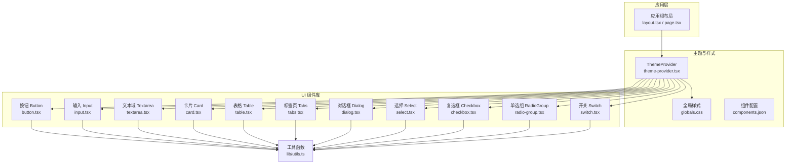

图表来源
- [theme-provider.tsx:1-72](file://frontend/components/theme-provider.tsx#L1-L72)
- [globals.css:1-130](file://frontend/app/globals.css#L1-L130)
- [components.json:1-26](file://frontend/components.json#L1-L26)
- [button.tsx:1-68](file://frontend/components/ui/button.tsx#L1-L68)
- [input.tsx:1-20](file://frontend/components/ui/input.tsx#L1-L20)
- [textarea.tsx:1-19](file://frontend/components/ui/textarea.tsx#L1-L19)
- [card.tsx:1-104](file://frontend/components/ui/card.tsx#L1-L104)
- [table.tsx:1-117](file://frontend/components/ui/table.tsx#L1-L117)
- [tabs.tsx:1-91](file://frontend/components/ui/tabs.tsx#L1-L91)
- [dialog.tsx:1-169](file://frontend/components/ui/dialog.tsx#L1-L169)
- [select.tsx:1-193](file://frontend/components/ui/select.tsx#L1-L193)
- [checkbox.tsx:1-34](file://frontend/components/ui/checkbox.tsx#L1-L34)
- [radio-group.tsx:1-45](file://frontend/components/ui/radio-group.tsx#L1-L45)
- [switch.tsx:1-34](file://frontend/components/ui/switch.tsx#L1-L34)
- [utils.ts:1-7](file://frontend/lib/utils.ts#L1-L7)

章节来源
- [components.json:1-26](file://frontend/components.json#L1-L26)
- [package.json:14-28](file://frontend/package.json#L14-L28)
- [globals.css:1-130](file://frontend/app/globals.css#L1-L130)
- [theme-provider.tsx:1-72](file://frontend/components/theme-provider.tsx#L1-L72)

## 核心组件
本节聚焦组件的标准化结构、属性接口设计与样式系统集成方式，展示如何在统一的变体与尺寸体系下实现一致的外观与交互。

- 统一工具函数：使用 cn(...) 合并类名，确保变体与尺寸类不会相互覆盖。
- 变体与尺寸：通过 class-variance-authority 定义变体与尺寸映射，结合 data-* 属性传递状态，便于 CSS 选择器与 Tailwind 扩展生效。
- Radix UI 原语：大量使用 radix-ui 原语作为底层实现，保证可访问性与可组合性。
- 图标与交互：Lucide 图标库提供一致的视觉语言，交互态通过 focus-visible、aria-* 与 hover 状态统一呈现。

章节来源
- [button.tsx:7-42](file://frontend/components/ui/button.tsx#L7-L42)
- [input.tsx:5-17](file://frontend/components/ui/input.tsx#L5-L17)
- [textarea.tsx:5-15](file://frontend/components/ui/textarea.tsx#L5-L15)
- [utils.ts:4-6](file://frontend/lib/utils.ts#L4-L6)

## 架构总览
下图展示了主题、样式与组件之间的关系，以及组件内部的数据流与可访问性控制点。

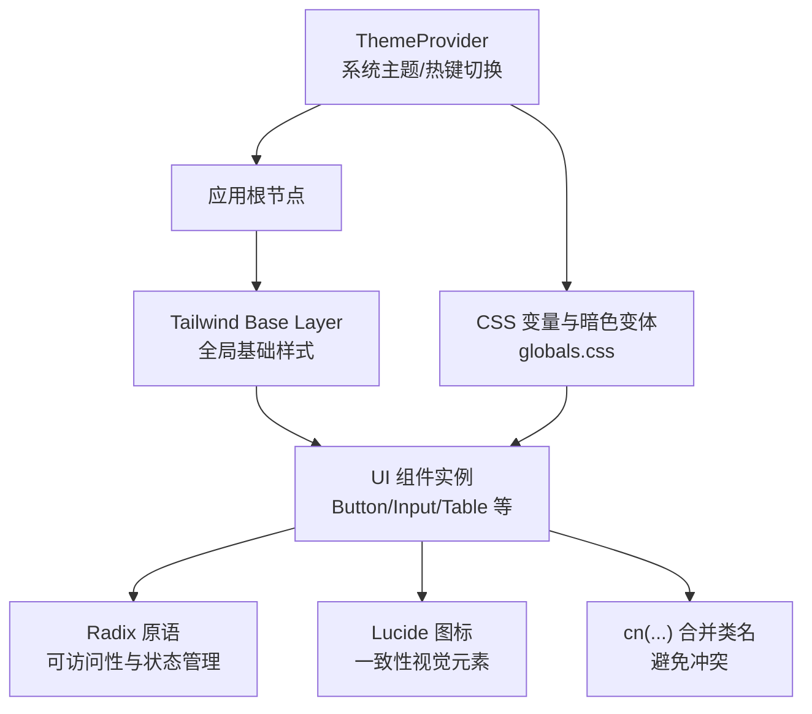

图表来源
- [theme-provider.tsx:6-22](file://frontend/components/theme-provider.tsx#L6-L22)
- [globals.css:119-129](file://frontend/app/globals.css#L119-L129)
- [button.tsx:54-64](file://frontend/components/ui/button.tsx#L54-L64)
- [input.tsx:7-15](file://frontend/components/ui/input.tsx#L7-L15)
- [utils.ts:4-6](file://frontend/lib/utils.ts#L4-L6)

## 组件详解

### 按钮 Button 设计模式
- 结构：支持 asChild 使用原语容器，data-slot 与 data-variant/data-size 标记状态，便于样式与测试定位。
- 变体：default/outline/secondary/ghost/destructive/link，对应主色、描边、次色、透明与危险色系。
- 尺寸：default/xs/sm/lg/icon 及其变体，适配不同密度与图标场景。
- 交互态：聚焦可见边框与环形光晕、禁用半透明与事件拦截、无效状态的破坏性边框与光晕。
- 可访问性：继承原语焦点可见性，支持键盘操作与屏幕阅读器识别。

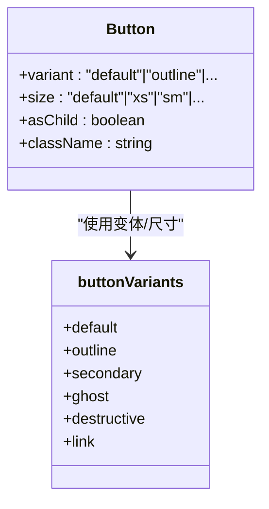

图表来源
- [button.tsx:44-67](file://frontend/components/ui/button.tsx#L44-L67)
- [button.tsx:7-42](file://frontend/components/ui/button.tsx#L7-L42)

章节来源
- [button.tsx:7-42](file://frontend/components/ui/button.tsx#L7-L42)
- [button.tsx:44-67](file://frontend/components/ui/button.tsx#L44-L67)

### 输入 Input 与 Textarea 设计模式
- 输入 Input：统一圆角、边框、背景、占位符颜色与聚焦环；禁用态与无效态分别处理明暗主题。
- 文本域 Textarea：同输入一致的外观与状态反馈，支持多行文本与最小高度约束。
- 可访问性：原生表单控件语义，支持 aria-invalid 与键盘导航。

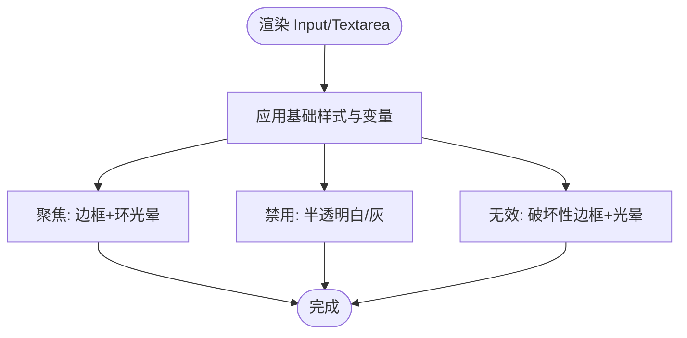

图表来源
- [input.tsx:5-17](file://frontend/components/ui/input.tsx#L5-L17)
- [textarea.tsx:5-15](file://frontend/components/ui/textarea.tsx#L5-L15)

章节来源
- [input.tsx:5-17](file://frontend/components/ui/input.tsx#L5-L17)
- [textarea.tsx:5-15](file://frontend/components/ui/textarea.tsx#L5-L15)

### 卡片 Card 与子块设计模式
- 结构：Card 包裹 Header/Title/Description/Action/Content/Footer，支持 size=sm 缩减间距与内边距。
- 布局：使用栅格与容器查询适配标题与操作区排列，底部带分隔线与背景强调。
- 可访问性：语义化结构，标题层级清晰，Footer 提供操作区域。

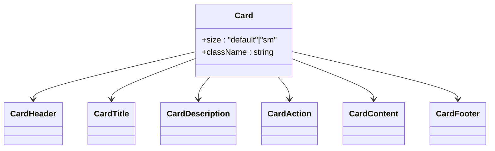

图表来源
- [card.tsx:5-21](file://frontend/components/ui/card.tsx#L5-L21)
- [card.tsx:23-34](file://frontend/components/ui/card.tsx#L23-L34)
- [card.tsx:36-57](file://frontend/components/ui/card.tsx#L36-L57)
- [card.tsx:59-70](file://frontend/components/ui/card.tsx#L59-L70)
- [card.tsx:72-93](file://frontend/components/ui/card.tsx#L72-L93)

章节来源
- [card.tsx:5-21](file://frontend/components/ui/card.tsx#L5-L21)
- [card.tsx:23-34](file://frontend/components/ui/card.tsx#L23-L34)
- [card.tsx:36-57](file://frontend/components/ui/card.tsx#L36-L57)
- [card.tsx:59-70](file://frontend/components/ui/card.tsx#L59-L70)
- [card.tsx:72-93](file://frontend/components/ui/card.tsx#L72-L93)

### 表格 Table 设计模式
- 外观：容器滚动、表头加粗、行悬停与选中态、脚注背景强调。
- 可访问性：行级状态 aria-expanded 与选中态 data-state=selected，支持键盘导航与屏幕阅读器读取。
- 响应式：容器提供横向滚动，避免布局破坏。

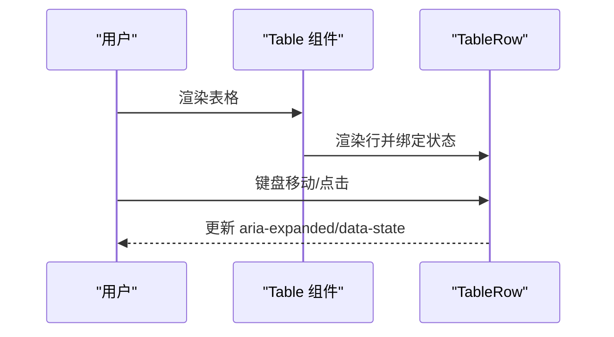

图表来源
- [table.tsx:55-66](file://frontend/components/ui/table.tsx#L55-L66)
- [table.tsx:7-20](file://frontend/components/ui/table.tsx#L7-L20)

章节来源
- [table.tsx:7-20](file://frontend/components/ui/table.tsx#L7-L20)
- [table.tsx:55-66](file://frontend/components/ui/table.tsx#L55-L66)
- [table.tsx:68-92](file://frontend/components/ui/table.tsx#L68-L92)

### 标签页 Tabs 设计模式
- 方向：水平/垂直两种方向，通过 data-orientation 控制布局。
- 列表变体：default 与 line 两种风格，line 风格无背景并在激活时显示指示线。
- 触发器：支持图标内联、禁用态、聚焦可见环与激活态阴影。
- 可访问性：原语触发器与内容区，自动管理焦点与可见性。

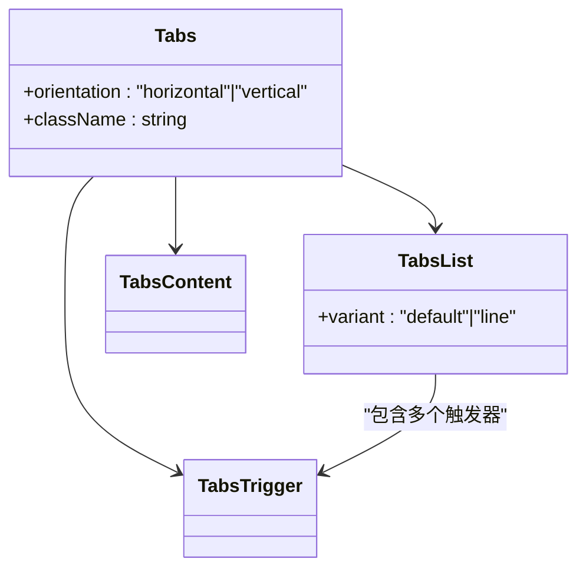

图表来源
- [tabs.tsx:9-25](file://frontend/components/ui/tabs.tsx#L9-L25)
- [tabs.tsx:42-56](file://frontend/components/ui/tabs.tsx#L42-L56)
- [tabs.tsx:58-75](file://frontend/components/ui/tabs.tsx#L58-L75)
- [tabs.tsx:77-88](file://frontend/components/ui/tabs.tsx#L77-L88)

章节来源
- [tabs.tsx:9-25](file://frontend/components/ui/tabs.tsx#L9-L25)
- [tabs.tsx:27-40](file://frontend/components/ui/tabs.tsx#L27-L40)
- [tabs.tsx:42-56](file://frontend/components/ui/tabs.tsx#L42-L56)
- [tabs.tsx:58-75](file://frontend/components/ui/tabs.tsx#L58-L75)
- [tabs.tsx:77-88](file://frontend/components/ui/tabs.tsx#L77-L88)

### 对话框 Dialog 设计模式
- 结构：Root/Trigger/Portal/Overlay/Content/Header/Footer/Title/Description/Close。
- 动画：开合动画与淡入淡出，居中定位与 RTL 支持。
- 关闭：右上角关闭按钮，同时支持 Close 触发器。
- 可访问性：遮罩层阻止背景滚动，内容区获得焦点，支持 ESC 关闭。

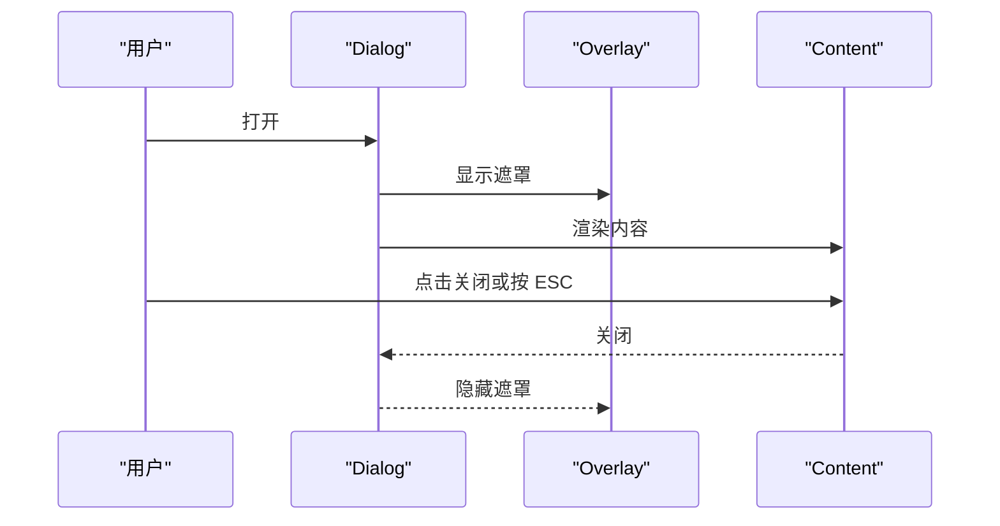

图表来源
- [dialog.tsx:10-14](file://frontend/components/ui/dialog.tsx#L10-L14)
- [dialog.tsx:34-48](file://frontend/components/ui/dialog.tsx#L34-L48)
- [dialog.tsx:50-86](file://frontend/components/ui/dialog.tsx#L50-L86)
- [dialog.tsx:88-123](file://frontend/components/ui/dialog.tsx#L88-L123)
- [dialog.tsx:125-155](file://frontend/components/ui/dialog.tsx#L125-L155)

章节来源
- [dialog.tsx:10-14](file://frontend/components/ui/dialog.tsx#L10-L14)
- [dialog.tsx:34-48](file://frontend/components/ui/dialog.tsx#L34-L48)
- [dialog.tsx:50-86](file://frontend/components/ui/dialog.tsx#L50-L86)
- [dialog.tsx:88-123](file://frontend/components/ui/dialog.tsx#L88-L123)
- [dialog.tsx:125-155](file://frontend/components/ui/dialog.tsx#L125-L155)

### 选择 Select 设计模式
- 触发器：支持 sm/default 尺寸，内置降序图标，支持占位符与无效态。
- 内容区：支持 popper 与 item-aligned 两种定位策略，带上下滚动按钮。
- 选项：带勾选指示器，支持分组、标签与分隔线。
- 可访问性：原语触发器与视口，键盘导航与自动对齐。

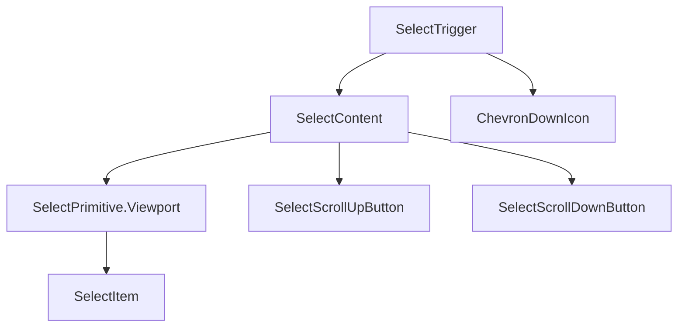

图表来源
- [select.tsx:34-58](file://frontend/components/ui/select.tsx#L34-L58)
- [select.tsx:60-91](file://frontend/components/ui/select.tsx#L60-L91)
- [select.tsx:106-128](file://frontend/components/ui/select.tsx#L106-L128)
- [select.tsx:143-179](file://frontend/components/ui/select.tsx#L143-L179)

章节来源
- [select.tsx:34-58](file://frontend/components/ui/select.tsx#L34-L58)
- [select.tsx:60-91](file://frontend/components/ui/select.tsx#L60-L91)
- [select.tsx:106-128](file://frontend/components/ui/select.tsx#L106-L128)
- [select.tsx:143-179](file://frontend/components/ui/select.tsx#L143-L179)

### 复选框 Checkbox、单选组 RadioGroup、开关 Switch 设计模式
- 复选框：支持禁用、无效、选中态，指示器为勾选图标。
- 单选组：支持禁用、无效、选中态，指示器为实心圆点。
- 开关：支持 sm/default 尺寸，滑块位移与背景色变化，RTL 支持。

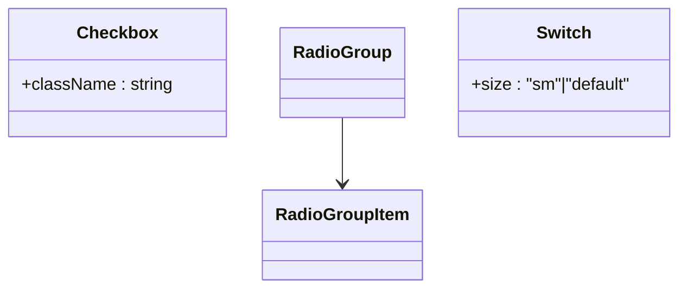

图表来源
- [checkbox.tsx:9-31](file://frontend/components/ui/checkbox.tsx#L9-L31)
- [radio-group.tsx:8-42](file://frontend/components/ui/radio-group.tsx#L8-L42)
- [switch.tsx:8-31](file://frontend/components/ui/switch.tsx#L8-L31)

章节来源
- [checkbox.tsx:9-31](file://frontend/components/ui/checkbox.tsx#L9-L31)
- [radio-group.tsx:8-42](file://frontend/components/ui/radio-group.tsx#L8-L42)
- [switch.tsx:8-31](file://frontend/components/ui/switch.tsx#L8-L31)

## 依赖关系分析
- 组件依赖：所有组件均依赖 utils/cn(...) 进行类名合并；部分组件依赖 Lucide 图标与 Radix UI 原语。
- 主题与样式：globals.css 注入 shadcn/tailwind.css 并定义 CSS 变量与暗色变体；ThemeProvider 负责主题切换与热键。
- 配置：components.json 指定样式风格、Tailwind 配置、图标库与别名，确保组件生成与样式一致性。

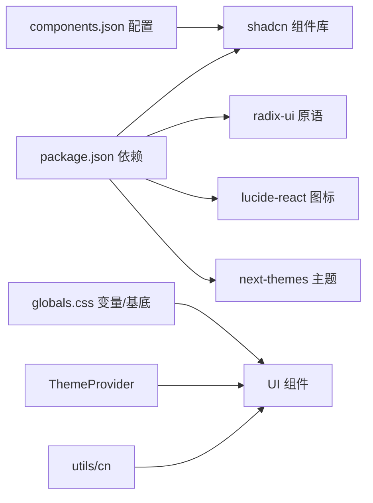

图表来源
- [package.json:14-28](file://frontend/package.json#L14-L28)
- [components.json:1-26](file://frontend/components.json#L1-L26)
- [globals.css:1-130](file://frontend/app/globals.css#L1-L130)
- [theme-provider.tsx:1-72](file://frontend/components/theme-provider.tsx#L1-L72)
- [utils.ts:1-7](file://frontend/lib/utils.ts#L1-L7)

章节来源
- [package.json:14-28](file://frontend/package.json#L14-L28)
- [components.json:1-26](file://frontend/components.json#L1-L26)
- [globals.css:1-130](file://frontend/app/globals.css#L1-L130)
- [theme-provider.tsx:1-72](file://frontend/components/theme-provider.tsx#L1-L72)
- [utils.ts:1-7](file://frontend/lib/utils.ts#L1-L7)

## 性能考量
- 类名合并：使用 twMerge 在重复类名时进行智能合并，减少样式冲突与冗余计算。
- 原语渲染：Radix 原语按需渲染与卸载，避免不必要的 DOM 节点。
- 动画与过渡：组件动画时长较短，避免阻塞主线程；遮罩与弹窗仅在打开时挂载。
- 主题切换：next-themes 通过类名切换，避免重绘大范围区域。

## 故障排查指南
- 主题不生效
  - 检查 ThemeProvider 是否包裹应用根节点。
  - 确认 globals.css 已引入并存在 CSS 变量定义。
- 焦点与键盘导航异常
  - 确保使用原语触发器与内容区，避免自定义容器破坏焦点顺序。
  - 检查禁用态与无效态是否正确设置 aria-* 属性。
- 样式冲突
  - 使用 data-slot 与 data-variant/data-size 标记组件状态，避免直接覆盖类名。
  - 通过 cn(...) 合并类名，避免重复样式导致的优先级问题。
- 弹窗无法关闭
  - 确认 DialogOverlay 与 DialogContent 的 Portal 结构完整，Close 触发器可用。

章节来源
- [theme-provider.tsx:6-22](file://frontend/components/theme-provider.tsx#L6-L22)
- [globals.css:119-129](file://frontend/app/globals.css#L119-L129)
- [dialog.tsx:50-86](file://frontend/components/ui/dialog.tsx#L50-L86)

## 结论
本项目以 shadcn/ui 为核心，结合 Radix 原语、Lucide 图标与 Tailwind CSS 变量，构建了高可访问性、强一致性的 UI 组件体系。通过统一的变体/尺寸规范、数据属性标记与类名合并策略，实现了良好的可维护性与扩展性。主题系统与样式覆盖机制进一步提升了定制能力。建议在新增组件时遵循现有模式，保持一致的属性命名、状态标记与无障碍语义。

## 附录
- 最佳实践清单
  - 使用 data-slot/data-variant/data-size 标记组件状态，便于样式与测试定位。
  - 优先使用原语触发器与内容区，确保键盘导航与屏幕阅读器支持。
  - 通过 cn(...) 合并类名，避免重复样式与优先级冲突。
  - 为表单控件提供 aria-invalid 与错误提示，增强可访问性。
  - 对弹窗与下拉菜单等浮层组件，确保遮罩层与焦点管理正确。
  - 主题切换时关注暗色变体下的对比度与可读性。