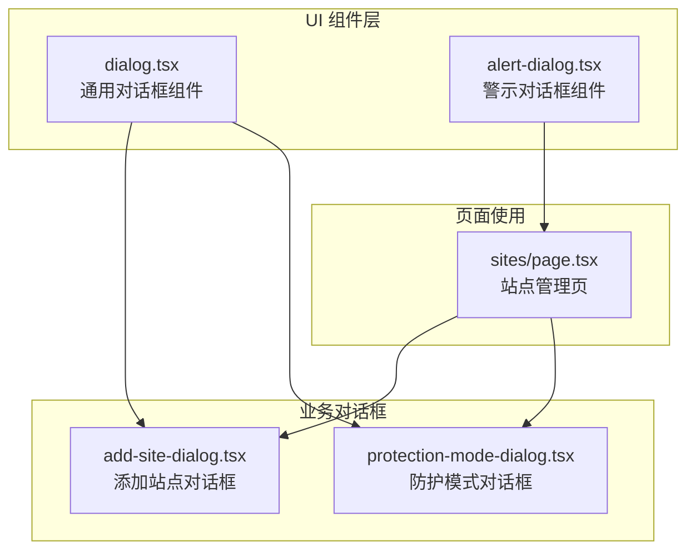
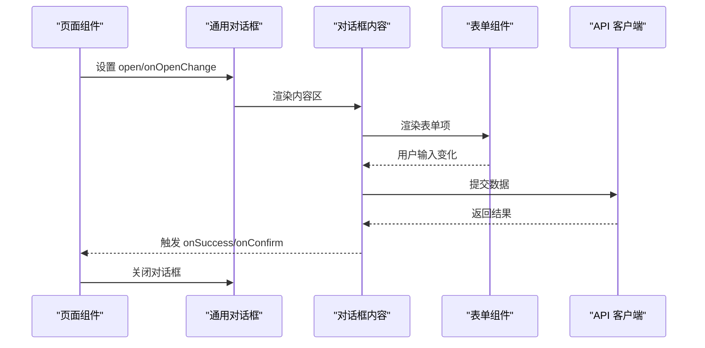
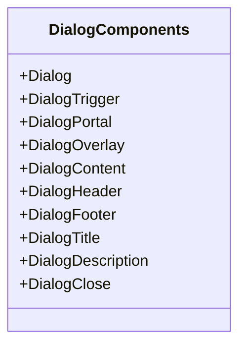
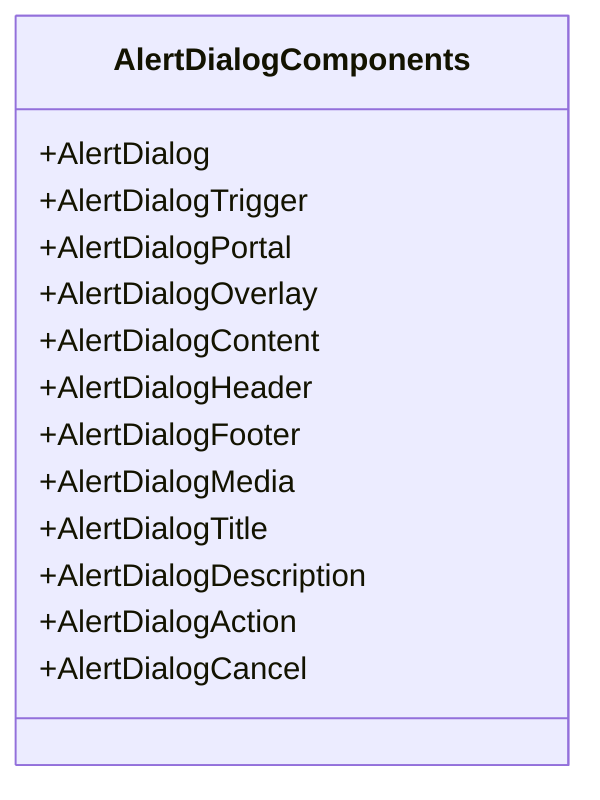
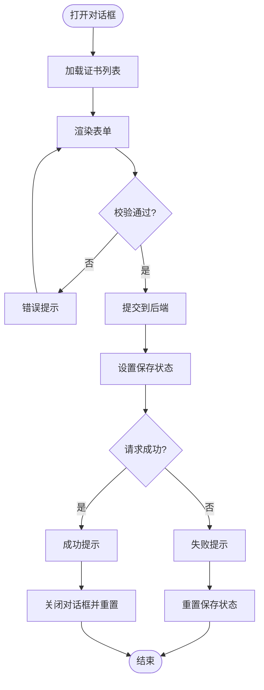
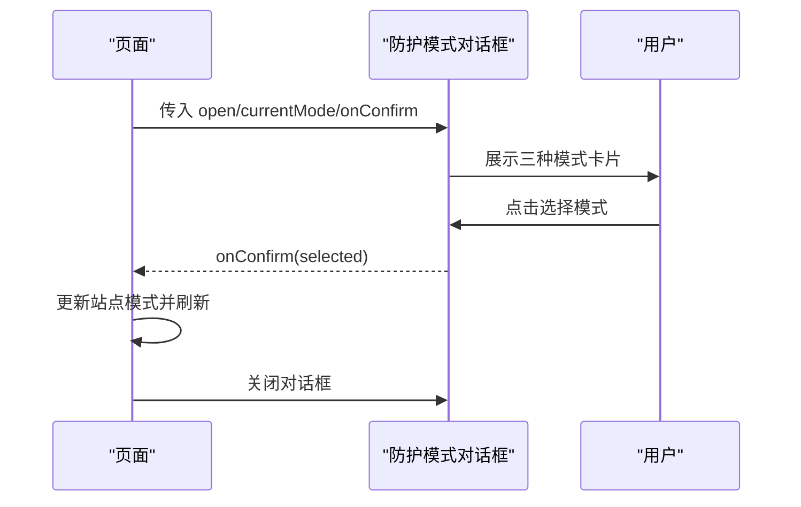
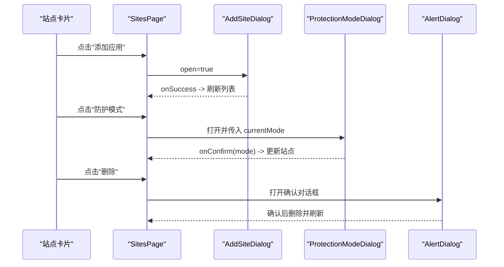
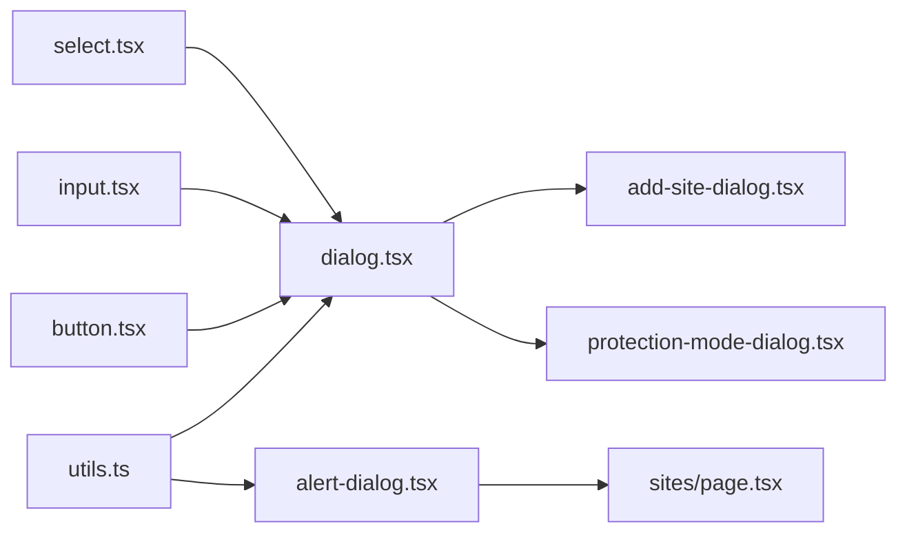

# 对话框组件

<cite>
**本文档引用的文件**
- [frontend/components/ui/dialog.tsx](file://frontend/components/ui/dialog.tsx)
- [frontend/components/ui/alert-dialog.tsx](file://frontend/components/ui/alert-dialog.tsx)
- [frontend/components/add-site-dialog.tsx](file://frontend/components/add-site-dialog.tsx)
- [frontend/components/protection-mode-dialog.tsx](file://frontend/components/protection-mode-dialog.tsx)
- [frontend/app/(dashboard)/sites/page.tsx](file://frontend/app/(dashboard)/sites/page.tsx)
- [frontend/lib/api.ts](file://frontend/lib/api.ts)
- [frontend/lib/utils.ts](file://frontend/lib/utils.ts)
- [frontend/lib/site-upstreams.ts](file://frontend/lib/site-upstreams.ts)
- [frontend/components/multi-host-input.tsx](file://frontend/components/multi-host-input.tsx)
- [frontend/app/globals.css](file://frontend/app/globals.css)
</cite>

## 目录
1. [简介](#简介)
2. [项目结构](#项目结构)
3. [核心组件](#核心组件)
4. [架构总览](#架构总览)
5. [详细组件分析](#详细组件分析)
6. [依赖关系分析](#依赖关系分析)
7. [性能考虑](#性能考虑)
8. [故障排除指南](#故障排除指南)
9. [结论](#结论)
10. [附录](#附录)

## 简介
本文件系统性地梳理了项目中的对话框组件体系，涵盖模态对话框的设计模式与生命周期管理、打开/关闭状态控制、背景遮罩处理；对话框通用结构（标题、内容区域、操作按钮、关闭机制）；表单验证在对话框中的实现方式；尺寸控制与响应式设计策略；组件复用模式与参数传递；以及不同类型的对话框实现示例与使用场景。通过对基础对话框组件、警示对话框组件、业务对话框组件的深入分析，帮助开发者创建一致且易用的模态交互体验。

## 项目结构
对话框组件主要位于前端组件目录中，采用分层组织：
- 基础 UI 组件：提供通用的对话框容器与子组件（标题、描述、头部、底部、覆盖层等）
- 业务对话框：基于基础组件封装的业务对话框（如"添加站点"、"防护模式选择"）
- 页面级使用：在具体页面中组合使用对话框组件，实现交互流程

**图表来源**
- [frontend/components/ui/dialog.tsx:1-169](file://frontend/components/ui/dialog.tsx#L1-L169)
- [frontend/components/ui/alert-dialog.tsx:1-200](file://frontend/components/ui/alert-dialog.tsx#L1-L200)
- [frontend/components/add-site-dialog.tsx:1-372](file://frontend/components/add-site-dialog.tsx#L1-L372)
- [frontend/components/protection-mode-dialog.tsx:1-110](file://frontend/components/protection-mode-dialog.tsx#L1-L110)
- [frontend/app/(dashboard)/sites/page.tsx](file://frontend/app/(dashboard)/sites/page.tsx#L1-L246)

**章节来源**
- [frontend/components/ui/dialog.tsx:1-169](file://frontend/components/ui/dialog.tsx#L1-L169)
- [frontend/components/ui/alert-dialog.tsx:1-200](file://frontend/components/ui/alert-dialog.tsx#L1-L200)
- [frontend/components/add-site-dialog.tsx:1-372](file://frontend/components/add-site-dialog.tsx#L1-L372)
- [frontend/components/protection-mode-dialog.tsx:1-110](file://frontend/components/protection-mode-dialog.tsx#L1-L110)
- [frontend/app/(dashboard)/sites/page.tsx](file://frontend/app/(dashboard)/sites/page.tsx#L1-L246)

## 核心组件
- 通用对话框（Dialog）：基于 Radix UI 的对话框原语，提供根节点、触发器、传送门、覆盖层、内容区、标题、描述、头部、底部、关闭按钮等子组件，支持动画入场/出场、键盘无障碍、焦点管理等。
- 警示对话框（AlertDialog）：用于重要操作确认，强调危险动作，提供默认/小号尺寸、媒体槽位、操作按钮变体等。
- 业务对话框：
  - 添加站点对话框（AddSiteDialog）：包含表单字段校验、异步加载证书列表、提交处理与反馈。
  - 防护模式对话框（ProtectionModeDialog）：用于切换站点的防护模式，提供三种模式的可视化选择。

**章节来源**
- [frontend/components/ui/dialog.tsx:10-169](file://frontend/components/ui/dialog.tsx#L10-L169)
- [frontend/components/ui/alert-dialog.tsx:9-200](file://frontend/components/ui/alert-dialog.tsx#L9-L200)
- [frontend/components/add-site-dialog.tsx:30-372](file://frontend/components/add-site-dialog.tsx#L30-L372)
- [frontend/components/protection-mode-dialog.tsx:17-110](file://frontend/components/protection-mode-dialog.tsx#L17-L110)

## 架构总览
对话框组件遵循"基础组件 + 业务组件 + 页面使用"的分层架构。基础组件负责通用行为与样式，业务组件封装特定业务逻辑，页面通过状态管理驱动对话框的打开/关闭与数据流转。

**图表来源**
- [frontend/components/ui/dialog.tsx:50-86](file://frontend/components/ui/dialog.tsx#L50-L86)
- [frontend/components/add-site-dialog.tsx:82-162](file://frontend/components/add-site-dialog.tsx#L82-L162)
- [frontend/app/(dashboard)/sites/page.tsx](file://frontend/app/(dashboard)/sites/page.tsx#L224-L224)

## 详细组件分析

### 通用对话框组件（Dialog）
- 设计要点
  - 使用 Portal 将内容渲染到文档根部，避免层级与定位问题
  - Overlay 支持淡入淡出与缩放动画，提供视觉反馈
  - 内容区默认居中定位，支持最大宽度与滚动区域
  - 可选关闭按钮，支持隐藏/显示
- 生命周期与状态
  - 通过 open/onOpenChange 控制打开/关闭
  - 关闭时可重置表单状态（由业务组件自行决定）
- 结构组成
  - DialogRoot/Trigger/Portal/Overlay/Content/Title/Description/Header/Footer/Close
- 尺寸与响应式
  - sm/max-w-sm 等类名控制宽度，配合 max-w-xs/sm:max-w-sm 实现响应式
  - 内容区支持最大高度与滚动，适合长表单

**图表来源**
- [frontend/components/ui/dialog.tsx:10-169](file://frontend/components/ui/dialog.tsx#L10-L169)

**章节来源**
- [frontend/components/ui/dialog.tsx:34-86](file://frontend/components/ui/dialog.tsx#L34-L86)
- [frontend/lib/utils.ts:4-7](file://frontend/lib/utils.ts#L4-L7)

### 警示对话框组件（AlertDialog）
- 设计要点
  - 强调危险操作，提供默认/小号两种尺寸
  - 支持媒体槽位（图标等），标题与描述对齐方式随尺寸变化
  - 动画与布局针对警示场景优化
- 使用场景
  - 删除确认、危险操作二次确认等

**图表来源**
- [frontend/components/ui/alert-dialog.tsx:9-200](file://frontend/components/ui/alert-dialog.tsx#L9-L200)

**章节来源**
- [frontend/components/ui/alert-dialog.tsx:31-100](file://frontend/components/ui/alert-dialog.tsx#L31-L100)

### 添加站点对话框（AddSiteDialog）
- 表单结构
  - 域名、端口/协议切换、HTTPS 证书选择、上游服务器列表、应用名称
- 表单验证与错误提示
  - 域名必填校验，至少一个上游服务器
  - 使用通知组件进行错误提示与成功反馈
- 提交处理
  - 保存状态、序列化上游服务器数组、调用 API 创建站点
  - 成功后重置表单、关闭对话框并刷新列表
- 生命周期
  - 打开时拉取证书列表；关闭时重置表单

**图表来源**
- [frontend/components/add-site-dialog.tsx:41-162](file://frontend/components/add-site-dialog.tsx#L41-L162)

**章节来源**
- [frontend/components/add-site-dialog.tsx:30-162](file://frontend/components/add-site-dialog.tsx#L30-L162)
- [frontend/app/(dashboard)/sites/page.tsx](file://frontend/app/(dashboard)/sites/page.tsx#L224-L224)

### 防护模式对话框（ProtectionModeDialog）
- 交互设计
  - 三种模式卡片化展示，支持选中态高亮
  - 确认回调返回所选模式
- 参数传递
  - open/onOpenChange 控制显示/隐藏
  - currentMode 初始选中项
  - onConfirm 处理确认逻辑
  - loading 控制确认按钮禁用状态

**图表来源**
- [frontend/components/protection-mode-dialog.tsx:46-99](file://frontend/components/protection-mode-dialog.tsx#L46-L99)
- [frontend/app/(dashboard)/sites/page.tsx](file://frontend/app/(dashboard)/sites/page.tsx#L224-L224)

**章节来源**
- [frontend/components/protection-mode-dialog.tsx:17-99](file://frontend/components/protection-mode-dialog.tsx#L17-L99)

### 页面级使用示例
#### 站点管理页（SitesPage）
- 使用 AddSiteDialog 进行新增
- 使用 ProtectionModeDialog 切换防护模式
- 使用 AlertDialog 进行删除确认

**图表来源**
- [frontend/app/(dashboard)/sites/page.tsx](file://frontend/app/(dashboard)/sites/page.tsx#L224-L242)

**章节来源**
- [frontend/app/(dashboard)/sites/page.tsx](file://frontend/app/(dashboard)/sites/page.tsx#L1-L246)

## 依赖关系分析
- 组件依赖
  - 业务对话框依赖通用对话框组件
  - 页面通过状态管理控制对话框的 open/onOpenChange
  - 表单组件（输入、选择、开关等）与对话框内容区组合
- 外部依赖
  - Radix UI 提供对话框原语与无障碍能力
  - Tailwind CSS 与工具函数 cn 控制样式与类名合并
  - 通知组件用于错误与成功提示

**图表来源**
- [frontend/lib/utils.ts:4-7](file://frontend/lib/utils.ts#L4-L7)
- [frontend/components/ui/dialog.tsx:1-169](file://frontend/components/ui/dialog.tsx#L1-L169)
- [frontend/components/ui/alert-dialog.tsx:1-200](file://frontend/components/ui/alert-dialog.tsx#L1-L200)
- [frontend/components/add-site-dialog.tsx:1-372](file://frontend/components/add-site-dialog.tsx#L1-L372)
- [frontend/components/protection-mode-dialog.tsx:1-110](file://frontend/components/protection-mode-dialog.tsx#L1-L110)
- [frontend/app/(dashboard)/sites/page.tsx](file://frontend/app/(dashboard)/sites/page.tsx#L1-L246)
- [frontend/components/ui/button.tsx:1-68](file://frontend/components/ui/button.tsx#L1-L68)
- [frontend/components/ui/input.tsx:1-20](file://frontend/components/ui/input.tsx#L1-L20)
- [frontend/components/ui/select.tsx:1-193](file://frontend/components/ui/select.tsx#L1-L193)

**章节来源**
- [frontend/lib/utils.ts:4-7](file://frontend/lib/utils.ts#L4-L7)
- [frontend/components/ui/dialog.tsx:1-169](file://frontend/components/ui/dialog.tsx#L1-L169)
- [frontend/components/ui/alert-dialog.tsx:1-200](file://frontend/components/ui/alert-dialog.tsx#L1-L200)
- [frontend/components/add-site-dialog.tsx:1-372](file://frontend/components/add-site-dialog.tsx#L1-L372)
- [frontend/components/protection-mode-dialog.tsx:1-110](file://frontend/components/protection-mode-dialog.tsx#L1-L110)
- [frontend/app/(dashboard)/sites/page.tsx](file://frontend/app/(dashboard)/sites/page.tsx#L1-L246)

## 性能考虑
- 动画与渲染
  - 对话框使用轻量动画入场/出场，避免复杂计算
  - 内容区支持滚动与最大高度，防止布局抖动
- 状态管理
  - 通过 open/onOpenChange 精准控制渲染与事件绑定
  - 关闭时重置表单状态，避免残留数据影响下次打开
- 请求与缓存
  - 异步选项（如证书列表）在打开时拉取并缓存，减少重复请求
- 样式合并
  - 使用工具函数合并类名，避免冗余样式

## 故障排除指南
- 对话框无法关闭
  - 检查父组件是否正确传递 onOpenChange 并在关闭时重置状态
  - 确认未被其他状态阻塞（如保存中 loading）
- 表单校验无效
  - 确保在提交前执行校验逻辑，必要时使用通知组件提示
  - 检查字段值是否正确更新（受控组件）
- 选项未显示
  - 确认异步选项已成功拉取并写入缓存
  - 检查字段定义与 API 返回结构一致
- 动画异常
  - 检查类名拼接与动画类是否正确引入
  - 确认未被全局样式覆盖

**章节来源**
- [frontend/components/add-site-dialog.tsx:82-162](file://frontend/components/add-site-dialog.tsx#L82-L162)
- [frontend/components/protection-mode-dialog.tsx:46-99](file://frontend/components/protection-mode-dialog.tsx#L46-L99)
- [frontend/components/ui/dialog.tsx:34-86](file://frontend/components/ui/dialog.tsx#L34-L86)

## 结论
本项目对话框组件体系以通用组件为基础，结合业务对话框与页面使用，实现了统一的模态交互体验。通过清晰的状态管理、表单验证与错误提示、尺寸控制与响应式设计，以及良好的复用模式与参数传递，满足了多样化的业务需求。建议在扩展新对话框时遵循现有模式，确保一致性与可维护性。

## 附录
- 组件属性与行为参考
  - 通用对话框：根节点、触发器、传送门、覆盖层、内容区、标题、描述、头部、底部、关闭按钮
  - 警示对话框：根节点、触发器、传送门、覆盖层、内容区（默认/小号）、头部、底部、媒体槽位、标题、描述、操作按钮、取消按钮
  - 业务对话框：AddSiteDialog、ProtectionModeDialog
  - 页面使用：SitesPage