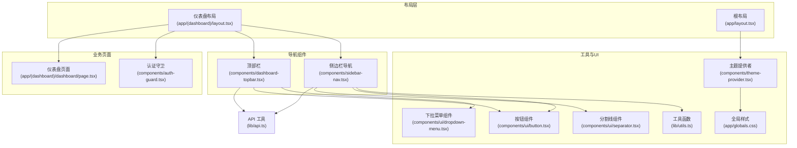
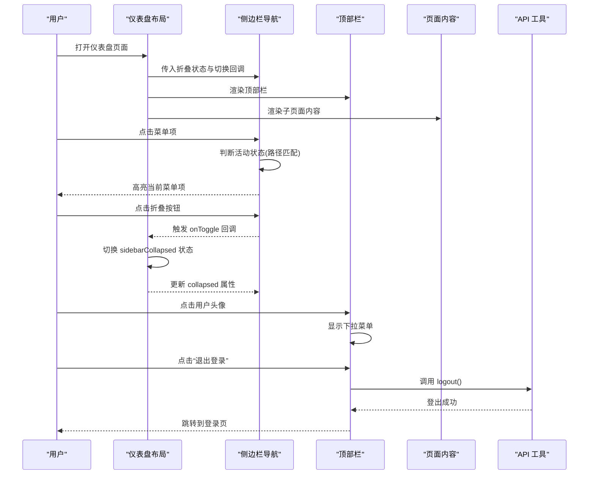
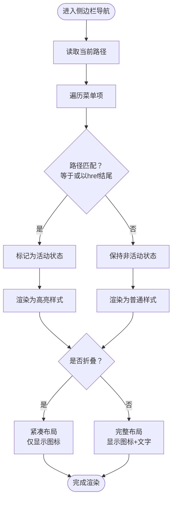
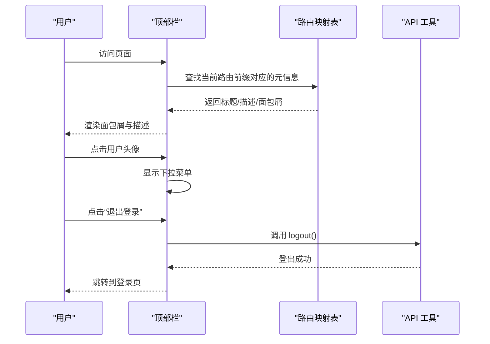
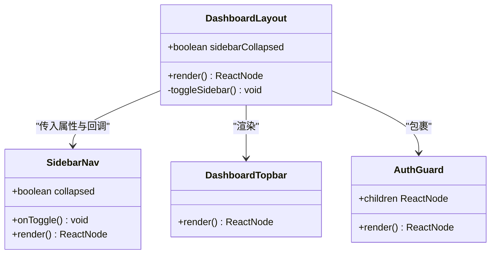
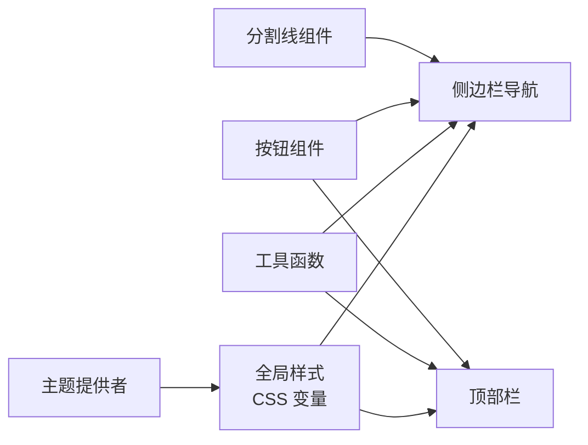
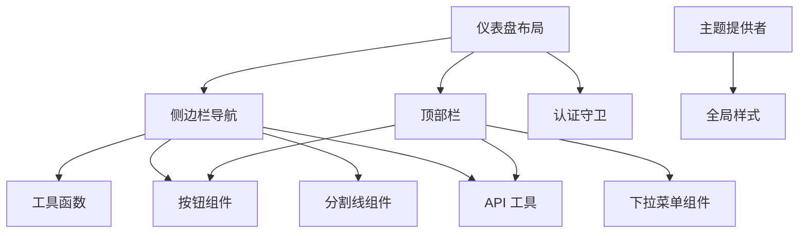

# 导航组件

<cite>
**本文档引用的文件**
- [sidebar-nav.tsx](file://frontend/components/sidebar-nav.tsx)
- [dashboard-topbar.tsx](file://frontend/components/dashboard-topbar.tsx)
- [layout.tsx](file://frontend/app/(dashboard)/layout.tsx)
- [layout.tsx](file://frontend/app/layout.tsx)
- [utils.ts](file://frontend/lib/utils.ts)
- [api.ts](file://frontend/lib/api.ts)
- [button.tsx](file://frontend/components/ui/button.tsx)
- [dropdown-menu.tsx](file://frontend/components/ui/dropdown-menu.tsx)
- [separator.tsx](file://frontend/components/ui/separator.tsx)
- [theme-provider.tsx](file://frontend/components/theme-provider.tsx)
- [globals.css](file://frontend/app/globals.css)
- [page.tsx](file://frontend/app/(dashboard)/dashboard/page.tsx)
- [auth-guard.tsx](file://frontend/components/auth-guard.tsx)
</cite>

## 目录
1. [简介](#简介)
2. [项目结构](#项目结构)
3. [核心组件](#核心组件)
4. [架构总览](#架构总览)
5. [详细组件分析](#详细组件分析)
6. [依赖关系分析](#依赖关系分析)
7. [性能考虑](#性能考虑)
8. [故障排除指南](#故障排除指南)
9. [结论](#结论)
10. [附录](#附录)

## 简介
本文件系统性地介绍了 My-OpenWaf 前端中的导航组件体系，包括侧边栏导航与顶部栏组件的设计与实现。内容涵盖菜单项配置、活动状态管理、响应式布局、状态管理（展开/收起、当前选中项、路由同步）、样式定制与主题适配、以及与页面组件的集成方式，并提供可扩展的配置示例与实践建议。

## 项目结构
导航组件位于前端目录的组件层，采用功能模块化组织：
- 侧边栏导航：负责主菜单项渲染、活动状态高亮、折叠切换与登出操作
- 顶部栏：负责面包屑标题、用户下拉菜单与登出
- 布局容器：在仪表盘布局中组合导航组件与页面内容
- 工具与UI：提供类名合并、按钮、分割线、下拉菜单等基础能力
- 主题系统：通过主题提供者与CSS变量实现明暗主题与颜色定制

**图表来源**
- [layout.tsx](file://frontend/app/(dashboard)/layout.tsx#L9-L33)
- [layout.tsx:23-39](file://frontend/app/layout.tsx#L23-L39)
- [sidebar-nav.tsx:47-119](file://frontend/components/sidebar-nav.tsx#L47-L119)
- [dashboard-topbar.tsx:36-76](file://frontend/components/dashboard-topbar.tsx#L36-L76)
- [utils.ts:4-6](file://frontend/lib/utils.ts#L4-L6)
- [button.tsx:44-65](file://frontend/components/ui/button.tsx#L44-L65)
- [separator.tsx:8-25](file://frontend/components/ui/separator.tsx#L8-L25)
- [dropdown-menu.tsx:9-51](file://frontend/components/ui/dropdown-menu.tsx#L9-L51)
- [theme-provider.tsx:6-22](file://frontend/components/theme-provider.tsx#L6-L22)
- [globals.css:7-48](file://frontend/app/globals.css#L7-L48)
- [page.tsx](file://frontend/app/(dashboard)/dashboard/page.tsx#L59-L384)
- [auth-guard.tsx:7-39](file://frontend/components/auth-guard.tsx#L7-L39)

**章节来源**
- [layout.tsx](file://frontend/app/(dashboard)/layout.tsx#L9-L33)
- [layout.tsx:23-39](file://frontend/app/layout.tsx#L23-L39)

## 核心组件
- 侧边栏导航（SidebarNav）
  - 职责：渲染固定菜单项、根据路径计算活动状态、支持折叠/展开、提供登出入口
  - 关键点：使用路径匹配判断活动项；根据折叠状态调整布局与提示文本；调用登出接口并跳转登录页
- 顶部栏（DashboardTopbar）
  - 职责：根据当前路由生成面包屑标题与描述；提供用户下拉菜单与登出入口
  - 关键点：基于路由前缀映射生成面包屑；使用下拉菜单组件与按钮组件；调用登出接口并跳转登录页
- 布局容器（DashboardLayout）
  - 职责：管理侧边栏折叠状态；组合导航组件与页面内容；包裹认证守卫与通知组件
  - 关键点：本地状态控制折叠；将子页面内容渲染在右侧区域

**章节来源**
- [sidebar-nav.tsx:47-119](file://frontend/components/sidebar-nav.tsx#L47-L119)
- [dashboard-topbar.tsx:36-76](file://frontend/components/dashboard-topbar.tsx#L36-L76)
- [layout.tsx](file://frontend/app/(dashboard)/layout.tsx#L9-L33)

## 架构总览
导航组件与页面的关系如下：

**图表来源**
- [layout.tsx](file://frontend/app/(dashboard)/layout.tsx#L14-L32)
- [sidebar-nav.tsx:47-119](file://frontend/components/sidebar-nav.tsx#L47-L119)
- [dashboard-topbar.tsx:36-76](file://frontend/components/dashboard-topbar.tsx#L36-L76)
- [api.ts:106-114](file://frontend/lib/api.ts#L106-L114)

## 详细组件分析

### 侧边栏导航组件（SidebarNav）
- 菜单项配置
  - 菜单项数组定义了链接、标签与图标，覆盖仪表盘、站点管理、防护设置、规则与策略、系统设置等模块
  - 活动状态判断：当当前路径等于菜单项 href 或以该 href 结尾并带一个额外斜杠时视为激活
  - 折叠模式：在折叠状态下隐藏文字与部分元素，仅保留图标与居中布局
- 状态管理
  - 外部传入 collapsed 与 onToggle，由父组件控制折叠状态
  - 使用路径钩子进行活动状态判断，无需外部存储
- 登出流程
  - 点击底部登出按钮时调用登出接口，清除本地令牌并跳转登录页
- 样式与主题
  - 使用工具函数合并类名，支持折叠宽度切换与悬停高亮
  - 通过主题提供者与CSS变量实现明暗主题下的颜色一致性

**图表来源**
- [sidebar-nav.tsx:79-100](file://frontend/components/sidebar-nav.tsx#L79-L100)
- [sidebar-nav.tsx:81-92](file://frontend/components/sidebar-nav.tsx#L81-L92)

**章节来源**
- [sidebar-nav.tsx:27-40](file://frontend/components/sidebar-nav.tsx#L27-L40)
- [sidebar-nav.tsx:47-119](file://frontend/components/sidebar-nav.tsx#L47-L119)
- [utils.ts:4-6](file://frontend/lib/utils.ts#L4-L6)

### 顶部栏组件（DashboardTopbar）
- 面包屑与标题
  - 通过路由前缀映射表确定当前页面的面包屑标题与描述
  - 默认回退到控制台元信息，确保未匹配路由也能正确显示
- 用户下拉菜单
  - 使用下拉菜单组件与按钮组件，提供“管理员账户”标签与“退出登录”选项
  - 点击后触发登出流程并跳转登录页
- 响应式布局
  - 在小屏设备上，标题与下拉菜单会自动换行与自适应

**图表来源**
- [dashboard-topbar.tsx:17-34](file://frontend/components/dashboard-topbar.tsx#L17-L34)
- [dashboard-topbar.tsx:36-76](file://frontend/components/dashboard-topbar.tsx#L36-L76)
- [api.ts:106-114](file://frontend/lib/api.ts#L106-L114)

**章节来源**
- [dashboard-topbar.tsx:17-34](file://frontend/components/dashboard-topbar.tsx#L17-L34)
- [dashboard-topbar.tsx:36-76](file://frontend/components/dashboard-topbar.tsx#L36-L76)

### 布局容器（DashboardLayout）
- 组件职责
  - 维护侧边栏折叠状态，向子组件传递属性与回调
  - 将导航组件与页面内容组合，提供统一的页面骨架
  - 包裹认证守卫，确保未登录用户被重定向至登录页
- 响应式设计
  - 使用 Flex 布局与最小高度约束，保证侧边栏与内容区在不同屏幕尺寸下合理排布

**图表来源**
- [layout.tsx](file://frontend/app/(dashboard)/layout.tsx#L9-L33)
- [sidebar-nav.tsx:42-45](file://frontend/components/sidebar-nav.tsx#L42-L45)
- [auth-guard.tsx:7-39](file://frontend/components/auth-guard.tsx#L7-L39)

**章节来源**
- [layout.tsx](file://frontend/app/(dashboard)/layout.tsx#L9-L33)

### 状态管理与路由同步
- 活动状态管理
  - 侧边栏通过当前路径与菜单项 href 进行精确匹配，支持以斜杠结尾的前缀匹配，确保子路由也能高亮父菜单
- 折叠状态管理
  - 折叠状态由父组件持有，通过 props 传入与回调触发，实现受控组件模式
- 路由同步
  - 组件不直接操作浏览器历史，而是通过导航链接触发路由变化，保持与 Next.js 路由行为一致

**章节来源**
- [sidebar-nav.tsx:80-82](file://frontend/components/sidebar-nav.tsx#L80-L82)

### 样式定制与主题适配
- 类名合并
  - 使用工具函数合并 Tailwind 与组件特定类名，确保样式可组合且易于覆盖
- 主题系统
  - 通过主题提供者与 CSS 变量实现明暗主题切换，侧边栏背景色、边框色与文字色随主题自动调整
- UI 组件复用
  - 按钮与分割线组件提供一致的视觉与交互体验，减少重复样式逻辑

**图表来源**
- [theme-provider.tsx:6-22](file://frontend/components/theme-provider.tsx#L6-L22)
- [globals.css:7-48](file://frontend/app/globals.css#L7-L48)
- [utils.ts:4-6](file://frontend/lib/utils.ts#L4-L6)
- [button.tsx:44-65](file://frontend/components/ui/button.tsx#L44-L65)
- [separator.tsx:8-25](file://frontend/components/ui/separator.tsx#L8-L25)

**章节来源**
- [theme-provider.tsx:6-22](file://frontend/components/theme-provider.tsx#L6-L22)
- [globals.css:7-48](file://frontend/app/globals.css#L7-L48)

### 与其他页面组件的集成
- 页面内容渲染
  - 布局容器将页面内容渲染在侧边栏与顶部栏之后，形成完整的页面骨架
- 认证集成
  - 认证守卫在进入仪表盘布局时检查令牌，若不存在则重定向至登录页
- 通知与提示
  - 布局容器内包含通知组件，用于展示登出后的提示信息

**章节来源**
- [layout.tsx](file://frontend/app/(dashboard)/layout.tsx#L17-L31)
- [auth-guard.tsx:7-39](file://frontend/components/auth-guard.tsx#L7-L39)

## 依赖关系分析
- 组件间依赖
  - 侧边栏导航依赖工具函数、按钮与分割线组件，同时依赖 API 工具进行登出
  - 顶部栏依赖下拉菜单与按钮组件，同时依赖 API 工具进行登出
  - 布局容器依赖导航组件与认证守卫
- 外部依赖
  - Next.js 路由钩子用于路径判断与跳转
  - shadcn/ui 组件库提供统一的 UI 基础
  - 主题系统通过 CSS 变量与主题提供者实现

**图表来源**
- [sidebar-nav.tsx:3-25](file://frontend/components/sidebar-nav.tsx#L3-L25)
- [dashboard-topbar.tsx:3-15](file://frontend/components/dashboard-topbar.tsx#L3-L15)
- [layout.tsx](file://frontend/app/(dashboard)/layout.tsx#L4-L7)
- [theme-provider.tsx:4-17](file://frontend/components/theme-provider.tsx#L4-L17)

**章节来源**
- [sidebar-nav.tsx:3-25](file://frontend/components/sidebar-nav.tsx#L3-L25)
- [dashboard-topbar.tsx:3-15](file://frontend/components/dashboard-topbar.tsx#L3-L15)
- [layout.tsx](file://frontend/app/(dashboard)/layout.tsx#L4-L7)

## 性能考虑
- 路由匹配复杂度
  - 活动状态判断为线性扫描菜单项数组，适合中小规模菜单（当前约 12 项），性能开销可忽略
- 渲染优化
  - 折叠状态切换仅影响侧边栏宽度与文本显示，不会触发深层重渲染
  - 使用工具函数合并类名避免不必要的样式对象创建
- 主题切换
  - CSS 变量切换比动态样式替换更高效，主题切换流畅

## 故障排除指南
- 登出后未跳转登录页
  - 检查登出接口调用是否成功，确认令牌已清除
  - 确认路由跳转逻辑是否执行
- 活动菜单项未高亮
  - 检查当前路径与菜单项 href 的匹配规则，确保末尾斜杠处理一致
- 折叠状态不生效
  - 确认父组件传入的 collapsed 与 onToggle 是否正确更新状态
- 主题颜色异常
  - 检查主题提供者配置与 CSS 变量是否正确加载

**章节来源**
- [api.ts:106-114](file://frontend/lib/api.ts#L106-L114)
- [sidebar-nav.tsx:80-82](file://frontend/components/sidebar-nav.tsx#L80-L82)
- [layout.tsx](file://frontend/app/(dashboard)/layout.tsx#L14-L22)
- [theme-provider.tsx:6-22](file://frontend/components/theme-provider.tsx#L6-L22)

## 结论
导航组件通过清晰的职责划分与简洁的实现，提供了稳定的侧边栏与顶部栏体验。其基于路由的活动状态管理、受控的折叠状态与统一的主题适配，使得组件在不同页面与主题下均能保持一致的可用性与可维护性。结合认证守卫与通知机制，整体导航体系具备良好的安全性与用户体验。

## 附录

### 配置示例与扩展方法
- 新增菜单项
  - 在侧边栏导航的菜单项数组中添加新项，指定 href、label 与图标组件
  - 若需要子路由激活，确保 href 以斜杠结尾以便前缀匹配
- 自定义样式
  - 使用工具函数合并类名，覆盖默认样式或引入自定义样式类
  - 通过主题提供者与 CSS 变量调整侧边栏背景、边框与文字颜色
- 扩展顶部栏
  - 在路由映射表中新增前缀与元信息，以支持新的页面面包屑
  - 如需更多用户操作，可在下拉菜单中添加更多菜单项
- 登出流程
  - 保持登出接口调用与路由跳转的一致性，确保用户体验连贯

**章节来源**
- [sidebar-nav.tsx:27-40](file://frontend/components/sidebar-nav.tsx#L27-L40)
- [dashboard-topbar.tsx:17-28](file://frontend/components/dashboard-topbar.tsx#L17-L28)
- [globals.css:7-48](file://frontend/app/globals.css#L7-L48)
- [api.ts:106-114](file://frontend/lib/api.ts#L106-L114)