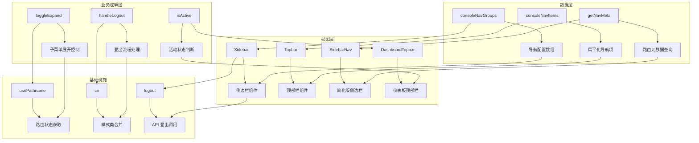
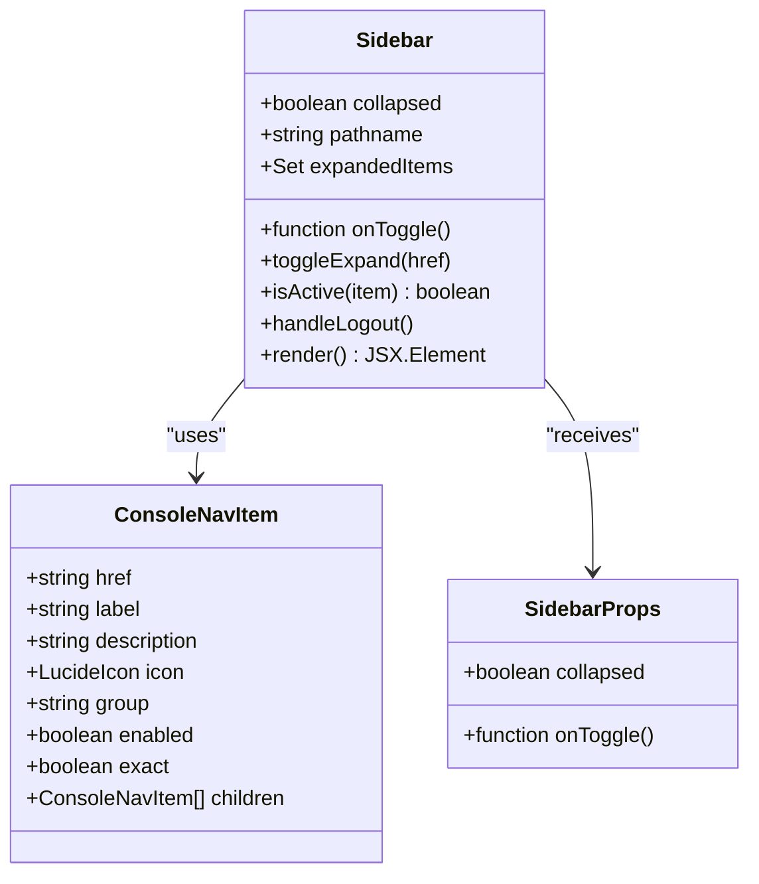
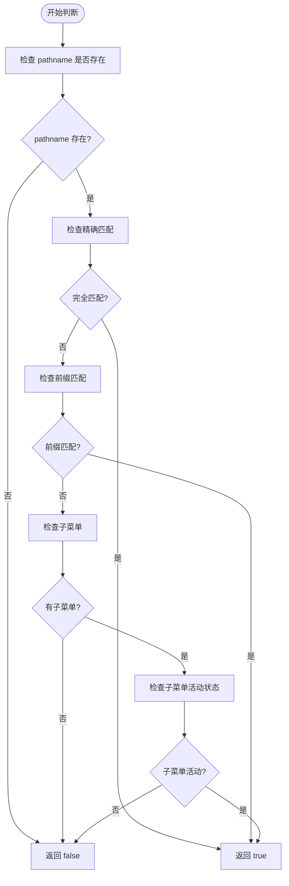
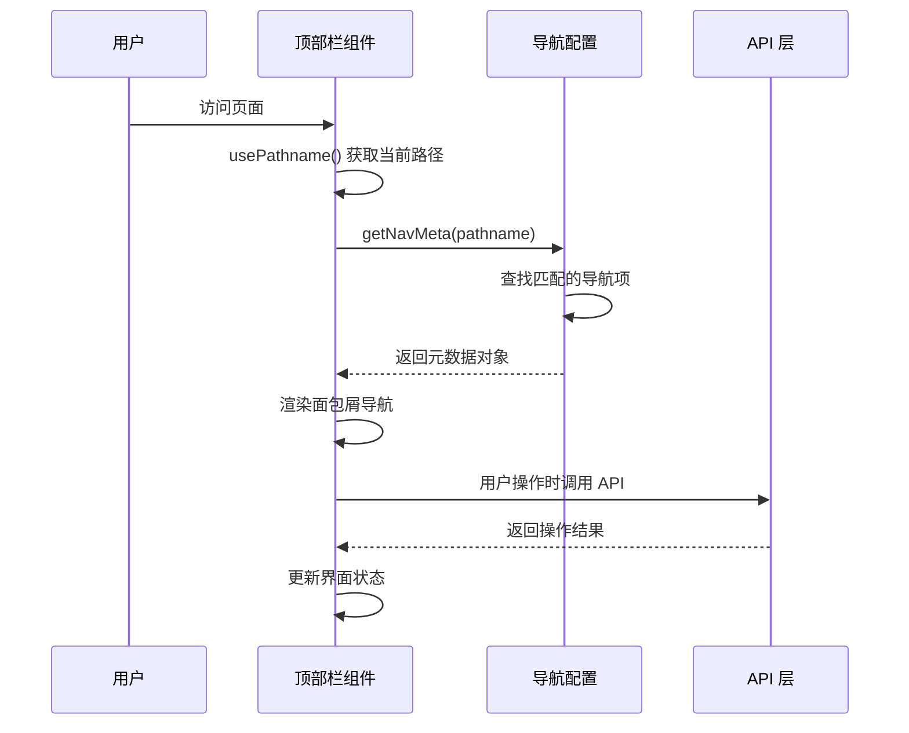
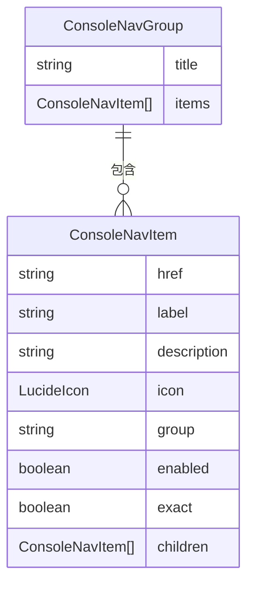
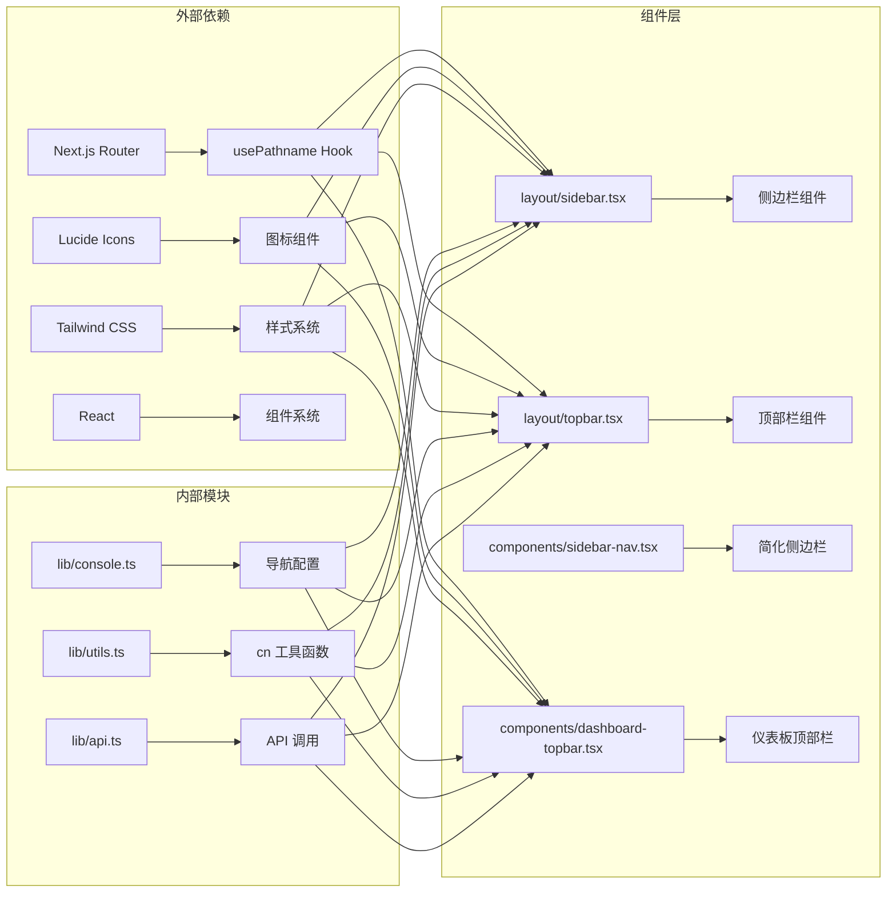

# 导航组件

<cite>
**本文档引用的文件**
- [sidebar.tsx](file://frontend/components/layout/sidebar.tsx)
- [topbar.tsx](file://frontend/components/layout/topbar.tsx)
- [sidebar-nav.tsx](file://frontend/components/sidebar-nav.tsx)
- [dashboard-topbar.tsx](file://frontend/components/dashboard-topbar.tsx)
- [console.ts](file://frontend/lib/console.ts)
- [api.ts](file://frontend/lib/api.ts)
- [utils.ts](file://frontend/lib/utils.ts)
- [layout.tsx](file://frontend/app/(dashboard)/layout.tsx)
- [layout.tsx](file://frontend/app/layout.tsx)
- [button.tsx](file://frontend/components/ui/button.tsx)
- [dropdown-menu.tsx](file://frontend/components/ui/dropdown-menu.tsx)
- [theme-provider.tsx](file://frontend/components/theme-provider.tsx)
- [globals.css](file://frontend/app/globals.css)
</cite>

## 目录
1. [简介](#简介)
2. [项目结构](#项目结构)
3. [核心组件](#核心组件)
4. [架构总览](#架构总览)
5. [详细组件分析](#详细组件分析)
6. [依赖关系分析](#依赖关系分析)
7. [性能考虑](#性能考虑)
8. [故障排除指南](#故障排除指南)
9. [结论](#结论)
10. [附录](#附录)

## 简介

My-OpenWaf 前端导航系统提供了完整的用户界面导航解决方案，包括侧边栏导航和顶部栏导航两大核心组件。该系统采用集中式配置管理模式，通过路由元数据管理系统实现导航的一致性和可维护性。系统支持响应式布局、活动状态智能判断、折叠模式切换以及完整的登出流程管理。

导航组件基于 Next.js 13+ App Router 架构设计，充分利用了客户端组件、路由钩子和状态管理的最佳实践。通过 Lucide React 图标库和 Tailwind CSS 样式系统，实现了现代化、一致性的用户界面体验。

## 项目结构

导航组件系统主要分布在以下目录结构中：

```mermaid
graph TB
subgraph "导航组件"
A[layout/sidebar.tsx] --> B[侧边栏导航组件]
C[layout/topbar.tsx] --> D[顶部栏导航组件]
E[components/sidebar-nav.tsx] --> F[简化版侧边栏导航]
G[components/dashboard-topbar.tsx] --> H[仪表板顶部栏]
end
subgraph "配置管理"
I[lib/console.ts] --> J[导航配置中心]
K[lib/utils.ts] --> L[工具函数]
M[lib/api.ts] --> N[API 接口管理]
end
subgraph "布局系统"
O[app/(dashboard)/layout.tsx] --> P[仪表板布局]
Q[app/layout.tsx] --> R[根布局]
end
A --> I
C --> I
E --> I
G --> I
A --> M
C --> M
G --> M
```

**图表来源**
- [sidebar.tsx:1-167](file://frontend/components/layout/sidebar.tsx#L1-L167)
- [topbar.tsx:1-90](file://frontend/components/layout/topbar.tsx#L1-L90)
- [console.ts:1-240](file://frontend/lib/console.ts#L1-L240)

**章节来源**
- [sidebar.tsx:1-167](file://frontend/components/layout/sidebar.tsx#L1-L167)
- [topbar.tsx:1-90](file://frontend/components/layout/topbar.tsx#L1-L90)
- [console.ts:1-240](file://frontend/lib/console.ts#L1-L240)

## 核心组件

### 侧边栏导航组件

侧边栏导航组件是导航系统的核心，提供了完整的菜单导航功能。该组件支持折叠模式、子菜单展开、活动状态高亮以及登出功能。

**主要特性：**
- 响应式折叠/展开切换
- 智能活动状态判断
- 子菜单层级支持
- 图标和文本显示
- 登出流程管理

### 顶部栏导航组件

顶部栏导航组件负责显示面包屑导航和用户下拉菜单。它通过路由元数据管理系统动态生成面包屑路径。

**主要特性：**
- 动态面包屑生成
- 用户信息下拉菜单
- 登出流程集成
- 移动端菜单切换

### 导航配置系统

导航配置系统通过集中式配置实现导航的一致性和可维护性。所有导航项都定义在 `console.ts` 文件中，支持分组管理和元数据配置。

**章节来源**
- [sidebar.tsx:17-167](file://frontend/components/layout/sidebar.tsx#L17-L167)
- [topbar.tsx:17-90](file://frontend/components/layout/topbar.tsx#L17-L90)
- [console.ts:42-86](file://frontend/lib/console.ts#L42-L86)

## 架构总览

导航系统的整体架构采用分层设计，从底层的数据配置到上层的组件展示形成清晰的层次结构。



**图表来源**
- [console.ts:26-119](file://frontend/lib/console.ts#L26-L119)
- [sidebar.tsx:31-42](file://frontend/components/layout/sidebar.tsx#L31-L42)
- [topbar.tsx:24-29](file://frontend/components/layout/topbar.tsx#L24-L29)

## 详细组件分析

### 侧边栏导航组件深度解析

侧边栏导航组件是导航系统中最复杂的组件，实现了完整的菜单导航功能。

#### 组件架构



**图表来源**
- [sidebar.tsx:12-167](file://frontend/components/layout/sidebar.tsx#L12-L167)
- [console.ts:26-35](file://frontend/lib/console.ts#L26-L35)

#### 活动状态智能判断机制

侧边栏导航实现了多层次的活动状态判断机制：



**图表来源**
- [sidebar.tsx:31-37](file://frontend/components/layout/sidebar.tsx#L31-L37)

#### 折叠模式支持

侧边栏导航支持动态折叠模式，通过 CSS 过渡动画实现流畅的切换效果：

**章节来源**
- [sidebar.tsx:17-167](file://frontend/components/layout/sidebar.tsx#L17-L167)
- [sidebar.tsx:31-37](file://frontend/components/layout/sidebar.tsx#L31-L37)

### 顶部栏导航组件分析

顶部栏导航组件专注于面包屑导航和用户交互功能。

#### 面包屑导航实现

顶部栏导航通过 `getNavMeta` 函数实现动态面包屑生成：



**图表来源**
- [topbar.tsx:22-29](file://frontend/components/layout/topbar.tsx#L22-L29)
- [console.ts:103-119](file://frontend/lib/console.ts#L103-L119)

#### 用户下拉菜单功能

顶部栏的用户下拉菜单提供了统一的用户管理入口：

**章节来源**
- [topbar.tsx:17-90](file://frontend/components/layout/topbar.tsx#L17-L90)
- [dashboard-topbar.tsx:17-81](file://frontend/components/dashboard-topbar.tsx#L17-L81)

### 导航配置管理系统

导航配置管理系统是整个导航系统的核心，实现了集中式配置和元数据管理。

#### 导航配置结构



**图表来源**
- [console.ts:37-40](file://frontend/lib/console.ts#L37-L40)
- [console.ts:26-35](file://frontend/lib/console.ts#L26-L35)

#### 路由元数据管理

路由元数据管理系统通过 `getNavMeta` 函数实现智能的面包屑生成：

**章节来源**
- [console.ts:42-119](file://frontend/lib/console.ts#L42-L119)

## 依赖关系分析

导航组件系统具有清晰的依赖关系，形成了从配置到展示的完整链路。



**图表来源**
- [sidebar.tsx:3-10](file://frontend/components/layout/sidebar.tsx#L3-L10)
- [topbar.tsx:3-15](file://frontend/components/layout/topbar.tsx#L3-L15)
- [console.ts:1-24](file://frontend/lib/console.ts#L1-L24)

**章节来源**
- [sidebar.tsx:3-10](file://frontend/components/layout/sidebar.tsx#L3-L10)
- [topbar.tsx:3-15](file://frontend/components/layout/topbar.tsx#L3-L15)
- [console.ts:1-24](file://frontend/lib/console.ts#L1-L24)

## 性能考虑

导航组件系统在设计时充分考虑了性能优化，采用了多种策略来提升用户体验。

### 渲染优化

- **懒加载**: 子菜单仅在展开时渲染，减少初始渲染负担
- **状态缓存**: 使用 `useState` 缓存展开状态，避免重复计算
- **条件渲染**: 折叠模式下仅渲染必要的元素

### 内存管理

- **事件委托**: 使用事件委托减少事件监听器数量
- **无状态组件**: 尽可能使用无状态组件以减少内存占用
- **清理机制**: 登出时清理相关状态和事件监听器

### 网络优化

- **API 缓存**: 登出 API 调用使用缓存策略
- **错误处理**: 实现优雅的错误降级机制
- **超时控制**: 设置合理的请求超时时间

## 故障排除指南

### 常见问题及解决方案

#### 活动状态不正确

**问题**: 导航项没有正确高亮显示

**原因分析**:
1. 路由路径配置不正确
2. `exact` 属性设置不当
3. 子菜单路径匹配逻辑错误

**解决方案**:
1. 检查 `href` 路径是否与实际路由匹配
2. 根据需求设置 `exact` 属性
3. 确保子菜单路径以斜杠结尾

#### 折叠模式显示异常

**问题**: 侧边栏折叠后图标显示不正确

**原因分析**:
1. CSS 类名冲突
2. 图标组件未正确导入
3. 折叠状态切换逻辑错误

**解决方案**:
1. 检查 `collapsed` 状态的 CSS 类名
2. 确认图标组件的导入路径
3. 验证状态切换逻辑

#### 登出功能失效

**问题**: 点击登出按钮无响应

**原因分析**:
1. API 调用失败
2. 路由跳转逻辑错误
3. 权限状态未正确更新

**解决方案**:
1. 检查 `logout` API 的实现
2. 确认路由跳转的目标路径
3. 验证权限状态的清理逻辑

**章节来源**
- [sidebar.tsx:31-42](file://frontend/components/layout/sidebar.tsx#L31-L42)
- [api.ts:141-149](file://frontend/lib/api.ts#L141-L149)

## 结论

My-OpenWaf 导航组件系统通过精心设计的架构和实现，为用户提供了完整、一致且高效的导航体验。系统的主要优势包括：

1. **集中式配置**: 通过 `console.ts` 实现导航配置的统一管理
2. **智能状态判断**: 实现多层次的活动状态识别机制
3. **响应式设计**: 支持桌面和移动端的适配
4. **可扩展性**: 提供清晰的扩展点和最佳实践指导
5. **性能优化**: 采用多种策略确保良好的用户体验

该导航系统不仅满足了当前的功能需求，还为未来的功能扩展奠定了坚实的基础。通过遵循本文档提供的设计模式和最佳实践，开发者可以轻松地扩展和定制导航功能。

## 附录

### 扩展指南

#### 添加新菜单项

1. **修改配置文件**: 在 `console.ts` 中添加新的导航项配置
2. **设置属性**: 配置 `href`、`label`、`icon`、`group` 等属性
3. **处理子菜单**: 如需子菜单，在 `children` 数组中添加相应项
4. **测试功能**: 验证新菜单项的活动状态和路由跳转

#### 权限控制集成

1. **角色检查**: 在导航项中添加 `enabled` 属性进行权限控制
2. **动态禁用**: 根据用户角色动态启用或禁用菜单项
3. **条件渲染**: 在组件中根据权限状态决定菜单项的显示

#### 国际化支持

1. **文本提取**: 将所有显示文本提取到国际化文件
2. **动态语言切换**: 实现语言切换时的文本更新
3. **方向适配**: 考虑不同语言的文本长度和显示方向

#### 主题定制

1. **CSS 变量**: 使用 CSS 变量实现主题定制
2. **暗色模式**: 支持暗色模式下的颜色适配
3. **品牌定制**: 允许企业定制品牌色彩和样式

**章节来源**
- [console.ts:42-86](file://frontend/lib/console.ts#L42-L86)
- [sidebar.tsx:80-147](file://frontend/components/layout/sidebar.tsx#L80-L147)