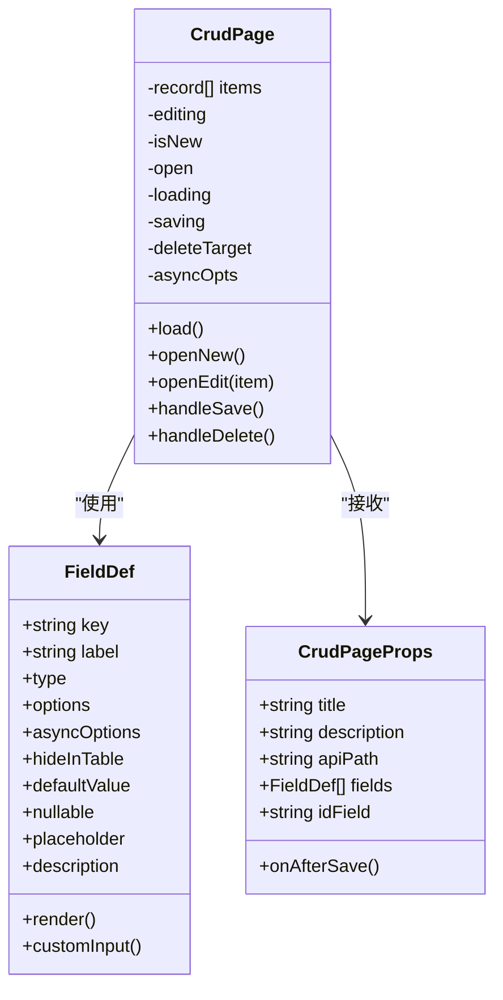
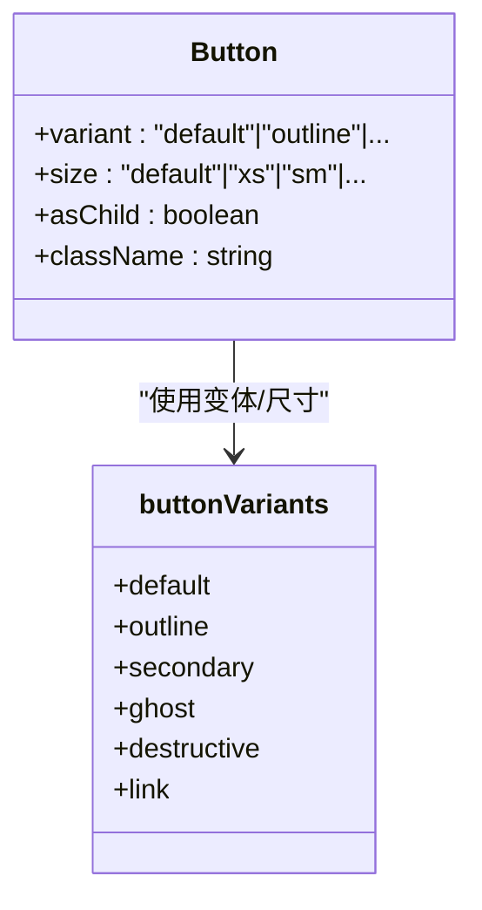
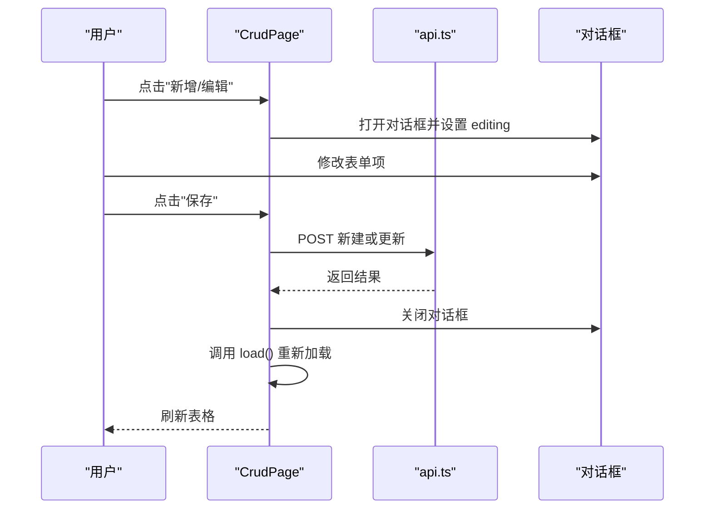
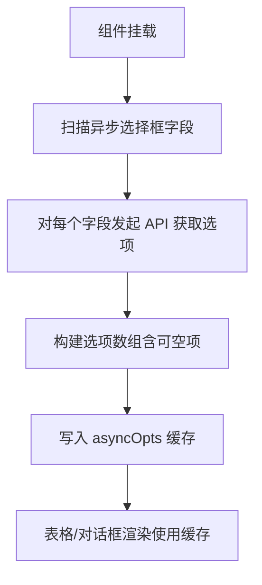
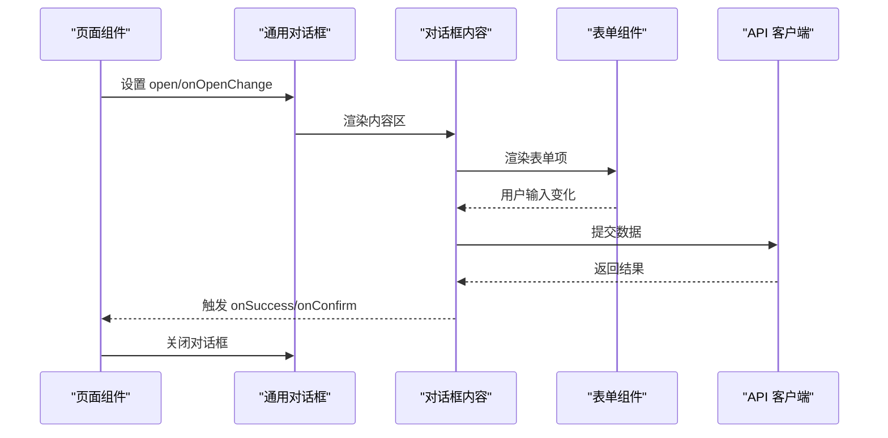
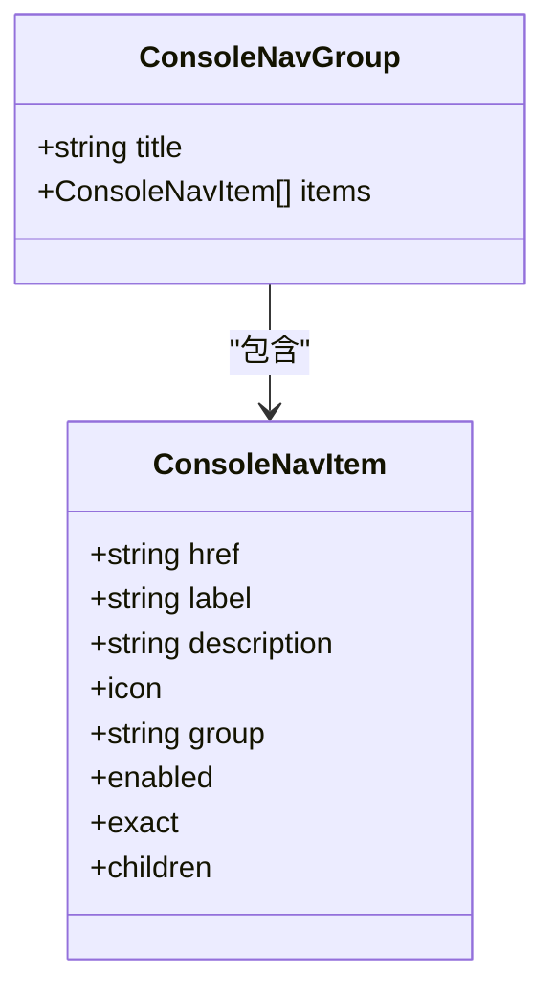
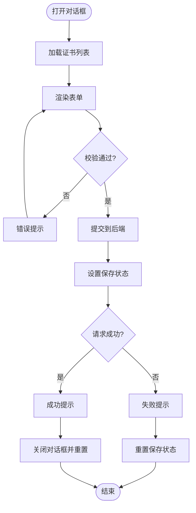
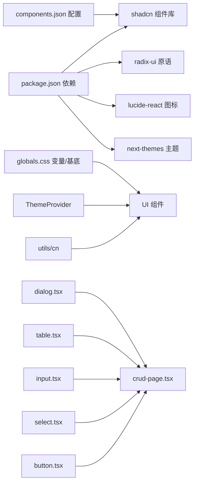

# 组件设计模式

> [返回 前端管理界面](../前端管理界面.md)

<cite>
**本文档引用的文件**
- [crud-page.tsx](file://frontend/components/crud-page.tsx)
- [dialog.tsx](file://frontend/components/ui/dialog.tsx)
- [table.tsx](file://frontend/components/ui/table.tsx)
- [button.tsx](file://frontend/components/ui/button.tsx)
- [input.tsx](file://frontend/components/ui/input.tsx)
- [select.tsx](file://frontend/components/ui/select.tsx)
- [console.ts](file://frontend/lib/console.ts)
- [console-shell.tsx](file://frontend/components/console-shell.tsx)
- [sidebar.tsx](file://frontend/components/layout/sidebar.tsx)
- [topbar.tsx](file://frontend/components/layout/topbar.tsx)
- [pagination.tsx](file://frontend/components/pagination.tsx)
- [multi-host-input.tsx](file://frontend/components/multi-host-input.tsx)
- [rule-builder.tsx](file://frontend/components/rule-builder.tsx)
- [site-listeners-panel.tsx](file://frontend/components/site-listeners-panel.tsx)
- [listeners/page.tsx](file://frontend/app/(dashboard)/listeners/page.tsx)
- [rules/page.tsx](file://frontend/app/(dashboard)/rules/page.tsx)
- [policies/page.tsx](file://frontend/app/(dashboard)/policies/page.tsx)
- [sites/page.tsx](file://frontend/app/(dashboard)/sites/page.tsx)
- [CRUD 页面组件.md](file://docs/前端管理界面/组件设计模式/CRUD 页面组件.md)
- [UI 组件模式.md](file://docs/前端管理界面/组件设计模式/UI 组件模式.md)
- [对话框组件.md](file://docs/前端管理界面/组件设计模式/对话框组件.md)
</cite>

## 目录
1. [简介](#简介)
2. [项目结构](#项目结构)
3. [核心组件](#核心组件)
4. [架构总览](#架构总览)
5. [详细组件分析](#详细组件分析)
6. [依赖关系分析](#依赖关系分析)
7. [性能考虑](#性能考虑)
8. [故障排除指南](#故障排除指南)
9. [结论](#结论)
10. [附录](#附录)

## 简介
本文件系统性地解析 My-OpenWaf 前端的组件设计模式，重点围绕基于 shadcn/ui 的原子化组件理念、通用 CRUD 页面组件的设计与实现、对话框组件与导航组件的业务实践展开。文档旨在提供一套可复用、可维护、可扩展的前端组件体系设计指南，涵盖 Props 设计原则、状态管理模式、组件复用策略、测试策略与性能优化技巧，并通过可视化图示帮助开发者快速理解与落地。

## 项目结构
前端采用 Next.js 应用架构，组件层以 shadcn/ui 为基础，结合自定义业务组件与页面级使用，形成“基础组件 → 业务组件 → 页面使用”的分层结构。主题系统通过 next-themes 提供，样式由 Tailwind CSS 与 CSS 变量统一管理。

```mermaid
graph TB
subgraph "应用层"
APP["应用根布局<br/>layout.tsx / page.tsx"]
END
subgraph "主题与样式"
THEME["ThemeProvider<br/>theme-provider.tsx"]
CSS["全局样式<br/>globals.css"]
CFG["组件配置<br/>components.json"]
END
subgraph "UI 组件库"
BTN["按钮 Button<br/>button.tsx"]
INPUT["输入 Input<br/>input.tsx"]
TABLE["表格 Table<br/>table.tsx"]
DIALOG["对话框 Dialog<br/>dialog.tsx"]
SELECT["选择 Select<br/>select.tsx"]
END
subgraph "业务组件"
CRUD["通用 CRUD 组件<br/>crud-page.tsx"]
CONSOLESHELL["控制台外壳<br/>console-shell.tsx"]
SIDEBAR["侧边栏导航<br/>sidebar.tsx"]
TOPBAR["顶部导航<br/>topbar.tsx"]
PAGINATION["分页组件<br/>pagination.tsx"]
MULTIHOST["多域名输入<br/>multi-host-input.tsx"]
RULEBUILDER["规则构建器<br/>rule-builder.tsx"]
LISTENERS["监听器面板<br/>site-listeners-panel.tsx"]
END
APP --> THEME
THEME --> CSS
THEME --> BTN
THEME --> INPUT
THEME --> TABLE
THEME --> DIALOG
THEME --> SELECT
BTN --> CRUD
INPUT --> CRUD
TABLE --> CRUD
DIALOG --> CRUD
CRUD --> CONSOLESHELL
CRUD --> SIDEBAR
CRUD --> TOPBAR
CRUD --> PAGINATION
CRUD --> MULTIHOST
CRUD --> RULEBUILDER
CRUD --> LISTENERS
```

**图表来源**
- [button.tsx:1-68](file://frontend/components/ui/button.tsx#L1-L68)
- [input.tsx:1-20](file://frontend/components/ui/input.tsx#L1-L20)
- [table.tsx:1-117](file://frontend/components/ui/table.tsx#L1-L117)
- [dialog.tsx:1-169](file://frontend/components/ui/dialog.tsx#L1-L169)
- [select.tsx:1-193](file://frontend/components/ui/select.tsx#L1-L193)
- [crud-page.tsx:1-358](file://frontend/components/crud-page.tsx#L1-L358)
- [console-shell.tsx:1-229](file://frontend/components/console-shell.tsx#L1-L229)
- [sidebar.tsx:1-167](file://frontend/components/layout/sidebar.tsx#L1-L167)
- [topbar.tsx:1-90](file://frontend/components/layout/topbar.tsx#L1-L90)
- [pagination.tsx:1-46](file://frontend/components/pagination.tsx#L1-L46)
- [multi-host-input.tsx:1-121](file://frontend/components/multi-host-input.tsx#L1-L121)
- [rule-builder.tsx:1-520](file://frontend/components/rule-builder.tsx#L1-L520)
- [site-listeners-panel.tsx:1-444](file://frontend/components/site-listeners-panel.tsx#L1-L444)

**章节来源**
- [button.tsx:1-68](file://frontend/components/ui/button.tsx#L1-L68)
- [input.tsx:1-20](file://frontend/components/ui/input.tsx#L1-L20)
- [table.tsx:1-117](file://frontend/components/ui/table.tsx#L1-L117)
- [dialog.tsx:1-169](file://frontend/components/ui/dialog.tsx#L1-L169)
- [select.tsx:1-193](file://frontend/components/ui/select.tsx#L1-L193)
- [crud-page.tsx:1-358](file://frontend/components/crud-page.tsx#L1-L358)
- [console-shell.tsx:1-229](file://frontend/components/console-shell.tsx#L1-L229)
- [sidebar.tsx:1-167](file://frontend/components/layout/sidebar.tsx#L1-L167)
- [topbar.tsx:1-90](file://frontend/components/layout/topbar.tsx#L1-L90)
- [pagination.tsx:1-46](file://frontend/components/pagination.tsx#L1-L46)
- [multi-host-input.tsx:1-121](file://frontend/components/multi-host-input.tsx#L1-L121)
- [rule-builder.tsx:1-520](file://frontend/components/rule-builder.tsx#L1-L520)
- [site-listeners-panel.tsx:1-444](file://frontend/components/site-listeners-panel.tsx#L1-L444)

## 核心组件
- 原子化 UI 组件：基于 shadcn/ui 的 Button、Input、Table、Dialog、Select 等，提供统一的变体、尺寸与可访问性支持。
- 业务组件：ConsoleShell（页面结构与提示）、Sidebar/Topbar（导航）、Pagination（分页）、MultiHostInput（多域名输入）、RuleBuilder（规则构建器）、SiteListenersPanel（监听器面板）。
- 通用 CRUD 组件：通过字段定义接口 FieldDef 动态生成表单，支持多种输入类型、异步选择框、自定义输入与删除确认流程。

**章节来源**
- [button.tsx:7-42](file://frontend/components/ui/button.tsx#L7-L42)
- [input.tsx:5-17](file://frontend/components/ui/input.tsx#L5-L17)
- [table.tsx:7-117](file://frontend/components/ui/table.tsx#L7-L117)
- [dialog.tsx:10-169](file://frontend/components/ui/dialog.tsx#L10-L169)
- [select.tsx:9-193](file://frontend/components/ui/select.tsx#L9-L193)
- [console-shell.tsx:7-96](file://frontend/components/console-shell.tsx#L7-L96)
- [sidebar.tsx:17-167](file://frontend/components/layout/sidebar.tsx#L17-L167)
- [topbar.tsx:17-90](file://frontend/components/layout/topbar.tsx#L17-L90)
- [pagination.tsx:14-46](file://frontend/components/pagination.tsx#L14-L46)
- [multi-host-input.tsx:25-121](file://frontend/components/multi-host-input.tsx#L25-L121)
- [rule-builder.tsx:137-520](file://frontend/components/rule-builder.tsx#L137-L520)
- [site-listeners-panel.tsx:60-444](file://frontend/components/site-listeners-panel.tsx#L60-L444)
- [crud-page.tsx:56-358](file://frontend/components/crud-page.tsx#L56-L358)

## 架构总览
系统采用“主题/样式 → 原子组件 → 业务组件 → 通用 CRUD → 页面使用”的分层架构。通用 CRUD 组件通过 props 接收标题、描述、API 路径、字段定义与回调函数，内部维护多类状态以驱动 UI 更新。字段定义接口 FieldDef 描述每个列/表单项的渲染与输入行为，支持文本、数字、布尔值、普通选择框、异步选择框以及自定义输入组件。异步选择框具备选项缓存与空值处理，确保表格显示与表单编辑的一致性。



**图表来源**
- [crud-page.tsx:28-74](file://frontend/components/crud-page.tsx#L28-L74)
- [crud-page.tsx:51-58](file://frontend/components/crud-page.tsx#L51-L58)
- [crud-page.tsx:60-358](file://frontend/components/crud-page.tsx#L60-L358)

## 详细组件分析

### 原子化组件设计模式（基于 shadcn/ui）
- 统一工具函数：使用 cn(...) 合并类名，确保变体与尺寸类不会相互覆盖。
- 变体与尺寸：通过 class-variance-authority 定义变体与尺寸映射，结合 data-* 属性传递状态，便于 CSS 选择器与 Tailwind 扩展生效。
- Radix UI 原语：大量使用 radix-ui 原语作为底层实现，保证可访问性与可组合性。
- 图标与交互：Lucide 图标库提供一致的视觉语言，交互态通过 focus-visible、aria-* 与 hover 状态统一呈现。



**图表来源**
- [button.tsx:44-67](file://frontend/components/ui/button.tsx#L44-L67)
- [button.tsx:7-42](file://frontend/components/ui/button.tsx#L7-L42)

**章节来源**
- [button.tsx:7-42](file://frontend/components/ui/button.tsx#L7-L42)
- [button.tsx:44-67](file://frontend/components/ui/button.tsx#L44-L67)
- [input.tsx:5-17](file://frontend/components/ui/input.tsx#L5-L17)
- [textarea.tsx:5-15](file://frontend/components/ui/textarea.tsx#L5-L15)
- [table.tsx:7-117](file://frontend/components/ui/table.tsx#L7-L117)
- [tabs.tsx:9-91](file://frontend/components/ui/tabs.tsx#L9-L91)
- [dialog.tsx:10-169](file://frontend/components/ui/dialog.tsx#L10-L169)
- [select.tsx:9-193](file://frontend/components/ui/select.tsx#L9-L193)
- [checkbox.tsx:9-34](file://frontend/components/ui/checkbox.tsx#L9-L34)
- [radio-group.tsx:8-45](file://frontend/components/ui/radio-group.tsx#L8-L45)
- [switch.tsx:8-34](file://frontend/components/ui/switch.tsx#L8-L34)

### 通用 CRUD 页面组件
- 字段定义接口 FieldDef：支持文本、数字、多行文本、布尔值、普通选择框、异步选择框；可配置默认值、空值、描述、自定义渲染与自定义输入组件。
- 状态管理：items、editing、isNew、open、loading、saving、deleteTarget、asyncOpts，协同驱动加载骨架、表格渲染、表单对话框与删除确认弹窗。
- 数据加载与表格渲染：首次挂载触发数据加载，加载成功后设置 items，失败时提示错误；表格头部固定 ID 列与其他字段列；支持自定义渲染函数、布尔值显示、异步选择框标签显示。
- 表单对话框与保存流程：新建/编辑对话框基于字段默认值或当前项初始化 editing；表单项渲染支持多行文本、布尔值、普通选择框、异步选择框与自定义输入组件；保存统一走 POST 新建或更新，成功后关闭对话框、重新加载数据、触发回调。
- 删除确认流程：用户点击删除按钮设置 deleteTarget，打开删除确认对话框，确认后调用 DELETE API，成功后重新加载数据并触发回调。
- 异步选择框实现原理：组件在挂载时扫描所有异步选择框字段，预取选项并缓存到 asyncOpts 中，key 为字段 key；当对话框打开时，异步选择框使用缓存的选项进行渲染；若字段可空，则在缓存中插入一个“不选择”选项，表单值为特殊标记并在保存前转换为 null；标签生成支持字符串或函数两种方式。
- 自定义输入组件支持机制：customInput 接收 { value, onChange } 两个参数，返回一个 React 节点；在表单对话框中，若字段定义了 customInput，则直接渲染该组件，否则按字段类型渲染内置控件。



**图表来源**
- [crud-page.tsx:113-148](file://frontend/components/crud-page.tsx#L113-L148)
- [crud-page.tsx:244-319](file://frontend/components/crud-page.tsx#L244-L319)



**图表来源**
- [crud-page.tsx:71-97](file://frontend/components/crud-page.tsx#L71-L97)
- [crud-page.tsx:274-291](file://frontend/components/crud-page.tsx#L274-L291)

**章节来源**
- [crud-page.tsx:28-49](file://frontend/components/crud-page.tsx#L28-L49)
- [crud-page.tsx:60-70](file://frontend/components/crud-page.tsx#L60-L70)
- [crud-page.tsx:99-111](file://frontend/components/crud-page.tsx#L99-L111)
- [crud-page.tsx:113-148](file://frontend/components/crud-page.tsx#L113-L148)
- [crud-page.tsx:150-161](file://frontend/components/crud-page.tsx#L150-L161)
- [crud-page.tsx:71-97](file://frontend/components/crud-page.tsx#L71-L97)
- [crud-page.tsx:250-255](file://frontend/components/crud-page.tsx#L250-L255)

### 对话框组件体系
- 通用对话框（Dialog）：基于 Radix UI 的对话框原语，提供根节点、触发器、传送门、覆盖层、内容区、标题、描述、头部、底部、关闭按钮等子组件，支持动画入场/出场、键盘无障碍、焦点管理等。
- 警示对话框（AlertDialog）：用于重要操作确认，强调危险动作，提供默认/小号尺寸、媒体槽位、操作按钮变体等。
- 业务对话框：
  - 添加站点对话框（AddSiteDialog）：包含表单字段校验、异步加载证书列表、提交处理与反馈。
  - 防护模式对话框（ProtectionModeDialog）：用于切换站点的防护模式，提供三种模式的可视化选择。
- 页面级使用：在站点管理页、API 密钥页等页面中组合使用对话框组件，实现交互流程。



**图表来源**
- [dialog.tsx:50-86](file://frontend/components/ui/dialog.tsx#L50-L86)
- [site-listeners-panel.tsx:309-440](file://frontend/components/site-listeners-panel.tsx#L309-L440)

**章节来源**
- [dialog.tsx:10-169](file://frontend/components/ui/dialog.tsx#L10-L169)
- [site-listeners-panel.tsx:60-156](file://frontend/components/site-listeners-panel.tsx#L60-L156)
- [site-listeners-panel.tsx:158-193](file://frontend/components/site-listeners-panel.tsx#L158-L193)

### 导航组件设计思路
- 侧边栏导航（Sidebar）：支持折叠/展开、子菜单展开、活动状态高亮、登出流程；通过 consoleNavGroups 与 ConsoleNavItem 定义导航结构。
- 顶部导航（Topbar）：面包屑导航、用户下拉菜单、登出流程；通过 getNavMeta 获取当前页面元信息。
- 导航数据结构：ConsoleNavItem 定义 href、label、description、icon、group、enabled、exact、children 等字段；consoleNavGroups 将导航分组管理。



**图表来源**
- [console.ts:26-40](file://frontend/lib/console.ts#L26-L40)
- [console.ts:42-86](file://frontend/lib/console.ts#L42-L86)

**章节来源**
- [sidebar.tsx:17-167](file://frontend/components/layout/sidebar.tsx#L17-L167)
- [topbar.tsx:17-90](file://frontend/components/layout/topbar.tsx#L17-L90)
- [console.ts:26-40](file://frontend/lib/console.ts#L26-L40)
- [console.ts:42-86](file://frontend/lib/console.ts#L42-L86)

### 业务组件设计与使用方法
- 分页组件（Pagination）：接收 page、totalPages、total、pageSize 与 onPageChange 回调，提供上一页/下一页导航与页码显示。
- 多域名输入（MultiHostInput）：支持精确域名与泛域名（*.example.com），按 Enter/Tab/逗号确认输入；支持粘贴批量输入与回退删除。
- 规则构建器（RuleBuilder）：支持简单 DSL 与复合 JSON 两种规则格式；提供可视化构建器与高级模式（原始 DSL）；内置规则测试功能。
- 监听器面板（SiteListenersPanel）：支持新增/编辑/删除站点监听端口；支持 HTTP/HTTPS 协议切换与证书绑定；支持启用/禁用与旧配置迁移。



**图表来源**
- [site-listeners-panel.tsx:121-156](file://frontend/components/site-listeners-panel.tsx#L121-L156)

**章节来源**
- [pagination.tsx:14-46](file://frontend/components/pagination.tsx#L14-L46)
- [multi-host-input.tsx:25-121](file://frontend/components/multi-host-input.tsx#L25-L121)
- [rule-builder.tsx:137-520](file://frontend/components/rule-builder.tsx#L137-L520)
- [site-listeners-panel.tsx:60-193](file://frontend/components/site-listeners-panel.tsx#L60-L193)

## 依赖关系分析
- 组件依赖：所有组件均依赖 utils/cn(...) 进行类名合并；部分组件依赖 Lucide 图标与 Radix UI 原语。
- 主题与样式：globals.css 注入 shadcn/tailwind.css 并定义 CSS 变量与暗色变体；ThemeProvider 负责主题切换与热键。
- 配置：components.json 指定样式风格、Tailwind 配置、图标库与别名，确保组件生成与样式一致性。
- 业务依赖：通用 CRUD 组件依赖对话框、表格、输入、选择等基础组件；页面通过状态管理控制对话框的 open/onOpenChange。



**图表来源**
- [button.tsx:1-68](file://frontend/components/ui/button.tsx#L1-L68)
- [input.tsx:1-20](file://frontend/components/ui/input.tsx#L1-L20)
- [table.tsx:1-117](file://frontend/components/ui/table.tsx#L1-L117)
- [dialog.tsx:1-169](file://frontend/components/ui/dialog.tsx#L1-L169)
- [select.tsx:1-193](file://frontend/components/ui/select.tsx#L1-L193)
- [crud-page.tsx:1-358](file://frontend/components/crud-page.tsx#L1-L358)

**章节来源**
- [button.tsx:1-68](file://frontend/components/ui/button.tsx#L1-L68)
- [input.tsx:1-20](file://frontend/components/ui/input.tsx#L1-L20)
- [table.tsx:1-117](file://frontend/components/ui/table.tsx#L1-L117)
- [dialog.tsx:1-169](file://frontend/components/ui/dialog.tsx#L1-L169)
- [select.tsx:1-193](file://frontend/components/ui/select.tsx#L1-L193)
- [crud-page.tsx:1-358](file://frontend/components/crud-page.tsx#L1-L358)

## 性能考虑
- 异步选择框缓存：在组件挂载时一次性拉取所有异步选项，减少重复请求与闪烁。
- 表格渲染：使用骨架屏提升加载体验；对长列表采用虚拟滚动（如需）进一步优化。
- 状态更新：避免在渲染路径中创建新的对象或函数，减少不必要的重渲染。
- 类名合并：使用 twMerge 在重复类名时进行智能合并，减少样式冲突与冗余计算。
- 原语渲染：Radix 原语按需渲染与卸载，避免不必要的 DOM 节点。
- 动画与过渡：组件动画时长较短，避免阻塞主线程；遮罩与弹窗仅在打开时挂载。
- 主题切换：next-themes 通过类名切换，避免重绘大范围区域。

## 故障排除指南
- 加载失败：检查 API 返回状态与错误消息，确认网络连通与认证令牌有效性。
- 401 未授权：组件会尝试刷新令牌并重试；若仍失败，跳转至登录页。
- 403 权限不足：检查 RBAC 权限配置，确保当前账户具备相应操作权限。
- 429 请求过快：遵循速率限制策略，适当增加请求间隔。
- 异步选择框为空：确认异步 API 返回格式为 { items: [...] }，且 valueKey/labelKey 配置正确。
- 对话框无法关闭：检查父组件是否正确传递 onOpenChange 并在关闭时重置状态；确认未被其他状态阻塞（如保存中 loading）。
- 表单校验无效：确保在提交前执行校验逻辑，必要时使用通知组件提示；检查字段值是否正确更新（受控组件）。
- 选项未显示：确认异步选项已成功拉取并写入缓存；检查字段定义与 API 返回结构一致。
- 动画异常：检查类名拼接与动画类是否正确引入；确认未被全局样式覆盖。

**章节来源**
- [crud-page.tsx:71-97](file://frontend/components/crud-page.tsx#L71-L97)
- [site-listeners-panel.tsx:121-156](file://frontend/components/site-listeners-panel.tsx#L121-L156)
- [dialog.tsx:34-86](file://frontend/components/ui/dialog.tsx#L34-L86)

## 结论
本项目以 shadcn/ui 为核心，结合 Radix 原语、Lucide 图标与 Tailwind CSS 变量，构建了高可访问性、强一致性的 UI 组件体系。通过统一的变体/尺寸规范、数据属性标记与类名合并策略，实现了良好的可维护性与扩展性。通用 CRUD 页面组件通过清晰的字段定义与状态管理，实现了高度复用的数据管理界面；对话框组件体系提供了统一的模态交互体验；导航组件与业务组件进一步完善了前端组件体系。建议在新增组件时遵循现有模式，保持一致的属性命名、状态标记与无障碍语义。

## 附录
- 组件属性与行为参考
  - 通用对话框：根节点、触发器、传送门、覆盖层、内容区、标题、描述、头部、底部、关闭按钮
  - 警示对话框：根节点、触发器、传送门、覆盖层、内容区（默认/小号）、头部、底部、媒体槽位、标题、描述、操作按钮、取消按钮
  - 业务对话框：AddSiteDialog、ProtectionModeDialog
  - 页面使用：SitesPage、APIKeysPage、CrudPage
- 最佳实践清单
  - 使用 data-slot/data-variant/data-size 标记组件状态，便于样式与测试定位。
  - 优先使用原语触发器与内容区，确保键盘导航与屏幕阅读器支持。
  - 通过 cn(...) 合并类名，避免重复样式与优先级冲突。
  - 为表单控件提供 aria-invalid 与错误提示，增强可访问性。
  - 对弹窗与下拉菜单等浮层组件，确保遮罩层与焦点管理正确。
  - 主题切换时关注暗色变体下的对比度与可读性。