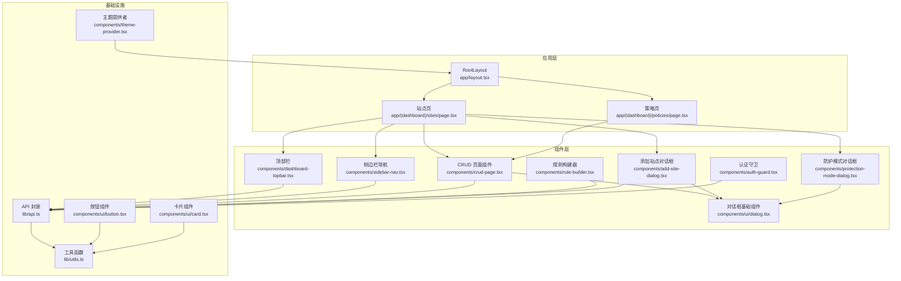
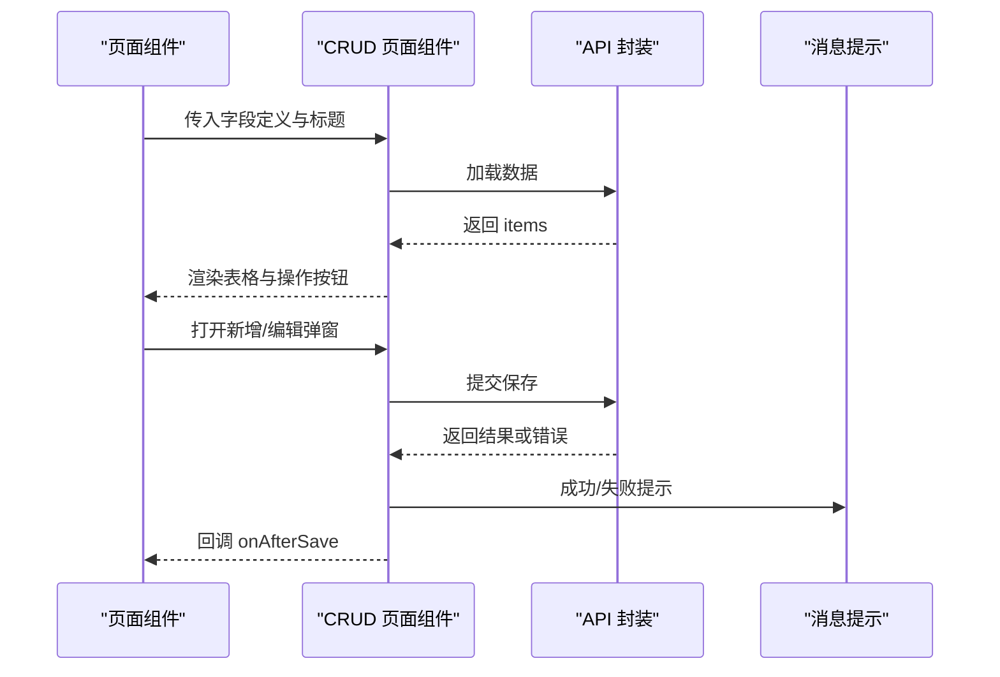
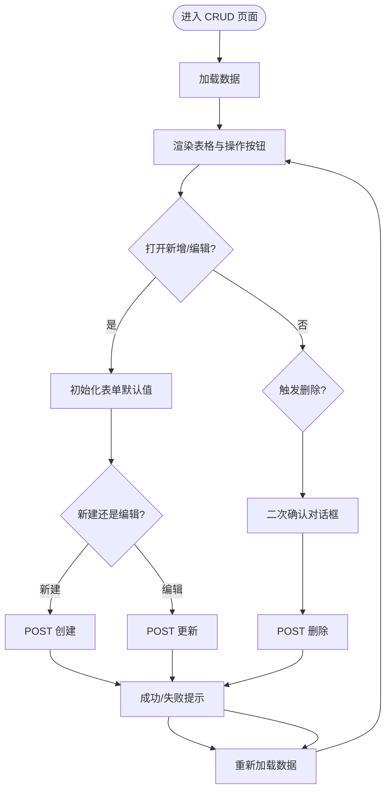
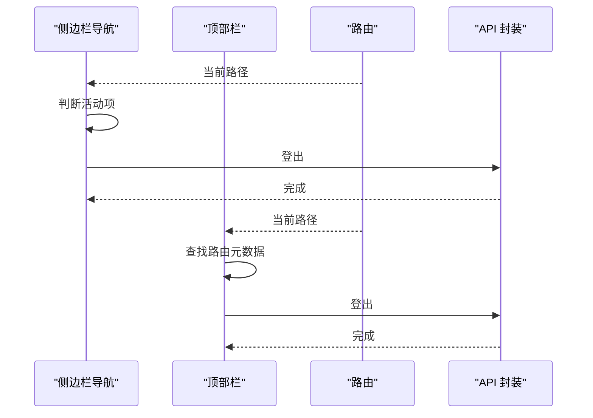
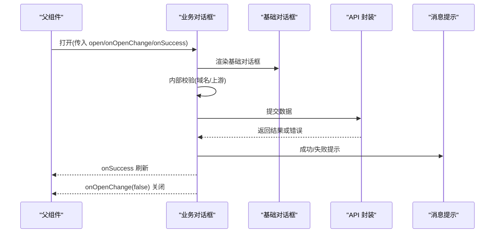
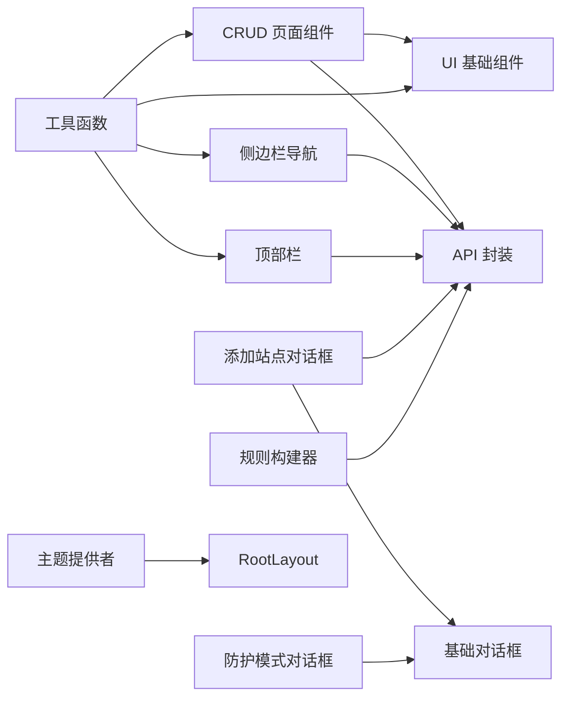

# 组件设计模式

<cite>
**本文引用的文件**
- [frontend/components/crud-page.tsx](file://frontend/components/crud-page.tsx)
- [frontend/components/sidebar-nav.tsx](file://frontend/components/sidebar-nav.tsx)
- [frontend/components/dashboard-topbar.tsx](file://frontend/components/dashboard-topbar.tsx)
- [frontend/components/ui/dialog.tsx](file://frontend/components/ui/dialog.tsx)
- [frontend/components/add-site-dialog.tsx](file://frontend/components/add-site-dialog.tsx)
- [frontend/components/protection-mode-dialog.tsx](file://frontend/components/protection-mode-dialog.tsx)
- [frontend/lib/api.ts](file://frontend/lib/api.ts)
- [frontend/app/(dashboard)/sites/page.tsx](file://frontend/app/(dashboard)/sites/page.tsx)
- [frontend/app/(dashboard)/policies/page.tsx](file://frontend/app/(dashboard)/policies/page.tsx)
- [frontend/components/rule-builder.tsx](file://frontend/components/rule-builder.tsx)
- [frontend/components/ui/button.tsx](file://frontend/components/ui/button.tsx)
- [frontend/components/ui/card.tsx](file://frontend/components/ui/card.tsx)
- [frontend/components/theme-provider.tsx](file://frontend/components/theme-provider.tsx)
- [frontend/components/auth-guard.tsx](file://frontend/components/auth-guard.tsx)
- [frontend/lib/utils.ts](file://frontend/lib/utils.ts)
- [frontend/app/layout.tsx](file://frontend/app/layout.tsx)
</cite>

## 目录
1. [引言](#引言)
2. [项目结构](#项目结构)
3. [核心组件](#核心组件)
4. [架构总览](#架构总览)
5. [详细组件分析](#详细组件分析)
6. [依赖关系分析](#依赖关系分析)
7. [性能考量](#性能考量)
8. [故障排查指南](#故障排查指南)
9. [结论](#结论)
10. [附录](#附录)

## 引言
本文件系统性梳理前端组件设计模式，围绕以下主题展开：CRUD 页面组件的数据获取、表单处理与操作反馈；导航组件的侧边栏菜单、面包屑导航与活动状态管理；对话框组件的模态显示、表单验证与提交处理；顶部栏组件的用户信息、通知与设置入口；以及组件间通信与状态共享策略。同时总结组件复用与扩展的最佳实践，帮助读者在保持一致性的同时提升开发效率与可维护性。

## 项目结构
前端采用 Next.js App Router 结构，页面位于 app 下，通用组件集中在 components 中，UI 基础组件封装于 components/ui，业务组件如 CRUD、对话框、导航等位于 components 根目录，API 封装与工具函数位于 lib。

图表来源
- [frontend/app/layout.tsx:23-39](file://frontend/app/layout.tsx#L23-L39)
- [frontend/app/(dashboard)/sites/page.tsx](file://frontend/app/(dashboard)/sites/page.tsx#L47-L326)
- [frontend/app/(dashboard)/policies/page.tsx](file://frontend/app/(dashboard)/policies/page.tsx#L1-L16)
- [frontend/components/crud-page.tsx:60-338](file://frontend/components/crud-page.tsx#L60-L338)
- [frontend/components/sidebar-nav.tsx:40-112](file://frontend/components/sidebar-nav.tsx#L40-L112)
- [frontend/components/dashboard-topbar.tsx:36-76](file://frontend/components/dashboard-topbar.tsx#L36-L76)
- [frontend/components/ui/dialog.tsx:10-168](file://frontend/components/ui/dialog.tsx#L10-L168)
- [frontend/components/add-site-dialog.tsx:36-253](file://frontend/components/add-site-dialog.tsx#L36-L253)
- [frontend/components/protection-mode-dialog.tsx:58-128](file://frontend/components/protection-mode-dialog.tsx#L58-L128)
- [frontend/components/rule-builder.tsx:114-555](file://frontend/components/rule-builder.tsx#L114-L555)
- [frontend/components/auth-guard.tsx:7-39](file://frontend/components/auth-guard.tsx#L7-L39)
- [frontend/lib/api.ts:31-88](file://frontend/lib/api.ts#L31-L88)
- [frontend/lib/utils.ts:4-6](file://frontend/lib/utils.ts#L4-L6)
- [frontend/components/theme-provider.tsx:6-22](file://frontend/components/theme-provider.tsx#L6-L22)
- [frontend/components/ui/button.tsx:44-67](file://frontend/components/ui/button.tsx#L44-L67)
- [frontend/components/ui/card.tsx:5-21](file://frontend/components/ui/card.tsx#L5-L21)

章节来源
- [frontend/app/layout.tsx:23-39](file://frontend/app/layout.tsx#L23-L39)
- [frontend/app/(dashboard)/sites/page.tsx](file://frontend/app/(dashboard)/sites/page.tsx#L47-L326)
- [frontend/app/(dashboard)/policies/page.tsx](file://frontend/app/(dashboard)/policies/page.tsx#L1-L16)

## 核心组件
本节聚焦四大设计模式：CRUD 页面、导航、对话框、顶部栏，并给出接口与职责边界。

- CRUD 页面组件
  - 职责：统一承载列表渲染、新增/编辑弹窗、删除确认、异步选项缓存、默认值生成与保存反馈。
  - 关键点：字段定义驱动 UI 渲染与表单输入类型；异步下拉通过缓存优化；保存前后置状态与错误提示。
- 导航组件
  - 职责：侧边栏菜单项与活动状态高亮；顶部栏面包屑与用户下拉菜单。
  - 关键点：基于路由路径判断活动项；面包屑元数据集中管理。
- 对话框组件
  - 职责：模态容器、遮罩动画、关闭按钮、头部尾部布局；业务对话框负责表单校验与提交。
  - 关键点：基础对话框提供一致的交互体验；业务对话框独立处理状态与副作用。
- 顶部栏组件
  - 职责：面包屑导航、用户下拉菜单、登出流程。
  - 关键点：与导航组件共享路由元数据，保证一致性。

章节来源
- [frontend/components/crud-page.tsx:28-58](file://frontend/components/crud-page.tsx#L28-L58)
- [frontend/components/sidebar-nav.tsx:24-33](file://frontend/components/sidebar-nav.tsx#L24-L33)
- [frontend/components/dashboard-topbar.tsx:17-34](file://frontend/components/dashboard-topbar.tsx#L17-L34)
- [frontend/components/ui/dialog.tsx:10-168](file://frontend/components/ui/dialog.tsx#L10-L168)
- [frontend/components/add-site-dialog.tsx:30-40](file://frontend/components/add-site-dialog.tsx#L30-L40)
- [frontend/components/protection-mode-dialog.tsx:17-23](file://frontend/components/protection-mode-dialog.tsx#L17-L23)

## 架构总览
组件间通过 props 传递状态与回调，API 封装统一处理鉴权、刷新与错误码映射，UI 基础组件提供一致的视觉与交互基线。

图表来源
- [frontend/components/crud-page.tsx:99-161](file://frontend/components/crud-page.tsx#L99-L161)
- [frontend/lib/api.ts:31-88](file://frontend/lib/api.ts#L31-L88)

## 详细组件分析

### CRUD 页面组件设计模式
- 设计要点
  - 字段定义驱动渲染：通过 FieldDef 描述每个字段的类型、占位符、描述、可空、默认值、自定义渲染与输入组件。
  - 表单输入适配：根据类型自动渲染文本、数字、开关、选择、异步选择与文本域；支持自定义输入组件以扩展复杂控件。
  - 异步选项缓存：对 async-select 字段在挂载时与弹窗打开时分别加载，避免重复请求并提供“未选择”占位。
  - 默认值策略：优先使用字段默认值，否则按类型返回空字符串、布尔 false、数值 0 或空数组；可空字段支持 null。
  - 保存与删除：区分新建与编辑，统一使用 API 封装；删除采用二次确认对话框；保存前后置 loading 与错误提示。
- 数据流与状态
  - 列表状态：items、loading
  - 编辑状态：editing、isNew、open
  - 删除状态：deleteTarget
  - 异步选项缓存：asyncOpts
  - 保存状态：saving
- 错误处理
  - 加载失败、保存失败、删除失败均通过消息提示反馈；API 层对 401/403/429 进行统一处理与转换。

图表来源
- [frontend/components/crud-page.tsx:99-161](file://frontend/components/crud-page.tsx#L99-L161)
- [frontend/components/crud-page.tsx:340-357](file://frontend/components/crud-page.tsx#L340-L357)

章节来源
- [frontend/components/crud-page.tsx:28-58](file://frontend/components/crud-page.tsx#L28-L58)
- [frontend/components/crud-page.tsx:60-338](file://frontend/components/crud-page.tsx#L60-L338)

### 导航组件设计模式
- 侧边栏导航
  - 菜单项：集中定义在 navItems，包含链接、图标与标签；活动状态通过 pathname 判断，支持折叠模式下的标题提示。
  - 登出：调用 API logout 并跳转至登录页。
- 顶部栏导航
  - 面包屑：routeMeta 集中维护路由前缀、标题、描述与面包屑文案；默认回退到控制台元数据。
  - 用户下拉：提供登出入口，统一调用 API logout。
- 活动状态管理
  - 使用 usePathname 获取当前路由，结合 startsWith 判断子路径激活；通过 cn 合并样式类名实现高亮。

图表来源
- [frontend/components/sidebar-nav.tsx:40-112](file://frontend/components/sidebar-nav.tsx#L40-L112)
- [frontend/components/dashboard-topbar.tsx:36-76](file://frontend/components/dashboard-topbar.tsx#L36-L76)
- [frontend/lib/api.ts:106-114](file://frontend/lib/api.ts#L106-L114)

章节来源
- [frontend/components/sidebar-nav.tsx:24-33](file://frontend/components/sidebar-nav.tsx#L24-L33)
- [frontend/components/sidebar-nav.tsx:40-112](file://frontend/components/sidebar-nav.tsx#L40-L112)
- [frontend/components/dashboard-topbar.tsx:17-34](file://frontend/components/dashboard-topbar.tsx#L17-L34)
- [frontend/components/dashboard-topbar.tsx:36-76](file://frontend/components/dashboard-topbar.tsx#L36-L76)

### 对话框组件设计模式
- 基础对话框
  - 提供根容器、触发器、传送门、遮罩、内容区、头部、尾部、标题与描述；支持是否显示关闭按钮与尺寸控制。
  - 动画与焦点：基于 Radix UI，提供淡入淡出与缩放动画；关闭按钮语义化可访问。
- 业务对话框
  - 添加站点对话框：域名、端口/协议切换、HTTPS 证书选择、上游服务器列表（动态增删）、应用名称；提交前进行必填校验，成功后重置并回调父组件刷新。
  - 防护模式对话框：三种模式（防护/观察/维护）的可视化卡片选择，确认后调用 onConfirm 回调；提供模式到标签的映射工具函数。
- 表单验证与提交
  - 业务对话框内部校验（如域名、上游服务器数量），通过消息提示反馈；提交使用 API 封装统一处理鉴权与错误码。

图表来源
- [frontend/components/ui/dialog.tsx:10-168](file://frontend/components/ui/dialog.tsx#L10-L168)
- [frontend/components/add-site-dialog.tsx:36-102](file://frontend/components/add-site-dialog.tsx#L36-L102)
- [frontend/components/protection-mode-dialog.tsx:58-118](file://frontend/components/protection-mode-dialog.tsx#L58-L118)
- [frontend/lib/api.ts:31-88](file://frontend/lib/api.ts#L31-L88)

章节来源
- [frontend/components/ui/dialog.tsx:10-168](file://frontend/components/ui/dialog.tsx#L10-L168)
- [frontend/components/add-site-dialog.tsx:30-40](file://frontend/components/add-site-dialog.tsx#L30-L40)
- [frontend/components/add-site-dialog.tsx:67-102](file://frontend/components/add-site-dialog.tsx#L67-L102)
- [frontend/components/protection-mode-dialog.tsx:17-23](file://frontend/components/protection-mode-dialog.tsx#L17-L23)
- [frontend/components/protection-mode-dialog.tsx:58-118](file://frontend/components/protection-mode-dialog.tsx#L58-L118)

### 顶部栏组件功能实现
- 面包屑：根据当前路由匹配 routeMeta，找不到时回退到默认元数据；展示层级分隔与当前页面标题。
- 用户入口：下拉菜单提供“退出登录”，统一调用 API logout 并跳转登录页。
- 与导航联动：与侧边栏导航共享路由元数据，确保跨组件一致的导航体验。

章节来源
- [frontend/components/dashboard-topbar.tsx:17-34](file://frontend/components/dashboard-topbar.tsx#L17-L34)
- [frontend/components/dashboard-topbar.tsx:36-76](file://frontend/components/dashboard-topbar.tsx#L36-L76)

### 组件间通信与状态共享策略
- Props 透传与回调
  - CRUD 页面通过 onAfterSave 回调通知父组件刷新；对话框通过 onSuccess 回调刷新列表。
  - 侧边栏与顶部栏通过路由元数据共享导航信息，避免重复维护。
- 全局状态与上下文
  - 主题切换通过 ThemeProvider 提供，支持快捷键切换与系统偏好。
  - 认证守卫通过 AuthGuard 在路由层拦截未登录与权限不足场景，必要时重定向至登录页。
- 工具函数与样式合并
  - cn 工具函数统一处理类名合并与 Tailwind 合并，减少样式冲突。

章节来源
- [frontend/components/crud-page.tsx:57-58](file://frontend/components/crud-page.tsx#L57-L58)
- [frontend/components/add-site-dialog.tsx:33-40](file://frontend/components/add-site-dialog.tsx#L33-L40)
- [frontend/components/sidebar-nav.tsx:40-47](file://frontend/components/sidebar-nav.tsx#L40-L47)
- [frontend/components/dashboard-topbar.tsx:41-44](file://frontend/components/dashboard-topbar.tsx#L41-L44)
- [frontend/components/theme-provider.tsx:6-22](file://frontend/components/theme-provider.tsx#L6-L22)
- [frontend/components/auth-guard.tsx:7-39](file://frontend/components/auth-guard.tsx#L7-L39)
- [frontend/lib/utils.ts:4-6](file://frontend/lib/utils.ts#L4-L6)

### 组件复用与扩展最佳实践
- 字段定义驱动渲染：通过 FieldDef 抽象字段类型与行为，便于在不同页面复用 CRUD 组件。
- 自定义输入组件：利用 customInput 支持复杂控件（如规则构建器），保持表单一致性。
- 业务对话框解耦：将校验与提交逻辑封装在业务对话框内，基础对话框只负责模态容器与交互。
- 统一错误处理：API 封装集中处理 401/403/429，组件侧只关注用户可见的错误提示。
- 类名合并：使用 cn 工具函数统一处理样式，降低耦合度。
- 主题与键盘快捷键：通过 ThemeProvider 与快捷键热键，提升用户体验与可访问性。

章节来源
- [frontend/components/crud-page.tsx:28-49](file://frontend/components/crud-page.tsx#L28-L49)
- [frontend/components/rule-builder.tsx:114-143](file://frontend/components/rule-builder.tsx#L114-L143)
- [frontend/components/ui/dialog.tsx:10-168](file://frontend/components/ui/dialog.tsx#L10-L168)
- [frontend/lib/api.ts:31-88](file://frontend/lib/api.ts#L31-L88)
- [frontend/lib/utils.ts:4-6](file://frontend/lib/utils.ts#L4-L6)
- [frontend/components/theme-provider.tsx:37-69](file://frontend/components/theme-provider.tsx#L37-L69)

## 依赖关系分析
- 组件依赖
  - CRUD 页面依赖 UI 基础组件（表、输入、开关、选择、对话框、骨架屏）、API 封装与消息提示。
  - 导航组件依赖路由与 API 封装；顶部栏依赖路由与下拉菜单。
  - 业务对话框依赖基础对话框与 API 封装。
- 外部依赖
  - Radix UI 提供无障碍与动画能力；Lucide 图标提供统一图标集；Tailwind 与 class-variance-authority 提供样式与变体。
- 循环依赖
  - 未见直接循环依赖；组件通过 props 与回调解耦，避免相互导入。

图表来源
- [frontend/components/crud-page.tsx:3-26](file://frontend/components/crud-page.tsx#L3-L26)
- [frontend/components/sidebar-nav.tsx:3-22](file://frontend/components/sidebar-nav.tsx#L3-L22)
- [frontend/components/dashboard-topbar.tsx:3-15](file://frontend/components/dashboard-topbar.tsx#L3-L15)
- [frontend/components/ui/dialog.tsx:3-8](file://frontend/components/ui/dialog.tsx#L3-L8)
- [frontend/components/add-site-dialog.tsx:3-23](file://frontend/components/add-site-dialog.tsx#L3-L23)
- [frontend/components/protection-mode-dialog.tsx:3-13](file://frontend/components/protection-mode-dialog.tsx#L3-L13)
- [frontend/components/rule-builder.tsx:3-14](file://frontend/components/rule-builder.tsx#L3-L14)
- [frontend/components/theme-provider.tsx:3-4](file://frontend/components/theme-provider.tsx#L3-L4)
- [frontend/lib/utils.ts:1-7](file://frontend/lib/utils.ts#L1-L7)
- [frontend/app/layout.tsx:5-6](file://frontend/app/layout.tsx#L5-L6)

章节来源
- [frontend/components/crud-page.tsx:3-26](file://frontend/components/crud-page.tsx#L3-L26)
- [frontend/components/sidebar-nav.tsx:3-22](file://frontend/components/sidebar-nav.tsx#L3-L22)
- [frontend/components/dashboard-topbar.tsx:3-15](file://frontend/components/dashboard-topbar.tsx#L3-L15)
- [frontend/components/ui/dialog.tsx:3-8](file://frontend/components/ui/dialog.tsx#L3-L8)
- [frontend/components/add-site-dialog.tsx:3-23](file://frontend/components/add-site-dialog.tsx#L3-L23)
- [frontend/components/protection-mode-dialog.tsx:3-13](file://frontend/components/protection-mode-dialog.tsx#L3-L13)
- [frontend/components/rule-builder.tsx:3-14](file://frontend/components/rule-builder.tsx#L3-L14)
- [frontend/lib/utils.ts:1-7](file://frontend/lib/utils.ts#L1-L7)
- [frontend/app/layout.tsx:5-6](file://frontend/app/layout.tsx#L5-L6)

## 性能考量
- 列表渲染
  - 使用骨架屏提升加载体验；对大列表建议引入虚拟滚动或分页。
- 请求优化
  - 异步选项缓存避免重复请求；在对话框打开时再加载，减少首屏压力。
- 状态最小化
  - 将对话框与删除确认等临时状态局部化，避免不必要的重渲染。
- 动画与可访问性
  - 基础对话框使用 Radix UI 动画，注意在低性能设备上的表现；确保键盘可达与屏幕阅读器友好。

## 故障排查指南
- 登录与会话
  - 401 未授权：若刷新 access_token 失败，将清除本地 token 并跳转登录页；检查后端鉴权与 Cookie 设置。
  - 403 权限不足：RBAC 拒绝访问，检查用户角色与资源权限。
  - 429 请求过多：触发限流保护，稍后再试。
- CRUD 操作
  - 加载失败：检查网络与后端接口可用性；查看消息提示。
  - 保存失败：确认字段校验与必填项；查看错误消息。
- 对话框
  - 打不开或无法关闭：检查 open/onOpenChange 是否正确传递；确认基础对话框的 Portal 与遮罩渲染。
  - 提交失败：查看 API 返回的错误信息，逐项修复。
- 导航
  - 活动状态不正确：检查 pathname 判断逻辑与路由前缀；确保 routeMeta 与实际路由一致。

章节来源
- [frontend/lib/api.ts:16-88](file://frontend/lib/api.ts#L16-L88)
- [frontend/components/crud-page.tsx:99-161](file://frontend/components/crud-page.tsx#L99-L161)
- [frontend/components/add-site-dialog.tsx:67-102](file://frontend/components/add-site-dialog.tsx#L67-L102)
- [frontend/components/sidebar-nav.tsx:73-92](file://frontend/components/sidebar-nav.tsx#L73-L92)
- [frontend/components/dashboard-topbar.tsx:36-76](file://frontend/components/dashboard-topbar.tsx#L36-L76)

## 结论
该前端体系通过“字段定义驱动渲染”的 CRUD 组件、“基础对话框 + 业务对话框”的模态设计、“路由元数据 + 活动状态”的导航模式，以及“API 封装 + 工具函数”的基础设施，形成了高内聚、低耦合的组件设计模式。配合主题与键盘快捷键、认证守卫与统一错误处理，整体具备良好的可维护性与可扩展性。建议在后续迭代中进一步引入虚拟滚动、分页与更细粒度的状态管理，以应对更大规模的数据与更复杂的交互场景。

## 附录
- 页面示例
  - 站点管理页：演示 CRUD 组件、对话框与导航的协同工作。
  - 策略管理页：演示最小化的 CRUD 页面使用方式。
- UI 基础组件
  - 按钮与卡片组件提供一致的视觉与交互基线，便于扩展与复用。

章节来源
- [frontend/app/(dashboard)/sites/page.tsx](file://frontend/app/(dashboard)/sites/page.tsx#L47-L326)
- [frontend/app/(dashboard)/policies/page.tsx](file://frontend/app/(dashboard)/policies/page.tsx#L1-L16)
- [frontend/components/ui/button.tsx:44-67](file://frontend/components/ui/button.tsx#L44-L67)
- [frontend/components/ui/card.tsx:5-21](file://frontend/components/ui/card.tsx#L5-L21)