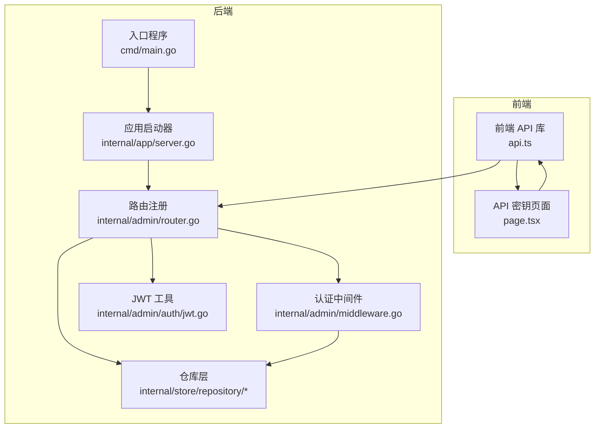
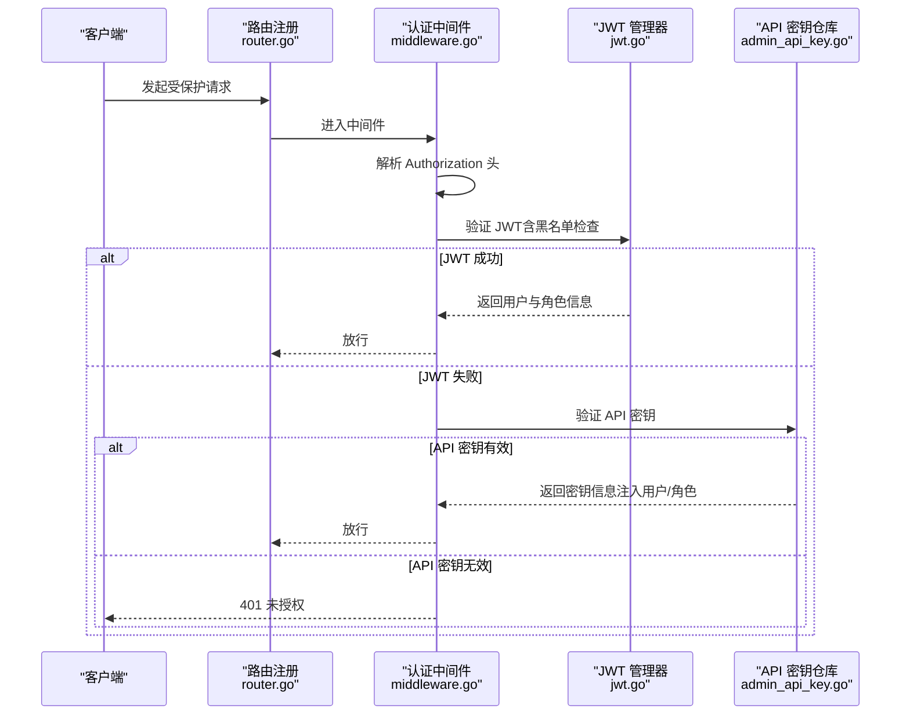
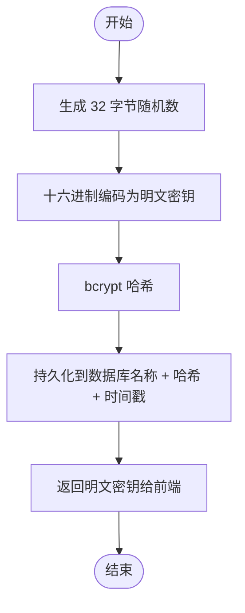
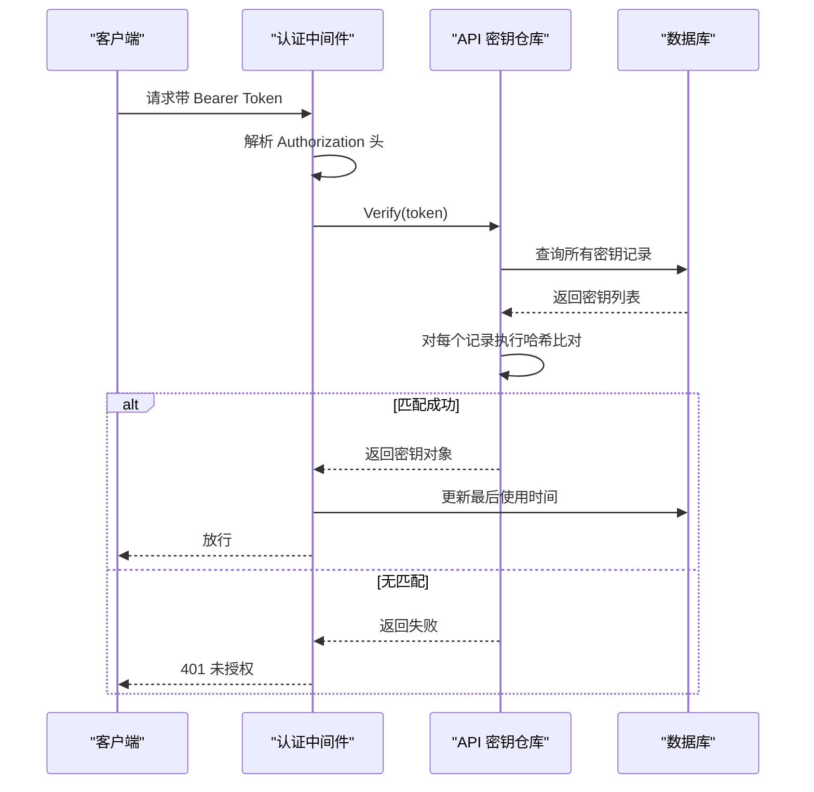
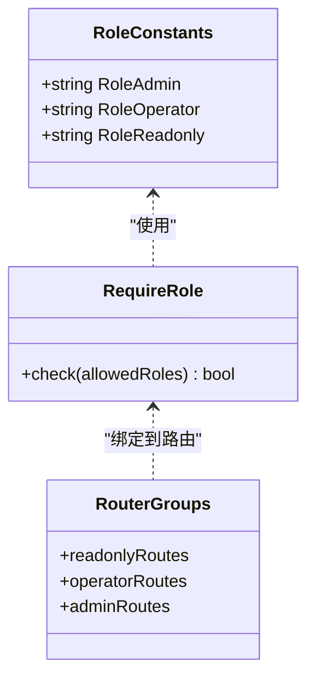
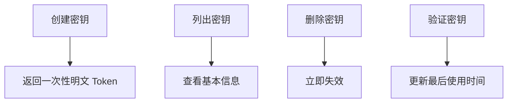
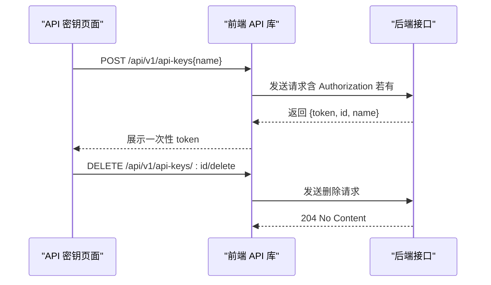
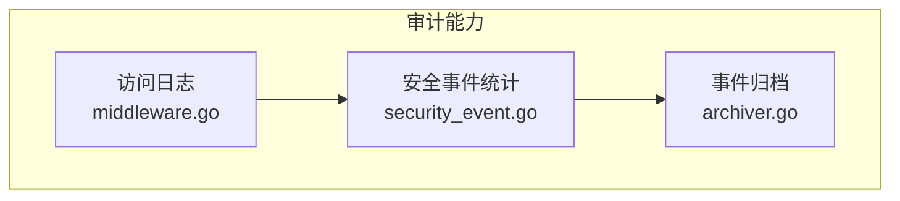
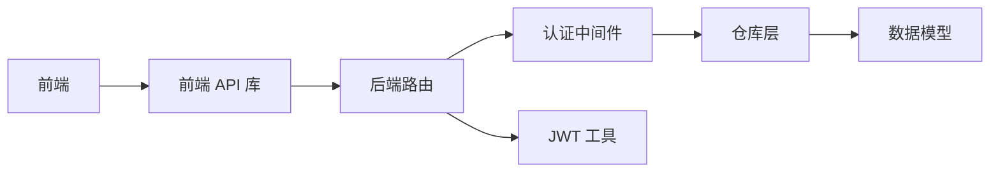

# API 密钥管理

<cite>
**本文档引用的文件**
- [cmd/main.go](file://cmd/main.go)
- [internal/app/server.go](file://internal/app/server.go)
- [internal/admin/router.go](file://internal/admin/router.go)
- [internal/admin/middleware.go](file://internal/admin/middleware.go)
- [internal/admin/system/apikey.go](file://internal/admin/system/apikey.go)
- [internal/admin/auth/jwt.go](file://internal/admin/auth/jwt.go)
- [internal/store/repository/admin_api_key.go](file://internal/store/repository/admin_api_key.go)
- [internal/store/repository/repository.go](file://internal/store/repository/repository.go)
- [frontend/app/(dashboard)/api-keys/page.tsx](file://frontend/app/(dashboard)/api-keys/page.tsx)
- [frontend/lib/api.ts](file://frontend/lib/api.ts)
- [docs/安全机制/API 密钥管理.md](file://docs/安全机制/API 密钥管理.md)
</cite>

## 目录
1. [简介](#简介)
2. [项目结构](#项目结构)
3. [核心组件](#核心组件)
4. [架构总览](#架构总览)
5. [详细组件分析](#详细组件分析)
6. [依赖关系分析](#依赖关系分析)
7. [性能考虑](#性能考虑)
8. [故障排除指南](#故障排除指南)
9. [结论](#结论)
10. [附录](#附录)

## 简介
本文件为 API 密钥管理系统的综合技术文档，覆盖密钥生成、存储、权限控制、生命周期管理、使用方式、密钥轮换策略以及安全审计功能。系统支持两种认证方式：基于 Bearer Token 的 API 密钥与基于 JWT 的用户会话。API 密钥采用一次性展示设计，密钥内容仅在创建时可见，后续不再回显；密钥验证通过哈希比对实现，确保安全性与可追溯性。

## 项目结构
系统采用前后端分离架构：
- 后端服务（Go）：负责 API 密钥的生成、存储、验证与权限控制，提供 REST 接口与前端静态资源托管。
- 前端应用（Next.js）：提供 API 密钥管理界面，支持创建、删除与查看密钥列表。

**图表来源**
- [cmd/main.go:1-10](file://cmd/main.go#L1-L10)
- [internal/app/server.go:257-278](file://internal/app/server.go#L257-L278)
- [internal/admin/router.go:46-179](file://internal/admin/router.go#L46-L179)
- [internal/admin/middleware.go:16-72](file://internal/admin/middleware.go#L16-L72)
- [internal/store/repository/admin_api_key.go:16-67](file://internal/store/repository/admin_api_key.go#L16-L67)
- [internal/admin/auth/jwt.go:43-135](file://internal/admin/auth/jwt.go#L43-L135)

**章节来源**
- [cmd/main.go:1-10](file://cmd/main.go#L1-L10)
- [internal/app/server.go:257-278](file://internal/app/server.go#L257-L278)
- [internal/admin/router.go:46-179](file://internal/admin/router.go#L46-L179)

## 核心组件
- API 密钥仓库：负责密钥生成、哈希存储、验证与删除。
- 数据模型：定义 AdminAPIKey 结构体及字段约束。
- 认证中间件：统一处理 Bearer Token 验证，优先 JWT，回退到 API 密钥。
- 路由与权限：按角色划分读写权限，管理员可管理 API 密钥。
- 前端界面：提供密钥创建、删除与列表展示。

**章节来源**
- [internal/store/repository/admin_api_key.go:16-67](file://internal/store/repository/admin_api_key.go#L16-L67)
- [internal/admin/middleware.go:16-72](file://internal/admin/middleware.go#L16-L72)
- [internal/admin/router.go:117-175](file://internal/admin/router.go#L117-L175)
- [frontend/app/(dashboard)/api-keys/page.tsx:31-171](file://frontend/app/(dashboard)/api-keys/page.tsx#L31-L171)

## 架构总览
系统通过认证中间件统一拦截请求，优先尝试 JWT 验证，若失败则回退至 API 密钥验证。API 密钥验证成功后，将用户身份与角色注入上下文，随后根据角色组策略放行到对应路由。

**图表来源**
- [internal/admin/router.go:67-69](file://internal/admin/router.go#L67-L69)
- [internal/admin/middleware.go:16-72](file://internal/admin/middleware.go#L16-L72)
- [internal/admin/auth/jwt.go:112-135](file://internal/admin/auth/jwt.go#L112-L135)
- [internal/store/repository/admin_api_key.go:48-63](file://internal/store/repository/admin_api_key.go#L48-L63)

## 详细组件分析

### 组件一：API 密钥生成与存储
- 密钥生成：使用加密安全的随机源生成原始密钥，编码为十六进制字符串返回给前端一次性展示。
- 存储机制：仅保存 bcrypt 哈希值，不存储明文密钥；数据库中保留名称、哈希与最后使用时间等元数据。
- 唯一性保证：前端展示的密钥为随机生成的 32 字节十六进制字符串，碰撞概率极低；数据库层面未见显式唯一索引，但随机长度足以保证安全性。
- 元数据管理：记录创建时间、最后使用时间；前端页面显示 ID、名称、创建时间与最近使用时间。
- 索引策略：AdminAPIKey 表包含自增主键与时间戳索引，便于排序与查询。

**图表来源**
- [internal/store/repository/admin_api_key.go:30-46](file://internal/store/repository/admin_api_key.go#L30-L46)

**章节来源**
- [internal/store/repository/admin_api_key.go:30-46](file://internal/store/repository/admin_api_key.go#L30-L46)

### 组件二：API 密钥验证与使用
- 验证流程：遍历所有密钥记录，逐个进行哈希比对；匹配成功后更新最后使用时间。
- 使用方式：客户端在请求头添加 Authorization: Bearer <token>；后端中间件解析并验证。
- 错误处理：缺失或格式错误的 Authorization 头返回 401；无效或过期密钥返回 401；权限不足返回 403。

**图表来源**
- [internal/admin/middleware.go:29-71](file://internal/admin/middleware.go#L29-L71)
- [internal/store/repository/admin_api_key.go:48-63](file://internal/store/repository/admin_api_key.go#L48-L63)

**章节来源**
- [internal/admin/middleware.go:29-71](file://internal/admin/middleware.go#L29-L71)
- [internal/store/repository/admin_api_key.go:48-63](file://internal/store/repository/admin_api_key.go#L48-L63)

### 组件三：权限控制与角色模型
- 角色常量：admin（全权）、operator（运维）、readonly（只读）。
- 中间件校验：RequireRole 将当前认证角色与允许集合比较，不匹配则返回 403。
- 路由分组：只读、运维与管理员三类路由分别绑定不同角色集合。
- API 密钥默认角色：API 密钥在中间件中被赋予 admin 角色，便于系统级自动化调用。

**图表来源**
- [internal/admin/middleware.go:74-96](file://internal/admin/middleware.go#L74-L96)
- [internal/admin/router.go:81-175](file://internal/admin/router.go#L81-L175)

**章节来源**
- [internal/admin/middleware.go:74-96](file://internal/admin/middleware.go#L74-L96)
- [internal/admin/router.go:81-175](file://internal/admin/router.go#L81-L175)

### 组件四：生命周期管理
- 创建：管理员通过 POST /api/v1/api-keys 创建新密钥，返回一次性明文 token。
- 列表：GET /api/v1/api-keys 获取密钥列表（只读用户可用）。
- 删除：管理员通过 POST /api/v1/api-keys/:id/delete 删除指定密钥。
- 最后使用时间：验证成功后更新密钥的 last_used_at 字段，便于审计与清理。

**图表来源**
- [internal/admin/router.go:117-175](file://internal/admin/router.go#L117-L175)
- [internal/store/repository/admin_api_key.go:20-28](file://internal/store/repository/admin_api_key.go#L20-L28)
- [internal/store/repository/admin_api_key.go:48-63](file://internal/store/repository/admin_api_key.go#L48-L63)

**章节来源**
- [internal/admin/router.go:117-175](file://internal/admin/router.go#L117-L175)
- [internal/store/repository/admin_api_key.go:20-28](file://internal/store/repository/admin_api_key.go#L20-L28)
- [internal/store/repository/admin_api_key.go:48-63](file://internal/store/repository/admin_api_key.go#L48-L63)

### 组件五：前端使用与集成
- 前端 API 库：统一封装 fetch，自动附加 Authorization 头；当 401 且存在旧 token 时尝试刷新访问令牌。
- 登录与登出：登录成功后保存 access_token；登出时清除本地 token 并调用后端注销接口。
- API 密钥页面：支持创建新密钥（输入名称），创建成功后展示一次性 token；支持删除密钥。

**图表来源**
- [frontend/lib/api.ts:31-88](file://frontend/lib/api.ts#L31-L88)
- [frontend/app/(dashboard)/api-keys/page.tsx:38-69](file://frontend/app/(dashboard)/api-keys/page.tsx#L38-L69)
- [internal/admin/router.go:172-174](file://internal/admin/router.go#L172-L174)

**章节来源**
- [frontend/lib/api.ts:31-88](file://frontend/lib/api.ts#L31-L88)
- [frontend/app/(dashboard)/api-keys/page.tsx:38-69](file://frontend/app/(dashboard)/api-keys/page.tsx#L38-L69)
- [internal/admin/router.go:172-174](file://internal/admin/router.go#L172-L174)

### 组件六：密钥轮换策略
- 自动轮换：系统未内置 API 密钥自动轮换机制；建议通过定期创建新密钥并替换旧密钥的方式实现轮换。
- 手动更新：管理员可在前端删除旧密钥并创建新密钥，以最小化停机时间。
- 迁移流程：先创建新密钥，验证新密钥可用后再删除旧密钥，避免服务中断。

**章节来源**
- [internal/admin/router.go:172-174](file://internal/admin/router.go#L172-L174)
- [frontend/app/(dashboard)/api-keys/page.tsx:38-69](file://frontend/app/(dashboard)/api-keys/page.tsx#L38-L69)

### 组件七：安全审计与合规
- 使用日志：中间件统一记录请求 ID、方法、路径、状态码与认证方式，便于审计追踪。
- 异常检测：登录失败触发暴力破解检测器，超过阈值临时锁定账户。
- 合规报告：系统提供安全事件统计与时间线接口，可用于合规审计与事件溯源。

**图表来源**
- [internal/admin/middleware.go:98-119](file://internal/admin/middleware.go#L98-L119)

**章节来源**
- [internal/admin/middleware.go:98-119](file://internal/admin/middleware.go#L98-L119)

## 依赖关系分析
- 组件耦合：认证中间件依赖仓库层进行密钥验证；路由层依赖中间件与仓库层；前端依赖后端接口。
- 外部依赖：bcrypt 用于密钥哈希；GORM 用于数据库访问；JWT 用于用户会话管理。
- 循环依赖：未发现循环依赖迹象，模块职责清晰。

**图表来源**
- [internal/admin/router.go:46-179](file://internal/admin/router.go#L46-L179)
- [internal/admin/middleware.go:16-72](file://internal/admin/middleware.go#L16-L72)
- [internal/store/repository/admin_api_key.go:16-67](file://internal/store/repository/admin_api_key.go#L16-L67)
- [internal/admin/auth/jwt.go:43-135](file://internal/admin/auth/jwt.go#L43-L135)

**章节来源**
- [internal/admin/router.go:46-179](file://internal/admin/router.go#L46-L179)
- [internal/admin/middleware.go:16-72](file://internal/admin/middleware.go#L16-L72)
- [internal/store/repository/admin_api_key.go:16-67](file://internal/store/repository/admin_api_key.go#L16-L67)
- [internal/admin/auth/jwt.go:43-135](file://internal/admin/auth/jwt.go#L43-L135)

## 性能考虑
- 验证复杂度：API 密钥验证需遍历所有记录进行哈希比对，时间复杂度 O(n)。建议限制密钥数量或引入缓存优化。
- 存储开销：bcrypt 哈希计算成本较高，应避免频繁验证；可考虑批量验证或缓存近期活跃密钥。
- 前端刷新：前端在 401 时自动刷新访问令牌，减少用户交互成本，但需注意网络抖动与重试策略。

## 故障排除指南
- 401 未授权：检查 Authorization 头是否正确设置为 Bearer <token>；确认密钥未被删除或过期。
- 403 权限不足：确认当前认证主体的角色是否满足目标路由要求。
- 刷新失败：前端在 401 时尝试刷新访问令牌，若仍失败则清空本地 token 并跳转登录页。
- 登录失败：检查用户名/密码；系统具备暴力破解防护，失败次数过多会被临时锁定。

**章节来源**
- [internal/admin/middleware.go:29-71](file://internal/admin/middleware.go#L29-L71)
- [frontend/lib/api.ts:48-88](file://frontend/lib/api.ts#L48-L88)

## 结论
本系统提供了完整的 API 密钥管理能力：安全的密钥生成与存储、灵活的权限控制、完善的审计日志与合规支持。建议在生产环境中配合定期轮换、最小权限原则与监控告警，进一步提升安全性与可维护性。

## 附录

### API 定义概览
- 创建 API 密钥
  - 方法：POST
  - 路径：/api/v1/api-keys
  - 请求体：{ name: string }
  - 响应：{ token: string, id: number, name: string }
- 删除 API 密钥
  - 方法：POST
  - 路径：/api/v1/api-keys/:id/delete
  - 响应：204 No Content
- 列出 API 密钥
  - 方法：GET
  - 路径：/api/v1/api-keys
  - 响应：{ items: [{ id, name, created_at, last_used_at }] }

**章节来源**
- [internal/admin/router.go:117-175](file://internal/admin/router.go#L117-L175)