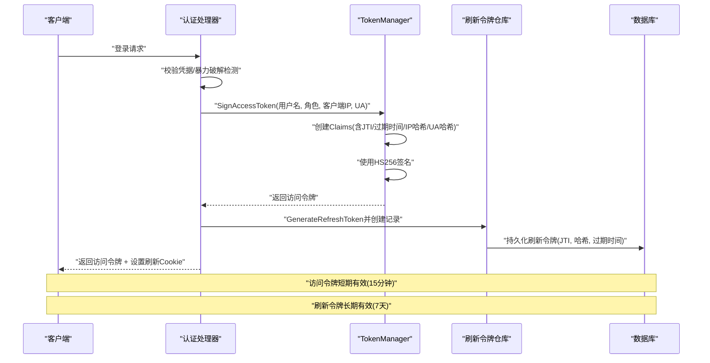
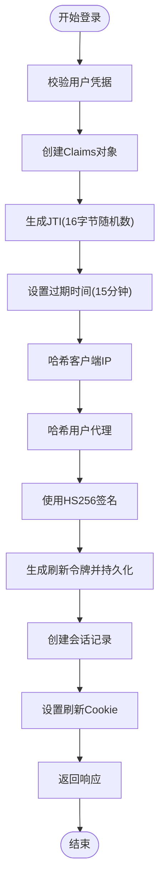
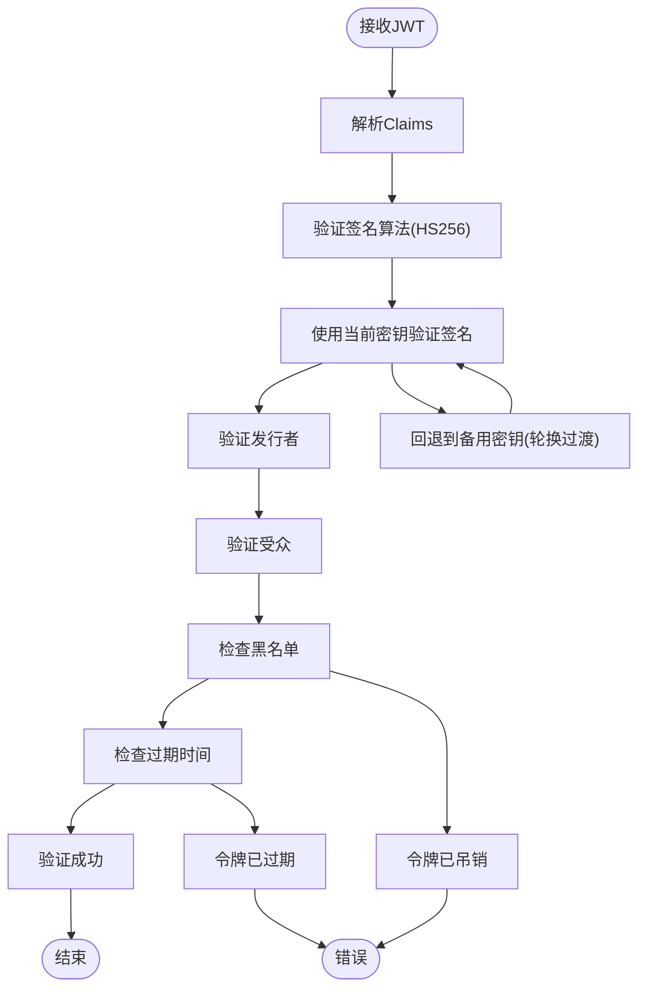
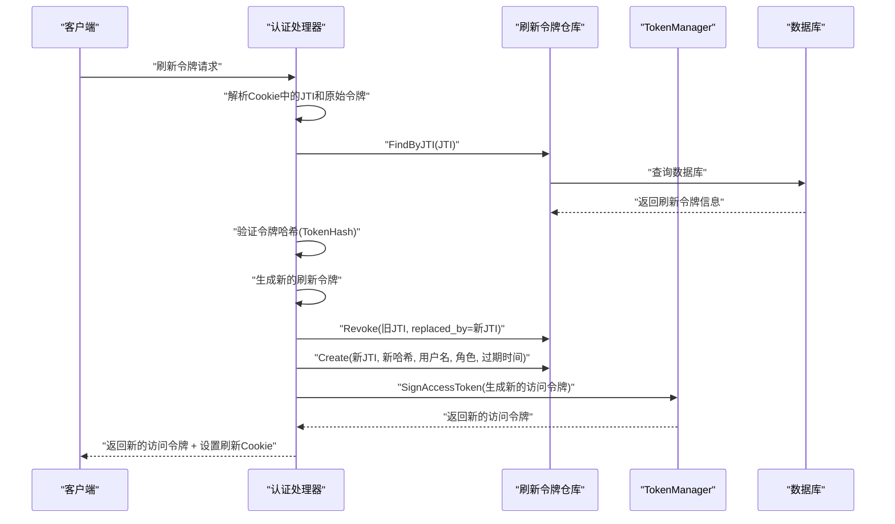
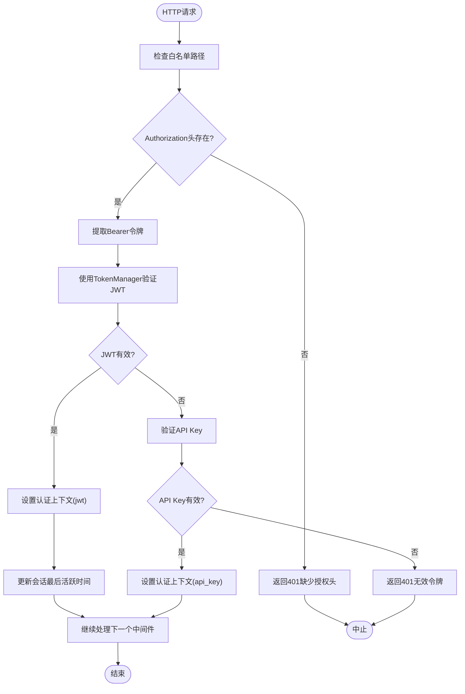
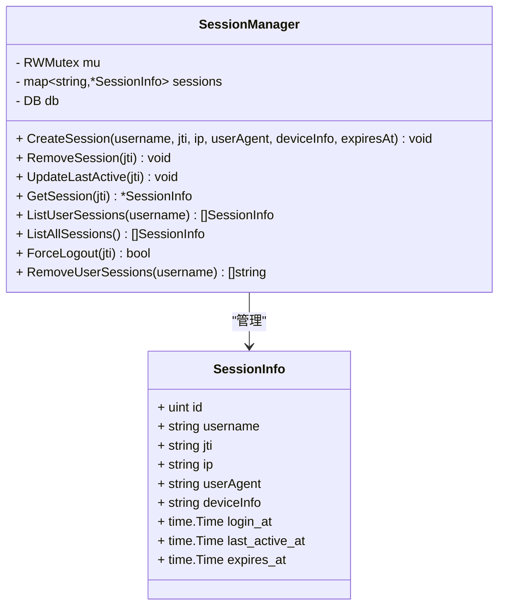
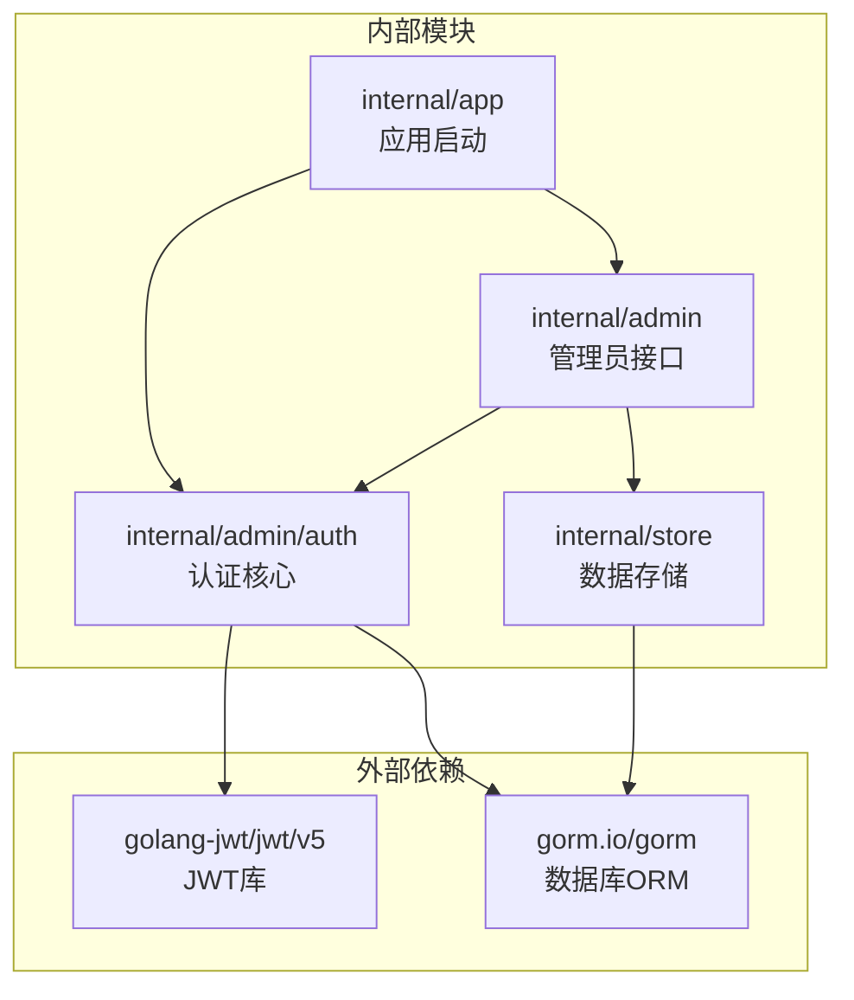

# JWT 认证机制

> [返回 安全机制](安全机制.md)

<cite>
**本文档引用的文件**
- [jwt.go](file://internal/admin/auth/jwt.go)
- [jwt_test.go](file://internal/admin/auth/jwt_test.go)
- [auth.go](file://internal/admin/auth.go)
- [auth_helpers.go](file://internal/admin/auth_helpers.go)
- [middleware.go](file://internal/admin/middleware.go)
- [refresh_token.go](file://internal/store/repository/refresh_token.go)
- [auth.go](file://internal/store/auth.go)
- [session.go](file://internal/admin/auth/session.go)
- [bruteforce.go](file://internal/admin/auth/bruteforce.go)
</cite>

## 目录
1. [简介](#简介)
2. [项目结构](#项目结构)
3. [核心组件](#核心组件)
4. [架构概览](#架构概览)
5. [详细组件分析](#详细组件分析)
6. [依赖关系分析](#依赖关系分析)
7. [性能考虑](#性能考虑)
8. [故障排除指南](#故障排除指南)
9. [结论](#结论)

## 简介
本文件面向 My-OpenWaf 项目的 JWT 认证机制，系统性阐述短期访问令牌与长期刷新令牌的设计理念、JWT 结构与签名算法（HMAC-SHA256）、有效期管理策略、令牌生成与验证流程、刷新令牌的存储与撤销机制，以及安全最佳实践与性能优化建议。目标读者既包括需要快速上手的开发者，也包括希望深入理解实现细节的架构师。

## 项目结构
JWT 认证机制在项目中的组织围绕“认证核心”“业务处理”“数据存储”“应用启动”四个层面展开，形成清晰的分层职责与依赖关系。

```mermaid
graph TB
subgraph "认证核心"
A[jwt.go<br/>JWT 核心实现]
B[middleware.go<br/>认证中间件]
C[session.go<br/>会话管理]
D[bruteforce.go<br/>暴力破解防护]
end
subgraph "业务处理"
E[auth.go<br/>认证处理器(login/refresh/logout/me)]
F[auth_helpers.go<br/>Cookie/辅助工具]
end
subgraph "数据存储"
G[refresh_token.go<br/>刷新令牌仓库]
H[auth.go<br/>数据模型(RefreshToken/TokenBlacklist/ActiveSession等)]
end
A --> B
B --> E
E --> G
G --> H
```

**图表来源**
- [jwt.go:1-295](file://internal/admin/auth/jwt.go#L1-L295)
- [middleware.go:1-130](file://internal/admin/middleware.go#L1-L130)
- [auth.go:1-233](file://internal/admin/auth.go#L1-L233)
- [auth_helpers.go:1-49](file://internal/admin/auth_helpers.go#L1-L49)
- [refresh_token.go:1-45](file://internal/store/repository/refresh_token.go#L1-L45)
- [auth.go:1-79](file://internal/store/auth.go#L1-L79)

**章节来源**
- [jwt.go:1-295](file://internal/admin/auth/jwt.go#L1-L295)
- [middleware.go:1-130](file://internal/admin/middleware.go#L1-L130)
- [auth.go:1-233](file://internal/admin/auth.go#L1-L233)
- [auth_helpers.go:1-49](file://internal/admin/auth_helpers.go#L1-L49)
- [refresh_token.go:1-45](file://internal/store/repository/refresh_token.go#L1-L45)
- [auth.go:1-79](file://internal/store/auth.go#L1-L79)

## 核心组件
本节聚焦 JWT Claims 结构、TokenManager 的职责边界、以及会话管理与暴力破解防护的关键要素。

- Claims 结构
  - 注册声明：包含 ID、发行者、受众、主题、过期时间、签发时间等。
  - 自定义声明：用户名、角色、客户端 IP 哈希、设备指纹哈希。
  - 作用：作为访问令牌的载体，承载认证与授权所需信息。

- TokenManager
  - 职责：签名与验证访问令牌、密钥轮换、令牌黑名单管理、持久化与内存双层缓存。
  - 关键方法：签名、验证、黑名单增删改查、密钥轮换、后台清理循环。
  - 并发安全：读写锁保护密钥与状态；内存黑名单使用并发安全 map。

- 会话管理
  - 职责：记录活跃会话、更新最后活跃时间、按用户列出会话、强制登出、清理过期会话。
  - 存储：内存 + 数据库双写，后台定时清理。

- 暴力破解防护
  - 职责：统计失败次数、锁定策略、剩余尝试次数、锁定期剩余时间。
  - 策略：IP 级与 IP+用户名级双重计数，支持动态配置与自动清理。

**章节来源**
- [jwt.go:24-31](file://internal/admin/auth/jwt.go#L24-L31)
- [jwt.go:43-80](file://internal/admin/auth/jwt.go#L43-L80)
- [session.go:12-30](file://internal/admin/auth/session.go#L12-L30)
- [bruteforce.go:9-39](file://internal/admin/auth/bruteforce.go#L9-L39)

## 架构概览
下图展示从登录到访问令牌发放、再到刷新令牌存储与会话建立的整体流程，以及后续刷新令牌请求的处理链路。



**图表来源**
- [auth.go:82-118](file://internal/admin/auth.go#L82-L118)
- [jwt.go:84-109](file://internal/admin/auth/jwt.go#L84-L109)
- [refresh_token.go:15-24](file://internal/store/repository/refresh_token.go#L15-L24)

**章节来源**
- [auth.go:82-118](file://internal/admin/auth.go#L82-L118)
- [jwt.go:84-109](file://internal/admin/auth/jwt.go#L84-L109)
- [refresh_token.go:15-24](file://internal/store/repository/refresh_token.go#L15-L24)

## 详细组件分析

### 访问令牌生成流程
访问令牌生成包含凭据校验、Claims 构造、JTI 生成、过期时间设定、IP/UA 哈希、HS256 签名、刷新令牌生成与会话记录等步骤。



**图表来源**
- [auth.go:82-118](file://internal/admin/auth.go#L82-L118)
- [jwt.go:84-109](file://internal/admin/auth/jwt.go#L84-L109)

**章节来源**
- [auth.go:82-118](file://internal/admin/auth.go#L82-L118)
- [jwt.go:84-109](file://internal/admin/auth/jwt.go#L84-L109)

### 令牌验证机制
验证流程支持算法校验、密钥轮换回退、黑名单检查、过期时间检查，并在中间件中统一接入。



**图表来源**
- [jwt.go:111-154](file://internal/admin/auth/jwt.go#L111-L154)
- [middleware.go:44-57](file://internal/admin/middleware.go#L44-L57)

**章节来源**
- [jwt.go:111-154](file://internal/admin/auth/jwt.go#L111-L154)
- [middleware.go:44-57](file://internal/admin/middleware.go#L44-L57)

### 刷新令牌机制
刷新令牌用于在访问令牌过期后换取新的访问令牌，同时完成旧令牌的撤销与新令牌的发放。



**图表来源**
- [auth.go:121-193](file://internal/admin/auth.go#L121-L193)
- [refresh_token.go:15-39](file://internal/store/repository/refresh_token.go#L15-L39)

**章节来源**
- [auth.go:121-193](file://internal/admin/auth.go#L121-L193)
- [refresh_token.go:15-39](file://internal/store/repository/refresh_token.go#L15-L39)

### 中间件认证流程
认证中间件优先处理白名单路径，随后尝试 JWT 验证，失败则回退到 API Key 验证，并在成功时注入认证上下文。



**图表来源**
- [middleware.go:18-72](file://internal/admin/middleware.go#L18-L72)

**章节来源**
- [middleware.go:18-72](file://internal/admin/middleware.go#L18-L72)

### 会话管理系统
会话管理器负责活跃会话的内存与持久化同步、按用户列出会话、强制登出与过期清理。



**图表来源**
- [session.go:25-41](file://internal/admin/auth/session.go#L25-L41)

**章节来源**
- [session.go:25-167](file://internal/admin/auth/session.go#L25-L167)

## 依赖关系分析
JWT 认证机制的依赖关系清晰，外部依赖集中在 JWT 库与数据库 ORM，内部模块之间通过明确的接口耦合。



**图表来源**
- [jwt.go:3-15](file://internal/admin/auth/jwt.go#L3-L15)
- [auth.go:15-25](file://internal/admin/auth.go#L15-L25)

**章节来源**
- [jwt.go:3-15](file://internal/admin/auth/jwt.go#L3-L15)
- [auth.go:15-25](file://internal/admin/auth.go#L15-L25)

## 性能考虑
- 内存缓存策略
  - 令牌黑名单使用并发安全 map，支持高频查找。
  - 会话信息内存存储，降低数据库压力。
  - 后台定时清理 goroutine，避免内存泄漏与数据膨胀。

- 并发安全
  - TokenManager 使用读写锁，读多写少场景性能更优。
  - 无锁读取优化常见场景，原子操作保证状态一致性。

- 资源管理
  - 定期清理 goroutine 生命周期可控。
  - 数据库连接池与索引设计（如 TokenBlacklist.ExpiresAt、RefreshToken.JTI 等）提升查询效率。

**章节来源**
- [jwt.go:237-253](file://internal/admin/auth/jwt.go#L237-L253)
- [session.go:190-208](file://internal/admin/auth/session.go#L190-L208)

## 故障排除指南
- 令牌验证失败
  - 检查 JWT 密钥是否正确配置（主密钥与备用密钥轮换期间的过渡）。
  - 验证发行者与受众声明是否匹配。
  - 确认令牌未被加入黑名单（JTI 黑名单或强制登出导致）。

- 刷新令牌失效
  - 检查刷新令牌是否过期或已被撤销。
  - 验证原始令牌哈希是否与数据库记录一致。
  - 确认旧刷新令牌已被正确撤销并替换为新令牌。

- 认证中间件异常
  - 检查 Authorization 头格式是否为 Bearer <token>。
  - 确认白名单路径配置正确，避免对健康检查与认证端点误拦截。
  - 核对会话最后活跃时间更新逻辑，防止因长时间无活动导致的异常。

- 安全最佳实践
  - 密钥管理：使用强随机密钥（至少 256 位），定期轮换，环境变量安全存储。
  - 令牌安全：启用 HTTPS 传输，设置 Cookie Secure/SameSite 属性，实施令牌黑名单与短生命周期访问令牌。
  - 会话管理：实现会话超时与强制登出，监控异常登录行为，定期清理过期会话。

**章节来源**
- [auth_helpers.go:13-25](file://internal/admin/auth_helpers.go#L13-L25)
- [auth.go:32-118](file://internal/admin/auth.go#L32-L118)
- [jwt.go:196-224](file://internal/admin/auth/jwt.go#L196-L224)

## 结论
My-OpenWaf 的 JWT 认证机制以短期访问令牌与长期刷新令牌为核心，结合 HS256 签名、密钥轮换、令牌黑名单与会话管理，构建了兼顾安全性与可用性的认证体系。通过严格的 Claims 结构、完善的验证流程与后台清理机制，系统在生产环境中具备良好的稳定性与可维护性。建议在部署时遵循安全最佳实践，并根据业务场景调整有效期与防护策略。