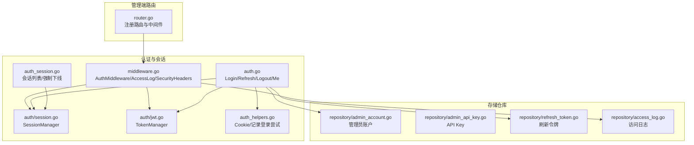
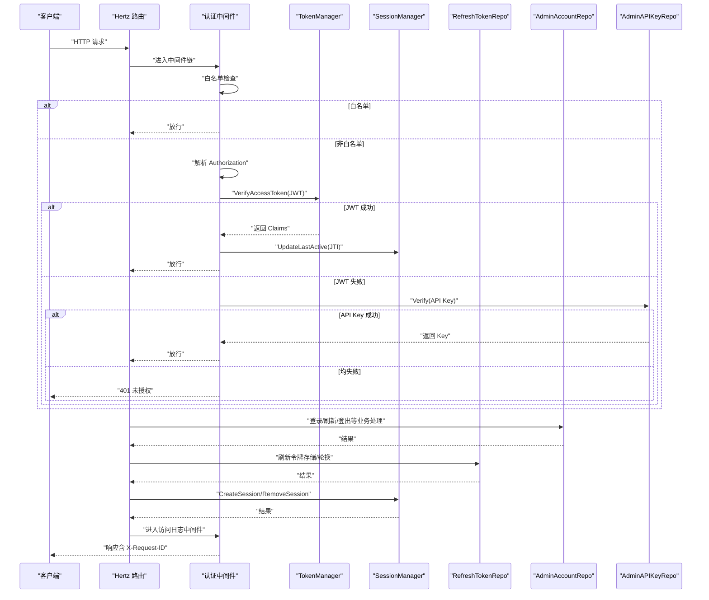
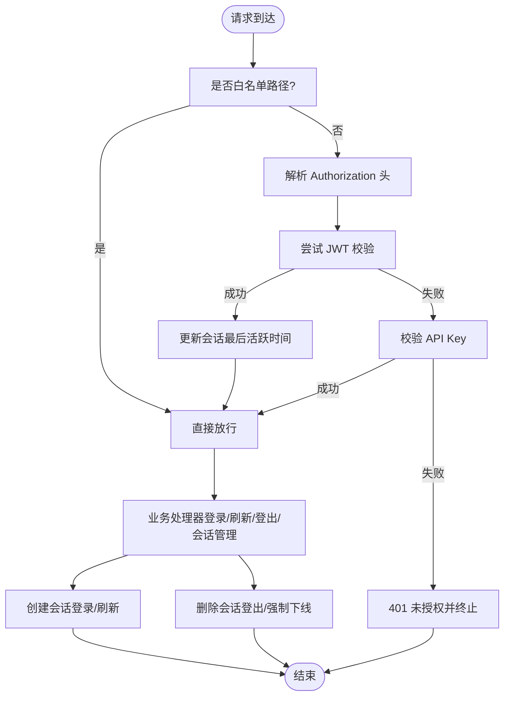
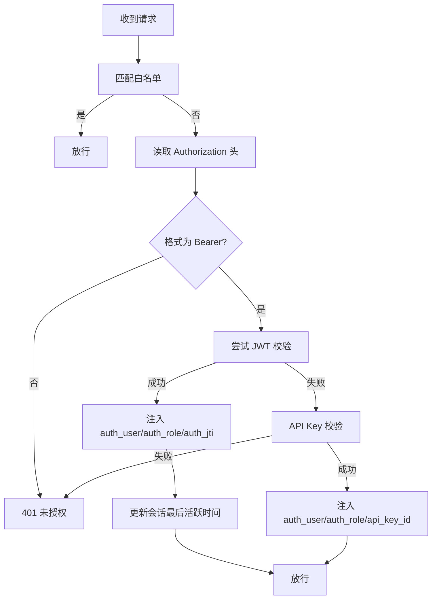
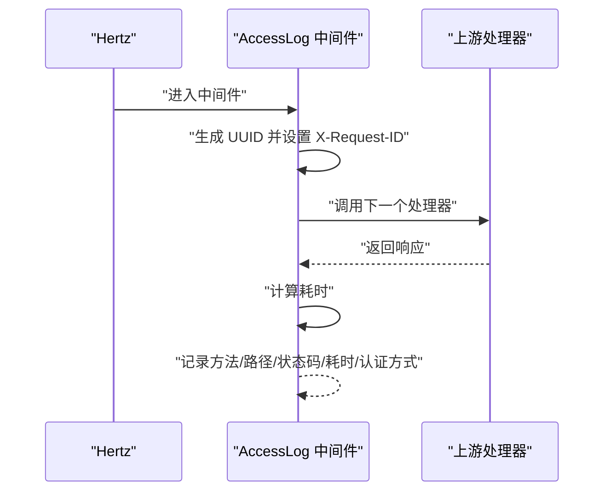
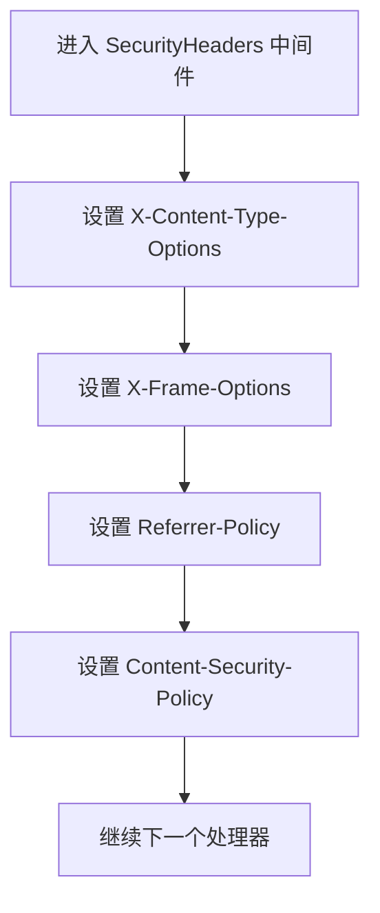
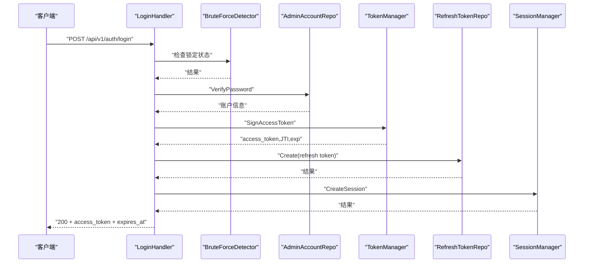
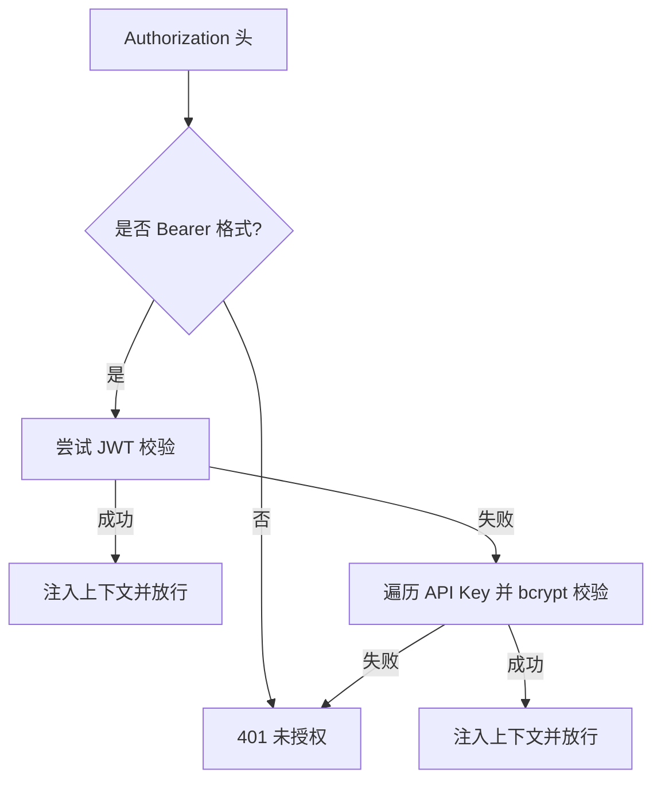
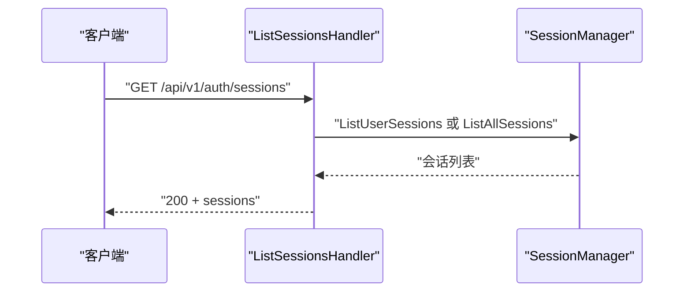
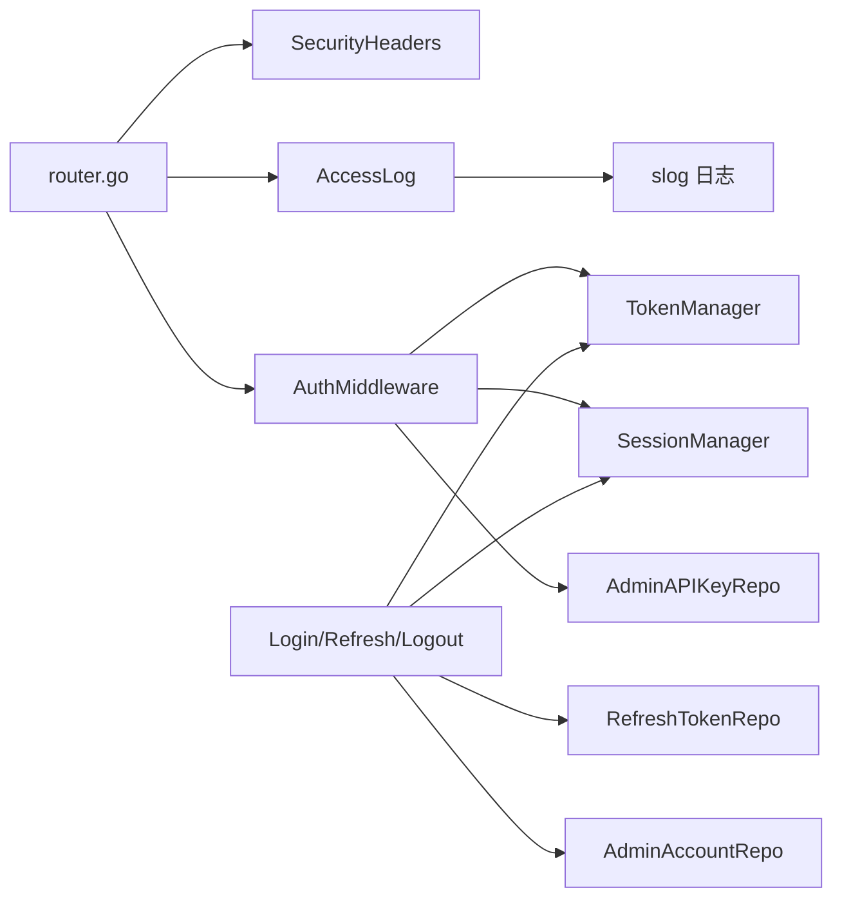

# 会话管理

<cite>
**本文引用的文件**
- [internal/admin/auth/session.go](file://internal/admin/auth/session.go)
- [internal/admin/middleware.go](file://internal/admin/middleware.go)
- [internal/admin/auth.go](file://internal/admin/auth.go)
- [internal/admin/auth_helpers.go](file://internal/admin/auth_helpers.go)
- [internal/admin/auth/jwt.go](file://internal/admin/auth/jwt.go)
- [internal/admin/auth_session.go](file://internal/admin/auth_session.go)
- [internal/admin/router.go](file://internal/admin/router.go)
- [internal/store/repository/admin_api_key.go](file://internal/store/repository/admin_api_key.go)
- [internal/store/repository/admin_account.go](file://internal/store/repository/admin_account.go)
- [internal/store/repository/refresh_token.go](file://internal/store/repository/refresh_token.go)
- [internal/store/repository/access_log.go](file://internal/store/repository/access_log.go)
</cite>

## 目录
1. [简介](#简介)
2. [项目结构](#项目结构)
3. [核心组件](#核心组件)
4. [架构总览](#架构总览)
5. [详细组件分析](#详细组件分析)
6. [依赖分析](#依赖分析)
7. [性能考量](#性能考量)
8. [故障排查指南](#故障排查指南)
9. [结论](#结论)
10. [附录](#附录)

## 简介
本文件面向会话管理系统，围绕以下目标展开：会话生命周期（创建、维护、销毁）、中间件认证机制（白名单路径、JWT 与 API Key 的优先级）、访问日志统一生成（请求 ID 注入、方法路径记录、状态码统计与耗时计算）、安全头设置策略（X-Content-Type-Options、X-Frame-Options、Referrer-Policy、Content-Security-Policy），并提供最佳实践与常见问题解决方案。

## 项目结构
会话管理相关代码主要分布在以下模块：
- 认证与会话：internal/admin/auth/*（会话管理器、JWT 管理器、登录/刷新/登出等）
- 中间件：internal/admin/middleware.go（认证中间件、访问日志中间件、安全头中间件）
- 路由注册：internal/admin/router.go（路由挂载、中间件顺序）
- 存储仓库：internal/store/repository/*（管理员账户、API Key、刷新令牌、访问日志）

图表来源
- [internal/admin/router.go:46-72](file://internal/admin/router.go#L46-L72)
- [internal/admin/middleware.go:16-129](file://internal/admin/middleware.go#L16-L129)
- [internal/admin/auth/session.go:25-209](file://internal/admin/auth/session.go#L25-L209)
- [internal/admin/auth/jwt.go:43-253](file://internal/admin/auth/jwt.go#L43-L253)
- [internal/admin/auth.go:32-221](file://internal/admin/auth.go#L32-L221)
- [internal/admin/auth_helpers.go:13-48](file://internal/admin/auth_helpers.go#L13-L48)
- [internal/admin/auth_session.go:12-65](file://internal/admin/auth_session.go#L12-L65)
- [internal/store/repository/admin_account.go:14-28](file://internal/store/repository/admin_account.go#L14-L28)
- [internal/store/repository/admin_api_key.go:48-63](file://internal/store/repository/admin_api_key.go#L48-L63)
- [internal/store/repository/refresh_token.go:26-39](file://internal/store/repository/refresh_token.go#L26-L39)
- [internal/store/repository/access_log.go:95-117](file://internal/store/repository/access_log.go#L95-L117)

章节来源
- [internal/admin/router.go:46-72](file://internal/admin/router.go#L46-L72)
- [internal/admin/middleware.go:16-129](file://internal/admin/middleware.go#L16-L129)

## 核心组件
- 会话管理器（SessionManager）：内存中跟踪活动会话，并持久化到数据库；定时清理过期会话；提供按用户或全局查询、更新活跃时间、强制下线等功能。
- JWT 管理器（TokenManager）：签发短期访问令牌、校验令牌、支持主/备密钥轮换、黑名单（JTI 粒度）持久化与清理。
- 认证中间件（AuthMiddleware）：白名单路径放行；Authorization 头解析；优先尝试 JWT 校验，失败回退至 API Key 校验；注入认证上下文信息；更新会话活跃时间。
- 访问日志中间件（AccessLog）：注入 X-Request-ID；在处理完成后记录方法、路径、状态码、耗时与认证方式。
- 安全头中间件（SecurityHeaders）：统一设置 X-Content-Type-Options、X-Frame-Options、Referrer-Policy、Content-Security-Policy。
- 登录/刷新/登出处理器：完成密码校验、JWT 签发、刷新令牌存储与轮换、会话创建、登出时撤销刷新令牌与加入访问令牌黑名单并删除会话。
- API Key 仓库：生成一次性明文令牌（仅首次可见）、存储 bcrypt 哈希、校验时逐条比对并更新最后使用时间。
- 刷新令牌仓库：按 JTI 查询未撤销且未过期的刷新令牌，支持撤销与清理过期项。
- 访问日志仓库：提供分页查询、过滤、批量写入、按请求 ID 查询等能力。

章节来源
- [internal/admin/auth/session.go:25-209](file://internal/admin/auth/session.go#L25-L209)
- [internal/admin/auth/jwt.go:43-253](file://internal/admin/auth/jwt.go#L43-L253)
- [internal/admin/middleware.go:16-129](file://internal/admin/middleware.go#L16-L129)
- [internal/admin/auth.go:32-221](file://internal/admin/auth.go#L32-L221)
- [internal/store/repository/admin_api_key.go:48-63](file://internal/store/repository/admin_api_key.go#L48-L63)
- [internal/store/repository/refresh_token.go:26-39](file://internal/store/repository/refresh_token.go#L26-L39)
- [internal/store/repository/access_log.go:95-117](file://internal/store/repository/access_log.go#L95-L117)

## 架构总览
会话管理贯穿“路由注册 → 中间件链 → 处理器 → 仓储”的调用链路。认证中间件负责白名单放行与 JWT/API Key 校验；处理器在成功登录/刷新后创建会话；登出时撤销刷新令牌并加入访问令牌黑名单同时删除会话；访问日志中间件统一注入请求 ID 并记录关键指标。

图表来源
- [internal/admin/middleware.go:16-72](file://internal/admin/middleware.go#L16-L72)
- [internal/admin/auth/jwt.go:111-135](file://internal/admin/auth/jwt.go#L111-L135)
- [internal/admin/auth/session.go:87-94](file://internal/admin/auth/session.go#L87-L94)
- [internal/admin/auth.go:32-221](file://internal/admin/auth.go#L32-L221)
- [internal/store/repository/admin_account.go:19-27](file://internal/store/repository/admin_account.go#L19-L27)
- [internal/store/repository/admin_api_key.go:48-63](file://internal/store/repository/admin_api_key.go#L48-L63)
- [internal/store/repository/refresh_token.go:26-39](file://internal/store/repository/refresh_token.go#L26-L39)

## 详细组件分析

### 会话生命周期管理
- 创建：登录/刷新成功后，根据访问令牌的 JTI、客户端 IP、UA、过期时间在内存与数据库中创建会话记录。
- 维护：每次通过 JWT 认证的请求都会更新对应会话的“最后活跃时间”。
- 销毁：登出时撤销刷新令牌、将访问令牌 JTI 加入黑名单并在会话表中删除；也可通过“强制下线”接口按 JTI 删除会话并加入黑名单。
- 清理：后台定时任务每 5 分钟清理过期会话并同步数据库。

图表来源
- [internal/admin/middleware.go:16-72](file://internal/admin/middleware.go#L16-L72)
- [internal/admin/auth/session.go:43-94](file://internal/admin/auth/session.go#L43-L94)
- [internal/admin/auth.go:196-221](file://internal/admin/auth.go#L196-L221)
- [internal/admin/auth_session.go:36-65](file://internal/admin/auth_session.go#L36-L65)

章节来源
- [internal/admin/auth/session.go:43-209](file://internal/admin/auth/session.go#L43-L209)
- [internal/admin/auth.go:32-221](file://internal/admin/auth.go#L32-L221)
- [internal/admin/auth_session.go:12-65](file://internal/admin/auth_session.go#L12-L65)

### 中间件认证机制与白名单
- 白名单路径：健康检查与认证相关端点（登录/刷新/登出）不进行认证。
- 认证优先级：先尝试 JWT（Bearer），失败再尝试 API Key；成功后注入认证用户、角色、方法等上下文。
- 会话活跃更新：JWT 成功后更新对应会话的最后活跃时间。

图表来源
- [internal/admin/middleware.go:16-72](file://internal/admin/middleware.go#L16-L72)
- [internal/admin/auth/jwt.go:111-135](file://internal/admin/auth/jwt.go#L111-L135)
- [internal/admin/auth/session.go:87-94](file://internal/admin/auth/session.go#L87-L94)

章节来源
- [internal/admin/middleware.go:16-72](file://internal/admin/middleware.go#L16-L72)

### 访问日志统一生成机制
- 请求 ID 注入：在进入访问日志中间件前生成 UUID 并写入响应头与上下文。
- 记录内容：方法、路径、状态码、耗时、认证方式（jwt/api_key）。
- 日志输出：使用 slog 记录统一格式的日志项。

图表来源
- [internal/admin/middleware.go:98-119](file://internal/admin/middleware.go#L98-L119)

章节来源
- [internal/admin/middleware.go:98-119](file://internal/admin/middleware.go#L98-L119)

### 安全头设置策略
- X-Content-Type-Options: nosniff，阻止 MIME 类型嗅探导致的类型混淆攻击。
- X-Frame-Options: DENY，防止页面被嵌入到 iframe 中，降低点击劫持风险。
- Referrer-Policy: strict-origin-when-cross-origin，平衡隐私与安全性。
- Content-Security-Policy: default-src 'self'；script-src 'self' 'unsafe-inline'；style-src 'self' 'unsafe-inline'，限制脚本与样式的来源，降低 XSS 风险。

图表来源
- [internal/admin/middleware.go:121-129](file://internal/admin/middleware.go#L121-L129)

章节来源
- [internal/admin/middleware.go:121-129](file://internal/admin/middleware.go#L121-L129)

### 登录/刷新/登出流程
- 登录：校验密码，触发暴力破解检测；成功后签发短期访问令牌与刷新令牌，创建会话；设置刷新令牌 Cookie。
- 刷新：从 Cookie 解析 JTI 与原始刷新令牌，校验哈希与有效性；撤销旧刷新令牌并发放新刷新令牌与新的短期访问令牌；创建会话。
- 登出：撤销刷新令牌；将访问令牌 JTI 加入黑名单并在会话表中删除；清除刷新令牌 Cookie。

图表来源
- [internal/admin/auth.go:32-119](file://internal/admin/auth.go#L32-L119)
- [internal/admin/auth/jwt.go:84-109](file://internal/admin/auth/jwt.go#L84-L109)
- [internal/store/repository/admin_account.go:19-27](file://internal/store/repository/admin_account.go#L19-L27)
- [internal/store/repository/refresh_token.go:15-24](file://internal/store/repository/refresh_token.go#L15-L24)
- [internal/admin/auth/session.go:43-74](file://internal/admin/auth/session.go#L43-L74)

章节来源
- [internal/admin/auth.go:121-194](file://internal/admin/auth.go#L121-L194)
- [internal/admin/auth.go:196-221](file://internal/admin/auth.go#L196-L221)

### API Key 与 JWT 的优先级与回退
- 优先级：Authorization 头以 Bearer 开头时，优先尝试 JWT 校验；若 JWT 校验失败，则尝试 API Key 校验。
- API Key 校验：遍历所有已存储的密钥，使用 bcrypt 对比哈希，命中后更新最后使用时间并放行。

图表来源
- [internal/admin/middleware.go:29-71](file://internal/admin/middleware.go#L29-L71)
- [internal/store/repository/admin_api_key.go:48-63](file://internal/store/repository/admin_api_key.go#L48-L63)

章节来源
- [internal/admin/middleware.go:29-71](file://internal/admin/middleware.go#L29-L71)
- [internal/store/repository/admin_api_key.go:48-63](file://internal/store/repository/admin_api_key.go#L48-L63)

### 会话管理 API
- 列出当前用户会话或全部会话（管理员可查看全部）。
- 强制下线指定会话：删除会话并将其 JTI 加入访问令牌黑名单。

图表来源
- [internal/admin/auth_session.go:12-34](file://internal/admin/auth_session.go#L12-L34)
- [internal/admin/auth/session.go:108-136](file://internal/admin/auth/session.go#L108-L136)

章节来源
- [internal/admin/auth_session.go:36-65](file://internal/admin/auth_session.go#L36-L65)
- [internal/admin/auth/session.go:138-167](file://internal/admin/auth/session.go#L138-L167)

## 依赖分析
- 路由注册顺序：全局中间件（安全头、访问日志）先于认证中间件执行；认证中间件再应用于受保护的 API 分组。
- 认证依赖：AuthMiddleware 依赖 TokenManager（JWT 校验）与 SessionManager（活跃时间更新）；API Key 依赖 AdminAPIKeyRepo。
- 业务处理依赖：Login/Refresh/Logout 依赖 AdminAccountRepo、RefreshTokenRepo、TokenManager、SessionManager。
- 访问日志依赖：AccessLog 依赖 slog 记录器。

图表来源
- [internal/admin/router.go:46-72](file://internal/admin/router.go#L46-L72)
- [internal/admin/middleware.go:16-129](file://internal/admin/middleware.go#L16-L129)
- [internal/admin/auth.go:32-221](file://internal/admin/auth.go#L32-L221)

章节来源
- [internal/admin/router.go:46-72](file://internal/admin/router.go#L46-L72)

## 性能考量
- 会话存储：内存 + 数据库双写，定期清理过期会话，避免内存膨胀；建议结合数据库索引优化查询。
- JWT 黑名单：内存 + 数据库持久化，定时清理过期条目；黑名单查询为 O(1)。
- API Key 校验：逐条 bcrypt 对比，建议限制 API Key 数量或引入缓存加速。
- 访问日志：统一注入请求 ID，便于跨服务追踪；注意日志落盘与异步写入策略，避免阻塞请求处理。

## 故障排查指南
- 401 未授权
  - 检查 Authorization 头格式是否为 Bearer。
  - 若使用 API Key，请确认密钥有效且未过期。
  - 若使用 JWT，请确认签名密钥正确、未被撤销（JTI 在黑名单中）。
- 403 权限不足
  - 检查 RequireRole 中间件配置的角色集合。
- 登录频繁失败被锁定
  - 查看暴力破解检测状态与剩余尝试次数。
- 会话无法列出或活跃时间未更新
  - 确认 JWT 校验成功且 JTI 正确；检查 SessionManager 的活跃时间更新逻辑。
- 登出后仍可访问
  - 确认刷新令牌已撤销、访问令牌 JTI 已加入黑名单且会话已删除。
- 访问日志缺失
  - 确认中间件顺序：SecurityHeaders → AccessLog → 其他处理器；检查 slog 输出配置。

章节来源
- [internal/admin/middleware.go:16-72](file://internal/admin/middleware.go#L16-L72)
- [internal/admin/auth/jwt.go:198-224](file://internal/admin/auth/jwt.go#L198-L224)
- [internal/admin/auth.go:32-119](file://internal/admin/auth.go#L32-L119)
- [internal/admin/auth_session.go:36-65](file://internal/admin/auth_session.go#L36-L65)

## 结论
该会话管理系统通过“JWT + API Key”的双轨认证、统一的安全头与访问日志中间件，以及内存+数据库的会话持久化策略，实现了高可用、可审计的管理端认证与会话控制。配合定时清理与黑名单机制，能够有效抵御常见攻击并满足运维审计需求。

## 附录
- 最佳实践
  - 使用 HTTPS 发送刷新令牌 Cookie，并启用 Secure 与 SameSite 属性。
  - 定期轮换 JWT 密钥，确保主/备密钥切换平滑。
  - 控制 API Key 数量与权限范围，定期轮换与审计。
  - 启用访问日志并集中化存储，结合请求 ID 实现端到端追踪。
  - 对会话与黑名单实施定期巡检，清理过期数据。
- 常见问题
  - JWT 无法校验：检查签发方、受众、签名密钥与时间偏移。
  - API Key 校验失败：确认 bcrypt 哈希一致且未被删除。
  - 会话活跃时间不更新：确认 JWT 成功且 JTI 正确传递。
  - 登出无效：确认刷新令牌撤销、访问令牌 JTI 黑名单与会话删除均执行。