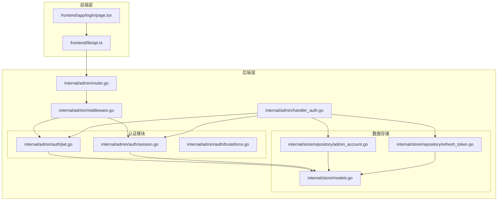
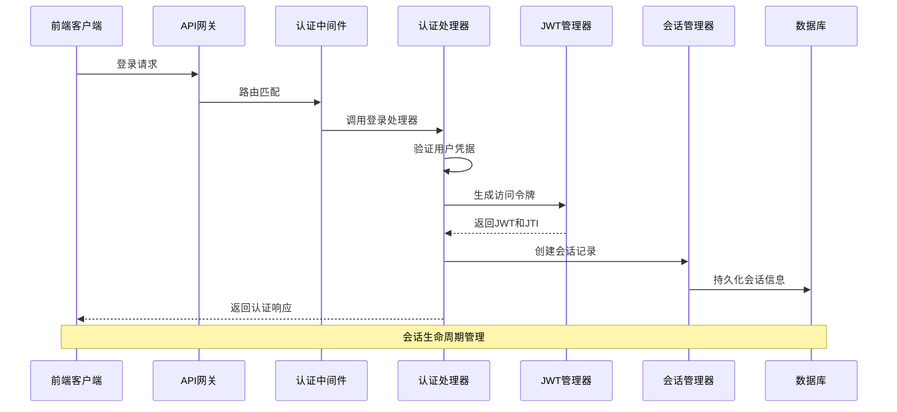
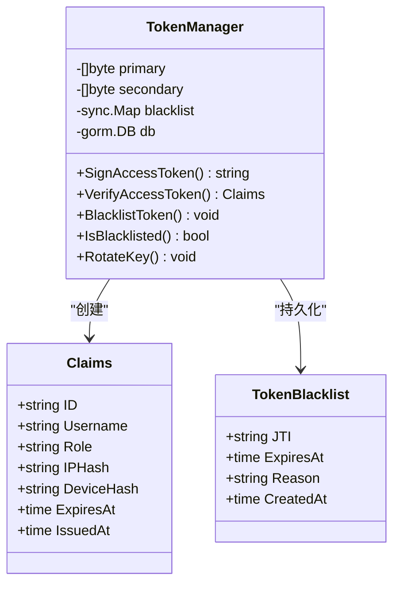
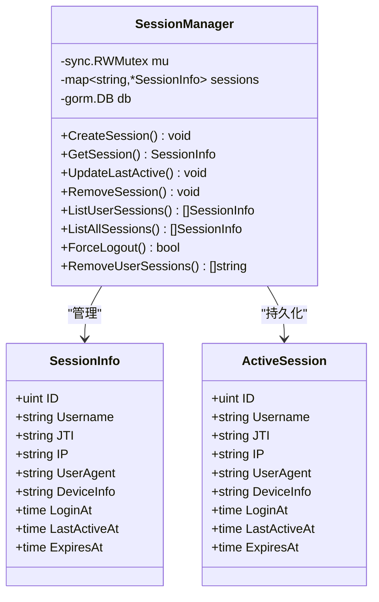
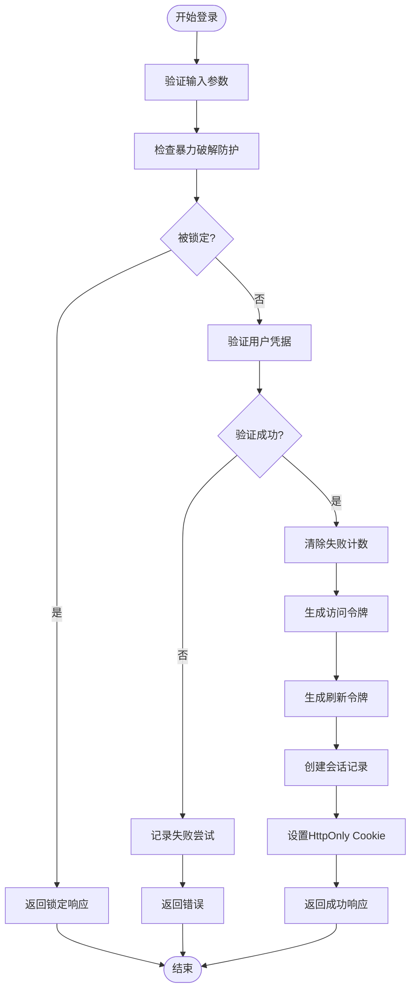
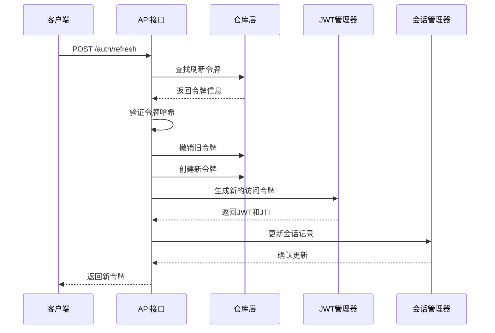
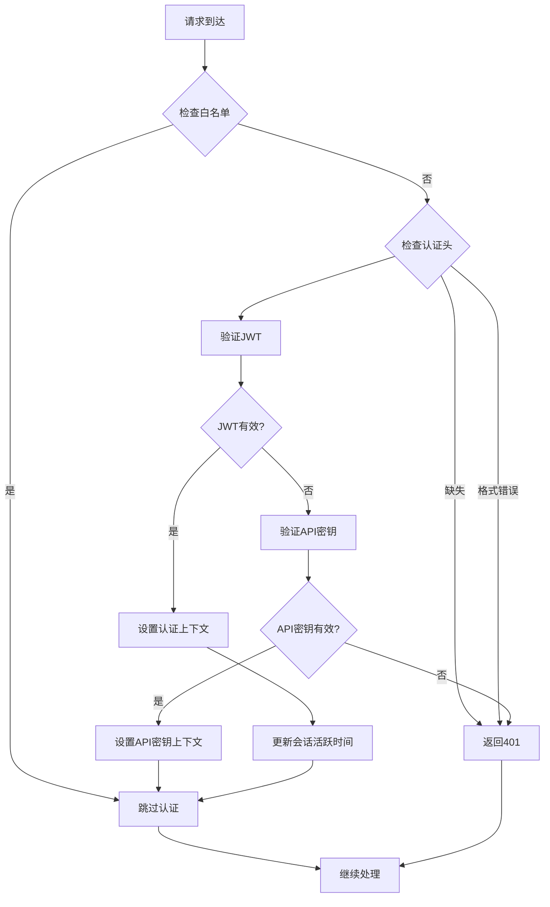
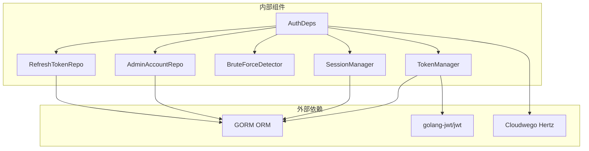

# 会话管理系统

<cite>
**本文档引用的文件**
- [jwt.go](file://internal/admin/auth/jwt.go)
- [session.go](file://internal/admin/auth/session.go)
- [handler_auth.go](file://internal/admin/handler_auth.go)
- [middleware.go](file://internal/admin/middleware.go)
- [router.go](file://internal/admin/router.go)
- [models.go](file://internal/store/models.go)
- [admin_account.go](file://internal/store/repository/admin_account.go)
- [refresh_token.go](file://internal/store/repository/refresh_token.go)
- [api.ts](file://frontend/lib/api.ts)
- [page.tsx](file://frontend/app/login/page.tsx)
- [bruteforce.go](file://internal/admin/auth/bruteforce.go)
</cite>

## 目录
1. [简介](#简介)
2. [项目结构](#项目结构)
3. [核心组件](#核心组件)
4. [架构概览](#架构概览)
5. [详细组件分析](#详细组件分析)
6. [依赖关系分析](#依赖关系分析)
7. [性能考虑](#性能考虑)
8. [故障排除指南](#故障排除指南)
9. [结论](#结论)

## 简介

My-OpenWaf 是一个基于 Go 语言开发的 Web 应用防火墙管理面板，采用现代化的会话管理系统来确保系统的安全性与可靠性。该系统实现了完整的会话生命周期管理，包括会话创建、状态跟踪、安全控制、存储策略以及销毁机制。

本系统采用 JWT（JSON Web Token）作为主要的身份验证机制，结合刷新令牌和会话管理器，提供了多层次的安全保障。前端使用 Next.js 构建，通过自定义的 API 客户端处理认证流程，确保最佳的安全实践。

## 项目结构

会话管理系统在项目中的组织结构如下：

**图表来源**
- [router.go:46-76](file://internal/admin/router.go#L46-L76)
- [middleware.go:18-72](file://internal/admin/middleware.go#L18-L72)
- [handler_auth.go:32-123](file://internal/admin/handler_auth.go#L32-L123)

**章节来源**
- [router.go:1-205](file://internal/admin/router.go#L1-L205)
- [middleware.go:1-130](file://internal/admin/middleware.go#L1-L130)

## 核心组件

会话管理系统由以下核心组件构成：

### 1. JWT 令牌管理器
负责生成、验证和管理 JWT 令牌，支持密钥轮换和令牌黑名单功能。

### 2. 会话管理器
维护内存中的活动会话，并持久化到数据库，提供会话查询、更新和清理功能。

### 3. 认证处理器
处理用户登录、刷新令牌和注销等认证相关操作。

### 4. 中间件
提供统一的认证和授权检查，支持多种认证方式。

### 5. 存储模型
定义了会话、令牌和登录尝试等相关数据结构。

**章节来源**
- [jwt.go:44-52](file://internal/admin/auth/jwt.go#L44-L52)
- [session.go:26-30](file://internal/admin/auth/session.go#L26-L30)
- [handler_auth.go:17-25](file://internal/admin/handler_auth.go#L17-L25)
- [models.go:379-389](file://internal/store/models.go#L379-L389)

## 架构概览

系统采用分层架构设计，实现了清晰的关注点分离：

**图表来源**
- [handler_auth.go:32-123](file://internal/admin/handler_auth.go#L32-L123)
- [jwt.go:84-109](file://internal/admin/auth/jwt.go#L84-L109)
- [session.go:44-74](file://internal/admin/auth/session.go#L44-L74)

## 详细组件分析

### JWT 令牌管理器

JWT 令牌管理器是会话系统的核心组件，负责令牌的生成、验证和安全管理。

#### 令牌结构设计

**图表来源**
- [jwt.go:25-31](file://internal/admin/auth/jwt.go#L25-L31)
- [jwt.go:44-52](file://internal/admin/auth/jwt.go#L44-L52)
- [models.go:358-364](file://internal/store/models.go#L358-L364)

#### 令牌生命周期管理

系统实现了完整的令牌生命周期管理：

1. **令牌生成**：为每个用户生成唯一的访问令牌
2. **令牌验证**：支持主密钥和备用密钥的验证
3. **令牌黑名单**：支持令牌撤销和黑名单管理
4. **密钥轮换**：支持安全的密钥轮换机制

**章节来源**
- [jwt.go:84-135](file://internal/admin/auth/jwt.go#L84-L135)
- [jwt.go:198-224](file://internal/admin/auth/jwt.go#L198-L224)

### 会话管理器

会话管理器负责维护用户的活动会话状态，提供会话的创建、查询、更新和清理功能。

#### 会话数据结构

**图表来源**
- [session.go:13-23](file://internal/admin/auth/session.go#L13-L23)
- [session.go:26-30](file://internal/admin/auth/session.go#L26-L30)
- [models.go:379-389](file://internal/store/models.go#L379-L389)

#### 会话状态管理

会话管理器实现了多层状态管理机制：

1. **内存状态**：实时维护活动会话的内存映射
2. **持久化存储**：将会话信息持久化到数据库
3. **自动清理**：定期清理过期会话
4. **并发安全**：使用读写锁保证线程安全

**章节来源**
- [session.go:44-74](file://internal/admin/auth/session.go#L44-L74)
- [session.go:190-208](file://internal/admin/auth/session.go#L190-L208)

### 认证处理器

认证处理器负责处理用户认证相关的所有操作，包括登录、刷新令牌和注销。

#### 登录流程

**图表来源**
- [handler_auth.go:32-123](file://internal/admin/handler_auth.go#L32-L123)

#### 刷新令牌流程

**图表来源**
- [handler_auth.go:125-193](file://internal/admin/handler_auth.go#L125-L193)

**章节来源**
- [handler_auth.go:32-193](file://internal/admin/handler_auth.go#L32-L193)

### 中间件系统

中间件系统提供了统一的认证和授权检查机制，支持多种认证方式。

#### 认证流程

**图表来源**
- [middleware.go:18-72](file://internal/admin/middleware.go#L18-L72)

**章节来源**
- [middleware.go:18-72](file://internal/admin/middleware.go#L18-L72)

### 存储模型

系统使用 GORM ORM 框架进行数据持久化，定义了完整的数据模型。

#### 数据模型关系

```mermaid
erDiagram
ACTIVE_SESSION {
uint id PK
string username
string jti UK
string ip
string user_agent
string device_info
time login_at
time last_active_at
time expires_at
}
REFRESH_TOKEN {
uint id PK
string jti UK
string token_hash
time expires_at
bool revoked
string replaced_by
time created_at
}
TOKEN_BLACKLIST {
uint id PK
string jti UK
time expires_at
string reason
time created_at
}
LOGIN_ATTEMPT {
uint id PK
string username
string ip
bool success
string user_agent
time created_at
}
ADMIN_ACCOUNT {
uint id PK
string username UK
string password_hash
time updated_at
}
ACTIVE_SESSION ||--|| TOKEN_BLACKLIST : "关联"
ACTIVE_SESSION ||--|| LOGIN_ATTEMPT : "关联"
ADMIN_ACCOUNT ||--|| REFRESH_TOKEN : "关联"
```

**图表来源**
- [models.go:171-189](file://internal/store/models.go#L171-L189)
- [models.go:358-389](file://internal/store/models.go#L358-L389)

**章节来源**
- [models.go:171-189](file://internal/store/models.go#L171-L189)
- [models.go:358-389](file://internal/store/models.go#L358-L389)

## 依赖关系分析

系统采用了清晰的依赖注入模式，各组件之间的依赖关系如下：

**图表来源**
- [handler_auth.go:17-25](file://internal/admin/handler_auth.go#L17-L25)
- [jwt.go:3-15](file://internal/admin/auth/jwt.go#L3-L15)

**章节来源**
- [handler_auth.go:17-25](file://internal/admin/handler_auth.go#L17-L25)
- [jwt.go:3-15](file://internal/admin/auth/jwt.go#L3-L15)

## 性能考虑

会话管理系统在设计时充分考虑了性能优化：

### 内存优化
- 使用 sync.Map 和 RWMutex 实现高效的并发访问
- 会话数据采用指针存储，减少内存复制开销
- 定期清理过期会话，防止内存泄漏

### 数据库优化
- 为常用查询字段建立索引（username、jti、expires_at）
- 批量操作减少数据库往返次数
- 异步清理过期数据，避免阻塞主线程

### 缓存策略
- 内存中的会话状态提供快速访问
- 黑名单缓存在内存中，支持快速查找
- 令牌验证结果可缓存（需要实现）

## 故障排除指南

### 常见问题及解决方案

#### 1. 令牌验证失败
**症状**：用户登录后无法访问受保护资源
**原因**：
- 令牌签名不正确
- 令牌已过期
- 令牌被加入黑名单

**解决方案**：
- 检查服务器时间和时区配置
- 验证 JWT 密钥配置
- 清理过期的令牌黑名单

#### 2. 会话无法创建
**症状**：用户登录成功但会话未创建
**原因**：
- 数据库连接异常
- 会话管理器初始化失败
- 并发冲突

**解决方案**：
- 检查数据库连接状态
- 查看会话管理器日志
- 减少高并发场景下的登录请求

#### 3. 刷新令牌失效
**症状**：调用刷新接口返回 401 错误
**原因**：
- 刷新令牌不存在或已过期
- 令牌哈希验证失败
- 令牌已被撤销

**解决方案**：
- 检查浏览器 Cookie 设置
- 验证刷新令牌存储状态
- 确认令牌撤销逻辑正确执行

**章节来源**
- [handler_auth.go:195-221](file://internal/admin/handler_auth.go#L195-L221)
- [jwt.go:198-224](file://internal/admin/auth/jwt.go#L198-L224)

## 结论

My-OpenWaf 的会话管理系统实现了企业级的安全标准，具有以下特点：

### 安全性
- 多层认证机制（JWT + API Key）
- 令牌黑名单和撤销机制
- 暴力破解防护
- 会话固定攻击防护

### 可靠性
- 完整的会话生命周期管理
- 自动清理过期会话
- 数据持久化备份
- 并发安全保证

### 可扩展性
- 模块化设计便于扩展
- 支持多种存储后端
- 灵活的配置选项

该系统为 Web 应用防火墙提供了坚实的安全基础，能够有效防止常见的会话攻击，确保系统的安全稳定运行。