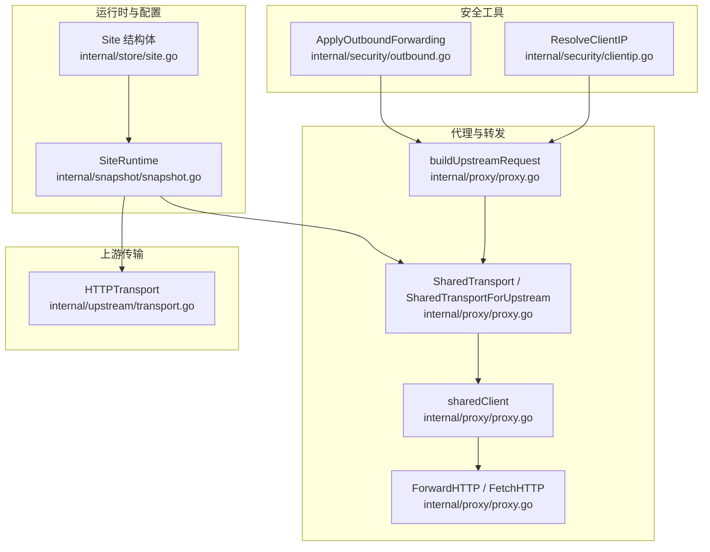
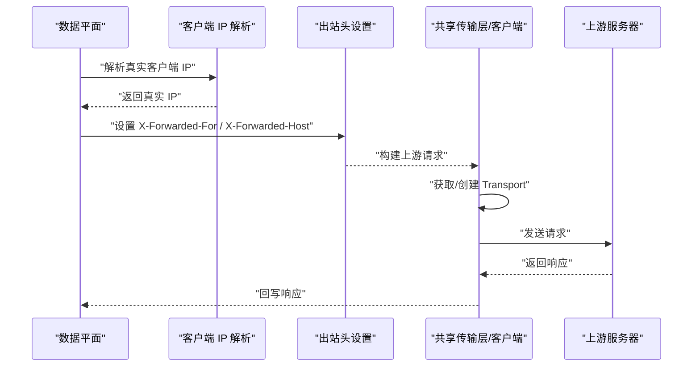
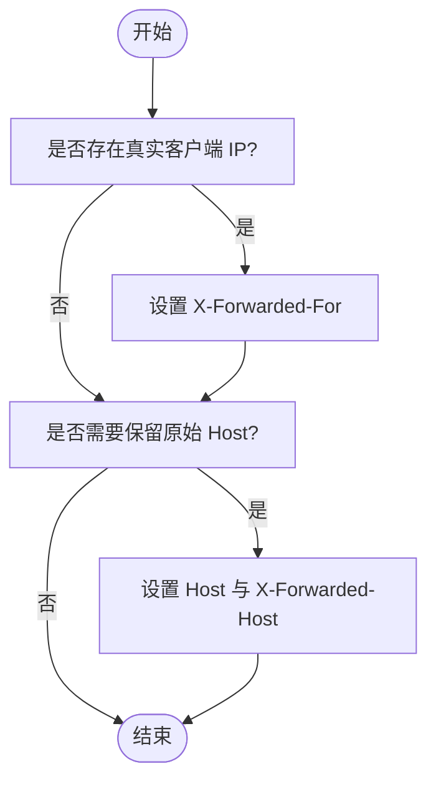
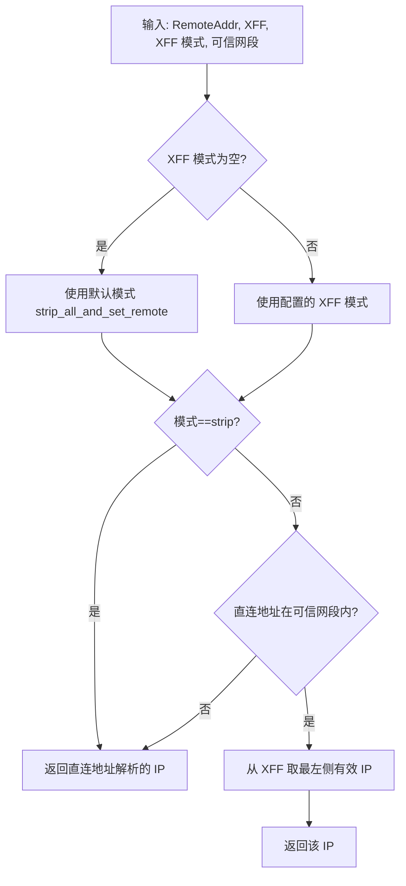
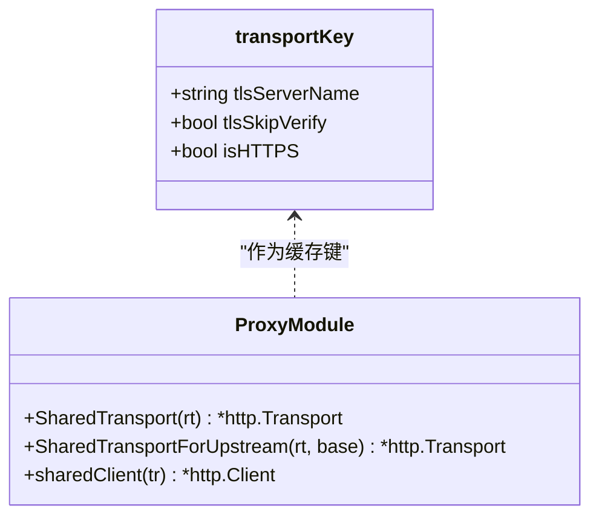
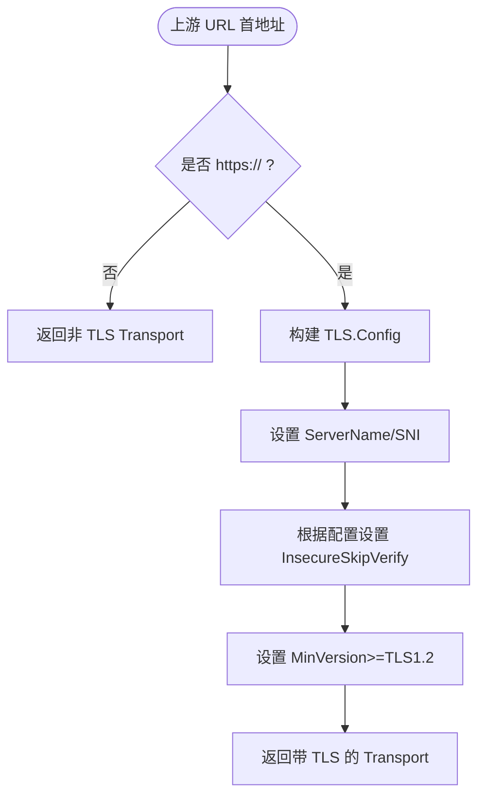
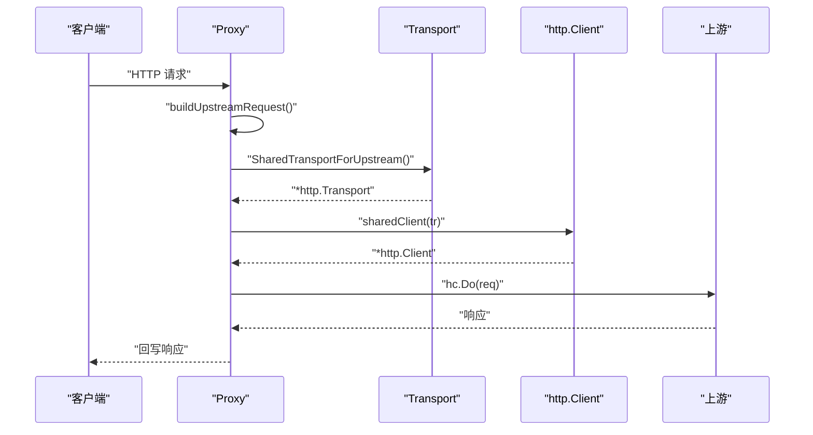
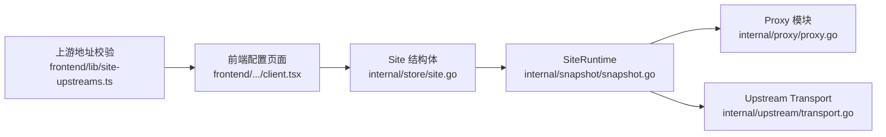

# 出站安全控制

> [返回 安全机制](安全机制.md)

<cite>
**本文引用的文件**
- [internal/security/outbound.go](file://internal/security/outbound.go)
- [internal/security/clientip.go](file://internal/security/clientip.go)
- [internal/proxy/proxy.go](file://internal/proxy/proxy.go)
- [internal/upstream/transport.go](file://internal/upstream/transport.go)
- [internal/snapshot/snapshot.go](file://internal/snapshot/snapshot.go)
- [internal/store/site.go](file://internal/store/site.go)
- [docs/安全机制/客户端 IP 获取.md](file://docs/安全机制/客户端 IP 获取.md)
- [docs/数据平面处理/上游代理配置.md](file://docs/数据平面处理/上游代理配置.md)
- [frontend/app/(dashboard)/sites/[id]/client.tsx](file://frontend/app/(dashboard)/sites/[id]/client.tsx)
- [frontend/lib/site-upstreams.ts](file://frontend/lib/site-upstreams.ts)
</cite>

## 目录
1. [引言](#引言)
2. [项目结构](#项目结构)
3. [核心组件](#核心组件)
4. [架构总览](#架构总览)
5. [详细组件分析](#详细组件分析)
6. [依赖分析](#依赖分析)
7. [性能考量](#性能考量)
8. [故障排除指南](#故障排除指南)
9. [结论](#结论)
10. [附录](#附录)

## 引言
本文件面向“出站安全控制”主题，围绕上游连接的安全策略、TLS 配置、共享传输层设计、请求头转发（X-Forwarded-For、X-Forwarded-Host）等展开。重点说明：
- 如何通过 TLS 配置与 SNI 设置确保上游通信安全；
- 如何按 TLS 配置缓存连接以降低握手成本；
- 如何正确转发请求头以保留客户端真实来源与原始 Host；
- 上游代理的安全配置要点与常见问题排查。

## 项目结构
与出站安全控制直接相关的代码分布在以下模块：
- 安全工具：出站请求头设置与客户端 IP 解析
- 代理与转发：共享传输层、HTTP 客户端缓存、请求构建与转发
- 上游传输：基于快照的上游 TLS 配置与连接池
- 运行时与配置：站点运行时参数、TLS 版本与 SNI、上游 TLS 选项
- 文档与前端：配置说明、UI 字段与校验

**图表来源**
- [internal/security/outbound.go:8-17](file://internal/security/outbound.go#L8-L17)
- [internal/security/clientip.go:12-49](file://internal/security/clientip.go#L12-L49)
- [internal/proxy/proxy.go:35-83](file://internal/proxy/proxy.go#L35-L83)
- [internal/proxy/proxy.go:85-108](file://internal/proxy/proxy.go#L85-L108)
- [internal/proxy/proxy.go:129-156](file://internal/proxy/proxy.go#L129-L156)
- [internal/proxy/proxy.go:481-500](file://internal/proxy/proxy.go#L481-L500)
- [internal/upstream/transport.go:12-28](file://internal/upstream/transport.go#L12-L28)
- [internal/snapshot/snapshot.go:25-70](file://internal/snapshot/snapshot.go#L25-L70)
- [internal/store/site.go:16-81](file://internal/store/site.go#L16-L81)

**章节来源**
- [internal/security/outbound.go:8-17](file://internal/security/outbound.go#L8-L17)
- [internal/security/clientip.go:12-49](file://internal/security/clientip.go#L12-L49)
- [internal/proxy/proxy.go:35-83](file://internal/proxy/proxy.go#L35-L83)
- [internal/proxy/proxy.go:85-108](file://internal/proxy/proxy.go#L85-L108)
- [internal/proxy/proxy.go:129-156](file://internal/proxy/proxy.go#L129-L156)
- [internal/proxy/proxy.go:481-500](file://internal/proxy/proxy.go#L481-L500)
- [internal/upstream/transport.go:12-28](file://internal/upstream/transport.go#L12-L28)
- [internal/snapshot/snapshot.go:25-70](file://internal/snapshot/snapshot.go#L25-L70)
- [internal/store/site.go:16-81](file://internal/store/site.go#L16-L81)

## 核心组件
- 出站请求头设置：在向上游转发前设置 X-Forwarded-For 与可选的 X-Forwarded-Host，便于上游识别真实客户端与原始 Host。
- 客户端 IP 解析：根据 XFF 模式与可信网段，从请求头与直连地址中解析真实客户端 IP。
- 共享传输层：按 TLS 配置与是否 HTTPS 缓存 http.Transport，避免重复握手与连接创建。
- HTTP 客户端缓存：对同一 Transport 复用 http.Client，减少分配开销。
- 上游 TLS 配置：依据站点配置设置 SNI、最小 TLS 版本与是否跳过校验。

**章节来源**
- [internal/security/outbound.go:8-17](file://internal/security/outbound.go#L8-L17)
- [internal/security/clientip.go:12-49](file://internal/security/clientip.go#L12-L49)
- [internal/proxy/proxy.go:35-83](file://internal/proxy/proxy.go#L35-L83)
- [internal/proxy/proxy.go:85-108](file://internal/proxy/proxy.go#L85-L108)
- [internal/upstream/transport.go:12-28](file://internal/upstream/transport.go#L12-L28)

## 架构总览
下图展示从请求进入数据平面到向上游转发的关键路径，以及安全控制点：

**图表来源**
- [internal/security/clientip.go:12-49](file://internal/security/clientip.go#L12-L49)
- [internal/security/outbound.go:8-17](file://internal/security/outbound.go#L8-L17)
- [internal/proxy/proxy.go:35-83](file://internal/proxy/proxy.go#L35-L83)
- [internal/proxy/proxy.go:129-156](file://internal/proxy/proxy.go#L129-L156)
- [internal/proxy/proxy.go:481-500](file://internal/proxy/proxy.go#L481-L500)

## 详细组件分析

### 出站请求头转发机制（X-Forwarded-For 与 X-Forwarded-Host）
- X-Forwarded-For：当存在真实客户端 IP 时，将其写入该头部，便于上游日志与风控识别。
- X-Forwarded-Host：当站点配置保留原始 Host 且存在原始 Host 时，同时设置请求 Host 与该头部。
- 作用范围：普通 HTTP、WebSocket、SSE 等向上游发起的请求均适用。

**图表来源**
- [internal/security/outbound.go:8-17](file://internal/security/outbound.go#L8-L17)

**章节来源**
- [internal/security/outbound.go:8-17](file://internal/security/outbound.go#L8-L17)
- [docs/安全机制/客户端 IP 获取.md:227-263](file://docs/安全机制/客户端 IP 获取.md#L227-L263)
- [docs/数据平面处理/上游代理配置.md:253-287](file://docs/数据平面处理/上游代理配置.md#L253-L287)

### 客户端 IP 获取与 XFF 模式
- 支持两种 XFF 模式：
  - strip_all_and_set_remote：默认模式，直接采用直连地址作为真实 IP。
  - trust_outer_waf_cidr_then_take_leftmost：若直连地址在可信网段内，则取 X-Forwarded-For 最左侧 IP。
- 可信网段支持多条，以逗号、换行或分号分隔。
- 该逻辑影响上游转发时 X-Forwarded-For 的设置与后续风控决策。

**图表来源**
- [internal/security/clientip.go:12-49](file://internal/security/clientip.go#L12-L49)

**章节来源**
- [internal/security/clientip.go:12-49](file://internal/security/clientip.go#L12-L49)
- [docs/安全机制/客户端 IP 获取.md:227-263](file://docs/安全机制/客户端 IP 获取.md#L227-L263)

### 共享传输层与连接池复用
- 传输层缓存键：包含 TLS ServerName、是否跳过验证、是否 HTTPS。
- 生成策略：首次命中时创建 http.Transport 并放入全局映射；后续同键复用，避免重复握手与连接创建。
- HTTP/2：强制启用 HTTP/2，提升多路复用效率。
- 连接池参数：最大空闲连接数、每主机最大空闲连接数、空闲超时等。

**图表来源**
- [internal/proxy/proxy.go:23-28](file://internal/proxy/proxy.go#L23-L28)
- [internal/proxy/proxy.go:35-83](file://internal/proxy/proxy.go#L35-L83)
- [internal/proxy/proxy.go:85-108](file://internal/proxy/proxy.go#L85-L108)

**章节来源**
- [internal/proxy/proxy.go:35-83](file://internal/proxy/proxy.go#L35-L83)
- [internal/proxy/proxy.go:85-108](file://internal/proxy/proxy.go#L85-L108)

### 上游 TLS 配置与最小版本
- 当上游首个地址为 https:// 时，为 http.Transport 配置 TLSClientConfig。
- 关键项：
  - ServerName：SNI 设置，用于服务端证书匹配。
  - InsecureSkipVerify：是否跳过证书链与主机名校验（仅测试/自签场景）。
  - MinVersion：最小 TLS 版本（示例中为 TLS1.2）。
- 该配置与共享传输层缓存键组合，确保相同 TLS 参数复用连接。

**图表来源**
- [internal/upstream/transport.go:12-28](file://internal/upstream/transport.go#L12-L28)
- [internal/proxy/proxy.go:67-73](file://internal/proxy/proxy.go#L67-L73)

**章节来源**
- [internal/upstream/transport.go:12-28](file://internal/upstream/transport.go#L12-L28)
- [internal/proxy/proxy.go:67-73](file://internal/proxy/proxy.go#L67-L73)

### 请求构建与转发流程
- 构建上游请求：拼接路径与查询串、复制非 Hop-by-Hop 头部、应用出站头设置。
- 发送请求：通过共享 Transport 与缓存的 http.Client 发送。
- 回写响应：复制非 Hop-by-Hop 响应头，设置状态码与正文。

**图表来源**
- [internal/proxy/proxy.go:129-156](file://internal/proxy/proxy.go#L129-L156)
- [internal/proxy/proxy.go:172-197](file://internal/proxy/proxy.go#L172-L197)
- [internal/proxy/proxy.go:481-500](file://internal/proxy/proxy.go#L481-L500)

**章节来源**
- [internal/proxy/proxy.go:129-156](file://internal/proxy/proxy.go#L129-L156)
- [internal/proxy/proxy.go:172-197](file://internal/proxy/proxy.go#L172-L197)
- [internal/proxy/proxy.go:481-500](file://internal/proxy/proxy.go#L481-L500)

## 依赖分析
- 运行时参数来源：SiteRuntime（来自快照）包含上游 URL、TLS 配置、转发策略等。
- 配置持久化：Site 结构体保存 XFF 模式、可信网段、保留原始 Host、上游 TLS 选项等。
- 前端配置：提供上游地址列表、跳过上游 TLS 校验开关、SNI 字段等。

**图表来源**
- [internal/store/site.go:16-81](file://internal/store/site.go#L16-L81)
- [internal/snapshot/snapshot.go:25-70](file://internal/snapshot/snapshot.go#L25-L70)
- [internal/proxy/proxy.go:35-83](file://internal/proxy/proxy.go#L35-L83)
- [internal/upstream/transport.go:12-28](file://internal/upstream/transport.go#L12-L28)
- [frontend/app/(dashboard)/sites/[id]/client.tsx:674-748](file://frontend/app/(dashboard)/sites/[id]/client.tsx#L674-L748)
- [frontend/lib/site-upstreams.ts:1-46](file://frontend/lib/site-upstreams.ts#L1-L46)

**章节来源**
- [internal/store/site.go:16-81](file://internal/store/site.go#L16-L81)
- [internal/snapshot/snapshot.go:25-70](file://internal/snapshot/snapshot.go#L25-L70)
- [internal/proxy/proxy.go:35-83](file://internal/proxy/proxy.go#L35-L83)
- [internal/upstream/transport.go:12-28](file://internal/upstream/transport.go#L12-L28)
- [frontend/app/(dashboard)/sites/[id]/client.tsx:674-748](file://frontend/app/(dashboard)/sites/[id]/client.tsx#L674-L748)
- [frontend/lib/site-upstreams.ts:1-46](file://frontend/lib/site-upstreams.ts#L1-L46)

## 性能考量
- 连接复用：通过共享传输层与客户端缓存，显著降低连接建立与 TLS 握手次数。
- HTTP/2：强制启用 HTTP/2，提升并发与资源利用效率。
- 连接池参数：合理设置最大空闲连接与超时，平衡内存占用与连接复用率。
- 头部处理：仅复制必要头部，过滤 Hop-by-Hop 头部，减少无效拷贝。

[本节为通用性能建议，不直接分析具体文件]

## 故障排除指南
- 症状：上游 TLS 握手失败
  - 排查：确认上游地址协议（https://）、SNI 是否正确、证书链是否可用。
  - 临时方案：仅在测试环境启用跳过校验，生产环境严禁开启。
- 症状：上游未识别真实客户端 IP
  - 排查：确认 XFF 模式与可信网段配置、是否正确设置了 X-Forwarded-For。
- 症状：上游收到错误的 Host
  - 排查：确认是否启用了保留原始 Host，以及 X-Forwarded-Host 是否被正确设置。
- 症状：连接过多或频繁重建
  - 排查：检查共享传输层缓存键是否一致（SNI、跳过校验、是否 HTTPS），避免因配置差异导致缓存失效。

**章节来源**
- [internal/security/outbound.go:8-17](file://internal/security/outbound.go#L8-L17)
- [internal/security/clientip.go:12-49](file://internal/security/clientip.go#L12-L49)
- [internal/proxy/proxy.go:35-83](file://internal/proxy/proxy.go#L35-L83)
- [internal/upstream/transport.go:12-28](file://internal/upstream/transport.go#L12-L28)

## 结论
本系统通过“共享传输层 + TLS 配置缓存 + 请求头转发”的组合，在保证安全的前提下实现了高效的上游连接复用与清晰的来源追踪。建议在生产环境中：
- 明确 SNI 与最小 TLS 版本；
- 严格禁用跳过校验；
- 正确配置 XFF 模式与可信网段；
- 使用保留原始 Host 时同步设置 X-Forwarded-Host。

[本节为总结性内容，不直接分析具体文件]

## 附录

### 配置项与使用场景
- XFF 模式
  - strip_all_and_set_remote：默认模式，适合大多数场景。
  - trust_outer_waf_cidr_then_take_leftmost：当存在可信前置代理时启用。
- 可信网段：支持多条，逗号/换行/分号分隔。
- 保留原始 Host：在需要透传原始 Host 至上游时启用。
- 跳过上游 TLS 校验：仅限测试或自签证书场景，严禁用于生产。
- 上游 TLS Server Name：用于 SNI，确保证书匹配。

**章节来源**
- [internal/store/site.go:11-14](file://internal/store/site.go#L11-L14)
- [internal/store/site.go:56-62](file://internal/store/site.go#L56-L62)
- [frontend/app/(dashboard)/sites/[id]/client.tsx:674-748](file://frontend/app/(dashboard)/sites/[id]/client.tsx#L674-L748)
- [frontend/lib/site-upstreams.ts:1-46](file://frontend/lib/site-upstreams.ts#L1-L46)