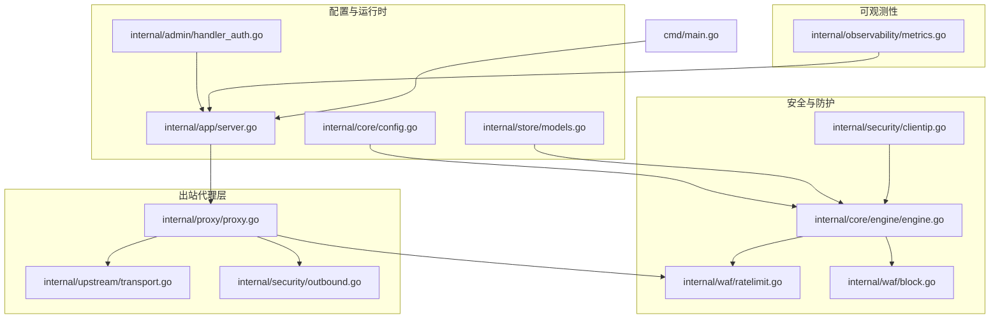
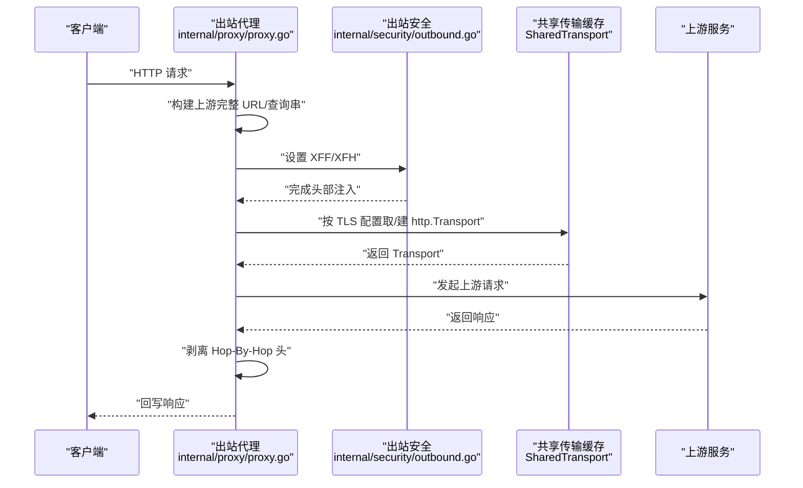
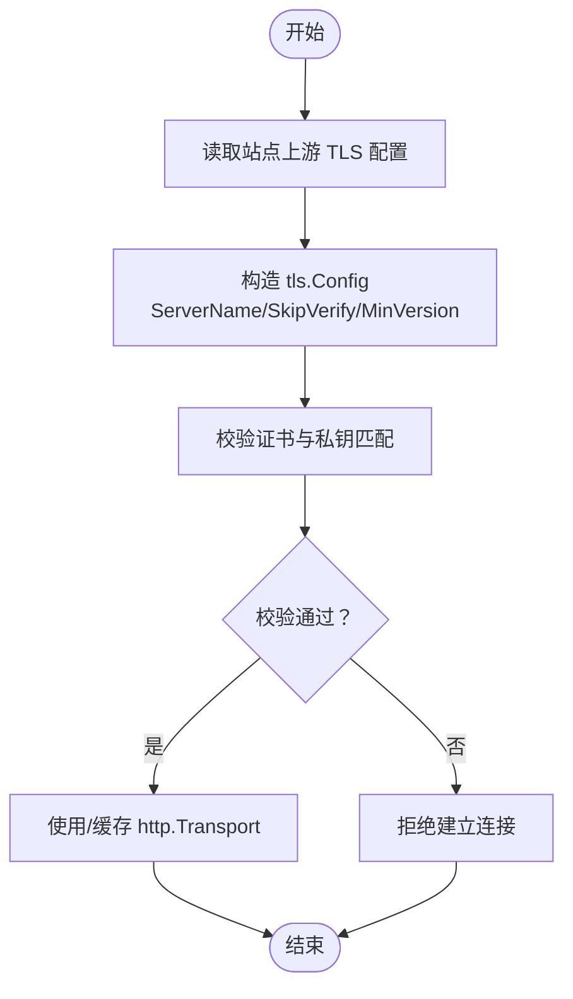
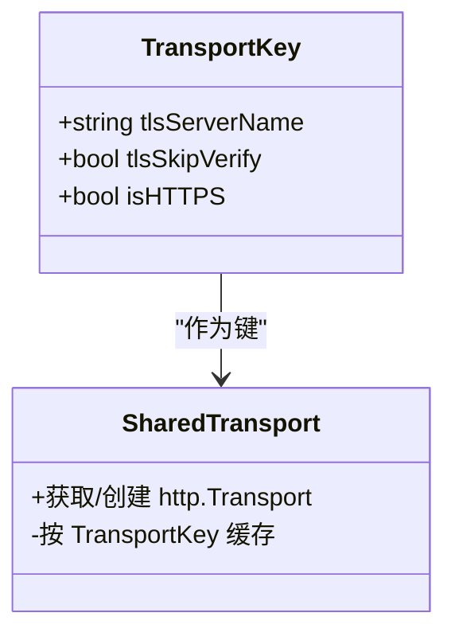
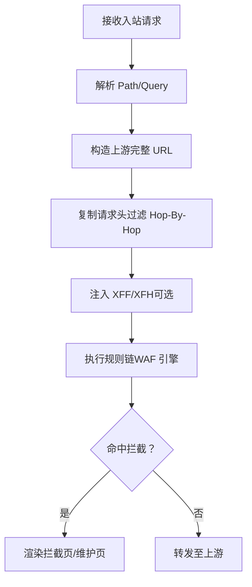
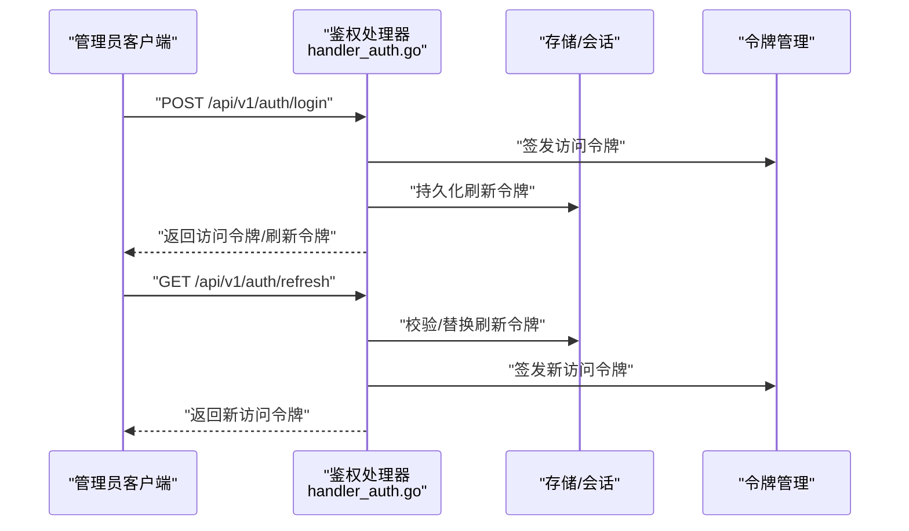
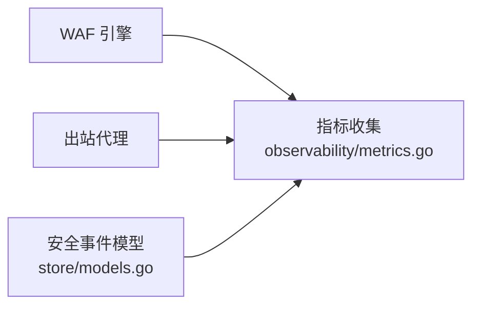
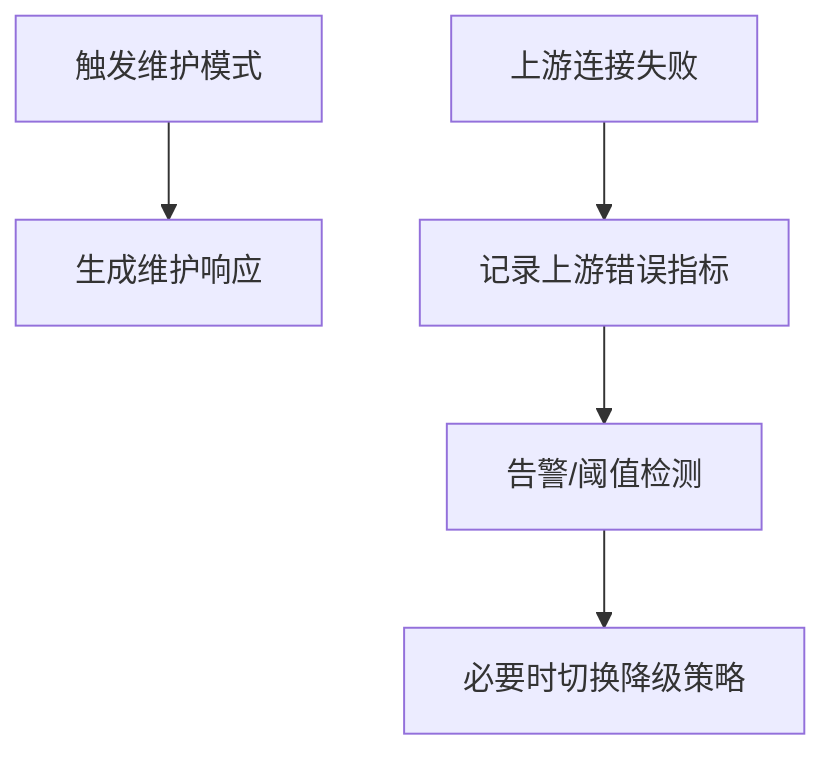
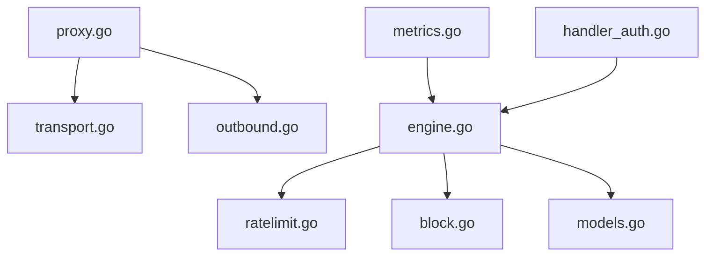

# 出站安全控制

<cite>
**本文引用的文件**
- [internal/proxy/proxy.go](file://internal/proxy/proxy.go)
- [internal/upstream/transport.go](file://internal/upstream/transport.go)
- [internal/security/outbound.go](file://internal/security/outbound.go)
- [internal/security/clientip.go](file://internal/security/clientip.go)
- [internal/waf/ratelimit.go](file://internal/waf/ratelimit.go)
- [internal/core/engine/engine.go](file://internal/core/engine/engine.go)
- [internal/core/config.go](file://internal/core/config.go)
- [internal/observability/metrics.go](file://internal/observability/metrics.go)
- [internal/store/models.go](file://internal/store/models.go)
- [internal/admin/handler_auth.go](file://internal/admin/handler_auth.go)
- [internal/waf/block.go](file://internal/waf/block.go)
- [internal/app/server.go](file://internal/app/server.go)
- [cmd/main.go](file://cmd/main.go)
</cite>

## 目录
1. [简介](#简介)
2. [项目结构](#项目结构)
3. [核心组件](#核心组件)
4. [架构总览](#架构总览)
5. [详细组件分析](#详细组件分析)
6. [依赖关系分析](#依赖关系分析)
7. [性能考量](#性能考量)
8. [故障排查指南](#故障排查指南)
9. [结论](#结论)
10. [附录：配置示例与最佳实践](#附录配置示例与最佳实践)

## 简介
本文件面向“出站安全控制”主题，系统化梳理上游连接安全、连接池管理、出站请求防护、代理安全配置、网络隔离策略、安全监控与应急响应等能力，并结合代码实现给出架构图、流程图与最佳实践建议。重点覆盖以下方面：
- 上游连接安全：TLS 验证、证书校验、加密协议选择
- 连接池安全：连接复用、健康检查与故障转移
- 出站请求防护：请求头注入防护、URL 验证、恶意请求检测
- 代理安全配置：代理认证、连接限制、流量控制
- 网络隔离策略：VPC、防火墙与 ACL
- 安全监控：连接日志、异常检测、性能监控
- 应急响应：连接中断处理、自动重连与降级策略

## 项目结构
该仓库采用模块化分层组织，与出站安全相关的关键目录与文件如下：
- internal/proxy：出站代理转发与传输层封装
- internal/upstream：上游传输配置
- internal/security：出站请求头注入与客户端 IP 解析
- internal/waf：速率限制、拦截页面渲染、引擎编排
- internal/core：配置加载、引擎调度
- internal/observability：指标采集与导出
- internal/store：站点与保护配置模型
- internal/admin：鉴权与会话管理
- internal/app：TLS 监听配置解析
- cmd：入口程序

**图表来源**
- [internal/proxy/proxy.go:1-136](file://internal/proxy/proxy.go#L1-L136)
- [internal/upstream/transport.go:1-29](file://internal/upstream/transport.go#L1-L29)
- [internal/security/outbound.go:1-17](file://internal/security/outbound.go#L1-L17)
- [internal/waf/ratelimit.go:1-117](file://internal/waf/ratelimit.go#L1-L117)
- [internal/core/engine/engine.go:1-176](file://internal/core/engine/engine.go#L1-L176)
- [internal/waf/block.go:1-110](file://internal/waf/block.go#L1-L110)
- [internal/security/clientip.go:1-80](file://internal/security/clientip.go#L1-L80)
- [internal/core/config.go:1-183](file://internal/core/config.go#L1-L183)
- [internal/store/models.go:1-456](file://internal/store/models.go#L1-L456)
- [internal/admin/handler_auth.go:1-351](file://internal/admin/handler_auth.go#L1-L351)
- [internal/observability/metrics.go:1-126](file://internal/observability/metrics.go#L1-L126)
- [internal/app/server.go:401-457](file://internal/app/server.go#L401-L457)
- [cmd/main.go:1-10](file://cmd/main.go#L1-L10)

**章节来源**
- [cmd/main.go:1-10](file://cmd/main.go#L1-L10)
- [internal/app/server.go:401-457](file://internal/app/server.go#L401-L457)

## 核心组件
- 出站代理与传输层
  - 共享传输缓存与 TLS 配置：通过键值聚合不同上游 TLS 配置，实现连接复用与资源控制
  - 请求头注入与去噪：设置 X-Forwarded-* 并过滤敏感 Hop-By-Hop 头
- 客户端 IP 与 XFF 解析
  - 支持 strip 与 trust-outer 模式，结合可信网段判定
- 速率限制
  - 固定窗口计数，支持启用/禁用与动态重配
- 引擎与拦截
  - 规则链编排、维护模式、拦截页面渲染
- 配置与模型
  - 站点级上游 TLS 选项、XFF 模式、保留原始 Host 等
- 指标与可观测性
  - Prometheus 文本格式指标导出，含请求/拦截/上游错误等计数

**章节来源**
- [internal/proxy/proxy.go:20-136](file://internal/proxy/proxy.go#L20-L136)
- [internal/security/outbound.go:8-17](file://internal/security/outbound.go#L8-L17)
- [internal/security/clientip.go:12-80](file://internal/security/clientip.go#L12-L80)
- [internal/waf/ratelimit.go:9-117](file://internal/waf/ratelimit.go#L9-L117)
- [internal/core/engine/engine.go:15-176](file://internal/core/engine/engine.go#L15-L176)
- [internal/waf/block.go:16-110](file://internal/waf/block.go#L16-L110)
- [internal/store/models.go:94-148](file://internal/store/models.go#L94-L148)
- [internal/observability/metrics.go:13-126](file://internal/observability/metrics.go#L13-L126)

## 架构总览
下图展示从请求进入、到出站代理转发、TLS 验证与连接池复用、再到拦截与指标上报的整体流程。

**图表来源**
- [internal/proxy/proxy.go:73-136](file://internal/proxy/proxy.go#L73-L136)
- [internal/security/outbound.go:8-17](file://internal/security/outbound.go#L8-L17)

## 详细组件分析

### 组件一：上游连接安全（TLS 验证、证书校验、加密协议）
- TLS ServerName 与跳过验证
  - 通过站点配置决定 SNI 与 InsecureSkipVerify，避免生产环境随意跳过验证
- 最小 TLS 版本与 ALPN
  - 监听层支持最小/最大 TLS 版本与 ALPN 列表；出站层强制 TLS1.2 及以上
- 证书校验
  - 管理端提供证书导入校验逻辑，确保 PEM/Key 匹配

**图表来源**
- [internal/proxy/proxy.go:49-61](file://internal/proxy/proxy.go#L49-L61)
- [internal/admin/handler_certificate.go:46-86](file://internal/admin/handler_certificate.go#L46-L86)
- [internal/app/server.go:413-439](file://internal/app/server.go#L413-L439)

**章节来源**
- [internal/proxy/proxy.go:32-71](file://internal/proxy/proxy.go#L32-L71)
- [internal/admin/handler_certificate.go:46-86](file://internal/admin/handler_certificate.go#L46-L86)
- [internal/app/server.go:413-455](file://internal/app/server.go#L413-L455)

### 组件二：连接池安全管理（复用、健康检查、故障转移）
- 连接复用
  - 以 TLS ServerName、是否 HTTPS、SkipVerify 为键缓存 http.Transport，跨请求复用连接
- 健康检查与超时
  - 默认空闲连接上限、每主机上限、空闲超时、强制 HTTP/2
- 故障转移
  - 当前实现未内置多上游故障转移；可通过上游地址轮询或外部负载均衡实现

**图表来源**
- [internal/proxy/proxy.go:20-71](file://internal/proxy/proxy.go#L20-L71)

**章节来源**
- [internal/proxy/proxy.go:20-71](file://internal/proxy/proxy.go#L20-L71)
- [internal/upstream/transport.go:12-28](file://internal/upstream/transport.go#L12-L28)

### 组件三：出站请求防护（头注入、URL 验证、恶意请求检测）
- 请求头注入防护
  - 设置 X-Forwarded-For、可选 X-Forwarded-Host；过滤 Connection/Keep-Alive 等 Hop-By-Hop 头
- URL 验证与拼接
  - 基于 Path/Query 构造完整上游 URL，避免路径穿越
- 恶意请求检测
  - 引擎在入站侧进行规则链评估，命中后直接拦截，不进入出站

**图表来源**
- [internal/proxy/proxy.go:73-136](file://internal/proxy/proxy.go#L73-L136)
- [internal/security/outbound.go:8-17](file://internal/security/outbound.go#L8-L17)
- [internal/core/engine/engine.go:57-129](file://internal/core/engine/engine.go#L57-L129)
- [internal/waf/block.go:16-66](file://internal/waf/block.go#L16-L66)

**章节来源**
- [internal/proxy/proxy.go:73-136](file://internal/proxy/proxy.go#L73-L136)
- [internal/security/outbound.go:8-17](file://internal/security/outbound.go#L8-L17)
- [internal/core/engine/engine.go:57-129](file://internal/core/engine/engine.go#L57-L129)
- [internal/waf/block.go:16-66](file://internal/waf/block.go#L16-L66)

### 组件四：代理安全配置（认证、连接限制、流量控制）
- 代理认证
  - 管理端提供登录、刷新、注销与会话管理，支持防暴力破解与令牌黑名单
- 连接限制与流量控制
  - 入站速率限制与错误率限制（固定窗口），可配置动作（拦截/观察）
- 维护模式与降级
  - 全局/站点级维护模式，直接返回维护页，不走上游

**图表来源**
- [internal/admin/handler_auth.go:32-193](file://internal/admin/handler_auth.go#L32-L193)

**章节来源**
- [internal/admin/handler_auth.go:32-193](file://internal/admin/handler_auth.go#L32-L193)
- [internal/waf/ratelimit.go:24-96](file://internal/waf/ratelimit.go#L24-L96)
- [internal/core/engine/engine.go:69-81](file://internal/core/engine/engine.go#L69-L81)

### 组件五：网络隔离策略（VPC、防火墙、ACL）
- 站点绑定与网络类型
  - 站点模型包含 Bind、Network 字段，支持 TCP 绑定
- 访问控制列表
  - IP 黑名单/白名单模型，支持按站点启用/禁用
- 建议
  - 结合 VPC/安全组仅放行受信上游；在上游侧开启双向 TLS；对公网暴露最小化

**章节来源**
- [internal/store/models.go:94-148](file://internal/store/models.go#L94-L148)
- [internal/store/models.go:191-211](file://internal/store/models.go#L191-L211)

### 组件六：安全监控（连接日志、异常检测、性能监控）
- 指标采集
  - 提供请求总量、拦截量、观察命中、缓存命中/未命中、上游错误、运行时内存/GC 等
- 日志与事件
  - 安全事件模型记录请求 ID、客户端 IP、Host、方法、UA、规则 ID、阶段、动作、地理信息、状态码等

**图表来源**
- [internal/observability/metrics.go:13-126](file://internal/observability/metrics.go#L13-L126)
- [internal/store/models.go:212-236](file://internal/store/models.go#L212-L236)

**章节来源**
- [internal/observability/metrics.go:13-126](file://internal/observability/metrics.go#L13-L126)
- [internal/store/models.go:212-236](file://internal/store/models.go#L212-L236)

### 组件七：应急响应（连接中断、自动重连、降级）
- 维护模式
  - 全局/站点级维护开关，命中后直接返回维护页
- 拦截与降级
  - 规则链命中拦截动作，返回自定义/嵌入拦截页
- 上游错误计数
  - 指标中包含上游错误计数，便于异常检测

**图表来源**
- [internal/core/engine/engine.go:69-81](file://internal/core/engine/engine.go#L69-L81)
- [internal/waf/block.go:41-66](file://internal/waf/block.go#L41-L66)
- [internal/observability/metrics.go:48-49](file://internal/observability/metrics.go#L48-L49)

**章节来源**
- [internal/core/engine/engine.go:69-81](file://internal/core/engine/engine.go#L69-L81)
- [internal/waf/block.go:41-66](file://internal/waf/block.go#L41-L66)
- [internal/observability/metrics.go:48-49](file://internal/observability/metrics.go#L48-L49)

## 依赖关系分析
- 出站代理依赖共享传输缓存与安全头注入
- 引擎依赖速率限制与拦截渲染
- 配置与模型驱动站点行为（TLS、XFF、维护模式等）
- 指标与事件支撑监控与审计

**图表来源**
- [internal/proxy/proxy.go:1-136](file://internal/proxy/proxy.go#L1-L136)
- [internal/upstream/transport.go:1-29](file://internal/upstream/transport.go#L1-L29)
- [internal/security/outbound.go:1-17](file://internal/security/outbound.go#L1-L17)
- [internal/waf/ratelimit.go:1-117](file://internal/waf/ratelimit.go#L1-L117)
- [internal/core/engine/engine.go:1-176](file://internal/core/engine/engine.go#L1-L176)
- [internal/waf/block.go:1-110](file://internal/waf/block.go#L1-L110)
- [internal/store/models.go:1-456](file://internal/store/models.go#L1-L456)
- [internal/observability/metrics.go:1-126](file://internal/observability/metrics.go#L1-L126)
- [internal/admin/handler_auth.go:1-351](file://internal/admin/handler_auth.go#L1-L351)

**章节来源**
- [internal/proxy/proxy.go:1-136](file://internal/proxy/proxy.go#L1-L136)
- [internal/core/engine/engine.go:1-176](file://internal/core/engine/engine.go#L1-L176)

## 性能考量
- 连接池参数
  - 最大空闲连接、每主机空闲连接、空闲超时、强制 HTTP/2，有助于降低握手开销与提升吞吐
- 速率限制
  - 固定窗口实现简单高效，注意窗口大小与阈值配置避免误杀
- 指标监控
  - 通过 /metrics 导出关键指标，结合告警系统实现容量与异常预警

[本节为通用指导，无需特定文件引用]

## 故障排查指南
- 出站 TLS 失败
  - 检查站点上游 TLS 配置（SNI、跳过验证）、证书有效性与链路可达性
- 请求被拦截
  - 查看拦截原因与规则 ID，确认是否误判；必要时调整规则或临时观察
- 维护模式生效
  - 检查全局/站点维护开关与自定义维护页配置
- 登录异常
  - 关注防暴力破解锁定、刷新令牌校验与会话状态

**章节来源**
- [internal/admin/handler_auth.go:32-193](file://internal/admin/handler_auth.go#L32-L193)
- [internal/waf/block.go:16-66](file://internal/waf/block.go#L16-L66)
- [internal/core/engine/engine.go:69-81](file://internal/core/engine/engine.go#L69-L81)

## 结论
本系统在出站安全方面提供了完善的传输层抽象、TLS 配置与连接复用、入站规则链拦截、速率限制与维护降级等能力。建议在生产环境中：
- 严格禁用上游跳过验证，启用双向 TLS
- 合理配置连接池参数与速率限制阈值
- 使用指标与事件完善监控与审计
- 将上游置于受控网络内，配合 ACL 与防火墙

[本节为总结，无需特定文件引用]

## 附录：配置示例与最佳实践
- 上游 TLS 配置
  - 在站点模型中设置上游服务器名与 TLS 选项，避免使用跳过验证
- XFF 与客户端 IP
  - 根据部署环境选择 strip 或 trust-outer 模式，并配置可信网段
- 速率限制
  - 为不同站点设定独立窗口与阈值，启用错误率限制以应对上游异常
- 维护模式
  - 在演练或紧急情况下启用全局/站点维护，快速降级
- 监控与告警
  - 对上游错误、拦截量、内存/GC 等指标设置阈值告警

**章节来源**
- [internal/store/models.go:94-148](file://internal/store/models.go#L94-L148)
- [internal/security/clientip.go:12-80](file://internal/security/clientip.go#L12-L80)
- [internal/waf/ratelimit.go:24-96](file://internal/waf/ratelimit.go#L24-L96)
- [internal/core/engine/engine.go:69-81](file://internal/core/engine/engine.go#L69-L81)
- [internal/observability/metrics.go:51-125](file://internal/observability/metrics.go#L51-L125)