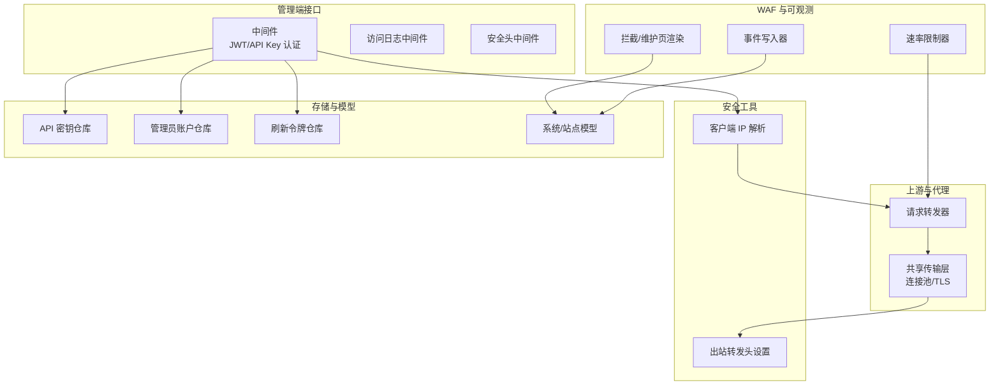
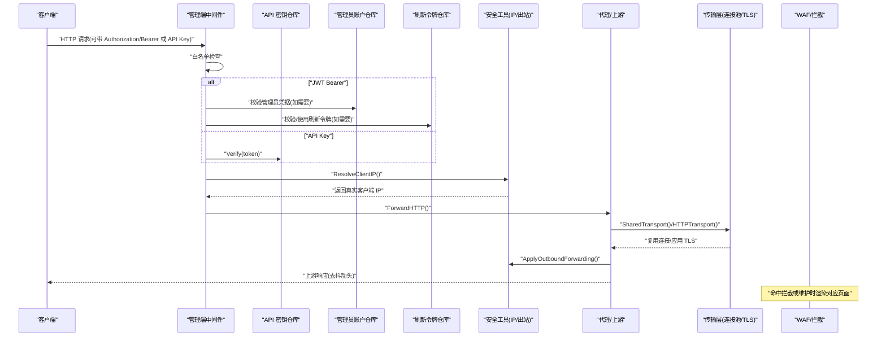
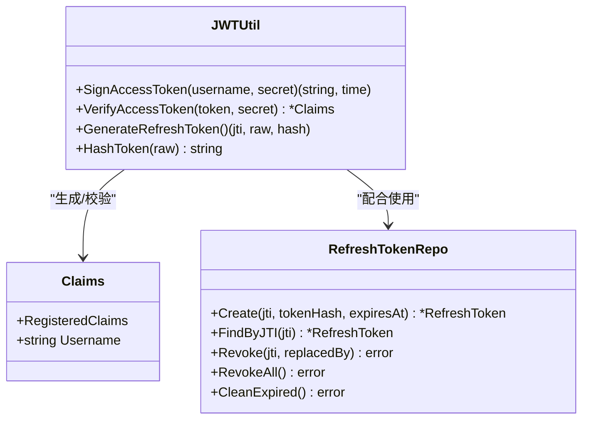
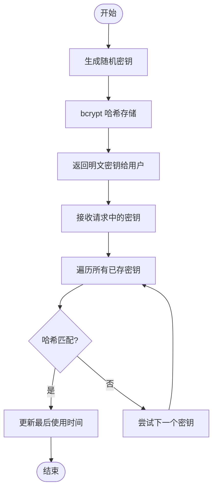
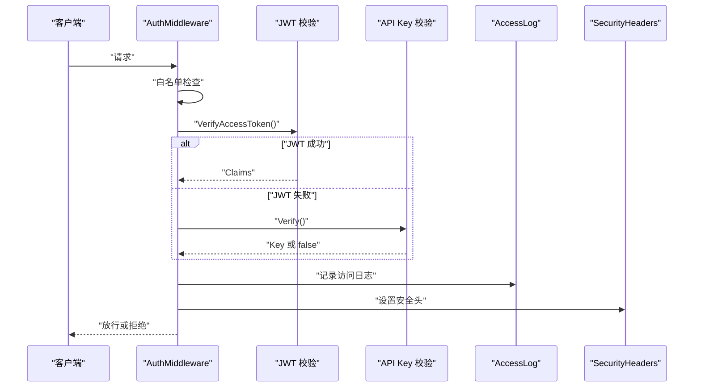
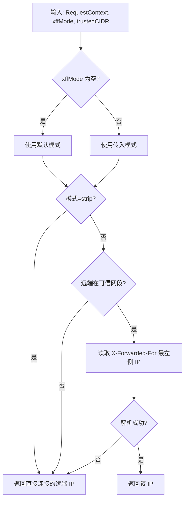
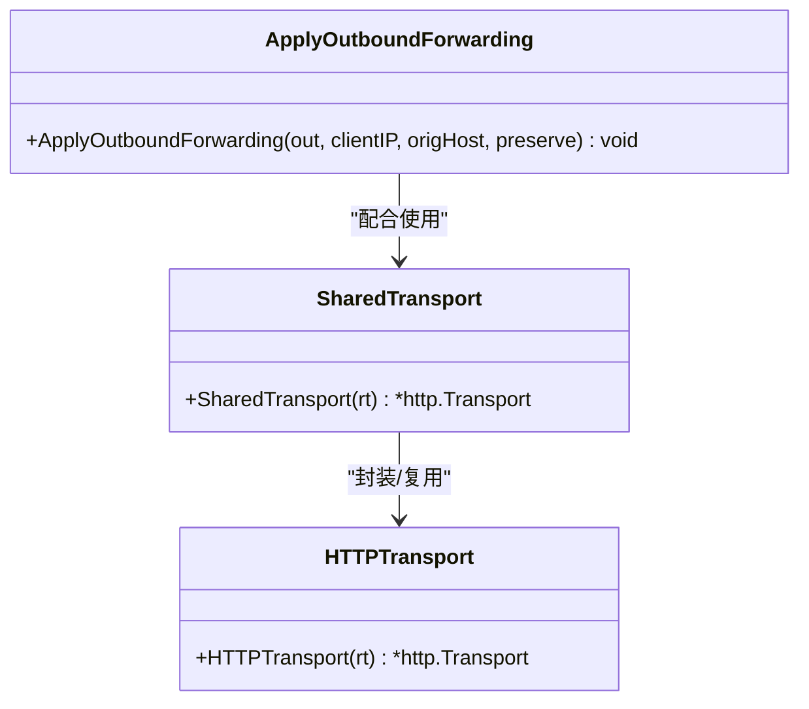
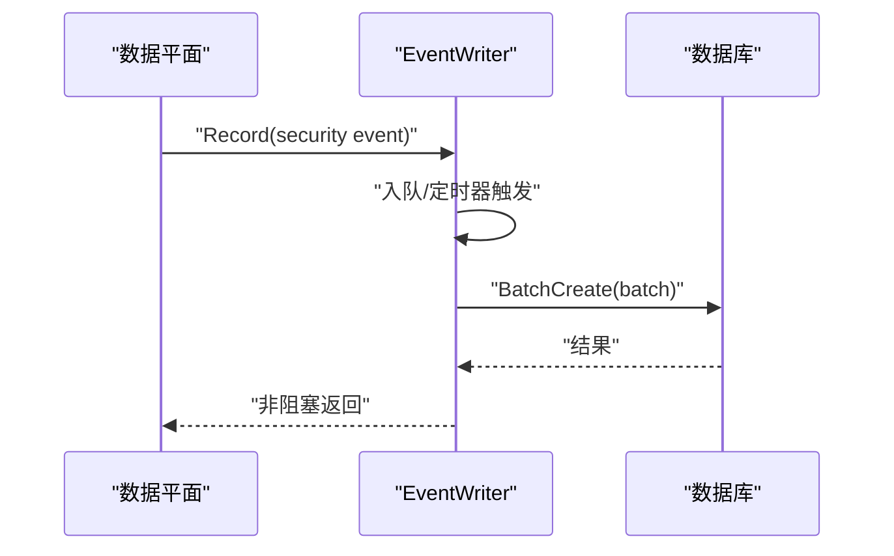
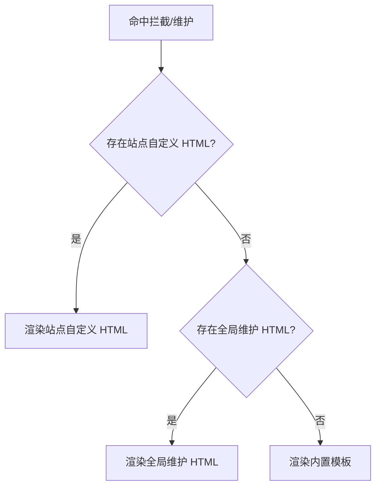
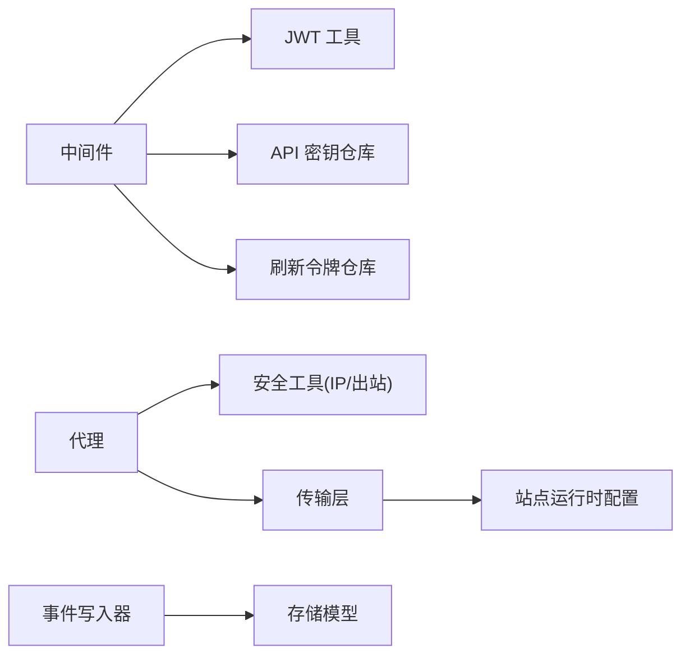

# 安全机制

<cite>
**本文档引用的文件**
- [jwt.go](file://internal/admin/auth/jwt.go)
- [session.go](file://internal/admin/auth/session.go)
- [middleware.go](file://internal/admin/middleware.go)
- [admin_api_key.go](file://internal/store/repository/admin_api_key.go)
- [clientip.go](file://internal/security/clientip.go)
- [outbound.go](file://internal/security/outbound.go)
- [proxy.go](file://internal/proxy/proxy.go)
- [transport.go](file://internal/upstream/transport.go)
- [ratelimit.go](file://internal/waf/ratelimit.go)
- [block.go](file://internal/waf/block.go)
- [eventwriter.go](file://internal/observability/eventwriter.go)
- [models.go](file://internal/store/models.go)
- [main.go](file://cmd/main.go)
</cite>

> **子页面分类索引**
>
> 本模块按安全主题将子页面分为三类：
>
> #### 认证与令牌管理
> - [JWT 认证机制](./JWT 认证机制.md) — 短期访问令牌与刷新令牌的签发、HS256 签名校验、令牌黑名单与会话绑定机制
> - [API 密钥管理](./API 密钥管理.md) — 一次性明文密钥生成、bcrypt 哈希存储、权限控制与密钥轮换策略
>
> #### 会话与访问控制
> - [会话管理](./会话管理.md) — 认证中间件链、白名单路径、访问日志、安全头与会话生命周期管理
>
> #### 请求溯源与出站安全
> - [客户端 IP 获取](./客户端 IP 获取.md) — XFF 代理链解析、可信 CIDR 策略、真实 IP 识别、GeoIP 风险评估与隐私保护
> - [出站安全控制](./出站安全控制.md) — 上游 TLS 配置、共享传输层连接池复用、X-Forwarded-For/Host 出站头转发策略
>
> **模块整体架构概述**：安全机制模块贯穿请求从进入管理端/数据平面到出站转发的全链路。管理端通过 JWT 与 API Key 实现双轨认证，由会话管理器维护活跃状态；数据平面通过客户端 IP 解析与可信代理策略识别真实来源，并借助共享传输层与 TLS 配置安全高效地转发至上游。各子系统通过中间件、安全工具与存储仓库分层协作，形成完整的认证、溯源、审计与出站安全体系。

## 目录
1. [引言](#引言)
2. [项目结构](#项目结构)
3. [核心组件](#核心组件)
4. [架构总览](#架构总览)
5. [详细组件分析](#详细组件分析)
6. [依赖分析](#依赖分析)
7. [性能考虑](#性能考虑)
8. [故障排除指南](#故障排除指南)
9. [结论](#结论)
10. [附录](#附录)

## 引言
本文件系统性梳理 My-OpenWaf 的安全机制与实现，覆盖以下主题：
- JWT 认证：令牌生成、验证与刷新流程、安全配置
- API 密钥管理：密钥生成、权限控制与轮换策略
- 会话与访问控制：中间件认证、访问日志与安全头
- 客户端 IP 获取：代理链处理、真实 IP 识别与隐私保护
- 出站安全控制：上游连接安全、TLS 验证与连接池安全
- 审计与事件：事件写入、缓冲与异步持久化
- 安全最佳实践：密码策略、权限最小化、审计日志
- 漏洞防护与应急响应：速率限制、拦截页面与维护模式

## 项目结构
后端采用分层设计，安全相关能力主要分布在以下模块：
- 管理端认证与中间件：JWT、API Key、访问日志与安全头
- 客户端 IP 解析与出站转发：代理链处理与上游请求头设置
- 上游传输与代理：连接池、TLS 配置与请求转发
- 审计与事件：安全事件缓冲与批量写入
- WAF 拦截与维护：拦截页渲染、维护页渲染与模板替换

图表来源
- [middleware.go:16-96](file://internal/admin/middleware.go#L16-L96)
- [clientip.go:12-49](file://internal/security/clientip.go#L12-L49)
- [outbound.go:8-17](file://internal/security/outbound.go#L8-L17)
- [proxy.go:32-71](file://internal/proxy/proxy.go#L32-L71)
- [transport.go:12-29](file://internal/upstream/transport.go#L12-L29)
- [admin_api_key.go:30-63](file://internal/store/repository/admin_api_key.go#L30-L63)
- [admin_account.go:19-37](file://internal/store/repository/admin_account.go#L19-L37)
- [refresh_token.go:15-42](file://internal/store/repository/refresh_token.go#L15-L42)
- [models.go:28-31](file://internal/store/models.go#L28-L31)
- [ratelimit.go:9-117](file://internal/waf/ratelimit.go#L9-L117)
- [eventwriter.go:12-105](file://internal/observability/eventwriter.go#L12-L105)
- [block.go:16-66](file://internal/waf/block.go#L16-L66)

章节来源
- [main.go:7-9](file://cmd/main.go#L7-L9)

## 核心组件
- JWT 认证与令牌管理：短期访问令牌与刷新令牌的签发、校验与哈希存储
- API 密钥管理：一次性明文密钥生成、bcrypt 哈希存储、按需轮换
- 中间件认证与访问控制：支持 Bearer JWT 与 API Key，白名单路径跳过，统一访问日志与安全头
- 客户端 IP 解析：基于 X-Forwarded-For 与可信网段的解析策略
- 出站安全控制：上游 TLS 配置、连接池复用与请求头转发
- 审计与事件：安全事件异步缓冲与批量写入，避免阻塞热路径
- WAF 拦截与维护：拦截页与维护页的模板渲染与回退逻辑

章节来源
- [jwt.go:13-79](file://internal/admin/auth/jwt.go#L13-L79)
- [admin_api_key.go:30-63](file://internal/store/repository/admin_api_key.go#L30-L63)
- [middleware.go:16-96](file://internal/admin/middleware.go#L16-L96)
- [clientip.go:12-49](file://internal/security/clientip.go#L12-L49)
- [outbound.go:8-17](file://internal/security/outbound.go#L8-L17)
- [transport.go:12-29](file://internal/upstream/transport.go#L12-L29)
- [proxy.go:73-136](file://internal/proxy/proxy.go#L73-L136)
- [eventwriter.go:12-105](file://internal/observability/eventwriter.go#L12-L105)
- [block.go:16-66](file://internal/waf/block.go#L16-L66)

## 架构总览
下图展示从请求进入、认证鉴权、IP 解析、上游转发到拦截/维护响应的整体流程。

图表来源
- [middleware.go:16-63](file://internal/admin/middleware.go#L16-L63)
- [admin_api_key.go:48-63](file://internal/store/repository/admin_api_key.go#L48-L63)
- [admin_account.go:19-28](file://internal/store/repository/admin_account.go#L19-L28)
- [refresh_token.go:24-32](file://internal/store/repository/refresh_token.go#L24-L32)
- [clientip.go:12-49](file://internal/security/clientip.go#L12-L49)
- [proxy.go:73-136](file://internal/proxy/proxy.go#L73-L136)
- [transport.go:12-29](file://internal/upstream/transport.go#L12-L29)
- [outbound.go:8-17](file://internal/security/outbound.go#L8-L17)
- [block.go:16-66](file://internal/waf/block.go#L16-L66)

## 详细组件分析

### JWT 认证机制
- 令牌类型与有效期
  - 短期访问令牌：默认有效期为 15 分钟
  - 刷新令牌：独立生成，存储 JTI 与哈希，支持撤销与替换
- 令牌生成与校验
  - 使用 HMAC-SHA256 签名，签发时设置签发时间与过期时间
  - 校验时严格限定签名算法，验证签名与过期时间
- 刷新令牌管理
  - 存储 JTI 与哈希，查询时过滤未撤销且未过期记录
  - 支持撤销与整库清理过期记录

图表来源
- [jwt.go:13-79](file://internal/admin/auth/jwt.go#L13-L79)
- [refresh_token.go:15-42](file://internal/store/repository/refresh_token.go#L15-L42)

章节来源
- [jwt.go:19-38](file://internal/admin/auth/jwt.go#L19-L38)
- [jwt.go:40-55](file://internal/admin/auth/jwt.go#L40-L55)
- [jwt.go:57-79](file://internal/admin/auth/jwt.go#L57-L79)
- [refresh_token.go:24-32](file://internal/store/repository/refresh_token.go#L24-L32)

### API 密钥管理系统
- 密钥生成
  - 生成 32 字节随机值作为明文密钥，仅在创建时可见一次
  - 使用 bcrypt 对明文进行哈希存储，不保存明文
- 权限控制
  - 验证流程：遍历所有密钥，对每个密钥执行哈希比对
  - 成功后更新最后使用时间，便于审计与轮换
- 轮换策略
  - 建议定期轮换密钥，删除旧密钥前先创建新密钥
  - 结合访问日志与事件审计，监控密钥使用情况

图表来源
- [admin_api_key.go:30-63](file://internal/store/repository/admin_api_key.go#L30-L63)

章节来源
- [admin_api_key.go:30-46](file://internal/store/repository/admin_api_key.go#L30-L46)
- [admin_api_key.go:48-63](file://internal/store/repository/admin_api_key.go#L48-L63)

### 会话管理与访问控制
- 认证中间件
  - 白名单路径（健康检查与认证接口）直接放行
  - 优先尝试 JWT Bearer 校验；失败则回退到 API Key 校验
  - 将认证方法与用户信息注入上下文，供后续处理器使用
- 访问日志
  - 统一生成请求 ID 并写入响应头，记录方法、路径、状态码、耗时与认证方式
- 安全头
  - 设置 X-Content-Type-Options、X-Frame-Options、Referrer-Policy、Content-Security-Policy

图表来源
- [middleware.go:16-63](file://internal/admin/middleware.go#L16-L63)
- [middleware.go:65-96](file://internal/admin/middleware.go#L65-L96)

章节来源
- [middleware.go:16-63](file://internal/admin/middleware.go#L16-L63)
- [middleware.go:65-96](file://internal/admin/middleware.go#L65-L96)

### 客户端 IP 获取与隐私保护
- 解析策略
  - 支持两种模式：剥离并以远端地址为准、信任外层网段后取最左侧 IP
  - 可配置可信网段列表，支持单 IP 与 CIDR
- 隐私保护
  - 在受信网段内优先信任 X-Forwarded-For 的最左侧 IP
  - 非受信网段或缺失时回退到直接连接的远端地址
- 出站转发
  - 将解析到的真实客户端 IP 写入上游请求的 X-Forwarded-For
  - 可选择保留原始 Host 到 X-Forwarded-Host

图表来源
- [clientip.go:12-49](file://internal/security/clientip.go#L12-L49)
- [models.go:28-31](file://internal/store/models.go#L28-L31)

章节来源
- [clientip.go:12-49](file://internal/security/clientip.go#L12-L49)
- [outbound.go:8-17](file://internal/security/outbound.go#L8-L17)
- [models.go:125-127](file://internal/store/models.go#L125-L127)

### 出站安全控制
- 连接池与复用
  - 通过共享传输层缓存不同 TLS 配置的连接，减少握手开销
  - 默认启用 HTTP/2，设置空闲连接上限与超时
- TLS 配置
  - 仅当上游为 HTTPS 时启用 TLS 客户端配置
  - 支持自定义 SNI 与跳过验证选项（谨慎使用）
  - 最小 TLS 版本为 1.2
- 请求头转发
  - 将客户端 IP 与原始 Host 透传至上游，便于后方服务日志与路由

图表来源
- [proxy.go:32-71](file://internal/proxy/proxy.go#L32-L71)
- [transport.go:12-29](file://internal/upstream/transport.go#L12-L29)
- [outbound.go:8-17](file://internal/security/outbound.go#L8-L17)

章节来源
- [proxy.go:32-71](file://internal/proxy/proxy.go#L32-L71)
- [transport.go:12-29](file://internal/upstream/transport.go#L12-L29)
- [outbound.go:8-17](file://internal/security/outbound.go#L8-L17)

### 审计与事件写入
- 缓冲与批处理
  - 事件写入器使用有界通道与定时器，达到批次阈值或超时即批量写入
  - 写入失败时记录错误日志，保证热路径非阻塞
- 数据落盘
  - 批量插入数据库，降低写放大
  - 关闭时清空剩余事件，确保不丢失

图表来源
- [eventwriter.go:12-105](file://internal/observability/eventwriter.go#L12-L105)

章节来源
- [eventwriter.go:12-105](file://internal/observability/eventwriter.go#L12-L105)

### WAF 拦截与维护页面
- 拦截页
  - 支持站点级自定义 HTML 与状态码，否则回退到内置模板
  - 注入请求 ID 与规则 ID，便于审计与溯源
- 维护页
  - 支持站点级与全局维护 HTML 与状态码
  - 回退到内置维护页模板

图表来源
- [block.go:16-66](file://internal/waf/block.go#L16-L66)

章节来源
- [block.go:16-66](file://internal/waf/block.go#L16-L66)

### 速率限制与防护
- 固定窗口限流
  - 基于 (客户端 IP + Host) 维度的固定窗口计数
  - 支持运行时启停与动态重配置
- 错误率统计
  - 在上游响应后增量计数，用于错误率防护策略

章节来源
- [ratelimit.go:9-117](file://internal/waf/ratelimit.go#L9-L117)

## 依赖分析
- 组件耦合
  - 中间件依赖 JWT 工具、API 密钥仓库与刷新令牌仓库
  - 代理层依赖安全工具与传输层，传输层依赖站点运行时配置
  - 审计模块与存储模型解耦，通过仓库抽象隔离
- 外部依赖
  - JWT 库、bcrypt、GORM、Hertz、TLS 标准库
- 循环依赖
  - 未发现循环导入；各模块职责清晰，接口边界明确

图表来源
- [middleware.go:16-63](file://internal/admin/middleware.go#L16-L63)
- [proxy.go:32-71](file://internal/proxy/proxy.go#L32-L71)
- [eventwriter.go:12-105](file://internal/observability/eventwriter.go#L12-L105)

## 性能考虑
- 连接池复用
  - 共享传输层按 TLS 配置键缓存连接，显著降低握手成本
  - 合理设置空闲连接上限与超时，平衡内存占用与延迟
- 异步事件写入
  - 事件缓冲与批处理降低数据库写放大，避免阻塞请求处理
- 限流与错误率统计
  - 原子计数与定期清理，减少锁竞争与内存膨胀
- TLS 配置
  - 仅在必要时启用 TLS，避免不必要的加密开销
  - 启用 HTTP/2 以提升并发性能

## 故障排除指南
- 认证失败
  - 检查 Authorization 头格式是否为 Bearer <token>
  - 确认 JWT 秘钥一致且未被修改
  - 核对 API Key 是否存在、是否过期、是否被撤销
- 客户端 IP 异常
  - 核对 XFF 模式与可信网段配置
  - 确认上游是否正确转发 X-Forwarded-For
- 上游连接问题
  - 检查 TLS 配置（SNI、跳过验证、最小版本）
  - 观察连接池状态与超时设置
- 事件丢失
  - 检查事件写入器缓冲区大小与批处理间隔
  - 关注写入错误日志与数据库可用性

章节来源
- [middleware.go:29-61](file://internal/admin/middleware.go#L29-L61)
- [clientip.go:23-48](file://internal/security/clientip.go#L23-L48)
- [transport.go:20-26](file://internal/upstream/transport.go#L20-L26)
- [eventwriter.go:42-49](file://internal/observability/eventwriter.go#L42-L49)

## 结论
本项目在安全方面提供了较为完整的基础设施：
- 双重认证（JWT 与 API Key）与细粒度的访问控制
- 可配置的客户端 IP 解析策略与出站转发
- 安全的上游连接与连接池复用
- 异步审计与事件写入
- 拦截与维护页面的可定制化

建议在生产环境中进一步强化：
- 强制启用 HTTPS 与严格的 TLS 配置
- 实施最小权限原则与定期轮换密钥
- 加强登录安全（多因子、登录审计）
- 建立完善的应急响应流程与演练

## 附录
- 安全最佳实践
  - 密码策略：最小长度、复杂度要求、定期轮换
  - 权限最小化：按需授予 API Key 权限，限制作用域
  - 审计日志：开启访问日志与安全事件写入，定期审查
- 漏洞防护与应急响应
  - 速率限制与错误率防护，防止滥用
  - 拦截与维护页面统一口径，避免信息泄露
  - 建立事件分级与快速处置流程，定期演练