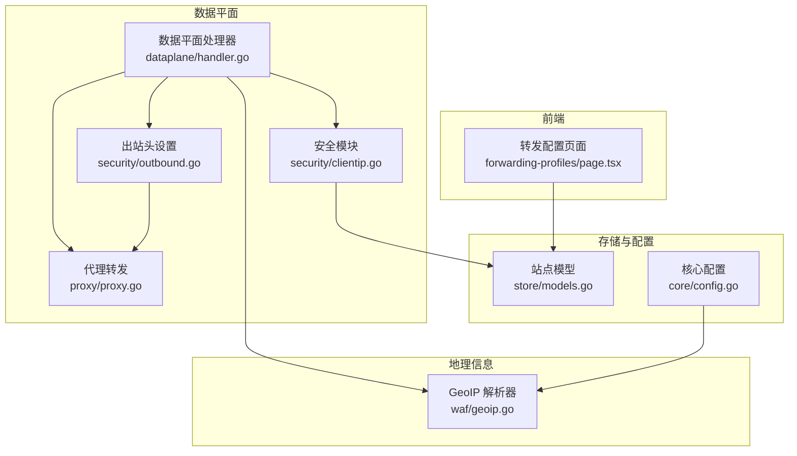
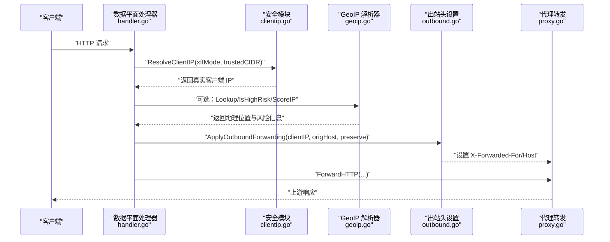
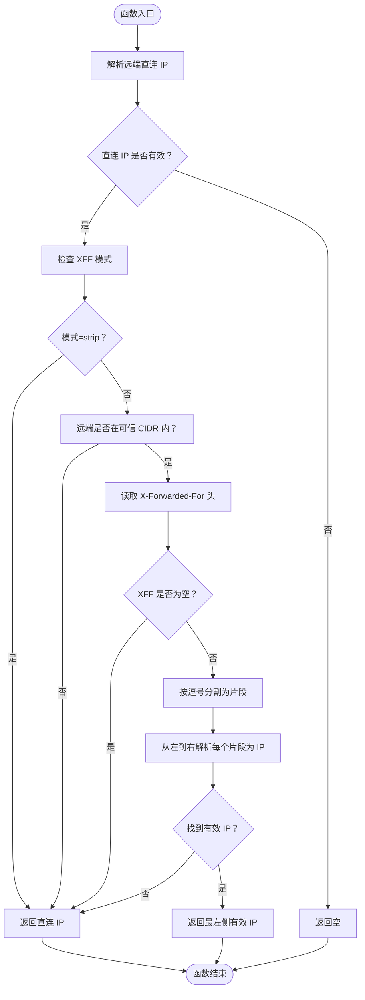
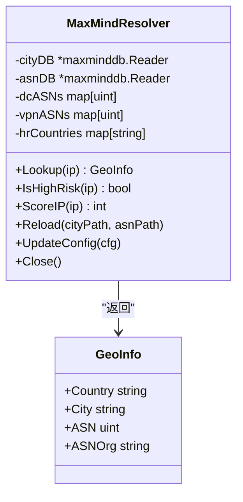
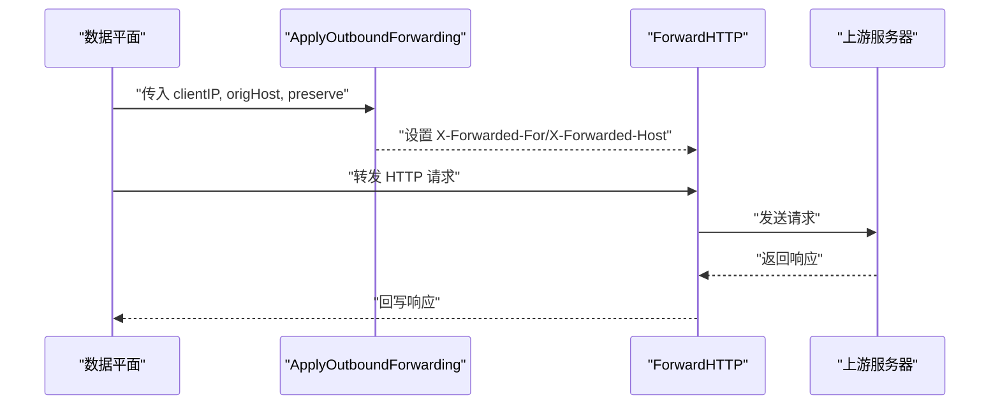
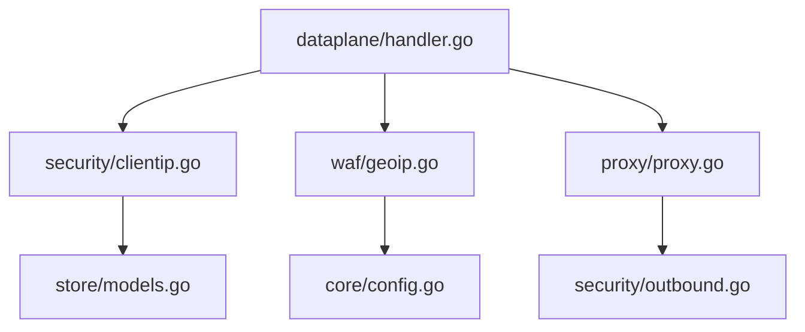

# 客户端 IP 获取

<cite>
**本文档引用的文件**
- [clientip.go](file://internal/security/clientip.go)
- [outbound.go](file://internal/security/outbound.go)
- [proxy.go](file://internal/proxy/proxy.go)
- [handler.go](file://internal/dataplane/handler.go)
- [models.go](file://internal/store/models.go)
- [geoip.go](file://internal/waf/geoip.go)
- [config.go](file://internal/core/config.go)
- [page.tsx](file://frontend/app/(dashboard)/forwarding-profiles/page.tsx)
</cite>

## 目录
1. [简介](#简介)
2. [项目结构](#项目结构)
3. [核心组件](#核心组件)
4. [架构概览](#架构概览)
5. [详细组件分析](#详细组件分析)
6. [依赖关系分析](#依赖关系分析)
7. [性能考量](#性能考量)
8. [故障排除指南](#故障排除指南)
9. [结论](#结论)

## 简介
本文件详细说明了 My-OpenWaf 中客户端 IP 获取与代理链处理机制。内容涵盖：
- X-Forwarded-For 头解析与多级代理识别
- 真实 IP 识别算法（可信代理列表、优先级排序、回退策略）
- IP 地址验证与清理（IPv4/IPv6 支持、私有地址过滤、保留地址处理）
- 地理位置信息获取（GeoIP 集成、位置查询、风险评分）
- 隐私保护与安全考虑（匿名化、防伪造、中间人攻击防范、IP 欺骗检测）
- 配置选项（代理信任设置、头部白名单、验证规则）

## 项目结构
客户端 IP 获取机制涉及以下关键模块：
- 安全模块：负责解析客户端真实 IP、设置出站请求头
- 数据平面：接收请求、调用安全模块、执行 WAF 规则、转发上游
- 存储模型：定义站点配置（XFF 模式、可信 CIDR、Host 保留等）
- GeoIP 模块：基于 MaxMind 数据库进行地理位置与风险评分
- 前端界面：提供转发配置页面，支持 XFF 模式与可信 CIDR 设置

**图表来源**
- [handler.go:38-310](file://internal/dataplane/handler.go#L38-L310)
- [clientip.go:12-49](file://internal/security/clientip.go#L12-L49)
- [outbound.go:8-16](file://internal/security/outbound.go#L8-L16)
- [proxy.go:73-135](file://internal/proxy/proxy.go#L73-L135)
- [models.go:125-128](file://internal/store/models.go#L125-L128)
- [geoip.go:26-151](file://internal/waf/geoip.go#L26-L151)

**章节来源**
- [handler.go:38-310](file://internal/dataplane/handler.go#L38-L310)
- [clientip.go:12-49](file://internal/security/clientip.go#L12-L49)
- [outbound.go:8-16](file://internal/security/outbound.go#L8-L16)
- [proxy.go:73-135](file://internal/proxy/proxy.go#L73-L135)
- [models.go:125-128](file://internal/store/models.go#L125-L128)
- [geoip.go:26-151](file://internal/waf/geoip.go#L26-L151)

## 核心组件
- 客户端 IP 解析器：根据 XFF 模式与可信 CIDR 判断是否信任 X-Forwarded-For 头中的最左侧 IP
- 出站头设置：在向上游转发时设置 X-Forwarded-For 与可选的 X-Forwarded-Host
- 代理转发：封装 HTTP 转发逻辑，应用出站头设置
- 站点配置：定义 XFF 模式、可信 CIDR、Host 保留等
- GeoIP 解析器：基于 MaxMind 数据库返回国家/城市/ASN 等信息，并提供高风险预筛选与评分

**章节来源**
- [clientip.go:12-49](file://internal/security/clientip.go#L12-L49)
- [outbound.go:8-16](file://internal/security/outbound.go#L8-L16)
- [proxy.go:73-135](file://internal/proxy/proxy.go#L73-L135)
- [models.go:125-128](file://internal/store/models.go#L125-L128)
- [geoip.go:26-151](file://internal/waf/geoip.go#L26-L151)

## 架构概览
下图展示了从请求进入数据平面到最终转发上游的关键流程，以及 IP 获取与 GeoIP 查询的集成点。

**图表来源**
- [handler.go:74-272](file://internal/dataplane/handler.go#L74-L272)
- [clientip.go:12-49](file://internal/security/clientip.go#L12-L49)
- [geoip.go:127-151](file://internal/waf/geoip.go#L127-L151)
- [outbound.go:8-16](file://internal/security/outbound.go#L8-L16)
- [proxy.go:73-135](file://internal/proxy/proxy.go#L73-L135)

## 详细组件分析

### 客户端 IP 获取与代理链处理
- 远端直接 IP：从请求上下文提取远端地址，解析为 net.IP
- XFF 模式：
  - strip_all_and_set_remote：始终信任远端直连 IP，忽略 X-Forwarded-For
  - trust_outer_waf_cidr_then_take_leftmost：仅当远端在可信 CIDR 内时才信任 X-Forwarded-For 的最左侧 IP
- 可信 CIDR 解析：支持逗号、换行、分号分隔的多个条目，单个 IP 或 CIDR 均可
- 回退策略：若 X-Forwarded-For 缺失或解析失败，回退到远端直连 IP

**图表来源**
- [clientip.go:13-49](file://internal/security/clientip.go#L13-L49)
- [clientip.go:51-79](file://internal/security/clientip.go#L51-L79)

**章节来源**
- [clientip.go:12-49](file://internal/security/clientip.go#L12-L49)
- [clientip.go:51-79](file://internal/security/clientip.go#L51-L79)

### 真实 IP 识别算法
- 可信代理判定：通过 remoteInTrustedCIDR 判断远端地址是否属于可信 CIDR 或等于指定 IP
- 优先级排序：优先信任 X-Forwarded-For 最左侧有效 IP；否则回退到直连 IP
- 回退策略：当 XFF 缺失或无法解析时，保证不会误判为代理链中的其他节点

**章节来源**
- [clientip.go:51-79](file://internal/security/clientip.go#L51-L79)

### IP 地址验证与清理
- IPv4/IPv6 支持：net.ParseIP 自动识别 IPv4 与 IPv6
- 清理与解析：对 XFF 片段进行 TrimSpace，确保去除多余空白字符
- 无效值处理：遇到无法解析的片段时跳过，继续尝试下一个片段

**章节来源**
- [clientip.go:34-44](file://internal/security/clientip.go#L34-L44)

### 地理位置信息获取与风险评估
- 数据库加载：支持 City 与 ASN 两个 MaxMind 数据库，可独立或同时启用
- 查询接口：
  - Lookup：返回国家、城市、ASN、组织等完整信息
  - IsHighRisk：快速判断是否来自数据中心/VPN/代理或高风险国家
  - ScoreIP：返回风险评分（数据中心+25、VPN/代理+15、高风险国家+20）
- 风险列表：通过 BotConfig 注入数据中心 ASN、VPN/代理 ASN、高风险国家列表

**图表来源**
- [geoip.go:26-151](file://internal/waf/geoip.go#L26-L151)
- [geoip.go:16-22](file://internal/waf/geoip.go#L16-L22)

**章节来源**
- [geoip.go:26-151](file://internal/waf/geoip.go#L26-L151)
- [geoip.go:16-22](file://internal/waf/geoip.go#L16-L22)

### 出站请求头设置与上游转发
- 出站头设置：在向上游转发时设置 X-Forwarded-For 为真实客户端 IP；可选设置 X-Forwarded-Host 以保留原始 Host
- 上游转发：构建 HTTP 请求，复制必要头部，移除 Hop-by-Hop 头部，发送并回写响应

**图表来源**
- [outbound.go:8-16](file://internal/security/outbound.go#L8-L16)
- [proxy.go:73-135](file://internal/proxy/proxy.go#L73-L135)

**章节来源**
- [outbound.go:8-16](file://internal/security/outbound.go#L8-L16)
- [proxy.go:73-135](file://internal/proxy/proxy.go#L73-L135)

### 配置选项与站点绑定
- XFF 模式：
  - strip_all_and_set_remote：剥离并设为远端 IP
  - trust_outer_waf_cidr_then_take_leftmost：信任外层 WAF 后取最左
- 可信 CIDR：支持多条，逗号/换行/分号分隔
- Host 保留：可选择保留原始 Host 到上游
- 前端页面：提供字段配置与说明

**章节来源**
- [models.go:125-128](file://internal/store/models.go#L125-L128)
- [page.tsx:10-21](file://frontend/app/(dashboard)/forwarding-profiles/page.tsx#L10-L21)

## 依赖关系分析
- 数据平面处理器依赖安全模块进行 IP 解析，并在需要时调用 GeoIP 解析器
- 出站头设置与代理转发共同完成上游请求的构造与发送
- 站点模型提供 XFF 模式与可信 CIDR 等运行时配置
- GeoIP 解析器依赖 MaxMind 数据库与核心配置中的风险列表

**图表来源**
- [handler.go:38-310](file://internal/dataplane/handler.go#L38-L310)
- [clientip.go:12-49](file://internal/security/clientip.go#L12-L49)
- [geoip.go:26-151](file://internal/waf/geoip.go#L26-L151)
- [proxy.go:73-135](file://internal/proxy/proxy.go#L73-L135)
- [models.go:125-128](file://internal/store/models.go#L125-L128)
- [config.go:10-18](file://internal/core/config.go#L10-L18)

**章节来源**
- [handler.go:38-310](file://internal/dataplane/handler.go#L38-L310)
- [clientip.go:12-49](file://internal/security/clientip.go#L12-L49)
- [geoip.go:26-151](file://internal/waf/geoip.go#L26-L151)
- [proxy.go:73-135](file://internal/proxy/proxy.go#L73-L135)
- [models.go:125-128](file://internal/store/models.go#L125-L128)
- [config.go:10-18](file://internal/core/config.go#L10-L18)

## 性能考量
- 解析复杂度：XFF 解析为线性扫描，复杂度 O(n)，其中 n 为逗号分隔片段数
- 可信 CIDR 判定：采用字符串预处理与 net.ParseCIDR/net.ParseIP，整体开销较小
- GeoIP 查询：数据库查找为常数时间，但存在锁竞争；建议合理缓存与批量查询
- 头部处理：仅复制必要头部并移除 Hop-by-Hop 头，避免额外网络开销

## 故障排除指南
- XFF 未生效：
  - 检查 XFF 模式是否正确设置
  - 确认远端地址确实在可信 CIDR 内
  - 验证 X-Forwarded-For 头格式是否规范（逗号分隔、无多余空白）
- IP 解析失败：
  - 确保请求上下文中的远端地址可解析
  - 检查是否存在代理链中不可信节点篡改 XFF
- GeoIP 无结果：
  - 确认 MaxMind 数据库路径有效且可读
  - 检查风险列表（数据中心/VPN/代理/高风险国家）是否正确注入
- 上游 Host 异常：
  - 检查 PreserveOriginalHost 配置是否开启
  - 确认 X-Forwarded-Host 设置逻辑符合预期

**章节来源**
- [clientip.go:23-25](file://internal/security/clientip.go#L23-L25)
- [clientip.go:34-37](file://internal/security/clientip.go#L34-L37)
- [outbound.go:13-15](file://internal/security/outbound.go#L13-L15)
- [geoip.go:66-96](file://internal/waf/geoip.go#L66-L96)

## 结论
本机制通过明确的 XFF 模式与可信 CIDR 控制，结合严格的 IP 解析与清理流程，在保证安全性的同时兼顾性能与可维护性。GeoIP 集成为风险评估提供了可靠依据，配合前端配置页面实现了灵活的站点级策略管理。建议在生产环境中：
- 明确可信代理范围，避免误信不可信节点
- 定期更新 GeoIP 数据库与风险列表
- 对敏感操作启用更严格的安全策略与审计日志