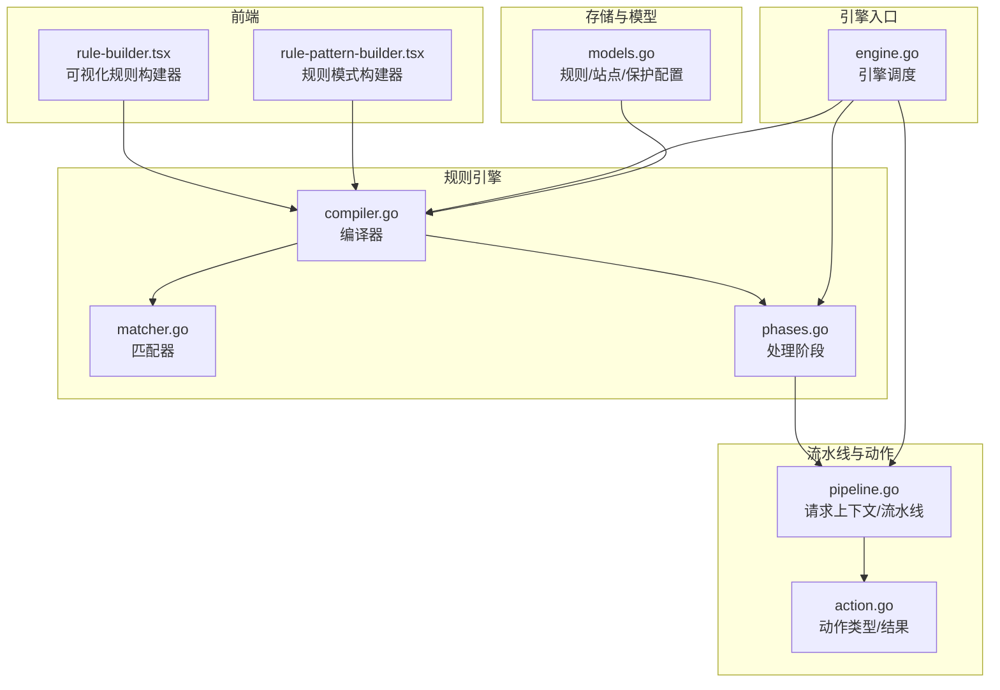
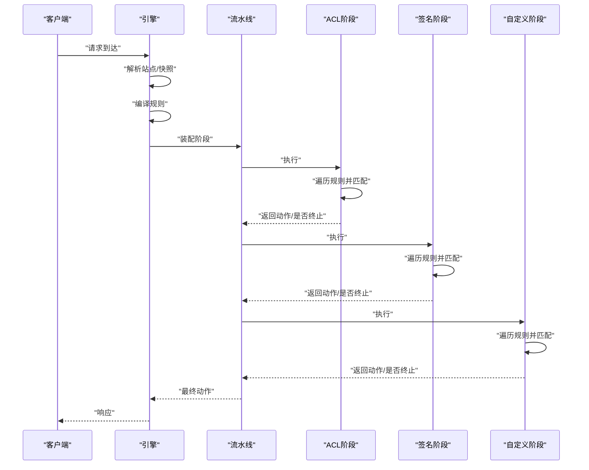
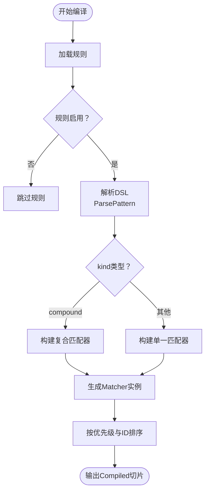
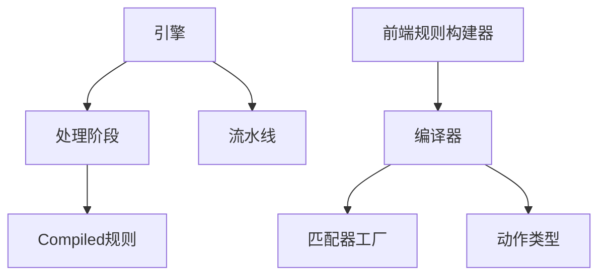

# ACL 规则引擎

<cite>
**本文档引用的文件**
- [internal/core/rule/compiler.go](file://internal/core/rule/compiler.go)
- [internal/core/rule/matcher.go](file://internal/core/rule/matcher.go)
- [internal/core/rule/phases.go](file://internal/core/rule/phases.go)
- [internal/core/engine/engine.go](file://internal/core/engine/engine.go)
- [internal/core/pipeline/pipeline.go](file://internal/core/pipeline/pipeline.go)
- [internal/core/action/action.go](file://internal/core/action/action.go)
- [internal/store/models.go](file://internal/store/models.go)
- [frontend/components/rule-builder.tsx](file://frontend/components/rule-builder.tsx)
- [frontend/components/rule-pattern-builder.tsx](file://frontend/components/rule-pattern-builder.tsx)
- [internal/core/rule/compiler_test.go](file://internal/core/rule/compiler_test.go)
- [internal/core/rule/matcher_test.go](file://internal/core/rule/matcher_test.go)
</cite>

## 目录
1. [简介](#简介)
2. [项目结构](#项目结构)
3. [核心组件](#核心组件)
4. [架构总览](#架构总览)
5. [详细组件分析](#详细组件分析)
6. [依赖关系分析](#依赖关系分析)
7. [性能考量](#性能考量)
8. [故障排查指南](#故障排查指南)
9. [结论](#结论)
10. [附录](#附录)

## 简介
本文件系统性阐述 ACL 规则引擎的设计与实现，覆盖规则编译器、规则匹配器、处理阶段、规则语法与表达式、执行顺序与优先级、以及规则编写与调试方法。该引擎采用“规则 DSL → 编译 → 匹配器”三层架构：规则以人类可读的 DSL 表达，编译器将其转换为高效运行时的匹配器集合；在请求处理流水线中，按阶段顺序执行匹配，一旦命中即根据动作类型决定是否短路或继续。

## 项目结构
规则引擎位于 internal/core/rule 目录，配合内部 pipeline、action、store 模块协同工作；前端提供可视化规则构建器，便于用户编写与验证规则 DSL。

图表来源
- [internal/core/rule/compiler.go:1-83](file://internal/core/rule/compiler.go#L1-L83)
- [internal/core/rule/matcher.go:1-343](file://internal/core/rule/matcher.go#L1-L343)
- [internal/core/rule/phases.go:1-555](file://internal/core/rule/phases.go#L1-L555)
- [internal/core/pipeline/pipeline.go:1-66](file://internal/core/pipeline/pipeline.go#L1-L66)
- [internal/core/action/action.go:1-53](file://internal/core/action/action.go#L1-L53)
- [internal/core/engine/engine.go:1-169](file://internal/core/engine/engine.go#L1-L169)
- [internal/store/models.go:1-397](file://internal/store/models.go#L1-L397)
- [frontend/components/rule-builder.tsx:1-556](file://frontend/components/rule-builder.tsx#L1-L556)
- [frontend/components/rule-pattern-builder.tsx:1-288](file://frontend/components/rule-pattern-builder.tsx#L1-L288)

章节来源
- [internal/core/rule/compiler.go:1-83](file://internal/core/rule/compiler.go#L1-L83)
- [internal/core/rule/matcher.go:1-343](file://internal/core/rule/matcher.go#L1-L343)
- [internal/core/rule/phases.go:1-555](file://internal/core/rule/phases.go#L1-L555)
- [internal/core/pipeline/pipeline.go:1-66](file://internal/core/pipeline/pipeline.go#L1-L66)
- [internal/core/action/action.go:1-53](file://internal/core/action/action.go#L1-L53)
- [internal/core/engine/engine.go:1-169](file://internal/core/engine/engine.go#L1-L169)
- [internal/store/models.go:1-397](file://internal/store/models.go#L1-L397)
- [frontend/components/rule-builder.tsx:1-556](file://frontend/components/rule-builder.tsx#L1-L556)
- [frontend/components/rule-pattern-builder.tsx:1-288](file://frontend/components/rule-pattern-builder.tsx#L1-L288)

## 核心组件
- 规则编译器：将持久化规则转换为已编译的运行时规则集，按优先级排序，预构建匹配器。
- 匹配器：针对具体字段（IP、路径、查询、头部、方法、内容类型等）进行高效匹配，支持正则缓存。
- 处理阶段：定义 ACL、签名、自定义、速率限制、IP信誉、机器人检测、OWASP、CVE 等阶段，按序执行。
- 引擎：整合站点解析、规则编译、阶段装配与流水线执行。
- 前端规则构建器：提供可视化与高级 DSL 编写、语法验证与简单测试。

章节来源
- [internal/core/rule/compiler.go:27-55](file://internal/core/rule/compiler.go#L27-L55)
- [internal/core/rule/matcher.go:167-261](file://internal/core/rule/matcher.go#L167-L261)
- [internal/core/rule/phases.go:34-94](file://internal/core/rule/phases.go#L34-L94)
- [internal/core/engine/engine.go:56-128](file://internal/core/engine/engine.go#L56-L128)
- [frontend/components/rule-builder.tsx:16-34](file://frontend/components/rule-builder.tsx#L16-L34)

## 架构总览
规则引擎遵循“编译期优化 + 运行期快速匹配”的设计。编译阶段完成：
- 解析规则 DSL，识别简单规则与复合 JSON 条件。
- 将规则映射为具体匹配器实例（如 CIDR、前缀、正则、头部包含/正则、精确路径、方法、内容类型、查询参数等）。
- 对正则表达式进行缓存，避免重复编译。
- 按优先级与 ID 排序，确保稳定的执行顺序。

运行阶段在流水线中按阶段顺序执行，每个阶段遍历其规则集，命中后根据动作类型决定是否短路或继续收集观察类命中。

图表来源
- [internal/core/engine/engine.go:56-128](file://internal/core/engine/engine.go#L56-L128)
- [internal/core/rule/phases.go:40-52](file://internal/core/rule/phases.go#L40-L52)
- [internal/core/rule/phases.go:64-72](file://internal/core/rule/phases.go#L64-L72)
- [internal/core/rule/phases.go:85-93](file://internal/core/rule/phases.go#L85-L93)
- [internal/core/pipeline/pipeline.go:46-65](file://internal/core/pipeline/pipeline.go#L46-L65)

## 详细组件分析

### 规则编译器
- 职责：将存储层规则转换为运行时可直接匹配的 Compiled 列表；解析 DSL，构建匹配器；按优先级与 ID 排序。
- 关键点：
  - ParsePattern 支持简单规则（kind:arg）与复合 JSON（{"op":"and|or|not","children":[...]}）。
  - buildMatcher 根据 kind 创建具体匹配器，含 CIDR、路径前缀/正则/精确、查询包含/正则、头部包含/正则、方法、内容类型、User-Agent、Body、查询参数等。
  - 正则表达式通过 cachedCompile 缓存，避免重复编译。
  - 排序依据：优先级升序，优先级相同时按 ID 升序。

图表来源
- [internal/core/rule/compiler.go:27-55](file://internal/core/rule/compiler.go#L27-L55)
- [internal/core/rule/compiler.go:57-82](file://internal/core/rule/compiler.go#L57-L82)
- [internal/core/rule/matcher.go:167-261](file://internal/core/rule/matcher.go#L167-L261)
- [internal/core/rule/matcher.go:278-296](file://internal/core/rule/matcher.go#L278-L296)

章节来源
- [internal/core/rule/compiler.go:27-55](file://internal/core/rule/compiler.go#L27-L55)
- [internal/core/rule/compiler.go:57-82](file://internal/core/rule/compiler.go#L57-L82)
- [internal/core/rule/matcher.go:167-261](file://internal/core/rule/matcher.go#L167-L261)
- [internal/core/rule/matcher.go:278-296](file://internal/core/rule/matcher.go#L278-L296)

### 规则匹配器
- 接口：Matcher 定义 Match 方法，接收客户端 IP、方法、路径、查询、头部映射。
- 组合匹配器：and/or/not 支持复杂条件组合。
- 具体匹配器：
  - IP：CIDR 包含判断。
  - 路径：前缀、正则、精确匹配。
  - 查询：包含、正则。
  - 头部：包含、正则（大小写不敏感）。
  - 方法：大小写不敏感比较。
  - 内容类型：检查 Content-Type 字段。
  - User-Agent：便捷匹配（等价于 block_header:User-Agent:<value> 及其正则变体）。
  - Body：占位匹配（实际 Body 检查在请求上下文中处理）。
  - 查询参数：解析查询字符串定位指定参数并匹配。
- 正则缓存：cachedCompile 使用读写锁保护全局缓存，避免重复编译。

```mermaid
classDiagram
class Matcher {
+Match(ip, method, path, query, headers) bool
}
class andMatcher {
-children []Matcher
+Match(...)
}
class orMatcher {
-children []Matcher
+Match(...)
}
class notMatcher {
-child Matcher
+Match(...)
}
class ipCIDRMatcher {
-cidr *net.IPNet
+Match(...)
}
class pathPrefixMatcher {
-prefix string
+Match(...)
}
class pathRegexMatcher {
-re *regexp.Regexp
+Match(...)
}
class exactPathMatcher {
-path string
+Match(...)
}
class queryContainsMatcher {
-substr string
+Match(...)
}
class queryRegexMatcher {
-re *regexp.Regexp
+Match(...)
}
class headerContainsMatcher {
-name string
-substr string
+Match(...)
}
class headerRegexMatcher {
-name string
-re *regexp.Regexp
+Match(...)
}
class methodMatcher {
-method string
+Match(...)
}
class contentTypeMatcher {
-ctype string
+Match(...)
}
class bodyContainsMatcher {
-substr string
+Match(...)
}
class queryParamMatcher {
-param string
-value string
+Match(...)
}
class alwaysMatcher {
+Match(...) bool
}
class neverMatcher {
+Match(...) bool
}
Matcher <|.. andMatcher
Matcher <|.. orMatcher
Matcher <|.. notMatcher
Matcher <|.. ipCIDRMatcher
Matcher <|.. pathPrefixMatcher
Matcher <|.. pathRegexMatcher
Matcher <|.. exactPathMatcher
Matcher <|.. queryContainsMatcher
Matcher <|.. queryRegexMatcher
Matcher <|.. headerContainsMatcher
Matcher <|.. headerRegexMatcher
Matcher <|.. methodMatcher
Matcher <|.. contentTypeMatcher
Matcher <|.. bodyContainsMatcher
Matcher <|.. queryParamMatcher
Matcher <|.. alwaysMatcher
Matcher <|.. neverMatcher
```

图表来源
- [internal/core/rule/matcher.go:11-14](file://internal/core/rule/matcher.go#L11-L14)
- [internal/core/rule/matcher.go:18-44](file://internal/core/rule/matcher.go#L18-L44)
- [internal/core/rule/matcher.go:48-132](file://internal/core/rule/matcher.go#L48-L132)
- [internal/core/rule/matcher.go:167-261](file://internal/core/rule/matcher.go#L167-L261)
- [internal/core/rule/matcher.go:278-296](file://internal/core/rule/matcher.go#L278-L296)

章节来源
- [internal/core/rule/matcher.go:11-14](file://internal/core/rule/matcher.go#L11-L14)
- [internal/core/rule/matcher.go:18-44](file://internal/core/rule/matcher.go#L18-L44)
- [internal/core/rule/matcher.go:48-132](file://internal/core/rule/matcher.go#L48-L132)
- [internal/core/rule/matcher.go:167-261](file://internal/core/rule/matcher.go#L167-L261)
- [internal/core/rule/matcher.go:278-296](file://internal/core/rule/matcher.go#L278-L296)

### 处理阶段与执行顺序
- 阶段划分：
  - ACL：规则型访问控制，允许短路跳过后续阶段。
  - Signature：签名规则匹配。
  - Custom：自定义规则匹配。
  - Request Rate Limit：请求速率限制。
  - IP Reputation：IP 信誉白名单短路、黑名单拦截。
  - Bot Detection：两阶段（PreScreen → DeepScore）或单阶段机器人检测。
  - OWASP Default：OWASP 攻击检测。
  - CVE Detection：特定漏洞检测。
- 执行顺序：引擎装配阶段顺序固定，先 IP 信誉，再 ACL，然后机器人检测，再速率限制，再 OWASP，再 CVE，最后签名与自定义。
- 命中行为：
  - Allow：短路，不再进入后续阶段。
  - Intercept：短路，记录日志。
  - Observe：不短路，仅记录日志供后续阶段继续处理。

图表来源
- [internal/core/engine/engine.go:84-119](file://internal/core/engine/engine.go#L84-L119)
- [internal/core/rule/phases.go:40-52](file://internal/core/rule/phases.go#L40-L52)
- [internal/core/rule/phases.go:64-72](file://internal/core/rule/phases.go#L64-L72)
- [internal/core/rule/phases.go:85-93](file://internal/core/rule/phases.go#L85-L93)

章节来源
- [internal/core/engine/engine.go:84-119](file://internal/core/engine/engine.go#L84-L119)
- [internal/core/rule/phases.go:34-94](file://internal/core/rule/phases.go#L34-L94)
- [internal/core/action/action.go:39-49](file://internal/core/action/action.go#L39-L49)

### 规则语法与表达式支持
- 简单规则：kind:arg
  - 支持：block_ip/allow_ip、block_path、allow_path、block_path_exact、block_path_regex、allow_path_regex、block_query_contains、block_query_regex、block_header、allow_header、block_header_regex、block_method、block_content_type、block_body_contains、block_body_regex、block_user_agent、block_user_agent_regex、query_param 等。
- 复合规则：JSON
  - {"op":"and|or|not","children":[{...},{...}]}
  - 子节点可为简单规则或嵌套复合规则。
- 变量与上下文：
  - 支持从请求上下文中提取 ClientIP、Method、Path、RawQuery、Headers 等字段参与匹配。
- 前端构建器：
  - 提供可视化选择与高级 DSL 输入，支持语法验证与简单测试。

章节来源
- [internal/core/rule/compiler.go:57-82](file://internal/core/rule/compiler.go#L57-L82)
- [internal/core/rule/matcher.go:167-261](file://internal/core/rule/matcher.go#L167-L261)
- [frontend/components/rule-builder.tsx:16-34](file://frontend/components/rule-builder.tsx#L16-L34)
- [frontend/components/rule-builder.tsx:59-93](file://frontend/components/rule-builder.tsx#L59-L93)
- [frontend/components/rule-pattern-builder.tsx:54-88](file://frontend/components/rule-pattern-builder.tsx#L54-L88)

### 规则执行顺序与优先级
- 编译时排序：优先级升序，优先级相同时按 ID 升序。
- 运行时遍历：阶段内按编译顺序依次匹配，命中即停止当前阶段（Allow 短路）。
- 动作影响：Allow 短路后续阶段；Intercept 短路并记录；Observe 继续收集日志但不短路。

章节来源
- [internal/core/rule/compiler.go:48-53](file://internal/core/rule/compiler.go#L48-L53)
- [internal/core/rule/phases.go:40-52](file://internal/core/rule/phases.go#L40-L52)
- [internal/core/action/action.go:39-49](file://internal/core/action/action.go#L39-L49)

### 规则编写示例与调试方法
- 示例（DSL）：
  - 简单：block_ip:192.168.1.0/24、block_path:/admin、block_method:DELETE、block_header_regex:User-Agent:(?i)scanner。
  - 复合：{"op":"and","children":[{"kind":"block_path","arg":"/admin"},{"kind":"block_method","arg":"POST"}]}。
- 调试：
  - 前端规则构建器提供“验证规则”与“测试匹配”，支持输入路径、方法、IP、查询、请求头、Body 进行简单匹配测试。
  - 后端测试用例覆盖 IP 匹配、路径正则、查询正则、复合 AND/OR/NOT、User-Agent 正则、正则缓存一致性等场景。

章节来源
- [frontend/components/rule-builder.tsx:208-226](file://frontend/components/rule-builder.tsx#L208-L226)
- [frontend/components/rule-builder.tsx:228-293](file://frontend/components/rule-builder.tsx#L228-L293)
- [internal/core/rule/compiler_test.go:11-87](file://internal/core/rule/compiler_test.go#L11-L87)
- [internal/core/rule/matcher_test.go:30-110](file://internal/core/rule/matcher_test.go#L30-L110)
- [internal/core/rule/matcher_test.go:188-220](file://internal/core/rule/matcher_test.go#L188-L220)

## 依赖关系分析
- 编译器依赖匹配器工厂与动作类型，输出 Compiled 列表。
- 处理阶段依赖编译后的规则集与动作结果。
- 引擎依赖站点解析、规则编译、阶段装配与流水线执行。
- 前端规则构建器依赖规则种类清单与 DSL 解析/构建逻辑。

图表来源
- [internal/core/rule/compiler.go:1-20](file://internal/core/rule/compiler.go#L1-L20)
- [internal/core/rule/matcher.go:1-14](file://internal/core/rule/matcher.go#L1-L14)
- [internal/core/rule/phases.go:1-17](file://internal/core/rule/phases.go#L1-L17)
- [internal/core/engine/engine.go:1-24](file://internal/core/engine/engine.go#L1-L24)
- [frontend/components/rule-builder.tsx:16-34](file://frontend/components/rule-builder.tsx#L16-L34)

章节来源
- [internal/core/rule/compiler.go:1-20](file://internal/core/rule/compiler.go#L1-L20)
- [internal/core/rule/matcher.go:1-14](file://internal/core/rule/matcher.go#L1-L14)
- [internal/core/rule/phases.go:1-17](file://internal/core/rule/phases.go#L1-L17)
- [internal/core/engine/engine.go:1-24](file://internal/core/engine/engine.go#L1-L24)
- [frontend/components/rule-builder.tsx:16-34](file://frontend/components/rule-builder.tsx#L16-L34)

## 性能考量
- 正则缓存：全局读写锁保护的正则缓存，避免重复编译，显著降低 CPU 开销。
- 匹配器选择：针对不同字段采用最高效的数据结构与算法（CIDR、前缀、正则、哈希遍历头部）。
- 排序与短路：编译期稳定排序与阶段内命中短路，减少不必要的匹配开销。
- 速率限制与信誉：前置 IP 信誉与速率限制，尽早丢弃无效请求，减轻后续阶段压力。
- Body 扫描：Body 匹配在请求上下文中处理，避免在匹配器中进行昂贵的正文扫描。

章节来源
- [internal/core/rule/matcher.go:278-296](file://internal/core/rule/matcher.go#L278-L296)
- [internal/core/rule/phases.go:142-170](file://internal/core/rule/phases.go#L142-L170)
- [internal/core/rule/phases.go:109-128](file://internal/core/rule/phases.go#L109-L128)

## 故障排查指南
- 规则不生效：
  - 检查规则是否启用、阶段是否正确、优先级是否被更高优先级规则覆盖。
  - 使用前端“验证规则”确认 DSL 语法正确。
- 正则匹配异常：
  - 确认正则表达式有效；检查正则缓存是否命中同一实例。
- 匹配器未触发：
  - 核对请求字段（路径、方法、头部、查询、IP）与规则参数是否一致。
- 动作不符合预期：
  - Allow 会短路后续阶段；Intercept 会短路并记录；Observe 仅记录日志。
- 常见错误与解决：
  - 无效 IP/CIDR：编译器会回退为“不匹配”以避免误伤。
  - 无效正则：编译器会回退为“不匹配”以避免误伤。
  - 复合规则 children 为空：将被忽略或降级为简单规则。

章节来源
- [internal/core/rule/compiler_test.go:11-87](file://internal/core/rule/compiler_test.go#L11-L87)
- [internal/core/rule/matcher_test.go:30-110](file://internal/core/rule/matcher_test.go#L30-L110)
- [internal/core/rule/matcher.go:169-185](file://internal/core/rule/matcher.go#L169-L185)
- [internal/core/rule/matcher.go:191-204](file://internal/core/rule/matcher.go#L191-L204)
- [internal/core/rule/matcher.go:309-342](file://internal/core/rule/matcher.go#L309-L342)

## 结论
该 ACL 规则引擎通过清晰的编译期优化与运行期高效匹配，实现了灵活、可扩展、高性能的访问控制能力。编译器负责将 DSL 转换为可执行的匹配器集合，匹配器提供丰富的字段匹配能力与正则缓存，处理阶段定义了明确的执行顺序与短路策略。前端规则构建器进一步降低了规则编写的门槛，配合完善的测试与验证机制，使规则维护与调试更加高效。

## 附录
- 规则模型与阶段常量定义参见存储模型文件。
- 前端规则构建器提供规则种类清单与 DSL 解析/构建逻辑，便于用户编写与验证规则。

章节来源
- [internal/store/models.go:44-76](file://internal/store/models.go#L44-L76)
- [frontend/components/rule-builder.tsx:16-34](file://frontend/components/rule-builder.tsx#L16-L34)
- [frontend/components/rule-pattern-builder.tsx:11-29](file://frontend/components/rule-pattern-builder.tsx#L11-L29)