# 处理阶段

<cite>
**本文档引用的文件**
- [phases.go](file://internal/core/rules/phases.go)
- [engine.go](file://internal/core/engine/engine.go)
- [pipeline.go](file://internal/core/pipeline/pipeline.go)
- [action.go](file://internal/core/action/action.go)
- [models.go](file://internal/store/models.go)
- [snapshot.go](file://internal/snapshot/snapshot.go)
- [bot.go](file://internal/waf/bot.go)
- [ratelimit.go](file://internal/waf/ratelimit.go)
- [iprep.go](file://internal/waf/iprep.go)
</cite>

## 目录
1. [简介](#简介)
2. [项目结构](#项目结构)
3. [核心组件](#核心组件)
4. [架构概览](#架构概览)
5. [详细组件分析](#详细组件分析)
6. [依赖关系分析](#依赖关系分析)
7. [性能考虑](#性能考虑)
8. [故障排除指南](#故障排除指南)
9. [结论](#结论)

## 简介

处理阶段是 OpenWAF 规则引擎架构中的核心概念，它定义了请求在 WAF 中的生命周期中经过的各个处理阶段。每个阶段都有特定的职责和执行逻辑，通过有序的流水线执行来实现全面的安全防护。

处理阶段系统采用模块化设计，支持灵活的配置和扩展，能够根据不同的安全需求组合不同的阶段。这种设计使得 WAF 能够在保证性能的同时提供多层次的安全防护。

## 项目结构

处理阶段相关的代码主要分布在以下目录中：

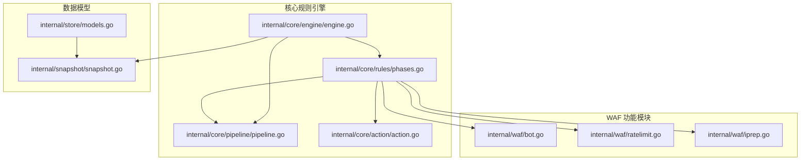

**图表来源**
- [phases.go:1-569](file://internal/core/rules/phases.go#L1-L569)
- [engine.go:1-176](file://internal/core/engine/engine.go#L1-L176)
- [pipeline.go:1-71](file://internal/core/pipeline/pipeline.go#L1-L71)

**章节来源**
- [phases.go:1-569](file://internal/core/rules/phases.go#L1-L569)
- [engine.go:1-176](file://internal/core/engine/engine.go#L1-L176)
- [pipeline.go:1-71](file://internal/core/pipeline/pipeline.go#L1-L71)

## 核心组件

### Phase 接口定义

处理阶段系统的核心是 `Phase` 接口，它定义了所有阶段必须实现的标准方法：

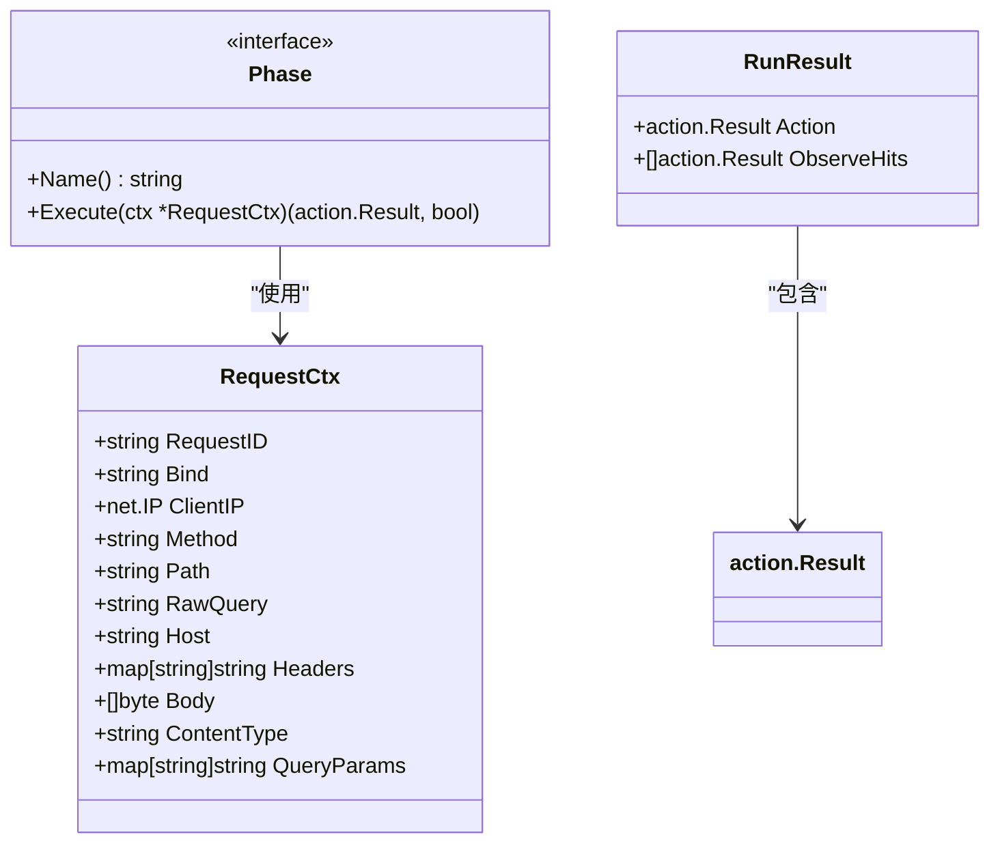

**图表来源**
- [pipeline.go:25-35](file://internal/core/pipeline/pipeline.go#L25-L35)

### 阶段类型分类

系统定义了多种不同类型的处理阶段，每种都有特定的功能和执行逻辑：

| 阶段名称 | 类型 | 职责 | 执行顺序 |
|---------|------|------|----------|
| IP信誉 | 内置 | IP 黑名单/白名单检查 | 第一阶段 |
| ACL | 内置 | 访问控制列表匹配 | 第二阶段 |
| 机器人检测 | 内置 | 自动化工具识别 | 第三阶段 |
| 请求速率限制 | 内置 | 流量控制 | 第四阶段 |
| OWASP 默认 | 内置 | 标准攻击模式检测 | 第五阶段 |
| CVE 检测 | 内置 | 已知漏洞利用检测 | 第六阶段 |
| 签名规则 | 用户 | 自定义签名规则 | 最后阶段 |
| 自定义规则 | 用户 | 自定义业务规则 | 最后阶段 |

**章节来源**
- [phases.go:34-358](file://internal/core/rules/phases.go#L34-L358)
- [engine.go:85-120](file://internal/core/engine/engine.go#L85-L120)

## 架构概览

处理阶段系统采用流水线架构，所有阶段按照预定义的顺序执行。整个架构的设计原则是：

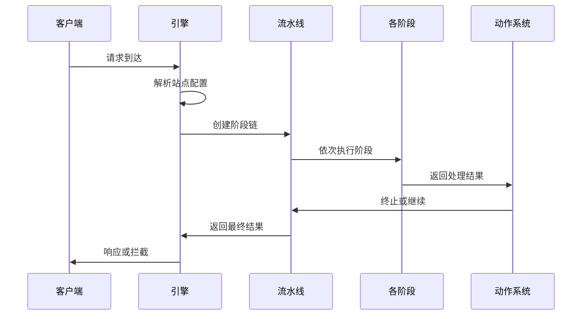

**图表来源**
- [engine.go:57-129](file://internal/core/engine/engine.go#L57-L129)
- [pipeline.go:46-70](file://internal/core/pipeline/pipeline.go#L46-L70)

### 执行顺序和数据传递

阶段间的执行遵循严格的顺序，数据通过 `RequestCtx` 对象在各阶段间传递：

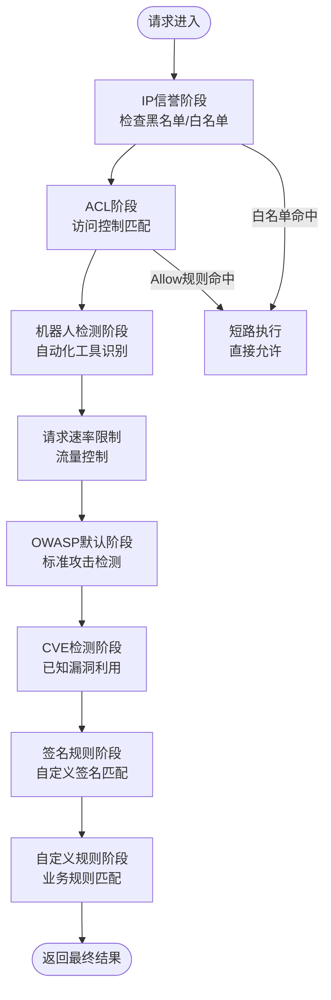

**图表来源**
- [engine.go:85-120](file://internal/core/engine/engine.go#L85-L120)
- [phases.go:40-52](file://internal/core/rules/phases.go#L40-L52)

**章节来源**
- [engine.go:57-129](file://internal/core/engine/engine.go#L57-L129)
- [pipeline.go:46-70](file://internal/core/pipeline/pipeline.go#L46-L70)

## 详细组件分析

### IP 信誉阶段 (IP Reputation Phase)

IP 信誉阶段是第一个执行的阶段，负责检查客户端 IP 地址的信誉状况：

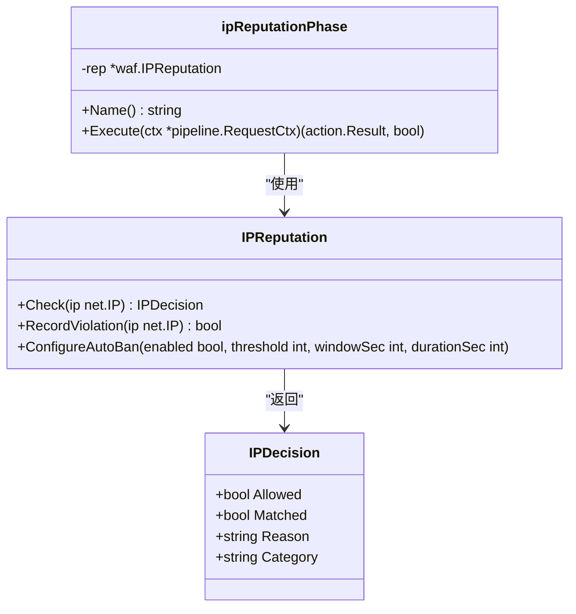

**图表来源**
- [phases.go:130-170](file://internal/core/rules/phases.go#L130-L170)
- [iprep.go:81-124](file://internal/waf/iprep.go#L81-L124)

IP 信誉阶段的执行逻辑：
1. 检查 IP 是否在白名单中 - 如果是，立即允许并标记
2. 检查 IP 是否在黑名单中 - 如果是，立即拦截
3. 检查是否触发自动封禁 - 如果是，立即拦截
4. 如果没有匹配，继续下一个阶段

**章节来源**
- [phases.go:142-170](file://internal/core/rules/phases.go#L142-L170)
- [iprep.go:89-124](file://internal/waf/iprep.go#L89-L124)

### ACL 阶段 (Access Control List)

ACL 阶段负责执行访问控制列表规则：

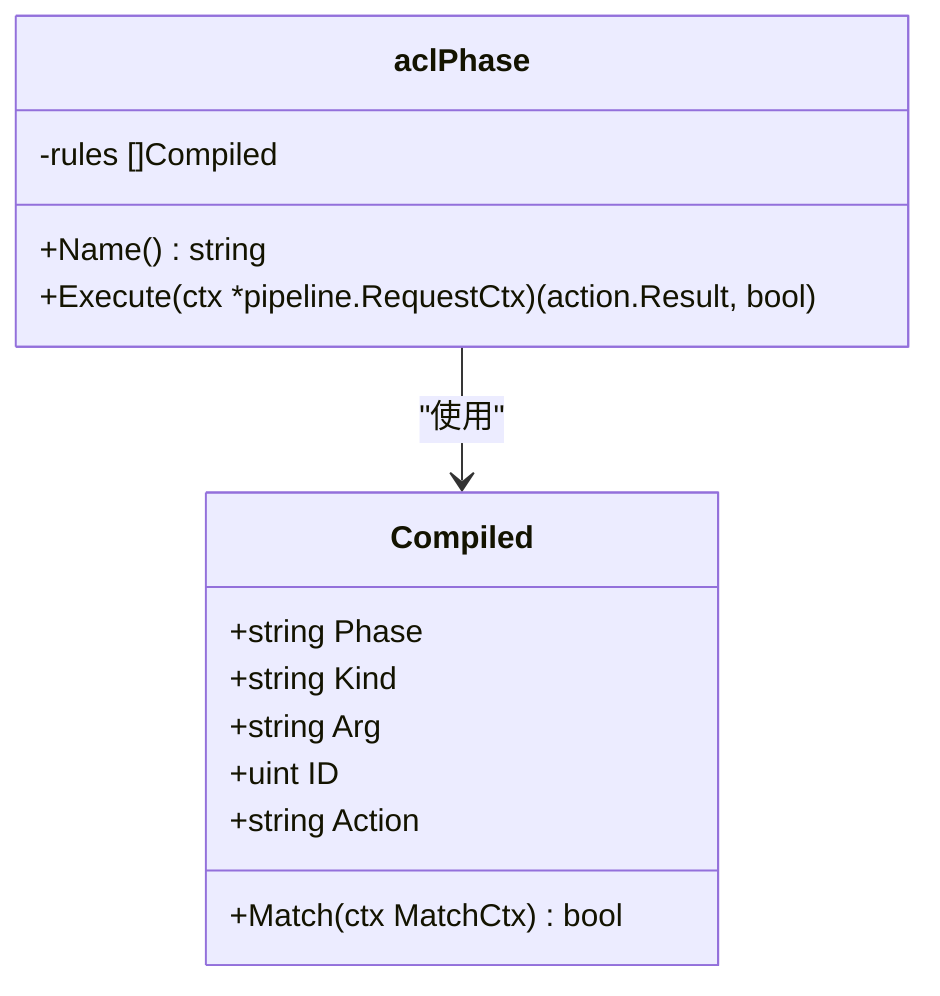

**图表来源**
- [phases.go:34-52](file://internal/core/rules/phases.go#L34-L52)

ACL 阶段的特点：
- 支持快速短路：当匹配到 Allow 规则时，整个管道被跳过
- 允许白名单机制：Allow 规则可以绕过所有后续阶段
- 标准化的规则匹配接口

**章节来源**
- [phases.go:40-52](file://internal/core/rules/phases.go#L40-L52)

### 机器人检测阶段 (Bot Detection)

机器人检测阶段提供两阶段的检测能力：

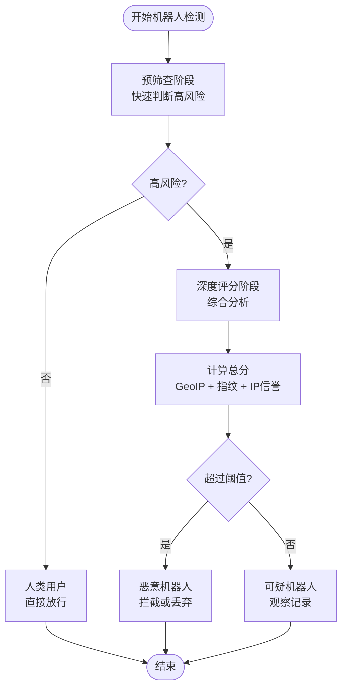

**图表来源**
- [bot.go:396-454](file://internal/waf/bot.go#L396-L454)

**章节来源**
- [phases.go:197-244](file://internal/core/rules/phases.go#L197-L244)
- [bot.go:126-161](file://internal/waf/bot.go#L126-L161)

### 请求速率限制阶段 (Request Rate Limit)

请求速率限制阶段提供基于时间窗口的流量控制：

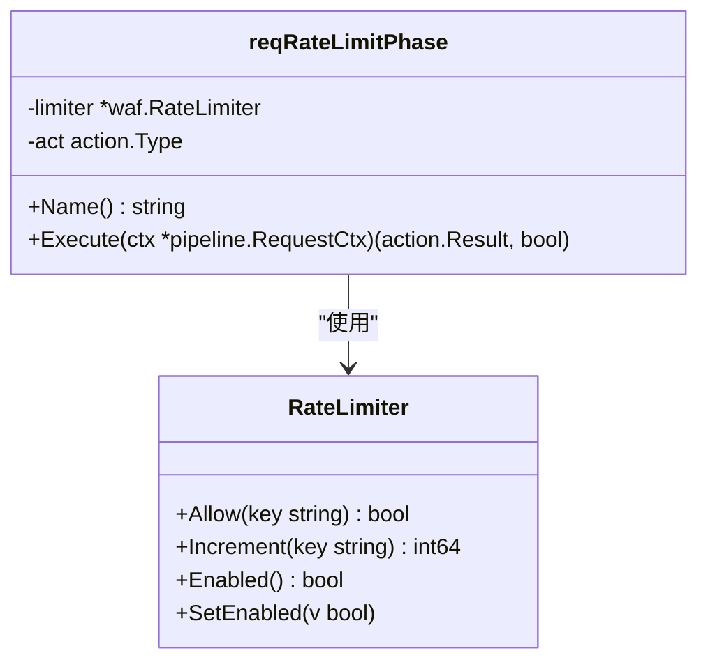

**图表来源**
- [phases.go:98-128](file://internal/core/rules/phases.go#L98-L128)
- [ratelimit.go:9-117](file://internal/waf/ratelimit.go#L9-L117)

**章节来源**
- [phases.go:109-128](file://internal/core/rules/phases.go#L109-L128)
- [ratelimit.go:48-62](file://internal/waf/ratelimit.go#L48-L62)

### OWASP 默认阶段

OWASP 默认阶段提供标准的 Web 应用安全检测：

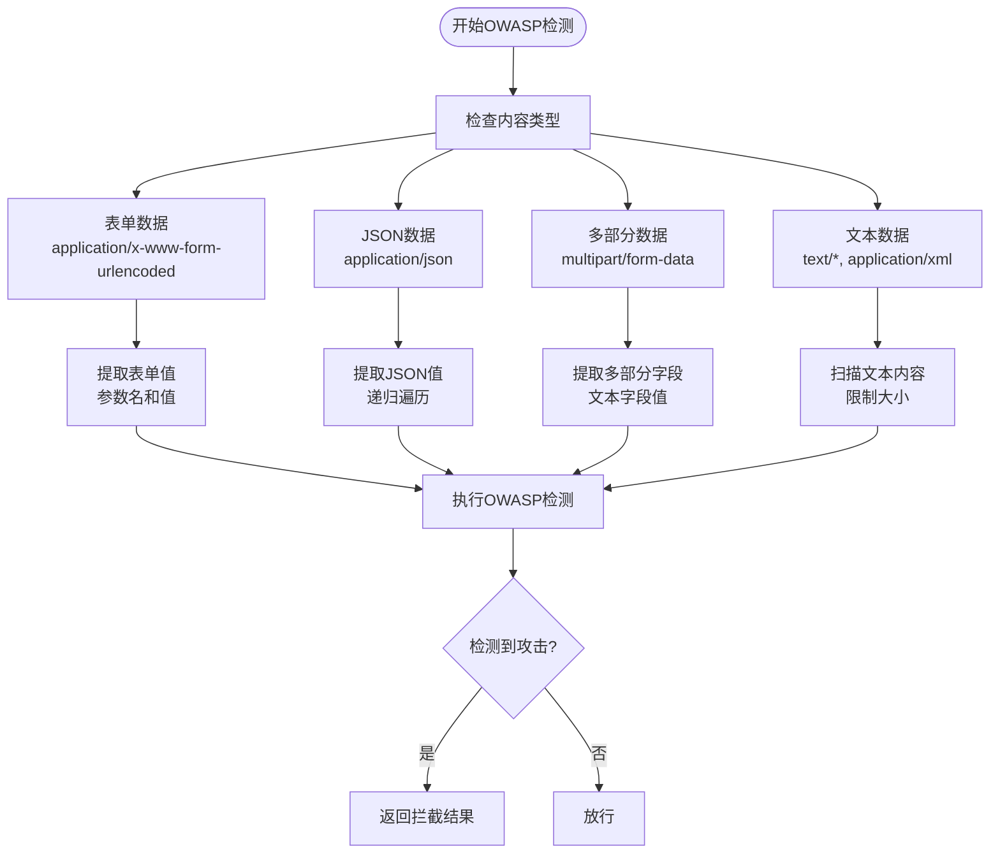

**图表来源**
- [phases.go:258-303](file://internal/core/rules/phases.go#L258-L303)

**章节来源**
- [phases.go:258-303](file://internal/core/rules/phases.go#L258-L303)

### 签名规则阶段和自定义规则阶段

这两个阶段都使用相同的执行模式，但处理不同类型的规则：

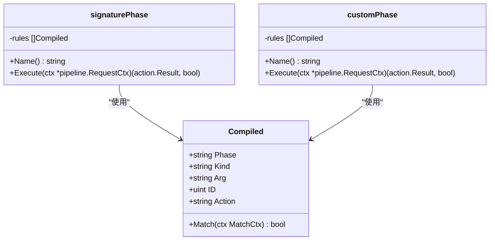

**图表来源**
- [phases.go:56-94](file://internal/core/rules/phases.go#L56-L94)

**章节来源**
- [phases.go:64-72](file://internal/core/rules/phases.go#L64-L72)
- [phases.go:85-93](file://internal/core/rules/phases.go#L85-L93)

## 依赖关系分析

处理阶段系统具有清晰的依赖层次结构：

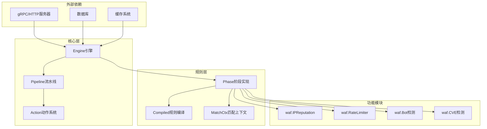

**图表来源**
- [engine.go:1-176](file://internal/core/engine/engine.go#L1-L176)
- [phases.go:1-17](file://internal/core/rules/phases.go#L1-L17)

### 关键依赖关系

1. **Engine → Pipeline**: 引擎负责创建和管理阶段流水线
2. **Pipeline → Phase**: 流水线按顺序执行各个阶段
3. **Phase → Action**: 各阶段返回标准化的动作结果
4. **Phase → waf模块**: 阶段使用各种 WAF 功能模块
5. **Engine → Snapshot**: 引擎从快照中获取运行时配置

**章节来源**
- [engine.go:15-176](file://internal/core/engine/engine.go#L15-L176)
- [pipeline.go:1-71](file://internal/core/pipeline/pipeline.go#L1-L71)

## 性能考虑

处理阶段系统在设计时充分考虑了性能优化：

### 执行效率优化

1. **短路执行**: 当遇到终止性动作（拦截或丢弃）时立即停止后续阶段执行
2. **白名单优化**: ACL 阶段的 Allow 规则可完全跳过后续所有阶段
3. **早期过滤**: IP 信誉和机器人检测等快速阶段优先执行
4. **内存复用**: 使用原子指针进行配置快照切换，避免锁竞争

### 资源管理

1. **连接池**: 流水线使用对象池减少内存分配
2. **缓存策略**: IP 信誉和速率限制器内置缓存机制
3. **清理机制**: 自动清理过期的速率限制窗口和封禁记录

### 并发安全

1. **原子操作**: 配置快照使用原子指针进行无锁切换
2. **读写分离**: 读操作不使用锁，写操作通过快照替换实现
3. **并发安全的数据结构**: 使用互斥锁保护共享状态

## 故障排除指南

### 常见问题诊断

1. **阶段未执行**: 检查阶段配置和启用状态
2. **短路问题**: 确认 ACL 规则是否意外导致短路
3. **性能问题**: 分析各阶段的执行时间和资源消耗
4. **配置冲突**: 检查多个阶段之间的配置相互影响

### 调试技巧

1. **日志记录**: 利用观察结果收集各阶段的匹配信息
2. **性能监控**: 监控各阶段的执行时间分布
3. **配置验证**: 在测试环境中验证阶段配置的有效性

**章节来源**
- [action.go:40-57](file://internal/core/action/action.go#L40-L57)
- [pipeline.go:46-70](file://internal/core/pipeline/pipeline.go#L46-L70)

## 结论

处理阶段系统为 OpenWAF 提供了强大而灵活的安全防护框架。通过模块化的阶段设计，系统能够在保证性能的同时提供多层次的安全检测。每个阶段都有明确的职责和执行逻辑，通过标准化的接口实现了良好的可扩展性和维护性。

系统的成功关键在于：
- 清晰的阶段职责划分
- 高效的执行顺序设计  
- 灵活的配置机制
- 完善的性能优化
- 可靠的错误处理

这种设计使得 OpenWAF 能够适应各种复杂的网络安全场景，同时保持良好的可维护性和扩展性。