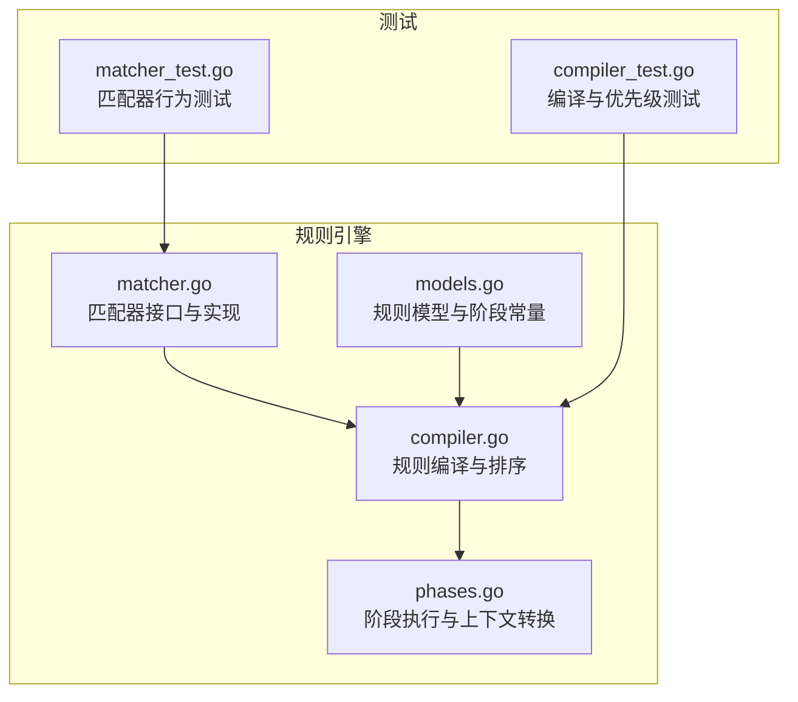
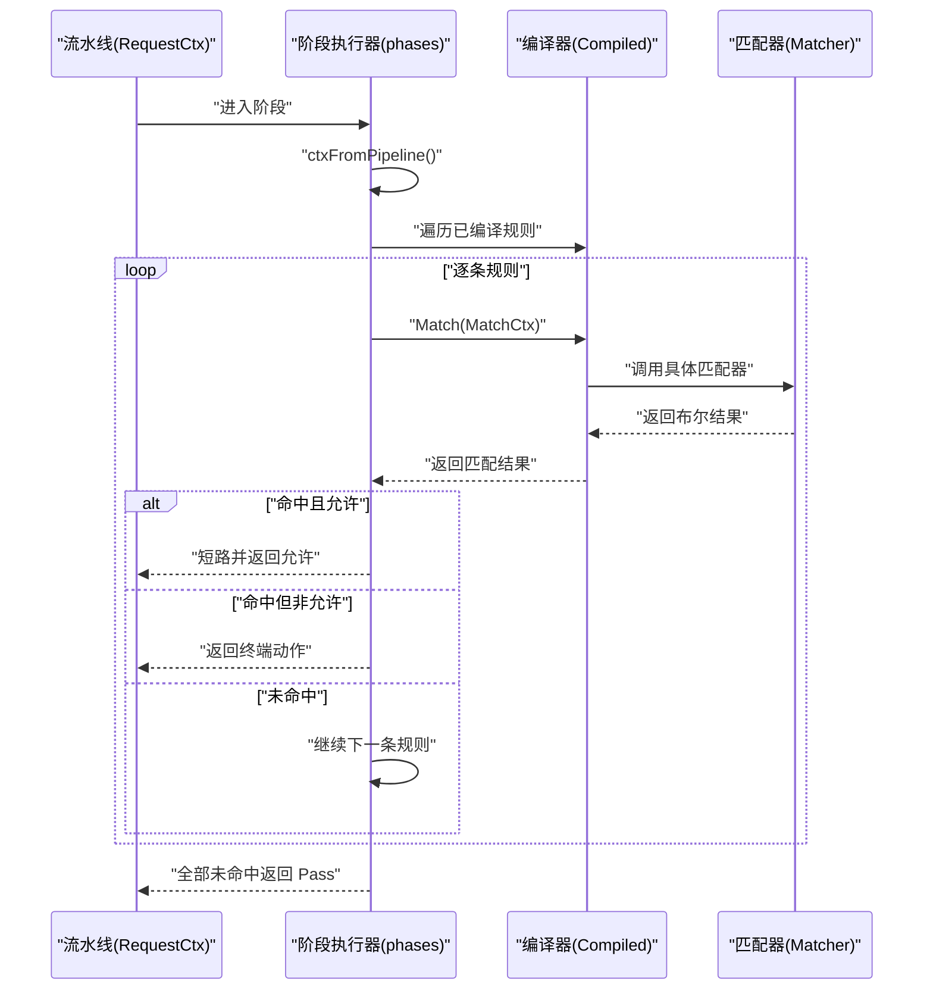
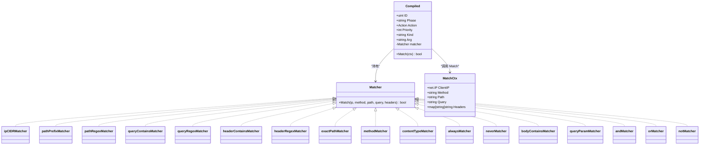
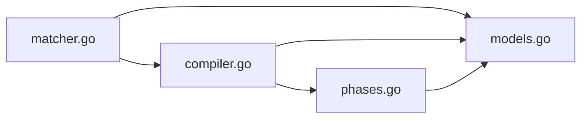

# 规则匹配器

<cite>
**本文引用的文件列表**
- [matcher.go](file://internal/core/rules/matcher.go)
- [matcher_test.go](file://internal/core/rules/matcher_test.go)
- [compiler.go](file://internal/core/rules/compiler.go)
- [compiler_test.go](file://internal/core/rules/compiler_test.go)
- [phases.go](file://internal/core/rules/phases.go)
- [models.go](file://internal/store/models.go)
</cite>

## 目录
1. [简介](#简介)
2. [项目结构](#项目结构)
3. [核心组件](#核心组件)
4. [架构总览](#架构总览)
5. [详细组件分析](#详细组件分析)
6. [依赖关系分析](#依赖关系分析)
7. [性能考量](#性能考量)
8. [故障排查指南](#故障排查指南)
9. [结论](#结论)
10. [附录](#附录)

## 简介
本文件系统性地介绍规则匹配器的实现与使用，重点覆盖：
- MatchCtx 上下文的结构与用途
- 各类匹配算法（IP 地址、路径、查询参数、头部、方法、内容类型、精确路径、正则等）
- 正则表达式的缓存与性能优化
- 匹配器在规则执行流程中的关键作用与错误处理机制
- 测试用例分析，展示不同匹配场景的处理效果

## 项目结构
规则匹配器位于 internal/core/rules 目录，围绕 Matcher 接口与编译器展开，配合阶段执行器完成请求生命周期内的规则匹配与动作执行。

图表来源
- [matcher.go:1-343](file://internal/core/rules/matcher.go#L1-L343)
- [compiler.go:1-83](file://internal/core/rules/compiler.go#L1-L83)
- [phases.go:19-569](file://internal/core/rules/phases.go#L19-L569)
- [models.go:44-92](file://internal/store/models.go#L44-L92)
- [matcher_test.go:1-221](file://internal/core/rules/matcher_test.go#L1-L221)
- [compiler_test.go:1-88](file://internal/core/rules/compiler_test.go#L1-L88)

章节来源
- [matcher.go:1-343](file://internal/core/rules/matcher.go#L1-L343)
- [compiler.go:1-83](file://internal/core/rules/compiler.go#L1-L83)
- [phases.go:19-569](file://internal/core/rules/phases.go#L19-L569)
- [models.go:44-92](file://internal/store/models.go#L44-L92)

## 核心组件
- Matcher 接口：统一的匹配抽象，接收客户端 IP、HTTP 方法、路径、查询字符串、请求头映射，返回布尔值。
- 具体匹配器：包含 IP CIDR、路径前缀、路径正则、查询包含、查询正则、头部包含、头部正则、精确路径、方法、内容类型、用户代理、查询参数、主体包含、复合条件等。
- 编译器：将持久化规则解析为可执行的 Compiled 结构，并按优先级排序；支持简单 DSL 与 JSON 复合条件。
- MatchCtx：阶段执行时从流水线上下文转换而来的只读请求数据视图。
- 阶段执行器：按阶段顺序遍历已编译规则，命中后根据动作类型决定是否短路或继续。

章节来源
- [matcher.go:11-14](file://internal/core/rules/matcher.go#L11-L14)
- [compiler.go:11-25](file://internal/core/rules/compiler.go#L11-L25)
- [phases.go:19-30](file://internal/core/rules/phases.go#L19-L30)

## 架构总览
规则匹配器在请求生命周期中扮演“条件判断”的角色，贯穿 ACL、签名、自定义等阶段。编译器负责将规则 DSL/JSON 转换为具体匹配器实例，阶段执行器在每次请求到来时，将流水线上下文转换为 MatchCtx 并依次尝试匹配。

图表来源
- [phases.go:28-52](file://internal/core/rules/phases.go#L28-L52)
- [compiler.go:22-25](file://internal/core/rules/compiler.go#L22-L25)
- [matcher.go:12-14](file://internal/core/rules/matcher.go#L12-L14)

## 详细组件分析

### MatchCtx 上下文
- 字段：ClientIP、Method、Path、Query、Headers
- 用途：作为匹配器的输入源，避免直接依赖底层流水线对象，便于测试与复用
- 来源：由阶段执行器从 RequestCtx 转换而来

章节来源
- [phases.go:19-30](file://internal/core/rules/phases.go#L19-L30)

### 匹配器接口与实现
- 接口：Match(ip, method, path, query, headers) bool
- 基础匹配器：
  - IP 地址匹配：支持 CIDR 与单个 IP，自动推断 IPv4/IPv6 子网掩码
  - 路径匹配：前缀匹配与正则匹配
  - 查询字符串匹配：包含匹配与正则匹配
  - 头部匹配：包含匹配与正则匹配（大小写不敏感键名）
  - 精确路径匹配：严格相等
  - 方法匹配：大小写不敏感
  - 内容类型匹配：检查 Content-Type 是否包含指定子串
  - 用户代理匹配：快捷方式，等价于头部匹配
  - 查询参数匹配：解析查询串，支持仅存在性或包含值
  - 主体包含匹配：占位符，实际检查在请求上下文中进行
  - 复合条件：AND/OR/NOT 组合，支持 JSON 表达式

章节来源
- [matcher.go:12-14](file://internal/core/rules/matcher.go#L12-L14)
- [matcher.go:48-164](file://internal/core/rules/matcher.go#L48-L164)
- [matcher.go:167-261](file://internal/core/rules/matcher.go#L167-L261)

### 编译器与规则排序
- 将 Rule 模型转换为 Compiled，提取 kind/arg，构建具体匹配器
- 支持简单 DSL 与 JSON 复合条件
- 按优先级升序、ID 升序排序，确保高优先级先评估

章节来源
- [compiler.go:27-55](file://internal/core/rules/compiler.go#L27-L55)
- [compiler.go:57-82](file://internal/core/rules/compiler.go#L57-L82)

### 阶段执行器
- ACL：命中允许即短路，否则按动作类型决定是否终止
- Signature/Custom：命中即返回终端动作
- 提供 ctxFromPipeline 将 RequestCtx 转换为 MatchCtx

章节来源
- [phases.go:34-94](file://internal/core/rules/phases.go#L34-L94)
- [phases.go:28-30](file://internal/core/rules/phases.go#L28-L30)

### 类关系图（代码级）

图表来源
- [matcher.go:12-14](file://internal/core/rules/matcher.go#L12-L14)
- [matcher.go:48-164](file://internal/core/rules/matcher.go#L48-L164)
- [matcher.go:167-261](file://internal/core/rules/matcher.go#L167-L261)
- [compiler.go:11-25](file://internal/core/rules/compiler.go#L11-L25)
- [phases.go:19-30](file://internal/core/rules/phases.go#L19-L30)

### 匹配算法详解

#### IP 地址匹配
- 支持 block_ip/allow_ip
- 自动解析 CIDR 或单个 IP，并根据版本选择合适的掩码长度
- 无效输入返回永不匹配

章节来源
- [matcher.go:169-185](file://internal/core/rules/matcher.go#L169-L185)

#### 路径匹配
- block_path：前缀匹配
- block_path_regex：正则匹配，使用缓存编译
- block_path_exact：精确路径匹配

章节来源
- [matcher.go:187-195](file://internal/core/rules/matcher.go#L187-L195)
- [matcher.go:103-107](file://internal/core/rules/matcher.go#L103-L107)

#### 查询参数匹配
- block_query_contains：查询字符串包含
- block_query_regex：查询字符串正则
- query_param：解析形如 param:value 的参数匹配

章节来源
- [matcher.go:197-205](file://internal/core/rules/matcher.go#L197-L205)
- [matcher.go:143-164](file://internal/core/rules/matcher.go#L143-L164)

#### 头部匹配
- block_header：头部名称包含子串（大小写不敏感）
- block_header_regex：头部名称正则匹配
- block_user_agent：用户代理快捷方式
- block_user_agent_regex：用户代理正则快捷方式
- block_content_type：内容类型包含匹配

章节来源
- [matcher.go:207-237](file://internal/core/rules/matcher.go#L207-L237)
- [matcher.go:115-124](file://internal/core/rules/matcher.go#L115-L124)

#### 方法与内容类型匹配
- block_method：HTTP 方法大小写不敏感匹配
- block_content_type：Content-Type 包含匹配

章节来源
- [matcher.go:222-226](file://internal/core/rules/matcher.go#L222-L226)
- [matcher.go:109-113](file://internal/core/rules/matcher.go#L109-L113)

#### 主体包含匹配
- body_contains：占位符，实际检查在请求上下文中进行

章节来源
- [matcher.go:248-249](file://internal/core/rules/matcher.go#L248-L249)
- [matcher.go:134-141](file://internal/core/rules/matcher.go#L134-L141)

#### 复合条件
- JSON 格式：{"op":"and|or|not","children":[...]} 或 {"kind":"...","arg":"..."}
- AND/OR/NOT 递归构建子匹配器

章节来源
- [matcher.go:299-342](file://internal/core/rules/matcher.go#L299-L342)

### 正则表达式匹配的优化策略与性能考虑
- 缓存策略：全局正则编译缓存，按模式键存储，读多写少场景下显著降低编译开销
- 并发安全：读写锁保护缓存访问，避免频繁编译
- 错误处理：非法正则返回永不匹配，保证稳定性

章节来源
- [matcher.go:271-296](file://internal/core/rules/matcher.go#L271-L296)

### 匹配器在规则执行过程中的关键作用与错误处理机制
- 关键作用：在每个阶段按顺序评估规则，命中后根据动作类型决定是否短路或继续
- 错误处理：非法 DSL/JSON、无效正则、无效 IP/CIDR 等均以“永不匹配”兜底，避免规则误判

章节来源
- [phases.go:34-94](file://internal/core/rules/phases.go#L34-L94)
- [matcher.go:167-185](file://internal/core/rules/matcher.go#L167-L185)
- [matcher.go:190-195](file://internal/core/rules/matcher.go#L190-L195)
- [matcher.go:201-205](file://internal/core/rules/matcher.go#L201-L205)
- [matcher.go:213-217](file://internal/core/rules/matcher.go#L213-L217)

## 依赖关系分析
- 编译器依赖规则模型与动作类型，输出 Compiled 列表
- 阶段执行器依赖编译后的规则，通过 MatchCtx 进行匹配
- 匹配器实现依赖标准库（net、regexp、strings），并维护正则缓存

图表来源
- [matcher.go:1-343](file://internal/core/rules/matcher.go#L1-L343)
- [compiler.go:1-83](file://internal/core/rules/compiler.go#L1-L83)
- [phases.go:19-569](file://internal/core/rules/phases.go#L19-L569)
- [models.go:44-92](file://internal/store/models.go#L44-L92)

## 性能考量
- 正则缓存：避免重复编译，提升高频正则匹配性能
- 优先级排序：高优先级规则先评估，减少后续匹配成本
- 字符串操作：前缀匹配、包含匹配、大小写不敏感比较均为 O(n) 级别
- 复合条件：短路求值（AND/OR）减少不必要的子匹配

章节来源
- [matcher.go:271-296](file://internal/core/rules/matcher.go#L271-L296)
- [compiler.go:48-54](file://internal/core/rules/compiler.go#L48-L54)
- [matcher.go:20-37](file://internal/core/rules/matcher.go#L20-L37)

## 故障排查指南
- 规则不生效
  - 检查规则是否启用、阶段是否正确、优先级是否被更高优先级覆盖
  - 使用编译测试验证规则解析与匹配行为
- 正则匹配异常
  - 确认正则语法有效；非法正则会被视为永不匹配
  - 检查正则缓存是否命中，必要时重启服务清理缓存
- IP/CIDR 解析失败
  - 输入格式不合法时会返回永不匹配，确认地址格式正确
- 头部匹配不准确
  - 注意大小写不敏感键名匹配；确认请求头键名是否符合预期

章节来源
- [compiler_test.go:11-27](file://internal/core/rules/compiler_test.go#L11-L27)
- [compiler_test.go:48-62](file://internal/core/rules/compiler_test.go#L48-L62)
- [matcher_test.go:105-110](file://internal/core/rules/matcher_test.go#L105-L110)
- [matcher_test.go:188-207](file://internal/core/rules/matcher_test.go#L188-L207)

## 结论
规则匹配器通过清晰的接口设计与高效的实现，提供了灵活且高性能的规则匹配能力。其正则缓存、优先级排序与复合条件支持，使得复杂业务规则得以简洁表达并稳定执行。配合阶段执行器，规则在请求生命周期中发挥关键作用，既保证了安全性，也兼顾了性能与可维护性。

## 附录

### 测试用例分析要点
- 复合条件 AND/OR/NOT：验证逻辑组合与短路行为
- 精确路径匹配：严格相等匹配
- 方法匹配：大小写不敏感
- 内容类型匹配：Content-Type 包含匹配
- 用户代理匹配：包含与正则两种形式
- 正则缓存一致性：同一模式多次编译应返回相同实例

章节来源
- [matcher_test.go:30-66](file://internal/core/rules/matcher_test.go#L30-L66)
- [matcher_test.go:112-129](file://internal/core/rules/matcher_test.go#L112-L129)
- [matcher_test.go:131-148](file://internal/core/rules/matcher_test.go#L131-L148)
- [matcher_test.go:150-167](file://internal/core/rules/matcher_test.go#L150-L167)
- [matcher_test.go:169-186](file://internal/core/rules/matcher_test.go#L169-L186)
- [matcher_test.go:188-207](file://internal/core/rules/matcher_test.go#L188-L207)
- [matcher_test.go:209-220](file://internal/core/rules/matcher_test.go#L209-L220)