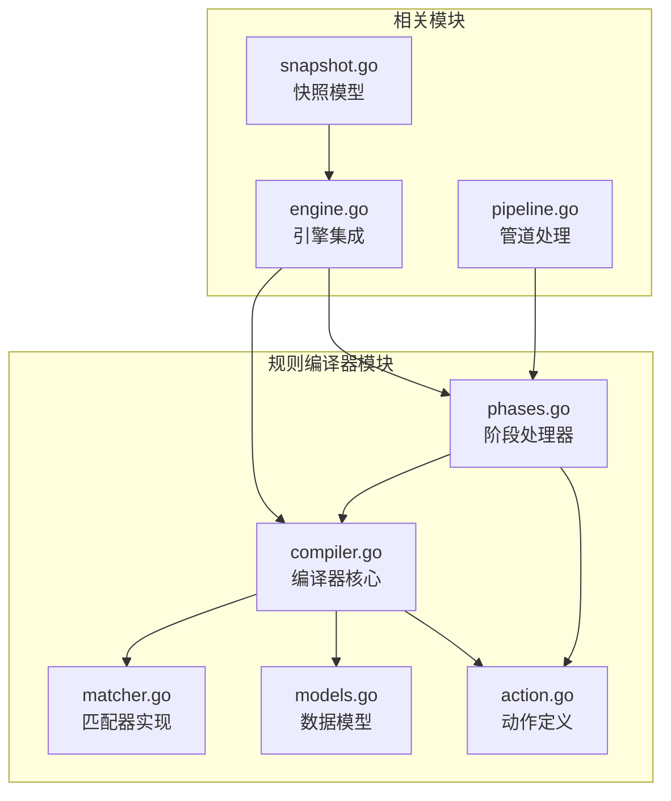
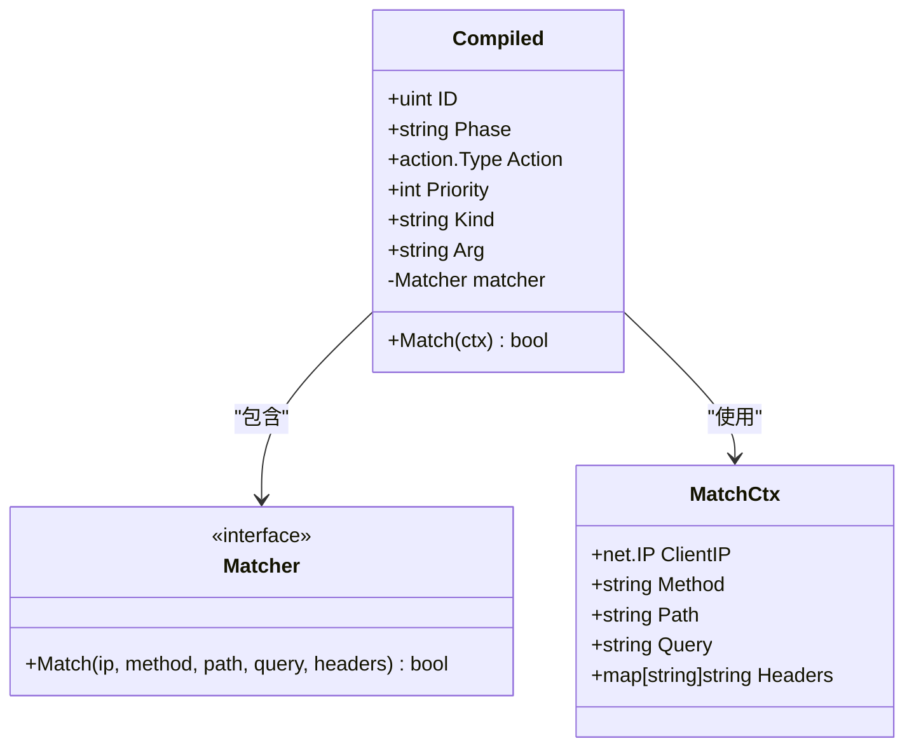
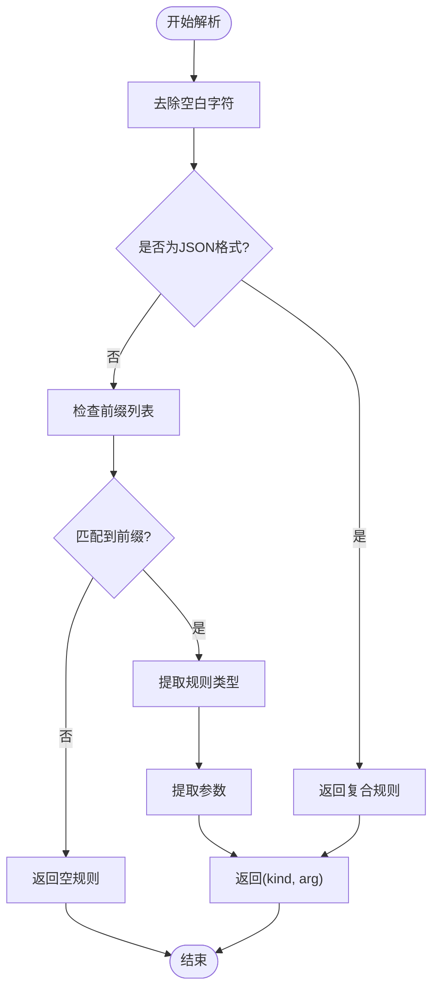
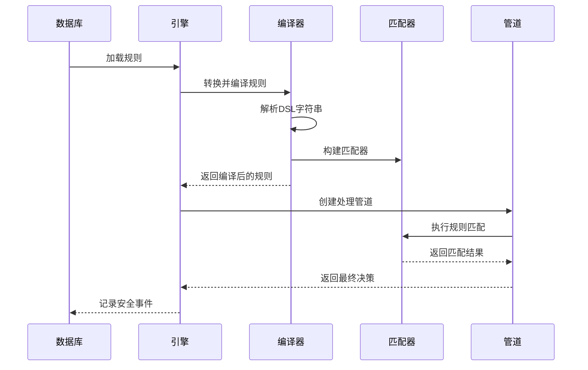
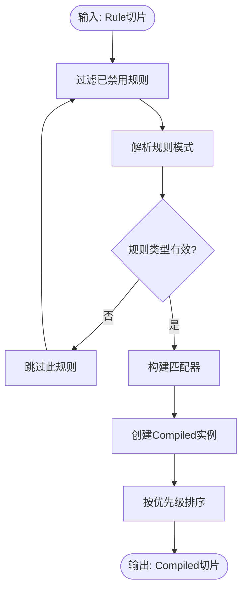
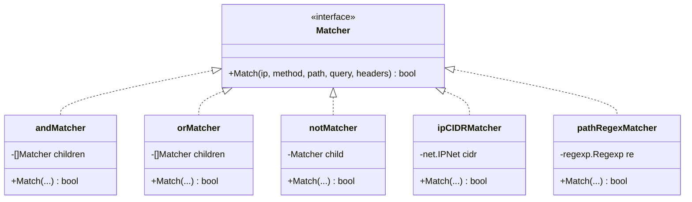
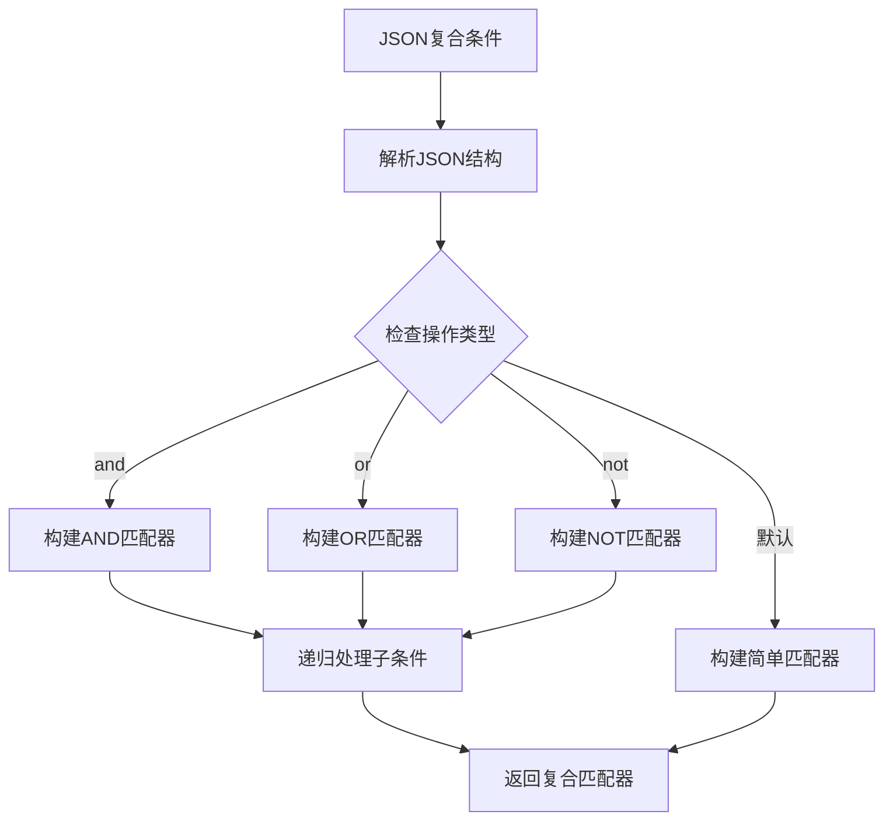
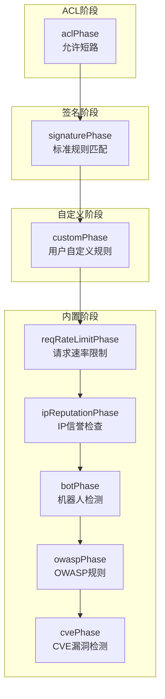
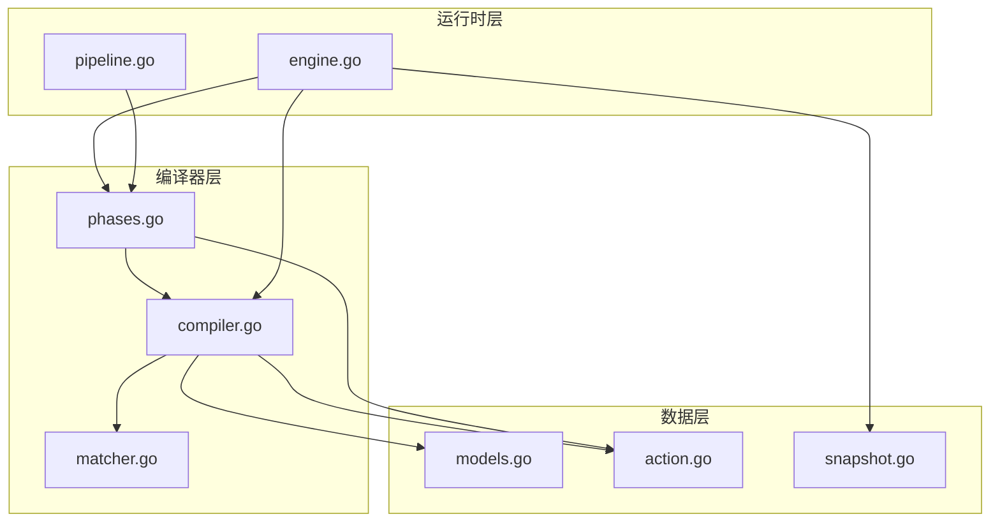
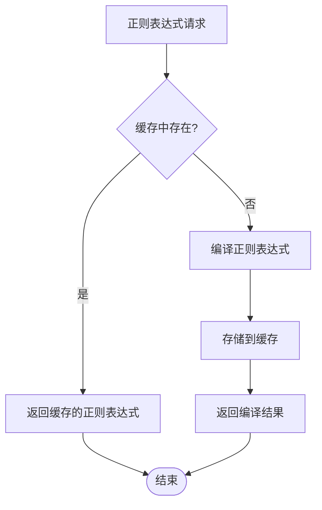

# 规则编译器

<cite>
**本文档引用的文件**
- [compiler.go](file://internal/core/rules/compiler.go)
- [compiler_test.go](file://internal/core/rules/compiler_test.go)
- [matcher.go](file://internal/core/rules/matcher.go)
- [matcher_test.go](file://internal/core/rules/matcher_test.go)
- [phases.go](file://internal/core/rules/phases.go)
- [models.go](file://internal/store/models.go)
- [action.go](file://internal/core/action/action.go)
- [engine.go](file://internal/core/engine/engine.go)
- [snapshot.go](file://internal/snapshot/snapshot.go)
- [pipeline.go](file://internal/core/pipeline/pipeline.go)
</cite>

## 目录
1. [简介](#简介)
2. [项目结构](#项目结构)
3. [核心组件](#核心组件)
4. [架构概览](#架构概览)
5. [详细组件分析](#详细组件分析)
6. [依赖关系分析](#依赖关系分析)
7. [性能考虑](#性能考虑)
8. [故障排除指南](#故障排除指南)
9. [结论](#结论)

## 简介

规则编译器是 My-OpenWaf 核心引擎的重要组成部分，负责将持久化的规则模型转换为运行时就绪的规则实例。该编译器实现了从 DSL 字符串到可执行匹配器的完整转换过程，支持多种规则模式和复杂的复合条件。

编译器的主要职责包括：
- 解析 DSL 字符串规则并提取模式类型和参数
- 构建高效的预编译匹配器
- 实现规则排序和优先级处理
- 提供运行时快速匹配能力

## 项目结构

规则编译器位于 `internal/core/rules/` 目录下，包含以下核心文件：

**图表来源**
- [compiler.go:1-83](file://internal/core/rules/compiler.go#L1-L83)
- [matcher.go:1-343](file://internal/core/rules/matcher.go#L1-L343)
- [phases.go:1-569](file://internal/core/rules/phases.go#L1-L569)

**章节来源**
- [compiler.go:1-83](file://internal/core/rules/compiler.go#L1-L83)
- [matcher.go:1-343](file://internal/core/rules/matcher.go#L1-L343)
- [phases.go:1-569](file://internal/core/rules/phases.go#L1-L569)

## 核心组件

### 编译器核心结构

编译器的核心是一个简洁而高效的结构体，负责将持久化规则转换为运行时可用的规则实例：

**图表来源**
- [compiler.go:11-25](file://internal/core/rules/compiler.go#L11-L25)
- [matcher.go:11-14](file://internal/core/rules/matcher.go#L11-L14)
- [phases.go:19-26](file://internal/core/rules/phases.go#L19-L26)

### 规则解析机制

编译器实现了智能的 DSL 解析机制，支持多种规则模式：

**图表来源**
- [compiler.go:57-82](file://internal/core/rules/compiler.go#L57-L82)

**章节来源**
- [compiler.go:11-55](file://internal/core/rules/compiler.go#L11-L55)
- [compiler.go:57-82](file://internal/core/rules/compiler.go#L57-L82)

## 架构概览

规则编译器在整个 WAF 系统中扮演着关键角色，连接持久化存储和运行时执行：

**图表来源**
- [engine.go:83-129](file://internal/core/engine/engine.go#L83-L129)
- [compiler.go:27-55](file://internal/core/rules/compiler.go#L27-L55)
- [phases.go:40-52](file://internal/core/rules/phases.go#L40-L52)

## 详细组件分析

### 编译器实现详解

编译器的核心功能由 `Compile` 函数实现，该函数负责完整的转换流程：

**图表来源**
- [compiler.go:27-55](file://internal/core/rules/compiler.go#L27-L55)

#### 规则排序策略

编译器实现了稳定的排序策略，确保规则执行的确定性：

1. **优先级排序**：主要依据 `Priority` 字段进行升序排列
2. **ID 确保**：当优先级相同时，按 `ID` 进行升序排列
3. **稳定性保证**：相同的输入总是产生相同的输出顺序

这种排序策略确保了：
- 高优先级规则先于低优先级规则执行
- 同优先级规则按创建顺序执行
- 可预测的规则执行行为

**章节来源**
- [compiler.go:27-55](file://internal/core/rules/compiler.go#L27-L55)

### 匹配器系统设计

匹配器系统采用接口抽象和具体实现分离的设计模式：

**图表来源**
- [matcher.go:11-14](file://internal/core/rules/matcher.go#L11-L14)
- [matcher.go:18-44](file://internal/core/rules/matcher.go#L18-L44)
- [matcher.go:48-64](file://internal/core/rules/matcher.go#L48-L64)

#### 复合匹配器实现

编译器支持复杂的复合条件，通过 JSON 格式定义逻辑关系：

**图表来源**
- [matcher.go:298-342](file://internal/core/rules/matcher.go#L298-L342)

**章节来源**
- [matcher.go:166-261](file://internal/core/rules/matcher.go#L166-L261)
- [matcher.go:298-342](file://internal/core/rules/matcher.go#L298-L342)

### 规则阶段处理器

编译器将规则分配到不同的处理阶段，每个阶段都有特定的执行逻辑：

**图表来源**
- [phases.go:34-94](file://internal/core/rules/phases.go#L34-L94)
- [phases.go:96-170](file://internal/core/rules/phases.go#L96-L170)

**章节来源**
- [phases.go:34-303](file://internal/core/rules/phases.go#L34-L303)

## 依赖关系分析

规则编译器与系统其他组件存在紧密的依赖关系：

**图表来源**
- [compiler.go:3-9](file://internal/core/rules/compiler.go#L3-L9)
- [engine.go:3-13](file://internal/core/engine/engine.go#L3-L13)

### 关键依赖关系

1. **存储模型依赖**：编译器依赖 `store.Rule` 模型获取规则数据
2. **动作类型依赖**：编译器使用 `action.Type` 定义规则动作
3. **匹配器依赖**：编译器构建具体的匹配器实例
4. **引擎集成**：编译器结果被引擎用于请求处理

**章节来源**
- [compiler.go:3-9](file://internal/core/rules/compiler.go#L3-L9)
- [engine.go:157-175](file://internal/core/engine/engine.go#L157-L175)

## 性能考虑

规则编译器在设计时充分考虑了性能优化：

### 正则表达式缓存

编译器实现了正则表达式缓存机制，避免重复编译相同的正则模式：

**图表来源**
- [matcher.go:271-296](file://internal/core/rules/matcher.go#L271-L296)

### 内存优化策略

1. **零拷贝设计**：匹配器直接使用原始字符串进行比较
2. **共享资源**：正则表达式在进程内共享
3. **紧凑数据结构**：Compiled 结构体只包含必要字段

### 时间复杂度分析

- **编译时间复杂度**：O(n*m)，其中 n 是规则数量，m 是平均规则复杂度
- **匹配时间复杂度**：O(k)，其中 k 是匹配器数量
- **排序时间复杂度**：O(n log n)

## 故障排除指南

### 常见问题及解决方案

#### 规则不生效

**症状**：规则定义正确但不触发匹配

**可能原因**：
1. 规则未启用（Enabled=false）
2. 规则模式解析失败
3. 匹配器构建错误

**排查步骤**：
1. 检查规则的 Enabled 字段
2. 验证 DSL 模式的语法正确性
3. 确认参数格式符合要求

#### 性能问题

**症状**：规则匹配响应缓慢

**可能原因**：
1. 正则表达式过于复杂
2. 规则数量过多
3. 缓存未生效

**优化建议**：
1. 简化正则表达式模式
2. 合理设置规则优先级
3. 使用更精确的匹配器类型

#### 内存泄漏

**症状**：长时间运行后内存使用持续增长

**排查方法**：
1. 检查正则表达式缓存大小
2. 确认匹配器生命周期管理
3. 监控编译器实例数量

**章节来源**
- [compiler_test.go:11-87](file://internal/core/rules/compiler_test.go#L11-L87)
- [matcher_test.go:10-220](file://internal/core/rules/matcher_test.go#L10-L220)

## 结论

规则编译器是 My-OpenWaf 的核心组件，它成功地将灵活的 DSL 规则语言转换为高性能的运行时匹配器。通过精心设计的架构和优化策略，编译器实现了：

1. **高可扩展性**：支持多种规则模式和复合条件
2. **高性能执行**：预编译匹配器提供快速匹配能力
3. **稳定排序**：确保规则执行的确定性和可预测性
4. **内存效率**：通过缓存和共享资源优化内存使用

编译器的设计体现了现代 Web 应用防护系统的核心需求：既要保持规则定义的灵活性，又要确保运行时的高性能。通过合理的抽象和优化策略，规则编译器为整个 WAF 系统提供了坚实的基础。

在未来的发展中，编译器可以进一步优化的方向包括：
- 更智能的规则索引和查询优化
- 动态规则热更新支持
- 更精细的性能监控和调优工具
- 支持更多高级匹配模式和条件组合