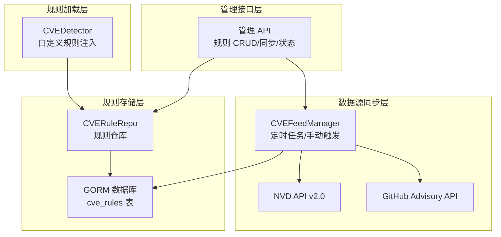
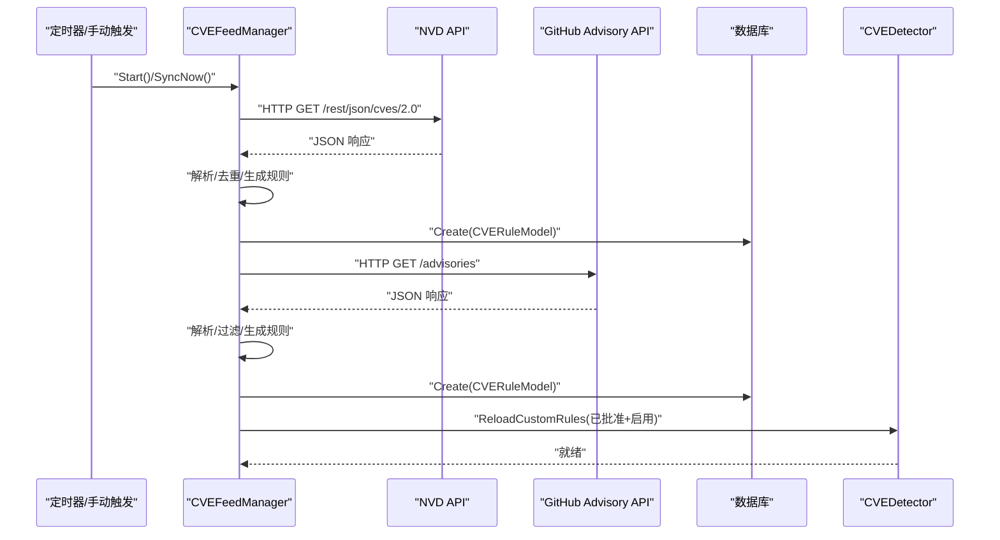
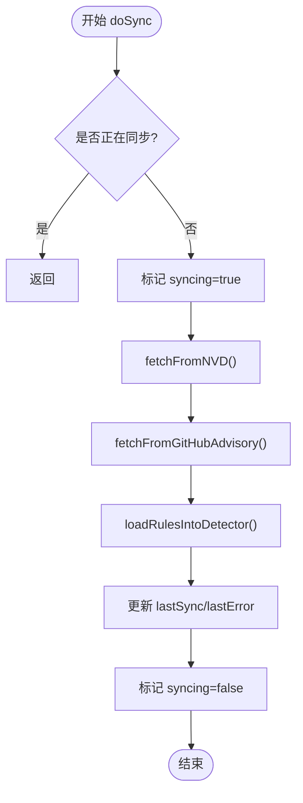
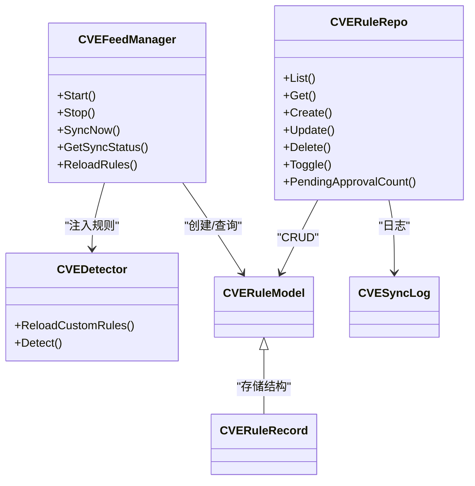

> [返回 安全防护功能](../安全防护功能.md)

# CVE 数据源同步

<cite>
**本文引用的文件**
- [feed.go](file://internal/waf/cve/feed.go)
- [detector.go](file://internal/waf/cve/detector.go)
- [cve.go](file://internal/store/cve.go)
- [cve_rule.go](file://internal/store/repository/cve_rule.go)
- [cve.go](file://internal/admin/detect/cve.go)
- [cve_rules.go](file://internal/admin/detect/cve_rules.go)
- [helpers.go](file://internal/admin/shared/helpers.go)
- [config.go](file://internal/core/config.go)
- [server.go](file://internal/app/server.go)
- [api.ts](file://frontend/lib/api.ts)
</cite>

## 目录
1. [简介](#简介)
2. [项目结构](#项目结构)
3. [核心组件](#核心组件)
4. [架构总览](#架构总览)
5. [详细组件分析](#详细组件分析)
6. [依赖关系分析](#依赖关系分析)
7. [性能考量](#性能考量)
8. [故障排除指南](#故障排除指南)
9. [结论](#结论)
10. [附录](#附录)

## 简介
本文件面向 CVE 数据源同步系统，围绕 NVD API 与 GitHub Advisory API 的集成实现进行深入技术说明。内容涵盖数据获取、解析、转换与存储的完整流程，解释增量同步策略与全量同步触发条件，提供数据质量控制机制（验证、去重、异常处理），说明同步频率配置、错误重试与超时处理策略，并给出数据源配置选项与故障排除指南，帮助读者理解如何处理 API 限制与网络异常。

## 项目结构
该系统位于 internal/waf/cve 下，采用分层设计：
- 数据源同步层：负责定时拉取 NVD 与 GitHub Advisory 的漏洞信息，生成规则并写入数据库。
- 规则加载层：将数据库中已批准且启用的规则注入到 CVEDetector，供请求检测使用。
- 管理接口层：提供规则列表、启用/禁用、批量更新、立即同步、状态查询等 API。
- 配置层：通过环境变量控制是否启用 CVE 功能、同步间隔、NVD API Key、自动审批等。

图表来源
- [feed.go:83-100](file://internal/waf/cve/feed.go#L83-L100)
- [cve.go:16-29](file://internal/store/cve.go#L16-L29)
- [cve_rule.go:10-14](file://internal/store/repository/cve_rule.go#L10-L14)
- [detector.go:159-167](file://internal/waf/cve/detector.go#L159-L167)
- [cve.go:215-227](file://internal/admin/detect/cve.go#L215-L227)

章节来源
- [feed.go:16-30](file://internal/waf/cve/feed.go#L16-L30)
- [cve.go:9-27](file://internal/store/cve.go#L9-L27)
- [cve_rule.go:10-14](file://internal/store/repository/cve_rule.go#L10-L14)
- [detector.go:159-167](file://internal/waf/cve/detector.go#L159-L167)
- [cve.go:215-227](file://internal/admin/detect/cve.go#L215-L227)

## 核心组件
- CVEFeedManager：后台定时同步器，负责拉取 NVD 与 GitHub Advisory 数据，生成规则并写入数据库，同时将已批准规则注入 CVEDetector。
- CVEDetector：检测引擎，聚合通用与语言特异（PHP/Java/Node）子检测器，并加载自定义规则参与实时检测。
- CVERuleModel/CVERuleRecord：规则数据模型，包含 CVE 编号、分类、目标、严重性、动作、描述、来源、CVSS 分数、CWE 类型等字段。
- CVERuleRepo：规则仓库，提供列表、查询、创建、更新、删除、启用切换、待审统计等操作。
- 管理 API：提供规则管理与同步控制的 HTTP 接口，支持立即同步与状态查询。

章节来源
- [feed.go:16-30](file://internal/waf/cve/feed.go#L16-L30)
- [detector.go:12-22](file://internal/waf/cve/detector.go#L12-L22)
- [cve.go:9-27](file://internal/store/cve.go#L9-L27)
- [cve_rule.go:10-14](file://internal/store/repository/cve_rule.go#L10-L14)
- [cve.go:215-227](file://internal/admin/detect/cve.go#L215-L227)

## 架构总览
系统以 CVEFeedManager 为核心，周期性或手动触发同步，将外部数据映射为内部规则模型并持久化。CVEDetector 在启动时与每次同步后重新加载规则，确保检测逻辑与数据库状态一致。

图表来源
- [feed.go:129-143](file://internal/waf/cve/feed.go#L129-L143)
- [feed.go:145-188](file://internal/waf/cve/feed.go#L145-L188)
- [feed.go:253-302](file://internal/waf/cve/feed.go#L253-L302)
- [feed.go:381-459](file://internal/waf/cve/feed.go#L381-L459)
- [detector.go:452-466](file://internal/waf/cve/detector.go#L452-L466)

## 详细组件分析

### CVEFeedManager：数据源同步与规则生成
- 启动与生命周期
  - 自动迁移规则表，启动时加载现有规则到检测器。
  - 若 feedEnabled=false，则跳过后台循环，仅支持手动同步。
  - 提供 Stop() 关闭后台循环。
- 同步策略
  - 定时同步：基于 syncInterval 的 ticker 循环。
  - 手动同步：SyncNow() 阻塞执行一次完整同步。
  - 并发保护：doSync() 内部通过互斥锁防止并发重复执行。
- 数据源集成
  - NVD API v2.0：按最近 24 小时发布日期范围拉取，关键字限定为 web application，每页 50 条。
  - GitHub Advisory API：列出 reviewed 类型，按更新时间倒序，筛选 npm/composer/maven/pip/go 等生态。
- 数据解析与转换
  - NVD：提取描述、CVSS v3.1/v3.0 分数、CWE 列表，生成规则并设定严重性等级。
  - GitHub：提取 CVE 编号、描述、CVSS 分数、CWE 列表，过滤空 CVE 的记录。
- 去重与写入
  - 按 CVEID + 来源(source) 去重，避免重复写入。
  - 自动生成规则时，若 autoApprove=true 则直接批准并启用。
- 规则注入
  - 每次同步后，从数据库加载 enabled=true 且 approved=true 的规则，注入 CVEDetector。

图表来源
- [feed.go:145-188](file://internal/waf/cve/feed.go#L145-L188)
- [feed.go:190-212](file://internal/waf/cve/feed.go#L190-L212)

章节来源
- [feed.go:83-100](file://internal/waf/cve/feed.go#L83-L100)
- [feed.go:129-143](file://internal/waf/cve/feed.go#L129-L143)
- [feed.go:145-188](file://internal/waf/cve/feed.go#L145-L188)
- [feed.go:190-212](file://internal/waf/cve/feed.go#L190-L212)

### NVD API 集成细节
- 请求参数
  - 时间窗口：最近 24 小时，UTC。
  - 关键字：web application。
  - 结果数量：每页 50。
- 请求头
  - 若配置了 NVD API Key，则添加 apiKey 头。
- 响应处理
  - 仅接受 200 OK；非 200 返回读取前 512 字节错误体并报错。
  - 限制响应体大小为 5MB，防止异常大包。
  - 解析 vulnerabilities 数组，逐条处理。
- 规则生成
  - 描述优先取英文，否则取第一条。
  - CVSS 优先取 v3.1，其次 v3.0。
  - CWE 类型提取首个以 CWE- 开头的描述。
  - 通过 generateRule 映射到通用规则模板，设定严重性等级。

章节来源
- [feed.go:253-302](file://internal/waf/cve/feed.go#L253-L302)
- [feed.go:304-349](file://internal/waf/cve/feed.go#L304-L349)
- [feed.go:461-491](file://internal/waf/cve/feed.go#L461-L491)

### GitHub Advisory API 集成细节
- 请求参数
  - 类型：reviewed。
  - 分页：per_page=30。
  - 排序：按 updated 倒序。
- 生态过滤
  - 仅保留 npm、composer、maven、pip、go 等 Web 相关生态。
- 去重与写入
  - 仅当存在 CVE 编号且来源为 github 时才写入。
  - 自动批准与启用取决于 autoApprove 配置。
- 规则生成
  - 使用描述与 CVSS 分数生成规则，CWE 类型取首个条目。

章节来源
- [feed.go:381-459](file://internal/waf/cve/feed.go#L381-L459)
- [feed.go:461-491](file://internal/waf/cve/feed.go#L461-L491)

### 规则模型与存储
- CVERuleModel 字段
  - 标识：ID、CVEID、Category、Pattern、Target、Severity、Action、Enabled、Description、Source、Approved、CVSSScore、CWEType。
  - 索引：CVEID、Source 等。
- CVERuleRecord
  - 与前端交互的记录结构，包含同步日志字段。
- CVERuleRepo
  - 提供分页列表、查询、创建、更新、删除、启用切换、待审统计等。
- CVESyncLog
  - 记录每次同步的来源、状态、新增规则数、错误信息、起止时间。

章节来源
- [cve.go:9-27](file://internal/store/cve.go#L9-L27)
- [cve_rule.go:16-77](file://internal/store/repository/cve_rule.go#L16-L77)
- [cve.go:31-40](file://internal/store/cve.go#L31-L40)

### CVEDetector：规则注入与检测
- 规则注入
  - ReloadCustomRules：将数据库中已批准且启用的规则编译为正则表达式，注入检测器。
  - AddCustomRule/RemoveCustomRule：支持运行时增删。
- 检测流程
  - BuildCVERequest：标准化请求，包含解码后的路径、查询、头部、主体等。
  - Detect：按类别敏感度开关依次调用子检测器，再匹配自定义规则，最后匹配注册表规则。
  - hasCVESuspiciousContent：快速预过滤，避免对干净请求进行昂贵检测。

章节来源
- [detector.go:452-466](file://internal/waf/cve/detector.go#L452-L466)
- [detector.go:214-297](file://internal/waf/cve/detector.go#L214-L297)
- [detector.go:299-450](file://internal/waf/cve/detector.go#L299-L450)

### 管理 API：规则与同步控制
- 规则管理
  - 列表、创建、更新、删除、启用/禁用、批量更新、统计。
  - 更新时校验正则表达式合法性，规范化动作类型。
- 同步控制
  - 立即同步：SyncNow()，返回同步结果。
  - 状态查询：GetSyncStatus()，包含上次同步时间、错误、是否正在同步、待审数量。
- 前端对接
  - 前端通过 /api/v1/cve-rules/sync 与 /api/v1/cve-feed/status 调用后端接口。

章节来源
- [cve.go:16-75](file://internal/admin/detect/cve.go#L16-L75)
- [cve.go:77-213](file://internal/admin/detect/cve.go#L77-L213)
- [cve_rules.go:95-190](file://internal/admin/detect/cve_rules.go#L95-L190)
- [cve.go:215-251](file://internal/admin/detect/cve.go#L215-L251)
- [helpers.go:73-78](file://internal/admin/shared/helpers.go#L73-L78)
- [api.ts:899-905](file://frontend/lib/api.ts#L899-L905)

## 依赖关系分析
- CVEFeedManager 依赖 GORM 数据库与 CVEDetector。
- 管理 API 依赖 CVERuleRepo 与 CVEFeedManager。
- CVEDetector 依赖各语言子检测器与自定义规则集合。
- 配置通过环境变量注入，运行时由 server.go 初始化并传递给 CVEFeedManager。

图表来源
- [feed.go:16-30](file://internal/waf/cve/feed.go#L16-L30)
- [detector.go:12-22](file://internal/waf/cve/detector.go#L12-L22)
- [cve_rule.go:10-14](file://internal/store/repository/cve_rule.go#L10-L14)
- [cve.go:9-27](file://internal/store/cve.go#L9-L27)
- [cve.go:31-40](file://internal/store/cve.go#L31-L40)

章节来源
- [feed.go:16-30](file://internal/waf/cve/feed.go#L16-L30)
- [detector.go:12-22](file://internal/waf/cve/detector.go#L12-L22)
- [cve_rule.go:10-14](file://internal/store/repository/cve_rule.go#L10-L14)
- [cve.go:9-27](file://internal/store/cve.go#L9-L27)
- [cve.go:31-40](file://internal/store/cve.go#L31-L40)

## 性能考量
- 同步频率
  - 默认 6 小时，可通过环境变量配置；建议结合业务风险与 API 限额调整。
- 并发与锁
  - doSync() 内部互斥锁避免重复执行；后台循环使用 ticker，单次同步耗时较长时不会叠加下一次执行。
- 响应体限制
  - 限制 NVD/GitHub 响应体最大 5MB，防止内存膨胀。
- 正则编译
  - 自定义规则注入时编译正则，无效模式会被跳过；检测时按类别敏感度开关减少不必要的子检测器调用。
- 快速预过滤
  - hasCVESuspiciousContent 在大多数情况下跳过昂贵检测，显著降低 CPU 占用。

章节来源
- [config.go:148-157](file://internal/core/config.go#L148-L157)
- [server.go:155-160](file://internal/app/server.go#L155-L160)
- [feed.go:284](file://internal/waf/cve/feed.go#L284)
- [detector.go:299-450](file://internal/waf/cve/detector.go#L299-L450)
- [detector.go:452-466](file://internal/waf/cve/detector.go#L452-L466)

## 故障排除指南
- 同步失败
  - NVD/GitHub 返回非 200：查看日志中的状态码与截断错误体。
  - 网络超时/读取失败：检查网络连通性与代理设置；必要时增加超时或重试。
  - JSON 解析失败：确认响应体结构未被中间层篡改。
- 规则未生效
  - 确认规则已批准且启用；待审数量可通过状态接口查询。
  - 手动触发 Reload 或等待下次同步。
- API 限制
  - NVD API Key：配置 MY_OPENWAF_NVD_API_KEY 以提升配额。
  - GitHub API：当前实现未使用认证头，可能受速率限制影响；可考虑引入认证或降频。
- 配置问题
  - CVE 功能开关：MY_OPENWAF_CVE_ENABLED、MY_OPENWAF_CVE_FEED_ENABLED。
  - 同步间隔：MY_OPENWAF_CVE_FEED_INTERVAL（如 6h）。
  - 自动审批：MY_OPENWAF_CVE_AUTO_APPROVE 控制生成规则是否自动批准与启用。

章节来源
- [feed.go:162-170](file://internal/waf/cve/feed.go#L162-L170)
- [feed.go:279-282](file://internal/waf/cve/feed.go#L279-L282)
- [feed.go:399-402](file://internal/waf/cve/feed.go#L399-L402)
- [cve.go:229-251](file://internal/admin/detect/cve.go#L229-L251)
- [config.go:148-157](file://internal/core/config.go#L148-L157)

## 结论
该 CVE 数据源同步系统通过定时与手动两种方式拉取 NVD 与 GitHub Advisory 的漏洞信息，基于 CWE 与描述映射生成规则，自动去重并写入数据库，随后注入检测引擎。系统具备完善的配置项、状态查询与管理 API，能够满足日常运维与安全运营需求。建议结合业务风险合理设置同步频率与自动审批策略，并关注 API 限额与网络稳定性。

## 附录

### 数据质量控制机制
- 去重
  - 按 CVEID + 来源(source) 去重，避免重复写入。
- 规则生成
  - 描述优先英文，CVSS 优先 v3.1，CWE 类型提取首个有效值。
  - 无法映射到模式时丢弃，避免无效规则进入检测。
- 异常处理
  - 非 200 状态、超时、解析失败均记录错误并继续下一个数据源。
  - 自定义规则正则无效时跳过编译，不影响其他规则。

章节来源
- [feed.go:307-309](file://internal/waf/cve/feed.go#L307-L309)
- [feed.go:433-436](file://internal/waf/cve/feed.go#L433-L436)
- [feed.go:461-491](file://internal/waf/cve/feed.go#L461-L491)
- [detector.go:452-466](file://internal/waf/cve/detector.go#L452-L466)

### 同步频率与触发条件
- 频率：默认 6 小时，可通过环境变量配置。
- 触发：
  - 启动时立即执行一次。
  - 定时器到期。
  - 管理 API 触发立即同步。
- 全量/增量：
  - 当前实现按最近 24 小时窗口拉取 NVD，GitHub 按更新排序拉取，属于增量式同步。
  - 如需全量，可在 NVD 请求中扩大时间窗口或引入历史扫描逻辑（需扩展）。

章节来源
- [config.go:148-157](file://internal/core/config.go#L148-L157)
- [server.go:155-160](file://internal/app/server.go#L155-L160)
- [feed.go:256-257](file://internal/waf/cve/feed.go#L256-L257)
- [feed.go:384](file://internal/waf/cve/feed.go#L384)

### 配置选项清单
- MY_OPENWAF_CVE_ENABLED：是否启用 CVE 功能。
- MY_OPENWAF_CVE_FEED_ENABLED：是否启用后台同步。
- MY_OPENWAF_CVE_FEED_INTERVAL：同步间隔（如 6h）。
- MY_OPENWAF_NVD_API_KEY：NVD API Key。
- MY_OPENWAF_CVE_AUTO_APPROVE：是否自动批准并启用生成规则。

章节来源
- [config.go:148-157](file://internal/core/config.go#L148-L157)

### API 与前端对接
- 管理 API
  - POST /api/v1/cve-rules/sync：立即同步。
  - GET /api/v1/cve-feed/status：获取同步状态与待审数量。
- 前端
  - 调用 syncCVERules() 与 getCVEFeedStatus() 实现同步与状态展示。

章节来源
- [cve.go:215-251](file://internal/admin/detect/cve.go#L215-L251)
- [api.ts:899-905](file://frontend/lib/api.ts#L899-L905)
