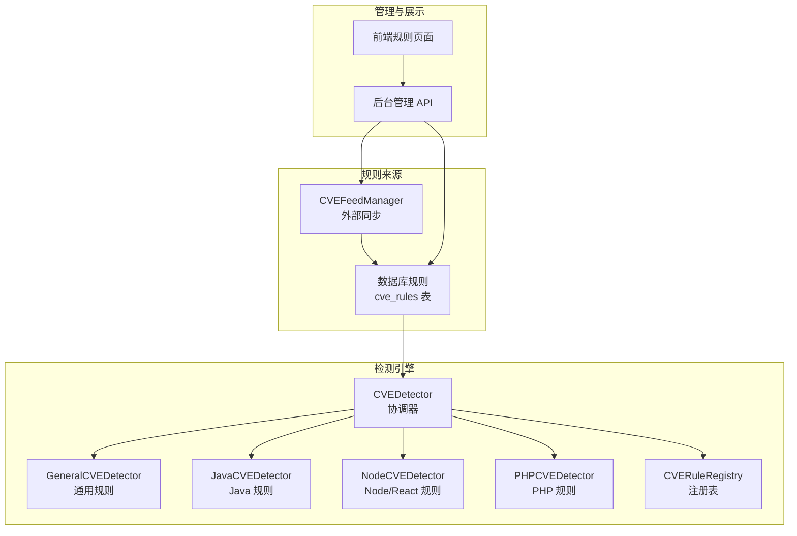
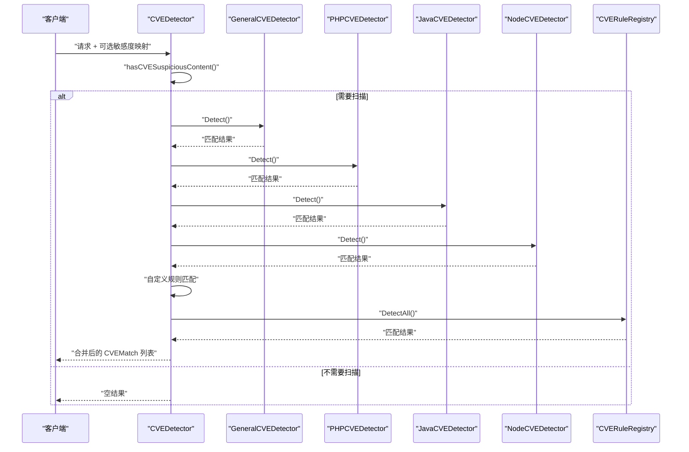
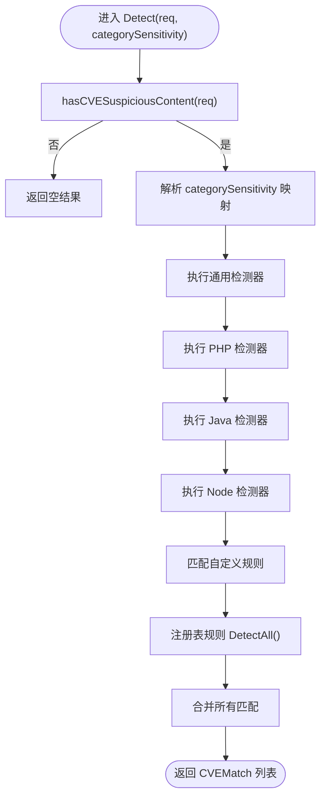
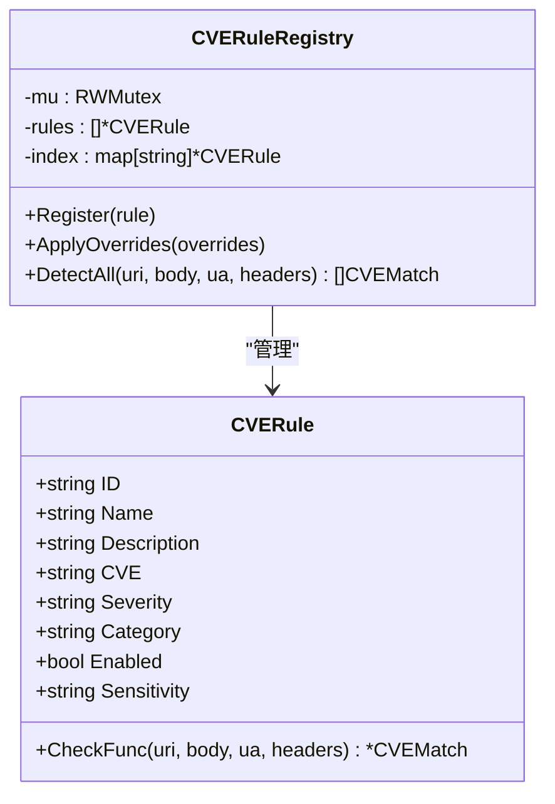
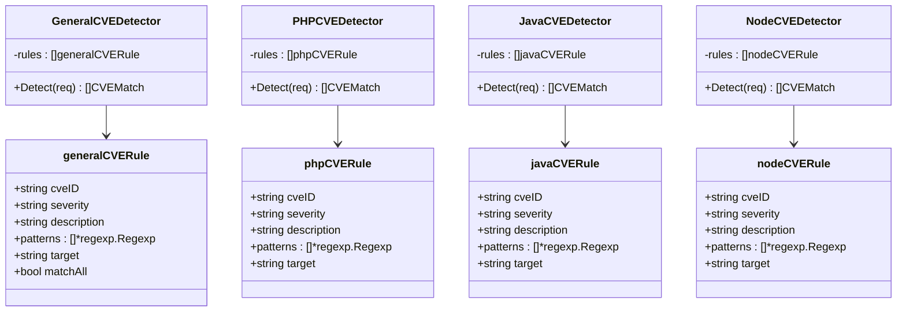
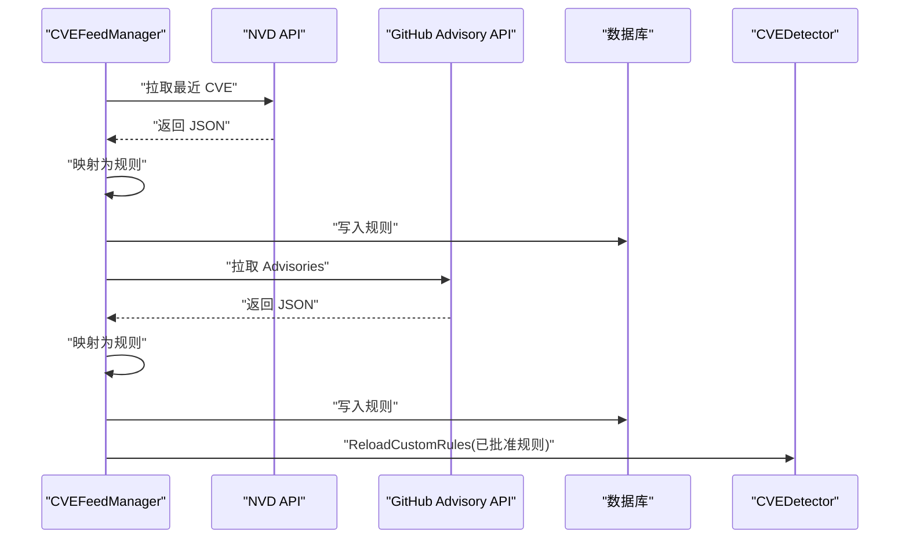
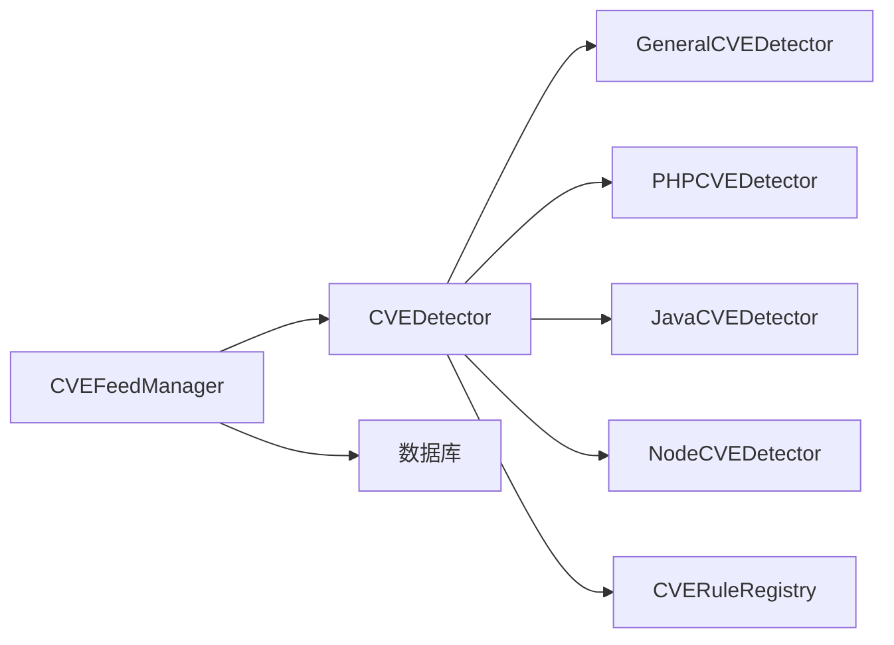

> [返回 安全防护功能](../安全防护功能.md)

# CVE 检测器架构

<cite>
**本文引用的文件**
- [detector.go](file://internal/waf/cve/detector.go)
- [general.go](file://internal/waf/cve/general.go)
- [java.go](file://internal/waf/cve/java.go)
- [node.go](file://internal/waf/cve/node.go)
- [php.go](file://internal/waf/cve/php.go)
- [feed.go](file://internal/waf/cve/feed.go)
- [cve.go](file://internal/admin/detect/cve.go)
- [cve_rules.go](file://internal/admin/detect/cve_rules.go)
- [cve_rule.go](file://internal/store/repository/cve_rule.go)
- [cve.go](file://internal/store/cve.go)
- [detector_test.go](file://internal/waf/cve/detector_test.go)
</cite>

## 目录
1. [简介](#简介)
2. [项目结构](#项目结构)
3. [核心组件](#核心组件)
4. [架构总览](#架构总览)
5. [详细组件分析](#详细组件分析)
6. [依赖关系分析](#依赖关系分析)
7. [性能考量](#性能考量)
8. [故障排查指南](#故障排查指南)
9. [结论](#结论)
10. [附录](#附录)

## 简介
本文件面向 CVE 检测器架构，系统性阐述 CVEDetector 协调器的设计原理、多语言检测器的组织结构与工作流程；深入解析 CVERuleRegistry 注册表的线程安全机制与规则管理策略；说明检测器初始化、规则注册与执行顺序；解释 CVEMatch 结构体的设计目的与字段语义；给出性能优化策略（早退机制、预过滤器、检测器选择逻辑）以及如何通过 categorySensitivity 参数实现按类别的敏感度控制。

## 项目结构
CVE 检测相关代码主要位于 internal/waf/cve 目录，管理与展示在 internal/admin/detect 与 internal/store 下，形成“检测引擎 + 规则仓库 + 后台管理”的完整闭环。

图表来源
- [detector.go:14-22](file://internal/waf/cve/detector.go#L14-L22)
- [general.go:733-745](file://internal/waf/cve/general.go#L733-L745)
- [java.go:72-83](file://internal/waf/cve/java.go#L72-L83)
- [node.go:59-70](file://internal/waf/cve/node.go#L59-L70)
- [php.go:57-68](file://internal/waf/cve/php.go#L57-L68)
- [feed.go:16-30](file://internal/waf/cve/feed.go#L16-L30)
- [cve.go:16-39](file://internal/admin/detect/cve.go#L16-L39)

章节来源
- [detector.go:1-549](file://internal/waf/cve/detector.go#L1-L549)
- [general.go:1-1180](file://internal/waf/cve/general.go#L1-L1180)
- [java.go:1-227](file://internal/waf/cve/java.go#L1-L227)
- [node.go:1-240](file://internal/waf/cve/node.go#L1-L240)
- [php.go:1-267](file://internal/waf/cve/php.go#L1-L267)
- [feed.go:1-549](file://internal/waf/cve/feed.go#L1-L549)
- [cve.go:1-252](file://internal/admin/detect/cve.go#L1-L252)
- [cve_rules.go:1-196](file://internal/admin/detect/cve_rules.go#L1-L196)
- [cve_rule.go:1-96](file://internal/store/repository/cve_rule.go#L1-L96)
- [cve.go:1-41](file://internal/store/cve.go#L1-L41)

## 核心组件
- CVEDetector 协调器：聚合 PHP、Java、Node.js、通用四类子检测器，统一执行检测、自定义规则与注册表规则，并提供早退与敏感度控制。
- 四类子检测器：各自维护目标域内的规则集，采用预编译正则与目标选择策略进行高效匹配。
- CVERuleRegistry 注册表：全局线程安全的规则注册与执行容器，支持注册、覆盖与批量执行。
- CVEFeedManager 外部同步：从 NVD/GitHub Advisory 拉取最新 CVE 信息，映射为规则写入数据库并热加载到检测器。
- 管理与展示：后台 API 提供规则增删改查、同步触发与状态查询；前端页面提供规则列表与统计。

章节来源
- [detector.go:12-22](file://internal/waf/cve/detector.go#L12-L22)
- [general.go:733-745](file://internal/waf/cve/general.go#L733-L745)
- [java.go:72-83](file://internal/waf/cve/java.go#L72-L83)
- [node.go:59-70](file://internal/waf/cve/node.go#L59-L70)
- [php.go:57-68](file://internal/waf/cve/php.go#L57-L68)
- [feed.go:16-30](file://internal/waf/cve/feed.go#L16-L30)

## 架构总览
CVEDetector 的执行路径遵循“早退 + 顺序执行 + 多来源合并”的策略：先通过 hasCVESuspiciousContent 快速判断是否需要扫描；若需扫描，则依次执行通用检测器、各语言检测器、自定义规则、注册表规则；最后汇总返回所有匹配项。

图表来源
- [detector.go:214-297](file://internal/waf/cve/detector.go#L214-L297)
- [detector.go:299-450](file://internal/waf/cve/detector.go#L299-L450)
- [general.go:733-745](file://internal/waf/cve/general.go#L733-L745)
- [php.go:194-222](file://internal/waf/cve/php.go#L194-L222)
- [java.go:199-226](file://internal/waf/cve/java.go#L199-L226)
- [node.go:211-239](file://internal/waf/cve/node.go#L211-L239)
- [detector.go:123-137](file://internal/waf/cve/detector.go#L123-L137)

## 详细组件分析

### CVEDetector 协调器与执行流程
- 初始化：构造函数创建四个子检测器实例。
- 请求归一化：BuildCVERequest 将原始请求解码为多套变体，构建 CVERequest 并预处理大小写。
- 早退与敏感度：hasCVESuspiciousContent 快速过滤低风险请求；Detect 接受可选 categorySensitivity 映射，按类别开关子检测器。
- 执行顺序：通用检测器优先，随后按类别顺序执行 PHP/Java/Node；自定义规则与注册表规则在最后统一汇总。
- 线程安全：自定义规则热加载使用互斥锁保护；注册表读取使用读写锁。

图表来源
- [detector.go:214-297](file://internal/waf/cve/detector.go#L214-L297)
- [detector.go:299-450](file://internal/waf/cve/detector.go#L299-L450)

章节来源
- [detector.go:159-167](file://internal/waf/cve/detector.go#L159-L167)
- [detector.go:169-212](file://internal/waf/cve/detector.go#L169-L212)
- [detector.go:214-297](file://internal/waf/cve/detector.go#L214-L297)
- [detector.go:299-450](file://internal/waf/cve/detector.go#L299-L450)

### CVERuleRegistry 注册表与线程安全
- 结构：内部保存插入顺序的规则切片与 ID->规则索引映射。
- 线程安全：注册、覆盖、批量执行均使用互斥锁；读取使用读写锁提升并发读性能。
- 规则覆盖：支持 JSON 配置对启用状态与敏感度进行覆盖。
- 全局实例：提供全局注册表句柄，供通用规则 init 时注册与外部读取。

图表来源
- [detector.go:74-83](file://internal/waf/cve/detector.go#L74-L83)
- [detector.go:85-121](file://internal/waf/cve/detector.go#L85-L121)
- [detector.go:123-142](file://internal/waf/cve/detector.go#L123-L142)

章节来源
- [detector.go:74-142](file://internal/waf/cve/detector.go#L74-L142)

### 四类子检测器设计与规则组织
- 通用检测器 GeneralCVEDetector：覆盖最广的通用攻击模式，规则以正则集合与目标域组合形式组织，匹配后自动推断命中部分。
- PHP 检测器 PHPCVEDetector：聚焦 PHP 生态常见漏洞，规则按目标域（url/body/header 等）组织，resolveTargets/guessMatchedPart 辅助定位。
- Java 检测器 JavaCVEDetector：聚焦 Java 生态（Log4Shell、Spring4Shell、Fastjson、Struts 等），规则以目标域与多正则组合组织。
- Node/React 检测器 NodeCVEDetector：聚焦 Node/Next.js/React 生态（原型污染、RSC Flight、中间件绕过等），规则以目标域与多正则组合组织。

图表来源
- [general.go:733-745](file://internal/waf/cve/general.go#L733-L745)
- [php.go:57-68](file://internal/waf/cve/php.go#L57-L68)
- [java.go:72-83](file://internal/waf/cve/java.go#L72-L83)
- [node.go:59-70](file://internal/waf/cve/node.go#L59-L70)

章节来源
- [general.go:1-1180](file://internal/waf/cve/general.go#L1-L1180)
- [php.go:1-267](file://internal/waf/cve/php.go#L1-L267)
- [java.go:1-227](file://internal/waf/cve/java.go#L1-L227)
- [node.go:1-240](file://internal/waf/cve/node.go#L1-L240)

### CVEMatch 结构体设计与字段语义
- 字段含义：CVEID（规则归属）、Category（类别）、Severity（严重程度）、Description（描述）、MatchedPart（命中部位）、Pattern（匹配模式）、Action（处置动作）。
- 设计目的：统一检测结果输出，便于上层策略引擎根据严重度与类别进行差异化处置。

章节来源
- [detector.go:24-32](file://internal/waf/cve/detector.go#L24-L32)

### 规则注册与管理流程
- 注册：通用规则在 init 中通过 Register 加入全局注册表；也可通过 JSON 覆盖启用与敏感度。
- 外部同步：CVEFeedManager 从 NVD/GitHub Advisory 拉取数据，映射为规则写入数据库，再热加载到检测器。
- 管理 API：后台提供规则 CRUD、批量更新、同步触发与状态查询；前端提供规则统计与筛选。

图表来源
- [feed.go:145-212](file://internal/waf/cve/feed.go#L145-L212)
- [feed.go:253-302](file://internal/waf/cve/feed.go#L253-L302)
- [feed.go:381-459](file://internal/waf/cve/feed.go#L381-L459)
- [feed.go:461-491](file://internal/waf/cve/feed.go#L461-L491)

章节来源
- [feed.go:1-549](file://internal/waf/cve/feed.go#L1-L549)
- [cve.go:16-252](file://internal/admin/detect/cve.go#L16-L252)
- [cve_rules.go:28-93](file://internal/admin/detect/cve_rules.go#L28-L93)
- [cve_rule.go:16-77](file://internal/store/repository/cve_rule.go#L16-L77)
- [cve.go:9-41](file://internal/store/cve.go#L9-L41)

### 按类别敏感度控制（categorySensitivity）
- 作用：允许运行时按类别调整敏感度，将某类别设为 "none"/"off" 时完全跳过该子检测器。
- 实现：Detect 内部 isDetectorEnabled 读取映射，决定是否执行对应子检测器。
- 使用场景：在高流量或特定站点上降低检测成本，或针对不同环境动态调整。

章节来源
- [detector.go:214-241](file://internal/waf/cve/detector.go#L214-L241)
- [detector_test.go:106-115](file://internal/waf/cve/detector_test.go#L106-L115)

## 依赖关系分析
- 组件耦合：CVEDetector 依赖四个子检测器与注册表；子检测器仅依赖自身规则集；CVEFeedManager 依赖数据库与检测器。
- 外部依赖：HTTP 客户端用于拉取 NVD/GitHub；GORM 用于规则持久化；正则表达式库用于模式匹配。
- 循环依赖：未发现循环导入；模块边界清晰。

图表来源
- [detector.go:14-22](file://internal/waf/cve/detector.go#L14-L22)
- [feed.go:16-30](file://internal/waf/cve/feed.go#L16-L30)

章节来源
- [detector.go:1-549](file://internal/waf/cve/detector.go#L1-L549)
- [feed.go:1-549](file://internal/waf/cve/feed.go#L1-L549)

## 性能考量
- 早退机制：hasCVESuspiciousContent 在请求规模较小或无可疑特征时直接短路，避免昂贵的正则匹配。
- 预过滤器：对常见攻击特征进行快速判定，减少后续检测压力。
- 检测器选择逻辑：通用检测器优先，避免重复扫描；子检测器按类别顺序执行，减少 goroutine 开销。
- 线程安全与并发：注册表读取使用读写锁；自定义规则热加载使用互斥锁；避免并发写导致的竞态。
- 正则编译：子检测器规则在初始化时完成编译；自定义规则在热加载时编译，失败则跳过，保证稳定性。

章节来源
- [detector.go:214-218](file://internal/waf/cve/detector.go#L214-L218)
- [detector.go:299-450](file://internal/waf/cve/detector.go#L299-L450)
- [detector.go:452-496](file://internal/waf/cve/detector.go#L452-L496)
- [php.go:126-192](file://internal/waf/cve/php.go#L126-L192)
- [java.go:132-197](file://internal/waf/cve/java.go#L132-L197)
- [node.go:134-209](file://internal/waf/cve/node.go#L134-L209)

## 故障排查指南
- 无匹配但预期有：确认 categorySensitivity 是否将某类别设为 "none"/"off"；检查 hasCVESuspiciousContent 是否提前短路。
- 自定义规则不生效：确认规则已写入数据库且 approved/enabled；检查正则是否有效；确认 CVEFeedManager 已触发热加载。
- 外部同步失败：查看 CVEFeedManager 的同步状态与错误日志；检查 NVD/GitHub API Key 与网络连通性。
- 性能异常：关注正则复杂度与匹配目标数量；评估是否需要增加早退规则或减少敏感度。

章节来源
- [detector.go:214-297](file://internal/waf/cve/detector.go#L214-L297)
- [feed.go:114-123](file://internal/waf/cve/feed.go#L114-L123)
- [feed.go:145-188](file://internal/waf/cve/feed.go#L145-L188)

## 结论
该 CVE 检测器架构以 CVEDetector 为核心，结合四类子检测器与全局注册表，实现了多语言、多来源的统一威胁检测。通过早退机制、预过滤器与顺序执行策略，在保证覆盖率的同时兼顾性能；通过线程安全的数据结构与热加载机制，确保规则的动态治理能力。配合后台管理与前端展示，形成从规则生成、审批、同步到可视化的完整闭环。

## 附录
- 关键 API 与入口
  - CVEDetector.Detect：主检测入口，支持敏感度控制与早退。
  - CVERuleRegistry.Register/DetectAll：规则注册与批量执行。
  - CVEFeedManager.Start/SyncNow：启动同步与手动同步。
  - 管理 API：规则 CRUD、批量更新、同步触发、状态查询。

章节来源
- [detector.go:214-297](file://internal/waf/cve/detector.go#L214-L297)
- [detector.go:123-142](file://internal/waf/cve/detector.go#L123-L142)
- [feed.go:83-123](file://internal/waf/cve/feed.go#L83-L123)
- [cve.go:16-252](file://internal/admin/detect/cve.go#L16-L252)
- [cve_rules.go:28-196](file://internal/admin/detect/cve_rules.go#L28-L196)
