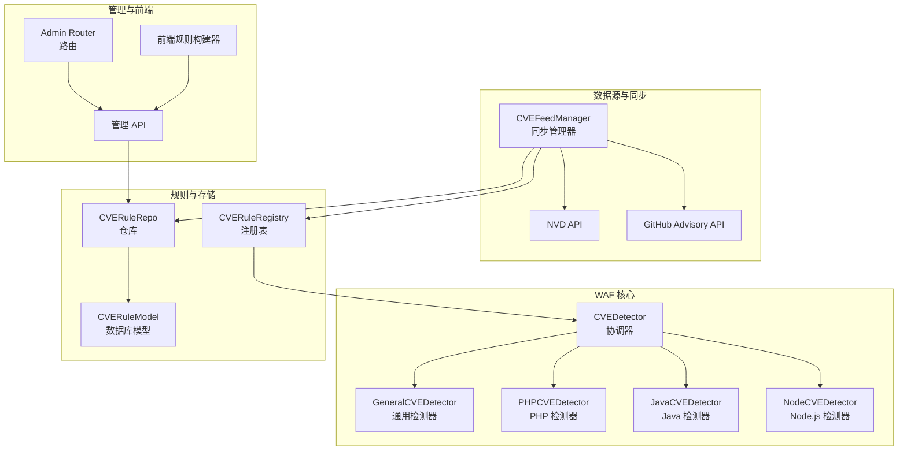
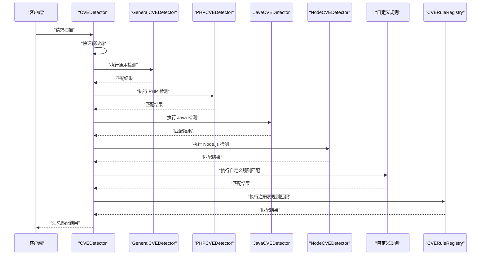
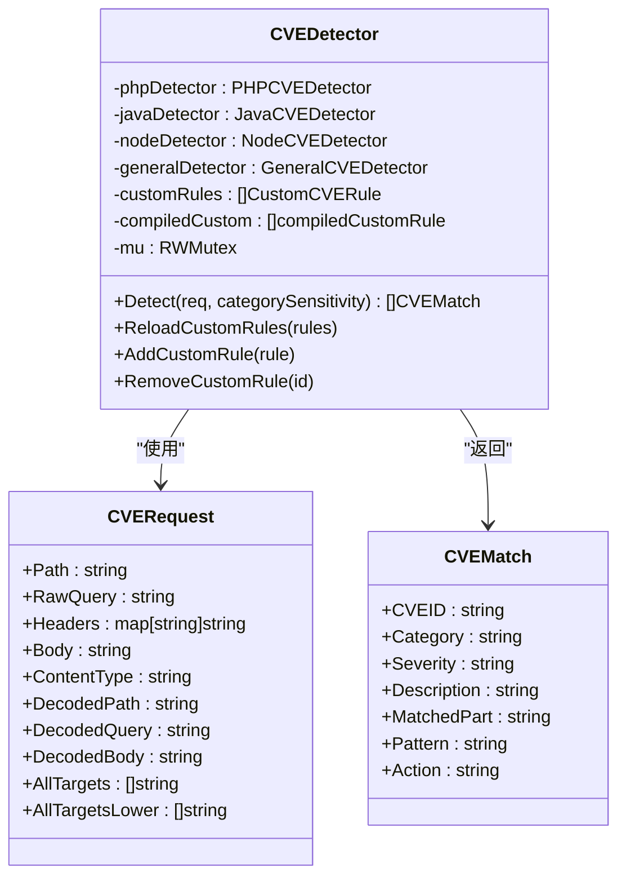
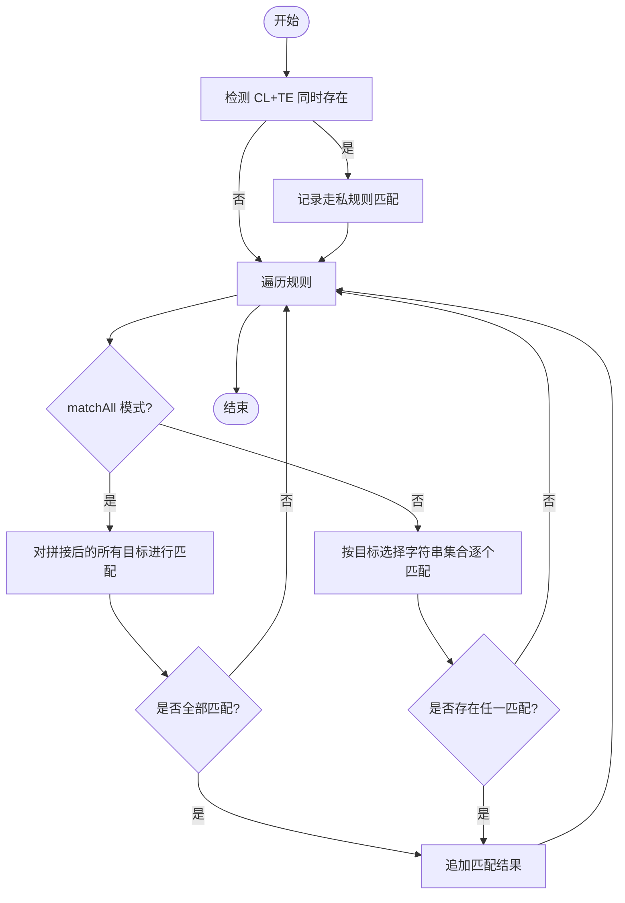
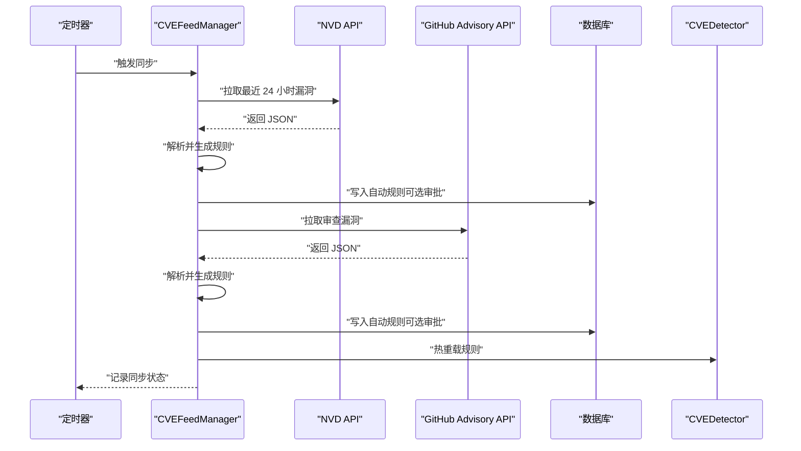
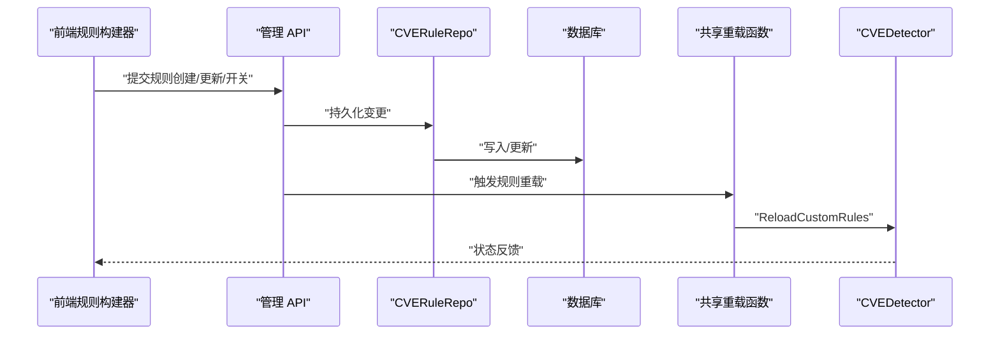
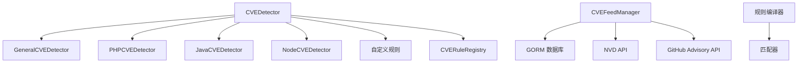

# CVE 漏洞检测

<cite>
**本文档引用的文件**
- [detector.go](file://internal/waf/cve/detector.go)
- [php.go](file://internal/waf/cve/php.go)
- [java.go](file://internal/waf/cve/java.go)
- [node.go](file://internal/waf/cve/node.go)
- [general.go](file://internal/waf/cve/general.go)
- [feed.go](file://internal/waf/cve/feed.go)
- [cve_rule.go](file://internal/store/repository/cve_rule.go)
- [cve.go](file://internal/store/cve.go)
- [router.go](file://internal/admin/router.go)
- [cve.go](file://internal/admin/detect/cve.go)
- [cve_rules.go](file://internal/admin/detect/cve_rules.go)
- [rules-api.ts](file://frontend/lib/rules-api.ts)
- [rule-builder.tsx](file://frontend/components/rule-builder.tsx)
- [compiler.go](file://internal/core/rules/compiler.go)
- [matcher.go](file://internal/core/rules/matcher.go)
</cite>

## 目录
1. [简介](#简介)
2. [项目结构](#项目结构)
3. [核心组件](#核心组件)
4. [架构总览](#架构总览)
5. [详细组件分析](#详细组件分析)
6. [依赖关系分析](#依赖关系分析)
7. [性能考虑](#性能考虑)
8. [故障排除指南](#故障排除指南)
9. [结论](#结论)
10. [附录](#附录)

## 简介
本技术文档面向 CVE 漏洞检测系统的管理员与开发者，系统性阐述多语言漏洞检测能力（PHP、Java、Node.js、通用规则）、CVE 规则自动同步机制（NVD API、GitHub Advisory API）、检测器架构设计（CVEDetector 协调器与多语言专用检测器）、自定义规则管理（创建、验证、热重载、生命周期）、规则编译器实现与性能优化策略。文档旨在帮助读者理解并高效配置针对特定漏洞的精确检测能力。

## 项目结构
CVE 漏洞检测功能主要位于 internal/waf/cve 目录，配合内部规则编译与匹配模块、存储层模型与仓库、管理 API 路由及前端规则构建器共同构成完整的检测与管理闭环。

图表来源
- [detector.go:14-22](file://internal/waf/cve/detector.go#L14-L22)
- [general.go:734-736](file://internal/waf/cve/general.go#L734-L736)
- [php.go:58-60](file://internal/waf/cve/php.go#L58-L60)
- [java.go:73-75](file://internal/waf/cve/java.go#L73-L75)
- [node.go:60-62](file://internal/waf/cve/node.go#L60-L62)
- [feed.go:17-30](file://internal/waf/cve/feed.go#L17-L30)
- [cve_rule.go:10-14](file://internal/store/repository/cve_rule.go#L10-L14)
- [router.go:46-44](file://internal/admin/router.go#L46-L44)

章节来源
- [detector.go:14-297](file://internal/waf/cve/detector.go#L14-L297)
- [general.go:734-1180](file://internal/waf/cve/general.go#L734-L1180)
- [php.go:58-267](file://internal/waf/cve/php.go#L58-L267)
- [java.go:73-227](file://internal/waf/cve/java.go#L73-L227)
- [node.go:60-240](file://internal/waf/cve/node.go#L60-L240)
- [feed.go:17-549](file://internal/waf/cve/feed.go#L17-L549)
- [cve_rule.go:10-96](file://internal/store/repository/cve_rule.go#L10-L96)
- [router.go:46-244](file://internal/admin/router.go#L46-L244)

## 核心组件
- CVEDetector 协调器：统一调度通用、PHP、Java、Node.js 四类检测器，并执行自定义规则与注册表规则匹配；内置快速预过滤以降低无效扫描开销。
- 多语言专用检测器：分别维护各自领域的规则集与匹配逻辑，支持目标域（url/body/header/cookie/all）选择与命中部位猜测。
- CVEFeedManager 同步器：后台定时从 NVD 与 GitHub Advisory 拉取最新漏洞数据，生成并入库自动规则，支持热重载至检测器。
- CVERuleRegistry 注册表：线程安全的全局规则注册中心，支持启用状态与敏感度覆盖。
- 存储与仓库：CVERuleModel 数据模型与 CVERuleRepo 仓库，支撑规则的持久化、查询、批量更新与审批状态管理。
- 管理 API 与前端：提供规则列表、统计、开关、同步、校验等操作，前端规则构建器支持可视化与高级模式。

章节来源
- [detector.go:14-297](file://internal/waf/cve/detector.go#L14-L297)
- [php.go:58-267](file://internal/waf/cve/php.go#L58-L267)
- [java.go:73-227](file://internal/waf/cve/java.go#L73-L227)
- [node.go:60-240](file://internal/waf/cve/node.go#L60-L240)
- [general.go:734-1180](file://internal/waf/cve/general.go#L734-L1180)
- [feed.go:17-549](file://internal/waf/cve/feed.go#L17-L549)
- [cve_rule.go:10-96](file://internal/store/repository/cve_rule.go#L10-L96)
- [cve.go:9-41](file://internal/store/cve.go#L9-L41)
- [router.go:128-234](file://internal/admin/router.go#L128-L234)

## 架构总览
系统采用“协调器 + 多检测器 + 同步器 + 注册表 + 仓库”的分层设计。请求进入时，CVEDetector 先进行快速预过滤，再按类别顺序执行检测；同时加载自定义规则与注册表规则，最终汇总匹配结果。同步器在后台周期性拉取外部数据源，生成自动规则并热重载到检测器。

图表来源
- [detector.go:214-297](file://internal/waf/cve/detector.go#L214-L297)
- [general.go:1085-1144](file://internal/waf/cve/general.go#L1085-L1144)
- [php.go:194-222](file://internal/waf/cve/php.go#L194-L222)
- [java.go:199-226](file://internal/waf/cve/java.go#L199-L226)
- [node.go:211-239](file://internal/waf/cve/node.go#L211-L239)

## 详细组件分析

### CVEDetector 协调器
- 结构组成：持有四个专用检测器实例、自定义规则切片与已编译规则切片、读写锁保证并发安全。
- 关键流程：
  - BuildCVERequest：标准化请求字段，执行多轮解码与预处理，构造统一的 CVERequest。
  - Detect：按类别顺序执行检测，支持基于敏感度映射的跳过策略；对自定义规则与注册表规则进行匹配。
  - hasCVESuspiciousContent：轻量级启发式预过滤，避免对明显安全请求的扫描。
  - 自定义规则热重载：ReloadCustomRules/AddCustomRule/RemoveCustomRule 提供运行时增删改查。
- 目标选择：pickTarget 根据规则目标（url/body/header/cookie/all）选择匹配文本。

图表来源
- [detector.go:14-51](file://internal/waf/cve/detector.go#L14-L51)

章节来源
- [detector.go:159-297](file://internal/waf/cve/detector.go#L159-L297)
- [detector.go:452-496](file://internal/waf/cve/detector.go#L452-L496)
- [detector.go:498-517](file://internal/waf/cve/detector.go#L498-L517)

### 通用检测器（GeneralCVEDetector）
- 规则类型：generalCVERule，支持“全部匹配”（matchAll）与常规匹配两种模式。
- 特殊处理：HTTP 请求走私（CL+TE）检测独立于常规规则。
- 匹配策略：resolveTargets 将规则目标映射到具体字符串集合；matchAllPatterns 仅当全部模式匹配时才命中。
- 模式生成：matchAll 通过将所有目标拼接后整体匹配，提升准确性。

图表来源
- [general.go:1085-1180](file://internal/waf/cve/general.go#L1085-L1180)
- [general.go:1169-1179](file://internal/waf/cve/general.go#L1169-L1179)

章节来源
- [general.go:734-1180](file://internal/waf/cve/general.go#L734-L1180)

### PHP 检测器（PHPCVEDetector）
- 规则类型：phpCVERule，包含 CVE 编号、严重度、描述、多个正则模式与目标域。
- 模式覆盖：对象反序列化、流包装器文件包含、ThinkPHP/Drupal/Laravel 等知名框架漏洞、WebShell 上传等。
- 目标解析：resolveTargets 支持 url/body/header/cookie/all；guessMatchedPart 在 all 模式下尝试推断命中部位。

章节来源
- [php.go:58-267](file://internal/waf/cve/php.go#L58-L267)

### Java 检测器（JavaCVEDetector）
- 规则类型：javaCVERule，涵盖 Log4Shell、Spring4Shell、Fastjson、Struts2、Shiro、Jackson、OFBiz、ActiveMQ、Confluence 等。
- 模式覆盖：JNDI 注入、SpEL 表达式、反序列化链、OGNL 注入、RememberMe Cookie 解析等。

章节来源
- [java.go:73-227](file://internal/waf/cve/java.go#L73-L227)

### Node.js 检测器（NodeCVEDetector）
- 规则类型：nodeCVERule，覆盖原型污染、React SSR 注入、命令注入、路径穿越、EJS 模板注入、vm2 沙箱逃逸、Next.js SSRF、RSC Flight 协议 RCE、中间件绕过、Server Actions 路径混淆等。

章节来源
- [node.go:60-240](file://internal/waf/cve/node.go#L60-L240)

### CVE 规则注册表（CVERuleRegistry）
- 线程安全：使用互斥锁保护规则列表与索引。
- 能力：注册规则、应用启用/敏感度覆盖、按启用状态执行全量匹配。
- 覆盖配置：ParseCVERuleOverrides 支持 JSON 配置禁用、敏感度与动作覆盖。

章节来源
- [detector.go:74-142](file://internal/waf/cve/detector.go#L74-L142)
- [detector.go:112-121](file://internal/waf/cve/detector.go#L112-L121)

### CVE 规则自动同步（CVEFeedManager）
- 数据源：NVD API v2.0（最近 24 小时），GitHub Advisory API（审查过的漏洞）。
- 规则生成：根据 CWE 类型与描述映射生成正则模式、目标域与严重度；支持自动审批与启用。
- 同步流程：定时循环、失败聚合、状态记录、规则热重载。
- 存储模型：CVERuleModel，包含 CVE 编号、分类、模式、目标、严重度、动作、来源、审批状态、CVSS 分数、CWE 类型等。

图表来源
- [feed.go:129-188](file://internal/waf/cve/feed.go#L129-L188)
- [feed.go:253-302](file://internal/waf/cve/feed.go#L253-L302)
- [feed.go:381-459](file://internal/waf/cve/feed.go#L381-L459)
- [feed.go:190-212](file://internal/waf/cve/feed.go#L190-L212)

章节来源
- [feed.go:17-549](file://internal/waf/cve/feed.go#L17-L549)
- [cve.go:9-41](file://internal/store/cve.go#L9-L41)

### 自定义规则管理（仓库、API、前端）
- 仓库接口：列表、获取、创建、更新、删除、启用/禁用切换、待审批计数。
- 管理 API：列出规则、统计、开关、批量更新、同步触发、状态查询。
- 前端规则构建器：支持简单 DSL 与复合 JSON，可视化与高级模式切换，规则测试与语法验证。
- 热重载：每次变更后通过共享函数触发 CVEDetector 的规则热重载。

图表来源
- [cve_rule.go:24-77](file://internal/store/repository/cve_rule.go#L24-L77)
- [router.go:128-234](file://internal/admin/router.go#L128-L234)
- [cve.go:49-74](file://internal/admin/detect/cve.go#L49-L74)
- [cve.go:77-142](file://internal/admin/detect/cve.go#L77-L142)
- [cve.go:144-213](file://internal/admin/detect/cve.go#L144-L213)
- [rules-api.ts:156-172](file://frontend/lib/rules-api.ts#L156-L172)
- [rule-builder.tsx:235-301](file://frontend/components/rule-builder.tsx#L235-L301)

章节来源
- [cve_rule.go:10-96](file://internal/store/repository/cve_rule.go#L10-L96)
- [router.go:128-234](file://internal/admin/router.go#L128-L234)
- [cve.go:49-213](file://internal/admin/detect/cve.go#L49-L213)
- [rules-api.ts:156-172](file://frontend/lib/rules-api.ts#L156-L172)
- [rule-builder.tsx:1-520](file://frontend/components/rule-builder.tsx#L1-L520)

## 依赖关系分析
- 检测器依赖：CVEDetector 依赖四个专用检测器与自定义规则；专用检测器依赖各自的正则模式与目标解析函数。
- 同步器依赖：CVEFeedManager 依赖数据库（GORM）与外部 API；生成规则后写入数据库并触发热重载。
- 规则编译器：与 CVE 规则不同，规则编译器用于通用规则（OWASP/Rules Engine），不参与 CVE 检测；但其正则缓存与匹配器实现可借鉴到 CVE 规则的性能优化中。

图表来源
- [detector.go:14-22](file://internal/waf/cve/detector.go#L14-L22)
- [feed.go:17-30](file://internal/waf/cve/feed.go#L17-L30)
- [compiler.go:30-59](file://internal/core/rules/compiler.go#L30-L59)
- [matcher.go:498-763](file://internal/core/rules/matcher.go#L498-L763)

章节来源
- [detector.go:14-297](file://internal/waf/cve/detector.go#L14-L297)
- [feed.go:17-549](file://internal/waf/cve/feed.go#L17-L549)
- [compiler.go:1-91](file://internal/core/rules/compiler.go#L1-L91)
- [matcher.go:1-763](file://internal/core/rules/matcher.go#L1-L763)

## 性能考虑
- 快速预过滤：hasCVESuspiciousContent 使用字符集与常见攻击特征进行低成本判断，避免对清洁请求的昂贵扫描。
- 串行执行：Detect 中四类检测器串行执行，减少 goroutine 启动/同步开销；支持按类别敏感度跳过。
- 正则编译缓存：规则编译器对正则表达式进行缓存，避免重复编译；CVE 规则也可借鉴该策略（当前自定义规则在热重载时重新编译）。
- 目标域最小化：resolveTargets 仅在必要时扫描目标域，减少匹配范围。
- 并发安全：自定义规则热重载使用读写锁，读多写少场景下降低锁竞争。

章节来源
- [detector.go:214-297](file://internal/waf/cve/detector.go#L214-L297)
- [detector.go:299-450](file://internal/waf/cve/detector.go#L299-L450)
- [matcher.go:680-704](file://internal/core/rules/matcher.go#L680-L704)
- [compiler.go:61-91](file://internal/core/rules/compiler.go#L61-L91)

## 故障排除指南
- 同步失败排查：
  - 检查 NVD API Key 设置与网络连通性。
  - 查看同步状态接口返回的 LastError 与 LastSync 时间。
  - 确认数据库表迁移成功（AutoMigrate）。
- 规则不生效：
  - 确认规则已审批（Approved）且启用（Enabled）。
  - 检查敏感度配置是否将对应类别设为 "none/off"。
  - 使用前端规则构建器的“验证规则”与“测试匹配”功能定位问题。
- 热重载异常：
  - 确认管理 API 已正确调用重载接口。
  - 检查正则表达式合法性（非法正则会被忽略）。

章节来源
- [feed.go:114-123](file://internal/waf/cve/feed.go#L114-L123)
- [feed.go:84-100](file://internal/waf/cve/feed.go#L84-L100)
- [cve.go:49-74](file://internal/admin/detect/cve.go#L49-L74)
- [rules-api.ts:156-172](file://frontend/lib/rules-api.ts#L156-L172)
- [rule-builder.tsx:235-301](file://frontend/components/rule-builder.tsx#L235-L301)

## 结论
本 CVE 漏洞检测系统通过 CVEDetector 协调器整合通用与多语言专用检测器，结合自动同步机制与自定义规则管理，实现了高精度、可扩展、可热重载的漏洞检测能力。建议管理员合理配置敏感度与动作策略，利用前端规则构建器与验证工具提升规则质量，并定期同步外部漏洞数据以保持检测时效性。

## 附录
- 管理 API 端点概览（与 CVE 相关）：
  - GET /api/v1/cve-rules：列出 CVE 规则
  - GET /api/v1/cve-rules/stats：CVE 规则统计
  - GET /api/v1/cve-feed/status：CVE 同步状态
  - POST /api/v1/cve-rules/{id}/toggle：切换启用状态
  - POST /api/v1/cve-rules/{id}/patch：更新单条规则
  - POST /api/v1/cve-rules/batch：批量更新
  - POST /api/v1/cve-rules/sync：立即同步

章节来源
- [router.go:128-194](file://internal/admin/router.go#L128-L194)
- [rules-api.ts:156-172](file://frontend/lib/rules-api.ts#L156-L172)