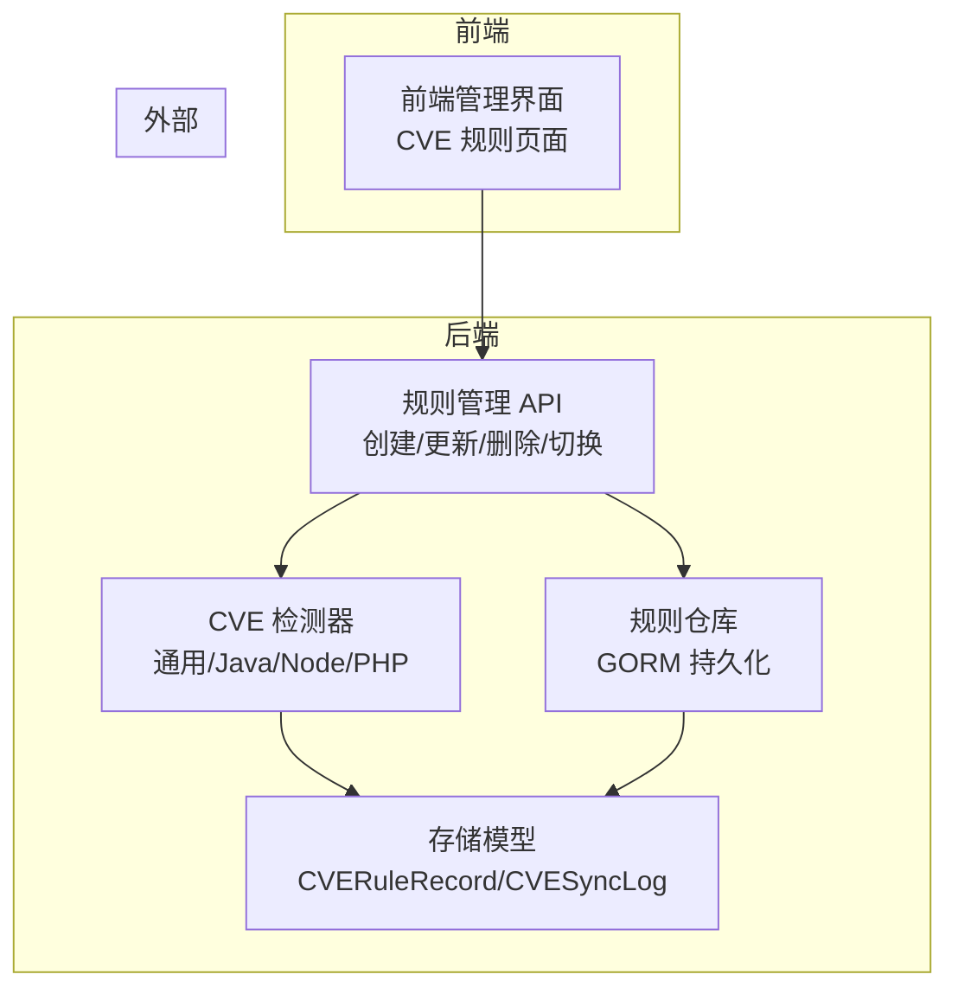
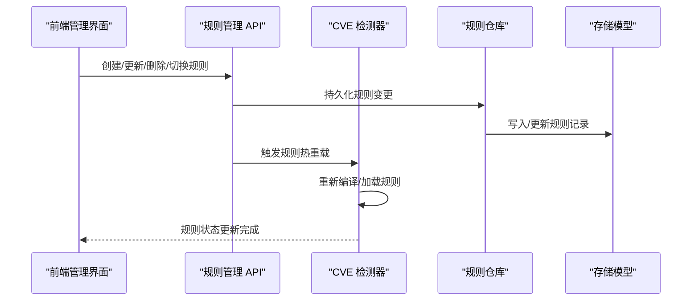
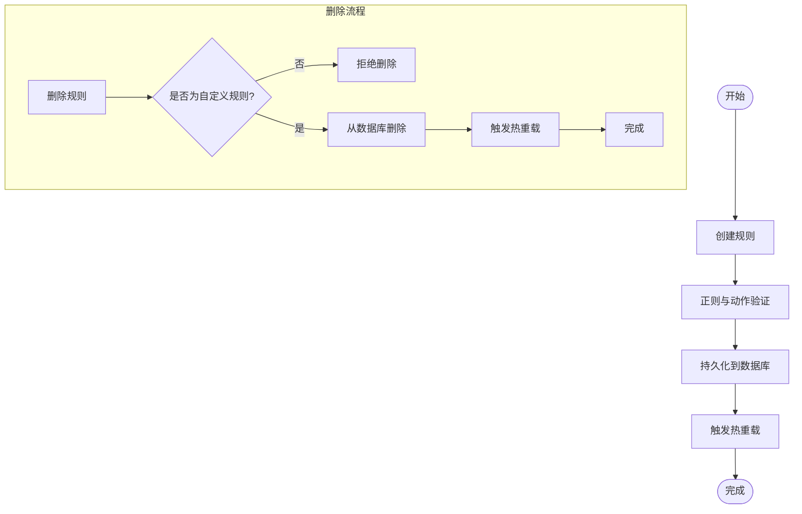
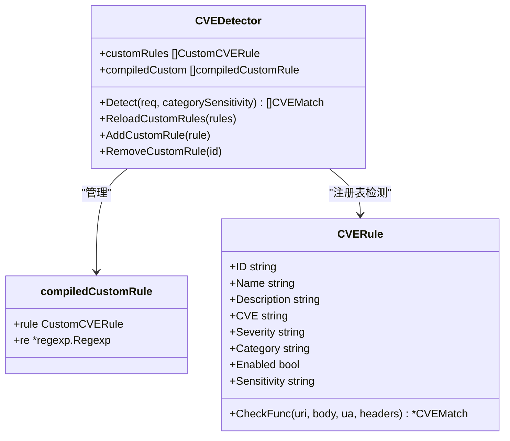
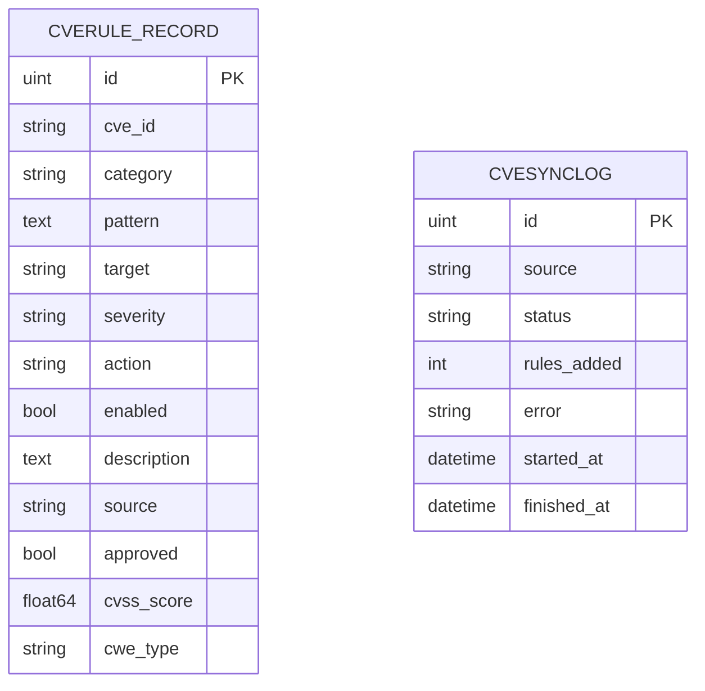
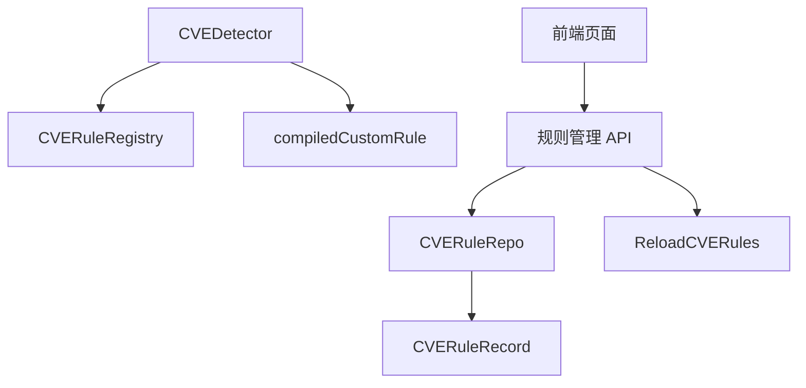

# CVE 规则管理

<cite>
**本文档引用的文件**
- [detector.go](file://internal/waf/cve/detector.go)
- [cve.go](file://internal/waf/cve/general.go)
- [java.go](file://internal/waf/cve/java.go)
- [node.go](file://internal/waf/cve/node.go)
- [php.go](file://internal/waf/cve/php.go)
- [cve.go](file://internal/admin/detect/cve.go)
- [cve_rule.go](file://internal/store/repository/cve_rule.go)
- [cve.go](file://internal/store/cve.go)
- [helpers.go](file://internal/admin/shared/helpers.go)
- [page.tsx](file://frontend/app/(dashboard)/rules/cve/page.tsx)
</cite>

## 目录
1. [简介](#简介)
2. [项目结构](#项目结构)
3. [核心组件](#核心组件)
4. [架构总览](#架构总览)
5. [详细组件分析](#详细组件分析)
6. [依赖关系分析](#依赖关系分析)
7. [性能考虑](#性能考虑)
8. [故障排除指南](#故障排除指南)
9. [结论](#结论)
10. [附录](#附录)

## 简介
本文件系统性阐述 CVE 规则管理系统的数据结构设计、生命周期管理、编译器工作机制、验证机制、持久化存储与加载机制，以及规则管理 API 的使用方法与最佳实践。该系统支持自定义规则与订阅规则两类来源，具备热重载能力，能够对通用漏洞与特定语言/框架漏洞进行实时检测。

## 项目结构
CVE 规则管理涉及以下关键模块：
- 规则检测器：负责检测通用漏洞与特定技术栈漏洞（Java、Node.js、PHP），并支持自定义规则的热重载
- 规则模型：定义自定义规则与订阅规则的数据结构
- 规则管理 API：提供规则的增删改查、启用/禁用、同步与状态查询
- 存储层：基于 GORM 的数据库持久化，支持规则的 CRUD 与统计查询
- 前端管理界面：提供规则列表、筛选、编辑与操作入口

图表来源
- [cve.go:16-252](file://internal/admin/detect/cve.go#L16-L252)
- [detector.go:14-549](file://internal/waf/cve/detector.go#L14-L549)
- [cve_rule.go:10-96](file://internal/store/repository/cve_rule.go#L10-L96)
- [cve.go:9-41](file://internal/store/cve.go#L9-L41)
- [page.tsx](file://frontend/app/(dashboard)/rules/cve/page.tsx#L50-L62)

章节来源
- [cve.go:16-252](file://internal/admin/detect/cve.go#L16-L252)
- [detector.go:14-549](file://internal/waf/cve/detector.go#L14-L549)
- [cve_rule.go:10-96](file://internal/store/repository/cve_rule.go#L10-L96)
- [cve.go:9-41](file://internal/store/cve.go#L9-L41)
- [page.tsx](file://frontend/app/(dashboard)/rules/cve/page.tsx#L50-L62)

## 核心组件
- CustomCVERule：自定义 CVE 规则模型，支持正则模式、目标字段、严重级别、动作与启用状态
- CVERule：颗粒化 CVE 规则模型，包含唯一标识、名称、描述、CVE 编号、严重级别、类别、启用状态、敏感度覆盖与检测函数
- CVEMatch：检测结果模型，包含 CVEID、类别、严重级别、描述、匹配部分、模式与动作
- CVEDetector：CVE 检测器，聚合通用与特定技术栈检测器，并管理自定义规则的热重载
- CVERuleRegistry：全局注册表，支持规则注册、覆盖应用与并发安全的检测
- 规则管理 API：提供列表、创建、更新、删除、切换启用状态、同步与状态查询等接口
- 存储模型：CVERuleRecord 与 CVESyncLog，分别用于规则数据与同步日志的持久化

章节来源
- [detector.go:34-142](file://internal/waf/cve/detector.go#L34-L142)
- [cve.go:9-41](file://internal/store/cve.go#L9-L41)

## 架构总览
CVE 规则管理采用“前端可视化 + 后端 API + 检测器 + 存储”的分层架构。前端通过管理 API 对规则进行 CRUD 操作，后端在创建/更新/删除/切换时触发规则热重载，检测器在请求处理时按阶段执行检测。

图表来源
- [cve.go:41-171](file://internal/admin/detect/cve.go#L41-L171)
- [detector.go:452-496](file://internal/waf/cve/detector.go#L452-L496)
- [cve_rule.go:56-70](file://internal/store/repository/cve_rule.go#L56-L70)
- [cve.go:9-27](file://internal/store/cve.go#L9-L27)

章节来源
- [cve.go:41-171](file://internal/admin/detect/cve.go#L41-L171)
- [detector.go:452-496](file://internal/waf/cve/detector.go#L452-L496)
- [cve_rule.go:56-70](file://internal/store/repository/cve_rule.go#L56-L70)
- [cve.go:9-27](file://internal/store/cve.go#L9-L27)

## 详细组件分析

### 数据结构设计与字段含义
- CustomCVERule
  - ID：规则唯一标识
  - CVEID：关联的 CVE 编号
  - Category：规则类别（如 cve_general/cve_java/cve_node/cve_php）
  - Pattern：正则表达式模式
  - Target：匹配目标（url/body/header/cookie/all）
  - Severity：严重级别（critical/high/medium/low）
  - Action：动作（drop/block/log 等）
  - Enabled：是否启用
  - Description：规则描述
- CVERule
  - ID：规则唯一标识
  - Name：规则名称
  - Description：规则描述
  - CVE：CVE 编号
  - Severity：严重级别
  - Category：规则类别
  - Enabled：是否启用
  - Sensitivity：敏感度覆盖
  - CheckFunc：检测函数
- CVEMatch
  - CVEID：匹配到的 CVE 编号
  - Category：规则类别
  - Severity：严重级别
  - Description：匹配描述
  - MatchedPart：匹配的部分
  - Pattern：使用的模式
  - Action：采取的动作

章节来源
- [detector.go:34-63](file://internal/waf/cve/detector.go#L34-L63)
- [detector.go:24-32](file://internal/waf/cve/detector.go#L24-L32)

### 规则生命周期管理
- 创建：API 接收请求，校验正则与动作，写入数据库，触发热重载
- 验证：API 对正则进行编译校验，规范化动作
- 编译：检测器对规则进行预编译（正则预编译），构建可执行的规则集
- 热重载：通过 ReloadCVERules 触发检测器重新加载规则
- 删除：仅允许删除自定义规则，删除后触发热重载

图表来源
- [cve.go:41-74](file://internal/admin/detect/cve.go#L41-L74)
- [cve.go:144-171](file://internal/admin/detect/cve.go#L144-L171)
- [helpers.go:73-78](file://internal/admin/shared/helpers.go#L73-L78)

章节来源
- [cve.go:41-74](file://internal/admin/detect/cve.go#L41-L74)
- [cve.go:144-171](file://internal/admin/detect/cve.go#L144-L171)
- [helpers.go:73-78](file://internal/admin/shared/helpers.go#L73-L78)

### 规则编译器工作原理
- 预编译正则：在规则加载时对 Pattern 进行预编译，避免每次匹配时重复编译
- 线程安全：通过互斥锁保护规则列表与编译结果，支持并发读写
- 精准匹配：根据 Target 选择匹配目标（URL、Body、Header、Cookie 或全部）
- 快速过滤：在检测前进行可疑内容预过滤，跳过明显安全的请求

图表来源
- [detector.go:14-50](file://internal/waf/cve/detector.go#L14-L50)
- [detector.go:214-297](file://internal/waf/cve/detector.go#L214-L297)

章节来源
- [detector.go:452-496](file://internal/waf/cve/detector.go#L452-L496)
- [detector.go:214-297](file://internal/waf/cve/detector.go#L214-L297)

### 规则验证机制
- 语法检查：对 Pattern 进行正则编译，失败则返回错误
- 动作规范化：对动作进行标准化与有效性校验
- 冲突检测：通过注册表与热重载机制，确保规则变更后的一致性
- 性能评估：通过预过滤与正则缓存降低匹配开销

章节来源
- [cve.go:49-55](file://internal/admin/detect/cve.go#L49-L55)
- [cve.go:97-103](file://internal/admin/detect/cve.go#L97-L103)
- [detector.go:299-450](file://internal/waf/cve/detector.go#L299-L450)

### 持久化存储与加载机制
- 存储模型：CVERuleRecord 用于保存规则信息，CVESyncLog 用于记录同步状态
- 仓库接口：提供列表、获取、创建、更新、删除、启用切换与待审批计数等操作
- 加载流程：API 调用仓库进行持久化，检测器通过热重载加载最新规则

图表来源
- [cve.go:9-27](file://internal/store/cve.go#L9-L27)
- [cve.go:31-40](file://internal/store/cve.go#L31-L40)

章节来源
- [cve_rule.go:24-77](file://internal/store/repository/cve_rule.go#L24-L77)
- [cve.go:9-41](file://internal/store/cve.go#L9-L41)

### 规则管理 API 使用方法与最佳实践
- 列表与筛选：支持按类别、严重级别、启用状态与来源筛选
- 创建规则：校验正则与动作，设置来源为 custom，自动批准并触发重载
- 更新规则：可选择性更新字段，支持动作规范化
- 删除规则：仅允许删除自定义规则
- 切换启用状态：支持单次切换或显式启用/禁用
- 同步与状态：支持手动同步订阅规则并查询同步状态

章节来源
- [cve.go:16-38](file://internal/admin/detect/cve.go#L16-L38)
- [cve.go:41-141](file://internal/admin/detect/cve.go#L41-L141)
- [cve.go:144-213](file://internal/admin/detect/cve.go#L144-L213)
- [cve.go:215-251](file://internal/admin/detect/cve.go#L215-L251)

## 依赖关系分析
- 规则检测器依赖存储模型与动作类型，通过注册表与热重载机制集成
- 规则管理 API 依赖仓库接口与共享工具，负责规则的生命周期管理
- 前端通过页面组件与 API 交互，实现规则的可视化管理

图表来源
- [detector.go:74-142](file://internal/waf/cve/detector.go#L74-L142)
- [cve.go:73-73](file://internal/admin/detect/cve.go#L73-L73)
- [cve_rule.go:10-14](file://internal/store/repository/cve_rule.go#L10-L14)
- [cve.go:29-29](file://internal/store/cve.go#L29-L29)
- [page.tsx](file://frontend/app/(dashboard)/rules/cve/page.tsx#L50-L62)

章节来源
- [detector.go:74-142](file://internal/waf/cve/detector.go#L74-L142)
- [cve.go:73-73](file://internal/admin/detect/cve.go#L73-L73)
- [cve_rule.go:10-14](file://internal/store/repository/cve_rule.go#L10-L14)
- [cve.go:29-29](file://internal/store/cve.go#L29-L29)
- [page.tsx](file://frontend/app/(dashboard)/rules/cve/page.tsx#L50-L62)

## 性能考虑
- 正则预编译：在规则加载时完成正则编译，避免运行时重复编译
- 快速过滤：通过 hasCVESuspiciousContent 快速跳过明显安全的请求
- 并发安全：使用互斥锁保护规则列表与编译结果，支持并发读取
- 目标选择：根据 Target 精准选择匹配目标，减少不必要的匹配

章节来源
- [detector.go:452-496](file://internal/waf/cve/detector.go#L452-L496)
- [detector.go:299-450](file://internal/waf/cve/detector.go#L299-L450)

## 故障排除指南
- 正则无效：创建/更新时若正则编译失败，API 将返回错误提示
- 动作无效：动作必须为有效值，否则返回错误
- 删除受限：仅允许删除自定义规则，订阅规则不可删除
- 热重载失败：检查共享工具中的 ReloadCVERules 是否正常调用

章节来源
- [cve.go:49-55](file://internal/admin/detect/cve.go#L49-L55)
- [cve.go:97-103](file://internal/admin/detect/cve.go#L97-L103)
- [cve.go:158-162](file://internal/admin/detect/cve.go#L158-L162)
- [helpers.go:73-78](file://internal/admin/shared/helpers.go#L73-L78)

## 结论
CVE 规则管理系统通过清晰的数据结构设计、严格的验证机制、高效的编译与热重载流程，以及完善的持久化与 API 支持，实现了对通用与特定技术栈漏洞的实时检测与管理。系统在保证安全性的同时，兼顾性能与可维护性，适合在生产环境中稳定运行。

## 附录
- 前端页面组件：提供 CVE 规则的列表展示、筛选与操作入口
- 规则类别：支持通用漏洞与 Java/Node/PHP 特定漏洞检测
- 动作类型：支持 drop、block、log 等动作，满足不同安全需求

章节来源
- [page.tsx](file://frontend/app/(dashboard)/rules/cve/page.tsx#L50-L62)
- [cve.go:8-731](file://internal/waf/cve/general.go#L8-L731)
- [java.go:7-130](file://internal/waf/cve/java.go#L7-L130)
- [node.go:8-57](file://internal/waf/cve/node.go#L8-L57)
- [php.go:8-55](file://internal/waf/cve/php.go#L8-L55)