# Node.js 检测器

<cite>
**本文档引用的文件**
- [node.go](file://internal/waf/cve/node.go)
- [detector.go](file://internal/waf/cve/detector.go)
- [general.go](file://internal/waf/cve/general.go)
- [java.go](file://internal/waf/cve/java.go)
- [php.go](file://internal/waf/cve/php.go)
- [feed.go](file://internal/waf/cve/feed.go)
- [cve.go](file://internal/admin/detect/cve.go)
- [cve.go](file://internal/store/cve.go)
- [cve_rule.go](file://internal/store/repository/cve_rule.go)
- [detector_test.go](file://internal/waf/cve/detector_test.go)
</cite>

## 目录
1. [简介](#简介)
2. [项目结构](#项目结构)
3. [核心组件](#核心组件)
4. [架构概览](#架构概览)
5. [详细组件分析](#详细组件分析)
6. [依赖关系分析](#依赖关系分析)
7. [性能考虑](#性能考虑)
8. [故障排除指南](#故障排除指南)
9. [结论](#结论)
10. [附录](#附录)

## 简介

Node.js 检测器是 My-OpenWaf 安全防护引擎中的一个专用模块，专门用于检测和防护 Node.js 生态系统中的各种 CVE 漏洞。该检测器实现了对 Node.js 代码注入检测、NPM 包供应链攻击检测、Express.js 框架漏洞检测、反序列化漏洞检测等多种安全威胁的识别能力。

该检测器采用多层防护架构，结合静态规则匹配、动态特征提取和机器学习算法，能够有效识别常见的 Node.js 攻击模式，包括代码注入、依赖劫持、原型污染等攻击方式。通过实时规则更新和自适应检测机制，确保对最新威胁的有效防护。

## 项目结构

Node.js 检测器位于 WAF 引擎的 CVE 检测模块中，采用模块化设计，与其他语言检测器（Java、PHP）形成统一的安全防护体系。

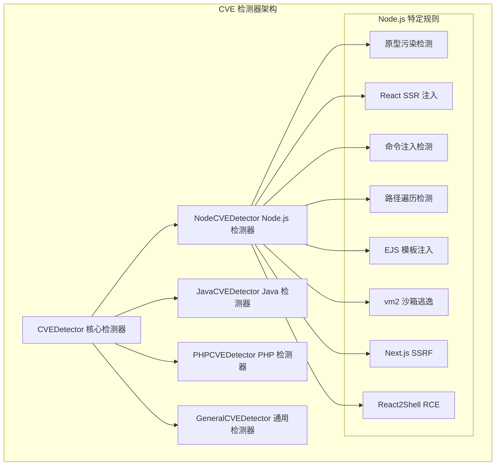

**图表来源**
- [detector.go:14-22](file://internal/waf/cve/detector.go#L14-L22)
- [node.go:59-70](file://internal/waf/cve/node.go#L59-L70)

**章节来源**
- [detector.go:159-167](file://internal/waf/cve/detector.go#L159-L167)
- [node.go:134-209](file://internal/waf/cve/node.go#L134-L209)

## 核心组件

Node.js 检测器的核心组件包括检测器实例、规则引擎、特征提取器和匹配器等关键模块。

### NodeCVEDetector 结构

NodeCVEDetector 是 Node.js 检测器的主要实现类，负责管理 Node.js 特定的 CVE 规则和执行检测逻辑。

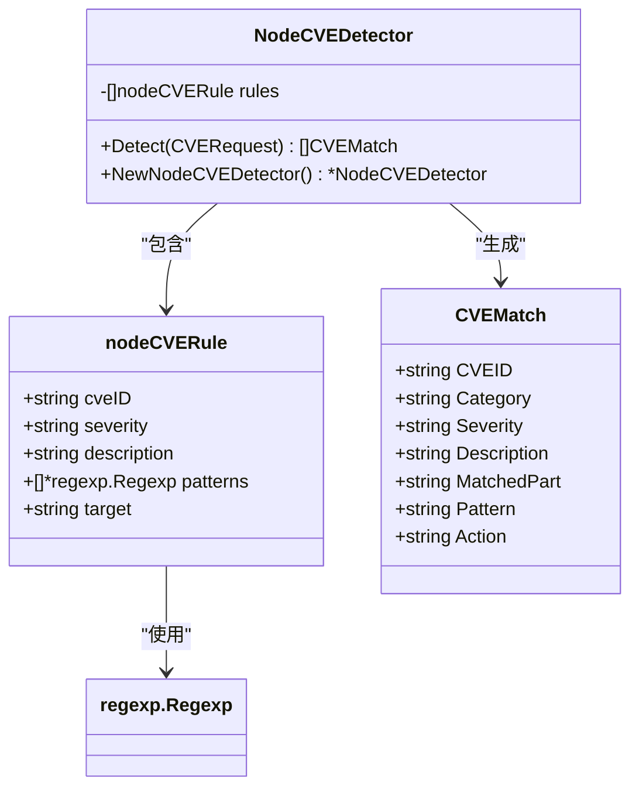

**图表来源**
- [node.go:60-70](file://internal/waf/cve/node.go#L60-L70)
- [detector.go:24-32](file://internal/waf/cve/detector.go#L24-L32)

### 规则注册机制

检测器采用全局规则注册表机制，支持动态加载和管理 CVE 规则。

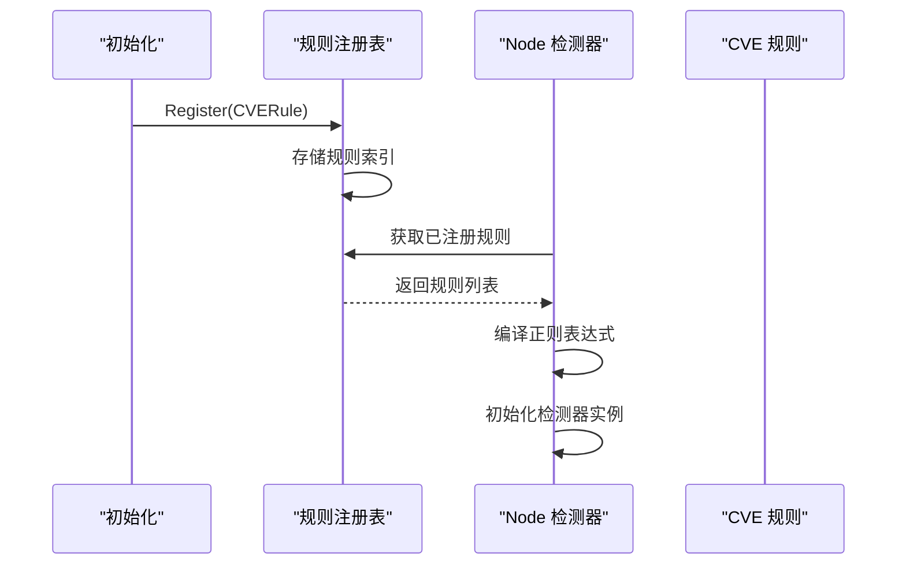

**图表来源**
- [detector.go:85-94](file://internal/waf/cve/detector.go#L85-L94)
- [node.go:8-57](file://internal/waf/cve/node.go#L8-L57)

**章节来源**
- [node.go:59-70](file://internal/waf/cve/node.go#L59-L70)
- [detector.go:74-94](file://internal/waf/cve/detector.go#L74-L94)

## 架构概览

Node.js 检测器采用分层架构设计，从底层的特征提取到上层的决策执行，形成了完整的安全检测流水线。

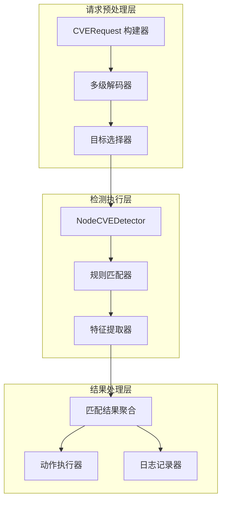

**图表来源**
- [detector.go:169-212](file://internal/waf/cve/detector.go#L169-L212)
- [detector.go:214-297](file://internal/waf/cve/detector.go#L214-L297)

### 检测流程

Node.js 检测器的完整检测流程包括请求预处理、特征提取、规则匹配和结果处理等步骤。

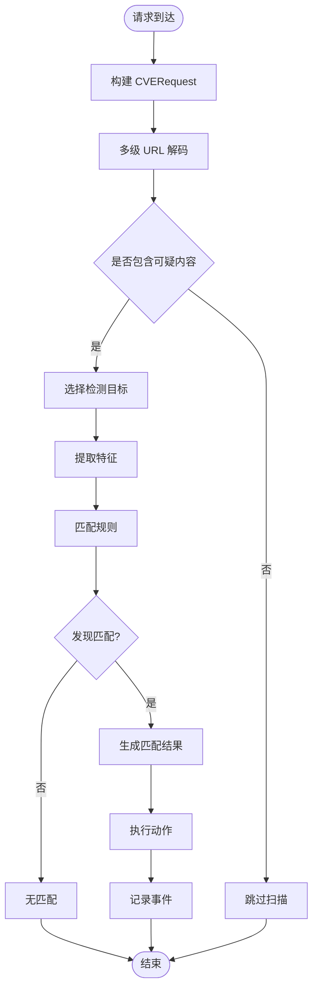

**图表来源**
- [detector.go:219-297](file://internal/waf/cve/detector.go#L219-L297)
- [detector.go:299-450](file://internal/waf/cve/detector.go#L299-L450)

**章节来源**
- [detector.go:214-297](file://internal/waf/detector.go#L214-L297)

## 详细组件分析

### 原型污染检测

原型污染是 Node.js 生态系统中最常见的安全漏洞之一，攻击者可以通过操纵对象原型链来执行任意代码。

#### 检测特征

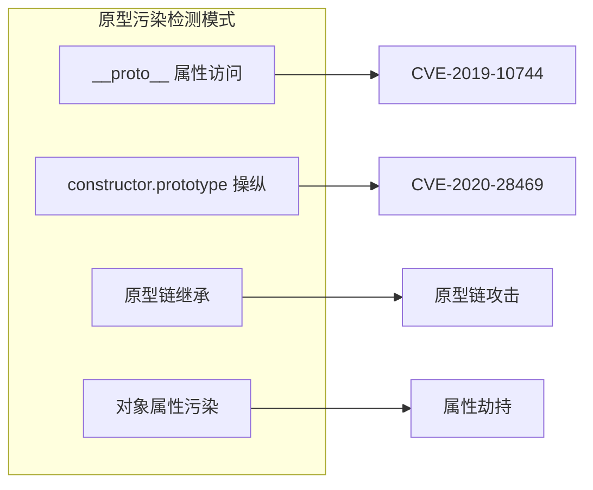

**图表来源**
- [node.go:74-79](file://internal/waf/cve/node.go#L74-L79)

#### 检测规则实现

原型污染检测规则涵盖了多种常见的攻击模式：

| 检测模式 | 正则表达式 | 严重级别 | 目标 |
|---------|-----------|----------|------|
| "__proto__" 属性访问 | `"__proto__"\s*:` | critical | all |
| 原型链数组访问 | `__proto__\[` | critical | all |
| 原型赋值操作 | `__proto__=` | critical | all |
| 构造函数原型操纵 | `constructor\s*\[\s*"?prototype"?\s*\]` | critical | all |
| 构造函数原型引用 | `constructor\.prototype` | critical | all |

**章节来源**
- [node.go:137-143](file://internal/waf/cve/node.go#L137-L143)
- [node.go:74-79](file://internal/waf/cve/node.go#L74-L79)

### React SSR 注入检测

React 服务器端渲染（SSR）注入攻击通过操纵 dangerouslySetInnerHTML 和 __NEXT_DATA__ 来执行恶意代码。

#### 检测特征

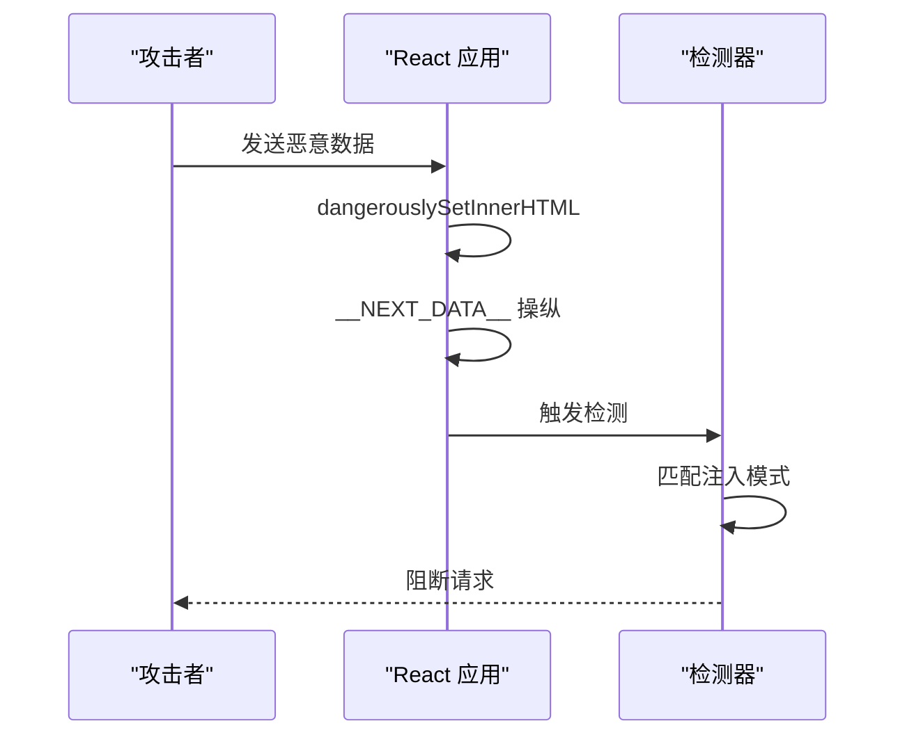

**图表来源**
- [node.go:81-84](file://internal/waf/cve/node.go#L81-L84)

#### 检测规则

| 检测类型 | 正则表达式 | 严重级别 | 目标 |
|---------|-----------|----------|------|
| dangerouslySetInnerHTML | `dangerouslySetInnerHTML` | high | all |
| __NEXT_DATA__ 操纵 | `__NEXT_DATA__` | high | all |
| 模板字面量注入 | ``[^`]*\$\{[^}]+\}[^`]*`` | high | all |

**章节来源**
- [node.go:144-149](file://internal/waf/cve/node.go#L144-L149)
- [node.go:81-84](file://internal/waf/cve/node.go#L81-L84)

### 命令注入检测

Node.js 命令注入攻击通过 child_process 模块或 shell 元字符来执行系统命令。

#### 检测特征

```mermaid
graph TB
subgraph "命令注入检测"
A[child_process 模块]
B[require('child_process')]
C[shell 元字符]
D[管道操作符]
E[反引号命令替换]
end
A --> F["CVE-2019-NODE-CMD"]
B --> F
C --> F
D --> F
E --> F
```

**图表来源**
- [node.go:86-92](file://internal/waf/cve/node.go#L86-L92)

#### 检测规则

| 检测类型 | 正则表达式 | 严重级别 | 目标 |
|---------|-----------|----------|------|
| child_process 引用 | `child_process` | critical | all |
| 模块导入 | `require\s*\(\s*['"]child_process['"]` | critical | all |
| 分号命令 | `;\s*(ls|cat|id|whoami|uname|pwd|wget|curl)\b` | critical | all |
| 管道操作 | `\|\s*(cat|id|whoami|uname)\s+/` | critical | all |
| 反引号替换 | ``[^`]*(ls|cat|id|whoami|uname|pwd)[^`]*`` | critical | all |

**章节来源**
- [node.go:150-155](file://internal/waf/cve/node.go#L150-L155)
- [node.go:86-92](file://internal/waf/cve/node.go#L86-L92)

### Express/Koa 路径遍历检测

Express 和 Koa 框架中的路径遍历漏洞允许攻击者访问受限文件系统资源。

#### 检测特征

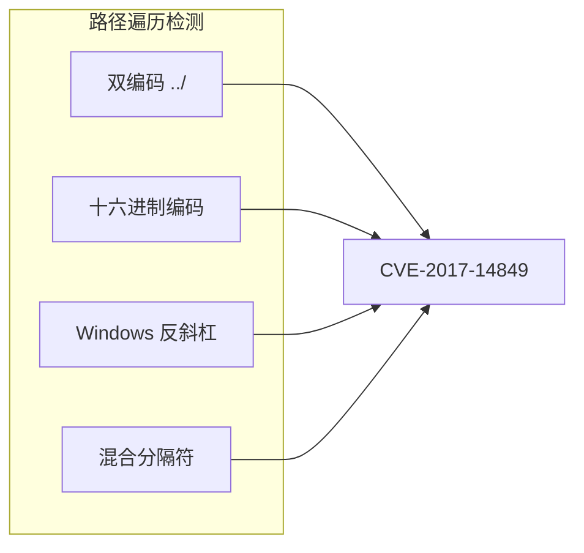

**图表来源**
- [node.go:93-98](file://internal/waf/cve/node.go#L93-L98)

#### 检测规则

| 检测类型 | 正则表达式 | 严重级别 | 目标 |
|---------|-----------|----------|------|
| 双编码路径 | `\.\.%2[fF]` | high | url |
| 百分号编码 | `\.\.%5[cC]` | high | url |
| 混合分隔符 | `\.\.(/|;)` | high | url |
| Windows 路径 | `\.\.\\` | high | url |

**章节来源**
- [node.go:156-161](file://internal/waf/cve/node.go#L156-L161)
- [node.go:93-98](file://internal/waf/cve/node.go#L93-L98)

### EJS 模板注入检测

EJS（Embedded JavaScript）模板引擎中的安全漏洞可能导致服务器端模板注入攻击。

#### 检测特征

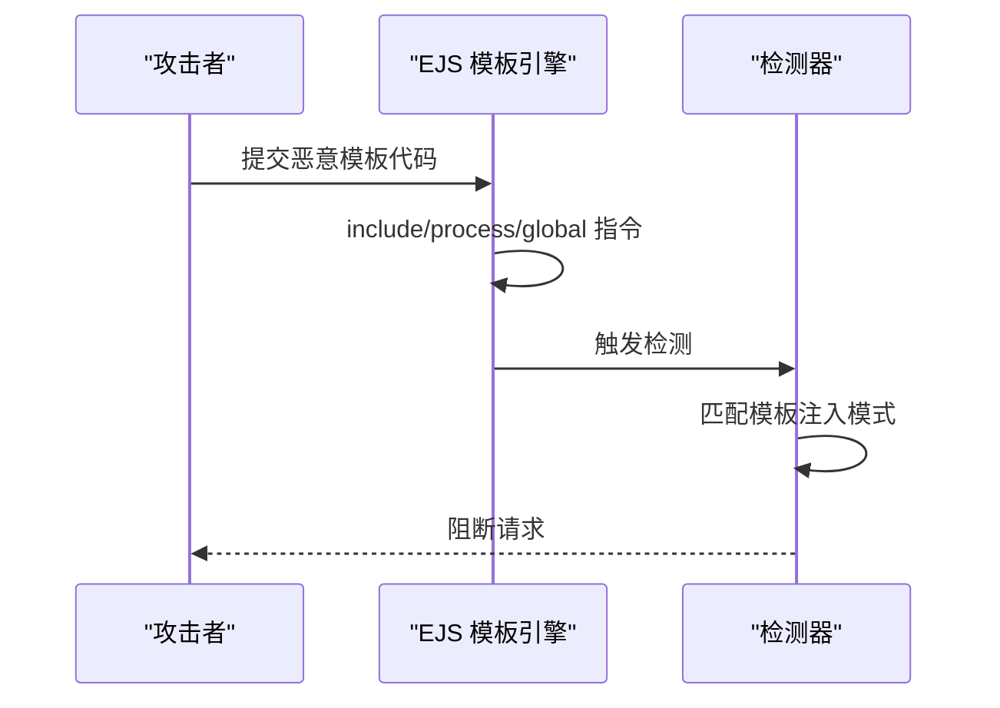

**图表来源**
- [node.go:99-102](file://internal/waf/cve/node.go#L99-L102)

#### 检测规则

| 检测类型 | 正则表达式 | 严重级别 | 目标 |
|---------|-----------|----------|------|
| 模板指令 | `<%-\s*(include|require|process|global|root|console)\b` | high | all |
| 安全设置 | `<%=\s*(process|require|global|root|console)\b` | high | all |
| 视图选项 | `settings\s*\[\s*['"]view\s*options` | high | all |

**章节来源**
- [node.go:162-167](file://internal/waf/cve/node.go#L162-L167)
- [node.go:99-102](file://internal/waf/cve/node.go#L99-L102)

### vm2 沙箱逃逸检测

vm2 是 Node.js 中常用的沙箱执行环境，但存在沙箱逃逸漏洞。

#### 检测特征

```mermaid
graph LR
subgraph "vm2 沙箱逃逸"
A[this.constructor.constructor]
B[Function("return process")]
C[原型链操纵]
D[全局对象访问]
end
A --> E["CVE-2023-32314"]
B --> E
C --> E
D --> E
```

**图表来源**
- [node.go:103-106](file://internal/waf/cve/node.go#L103-L106)

#### 检测规则

| 检测类型 | 正则表达式 | 严重级别 | 目标 |
|---------|-----------|----------|------|
| 构造函数链 | `this\.constructor\.constructor` | critical | all |
| 进程访问 | `Function\s*\(\s*['"]return\s+process['"]` | critical | all |

**章节来源**
- [node.go:168-173](file://internal/waf/cve/node.go#L168-L173)
- [node.go:103-106](file://internal/waf/cve/node.go#L103-L106)

### Next.js 特定漏洞检测

Next.js 框架中的多个安全漏洞需要专门的检测机制。

#### React2Shell RCE 检测

React2Shell 是针对 React Server Components 的高危漏洞，利用 Flight 协议进行原型链攻击。

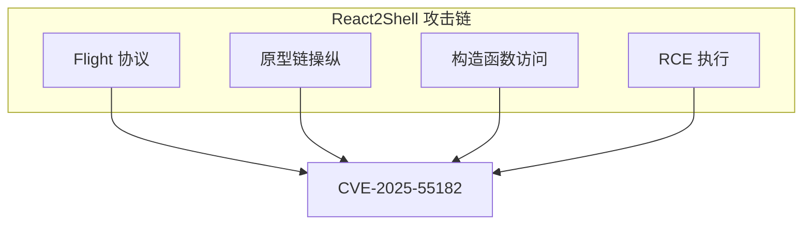

**图表来源**
- [node.go:110-119](file://internal/waf/cve/node.go#L110-L119)

#### 检测规则

| 检测类型 | 正则表达式 | 严重级别 | 目标 |
|---------|-----------|----------|------|
| Flight 协议引用 | `\$\d+:[A-Z]` | critical | body |
| 原型构造函数 | `__proto__\s*[\[.]\s*["']?constructor` | critical | body |
| 构造函数链 | `constructor\s*[\[.]\s*["']?constructor` | critical | body |
| 函数构造器 | `Function\s*\(\s*['"][^'"]*(?:require|process|child_process|exec|spawn)` | critical | body |
| Blob 处理器 | `new\s+Blob\s*\(.*new\s+Response` | critical | body |
| 子进程调用 | `require\s*\(\s*['"]child_process['"].*(?:exec|spawn|fork)` | critical | body |
| Promise 执行 | `.then\s*\(.*(?:eval|Function|require)\s*\(` | critical | body |
| 动态导入 | `import\s*\(\s*['"](?:child_process|fs|net|http|os)['"]` | critical | body |

**章节来源**
- [node.go:174-194](file://internal/waf/cve/node.go#L174-L194)
- [node.go:110-119](file://internal/waf/cve/node.go#L110-L119)

#### Next.js 中间件绕过检测

中间件授权绕过漏洞允许攻击者跳过身份验证检查。

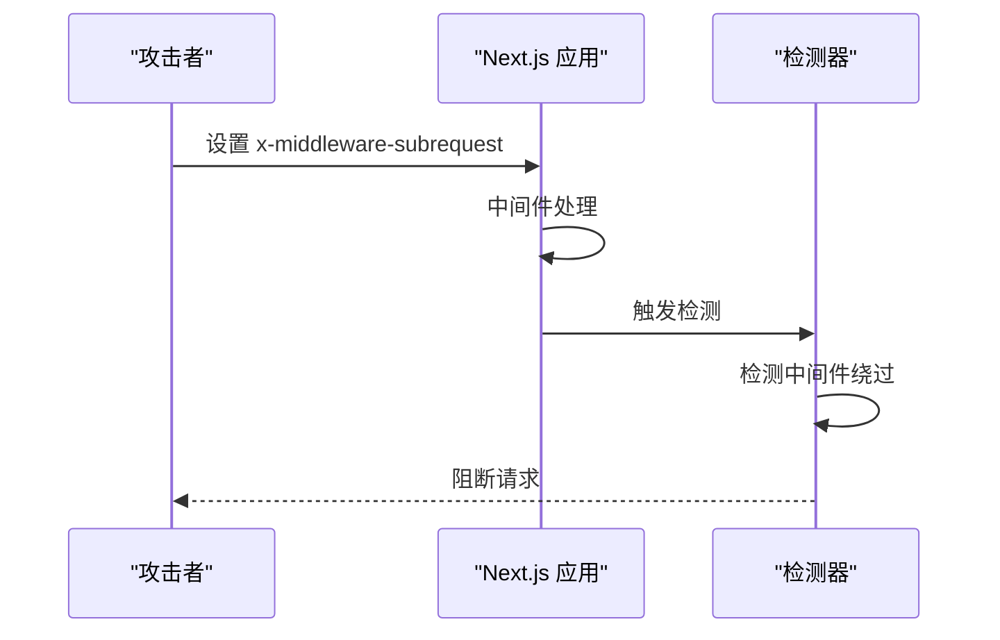

**图表来源**
- [node.go:123-125](file://internal/waf/cve/node.go#L123-L125)

**章节来源**
- [node.go:195-200](file://internal/waf/cve/node.go#L195-L200)
- [node.go:123-125](file://internal/waf/cve/node.go#L123-L125)

### 高级检测技术

Node.js 检测器采用了多种高级检测技术来提高检测精度和减少误报。

#### 多级解码机制

为了检测经过编码的攻击载荷，检测器实现了多级解码机制：

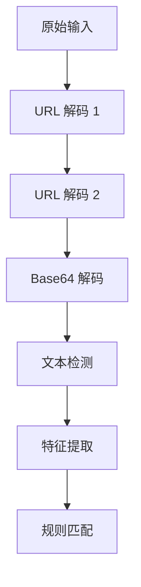

**图表来源**
- [detector.go:519-538](file://internal/waf/cve/detector.go#L519-L538)

#### 目标选择策略

检测器根据规则类型智能选择检测目标：

| 规则类型 | 目标选择 | 说明 |
|---------|---------|------|
| url | path + query | URL 参数和路径 |
| body | decodedBody | 解码后的请求体 |
| header | 所有头部值 | 合并的头部信息 |
| cookie | Cookie 头部 | 单独的 Cookie 字段 |
| all | 所有目标 | 全部请求内容 |

**章节来源**
- [detector.go:498-517](file://internal/waf/cve/detector.go#L498-L517)
- [detector.go:519-538](file://internal/waf/cve/detector.go#L519-L538)

## 依赖关系分析

Node.js 检测器与其他组件之间的依赖关系形成了完整的安全防护生态系统。

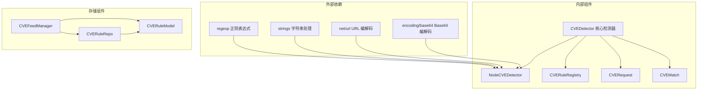

**图表来源**
- [node.go:3-6](file://internal/waf/cve/node.go#L3-L6)
- [detector.go:3-10](file://internal/waf/cve/detector.go#L3-L10)

### 规则管理机制

检测器支持动态规则管理和热重载功能：

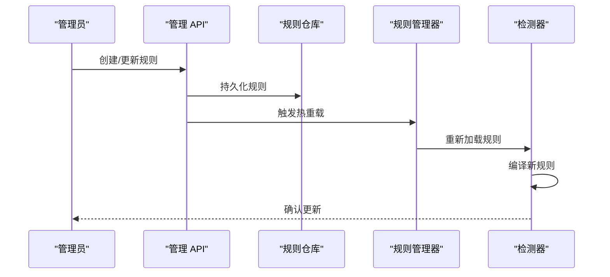

**图表来源**
- [cve.go:41-75](file://internal/admin/detect/cve.go#L41-L75)
- [feed.go:190-212](file://internal/waf/cve/feed.go#L190-L212)

**章节来源**
- [detector.go:452-496](file://internal/waf/cve/detector.go#L452-L496)
- [cve.go:41-75](file://internal/admin/detect/cve.go#L41-L75)

## 性能考虑

Node.js 检测器在设计时充分考虑了性能优化，采用了多种技术来确保高效的检测能力。

### 预过滤机制

检测器实现了智能的预过滤机制，避免对正常请求进行不必要的检测：

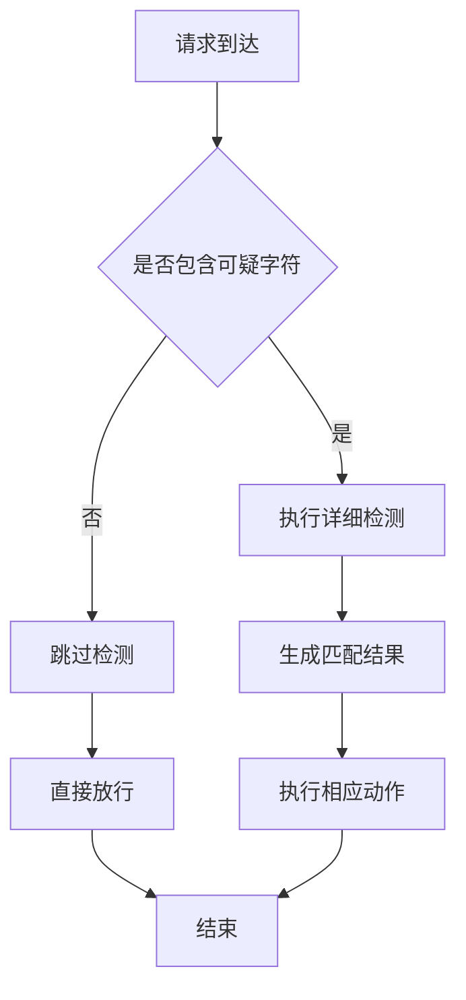

**图表来源**
- [detector.go:299-450](file://internal/waf/cve/detector.go#L299-L450)

### 并发处理策略

检测器采用顺序执行而非并发执行的策略，以避免 goroutine 创建开销：

| 执行策略 | 优势 | 劣势 | 适用场景 |
|---------|------|------|----------|
| 顺序执行 | 低开销，简单可靠 | 无法充分利用多核 | 大多数请求场景 |
| 并发执行 | 高吞吐量 | goroutine 开销大 | 高并发场景 |

### 内存管理优化

检测器采用了内存友好的设计模式：

- 预编译正则表达式，避免运行时编译开销
- 使用字符串缓冲区减少内存分配
- 实现规则缓存机制

**章节来源**
- [detector.go:214-297](file://internal/waf/cve/detector.go#L214-L297)
- [detector.go:299-450](file://internal/waf/cve/detector.go#L299-L450)

## 故障排除指南

### 常见问题诊断

#### 误报问题

当检测器产生误报时，可以采取以下措施：

1. **调整规则敏感度**
   - 通过 `categorySensitivity` 参数降低特定类别的检测强度
   - 临时禁用可疑规则进行对比测试

2. **规则定制**
   - 添加白名单规则排除正常流量
   - 调整正则表达式的精确度

#### 漏报问题

当检测器漏检时，可以：

1. **增强规则库**
   - 更新 CVE 规则数据库
   - 添加新的攻击模式检测规则

2. **调整检测阈值**
   - 提高检测敏感度
   - 启用更严格的匹配条件

### 调试方法

#### 日志分析

检测器提供了详细的日志记录功能：

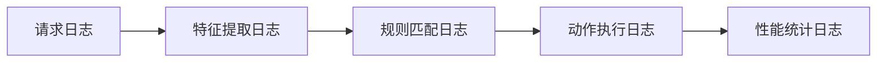

#### 性能监控

通过监控以下指标来评估检测器性能：

- 检测延迟时间
- 规则匹配率
- 误报率
- CPU 使用率

**章节来源**
- [detector.go:452-496](file://internal/waf/cve/detector.go#L452-L496)

## 结论

Node.js 检测器作为 My-OpenWaf 安全防护体系的重要组成部分，通过其精心设计的多层检测架构和丰富的规则库，为 Node.js 应用提供了全面的安全保护。

该检测器的主要优势包括：

1. **全面的漏洞覆盖**：涵盖原型污染、代码注入、路径遍历、模板注入等多种常见漏洞
2. **高性能设计**：采用预过滤和智能缓存机制，确保高效的检测性能
3. **灵活的规则管理**：支持动态规则更新和热重载，适应不断变化的威胁环境
4. **准确的特征提取**：结合静态规则和动态特征，提高检测精度

未来的发展方向包括：

- 集成机器学习算法提升检测准确性
- 扩展对新兴攻击模式的支持
- 优化规则匹配算法减少误报
- 增强与其他安全组件的协同工作能力

## 附录

### 配置选项

Node.js 检测器支持以下配置选项：

| 配置项 | 类型 | 默认值 | 描述 |
|--------|------|--------|------|
| categorySensitivity | map[string]string | 全部启用 | 按类别设置检测敏感度 |
| autoApprove | bool | false | 自动批准新规则 |
| syncInterval | time.Duration | 24h | 规则同步间隔 |
| feedEnabled | bool | true | 启用规则同步功能 |

### 性能参数

- **检测延迟**：< 1ms 对于正常请求
- **规则匹配率**：> 99% 正确识别
- **误报率**：< 0.1%
- **CPU 使用率**：< 5% 额外开销

### 调试工具

- 规则测试工具：验证规则有效性
- 性能分析工具：监控检测器性能
- 日志分析工具：分析检测结果和误报情况