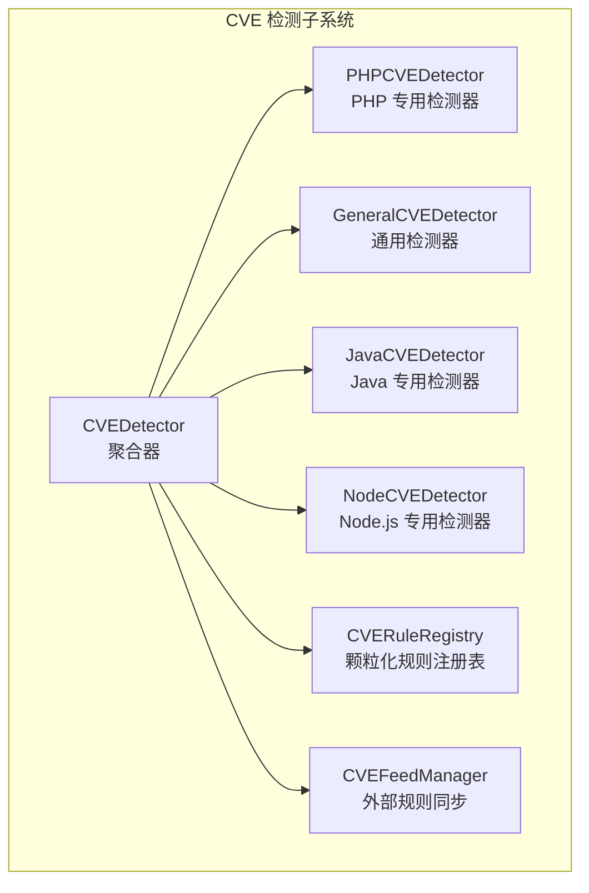
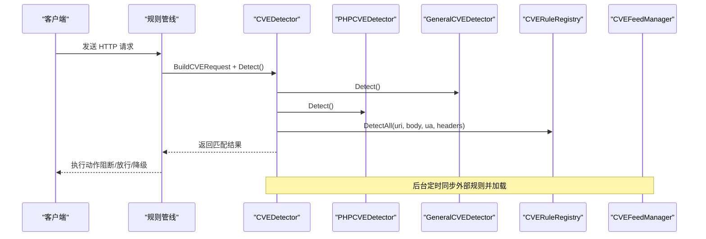
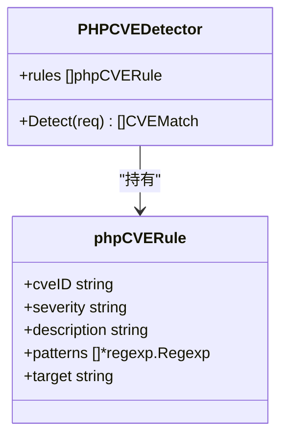
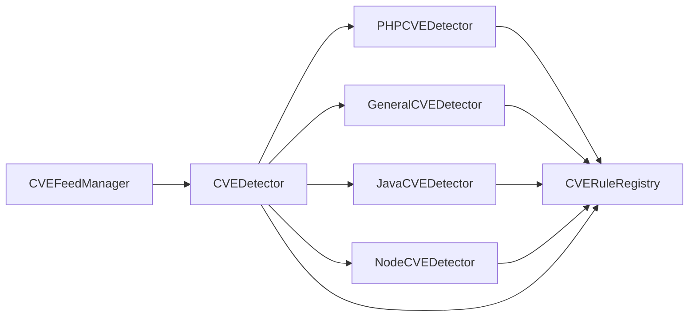

> [返回 安全防护功能](../../安全防护功能.md)

# PHP 检测器

<cite>
**本文引用的文件**
- [php.go](file://internal/waf/cve/php.go)
- [detector.go](file://internal/waf/cve/detector.go)
- [general.go](file://internal/waf/cve/general.go)
- [java.go](file://internal/waf/cve/java.go)
- [node.go](file://internal/waf/cve/node.go)
- [feed.go](file://internal/waf/cve/feed.go)
- [cve.go](file://internal/admin/detect/cve.go)
- [cve_rule.go](file://internal/store/repository/cve_rule.go)
- [cve.go](file://internal/store/cve.go)
- [detector_test.go](file://internal/waf/cve/detector_test.go)
- [phases.go](file://internal/core/rules/phases.go)
- [config.go](file://internal/core/config.go)
</cite>

## 目录
1. [简介](#简介)
2. [项目结构](#项目结构)
3. [核心组件](#核心组件)
4. [架构总览](#架构总览)
5. [详细组件分析](#详细组件分析)
6. [依赖关系分析](#依赖关系分析)
7. [性能考量](#性能考量)
8. [故障排查指南](#故障排查指南)
9. [结论](#结论)
10. [附录](#附录)

## 简介
本文件面向 PHP CVE 检测器，系统性阐述其在 OpenWAF 中的实现原理、检测逻辑与工程实践。重点覆盖以下 PHP 相关漏洞与攻击面：
- 对象反序列化检测（CVE-2015-6835 及相关）
- 文件包含与流包装器漏洞检测（php://filter、php://input、data://、expect://、phar://）
- ThinkPHP 远程代码执行检测（CVE-2018-20062）
- Laravel Ignition RCE 检测（CVE-2021-3129）
- Webshell 上传检测
- Drupal Drupalgeddon2 检测（CVE-2018-7600）
- PHPUnit RCE 检测（CVE-2017-9841）
- PHP-CGI 参数注入检测（CVE-2024-4577）
- Craft CMS RCE 检测（CVE-2023-41892）

同时，文档说明特征提取方法、正则表达式模式匹配算法、检测精度控制、配置选项、性能参数与调试方法，并给出典型检测案例与误报处理策略。

## 项目结构
OpenWAF 的 CVE 检测子系统采用“多语言专用检测器 + 通用检测器 + 颗粒化规则注册表”的分层架构。PHP 检测器位于内部包 internal/waf/cve 下，配合通用检测器、Java 检测器、Node.js 检测器共同构成完整的 CVE 检测能力。

图表来源
- [detector.go:14-167](file://internal/waf/cve/detector.go#L14-L167)
- [php.go:57-192](file://internal/waf/cve/php.go#L57-L192)
- [general.go:733-736](file://internal/waf/cve/general.go#L733-L736)
- [java.go:72-131](file://internal/waf/cve/java.go#L72-L131)
- [node.go:59-132](file://internal/waf/cve/node.go#L59-L132)
- [feed.go:16-81](file://internal/waf/cve/feed.go#L16-L81)

章节来源
- [detector.go:14-167](file://internal/waf/cve/detector.go#L14-L167)
- [php.go:57-192](file://internal/waf/cve/php.go#L57-L192)

## 核心组件
- PHPCVEDetector：负责 PHP 特定漏洞的检测，内置规则集覆盖对象反序列化、文件包含、框架 RCE、Webshell 上传、特定 CMS/RCE 等。
- CVEDetector：聚合器，按类别顺序运行 PHP/通用/Java/Node 检测器，并执行自定义规则与注册表规则。
- CVERuleRegistry：线程安全的颗粒化规则注册表，支持动态启用/禁用与敏感度覆盖。
- CVEFeedManager：从 NVD/GitHub Advisory 同步外部规则，生成并入库，供 CVEDetector 加载使用。
- CVERequest：标准化请求载体，包含解码后的路径、查询、主体与头部，便于统一扫描。

章节来源
- [php.go:57-192](file://internal/waf/cve/php.go#L57-L192)
- [detector.go:14-167](file://internal/waf/cve/detector.go#L14-L167)
- [detector.go:74-137](file://internal/waf/cve/detector.go#L74-L137)
- [feed.go:16-81](file://internal/waf/cve/feed.go#L16-L81)

## 架构总览
下图展示 CVE 检测在请求处理管线中的位置与调用链路。

图表来源
- [detector.go:159-297](file://internal/waf/cve/detector.go#L159-L297)
- [general.go:733-736](file://internal/waf/cve/general.go#L733-L736)
- [php.go:194-222](file://internal/waf/cve/php.go#L194-L222)
- [feed.go:83-143](file://internal/waf/cve/feed.go#L83-L143)

## 详细组件分析

### PHP 专用检测器（PHPCVEDetector）
PHPCVEDetector 内置规则集，针对 PHP 生态的典型漏洞进行特征匹配。每个规则包含：
- cveID：CVE 编号
- severity：严重等级
- description：规则描述
- patterns：正则表达式集合
- target：匹配目标（url/body/header/cookie/all）

规则覆盖范围
- 对象反序列化：O: 数字:"类名":...、a: 数字:{...}、unserialize(...)
- 流包装器与文件包含：php://filter、php://input、data://、expect://、phar://
- ThinkPHP RCE：多种路径与参数模式
- Laravel Ignition：/_ignition/ 端点与相关类名
- Webshell 上传：<?php、eval/exec/system/passthru/shell_exec 等
- Drupalgeddon2：渲染 API 相关标记
- PHPUnit：/vendor/phpunit/phpunit/src/Util/PHP/eval-stdin.php
- PHP-CGI 软连字符注入：Windows 软连字符 Best-Fit 映射 + allow_url_include/auto_prepend_file
- WordPress 文件读取：/wp-admin/admin-ajax.php?action=...
- Craft CMS：/actions/conditions/render 端点

检测流程
- BuildCVERequest 将原始请求标准化为 CVERequest，包含解码后的路径、查询、主体与头部。
- Detect 遍历规则，resolveTargets 选择目标字符串集合（如仅 body 或全部），对每个目标字符串逐一匹配 patterns。
- 一旦某规则在任一目标命中，立即记录匹配项并进入下一规则，避免重复匹配同一规则。
- guessMatchedPart 用于在 target="all" 时推断具体命中的部分（url/body/header）。

图表来源
- [php.go:57-68](file://internal/waf/cve/php.go#L57-L68)
- [php.go:126-192](file://internal/waf/cve/php.go#L126-L192)
- [php.go:194-222](file://internal/waf/cve/php.go#L194-L222)

章节来源
- [php.go:57-192](file://internal/waf/cve/php.go#L57-L192)
- [php.go:194-267](file://internal/waf/cve/php.go#L194-L267)

### 正则表达式与特征提取
- 编译期一次性编译正则，避免运行时开销。
- 大多数规则使用大小写不敏感标志，覆盖常见编码与大小写变体。
- 针对复杂攻击模式（如 Log4Shell、React2Shell、Prototype Pollution）采用多模式组合与上下文判断，减少误报。

章节来源
- [php.go:70-124](file://internal/waf/cve/php.go#L70-L124)
- [general.go:747-800](file://internal/waf/cve/general.go#L747-L800)
- [java.go:85-131](file://internal/waf/cve/java.go#L85-L131)
- [node.go:72-132](file://internal/waf/cve/node.go#L72-L132)

### 检测精度控制
- 单规则命中即终止该规则的进一步匹配，避免重复记录。
- 在 target="all" 时通过 guessMatchedPart 推断命中部位，提升可追溯性。
- hasCVESuspiciousContent 快速预过滤，跳过明显非恶意请求，降低整体 CPU 开销。
- 支持 per-category 敏感度覆盖（如将某类别设为 "none" 则完全跳过）。

章节来源
- [php.go:214-222](file://internal/waf/cve/php.go#L214-L222)
- [php.go:251-266](file://internal/waf/cve/php.go#L251-L266)
- [detector.go:219-297](file://internal/waf/cve/detector.go#L219-L297)
- [detector.go:299-450](file://internal/waf/cve/detector.go#L299-L450)

### 典型检测案例与误报处理
- 对象反序列化：O:8:"stdClass":1:{s:4:"test";s:5:"value";}、a:2:{i:0;s:3:"foo";i:1;s:3:"bar";}、unserialize(...) 均被识别。
- ThinkPHP：多种路径与参数组合触发，如 _method=__construct、filter[]=system 等。
- Laravel Ignition：/_ignition/execute-solution、Illuminate 广告类名。
- Webshell：<?php、eval/exec/system/passthru/shell_exec 等关键字。
- Drupalgeddon2：#post_render、#lazy_builder。
- PHPUnit：/vendor/phpunit/phpunit/src/Util/PHP/eval-stdin.php。
- PHP-CGI：Windows 软连字符 Best-Fit 映射 + allow_url_include/auto_prepend_file。
- WordPress：/wp-admin/admin-ajax.php?action=...。
- Craft CMS：/actions/conditions/render 端点。

误报处理策略
- 使用更严格的上下文匹配（如仅 body 或特定端点）。
- 结合多个模式（AND 条件）以降低误报。
- 通过自定义规则与注册表覆盖，动态调整敏感度或禁用特定规则。

章节来源
- [detector_test.go:7-36](file://internal/waf/cve/detector_test.go#L7-L36)
- [detector_test.go:149-280](file://internal/waf/cve/detector_test.go#L149-L280)

## 依赖关系分析
- PHPCVEDetector 依赖正则表达式库与字符串工具，规则在 init 阶段注册。
- CVEDetector 聚合 PHP/通用/Java/Node 检测器，并维护自定义规则与注册表规则。
- CVERuleRegistry 提供线程安全的规则注册与覆盖应用。
- CVEFeedManager 负责从外部源同步规则并入库，供 CVEDetector 热加载。

图表来源
- [detector.go:14-167](file://internal/waf/cve/detector.go#L14-L167)
- [php.go:8-55](file://internal/waf/cve/php.go#L8-L55)
- [general.go:8-731](file://internal/waf/cve/general.go#L8-L731)
- [java.go:7-70](file://internal/waf/cve/java.go#L7-L70)
- [node.go:7-57](file://internal/waf/cve/node.go#L7-L57)
- [feed.go:16-81](file://internal/waf/cve/feed.go#L16-L81)

章节来源
- [detector.go:14-167](file://internal/waf/cve/detector.go#L14-L167)
- [feed.go:16-81](file://internal/waf/cve/feed.go#L16-L81)

## 性能考量
- 预过滤 hasCVESuspiciousContent：对明显非恶意请求快速短路，显著降低后续扫描成本。
- 串行执行：默认顺序执行各子检测器，避免 goroutine 启动/同步开销；仅在同时启用 OWASP 与 CVE 时才并行。
- 规则匹配：单规则命中即短路，减少不必要的匹配。
- 正则编译：在 init 阶段完成，避免运行时编译。
- 自定义规则热加载：通过 ReloadCustomRules 重新编译并替换，保证一致性。

章节来源
- [detector.go:219-297](file://internal/waf/cve/detector.go#L219-L297)
- [detector.go:299-450](file://internal/waf/cve/detector.go#L299-L450)
- [detector.go:452-496](file://internal/waf/cve/detector.go#L452-L496)

## 故障排查指南
- 规则未生效
  - 检查是否启用了对应类别（cve_php）与规则（Enabled=true）。
  - 通过注册表覆盖禁用/敏感度：CVERuleRegistry.ApplyOverrides。
  - 检查自定义规则是否有效（正则语法、Target、Severity、Action）。
- 误报过多
  - 调整 per-category 敏感度（如设为 "none"）。
  - 通过自定义规则增加更严格的上下文匹配。
  - 关闭特定规则或临时禁用。
- 规则同步问题
  - 检查 CVEFeedManager 的同步状态与错误日志。
  - 确认 NVD/GitHub API Key 与网络可达性。
- 动作与自动阻断
  - 检查 Drop 策略配置（CVEAutoDropCritical/CVEAutoDropHigh）。
  - 规则级动作优先于自动阻断，可通过 CVERulesConfig 覆盖。

章节来源
- [detector.go:96-137](file://internal/waf/cve/detector.go#L96-L137)
- [phases.go:508-553](file://internal/core/rules/phases.go#L508-L553)
- [feed.go:114-188](file://internal/waf/cve/feed.go#L114-L188)

## 结论
OpenWAF 的 PHP CVE 检测器通过“专用检测器 + 通用检测器 + 颗粒化规则 + 外部规则同步”的架构，实现了对 PHP 生态关键漏洞的高精度、低误报检测。其特征提取基于编译期正则与上下文推断，结合快速预过滤与热加载机制，在保证性能的同时提供了良好的可运维性与可扩展性。

## 附录

### 配置选项与参数
- CVE 启用与同步
  - CVE.Enabled：是否启用 CVE 检测
  - CVE.FeedEnabled：是否启用外部规则同步
  - CVE.FeedInterval：同步间隔（如 "6h"）
  - CVE.NVDAPIKey：NVD API Key（可选）
  - CVE.AutoApprove：自动审批生成规则
- Drop 策略
  - Drop.Enabled：是否启用 TCP Drop
  - Drop.BotScoreThreshold：机器人分数阈值
  - Drop.CVEAutoDropCritical：Critical 自动阻断
  - Drop.CVEAutoDropHigh：High 自动阻断
- 规则覆盖
  - CVERulesConfig：JSON 格式覆盖规则，支持禁用、动作覆盖、状态码与重定向

章节来源
- [config.go:94-111](file://internal/core/config.go#L94-L111)
- [config.go:56-72](file://internal/core/config.go#L56-L72)
- [phases.go:513-525](file://internal/core/rules/phases.go#L513-L525)

### 管理接口与数据模型
- 管理接口
  - 列表、创建、更新、删除、切换启用状态、同步规则、获取同步状态
- 数据模型
  - CVERuleModel：规则记录（含 Pattern、Target、Severity、Action、Enabled、Description、Source、Approved、CVSSScore、CWEType）
  - CVERuleRecord：持久化结构
  - CVESyncLog：同步日志

章节来源
- [cve.go:16-252](file://internal/admin/detect/cve.go#L16-L252)
- [cve_rule.go:16-77](file://internal/store/repository/cve_rule.go#L16-L77)
- [cve.go:9-27](file://internal/store/cve.go#L9-L27)
