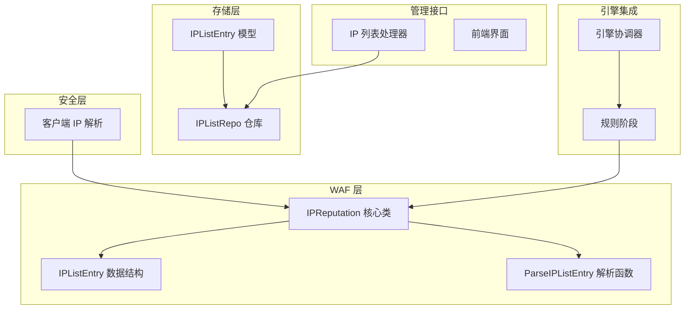
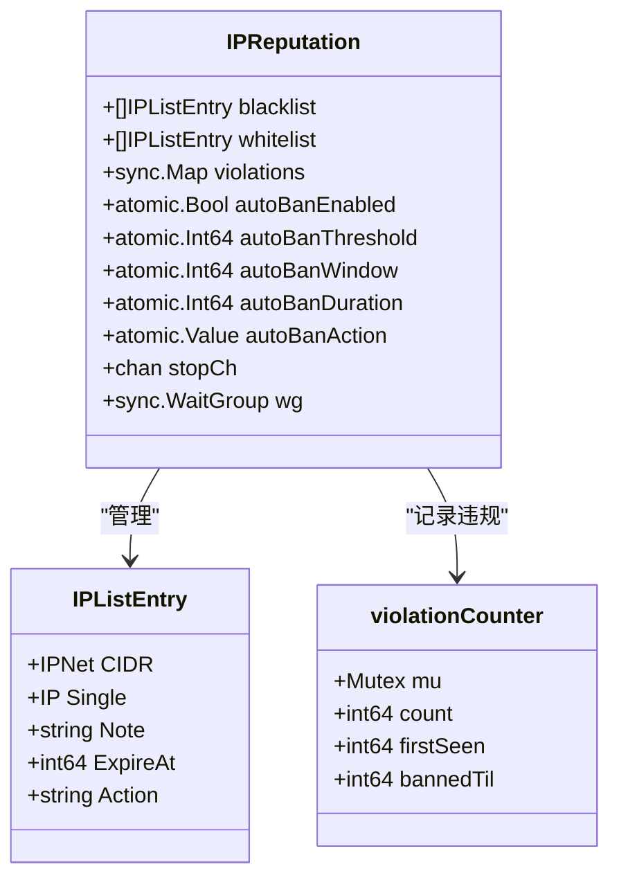
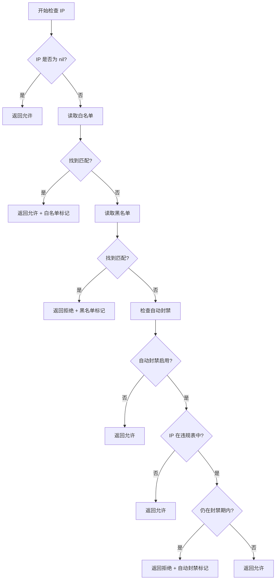
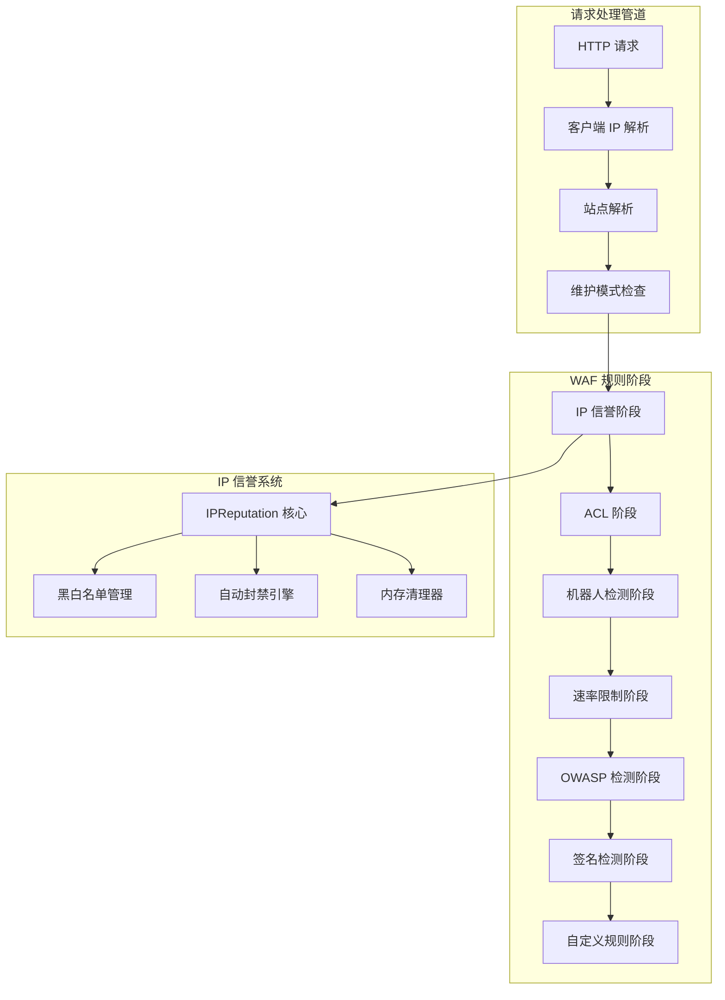
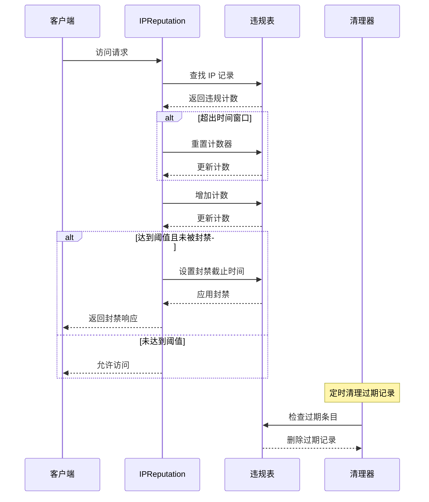
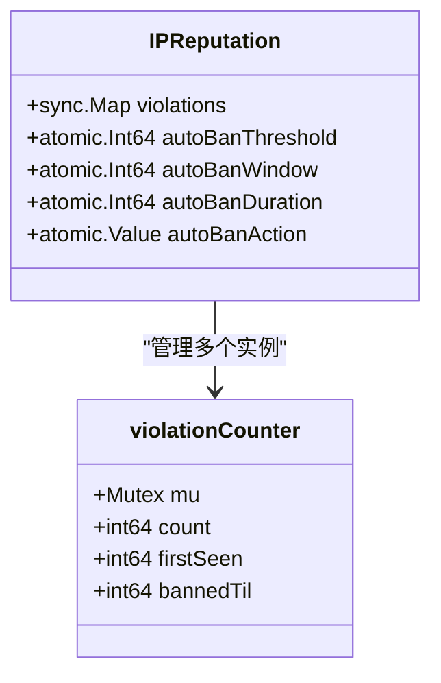
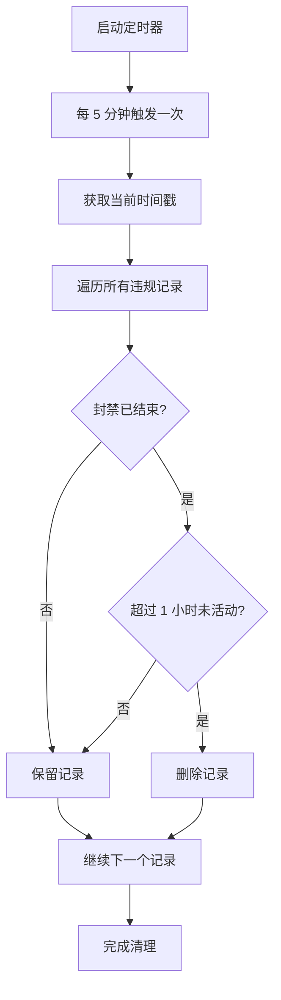
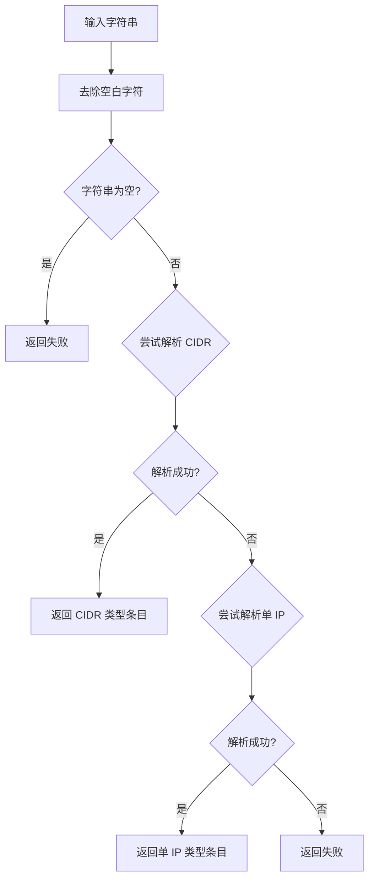
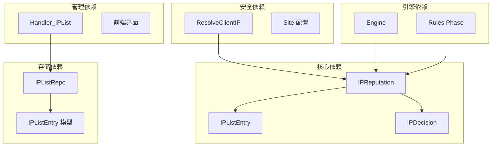
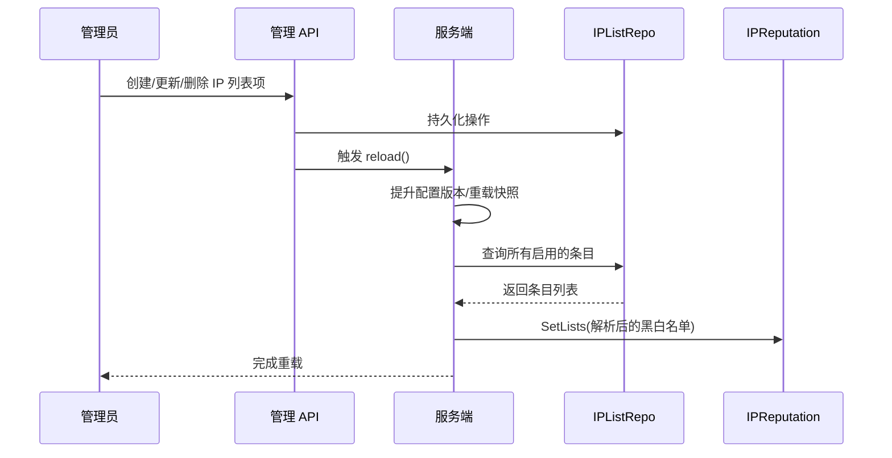

> [返回 安全防护功能](安全防护功能.md)

# IP 信誉系统

<cite>
**本文引用的文件**
- [iprep.go](file://internal/waf/iprep/iprep.go)
- [iprep_test.go](file://internal/waf/iprep/iprep_test.go)
- [ip_list.go](file://internal/store/ip_list.go)
- [ip_list.go](file://internal/store/repository/ip_list.go)
- [iplist.go](file://internal/admin/system/iplist.go)
- [clientip.go](file://internal/security/clientip.go)
- [engine.go](file://internal/core/engine/engine.go)
- [phases.go](file://internal/core/rules/phases.go)
- [IP 信誉系统.md](file://docs/安全防护功能/IP 信誉系统.md)
- [IP 信誉检查阶段.md](file://docs/WAF 引擎系统/处理阶段详解/IP 信誉检查阶段.md)
- [客户端 IP 获取.md](file://docs/安全机制/客户端 IP 获取.md)
</cite>

## 目录
1. [简介](#简介)
2. [项目结构](#项目结构)
3. [核心组件](#核心组件)
4. [架构概览](#架构概览)
5. [详细组件分析](#详细组件分析)
6. [依赖关系分析](#依赖关系分析)
7. [性能考虑](#性能考虑)
8. [故障排除指南](#故障排除指南)
9. [结论](#结论)
10. [附录](#附录)

## 简介
IP 信誉系统是 OpenWAF 的核心安全组件之一，负责管理 IP 黑名单和白名单，以及实现智能的自动封禁机制。该系统通过多层决策流程确保网络安全，同时提供灵活的配置选项和高效的内存管理策略。

系统的主要功能包括：
- IP 地址和 CIDR 网段的精确匹配
- 白名单优先级处理（允许通行）
- 黑名单阻断处理（拒绝访问）
- 基于违规次数的自动封禁机制
- 智能内存清理和过期条目管理
- 支持 IPv4 和 IPv6 双栈协议

## 项目结构
IP 信誉系统在项目中的组织结构如下：



**图表来源**
- [iprep.go:1-242](file://internal/waf/iprep/iprep.go#L1-L242)
- [ip_list.go:1-29](file://internal/store/ip_list.go#L1-L29)
- [ip_list.go:1-42](file://internal/store/repository/ip_list.go#L1-L42)
- [iplist.go:1-146](file://internal/admin/system/iplist.go#L1-L146)

**章节来源**
- [iprep.go:1-242](file://internal/waf/iprep/iprep.go#L1-L242)
- [ip_list.go:1-29](file://internal/store/ip_list.go#L1-L29)
- [ip_list.go:1-42](file://internal/store/repository/ip_list.go#L1-L42)
- [iplist.go:1-146](file://internal/admin/system/iplist.go#L1-L146)

## 核心组件

### IPListEntry 结构体设计
IPListEntry 是系统的核心数据结构，用于表示单个 IP 或 CIDR 条目：



**图表来源**
- [iprep.go:10-42](file://internal/waf/iprep/iprep.go#L10-L42)

系统支持以下关键特性：
- **CIDR 支持**：通过 `CIDR` 字段支持网段匹配
- **单 IP 支持**：通过 `Single` 字段支持精确 IP 匹配  
- **注释功能**：`Note` 字段提供描述信息
- **过期机制**：`ExpireAt` 字段支持临时条目管理
- **动作类型**：`Action` 字段支持拦截(intercept)或丢弃(drop)两种动作

**章节来源**
- [iprep.go:10-17](file://internal/waf/iprep/iprep.go#L10-L17)
- [ip_list.go:16-28](file://internal/store/ip_list.go#L16-L28)
- [iprep_test.go:8-20](file://internal/waf/iprep/iprep_test.go#L8-L20)

### IP 决策流程
系统采用三层决策流程，具有明确的优先级：



**图表来源**
- [iprep.go:94-125](file://internal/waf/iprep/iprep.go#L94-L125)

决策优先级：
1. **白名单优先**：匹配到白名单直接放行
2. **黑名单阻断**：匹配到黑名单直接拒绝
3. **自动封禁检查**：未匹配到黑白名单时检查违规状态

**章节来源**
- [iprep.go:94-125](file://internal/waf/iprep/iprep.go#L94-L125)
- [phases.go:200-240](file://internal/core/rules/phases.go#L200-L240)

## 架构概览
IP 信誉系统在整个 WAF 架构中的位置：



**图表来源**
- [engine.go:37-74](file://internal/core/engine/engine.go#L37-L74)
- [phases.go:200-240](file://internal/core/rules/phases.go#L200-L240)

**章节来源**
- [engine.go:37-74](file://internal/core/engine/engine.go#L37-L74)
- [phases.go:200-240](file://internal/core/rules/phases.go#L200-L240)

## 详细组件分析

### 自动封禁机制
自动封禁机制是系统的核心安全特性，采用滑动窗口计数算法：



**图表来源**
- [iprep.go:127-150](file://internal/waf/iprep/iprep.go#L127-L150)
- [iprep.go:209-231](file://internal/waf/iprep/iprep.go#L209-L231)

#### 关键参数配置
| 参数 | 默认值 | 单位 | 说明 |
|------|--------|------|------|
| autoBanThreshold | 10 | 次数 | 触发封禁的违规次数阈值 |
| autoBanWindow | 60 | 秒 | 计数时间窗口长度 |
| autoBanDuration | 3600 | 秒 | 封禁持续时间 |

#### 违规计数器结构


**图表来源**
- [iprep.go:34-39](file://internal/waf/iprep/iprep.go#L34-L39)

**章节来源**
- [iprep.go:127-150](file://internal/waf/iprep/iprep.go#L127-L150)
- [iprep.go:209-231](file://internal/waf/iprep/iprep.go#L209-L231)

### 内存清理机制
系统实现了智能的内存清理策略，防止内存泄漏：



**图表来源**
- [iprep.go:209-231](file://internal/waf/iprep/iprep.go#L209-L231)

清理条件：
- 封禁时间已过期
- 距离最后活动时间超过 3600 秒（1 小时）

**章节来源**
- [iprep.go:209-231](file://internal/waf/iprep/iprep.go#L209-L231)

### ParseIPListEntry 函数
该函数负责将字符串解析为 IPListEntry 对象：



**图表来源**
- [iprep.go:186-207](file://internal/waf/iprep/iprep.go#L186-L207)

支持的输入格式：
- **CIDR 格式**：如 `192.168.1.0/24`、`10.0.0.0/8`
- **单 IP 格式**：如 `192.168.1.1`、`::1`
- **IPv6 支持**：完全支持 IPv6 地址

**章节来源**
- [iprep.go:186-207](file://internal/waf/iprep/iprep.go#L186-L207)
- [iprep_test.go:8-20](file://internal/waf/iprep/iprep_test.go#L8-L20)

## 依赖关系分析

### 组件耦合度


**图表来源**
- [engine.go:37-74](file://internal/core/engine/engine.go#L37-L74)
- [phases.go:200-240](file://internal/core/rules/phases.go#L200-L240)

### 外部依赖
系统对外部组件的依赖关系：
- **net 包**：网络地址解析和 CIDR 操作
- **sync 包**：并发安全的数据结构
- **time 包**：时间戳管理和定时任务
- **gorm**：数据库 ORM 映射

**章节来源**
- [engine.go:1-308](file://internal/core/engine/engine.go#L1-L308)
- [phases.go:1-800](file://internal/core/rules/phases.go#L1-L800)

## 性能考虑

### 时间复杂度分析
- **IP 匹配操作**：O(n) - 需要遍历黑白名单数组
- **自动封禁检查**：O(1) - 使用 sync.Map 进行快速查找
- **内存清理**：O(m) - m 为当前活跃违规记录数量

### 内存使用优化
1. **懒加载机制**：违规记录仅在需要时创建
2. **智能清理**：定期清理过期记录，防止内存泄漏
3. **原子操作**：使用原子类型减少锁竞争
4. **并发安全**：使用 RWMutex 实现读写分离

### 并发安全性
系统采用多层次的并发保护：
- **读写分离**：黑白名单使用 RWMutex
- **原子操作**：配置参数使用原子类型
- **互斥锁**：违规计数器使用 Mutex
- **无锁数据结构**：sync.Map 提供高性能并发访问

## 故障排除指南

### 常见问题诊断

#### 1. IP 匹配不生效
**可能原因**：
- IP 地址格式错误
- CIDR 范围配置不当
- 过期条目被忽略

**解决方法**：
- 使用 `ParseIPListEntry` 函数验证格式
- 检查 `ExpireAt` 字段是否正确设置
- 确认 IP 地址与目标网络匹配

#### 2. 自动封禁不工作
**可能原因**：
- 自动封禁功能未启用
- 配置参数设置不当
- 违规计数器异常

**解决方法**：
- 检查 `ConfigureAutoBan` 方法调用
- 验证阈值、窗口和持续时间设置
- 查看 `ActiveBans()` 方法输出

#### 3. 内存泄漏问题
**症状**：系统运行时间越长，内存占用越大

**解决方法**：
- 检查清理器是否正常运行
- 验证过期时间设置是否合理
- 监控 `ActiveBans()` 输出确认记录清理

**章节来源**
- [iprep.go:209-231](file://internal/waf/iprep/iprep.go#L209-L231)
- [iprep_test.go:1-21](file://internal/waf/iprep/iprep_test.go#L1-L21)

## 结论
IP 信誉系统通过精心设计的架构和算法，提供了高效、可靠的 IP 地址管理能力。系统的主要优势包括：

1. **多层决策机制**：白名单优先、黑名单阻断、自动封禁的三层防护
2. **灵活的配置选项**：支持多种 IP 地址格式和动态配置更新
3. **智能内存管理**：自动清理过期记录，防止内存泄漏
4. **高并发性能**：采用原子操作和并发安全的数据结构
5. **完整的生命周期管理**：从创建到销毁的完整管理流程

该系统为 OpenWAF 提供了坚实的安全基础，能够有效应对各种网络威胁和攻击场景。

## 附录

### 配置最佳实践

#### 自动封禁配置建议
| 使用场景 | 阈值 | 窗口(秒) | 持续时间(秒) | 说明 |
|----------|------|----------|--------------|------|
| 开发环境 | 3-5 | 60 | 300 | 快速响应，便于测试 |
| 生产环境 | 10-20 | 60-120 | 3600-7200 | 平衡安全性和用户体验 |
| 高风险环境 | 5-10 | 30-60 | 7200-14400 | 更严格的防护策略 |

#### IP 地址管理建议
1. **白名单配置**：
   - 仅包含受信任的源 IP
   - 使用最小权限原则
   - 定期审查和更新

2. **黑名单配置**：
   - 基于威胁情报更新
   - 包含已知恶意 IP 和网段
   - 设置合理的过期时间

3. **CIDR 使用建议**：
   - 优先使用更精确的网段
   - 避免使用过于宽泛的网段
   - 定期优化网段范围

### API 使用示例

#### 基本使用流程
```go
// 创建 IP 信誉实例
rep := NewIPReputation()
defer rep.Close()

// 配置自动封禁
rep.ConfigureAutoBan(true, 10, 60, 3600)

// 设置黑白名单
rep.SetLists(blacklist, whitelist)

// 检查 IP
decision := rep.Check(clientIP)
if !decision.Allowed {
    // 处理拒绝逻辑
}

// 记录违规
rep.RecordViolation(clientIP)
```

#### 配置管理
```go
// 通过 API 管理 IP 列表
repo := NewIPListRepo(db)
entries, total, err := repo.List(offset, limit, kind)
```

**章节来源**
- [iprep.go:41-55](file://internal/waf/iprep/iprep.go#L41-L55)
- [iplist.go:15-29](file://internal/admin/system/iplist.go#L15-L29)

### 动态更新机制和热重载
系统支持实时的配置更新和热重载机制：



**图表来源**
- [IP 信誉检查阶段.md:251-266](file://docs/WAF 引擎系统/处理阶段详解/IP 信誉检查阶段.md#L251-L266)

动态更新特点：
- **实时生效**：管理员操作后立即生效
- **数据持久化**：所有变更都保存到数据库
- **配置版本控制**：通过版本提升确保一致性
- **跨节点同步**：通过 Redis Pub/Sub 同步到其他节点

**章节来源**
- [IP 信誉检查阶段.md:240-266](file://docs/WAF 引擎系统/处理阶段详解/IP 信誉检查阶段.md#L240-L266)
- [iplist.go:47-77](file://internal/admin/system/iplist.go#L47-L77)
- [iplist.go:80-114](file://internal/admin/system/iplist.go#L80-L114)
- [iplist.go:128-145](file://internal/admin/system/iplist.go#L128-L145)
