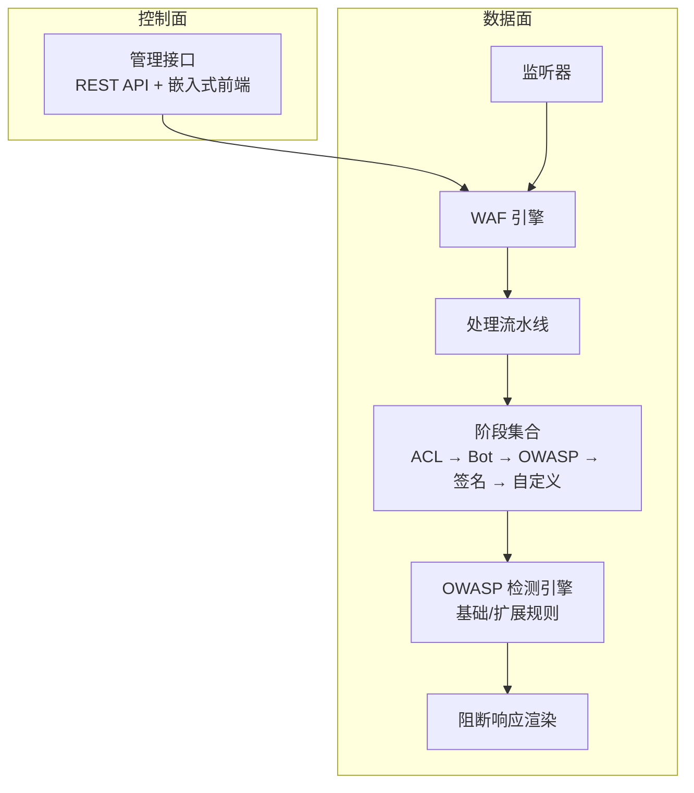
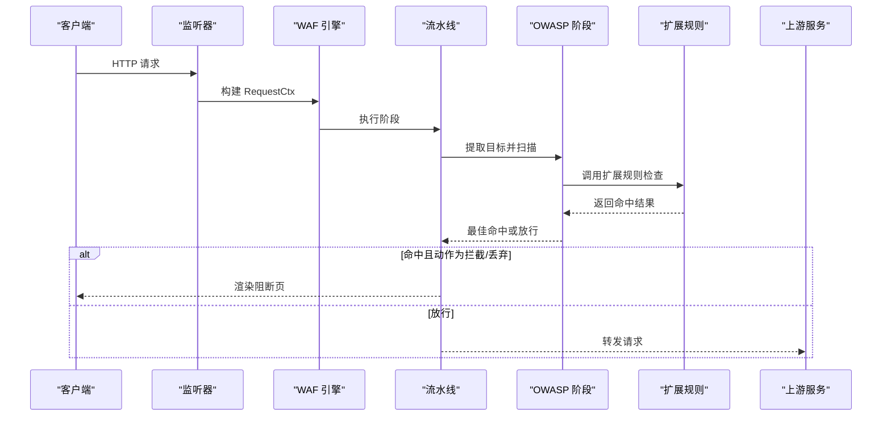
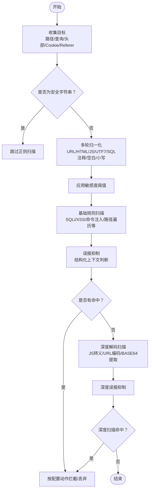
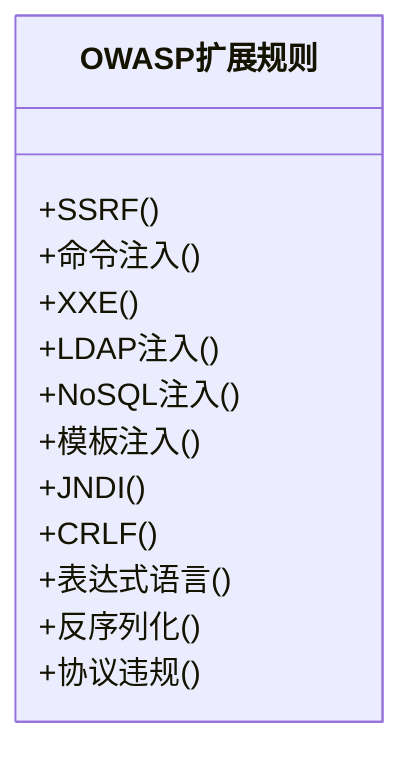
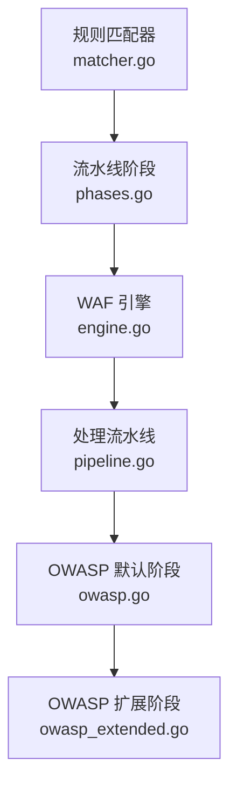

# OWASP 检测

<cite>
**本文引用的文件**
- [internal/waf/owasp.go](file://internal/waf/owasp.go)
- [internal/waf/owasp_extended.go](file://internal/waf/owasp_extended.go)
- [internal/waf/owasp_test.go](file://internal/waf/owasp_test.go)
- [internal/waf/owasp_extended_test.go](file://internal/waf/owasp_extended_test.go)
- [internal/core/engine/engine.go](file://internal/core/engine/engine.go)
- [internal/core/pipeline/pipeline.go](file://internal/core/pipeline/pipeline.go)
- [internal/core/rules/phases.go](file://internal/core/rules/phases.go)
- [internal/core/rules/matcher.go](file://internal/core/rules/matcher.go)
- [internal/waf/eval.go](file://internal/waf/eval.go)
- [internal/waf/block.go](file://internal/waf/block.go)
- [internal/waf/semantic.go](file://internal/waf/semantic.go)
- [internal/core/config.go](file://internal/core/config.go)
- [CLAUDE.md](file://CLAUDE.md)
</cite>

## 目录
1. [简介](#简介)
2. [项目结构](#项目结构)
3. [核心组件](#核心组件)
4. [架构总览](#架构总览)
5. [详细组件分析](#详细组件分析)
6. [依赖分析](#依赖分析)
7. [性能考量](#性能考量)
8. [故障排查指南](#故障排查指南)
9. [结论](#结论)
10. [附录](#附录)

## 简介
本文件系统化梳理 My-OpenWaf 的 OWASP 检测体系，覆盖 OWASP Top 10 常见攻击类型的检测规则与实现，包括 SQL 注入、XSS、CSRF 等。文档重点阐述：
- 规则分类与优先级（基础规则与扩展规则）
- 检测精度优化策略（误报抑制、阈值控制、输入归一化）
- 规则更新与维护机制（新增规则、阈值调整、规则组合）
- 配置示例与调试方法（敏感度、阈值、动作）
- 与其他安全机制的协同（ACL、Bot、CVE、速率限制）

## 项目结构
My-OpenWaf 采用“控制面 + 数据面”的双服务器架构，OWASP 检测位于数据面处理管线中，通过规则编译器与流水线阶段共同完成请求拦截与放行决策。

图示来源
- [CLAUDE.md:88-108](file://CLAUDE.md#L88-L108)
- [internal/core/engine/engine.go:57-129](file://internal/core/engine/engine.go#L57-L129)
- [internal/core/rules/phases.go:246-303](file://internal/core/rules/phases.go#L246-L303)

章节来源
- [CLAUDE.md:78-108](file://CLAUDE.md#L78-L108)
- [internal/core/engine/engine.go:15-37](file://internal/core/engine/engine.go#L15-L37)
- [internal/core/pipeline/pipeline.go:37-71](file://internal/core/pipeline/pipeline.go#L37-L71)

## 核心组件
- OWASP 默认检测阶段：负责扫描路径、查询串、头部、表单/JSON/Multipart 字段等，支持上传文件名与内容类型校验。
- OWASP 扩展检测：针对 SSRF、命令注入、XXE、LDAP 注入、NoSQL 注入、模板注入、JNDI/Log4Shell、CRLF、表达式语言注入、反序列化、协议违规等专项规则。
- 规则编译与匹配：基于 DSL 的规则解析与缓存，支持复合条件（and/or/not）。
- 流水线与引擎：按固定顺序执行各阶段，首个拦截结果短路后续阶段；支持 ACL 白名单直接放行。
- 阻断页面渲染：根据站点运行时配置或全局默认模板生成阻断页。

章节来源
- [internal/core/rules/phases.go:246-303](file://internal/core/rules/phases.go#L246-L303)
- [internal/waf/owasp.go:48-234](file://internal/waf/owasp.go#L48-L234)
- [internal/waf/owasp_extended.go:58-76](file://internal/waf/owasp_extended.go#L58-L76)
- [internal/core/engine/engine.go:57-129](file://internal/core/engine/engine.go#L57-L129)

## 架构总览
OWASP 检测在数据面以“OWASP 默认阶段”为核心，结合“扩展规则子系统”，在请求进入上游前完成多层过滤与评分。整体流程如下：

图示来源
- [internal/core/engine/engine.go:57-129](file://internal/core/engine/engine.go#L57-L129)
- [internal/core/rules/phases.go:256-303](file://internal/core/rules/phases.go#L256-L303)
- [internal/waf/owasp.go:48-234](file://internal/waf/owasp.go#L48-L234)
- [internal/waf/owasp_extended.go:58-76](file://internal/waf/owasp_extended.go#L58-L76)

## 详细组件分析

### OWASP 默认阶段（基础规则）
- 目标收集：路径、查询串、头部（过滤标准头）、Cookie 值（剔除可能的会话标识）、Referer 查询串与片段。
- 输入归一化：多轮 URL 解码、HTML 实体解码、JS 转义解码、UTF-7 解码、SQL 注释剥离、空白折叠、大小写统一。
- 快速通道：纯字母数字 + 安全字符的字符串跳过正则扫描；超长目标截断；重编码深度检测后二次扫描。
- 敏感度阈值：低/中/高三档，分别对应不同阈值，用于聚合评分与命中判定。
- 命中后动作：依据站点保护配置选择拦截或丢弃。

图示来源
- [internal/waf/owasp.go:48-234](file://internal/waf/owasp.go#L48-L234)
- [internal/waf/owasp.go:375-384](file://internal/waf/owasp.go#L375-L384)
- [internal/waf/owasp.go:498-566](file://internal/waf/owasp.go#L498-L566)

章节来源
- [internal/waf/owasp.go:48-234](file://internal/waf/owasp.go#L48-L234)
- [internal/waf/owasp.go:375-384](file://internal/waf/owasp.go#L375-L384)
- [internal/waf/owasp.go:498-566](file://internal/waf/owasp.go#L498-L566)

### OWASP 扩展阶段（专项规则）
- SSRF：云元数据地址、私有/回环地址、本地套接字、文件/字典/LDAP 等方案、十进制/八进制/十六进制编码 IP、IPv6 映射、IMDSv2 头、Unix 套接字等。
- 命令注入：管道/分号/反引号/$() 链接、重定向、环境变量赋值、IFS 空白绕过、管道连接、Here-string、ANSI-C 引号、Newline 注入、SSI、Git 参数注入等。
- XXE：DOCTYPE、SYSTEM、实体展开、参数实体外带、XInclude。
- LDAP 注入：括号组合、对象类、通配符。
- NoSQL 注入：$where/$regex/$or/$exists/$lookup 等。
- 模板注入（SSTI）：Jinja/Django/Twig、Freemarker/Velocity/JSP EL、ERB、Smarty、Python dunder、Pebble、EJS、Handlebars/Mustache、ThinkPHP、DedeCMS 等。
- JNDI/Log4Shell：jndi:、${env/sys/java/base64:}、Unicode/URL 编码、嵌套表达式。
- CRLF：回车换行注入、响应拆分。
- 表达式语言（EL）：SpEL/OGNL/Spring EL、反射链、静态方法调用、上下文访问。
- 反序列化：Java/PHP/Python/.NET/Ruby/Marshal 等魔数与特征。
- 协议违规：CL+TE 冲突、重复 Content-Length、超大头部长度。

图示来源
- [internal/waf/owasp_extended.go:58-76](file://internal/waf/owasp_extended.go#L58-L76)
- [internal/waf/owasp_extended.go:138-156](file://internal/waf/owasp_extended.go#L138-L156)
- [internal/waf/owasp_extended.go:185-203](file://internal/waf/owasp_extended.go#L185-L203)
- [internal/waf/owasp_extended.go:228-246](file://internal/waf/owasp_extended.go#L228-L246)
- [internal/waf/owasp_extended.go:267-282](file://internal/waf/owasp_extended.go#L267-L282)
- [internal/waf/owasp_extended.go:347-365](file://internal/waf/owasp_extended.go#L347-L365)
- [internal/waf/owasp_extended.go:473-491](file://internal/waf/owasp_extended.go#L473-L491)
- [internal/waf/owasp_extended.go:506-521](file://internal/waf/owasp_extended.go#L506-L521)
- [internal/waf/owasp_extended.go:574-592](file://internal/waf/owasp_extended.go#L574-L592)
- [internal/waf/owasp_extended.go:629-648](file://internal/waf/owasp_extended.go#L629-L648)
- [internal/waf/owasp_extended.go:652-696](file://internal/waf/owasp_extended.go#L652-L696)

章节来源
- [internal/waf/owasp_extended.go:11-76](file://internal/waf/owasp_extended.go#L11-L76)
- [internal/waf/owasp_extended.go:78-156](file://internal/waf/owasp_extended.go#L78-L156)
- [internal/waf/owasp_extended.go:158-203](file://internal/waf/owasp_extended.go#L158-L203)
- [internal/waf/owasp_extended.go:205-246](file://internal/waf/owasp_extended.go#L205-L246)
- [internal/waf/owasp_extended.go:248-282](file://internal/waf/owasp_extended.go#L248-L282)
- [internal/waf/owasp_extended.go:284-365](file://internal/waf/owasp_extended.go#L284-L365)
- [internal/waf/owasp_extended.go:441-491](file://internal/waf/owasp_extended.go#L441-L491)
- [internal/waf/owasp_extended.go:493-521](file://internal/waf/owasp_extended.go#L493-L521)
- [internal/waf/owasp_extended.go:523-592](file://internal/waf/owasp_extended.go#L523-L592)
- [internal/waf/owasp_extended.go:594-648](file://internal/waf/owasp_extended.go#L594-L648)
- [internal/waf/owasp_extended.go:650-696](file://internal/waf/owasp_extended.go#L650-L696)

### 规则分类与优先级
- 基础规则：由 OWASP 默认阶段扫描，覆盖 SQL 注入、XSS、命令注入、路径遍历、WebShell、反向 Shell、SSRF、XXE、LDAP 注入、NoSQL 注入、模板注入、JNDI、CRLF、表达式语言、反序列化、文件上传、协议违规等。
- 扩展规则：独立模块，针对特定攻击面的更细粒度规则与评分。
- 优先级：规则按 priority 升序、ID 升序执行；ACL allow 可短路整条流水线；首个拦截结果即终止后续阶段。

章节来源
- [internal/core/rules/phases.go:246-303](file://internal/core/rules/phases.go#L246-L303)
- [internal/core/engine/engine.go:157-175](file://internal/core/engine/engine.go#L157-L175)

### 检测精度优化策略
- 误报抑制：针对 XSS、SQLi、命令注入、路径遍历、SSRF、NoSQL 注入、表达式语言、反序列化等，内置上下文判断与结构化抑制逻辑。
- 敏感度阈值：低/中/高三档阈值，降低误报同时保证高敏模式下的检出率。
- 输入归一化：多轮解码与标准化，消除编码绕过与注释分割等规避手段。
- 目标截断与预过滤：超长目标截断、快速安全字符串跳过、关键字预过滤减少正则开销。
- Cookie 与 Referer 处理：剔除会话标识、仅扫描查询串与片段，避免误报。

章节来源
- [internal/waf/owasp.go:48-234](file://internal/waf/owasp.go#L48-L234)
- [internal/waf/owasp.go:375-384](file://internal/waf/owasp.go#L375-L384)
- [internal/waf/owasp.go:426-496](file://internal/waf/owasp.go#L426-L496)

### 规则更新与维护机制
- 新增规则：通过规则 DSL（kind:arg 或复合 JSON）定义，编译后按优先级排序执行。
- 调整现有规则：修改规则的 kind/arg、优先级、动作；复合规则可组合 and/or/not。
- 阈值调整：通过站点保护配置调整 OWASP 敏感度与动作；也可通过环境变量微调 Bot 与 Drop 阈值。
- 规则验证：提供大量单元测试覆盖典型误报与漏报场景，确保更新后稳定性。

章节来源
- [internal/core/rules/matcher.go:167-261](file://internal/core/rules/matcher.go#L167-L261)
- [internal/core/rules/phases.go:544-569](file://internal/core/rules/phases.go#L544-L569)
- [internal/waf/owasp_test.go:1-577](file://internal/waf/owasp_test.go#L1-L577)
- [internal/waf/owasp_extended_test.go:1-471](file://internal/waf/owasp_extended_test.go#L1-L471)

### 配置示例与调试方法
- 敏感度与动作：通过站点保护配置设置 OWASPEnabled、OWASPSensitivity、OWASPAction；支持 low/mid/high 与拦截/丢弃。
- 环境变量：可通过 MY_OPENWAF_BOT_THRESHOLD、MY_OPENWAF_DROP_BOT_THRESHOLD 等调整 Bot 与 Drop 阈值。
- 调试建议：使用测试用例定位误报/漏报；关注归一化前后差异；结合 Body 解析与 Cookie/Referer 处理逻辑验证。

章节来源
- [internal/core/config.go:113-182](file://internal/core/config.go#L113-L182)
- [internal/core/rules/phases.go:256-303](file://internal/core/rules/phases.go#L256-L303)
- [internal/waf/owasp_test.go:1-577](file://internal/waf/owasp_test.go#L1-L577)
- [internal/waf/owasp_extended_test.go:1-471](file://internal/waf/owasp_extended_test.go#L1-L471)

### 与其他安全机制的配合使用与最佳实践
- ACL 白名单：allow 规则可直接放行，跳过 OWASP、签名与自定义阶段。
- Bot 检测：两阶段评分（PreScreen → DeepScore），恶意分数达到阈值可直接丢弃连接。
- CVE 检测：在 OWASP 之后执行，针对已知漏洞利用模式自动拦截或升级为丢弃。
- 速率限制：在 Bot 之后执行，防止滥用。
- 阻断页面：根据站点运行时配置或全局默认模板渲染，支持自定义状态码与 HTML。

章节来源
- [internal/core/engine/engine.go:57-129](file://internal/core/engine/engine.go#L57-L129)
- [internal/core/rules/phases.go:172-244](file://internal/core/rules/phases.go#L172-L244)
- [internal/core/rules/phases.go:305-358](file://internal/core/rules/phases.go#L305-L358)
- [internal/waf/block.go:16-94](file://internal/waf/block.go#L16-L94)

## 依赖分析
OWASP 检测模块与规则系统、引擎、流水线之间存在清晰的依赖关系，遵循“规则编译 → 流水线执行 → 阶段扫描 → 命中动作”的链路。

图示来源
- [internal/core/rules/matcher.go:167-261](file://internal/core/rules/matcher.go#L167-L261)
- [internal/core/rules/phases.go:246-303](file://internal/core/rules/phases.go#L246-L303)
- [internal/core/engine/engine.go:57-129](file://internal/core/engine/engine.go#L57-L129)
- [internal/core/pipeline/pipeline.go:37-71](file://internal/core/pipeline/pipeline.go#L37-L71)
- [internal/waf/owasp.go:48-234](file://internal/waf/owasp.go#L48-L234)
- [internal/waf/owasp_extended.go:58-76](file://internal/waf/owasp_extended.go#L58-L76)

章节来源
- [internal/core/rules/matcher.go:1-343](file://internal/core/rules/matcher.go#L1-L343)
- [internal/core/rules/phases.go:1-569](file://internal/core/rules/phases.go#L1-L569)
- [internal/core/engine/engine.go:1-176](file://internal/core/engine/engine.go#L1-L176)
- [internal/core/pipeline/pipeline.go:1-71](file://internal/core/pipeline/pipeline.go#L1-L71)

## 性能考量
- 快速预过滤：纯字母数字字符串直接跳过正则；关键字预过滤减少正则匹配次数。
- 归一化成本控制：多轮解码与正则扫描限制在合理范围内，超长目标截断。
- 正则缓存：规则编译时缓存正则表达式，避免重复编译。
- 流水线短路：首个拦截结果立即终止后续阶段，降低整体延迟。
- 体数据解析：按内容类型解析表单/JSON/Multipart，限制采样大小与递归深度，避免内存与 CPU 泄漏。

章节来源
- [internal/waf/owasp.go:48-234](file://internal/waf/owasp.go#L48-L234)
- [internal/core/rules/phases.go:360-405](file://internal/core/rules/phases.go#L360-L405)
- [internal/core/rules/matcher.go:271-296](file://internal/core/rules/matcher.go#L271-L296)

## 故障排查指南
- 误报定位：通过测试用例验证误报场景，逐步缩小到具体规则与误报抑制逻辑。
- 归一化问题：对比原始输入与归一化后的字符串，确认是否被过度解码或注释剥离导致误判。
- 敏感度与阈值：根据业务风险调整敏感度档位与阈值，观察命中率与误报率变化。
- 体数据扫描：检查表单/JSON/Multipart 解析逻辑，确认采样大小与字段提取是否符合预期。
- Cookie/Referer：确认会话标识被正确剔除，避免误报；仅扫描查询串与片段。

章节来源
- [internal/waf/owasp_test.go:1-577](file://internal/waf/owasp_test.go#L1-L577)
- [internal/waf/owasp_extended_test.go:1-471](file://internal/waf/owasp_extended_test.go#L1-L471)
- [internal/waf/owasp.go:426-496](file://internal/waf/owasp.go#L426-L496)
- [internal/core/rules/phases.go:360-405](file://internal/core/rules/phases.go#L360-L405)

## 结论
My-OpenWaf 的 OWASP 检测体系通过“基础规则 + 扩展规则”的双层设计，结合严格的误报抑制、输入归一化与阈值控制，在性能与准确性之间取得平衡。规则 DSL 与流水线机制使得规则更新与维护便捷可控，配合 ACL、Bot、CVE、速率限制等安全机制，形成完整的防护闭环。

## 附录
- 规则 DSL 与复合条件：支持 and/or/not 组合，规则按优先级与 ID 排序执行。
- 体数据解析：表单/JSON/Multipart 分别解析，键与值均参与扫描；二进制数据按可打印比例阈值决定是否扫描。
- 阻断页面：支持站点运行时与全局默认模板，可自定义状态码与 HTML。

章节来源
- [internal/core/rules/matcher.go:299-342](file://internal/core/rules/matcher.go#L299-L342)
- [internal/core/rules/phases.go:360-405](file://internal/core/rules/phases.go#L360-L405)
- [internal/waf/block.go:16-94](file://internal/waf/block.go#L16-L94)
- [internal/waf/semantic.go:19-55](file://internal/waf/semantic.go#L19-L55)