# OWASP 检测

<cite>
**本文引用的文件**
- [internal/waf/owasp/owasp.go](file://internal/waf/owasp/owasp.go)
- [internal/waf/owasp/owasp_extended.go](file://internal/waf/owasp/owasp_extended.go)
- [internal/waf/owasp/owasp_registry.go](file://internal/waf/owasp/owasp_registry.go)
- [internal/admin/detect/owasp_rules.go](file://internal/admin/detect/owasp_rules.go)
- [docs/安全防护功能/OWASP 检测/OWASP 检测.md](file://docs/安全防护功能/OWASP 检测/OWASP 检测.md)
- [docs/安全防护功能/OWASP 检测/检测算法与技术.md](file://docs/安全防护功能/OWASP 检测/检测算法与技术.md)
- [docs/安全防护功能/OWASP 检测/配置与管理.md](file://docs/安全防护功能/OWASP 检测/配置与管理.md)
- [internal/waf/owasp/owasp_test.go](file://internal/waf/owasp/owasp_test.go)
- [internal/waf/owasp/owasp_extended_test.go](file://internal/waf/owasp/owasp_extended_test.go)
- [internal/waf/owasp/base64sqli_test.go](file://internal/waf/owasp/base64sqli_test.go)
- [internal/waf/owasp/blazetest_test.go](file://internal/waf/owasp/blazetest_test.go)
</cite>

## 目录
1. [简介](#简介)
2. [项目结构](#项目结构)
3. [核心组件](#核心组件)
4. [架构总览](#架构总览)
5. [详细组件分析](#详细组件分析)
6. [依赖分析](#依赖分析)
7. [性能考虑](#性能考虑)
8. [故障排查指南](#故障排查指南)
9. [结论](#结论)
10. [附录](#附录)

## 简介
本文件系统化梳理 My-OpenWaf 的 OWASP 检测体系，覆盖 OWASP Top 10 常见攻击类型的检测规则与实现，包括 SQL 注入、XSS、命令注入、路径穿越、SSRF、XXE、LDAP 注入、NoSQL 注入、模板注入、JNDI/Log4Shell、CRLF、表达式语言注入、反序列化、文件上传等。文档重点阐述：
- 规则分类与优先级（基础规则与扩展规则）
- 检测精度优化策略（误报抑制、阈值控制、输入归一化）
- 规则更新与维护机制（新增规则、阈值调整、规则组合）
- 配置示例与调试方法（敏感度、阈值、动作）
- 与其他安全机制的协同（ACL、Bot、CVE、速率限制）

## 项目结构
My-OpenWaf 采用"控制面 + 数据面"的双服务器架构，OWASP 检测位于数据面处理管线中，通过规则编译器与流水线阶段共同完成请求拦截与放行决策。

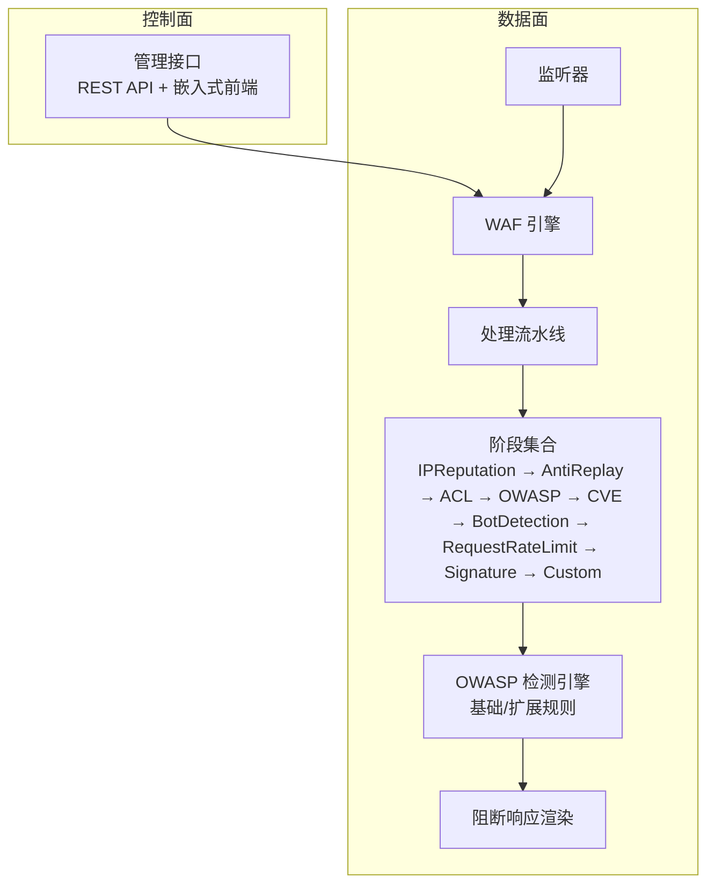

**图表来源**
- [docs/安全防护功能/OWASP 检测/OWASP 检测.md:43-62](file://docs/安全防护功能/OWASP 检测/OWASP 检测.md#L43-L62)

**章节来源**
- [docs/安全防护功能/OWASP 检测/OWASP 检测.md:40-73](file://docs/安全防护功能/OWASP 检测/OWASP 检测.md#L40-L73)

## 核心组件
- OWASP 默认检测阶段：负责扫描路径、查询串、头部、表单/JSON/Multipart 字段等，支持上传文件名与内容类型校验。
- OWASP 扩展检测：针对 SSRF、命令注入、XXE、LDAP 注入、NoSQL 注入、模板注入、JNDI/Log4Shell、CRLF、表达式语言注入、反序列化、协议违规等专项规则。
- 规则编译与匹配：基于 DSL 的规则解析与缓存，支持复合条件（and/or/not）。
- 流水线与引擎：按固定顺序执行各阶段，首个拦截结果短路后续阶段；支持 ACL 白名单直接放行。
- 阻断页面渲染：根据站点运行时配置或全局默认模板生成阻断页。

**章节来源**
- [docs/安全防护功能/OWASP 检测/OWASP 检测.md:74-86](file://docs/安全防护功能/OWASP 检测/OWASP 检测.md#L74-L86)

## 架构总览
OWASP 检测在数据面以"OWASP 默认阶段"为核心，结合"扩展规则子系统"，在请求进入上游前完成多层过滤与评分。整体流程如下：

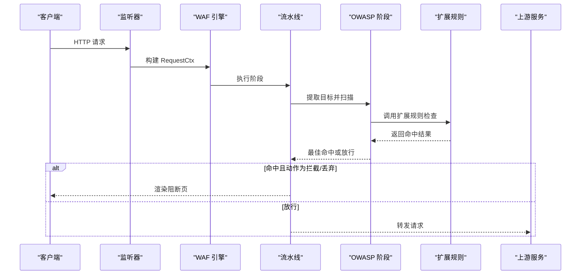

**图表来源**
- [docs/安全防护功能/OWASP 检测/OWASP 检测.md:90-111](file://docs/安全防护功能/OWASP 检测/OWASP 检测.md#L90-L111)

## 详细组件分析

### OWASP 默认阶段（基础规则）
- 目标收集：路径、查询串、头部（过滤标准头）、Cookie 值（剔除可能的会话标识）、Referer 查询串与片段。
- 输入归一化：多轮 URL 解码、HTML 实体解码、JS 转义解码、UTF-7 解码、SQL 注释剥离、空白折叠、大小写统一。
- 快速通道：纯字母数字 + 安全字符的字符串跳过正则扫描；超长目标截断；重编码深度检测后二次扫描。
- 敏感度阈值：低/中/高三档，分别对应不同阈值，用于聚合评分与命中判定。
- 命中后动作：依据站点保护配置选择拦截或丢弃。

**图表来源**
- [docs/安全防护功能/OWASP 检测/OWASP 检测.md:128-144](file://docs/安全防护功能/OWASP 检测/OWASP 检测.md#L128-L144)

**章节来源**
- [docs/安全防护功能/OWASP 检测/OWASP 检测.md:119-155](file://docs/安全防护功能/OWASP 检测/OWASP 检测.md#L119-L155)

### OWASP 扩展阶段（专项规则）
- SSRF：云元数据地址、私有/回环地址、本地套接字、文件/字典/LDAP 等方案、十进制/八进制/十六进制编码 IP、IPv6 映射、IMDSv2 头、Unix 套接字等。
- 命令注入：管道/分号/反引号/$() 链接、重定向、环境变量赋值、IFS 空白绕过、管道连接、Here-string、ANSI-C 引号、Newline 注入、SSI、Git 参数注入等。
- XXE：DOCTYPE、SYSTEM、实体展开、参数实体外带、XInclude。
- LDAP 注入：括号组合、对象类、通配符。
- NoSQL 注入：$where/$regex/$or/$exists/$lookup 等。
- 模板注入（SSTI）：Jinja/Django/Twig、Freemarker/Velocity/JSP EL、ERB、Smarty、Python dunder、Pebble、EJS、Handlebars/Mustache、ThinkPHP、DedeCMS 等。
- JNDI/Log4Shell：jndi:、${env/sys/java/base64:}、Unicode/URL 编码、嵌套表达式。
- CRLF：回车换行注入、响应拆分。
- 表达式语言（EL）：SpEL/OGNL/Spring EL、反射链、静态方法调用、上下文访问。
- 反序列化：Java/PHP/Python/.NET/Ruby/Marshal 等魔数与特征。
- 协议违规：CL+TE 冲突、重复 Content-Length、超大头部长度。

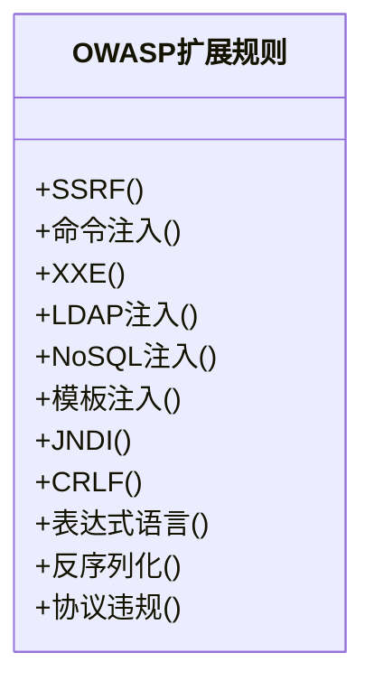

**图表来源**
- [docs/安全防护功能/OWASP 检测/OWASP 检测.md:169-184](file://docs/安全防护功能/OWASP 检测/OWASP 检测.md#L169-L184)

**章节来源**
- [docs/安全防护功能/OWASP 检测/OWASP 检测.md:156-211](file://docs/安全防护功能/OWASP 检测/OWASP 检测.md#L156-L211)

### 规则分类与优先级
- 基础规则：由 OWASP 默认阶段扫描，覆盖 SQL 注入、XSS、命令注入、路径遍历、WebShell、反向 Shell、SSRF、XXE、LDAP 注入、NoSQL 注入、模板注入、JNDI、CRLF、表达式语言、反序列化、文件上传、协议违规等。
- 扩展规则：独立模块，针对特定攻击面的更细粒度规则与评分。
- 优先级：规则按 priority 升序、ID 升序执行；ACL allow 可短路 ACL 之后的后续阶段；首个拦截结果即终止后续阶段。

**章节来源**
- [docs/安全防护功能/OWASP 检测/OWASP 检测.md:212-220](file://docs/安全防护功能/OWASP 检测/OWASP 检测.md#L212-L220)

### 检测精度优化策略
- 误报抑制：针对 XSS、SQLi、命令注入、路径遍历、SSRF、NoSQL 注入、表达式语言、反序列化等，内置上下文判断与结构化抑制逻辑。
- 敏感度阈值：低/中/高三档阈值，降低误报同时保证高敏模式下的检出率。
- 输入归一化：多轮解码与标准化，消除编码绕过与注释分割等规避手段。
- 目标截断与预过滤：超长目标截断、快速安全字符串跳过、关键字预过滤减少正则开销。
- Cookie 与 Referer 处理：剔除会话标识、仅扫描查询串与片段，避免误报。

**章节来源**
- [docs/安全防护功能/OWASP 检测/OWASP 检测.md:221-232](file://docs/安全防护功能/OWASP 检测/OWASP 检测.md#L221-L232)

### 规则更新与维护机制
- 新增规则：通过规则 DSL（kind:arg 或复合 JSON）定义，编译后按优先级排序执行。
- 调整现有规则：修改规则的 kind/arg、优先级、动作；复合规则可组合 and/or/not。
- 阈值调整：通过站点保护配置调整 OWASP 敏感度与动作；也可通过环境变量微调 Bot 与 Drop 阈值。
- 规则验证：提供大量单元测试覆盖典型误报与漏报场景，确保更新后稳定性。

**章节来源**
- [docs/安全防护功能/OWASP 检测/OWASP 检测.md:233-244](file://docs/安全防护功能/OWASP 检测/OWASP 检测.md#L233-L244)

### 配置示例与调试方法
- 敏感度与动作：通过站点保护配置设置 OWASPEnabled、OWASPSensitivity、OWASPAction；支持 low/mid/high 与拦截/丢弃。
- 环境变量：可通过 MY_OPENWAF_BOT_THRESHOLD、MY_OPENWAF_DROP_BOT_THRESHOLD 等调整 Bot 与 Drop 阈值。
- 调试建议：使用测试用例定位误报/漏报；关注归一化前后差异；结合 Body 解析与 Cookie/Referer 处理逻辑验证。

**章节来源**
- [docs/安全防护功能/OWASP 检测/OWASP 检测.md:245-255](file://docs/安全防护功能/OWASP 检测/OWASP 检测.md#L245-L255)

### 与其他安全机制的配合使用与最佳实践
- ACL 白名单：allow 规则可直接放行，跳过 OWASP、签名与自定义阶段。
- Bot 检测：两阶段评分（PreScreen → DeepScore），恶意分数达到阈值可直接丢弃连接。
- CVE 检测：在 OWASP 之后执行，针对已知漏洞利用模式自动拦截或升级为丢弃。
- 速率限制：在 Bot 之后执行，防止滥用。
- 阻断页面：根据站点运行时配置或全局默认模板渲染，支持自定义状态码与 HTML。

**章节来源**
- [docs/安全防护功能/OWASP 检测/OWASP 检测.md:256-268](file://docs/安全防护功能/OWASP 检测/OWASP 检测.md#L256-L268)

## 依赖分析
OWASP 检测模块与规则系统、引擎、流水线之间存在清晰的依赖关系，遵循"规则编译 → 流水线执行 → 阶段扫描 → 命中动作"的链路。

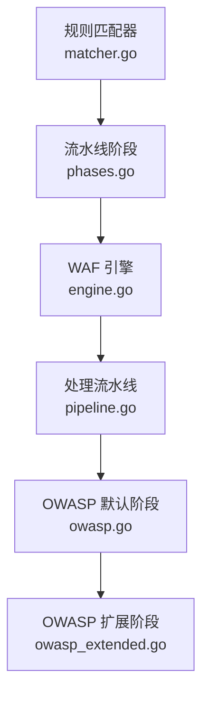

**图表来源**
- [docs/安全防护功能/OWASP 检测/OWASP 检测.md:272-285](file://docs/安全防护功能/OWASP 检测/OWASP 检测.md#L272-L285)

**章节来源**
- [docs/安全防护功能/OWASP 检测/OWASP 检测.md:269-299](file://docs/安全防护功能/OWASP 检测/OWASP 检测.md#L269-L299)

## 性能考虑
- 快速预过滤：纯字母数字字符串直接跳过正则；关键字预过滤减少正则匹配次数。
- 归一化成本控制：多轮解码与正则扫描限制在合理范围内，超长目标截断。
- 正则缓存：规则编译时缓存正则表达式，避免重复编译。
- 流水线短路：首个拦截结果立即终止后续阶段，降低整体延迟。
- 体数据解析：按内容类型解析表单/JSON/Multipart，限制采样大小与递归深度，避免内存与 CPU 泄漏。

**章节来源**
- [docs/安全防护功能/OWASP 检测/OWASP 检测.md:301-312](file://docs/安全防护功能/OWASP 检测/OWASP 检测.md#L301-L312)

## 故障排查指南
- 误报定位：通过测试用例验证误报场景，逐步缩小到具体规则与误报抑制逻辑。
- 归一化问题：对比原始输入与归一化后的字符串，确认是否被过度解码或注释剥离导致误判。
- 敏感度与阈值：根据业务风险调整敏感度档位与阈值，观察命中率与误报率变化。
- 体数据扫描：检查表单/JSON/Multipart 解析逻辑，确认采样大小与字段提取是否符合预期。
- Cookie/Referer：确认会话标识被正确剔除，避免误报；仅扫描查询串与片段。

**章节来源**
- [docs/安全防护功能/OWASP 检测/OWASP 检测.md:313-325](file://docs/安全防护功能/OWASP 检测/OWASP 检测.md#L313-L325)

## 结论
My-OpenWaf 的 OWASP 检测体系通过"基础规则 + 扩展规则"的双层设计，结合严格的误报抑制、输入归一化与阈值控制，在性能与准确性之间取得平衡。规则 DSL 与流水线机制使得规则更新与维护便捷可控，配合 ACL、Bot、CVE、速率限制等安全机制，形成完整的防护闭环。

## 附录

### 检测算法与技术

#### 字符串归一化与预处理
- 多轮 URL 解码（QueryUnescape + PathUnescape）以消除嵌套编码与 UTF-7 过长编码（如 %C0%BC → <）。
- HTML 实体解码与 JavaScript 转义序列解码（\xNN、\uXXXX、\u{XXXX}、八进制）。
- UTF-7 解码（+ADw- → <）。
- SQL 注释剥离（保留版本特定注释 /*!...*/）。
- 空白折叠与大小写归一化。
- 目标长度限制（默认 16384）与"纯字母数字+安全字符"快速跳过。

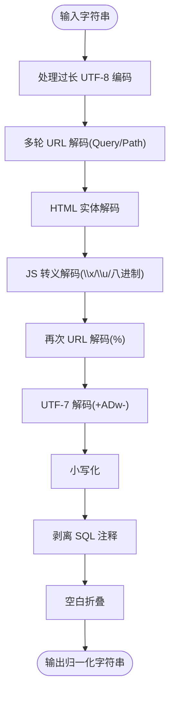

**图表来源**
- [docs/安全防护功能/OWASP 检测/检测算法与技术.md:143-155](file://docs/安全防护功能/OWASP 检测/检测算法与技术.md#L143-L155)

**章节来源**
- [docs/安全防护功能/OWASP 检测/检测算法与技术.md:135-169](file://docs/安全防护功能/OWASP 检测/检测算法与技术.md#L135-L169)

#### 快速路径过滤与指示器
- isCleanTarget：仅字母数字+安全字符且长度≤256时直接跳过后续处理。
- hasSuspiciousContent：O(n) 扫描可疑字符集，未命中则跳过正则电池。
- 各类别指示器（hasSQLiIndicator、hasXSSIndicator、hasCmdIndicator 等）在进入对应正则电池前进行快速判定，显著降低 CPU 开销。

**章节来源**
- [docs/安全防护功能/OWASP 检测/检测算法与技术.md:170-179](file://docs/安全防护功能/OWASP 检测/检测算法与技术.md#L170-L179)

#### 正则表达式匹配策略与恶意模式识别
- OWASP 默认检测：CheckOWASP 对路径、查询、头部、请求体目标进行归一化后扫描，按类别依次调用检查函数，命中即返回或继续收集多击。
- 分类专用正则电池：
  - SQL 注入：sqliPatterns（含 UNION、布尔盲注、时间盲注、函数调用、OUTFILE/DUMPFILE 等）。
  - XSS：xssPatterns（事件处理器、data:、SVG/MathML、构造器链、DOM sink 等）。
  - 命令注入：cmdInjectPatterns（管道、重定向、环境变量、IFS 替代、反引号、here-string 等）。
  - 其他：SSRF、XXE、LDAP 注入、NoSQL 注入、模板注入、JNDI/Log4Shell、CRLF、表达式语言、反序列化、路径穿越等。

**章节来源**
- [docs/安全防护功能/OWASP 检测/检测算法与技术.md:180-203](file://docs/安全防护功能/OWASP 检测/检测算法与技术.md#L180-L203)

#### 上下文感知分析与误报抑制
- 敏感度阈值：低/中/高三档阈值，影响是否抑制结构化 HTML-only 的 XSS 命中。
- 类别级误报抑制：
  - SQL 注入：针对 sleep()/benchmark()/waitfor、OR 1=1、union select、into outfile 等场景的上下文确认。
  - XSS：区分被动结构（iframe/object/embed）与主动脚本执行（eval/alert/document.write 等），CDN 回调函数引用（无括号）不视为 XSS。
  - 命令注入：backtick 命令替换、null byte/newline 注入需高置信度上下文才报告。
  - 路径穿越：仅对敏感文件/目录命中才抑制。
  - SSRF：本地回环与 metadata 仅在特定上下文中才判定为攻击。
  - 反序列化：Ruby Marshal 短载荷等抑制。
  - NoSQL 注入：需存在操作符或上下文才判定。
  - 表达式语言：需存在 EL 关键字才判定。
  - Webshell：需 PHP/Shell 特征才判定。

**章节来源**
- [docs/安全防护功能/OWASP 检测/检测算法与技术.md:204-225](file://docs/安全防护功能/OWASP 检测/检测算法与技术.md#L204-L225)

#### 深度解码扫描与 Base64 提取
- 针对包含大量 \u00XX JS 转义的目标进行深度解码，提取 Base64 token 并二次归一化扫描，提升对 JSFuck、编码混淆等的检测能力。
- hasBase64Candidate 快速判断是否存在连续 Base64 字符串，避免昂贵正则匹配。
- decodeBase64IfSuspicious：仅当解码后可打印 ASCII 比例≥80% 时才认为可疑，否则尝试偏移一位继续尝试，抑制二进制噪声。

**章节来源**
- [docs/安全防护功能/OWASP 检测/检测算法与技术.md:226-235](file://docs/安全防护功能/OWASP 检测/检测算法与技术.md#L226-L235)

#### 协议级与路径级检查
- 协议违规检查：同时设置 Content-Length 与 Transfer-Encoding、重复 Content-Length、超大头部长度等。
- 路径危险模式：双扩展上传（shell.php.jpg）、危险文件扩展、CVE 相关端点（F5、Liferay、OFBiz、Confluence、Cisco ASA、ThinkPHP、Atlassian gadgets、Nexus、Coremail 等）。

**章节来源**
- [docs/安全防护功能/OWASP 检测/检测算法与技术.md:236-244](file://docs/安全防护功能/OWASP 检测/检测算法与技术.md#L236-L244)

#### 机器人检测（两阶段）
- 阶段一（快速预筛选）：已知恶意工具 UA、IP 信誉黑名单/自动封禁、GeoIP 高风险 ASN/国家。
- 阶段二（深度评分）：UA/头启发式、TLS/HTTP2 指纹（JA3/JA4/H2/头顺序）、IP 信誉加权，综合得分分级（人类/良好/可疑/恶意）。
- 两阶段阈值可配置，恶意分数达到阈值使用 Drop 动作。

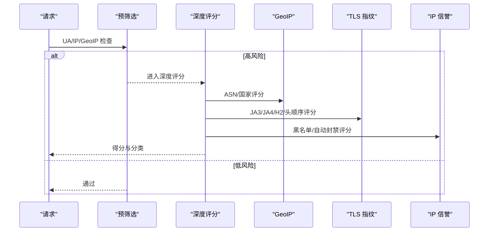

**图表来源**
- [docs/安全防护功能/OWASP 检测/检测算法与技术.md:250-269](file://docs/安全防护功能/OWASP 检测/检测算法与技术.md#L250-L269)

**章节来源**
- [docs/安全防护功能/OWASP 检测/检测算法与技术.md:245-279](file://docs/安全防护功能/OWASP 检测/检测算法与技术.md#L245-L279)

#### 规则编译与匹配
- 规则解析：ParsePattern 支持简单模式与 JSON 复合条件。
- 匹配器：IP/CIDR、路径前缀/正则、查询包含/正则、头包含/正则、方法、内容类型、用户代理、查询参数等。
- 编译：Compile 将规则转换为带预构建匹配器的运行时对象，按优先级排序。
- 正则缓存：cachedCompile 复用编译后的正则，减少重复编译开销。

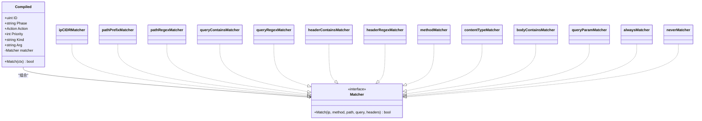

**图表来源**
- [docs/安全防护功能/OWASP 检测/检测算法与技术.md:286-330](file://docs/安全防护功能/OWASP 检测/检测算法与技术.md#L286-L330)

**章节来源**
- [docs/安全防护功能/OWASP 检测/检测算法与技术.md:280-342](file://docs/安全防护功能/OWASP 检测/检测算法与技术.md#L280-L342)

#### OWASP 默认阶段与体目标提取
- OWASP 阶段：先扫描 multipart 文件名/内容类型（文件上传检查），再从不同 Content-Type 中提取文本目标进行 OWASP 检测。
- Content-Type 分支：
  - application/x-www-form-urlencoded：解析键值并解码，同时扫描键名与值。
  - application/json：递归提取所有字符串值（最多 100 层，防止爆炸）。
  - multipart/form-data：提取非文件字段文本（限制 4096 字节）。
  - text/*、application/xml、application/soap：限制大小扫描。
  - 其他：仅当首 512 字节可打印 ASCII 比例≥90% 时扫描，避免二进制误报。

**章节来源**
- [docs/安全防护功能/OWASP 检测/检测算法与技术.md:343-358](file://docs/安全防护功能/OWASP 检测/检测算法与技术.md#L343-L358)

#### 语义视图解析
- LazyQuery：延迟解析查询字符串，键值均解码。
- LazyBody：根据 Content-Type 解析表单或 JSON，限制最大字节数，避免资源滥用。

**章节来源**
- [docs/安全防护功能/OWASP 检测/检测算法与技术.md:359-365](file://docs/安全防护功能/OWASP 检测/检测算法与技术.md#L359-L365)

### 配置与管理

#### 配置系统与动态重载
- 配置来源与默认值：通过环境变量加载数据库、Redis、管理绑定地址等；提供默认值与可覆盖项。
- 配置校验：驱动类型、DSN、管理绑定地址、Redis 地址合法性检查；对常见误配给出警告。
- 运行时重载：根据数据库版本号生成快照，缓存并原子替换当前快照，供引擎读取。

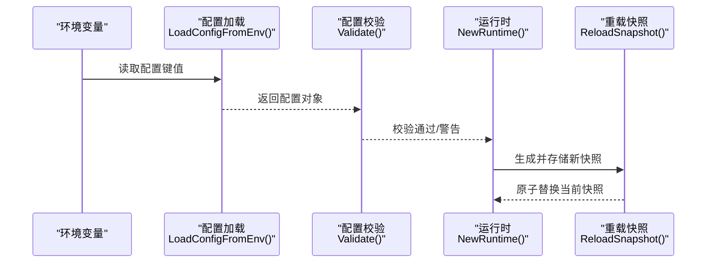

**图表来源**
- [docs/安全防护功能/OWASP 检测/配置与管理.md:164-177](file://docs/安全防护功能/OWASP 检测/配置与管理.md#L164-L177)

**章节来源**
- [docs/安全防护功能/OWASP 检测/配置与管理.md:159-188](file://docs/安全防护功能/OWASP 检测/配置与管理.md#L159-L188)

#### 敏感度级别、阈值与规则优先级
- 敏感度与阈值：OWASP 检测函数接收敏感度字符串，转换为阈值常量，用于控制检测严格度。
- 规则优先级：规则模型包含优先级字段，默认值；编译阶段按优先级升序、ID 升序稳定排序。
- 阶段与动作：规则按阶段执行（如 ACL、速率限制、OWASP 默认、签名、自定义），动作支持允许/拦截/观察/丢弃等。

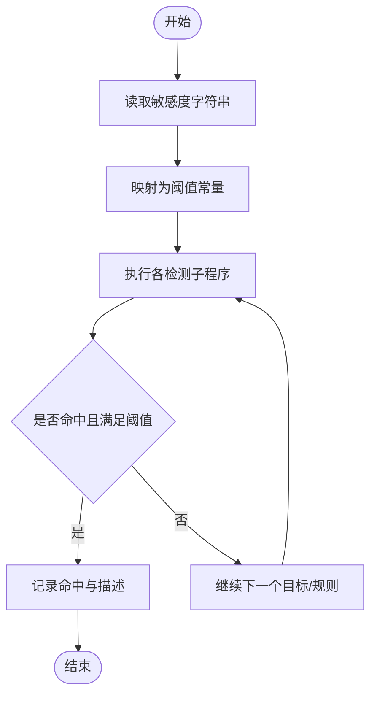

**图表来源**
- [docs/安全防护功能/OWASP 检测/配置与管理.md:194-204](file://docs/安全防护功能/OWASP 检测/配置与管理.md#L194-L204)

**章节来源**
- [docs/安全防护功能/OWASP 检测/配置与管理.md:189-215](file://docs/安全防护功能/OWASP 检测/配置与管理.md#L189-L215)

#### 规则启用/禁用、自定义规则与修改流程
- 规则模型：包含名称、策略 ID、阶段、模式（DSL）、动作、优先级、启用状态等。
- 规则仓库：提供分页列表、按策略查询、增删改查等操作；按优先级与 ID 排序。
- 管理接口：提供创建、更新、删除、导出、导入、测试规则的 API；每次变更后触发重载。
- 前端规则页面：可视化字段与 DSL 输入；规则构建器支持简单/复合规则、验证与测试。
- 规则测试：后端提供测试接口，前端提供简易本地测试逻辑。

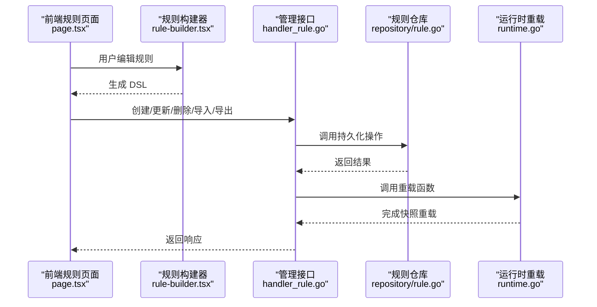

**图表来源**
- [docs/安全防护功能/OWASP 检测/配置与管理.md:223-239](file://docs/安全防护功能/OWASP 检测/配置与管理.md#L223-L239)

**章节来源**
- [docs/安全防护功能/OWASP 检测/配置与管理.md:216-253](file://docs/安全防护功能/OWASP 检测/配置与管理.md#L216-L253)

#### 保护配置（含 OWASP 敏感度与动作）
- 系统设置模型：以键值形式存储保护配置，包含请求/错误速率限制、OWASP 开关与敏感度、动作、维护模式、Bot 检测开关、自动封禁、CC 保护等。
- 保护配置接口：读取时展开模块映射与 CC 规则数组；写入时先解析原始 JSON，再映射到结构体保存。
- 前端保护页面：展示全局配置与模块级敏感度映射，便于统一管理。

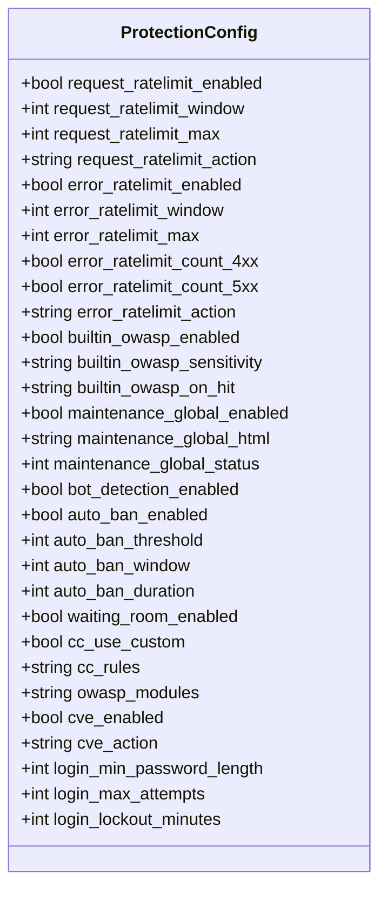

**图表来源**
- [docs/安全防护功能/OWASP 检测/配置与管理.md:259-294](file://docs/安全防护功能/OWASP 检测/配置与管理.md#L259-L294)

**章节来源**
- [docs/安全防护功能/OWASP 检测/配置与管理.md:254-302](file://docs/安全防护功能/OWASP 检测/配置与管理.md#L254-L302)

#### 检测结果存储、日志与告警
- 安全事件模型：包含请求标识、客户端 IP、主机、路径、方法、UA、命中规则、阶段、动作、分类、地理信息、状态码等。
- 事件写入器：异步批量写入，带缓冲区与定时刷新，避免阻塞数据面；异常时记录错误日志。
- 日志记录：配置校验阶段输出警告；事件写入器在写入失败时记录错误。

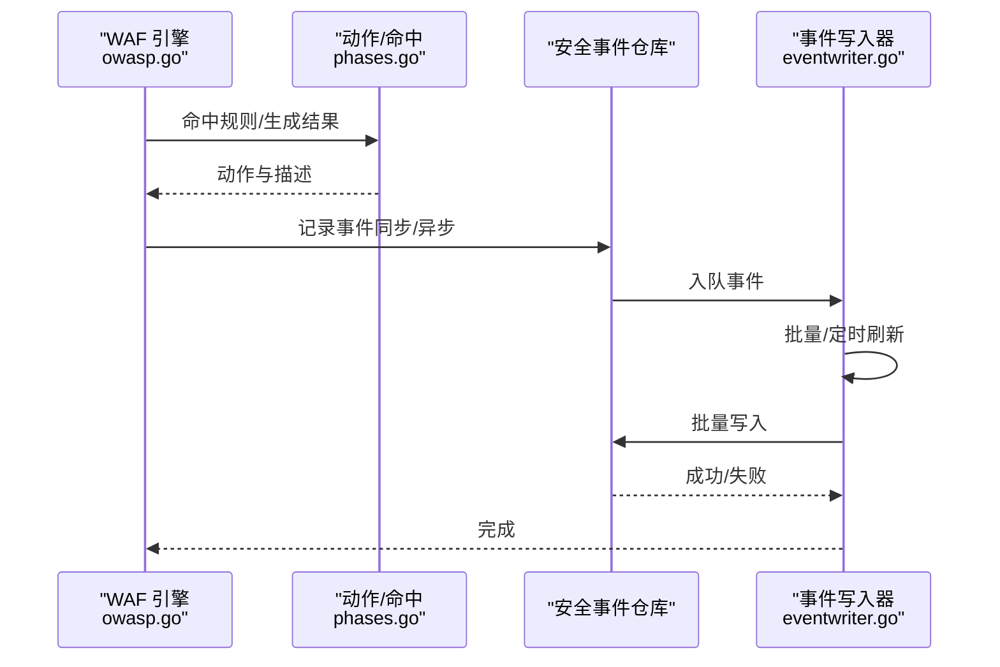

**图表来源**
- [docs/安全防护功能/OWASP 检测/配置与管理.md:308-323](file://docs/安全防护功能/OWASP 检测/配置与管理.md#L308-L323)

**章节来源**
- [docs/安全防护功能/OWASP 检测/配置与管理.md:303-335](file://docs/安全防护功能/OWASP 检测/配置与管理.md#L303-L335)

#### 监控指标、性能统计与故障诊断
- 监控维度：请求 QPS、命中率、各攻击类别分布、Top 攻击源与路径、事件写入延迟与吞吐。
- 性能统计：事件写入器批大小与刷新间隔可调；规则编译按优先级排序，减少运行时比较成本。
- 故障诊断：配置校验输出警告；事件写入失败记录错误；前端规则构建器提供 DSL 验证与测试。

**章节来源**
- [docs/安全防护功能/OWASP 检测/配置与管理.md:336-345](file://docs/安全防护功能/OWASP 检测/配置与管理.md#L336-L345)

#### 性能考虑
- 规则编译：按优先级与 ID 排序，减少运行时比较次数；仅启用规则参与编译。
- OWASP 检测：目标长度上限、快速路径跳过、规范化与解码多轮、二次扫描与深度解码，平衡准确度与性能。
- 事件写入：批量与定时刷新，缓冲区满时丢弃，避免阻塞数据面。
- 配置重载：基于数据库版本号构建快照，缓存命中可复用，避免频繁重建。

**章节来源**
- [docs/安全防护功能/OWASP 检测/配置与管理.md:394-406](file://docs/安全防护功能/OWASP 检测/配置与管理.md#L394-L406)

#### 故障排查指南
- 配置错误
  - 数据库驱动非法：检查驱动值是否为 sqlite/mysql/postgres。
  - DSN 为空：确认数据库连接串配置。
  - 管理绑定地址格式错误：确保 host:port 格式。
  - Redis 地址格式错误：确保 host:port 格式。
  - SQLite 与 DSN 类型不一致：注意 DSN 与驱动的匹配。
- 规则相关
  - 规则无法持久化：检查仓库返回错误；确认 DSL 语法正确。
  - 规则未生效：确认规则启用状态、优先级顺序、阶段匹配。
  - 规则测试失败：前端验证失败提示；后端测试接口返回错误。
- 事件写入
  - 写入失败：查看日志错误；检查数据库连接与权限。
  - 事件丢失：缓冲区满会丢弃事件，适当增大缓冲或提高刷新频率。

**章节来源**
- [docs/安全防护功能/OWASP 检测/配置与管理.md:407-426](file://docs/安全防护功能/OWASP 检测/配置与管理.md#L407-L426)

#### 结论
本系统通过环境变量驱动的配置、严格的配置校验、规则编译与优先级排序、OWASP 敏感度阈值控制、异步事件写入与快照重载，实现了可运维、可扩展、可观测的检测配置与管理能力。结合前端可视化规则构建器与保护配置界面，可在不同场景下灵活调整策略并进行性能优化。

#### 附录

##### 配置项与最佳实践
- 数据库与缓存
  - 使用生产数据库驱动与 DSN；Redis 可选，用于分布式共享状态。
  - 最佳实践：生产环境使用独立数据库实例，开启连接池与超时控制。
- 敏感度与阈值
  - Low：宽松阈值，适合低误报场景；Mid：默认推荐；High：严格阈值，适合高威胁场景。
  - 最佳实践：从 Mid 开始，逐步提升至 High 并配合规则优先级微调。
- 规则优先级与阶段
  - ACL 与速率限制优先于 OWASP 与签名；自定义规则按业务需求排序。
  - 最佳实践：将高频误报规则置于较低优先级，或拆分为更细粒度规则。
- 保护配置
  - OWASP 开关与动作：默认拦截，必要时改为观察；维护模式与 CC 保护按需启用。
  - 最佳实践：全局与模块级敏感度分离，针对高风险路径单独提升敏感度。
- 事件与日志
  - 批量写入与缓冲区大小按吞吐量调优；关注写入失败日志。
  - 最佳实践：为安全事件表建立索引（如时间、规则 ID、客户端 IP）。

**章节来源**
- [docs/安全防护功能/OWASP 检测/配置与管理.md:427-454](file://docs/安全防护功能/OWASP 检测/配置与管理.md#L427-L454)

### 实际攻击样本与检测效果分析

#### SQL 注入检测
- 基础 SQL 注入：UNION SELECT、布尔盲注、时间盲注等。
- 编码绕过：Base64 编码、Unicode 转义、JSFuck 等。
- 深度解码：针对包含大量 \u00XX JS 转义的目标进行深度解码，提取 Base64 token 并二次归一化扫描。

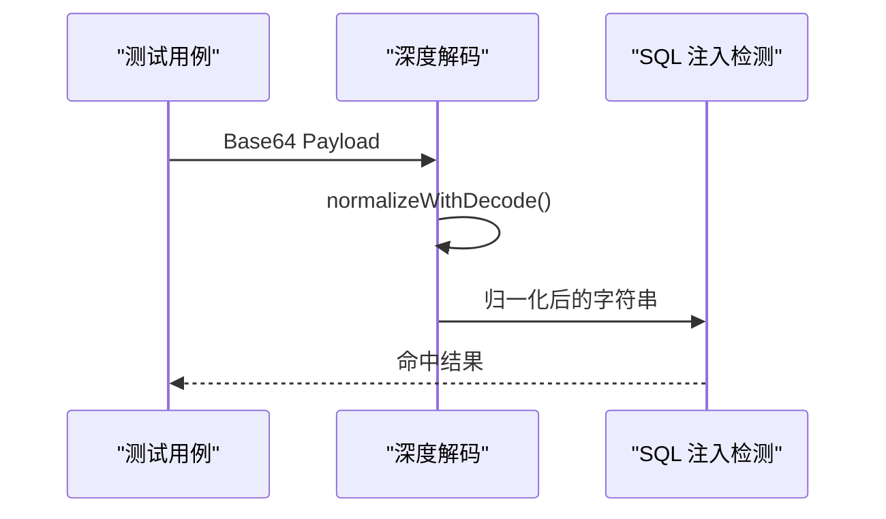

**图表来源**
- [internal/waf/owasp/base64sqli_test.go:33-46](file://internal/waf/owasp/base64sqli_test.go#L33-L46)

**章节来源**
- [internal/waf/owasp/base64sqli_test.go:7-46](file://internal/waf/owasp/base64sqli_test.go#L7-L46)

#### XSS 检测
- 传统 XSS：script 标签、事件处理器、data: URL 等。
- SVG/XSS：SVG onload、MathML 等向量。
- 模板注入：模板引擎表达式注入。

**章节来源**
- [internal/waf/owasp/owasp_test.go:76-82](file://internal/waf/owasp/owasp_test.go#L76-L82)
- [internal/waf/owasp/owasp_extended_test.go:137-151](file://internal/waf/owasp/owasp_extended_test.go#L137-L151)

#### 命令注入检测
- 基础命令注入：管道、分号、反引号、$() 等。
- 高级绕过：IFS 空白绕过、Here-string、ANSI-C 引号等。
- 文件操作：touch/rm 等文件操作命令。

**章节来源**
- [internal/waf/owasp/owasp_extended_test.go:22-27](file://internal/waf/owasp/owasp_extended_test.go#L22-L27)
- [internal/waf/owasp/owasp_extended_test.go:29-34](file://internal/waf/owasp/owasp_extended_test.go#L29-L34)

#### SSRF 检测
- 云元数据：169.254.169.254、metadata.google.internal 等。
- 私有地址：127.0.0.1、10.0.0.0/8、172.16.0.0/12、192.168.0.0/16 等。
- 方案绕过：file://、gopher://、dict://、ldap:// 等。

**章节来源**
- [internal/waf/owasp/owasp_extended_test.go:8-13](file://internal/waf/owasp/owasp_extended_test.go#L8-L13)
- [internal/waf/owasp/owasp_extended_test.go:15-20](file://internal/waf/owasp/owasp_extended_test.go#L15-L20)

#### 文件上传检测
- 危险扩展：.php、.jsp、.asp、.exe 等。
- 双扩展绕过：shell.php.jpg、shell.php .jpg 等。
- Null byte 注入：filename.jpg%00.php 等。

**章节来源**
- [internal/waf/owasp/owasp_extended_test.go:94-121](file://internal/waf/owasp/owasp_extended_test.go#L94-L121)

#### 规则注册与管理
- 规则注册：通过 DefaultOWASPRegistry 注册所有内置规则。
- 规则查询：按类别查询规则，支持启用状态与动作配置。
- 规则更新：支持批量更新与单个规则更新。

**章节来源**
- [internal/waf/owasp/owasp_registry.go:206-412](file://internal/waf/owasp/owasp_registry.go#L206-L412)
- [internal/admin/detect/owasp_rules.go:27-150](file://internal/admin/detect/owasp_rules.go#L27-L150)
