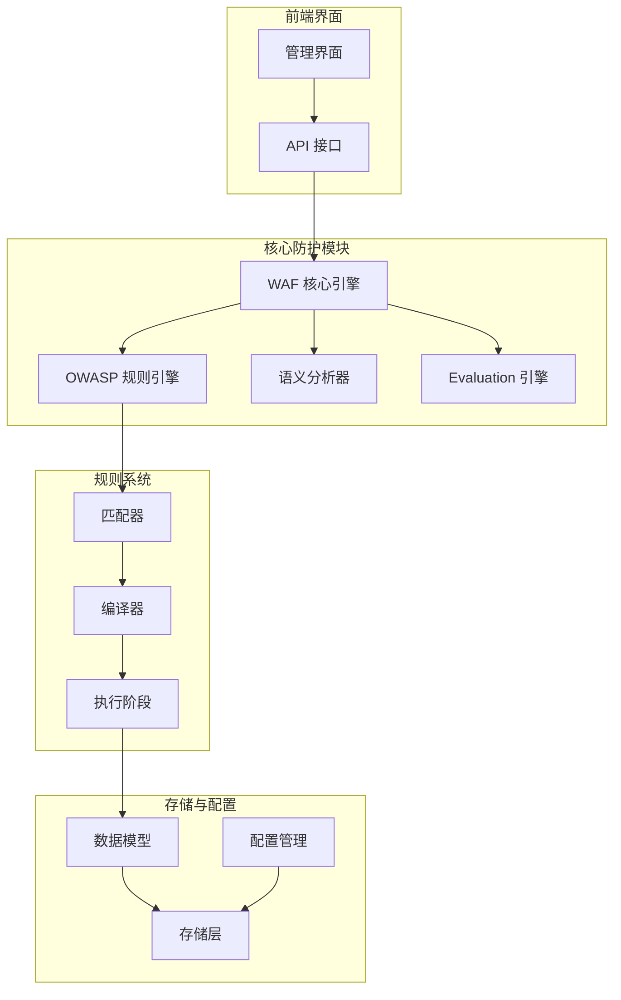
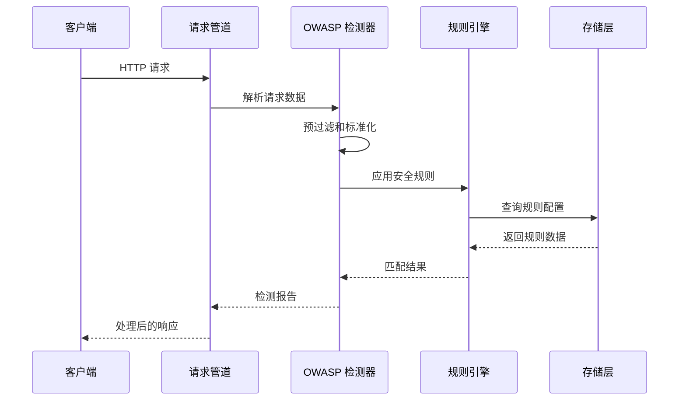
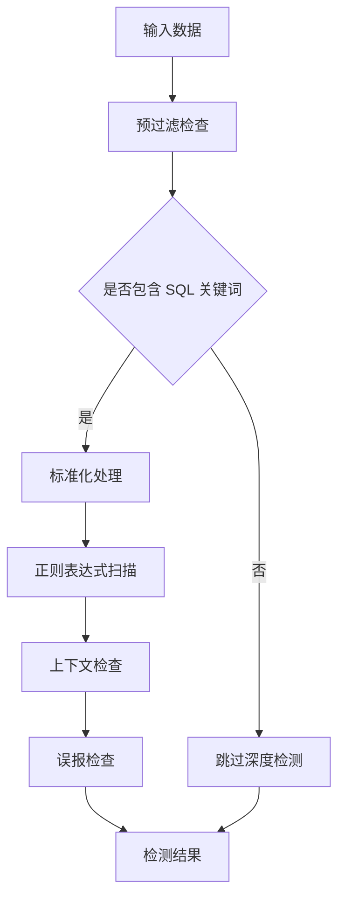
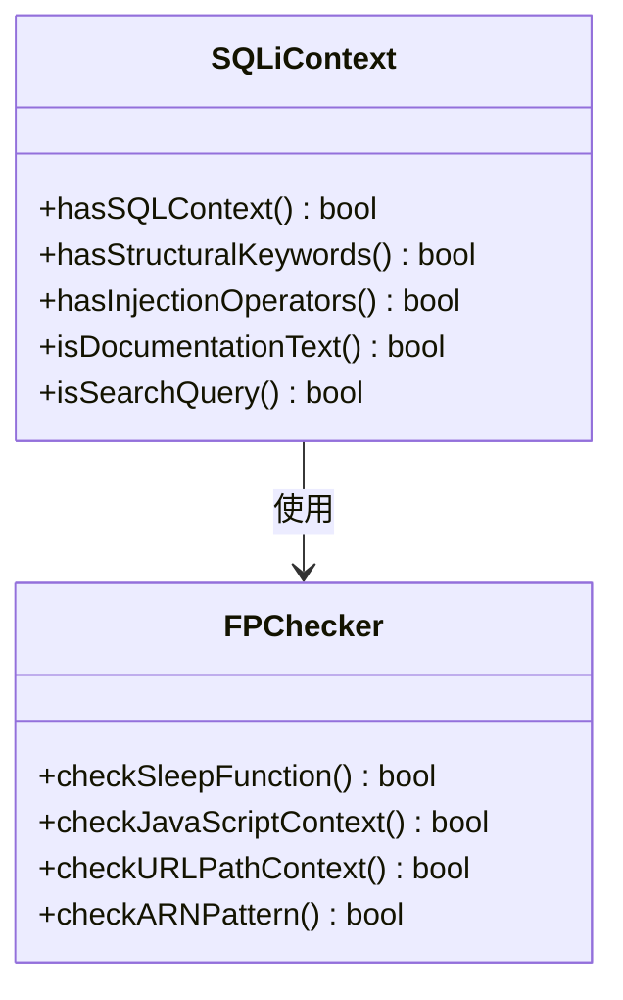
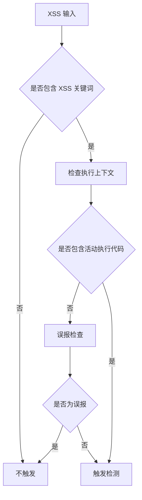
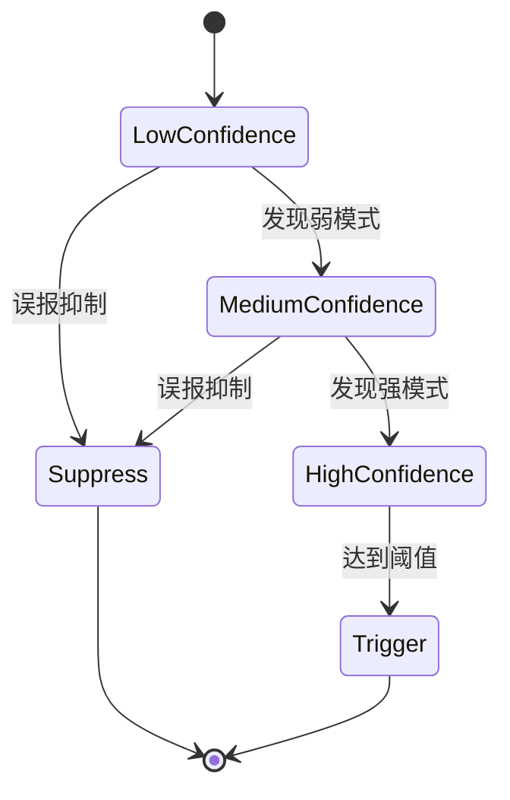
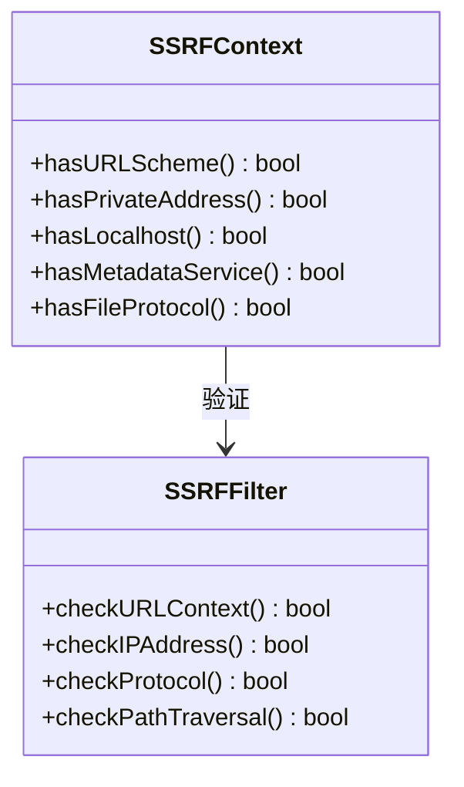
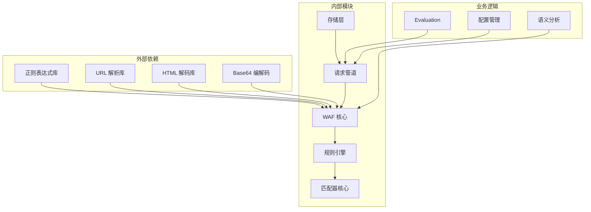
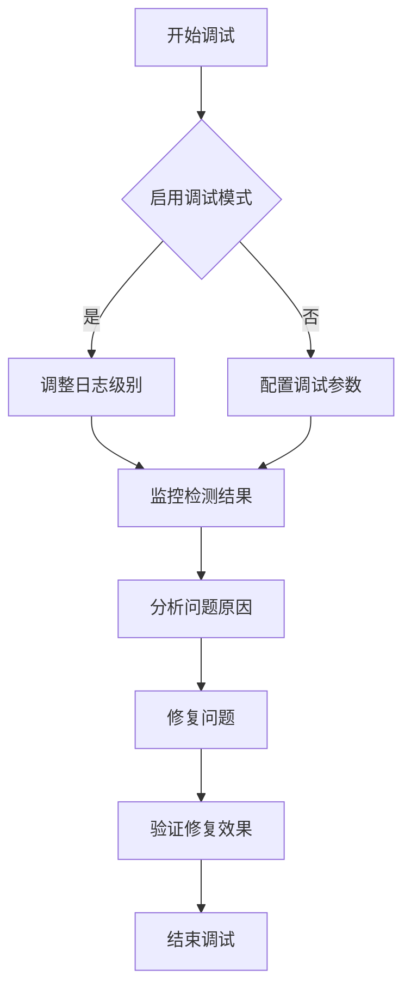

# 基本 OWASP 规则

<cite>
**本文档引用的文件**
- [owasp.go](file://internal/waf/owasp.go)
- [owasp_extended.go](file://internal/waf/owasp_extended.go)
- [semantic.go](file://internal/waf/semantic.go)
- [eval.go](file://internal/waf/eval.go)
- [matcher.go](file://internal/core/rules/matcher.go)
- [compiler.go](file://internal/core/rules/compiler.go)
- [phases.go](file://internal/core/rules/phases.go)
- [config.go](file://internal/core/config.go)
- [models.go](file://internal/store/models.go)
- [owasp_test.go](file://internal/waf/owasp_test.go)
</cite>

## 目录
1. [简介](#简介)
2. [项目结构](#项目结构)
3. [核心组件](#核心组件)
4. [架构概览](#架构概览)
5. [详细组件分析](#详细组件分析)
6. [依赖分析](#依赖分析)
7. [性能考虑](#性能考虑)
8. [故障排除指南](#故障排除指南)
9. [结论](#结论)

## 简介

My-OpenWaf 是一个基于 Go 语言开发的 Web 应用防火墙（WAF），专注于 OWASP Top 10 漏洞的检测与防护。该项目实现了完整的 OWASP 基础规则体系，包括 SQL 注入（SQLi）、跨站脚本（XSS）、命令注入（CmdInject）、路径遍历（PathTrav）、服务器端请求伪造（SSRF）等核心攻击类型的检测算法。

该系统采用多层防护架构，通过智能预过滤、上下文感知检测和误报抑制策略，实现了高精度的攻击检测能力。系统支持多种敏感度级别（低、中、高），并提供了灵活的配置选项来平衡检测精度和误报率。

## 项目结构

项目采用模块化设计，主要分为以下几个核心模块：



**图表来源**
- [owasp.go:1-50](file://internal/waf/owasp.go#L1-L50)
- [matcher.go:1-50](file://internal/core/rules/matcher.go#L1-L50)
- [compiler.go:1-50](file://internal/core/rules/compiler.go#L1-L50)

**章节来源**
- [owasp.go:1-100](file://internal/waf/owasp.go#L1-L100)
- [matcher.go:1-50](file://internal/core/rules/matcher.go#L1-L50)
- [compiler.go:1-50](file://internal/core/rules/compiler.go#L1-L50)

## 核心组件

### OWASP 规则引擎

OWASP 规则引擎是系统的核心检测组件，负责对请求进行全面的安全扫描。其主要功能包括：

- **多层检测架构**：从快速预过滤到深度正则匹配，逐层提升检测精度
- **上下文感知**：根据不同的攻击类型和上下文环境调整检测策略
- **误报抑制**：通过复杂的过滤规则减少误报情况
- **性能优化**：采用目标长度限制、字符集预过滤等技术确保检测效率

### 语义分析器

语义分析器负责解析和处理不同格式的请求内容，支持：
- **表单数据解析**：处理 application/x-www-form-urlencoded 格式
- **JSON 数据解析**：递归提取 JSON 对象中的字符串值
- **多部分数据处理**：支持 multipart/form-data 格式的文件上传检测
- **内容类型识别**：自动识别和处理各种 MIME 类型

### 规则匹配系统

规则匹配系统采用可扩展的设计，支持：
- **复合匹配器**：支持 AND、OR、NOT 等逻辑组合
- **正则表达式缓存**：避免重复编译相同的正则表达式
- **动态规则加载**：支持运行时规则的动态编译和执行

**章节来源**
- [owasp.go:48-234](file://internal/waf/owasp.go#L48-L234)
- [semantic.go:11-82](file://internal/waf/semantic.go#L11-L82)
- [matcher.go:11-133](file://internal/core/rules/matcher.go#L11-L133)

## 架构概览

系统采用分层架构设计，确保了良好的可维护性和扩展性：



**图表来源**
- [phases.go:258-303](file://internal/core/rules/phases.go#L258-L303)
- [owasp.go:51-234](file://internal/waf/owasp.go#L51-L234)

系统的主要执行流程包括：

1. **请求接收**：通过管道接收原始 HTTP 请求
2. **数据提取**：从请求中提取路径、查询参数、头部信息和主体内容
3. **预处理**：对提取的数据进行标准化和解码处理
4. **规则匹配**：应用各种安全规则进行检测
5. **结果评估**：根据敏感度级别和阈值确定最终处理结果
6. **响应生成**：根据检测结果生成相应的响应或拦截

**章节来源**
- [phases.go:258-303](file://internal/core/rules/phases.go#L258-L303)
- [owasp.go:48-234](file://internal/waf/owasp.go#L48-L234)

## 详细组件分析

### SQL 注入（SQLi）检测

SQL 注入检测是系统中最复杂的攻击类型检测之一，采用了多层次的检测策略：

#### 检测特征识别

系统通过以下特征识别 SQL 注入攻击：



**图表来源**
- [owasp.go:1021-1069](file://internal/waf/owasp.go#L1021-L1069)
- [owasp.go:1935-1953](file://internal/waf/owasp.go#L1935-L1953)

#### 正则表达式匹配模式

系统为 SQL 注入检测定义了 23+ 个专门的正则表达式模式，每个模式都有特定的分数权重：

| 规则 ID | 检测模式 | 分数 | 描述 |
|---------|----------|------|------|
| sqli:001 | `union\s*(all\s*)?select` | 5 | UNION SELECT 注入 |
| sqli:002 | `'\s*(or|and)\s+['"]?\d` | 5 | OR/AND 条件注入 |
| sqli:003 | `(sleep|benchmark|waitfor\s+delay|pg_sleep)\s*\(` | 5 | 时间延迟注入 |
| sqli:004 | `;\s*(select|drop|alter|create|truncate|delete|update|insert)\s` | 5 | 堆叠查询注入 |
| sqli:005 | `['"\d]\s*(--(?:[\s/]|$)|/\*)` | 3 | 注释注入 |
| sqli:006 | `'\s*;\s*\w` | 3 | 分号后跟随单词 |
| sqli:007 | `(chr|unhex|conv)\s*\(` | 3 | 字符转换函数 |
| sqli:008 | `[,=(]\s*0x[0-9a-f]{4,}` | 2 | 十六进制注入 |

#### 检测阈值设置

SQL 注入检测采用累积评分机制，阈值根据敏感度级别动态调整：

- **低敏感度（low）**：阈值 7，适合生产环境，减少误报
- **中敏感度（mid）**：阈值 4，平衡检测精度和误报率
- **高敏感度（high）**：阈值 3，适合安全审计场景

#### 上下文感知检测

系统通过复杂的上下文检查减少误报：



**图表来源**
- [owasp.go:1249-1445](file://internal/waf/owasp.go#L1249-L1445)
- [owasp.go:1762-1774](file://internal/waf/owasp.go#L1762-L1774)

**章节来源**
- [owasp.go:1881-1953](file://internal/waf/owasp.go#L1881-L1953)
- [owasp.go:1249-1445](file://internal/waf/owasp.go#L1249-L1445)

### 跨站脚本（XSS）检测

XSS 检测系统针对现代 Web 应用的各种 XSS 攻击变种进行了专门优化：

#### 检测特征识别

XSS 检测涵盖了 150+ 个专门的检测模式：

| 检测类别 | 检测模式 | 分数 | 示例 |
|----------|----------|------|------|
| 脚本标签 | `<script[\s>]` | 5 | `<script>alert(1)</script>` |
| 事件处理器 | `\bon(error|load|click|...)\s*=` | 5 | `onload="alert(1)"` |
| JavaScript 协议 | `javascript\s*:` | 5 | `javascript:alert(1)` |
| DOM 操作 | `document\.(cookie|location|write|domain)` | 4 | `document.write()` |
| SVG 注入 | `<svg[\s>]` | 2 | `<svg onload=alert(1)>` |
| 表达式注入 | `expression\s*\(` | 3 | `expression(alert(1))` |

#### 上下文感知检测策略

XSS 检测采用了精细的上下文感知策略：



**图表来源**
- [owasp.go:1447-1573](file://internal/waf/owasp.go#L1447-L1573)
- [owasp.go:2069-2169](file://internal/waf/owasp.go#L2069-L2169)

#### 误报抑制机制

系统实现了多层次的误报抑制：

1. **CDN 回调抑制**：识别并抑制 CDN onload 回调参数
2. **富文本内容抑制**：CMS 富文本中的 SVG、iframe 等不会触发 XSS
3. **JavaScript 代码抑制**：纯 JavaScript 代码中的函数调用不会触发
4. **URL 参数抑制**：URL 参数中的事件处理器不会触发

**章节来源**
- [owasp.go:2069-2169](file://internal/waf/owasp.go#L2069-L2169)
- [owasp.go:1447-1573](file://internal/waf/owasp.go#L1447-L1573)

### 命令注入（CmdInject）检测

命令注入检测系统专门针对操作系统命令注入攻击：

#### 检测特征识别

命令注入检测涵盖了 25+ 个专门的检测模式：

| 检测模式 | 分数 | 描述 | 示例 |
|----------|------|------|------|
| 管道操作符 | 5 | `|` 管道操作符 | `id|grep admin` |
| 分号连接 | 5 | `;` 分号连接 | `id; whoami` |
| 反引号注入 | 4 | `` `command` `` | ``whoami` `` |
| 环境变量 | 3 | `VAR=value command` | `PATH=/tmp ls` |
| 重定向操作 | 4 | `>` 重定向 | `id > /tmp/out` |
| 空字节注入 | 3 | `%00` 空字节 | `cmd%00` |

#### 高置信度检测

系统要求命令注入检测达到一定置信度才能触发：



**图表来源**
- [owasp.go:1612-1629](file://internal/waf/owasp.go#L1612-L1629)
- [owasp.go:1631-1679](file://internal/waf/owasp.go#L1631-L1679)

#### 误报抑制策略

命令注入检测采用了严格的误报抑制策略：

1. **二进制数据抑制**：二进制 POST 主体中的空字节不会触发
2. **协议数据抑制**：Telemetry、Analytics 等协议数据中的特殊字符不会触发
3. **文档内容抑制**：技术文档中的命令示例不会触发
4. **编程语言抑制**：JavaScript 中的函数调用不会触发

**章节来源**
- [owasp.go:1612-1679](file://internal/waf/owasp.go#L1612-L1679)

### 路径遍历（PathTrav）检测

路径遍历检测系统专门针对文件系统路径遍历攻击：

#### 检测特征识别

路径遍历检测涵盖了 16+ 个专门的检测模式：

| 检测模式 | 分数 | 描述 | 示例 |
|----------|------|------|------|
| 相对路径 | `(\.\./){2,}` | 多层目录遍历 | `../../../etc/passwd` |
| 敏感文件 | `(etc/passwd|etc/shadow)` | 敏感系统文件 | `/etc/passwd` |
| Windows 路径 | `win\.ini|cmd\.exe` | Windows 系统文件 | `\windows\system32\cmd.exe` |
| 进程信息 | `/proc/self/.*` | Linux 进程信息 | `/proc/self/environ` |
| Web 配置 | `(web\.xml|struts\.xml)` | Web 应用配置 | `WEB-INF/web.xml` |
| 版本控制 | `\.git[/\\]|\.svn[/\\]` | 版本控制系统 | `.git/config` |

#### 敏感路径检测

系统特别关注可能造成严重损害的敏感路径：

```mermaid
flowchart TD
PathInput[路径输入] --> CheckSensitive{是否包含敏感路径}
CheckSensitive --> |否| NormalPath[普通路径]
CheckSensitive --> |是| CheckContext{是否在受保护环境中}
CheckContext --> |是| Trigger[触发检测]
CheckContext --> |否| Suppress[抑制检测]
NormalPath --> [*]
Trigger --> [*]
Suppress --> [*]
```

**图表来源**
- [owasp.go:1757-1760](file://internal/waf/owasp.go#L1757-L1760)
- [owasp.go:1778-1789](file://internal/waf/owasp.go#L1778-L1789)

**章节来源**
- [owasp.go:2171-2212](file://internal/waf/owasp.go#L2171-L2212)
- [owasp.go:1757-1789](file://internal/waf/owasp.go#L1757-L1789)

### 服务器端请求伪造（SSRF）检测

SSRF 检测系统专门针对服务器端请求伪造攻击：

#### 检测特征识别

SSRF 检测涵盖了 14+ 个专门的检测模式：

| 检测模式 | 分数 | 描述 | 示例 |
|----------|------|------|------|
| 内部地址 | `169\.254\.169\.254` | AWS 元数据服务 | `169.254.169.254/latest` |
| 私有网络 | `10\.\d{1,3}\.\d{1,3}\.\d{1,3}` | 私有 IP 地址 | `10.0.0.1/admin` |
| 本地主机 | `localhost|127\.0\.` | 本地回环地址 | `http://localhost:8080` |
| 文件协议 | `file://` | 本地文件访问 | `file:///etc/passwd` |
| Unix 套接字 | `unix:[^\s]{10,}` | Unix 套接字 | `unix:/var/run/mysql.sock` |
| 编码绕过 | `0x[0-9a-f]{8}` | 十六进制编码 | `http://0x7f000001` |

#### 上下文感知检测

SSRF 检测采用了严格的上下文检查：



**图表来源**
- [owasp_extended.go:14-26](file://internal/waf/owasp_extended.go#L14-L26)
- [owasp_extended.go:58-76](file://internal/waf/owasp_extended.go#L58-L76)

**章节来源**
- [owasp_extended.go:58-76](file://internal/waf/owasp_extended.go#L58-L76)

## 依赖分析

系统采用模块化设计，各组件之间的依赖关系清晰明确：



**图表来源**
- [owasp.go:3-12](file://internal/waf/owasp.go#L3-L12)
- [matcher.go:3-10](file://internal/core/rules/matcher.go#L3-L10)

### 组件耦合度分析

系统的组件设计遵循了低耦合、高内聚的原则：

1. **核心引擎独立**：WAF 核心引擎不依赖具体规则实现
2. **规则系统解耦**：规则匹配系统可以独立扩展和修改
3. **存储抽象**：存储层通过接口抽象，便于替换实现
4. **配置分离**：配置管理独立于业务逻辑

**章节来源**
- [owasp.go:1-50](file://internal/waf/owasp.go#L1-L50)
- [matcher.go:1-50](file://internal/core/rules/matcher.go#L1-L50)

## 性能考虑

系统在设计时充分考虑了性能优化，采用了多种技术来确保高效的检测能力：

### 预过滤优化

系统实现了多层预过滤机制：

1. **字符集预过滤**：仅对包含可疑字符的数据进行深度检测
2. **长度限制**：限制最大处理长度，防止正则表达式拒绝服务攻击
3. **快速路径**：对明显安全的数据直接跳过检测

### 正则表达式优化

1. **缓存机制**：正则表达式编译结果缓存，避免重复编译
2. **预编译规则**：所有规则在启动时预编译完成
3. **匹配顺序优化**：根据匹配频率调整规则执行顺序

### 内存管理

1. **字符串构建器**：使用 `strings.Builder` 减少内存分配
2. **对象池**：复用临时对象，减少垃圾回收压力
3. **流式处理**：大文件和长文本采用流式处理方式

## 故障排除指南

### 常见问题诊断

#### 误报问题

当系统出现误报时，可以通过以下方式进行诊断：

1. **检查敏感度设置**：适当提高敏感度级别
2. **审查规则配置**：检查自定义规则是否过于宽松
3. **分析请求特征**：确认误报请求是否包含恶意特征

#### 检测失效

当系统无法检测到攻击时：

1. **验证规则启用状态**：确认相关规则已启用
2. **检查阈值设置**：适当降低检测阈值
3. **更新规则库**：定期更新规则以应对新威胁

### 调试方法

系统提供了多种调试和监控手段：



**图表来源**
- [owasp_test.go:1-50](file://internal/waf/owasp_test.go#L1-L50)

**章节来源**
- [owasp_test.go:1-577](file://internal/waf/owasp_test.go#L1-L577)

## 结论

My-OpenWaf 的 OWASP 基础规则系统展现了现代 Web 应用防火墙的技术特点和最佳实践。通过精心设计的多层检测架构、上下文感知的误报抑制机制和全面的性能优化策略，系统能够在保证高检测精度的同时有效减少误报。

系统的主要优势包括：

1. **全面的攻击覆盖**：支持 OWASP Top 10 中的大部分攻击类型
2. **智能的误报抑制**：通过复杂的上下文检查减少误报
3. **灵活的配置选项**：支持多种敏感度级别和自定义规则
4. **优秀的性能表现**：采用多种优化技术确保高效检测
5. **易于扩展**：模块化设计便于功能扩展和规则更新

未来的发展方向包括进一步优化检测算法、增强机器学习能力、扩展对新兴攻击类型的检测能力，以及提供更丰富的可视化监控和分析工具。