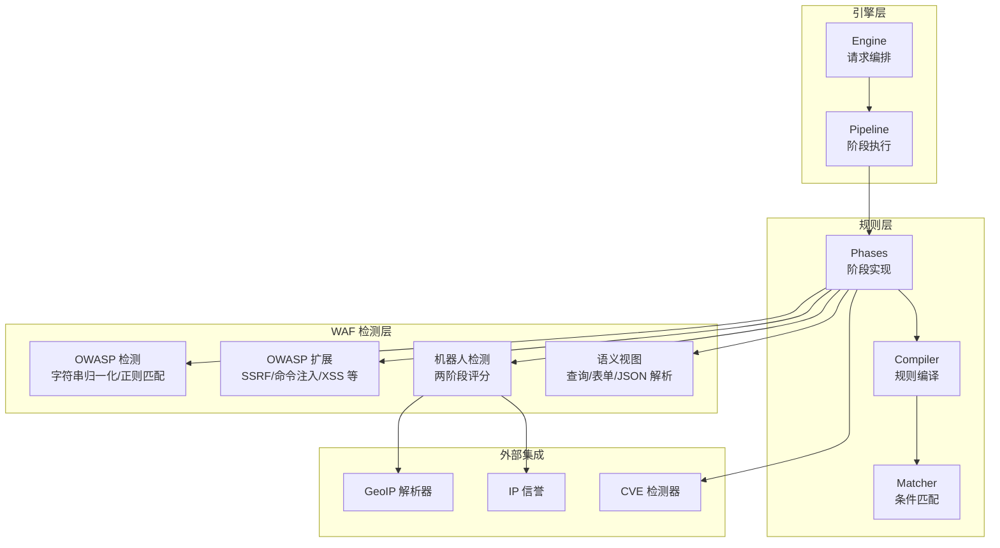
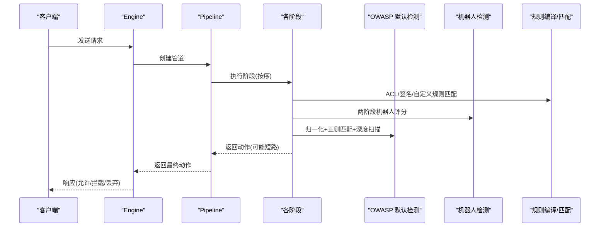
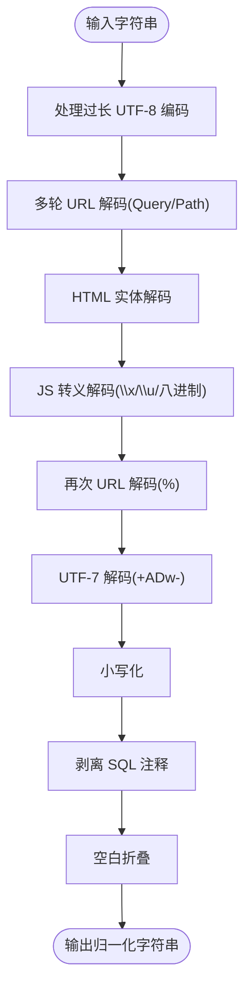
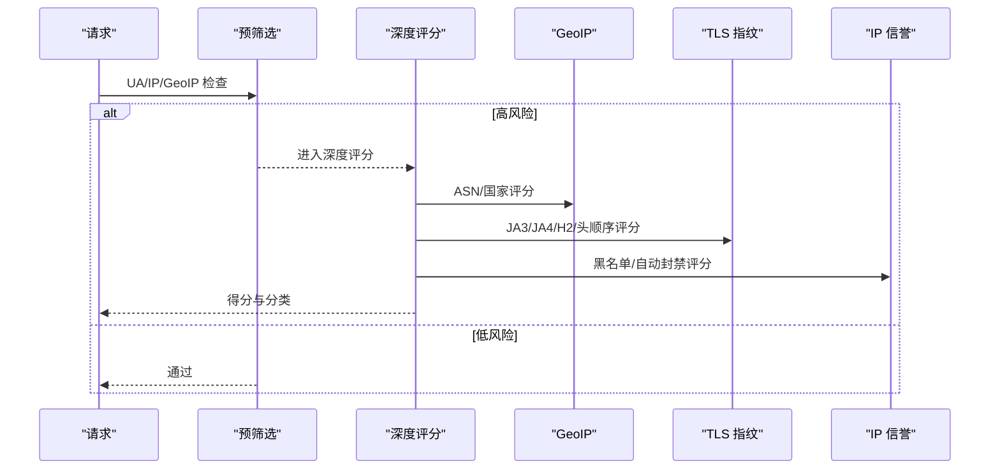
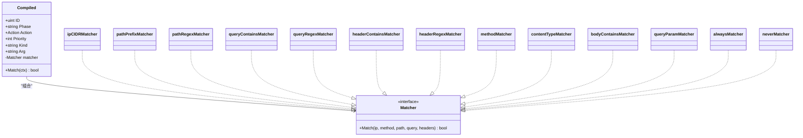
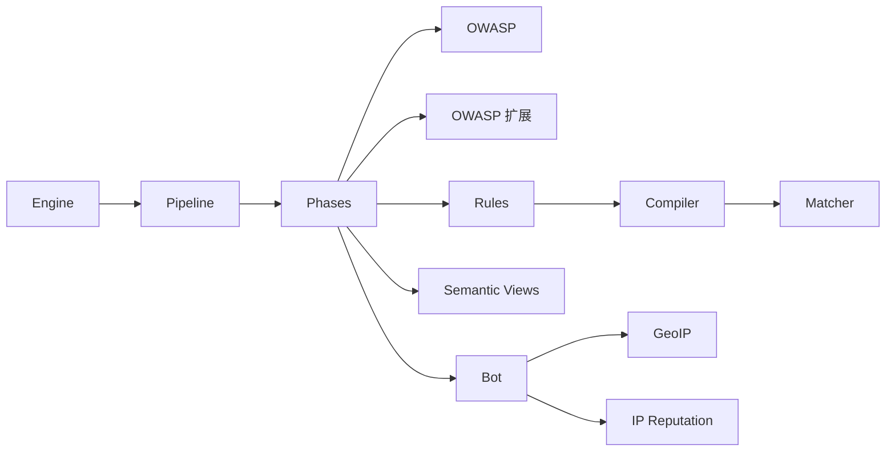

# 检测算法与技术

<cite>
**本文引用的文件**
- [internal/waf/owasp.go](file://internal/waf/owasp.go)
- [internal/waf/owasp_extended.go](file://internal/waf/owasp_extended.go)
- [internal/waf/eval.go](file://internal/waf/eval.go)
- [internal/waf/bot.go](file://internal/waf/bot.go)
- [internal/waf/semantic.go](file://internal/waf/semantic.go)
- [internal/core/rules/matcher.go](file://internal/core/rules/matcher.go)
- [internal/core/rules/compiler.go](file://internal/core/rules/compiler.go)
- [internal/core/rules/phases.go](file://internal/core/rules/phases.go)
- [internal/core/engine/engine.go](file://internal/core/engine/engine.go)
- [internal/core/pipeline/pipeline.go](file://internal/core/pipeline/pipeline.go)
</cite>

## 目录
1. [简介](#简介)
2. [项目结构](#项目结构)
3. [核心组件](#核心组件)
4. [架构总览](#架构总览)
5. [详细组件分析](#详细组件分析)
6. [依赖关系分析](#依赖关系分析)
7. [性能考量](#性能考量)
8. [故障排查指南](#故障排查指南)
9. [结论](#结论)
10. [附录](#附录)

## 简介
本文件系统性梳理 OWASP 检测算法与技术在代码库中的实现，重点覆盖：
- 字符串归一化处理（URL 解码、HTML 实体解码、JavaScript 转义序列解码、UTF-7 解码、SQL 注释剥离、空白折叠）
- 正则表达式匹配策略与恶意模式识别
- 多层检测架构（快速路径过滤、深度解码扫描、上下文感知分析）
- 检测精度优化（误报抑制、上下文分析、阈值控制）
- 性能优化（目标长度限制、内存管理、正则缓存）
- 检测结果评分与威胁等级评估

## 项目结构
该 WAF 采用分层架构：引擎负责编排各阶段，规则子系统提供匹配器与编译器，WAF 子系统实现 OWASP 默认检测、CVE 检测、机器人检测与语义视图解析；前端通过 Next.js 提供管理界面。

图表来源
- [internal/core/engine/engine.go:15-129](file://internal/core/engine/engine.go#L15-L129)
- [internal/core/pipeline/pipeline.go:25-70](file://internal/core/pipeline/pipeline.go#L25-L70)
- [internal/core/rules/phases.go:246-358](file://internal/core/rules/phases.go#L246-L358)
- [internal/waf/owasp.go:48-234](file://internal/waf/owasp.go#L48-L234)
- [internal/waf/owasp_extended.go:11-76](file://internal/waf/owasp_extended.go#L11-L76)
- [internal/waf/bot.go:126-244](file://internal/waf/bot.go#L126-L244)
- [internal/waf/semantic.go:11-55](file://internal/waf/semantic.go#L11-L55)

章节来源
- [internal/core/engine/engine.go:15-129](file://internal/core/engine/engine.go#L15-L129)
- [internal/core/pipeline/pipeline.go:25-70](file://internal/core/pipeline/pipeline.go#L25-L70)
- [internal/core/rules/phases.go:246-358](file://internal/core/rules/phases.go#L246-L358)

## 核心组件
- OWASP 默认检测：统一入口函数，包含字符串归一化、快速路径过滤、深度解码扫描、协议级检查与路径危险模式识别。
- OWASP 扩展检测：针对 SSRF、命令注入、XXE、LDAP 注入、NoSQL 注入、模板注入、JNDI/Log4Shell、CRLF、表达式语言注入、反序列化攻击等的专用规则与指示器。
- 规则编译与匹配：将存储规则转换为运行时可执行的编译规则，支持复合条件与正则缓存。
- 机器人检测：两阶段流程（快速预筛选 + 深度指纹评分），结合 GeoIP、TLS/HTTP2 指纹数据库与 IP 信誉。
- 语义视图：按 Content-Type 解析查询参数、表单字段与 JSON 值，用于更细粒度的目标提取与扫描。

章节来源
- [internal/waf/owasp.go:48-234](file://internal/waf/owasp.go#L48-L234)
- [internal/waf/owasp_extended.go:11-76](file://internal/waf/owasp_extended.go#L11-L76)
- [internal/core/rules/compiler.go:11-55](file://internal/core/rules/compiler.go#L11-L55)
- [internal/core/rules/matcher.go:11-133](file://internal/core/rules/matcher.go#L11-L133)
- [internal/waf/bot.go:126-244](file://internal/waf/bot.go#L126-L244)
- [internal/waf/semantic.go:11-55](file://internal/waf/semantic.go#L11-L55)

## 架构总览
WAF 引擎按阶段顺序执行：IP 信誉 → ACL → 机器人检测 → 请求速率限制 → OWASP 默认检测 → CVE 检测 → 签名/自定义规则。每个阶段返回动作结果，Drop 最高优先级短路，Intercept 终止但不短路，Observe 收集日志。

图表来源
- [internal/core/engine/engine.go:57-129](file://internal/core/engine/engine.go#L57-L129)
- [internal/core/pipeline/pipeline.go:46-70](file://internal/core/pipeline/pipeline.go#L46-L70)
- [internal/core/rules/phases.go:32-120](file://internal/core/rules/phases.go#L32-L120)

## 详细组件分析

### 字符串归一化与预处理
- 多轮 URL 解码（QueryUnescape + PathUnescape）以消除嵌套编码与 UTF-7 过长编码（如 %C0%BC → <）。
- HTML 实体解码与 JavaScript 转义序列解码（\xNN、\uXXXX、\u{XXXX}、八进制）。
- UTF-7 解码（+ADw- → <）。
- SQL 注释剥离（保留版本特定注释 /*!...*/）。
- 空白折叠与大小写归一化。
- 目标长度限制（默认 16384）与“纯字母数字+安全字符”快速跳过。

图表来源
- [internal/waf/owasp.go:498-566](file://internal/waf/owasp.go#L498-L566)
- [internal/waf/owasp.go:882-891](file://internal/waf/owasp.go#L882-L891)
- [internal/waf/owasp.go:841-880](file://internal/waf/owasp.go#L841-L880)
- [internal/waf/owasp.go:568-602](file://internal/waf/owasp.go#L568-L602)

章节来源
- [internal/waf/owasp.go:38-39](file://internal/waf/owasp.go#L38-L39)
- [internal/waf/owasp.go:498-566](file://internal/waf/owasp.go#L498-L566)
- [internal/waf/owasp.go:882-891](file://internal/waf/owasp.go#L882-L891)
- [internal/waf/owasp.go:841-880](file://internal/waf/owasp.go#L841-L880)
- [internal/waf/owasp.go:568-602](file://internal/waf/owasp.go#L568-L602)

### 快速路径过滤与指示器
- isCleanTarget：仅字母数字+安全字符且长度≤256时直接跳过后续处理。
- hasSuspiciousContent：O(n) 扫描可疑字符集，未命中则跳过正则电池。
- 各类别指示器（hasSQLiIndicator、hasXSSIndicator、hasCmdIndicator 等）在进入对应正则电池前进行快速判定，显著降低 CPU 开销。

章节来源
- [internal/waf/owasp.go:930-963](file://internal/waf/owasp.go#L930-L963)
- [internal/waf/owasp.go:973-985](file://internal/waf/owasp.go#L973-L985)
- [internal/waf/owasp.go:1016-1245](file://internal/waf/owasp.go#L1016-L1245)

### 正则表达式匹配策略与恶意模式识别
- OWASP 默认检测：CheckOWASP 对路径、查询、头部、请求体目标进行归一化后扫描，按类别依次调用检查函数，命中即返回或继续收集多击。
- 分类专用正则电池：
  - SQL 注入：sqliPatterns（含 UNION、布尔盲注、时间盲注、函数调用、OUTFILE/DUMPFILE 等）。
  - XSS：xssPatterns（事件处理器、data:、SVG/MathML、构造器链、DOM sink 等）。
  - 命令注入：cmdInjectPatterns（管道、重定向、环境变量、IFS 替代、反引号、here-string 等）。
  - 其他：SSRF、XXE、LDAP 注入、NoSQL 注入、模板注入、JNDI/Log4Shell、CRLF、表达式语言、反序列化、路径穿越等。

章节来源
- [internal/waf/owasp.go:48-234](file://internal/waf/owasp.go#L48-L234)
- [internal/waf/owasp.go:1881-1953](file://internal/waf/owasp.go#L1881-L1953)
- [internal/waf/owasp.go:2069-2169](file://internal/waf/owasp.go#L2069-L2169)
- [internal/waf/owasp_extended.go:28-76](file://internal/waf/owasp_extended.go#L28-L76)
- [internal/waf/owasp_extended.go:80-156](file://internal/waf/owasp_extended.go#L80-L156)
- [internal/waf/owasp_extended.go:160-203](file://internal/waf/owasp_extended.go#L160-L203)
- [internal/waf/owasp_extended.go:206-246](file://internal/waf/owasp_extended.go#L206-L246)
- [internal/waf/owasp_extended.go:248-282](file://internal/waf/owasp_extended.go#L248-L282)
- [internal/waf/owasp_extended.go:284-365](file://internal/waf/owasp_extended.go#L284-L365)
- [internal/waf/owasp_extended.go:441-491](file://internal/waf/owasp_extended.go#L441-L491)
- [internal/waf/owasp_extended.go:493-521](file://internal/waf/owasp_extended.go#L493-L521)
- [internal/waf/owasp_extended.go:523-592](file://internal/waf/owasp_extended.go#L523-L592)
- [internal/waf/owasp_extended.go:594-648](file://internal/waf/owasp_extended.go#L594-L648)
- [internal/waf/owasp_extended.go:650-696](file://internal/waf/owasp_extended.go#L650-L696)

### 上下文感知分析与误报抑制
- 敏感度阈值：低/中/高三档阈值，影响是否抑制结构化 HTML-only 的 XSS 命中。
- 类别级误报抑制：
  - SQL 注入：针对 sleep()/benchmark()/waitfor、OR 1=1、union select、into outfile 等场景的上下文确认。
  - XSS：区分被动结构（iframe/object/embed）与主动脚本执行（eval/alert/document.write 等），CDN 回调函数引用（无括号）不视为 XSS。
  - 命令注入：backtick 命令替换、null byte/newline 注入需高置信度上下文才报告。
  - 路径穿越：仅对敏感文件/目录命中才抑制。
  - SSRF：本地回环与 metadata 仅在特定上下文中才判定为攻击。
  - 反序列化：Ruby Marshal 短载荷等抑制。
  - NoSQL 注入：需存在操作符或上下文才判定。
  - 表达式语言：需存在 EL 关键字才判定。
  - Webshell：需 PHP/Shell 特征才判定。

章节来源
- [internal/waf/owasp.go:375-384](file://internal/waf/owasp.go#L375-L384)
- [internal/waf/owasp.go:1247-1445](file://internal/waf/owasp.go#L1247-L1445)
- [internal/waf/owasp.go:1447-1573](file://internal/waf/owasp.go#L1447-L1573)
- [internal/waf/owasp.go:1631-1679](file://internal/waf/owasp.go#L1631-L1679)
- [internal/waf/owasp.go:1778-1880](file://internal/waf/owasp.go#L1778-L1880)
- [internal/waf/owasp.go:189-1953](file://internal/waf/owasp.go#L189-L1953)
- [internal/waf/owasp.go:2069-2169](file://internal/waf/owasp.go#L2069-L2169)

### 深度解码扫描与 Base64 提取
- 针对包含大量 \u00XX JS 转义的目标进行深度解码，提取 Base64 token 并二次归一化扫描，提升对 JSFuck、编码混淆等的检测能力。
- hasBase64Candidate 快速判断是否存在连续 Base64 字符串，避免昂贵正则匹配。
- decodeBase64IfSuspicious：仅当解码后可打印 ASCII 比例≥80% 时才认为可疑，否则尝试偏移一位继续尝试，抑制二进制噪声。

章节来源
- [internal/waf/owasp.go:176-216](file://internal/waf/owasp.go#L176-L216)
- [internal/waf/owasp.go:821-837](file://internal/waf/owasp.go#L821-L837)
- [internal/waf/owasp.go:893-924](file://internal/waf/owasp.go#L893-L924)

### 协议级与路径级检查
- 协议违规检查：同时设置 Content-Length 与 Transfer-Encoding、重复 Content-Length、超大头部长度等。
- 路径危险模式：双扩展上传（shell.php.jpg）、危险文件扩展、CVE 相关端点（F5、Liferay、OFBiz、Confluence、Cisco ASA、ThinkPHP、Atlassian gadgets、Nexus、Coremail 等）。

章节来源
- [internal/waf/owasp_extended.go:650-696](file://internal/waf/owasp_extended.go#L650-L696)
- [internal/waf/owasp.go:257-285](file://internal/waf/owasp.go#L257-L285)
- [internal/waf/owasp.go:287-373](file://internal/waf/owasp.go#L287-L373)

### 机器人检测（两阶段）
- 阶段一（快速预筛选）：已知恶意工具 UA、IP 信誉黑名单/自动封禁、GeoIP 高风险 ASN/国家。
- 阶段二（深度评分）：UA/头启发式、TLS/HTTP2 指纹（JA3/JA4/H2/头顺序）、IP 信誉加权，综合得分分级（人类/良好/可疑/恶意）。
- 两阶段阈值可配置，恶意分数达到阈值使用 Drop 动作。

图表来源
- [internal/waf/bot.go:126-161](file://internal/waf/bot.go#L126-L161)
- [internal/waf/bot.go:164-224](file://internal/waf/bot.go#L164-L224)
- [internal/waf/bot.go:394-454](file://internal/waf/bot.go#L394-L454)

章节来源
- [internal/waf/bot.go:126-161](file://internal/waf/bot.go#L126-L161)
- [internal/waf/bot.go:164-224](file://internal/waf/bot.go#L164-L224)
- [internal/waf/bot.go:394-454](file://internal/waf/bot.go#L394-L454)

### 规则编译与匹配
- 规则解析：ParsePattern 支持简单模式与 JSON 复合条件。
- 匹配器：IP/CIDR、路径前缀/正则、查询包含/正则、头包含/正则、方法、内容类型、用户代理、查询参数等。
- 编译：Compile 将规则转换为带预构建匹配器的运行时对象，按优先级排序。
- 正则缓存：cachedCompile 复用编译后的正则，减少重复编译开销。

图表来源
- [internal/core/rules/compiler.go:11-55](file://internal/core/rules/compiler.go#L11-L55)
- [internal/core/rules/matcher.go:11-133](file://internal/core/rules/matcher.go#L11-L133)
- [internal/core/rules/matcher.go:166-261](file://internal/core/rules/matcher.go#L166-L261)
- [internal/core/rules/matcher.go:271-296](file://internal/core/rules/matcher.go#L271-L296)

章节来源
- [internal/core/rules/compiler.go:11-55](file://internal/core/rules/compiler.go#L11-L55)
- [internal/core/rules/matcher.go:11-133](file://internal/core/rules/matcher.go#L11-L133)
- [internal/core/rules/matcher.go:166-261](file://internal/core/rules/matcher.go#L166-L261)
- [internal/core/rules/matcher.go:271-296](file://internal/core/rules/matcher.go#L271-L296)

### OWASP 默认阶段与体目标提取
- OWASP 阶段：先扫描 multipart 文件名/内容类型（文件上传检查），再从不同 Content-Type 中提取文本目标进行 OWASP 检测。
- Content-Type 分支：
  - application/x-www-form-urlencoded：解析键值并解码，同时扫描键名与值。
  - application/json：递归提取所有字符串值（最多 100 层，防止爆炸）。
  - multipart/form-data：提取非文件字段文本（限制 4096 字节）。
  - text/*、application/xml、application/soap：限制大小扫描。
  - 其他：仅当首 512 字节可打印 ASCII 比例≥90% 时扫描，避免二进制误报。

章节来源
- [internal/core/rules/phases.go:246-303](file://internal/core/rules/phases.go#L246-L303)
- [internal/core/rules/phases.go:360-405](file://internal/core/rules/phases.go#L360-L405)
- [internal/core/rules/phases.go:407-442](file://internal/core/rules/phases.go#L407-L442)
- [internal/core/rules/phases.go:444-477](file://internal/core/rules/phases.go#L444-L477)
- [internal/core/rules/phases.go:479-540](file://internal/core/rules/phases.go#L479-L540)

### 语义视图解析
- LazyQuery：延迟解析查询字符串，键值均解码。
- LazyBody：根据 Content-Type 解析表单或 JSON，限制最大字节数，避免资源滥用。

章节来源
- [internal/waf/semantic.go:11-55](file://internal/waf/semantic.go#L11-L55)

## 依赖关系分析
- 引擎层依赖规则层与 WAF 检测层，形成“编排—规则—检测”的清晰边界。
- 规则层内部通过编译器与匹配器解耦，支持灵活扩展。
- WAF 检测层内部模块化，OWASP 默认检测与扩展检测相互独立，便于维护与演进。
- 机器人检测与 GeoIP、IP 信誉耦合，形成外部依赖集成。

图表来源
- [internal/core/engine/engine.go:15-129](file://internal/core/engine/engine.go#L15-L129)
- [internal/core/pipeline/pipeline.go:25-70](file://internal/core/pipeline/pipeline.go#L25-L70)
- [internal/core/rules/phases.go:246-358](file://internal/core/rules/phases.go#L246-L358)
- [internal/waf/bot.go:126-244](file://internal/waf/bot.go#L126-L244)

章节来源
- [internal/core/engine/engine.go:15-129](file://internal/core/engine/engine.go#L15-L129)
- [internal/core/pipeline/pipeline.go:25-70](file://internal/core/pipeline/pipeline.go#L25-L70)
- [internal/core/rules/phases.go:246-358](file://internal/core/rules/phases.go#L246-L358)

## 性能考量
- 目标长度限制：maxTargetLen=16384，避免正则爆炸。
- 快速路径：isCleanTarget、hasSuspiciousContent、各类 hasXxxIndicator 在进入正则电池前快速过滤。
- 正则缓存：regexCache 复用编译结果，降低编译成本。
- 内容类型分支：对二进制/未知类型进行可打印比例采样，避免扫描。
- 正则优化：stripSQLComments、collapseWhitespace 使用高效实现，避免正则开销。
- 深度扫描阈值：仅对长文本（≥30）且包含较多 JS 转义（≥5）才触发深度解码扫描。

章节来源
- [internal/waf/owasp.go:38-39](file://internal/waf/owasp.go#L38-L39)
- [internal/waf/owasp.go:930-985](file://internal/waf/owasp.go#L930-L985)
- [internal/core/rules/matcher.go:271-296](file://internal/core/rules/matcher.go#L271-L296)
- [internal/core/rules/phases.go:360-405](file://internal/core/rules/phases.go#L360-L405)
- [internal/waf/owasp.go:841-880](file://internal/waf/owasp.go#L841-L880)
- [internal/waf/owasp.go:568-602](file://internal/waf/owasp.go#L568-L602)
- [internal/waf/owasp.go:176-191](file://internal/waf/owasp.go#L176-L191)

## 故障排查指南
- 误报抑制生效：若命中规则但未拦截，检查 isXSSFalsePositive/isSQLiFalsePositive/isCmdInjectionFalsePositive 等抑制逻辑，确认是否缺少高置信度上下文。
- 正则未命中：确认 hasXxxIndicator 是否提前返回 false，导致未进入正则电池。
- 正则性能问题：检查 regexCache 是否命中，必要时调整阈值或拆分规则。
- 机器人误判：调整两阶段阈值，或检查 UA/头启发式特征是否被错误识别为恶意。
- 文件上传误报：检查危险扩展映射与双扩展检测逻辑。

章节来源
- [internal/waf/owasp.go:1247-1573](file://internal/waf/owasp.go#L1247-L1573)
- [internal/waf/owasp.go:1631-1679](file://internal/waf/owasp.go#L1631-L1679)
- [internal/core/rules/matcher.go:271-296](file://internal/core/rules/matcher.go#L271-L296)
- [internal/waf/bot.go:331-376](file://internal/waf/bot.go#L331-L376)

## 结论
该 WAF 检测体系通过“快速路径过滤 + 多轮归一化 + 分类指示器 + 正则电池 + 上下文抑制 + 深度解码扫描”的组合，实现了对常见 OWASP Top Attack 的全面覆盖与高精度抑制。配合规则编译与正则缓存、目标长度限制与内容类型分支，有效平衡了准确性与性能。两阶段机器人检测进一步提升了对自动化扫描与恶意流量的识别能力。

## 附录
- 检测结果评分与威胁等级：OWASP 默认检测返回 OWASPHit（包含类别、规则 ID、分数、描述），由上层阶段根据配置动作（允许/观察/拦截/丢弃）决定处置。
- 阈值控制：通过敏感度级别（低/中/高）控制抑制强度与报警阈值，兼顾误报与漏报。

章节来源
- [internal/waf/owasp.go:41-46](file://internal/waf/owasp.go#L41-L46)
- [internal/waf/owasp.go:375-384](file://internal/waf/owasp.go#L375-L384)
- [internal/core/rules/phases.go:246-303](file://internal/core/rules/phases.go#L246-L303)