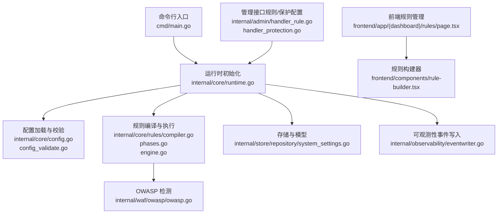
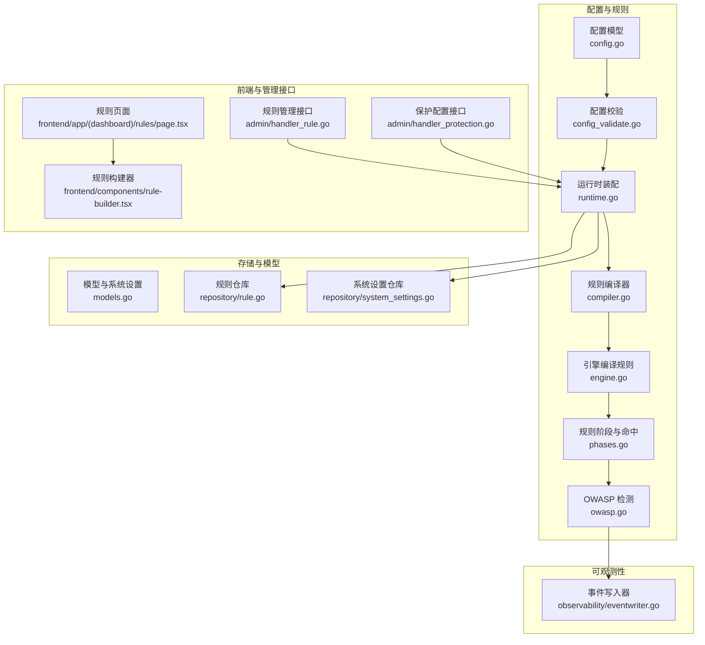
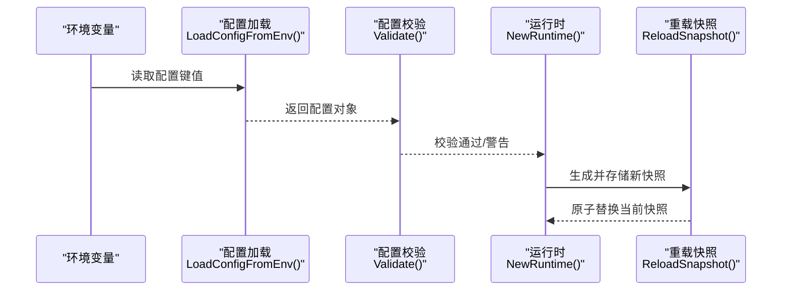
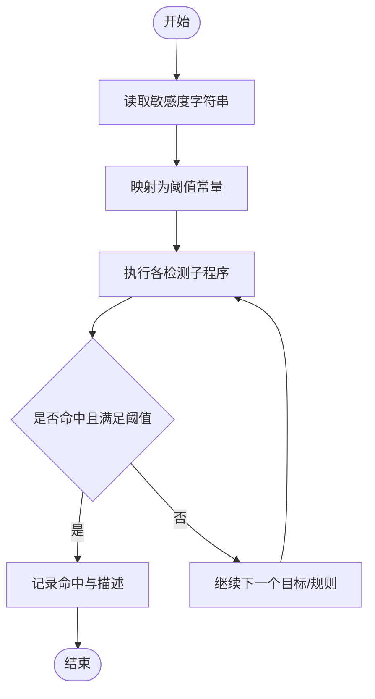
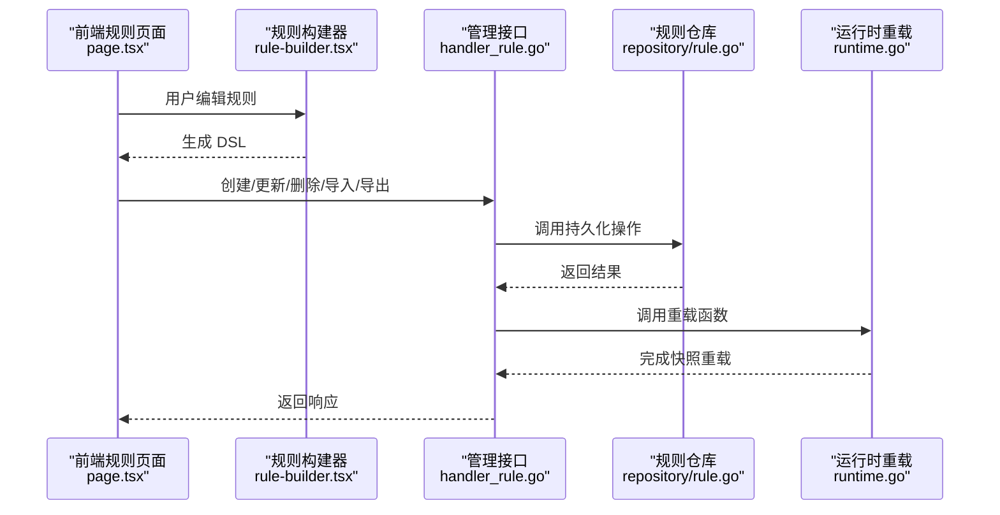
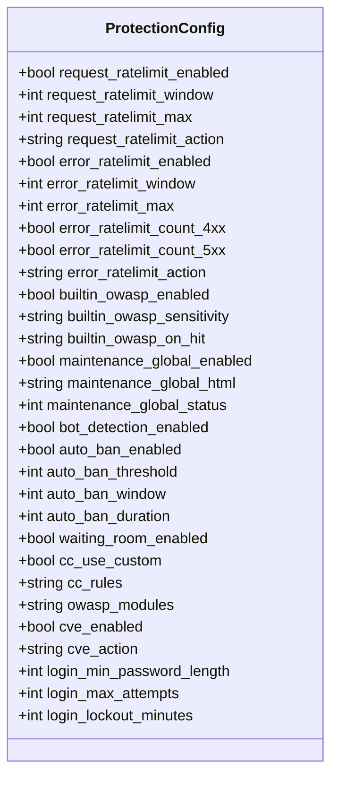
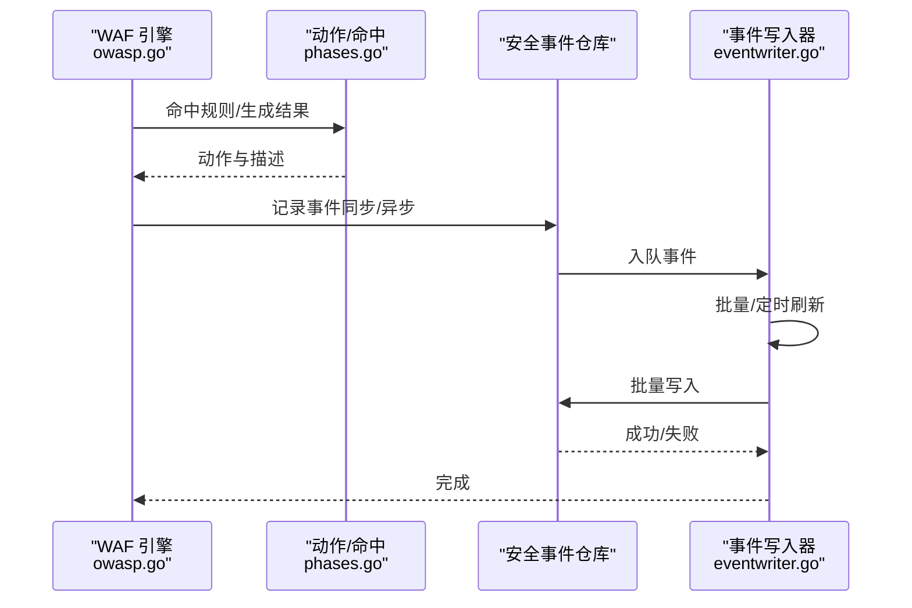
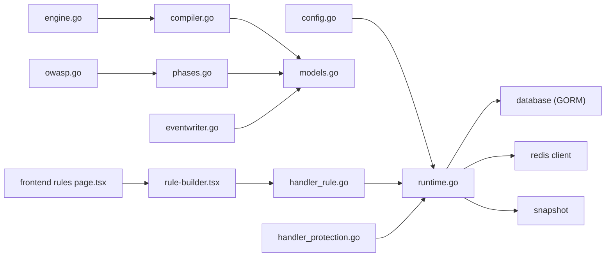

> [返回 安全防护功能](../安全防护功能.md)

# 配置与管理

<cite>
**本文引用的文件**
- [main.go](file://cmd/main.go)
- [config.go](file://internal/core/config.go)
- [config_validate.go](file://internal/core/config_validate.go)
- [runtime.go](file://internal/core/runtime.go)
- [system_settings.go](file://internal/store/repository/system_settings.go)
- [compiler.go](file://internal/core/rules/compiler.go)
- [phases.go](file://internal/core/rules/phases.go)
- [engine.go](file://internal/core/engine/engine.go)
- [owasp.go](file://internal/waf/owasp/owasp.go)
- [page.tsx](file://frontend/app/(dashboard)/rules/page.tsx)
- [rule-builder.tsx](file://frontend/components/rule-builder.tsx)
- [配置管理系统.md](file://docs/配置管理系统/配置管理系统.md)
- [热重载系统.md](file://docs/配置管理系统/热重载系统.md)
- [配置验证系统.md](file://docs/配置管理系统/配置验证系统.md)
- [配置快照机制.md](file://docs/配置管理系统/配置快照机制.md)
- [配置与管理.md](file://docs/安全防护功能/OWASP 检测/配置与管理.md)
</cite>

## 目录
1. [简介](#简介)
2. [项目结构](#项目结构)
3. [核心组件](#核心组件)
4. [架构总览](#架构总览)
5. [详细组件分析](#详细组件分析)
6. [依赖分析](#依赖分析)
7. [性能考虑](#性能考虑)
8. [故障排查指南](#故障排查指南)
9. [结论](#结论)
10. [附录](#附录)

## 简介
本文件面向 OWASP 检测配置与管理，系统性梳理配置项、规则管理、动态重载、检测结果存储与日志、告警触发、监控指标与性能统计、最佳实践与常见问题。读者可据此完成从“敏感度与阈值”到“规则启停与自定义”的全链路配置与运维。

## 项目结构
- 后端入口：应用启动入口位于命令行入口文件，随后进入核心运行时初始化与配置加载。
- 配置层：环境变量驱动的配置模型与校验，支持数据库、Redis、管理平面绑定地址等。
- 规则引擎：规则编译、排序、匹配与阶段执行；OWASP 内置规则按敏感度阈值执行。
- 存储层：规则、站点、系统设置、安全事件等模型与仓库。
- 前端：可视化规则构建器与规则列表页面，支持 DSL 编写、验证与测试。
- 可观测性：事件异步落库、缓冲与批处理，避免阻塞数据面。

**图表来源**
- [main.go:1-10](file://cmd/main.go#L1-L10)
- [runtime.go:27-80](file://internal/core/runtime.go#L27-L80)
- [config.go:113-182](file://internal/core/config.go#L113-L182)
- [config_validate.go:9-47](file://internal/core/config_validate.go#L9-L47)
- [compiler.go:27-55](file://internal/core/rules/compiler.go#L27-L55)
- [phases.go:545-568](file://internal/core/rules/phases.go#L545-L568)
- [engine.go:160-175](file://internal/core/engine/engine.go#L160-L175)
- [owasp.go:48-234](file://internal/waf/owasp/owasp.go#L48-L234)
- [system_settings.go:15-21](file://internal/store/repository/system_settings.go#L15-L21)
- [eventwriter.go:27-39](file://internal/observability/eventwriter.go#L27-L39)
- [page.tsx](file://frontend/app/(dashboard)/rules/page.tsx#L1-L76)
- [rule-builder.tsx:1-556](file://frontend/components/rule-builder.tsx#L1-L556)
- [handler_rule.go:46-102](file://internal/admin/handler_rule.go#L46-L102)
- [handler_protection.go:60-75](file://internal/admin/handler_protection.go#L60-L75)

**章节来源**
- [main.go:1-10](file://cmd/main.go#L1-L10)
- [runtime.go:27-80](file://internal/core/runtime.go#L27-L80)
- [config.go:113-182](file://internal/core/config.go#L113-L182)
- [config_validate.go:9-47](file://internal/core/config_validate.go#L9-L47)

## 核心组件
- 配置模型与环境变量映射：数据库驱动/DSN、数据目录、Redis 连接、管理平面绑定地址、CVE 与 Bot/Drop 等专项配置。
- 配置校验：驱动类型、DSN、管理绑定地址、Redis 地址合法性检查及常见误配警告。
- 运行时装配：打开数据库、可选 Redis、缓存层、快照持有者，以及重载快照能力。
- 规则编译与执行：规则解析 DSL、构建匹配器、按优先级排序、按阶段执行。
- OWASP 检测：内置规则集，按敏感度阈值控制检测严格程度，多类攻击类别覆盖。
- 存储与模型：规则、站点、系统设置、安全事件等；系统设置以键值形式存储保护配置。
- 前端规则管理：可视化规则构建器、DSL 输入、规则验证与测试、列表 CRUD。
- 管理接口：规则增删改查、导入导出、规则测试；保护配置读取/写入。
- 事件写入：异步批量写入安全事件，降低对数据面影响。

**章节来源**
- [config.go:75-102](file://internal/core/config.go#L75-L102)
- [config_validate.go:9-47](file://internal/core/config_validate.go#L9-L47)
- [runtime.go:82-111](file://internal/core/runtime.go#L82-L111)
- [compiler.go:27-55](file://internal/core/rules/compiler.go#L27-L55)
- [owasp.go:48-234](file://internal/waf/owasp/owasp.go#L48-L234)
- [system_settings.go:15-21](file://internal/store/repository/system_settings.go#L15-L21)
- [page.tsx](file://frontend/app/(dashboard)/rules/page.tsx#L1-L76)
- [rule-builder.tsx:1-556](file://frontend/components/rule-builder.tsx#L1-L556)
- [handler_rule.go:46-102](file://internal/admin/handler_rule.go#L46-L102)
- [eventwriter.go:27-39](file://internal/observability/eventwriter.go#L27-L39)

## 架构总览
下图展示配置与规则管理在系统中的位置与交互：

**图表来源**
- [config.go:75-102](file://internal/core/config.go#L75-L102)
- [config_validate.go:9-47](file://internal/core/config_validate.go#L9-L47)
- [runtime.go:27-80](file://internal/core/runtime.go#L27-L80)
- [compiler.go:27-55](file://internal/core/rules/compiler.go#L27-L55)
- [phases.go:545-568](file://internal/core/rules/phases.go#L545-L568)
- [engine.go:160-175](file://internal/core/engine/engine.go#L160-L175)
- [owasp.go:48-234](file://internal/waf/owasp/owasp.go#L48-L234)
- [models.go:79-92](file://internal/store/models.go#L79-L92)
- [rule.go:13-23](file://internal/store/repository/rule.go#L13-L23)
- [system_settings.go:15-21](file://internal/store/repository/system_settings.go#L15-L21)
- [page.tsx](file://frontend/app/(dashboard)/rules/page.tsx#L1-L76)
- [rule-builder.tsx:1-556](file://frontend/components/rule-builder.tsx#L1-L556)
- [handler_rule.go:46-102](file://internal/admin/handler_rule.go#L46-L102)
- [handler_protection.go:60-75](file://internal/admin/handler_protection.go#L60-L75)
- [eventwriter.go:27-39](file://internal/observability/eventwriter.go#L27-L39)

## 详细组件分析

### 配置系统与动态重载
- 配置来源与默认值：通过环境变量加载数据库、Redis、管理绑定地址等；提供默认值与可覆盖项。
- 配置校验：驱动类型、DSN、管理绑定地址、Redis 地址合法性检查；对常见误配给出警告。
- 运行时重载：根据数据库版本号生成快照，缓存并原子替换当前快照，供引擎读取。

**图表来源**
- [config.go:113-182](file://internal/core/config.go#L113-L182)
- [config_validate.go:9-47](file://internal/core/config_validate.go#L9-L47)
- [runtime.go:27-80](file://internal/core/runtime.go#L27-L80)
- [runtime.go:82-111](file://internal/core/runtime.go#L82-L111)

**章节来源**
- [config.go:113-182](file://internal/core/config.go#L113-L182)
- [config_validate.go:9-47](file://internal/core/config_validate.go#L9-L47)
- [runtime.go:82-111](file://internal/core/runtime.go#L82-L111)

### 敏感度级别、阈值与规则优先级
- 敏感度与阈值：OWASP 检测函数接收敏感度字符串，转换为阈值常量，用于控制检测严格度。
- 规则优先级：规则模型包含优先级字段，默认值；编译阶段按优先级升序、ID 升序稳定排序。
- 阶段与动作：规则按阶段执行（如 ACL、速率限制、OWASP 默认、签名、自定义），动作支持允许/拦截/观察/丢弃等。

**图表来源**
- [owasp.go:375-384](file://internal/waf/owasp/owasp.go#L375-L384)
- [compiler.go:48-54](file://internal/core/rules/compiler.go#L48-L54)
- [models.go:44-65](file://internal/store/models.go#L44-L65)

**章节来源**
- [owasp.go:375-384](file://internal/waf/owasp/owasp.go#L375-L384)
- [compiler.go:48-54](file://internal/core/rules/compiler.go#L48-L54)
- [models.go:44-65](file://internal/store/models.go#L44-L65)

### 规则启用/禁用、自定义规则与修改流程
- 规则模型：包含名称、策略 ID、阶段、模式（DSL）、动作、优先级、启用状态等。
- 规则仓库：提供分页列表、按策略查询、增删改查等操作；按优先级与 ID 排序。
- 管理接口：提供创建、更新、删除、导出、导入、测试规则的 API；每次变更后触发重载。
- 前端规则页面：可视化字段与 DSL 输入；规则构建器支持简单/复合规则、验证与测试。
- 规则测试：后端提供测试接口，前端提供简易本地测试逻辑。

**图表来源**
- [page.tsx](file://frontend/app/(dashboard)/rules/page.tsx#L1-L76)
- [rule-builder.tsx:114-150](file://frontend/components/rule-builder.tsx#L114-L150)
- [handler_rule.go:46-102](file://internal/admin/handler_rule.go#L46-L102)
- [rule.go:13-23](file://internal/store/repository/rule.go#L13-L23)
- [runtime.go:82-99](file://internal/core/runtime.go#L82-L99)

**章节来源**
- [models.go:79-92](file://internal/store/models.go#L79-L92)
- [handler_rule.go:46-102](file://internal/admin/handler_rule.go#L46-L102)
- [rule.go:13-23](file://internal/store/repository/rule.go#L13-L23)
- [page.tsx](file://frontend/app/(dashboard)/rules/page.tsx#L1-L76)
- [rule-builder.tsx:114-150](file://frontend/components/rule-builder.tsx#L114-L150)

### 保护配置（含 OWASP 敏感度与动作）
- 系统设置模型：以键值形式存储保护配置，包含请求/错误速率限制、OWASP 开关与敏感度、动作、维护模式、Bot 检测开关、自动封禁、CC 保护等。
- 保护配置接口：读取时展开模块映射与 CC 规则数组；写入时先解析原始 JSON，再映射到结构体保存。
- 前端保护页面：展示全局配置与模块级敏感度映射，便于统一管理。

**图表来源**
- [models.go:247-294](file://internal/store/models.go#L247-L294)
- [handler_protection.go:43-75](file://internal/admin/handler_protection.go#L43-L75)

**章节来源**
- [models.go:247-294](file://internal/store/models.go#L247-L294)
- [handler_protection.go:43-75](file://internal/admin/handler_protection.go#L43-L75)

### 检测结果存储、日志与告警
- 安全事件模型：包含请求标识、客户端 IP、主机、路径、方法、UA、命中规则、阶段、动作、分类、地理信息、状态码等。
- 事件写入器：异步批量写入，带缓冲区与定时刷新，避免阻塞数据面；异常时记录错误日志。
- 日志记录：配置校验阶段输出警告；事件写入器在写入失败时记录错误。

**图表来源**
- [owasp.go:48-234](file://internal/waf/owasp/owasp.go#L48-L234)
- [phases.go:554-568](file://internal/core/rules/phases.go#L554-L568)
- [models.go:214-236](file://internal/store/models.go#L214-L236)
- [eventwriter.go:27-39](file://internal/observability/eventwriter.go#L27-L39)
- [eventwriter.go:95-104](file://internal/observability/eventwriter.go#L95-L104)

**章节来源**
- [models.go:214-236](file://internal/store/models.go#L214-L236)
- [eventwriter.go:27-39](file://internal/observability/eventwriter.go#L27-L39)
- [eventwriter.go:95-104](file://internal/observability/eventwriter.go#L95-L104)

### 监控指标、性能统计与故障诊断
- 监控维度：请求 QPS、命中率、各攻击类别分布、Top 攻击源与路径、事件写入延迟与吞吐。
- 性能统计：事件写入器批大小与刷新间隔可调；规则编译按优先级排序，减少运行时比较成本。
- 故障诊断：配置校验输出警告；事件写入失败记录错误；前端规则构建器提供 DSL 验证与测试。

**章节来源**
- [eventwriter.go:27-39](file://internal/observability/eventwriter.go#L27-L39)
- [compiler.go:48-54](file://internal/core/rules/compiler.go#L48-L54)
- [rule-builder.tsx:208-226](file://frontend/components/rule-builder.tsx#L208-L226)

## 依赖分析
- 组件耦合：规则编译器依赖动作与存储模型；运行时依赖数据库与可选 Redis；前端通过管理接口与后端交互。
- 外部依赖：数据库驱动、Redis 客户端、GORM、slog 等。
- 循环依赖：未见循环依赖迹象。

**图表来源**
- [config.go:75-102](file://internal/core/config.go#L75-L102)
- [runtime.go:27-80](file://internal/core/runtime.go#L27-L80)
- [compiler.go:27-55](file://internal/core/rules/compiler.go#L27-L55)
- [phases.go:545-568](file://internal/core/rules/phases.go#L545-L568)
- [engine.go:160-175](file://internal/core/engine/engine.go#L160-L175)
- [owasp.go:48-234](file://internal/waf/owasp/owasp.go#L48-L234)
- [handler_rule.go:46-102](file://internal/admin/handler_rule.go#L46-L102)
- [handler_protection.go:60-75](file://internal/admin/handler_protection.go#L60-L75)
- [page.tsx](file://frontend/app/(dashboard)/rules/page.tsx#L1-L76)
- [rule-builder.tsx:1-556](file://frontend/components/rule-builder.tsx#L1-L556)
- [eventwriter.go:27-39](file://internal/observability/eventwriter.go#L27-L39)

**章节来源**
- [config.go:75-102](file://internal/core/config.go#L75-L102)
- [runtime.go:27-80](file://internal/core/runtime.go#L27-L80)
- [compiler.go:27-55](file://internal/core/rules/compiler.go#L27-L55)
- [phases.go:545-568](file://internal/core/rules/phases.go#L545-L568)
- [engine.go:160-175](file://internal/core/engine/engine.go#L160-L175)
- [owasp.go:48-234](file://internal/waf/owasp/owasp.go#L48-L234)
- [handler_rule.go:46-102](file://internal/admin/handler_rule.go#L46-L102)
- [handler_protection.go:60-75](file://internal/admin/handler_protection.go#L60-L75)
- [page.tsx](file://frontend/app/(dashboard)/rules/page.tsx#L1-L76)
- [rule-builder.tsx:1-556](file://frontend/components/rule-builder.tsx#L1-L556)
- [eventwriter.go:27-39](file://internal/observability/eventwriter.go#L27-L39)

## 性能考虑
- 规则编译：按优先级与 ID 排序，减少运行时比较次数；仅启用规则参与编译。
- OWASP 检测：目标长度上限、快速路径跳过、规范化与解码多轮、二次扫描与深度解码，平衡准确度与性能。
- 事件写入：批量与定时刷新，缓冲区满时丢弃，避免阻塞数据面。
- 配置重载：基于数据库版本号构建快照，缓存命中可复用，避免频繁重建。

**章节来源**
- [compiler.go:48-54](file://internal/core/rules/compiler.go#L48-L54)
- [owasp.go:38-46](file://internal/waf/owasp/owasp.go#L38-L46)
- [owasp.go:176-216](file://internal/waf/owasp/owasp.go#L176-L216)
- [eventwriter.go:27-39](file://internal/observability/eventwriter.go#L27-L39)
- [runtime.go:82-99](file://internal/core/runtime.go#L82-L99)

## 故障排查指南
- 配置错误
  - 数据库驱动非法：检查驱动值是否为 sqlite/mysql/postgres。
  - DSN 为空：确认数据库连接串配置。
  - 管理绑定地址格式错误：确保 host:port 格式。
  - Redis 地址格式错误：确保 host:port 格式。
  - SQLite 与 DSN 类型不一致：注意 DSN 与驱动的匹配。
- 规则相关
  - 规则无法持久化：检查仓库返回错误；确认 DSL 语法正确。
  - 规则未生效：确认规则启用状态、优先级顺序、阶段匹配。
  - 规则测试失败：前端验证失败提示；后端测试接口返回错误。
- 事件写入
  - 写入失败：查看日志错误；检查数据库连接与权限。
  - 事件丢失：缓冲区满会丢弃事件，适当增大缓冲或提高刷新频率。

**章节来源**
- [config_validate.go:9-47](file://internal/core/config_validate.go#L9-L47)
- [handler_rule.go:46-102](file://internal/admin/handler_rule.go#L46-L102)
- [eventwriter.go:95-104](file://internal/observability/eventwriter.go#L95-L104)

## 结论
本系统通过环境变量驱动的配置、严格的配置校验、规则编译与优先级排序、OWASP 敏感度阈值控制、异步事件写入与快照重载，实现了可运维、可扩展、可观测的检测配置与管理能力。结合前端可视化规则构建器与保护配置界面，可在不同场景下灵活调整策略并进行性能优化。

## 附录

### 配置项与最佳实践
- 数据库与缓存
  - 使用生产数据库驱动与 DSN；Redis 可选，用于分布式共享状态。
  - 最佳实践：生产环境使用独立数据库实例，开启连接池与超时控制。
- 敏感度与阈值
  - Low：宽松阈值，适合低误报场景；Mid：默认推荐；High：严格阈值，适合高威胁场景。
  - 最佳实践：从 Mid 开始，逐步提升至 High 并配合规则优先级微调。
- 规则优先级与阶段
  - ACL 与速率限制优先于 OWASP 与签名；自定义规则按业务需求排序。
  - 最佳实践：将高频误报规则置于较低优先级，或拆分为更细粒度规则。
- 保护配置
  - OWASP 开关与动作：默认拦截，必要时改为观察；维护模式与 CC 保护按需启用。
  - 最佳实践：全局与模块级敏感度分离，针对高风险路径单独提升敏感度。
- 事件与日志
  - 批量写入与缓冲区大小按吞吐量调优；关注写入失败日志。
  - 最佳实践：为安全事件表建立索引（如时间、规则 ID、客户端 IP）。

**章节来源**
- [config.go:75-102](file://internal/core/config.go#L75-L102)
- [owasp.go:375-384](file://internal/waf/owasp/owasp.go#L375-L384)
- [compiler.go:48-54](file://internal/core/rules/compiler.go#L48-L54)
- [models.go:247-294](file://internal/store/models.go#L247-L294)
- [eventwriter.go:27-39](file://internal/observability/eventwriter.go#L27-L39)
