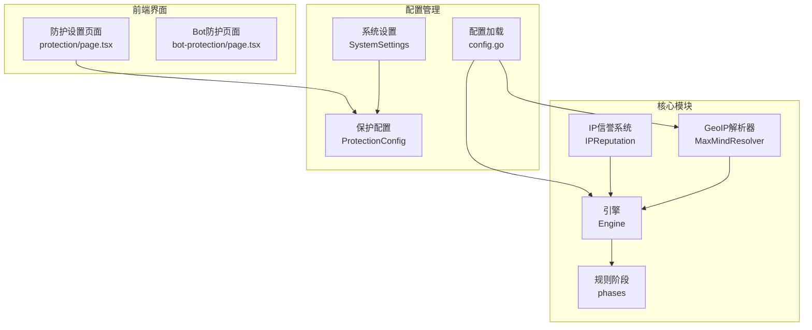
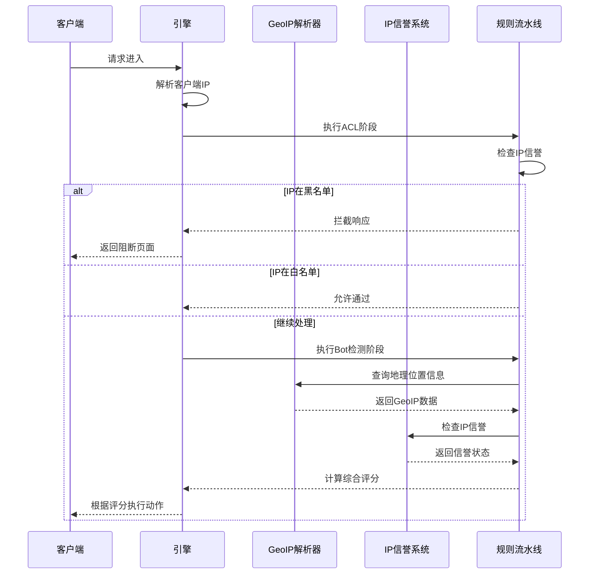
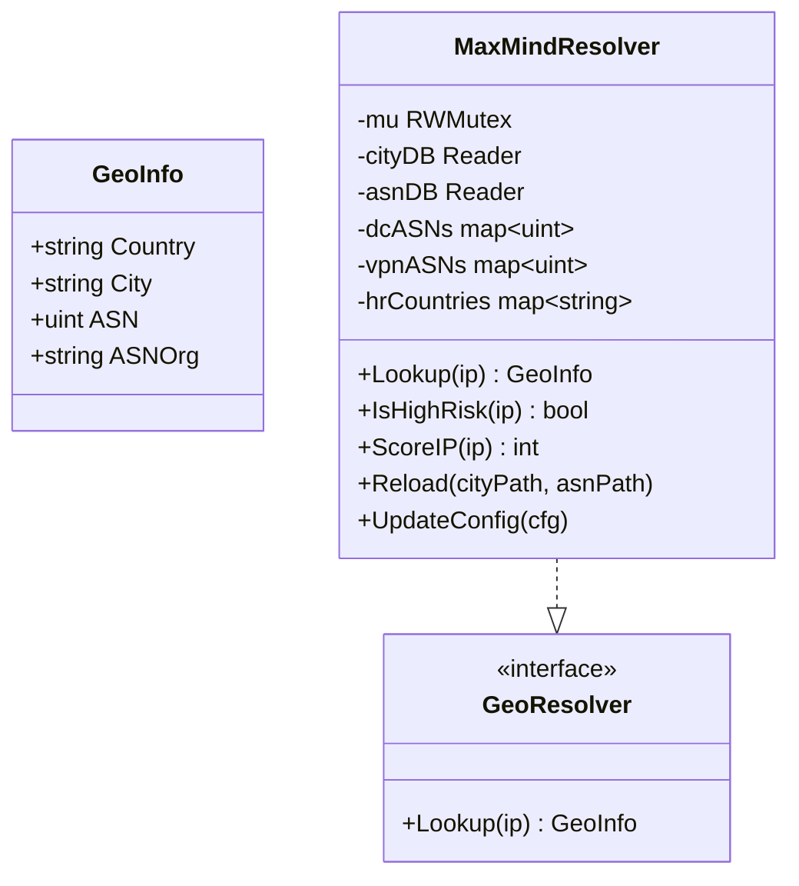
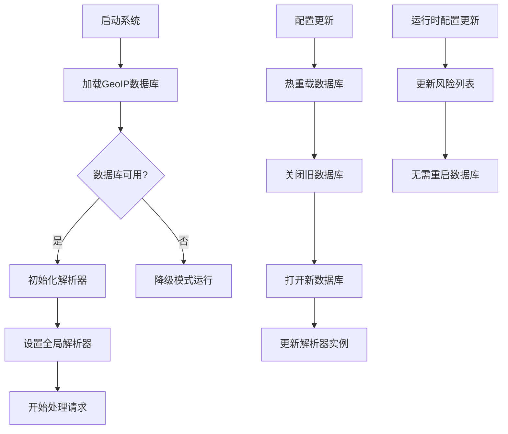
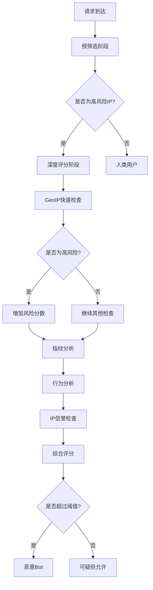
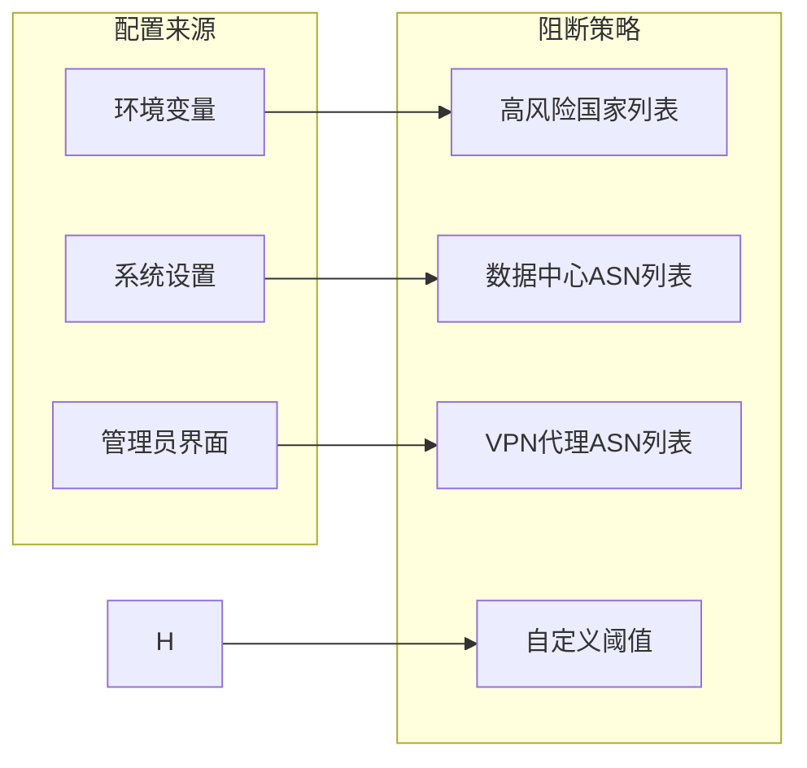
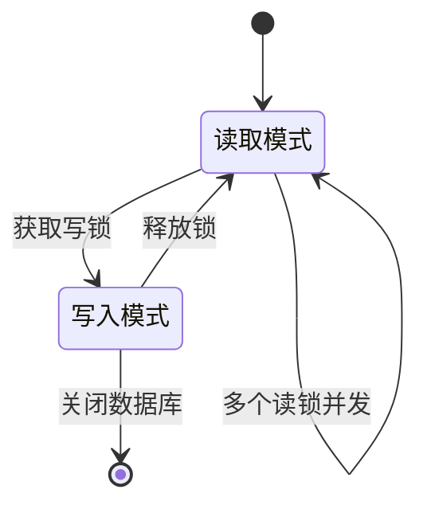
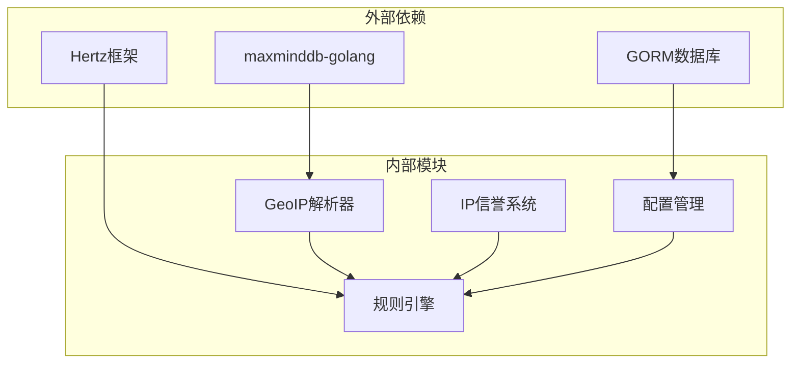
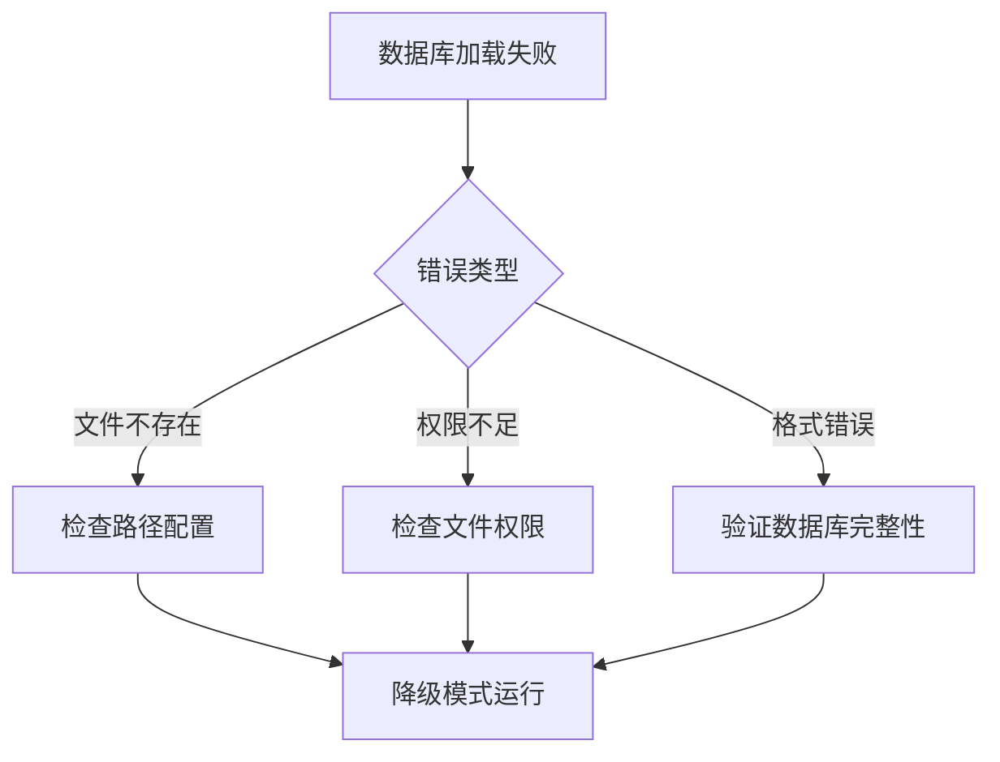

> [返回 安全防护功能](安全防护功能.md)

# 地理位置阻断

<cite>
**本文引用的文件**
- [geoip.go](file://internal/waf/bot/geoip.go)
- [bot.go](file://internal/waf/bot/bot.go)
- [config.go](file://internal/core/config.go)
- [engine.go](file://internal/core/engine/engine.go)
- [phases.go](file://internal/core/rules/phases.go)
- [page.tsx](file://frontend/app/(dashboard)/protection/page.tsx)
- [clientip.go](file://internal/security/clientip.go)
- [server.go](file://internal/app/server.go)
- [iprep.go](file://internal/waf/iprep/iprep.go)
- [block.go](file://internal/waf/pages/block.go)
</cite>

## 目录
1. [简介](#简介)
2. [项目结构](#项目结构)
3. [核心组件](#核心组件)
4. [架构概览](#架构概览)
5. [详细组件分析](#详细组件分析)
6. [依赖关系分析](#依赖关系分析)
7. [性能考虑](#性能考虑)
8. [故障排除指南](#故障排除指南)
9. [结论](#结论)
10. [附录](#附录)

## 简介
本文档详细介绍 My-OpenWaf 中的地理位置阻断系统，涵盖基于 MaxMind 数据库的 GeoIP 解析器、可插拔的 GeoResolver 接口设计、两阶段 Bot 检测流程、实时数据库热重载与配置更新机制，以及与 IP 信誉系统的协同工作。系统通过 ACL 阶段的 IP 黑/白名单检查与 Bot 检测阶段的地理位置加权评分，实现智能的地理位置阻断策略。

## 项目结构
地理位置阻断系统主要分布在以下模块中：



**图表来源**
- [geoip.go:26-36](file://internal/waf/bot/geoip.go#L26-L36)
- [engine.go:16-25](file://internal/core/engine/engine.go#L16-L25)
- [phases.go:172-193](file://internal/core/rules/phases.go#L172-L193)

**章节来源**
- [geoip.go:1-274](file://internal/waf/bot/geoip.go#L1-L274)
- [engine.go:1-176](file://internal/core/engine/engine.go#L1-L176)
- [config.go:10-183](file://internal/core/config.go#L10-L183)

## 核心组件
地理位置阻断系统由以下核心组件构成：

### GeoIP 解析器
MaxMindResolver 提供高性能的地理位置查询能力，支持实时热重载和运行时配置更新。

### IP 信誉系统
IPReputation 管理黑名单/白名单和自动封禁功能，支持过期条目管理和清理机制。

### 引擎集成
Engine 将地理位置阻断集成到完整的 WAF 处理流水线中，支持多阶段防护策略。

**章节来源**
- [geoip.go:26-125](file://internal/waf/bot/geoip.go#L26-L125)
- [iprep.go:18-54](file://internal/waf/iprep/iprep.go#L18-L54)
- [engine.go:16-45](file://internal/core/engine/engine.go#L16-L45)

## 架构概览



**图表来源**
- [engine.go:57-129](file://internal/core/engine/engine.go#L57-L129)
- [phases.go:197-244](file://internal/core/rules/phases.go#L197-L244)
- [geoip.go:127-151](file://internal/waf/bot/geoip.go#L127-L151)

## 详细组件分析

### GeoIP 数据库集成

#### 数据结构设计
系统采用简洁高效的数据结构来存储地理位置信息：



**图表来源**
- [geoip.go:16-36](file://internal/waf/bot/geoip.go#L16-L36)
- [geoip.go:26-36](file://internal/waf/bot/geoip.go#L26-L36)

#### 数据库更新机制
系统支持热重载和运行时配置更新：



**图表来源**
- [geoip.go:54-111](file://internal/waf/bot/geoip.go#L54-L111)
- [server.go:117-125](file://internal/app/server.go#L117-L125)

**章节来源**
- [geoip.go:54-125](file://internal/waf/bot/geoip.go#L54-L125)
- [server.go:117-125](file://internal/app/server.go#L117-L125)

### 地理位置检测实现原理

#### IP 地址到地理位置映射算法
系统采用两阶段检测流程：



**图表来源**
- [geoip.go:153-223](file://internal/waf/bot/geoip.go#L153-L223)
- [phases.go:396-454](file://internal/waf/bot/bot.go#L396-L454)

#### 风险评分算法
系统为不同风险因素分配权重：

| 风险类型 | 分数权重 | 说明 |
|---------|---------|------|
| 数据中心ASN | +25 | 云服务提供商IP通常风险较高 |
| VPN代理ASN | +15 | 匿名代理IP风险较高 |
| 高风险国家 | +20 | 基于ISO 3166-1 alpha-2代码识别 |
| 指纹分析 | +0-25 | 基于浏览器指纹和行为特征 |
| 行为分析 | +0-25 | 基于请求模式和访问行为 |
| IP信誉 | +0-20 | 基于历史信誉记录 |

**章节来源**
- [geoip.go:191-223](file://internal/waf/bot/geoip.go#L191-L223)
- [bot.go:126-161](file://internal/waf/bot/bot.go#L126-L161)

### 阻断策略配置选项

#### 国家/地区级别的阻断设置
系统支持基于国家/地区的精确阻断配置：



**图表来源**
- [config.go:10-18](file://internal/core/config.go#L10-L18)
- [models.go:247-294](file://internal/store/models.go#L247-L294)

#### 精确到城市的阻断配置
虽然系统主要基于国家/地区进行阻断，但提供了城市级别的地理信息查询能力。

**章节来源**
- [geoip.go:38-46](file://internal/waf/bot/geoip.go#L38-L46)
- [config.go:10-18](file://internal/core/config.go#L10-L18)

### 实时地理信息更新和缓存策略

#### 缓存机制设计
系统采用读写锁确保并发安全：



**图表来源**
- [geoip.go:28-36](file://internal/waf/bot/geoip.go#L28-L36)

#### 数据库热重载流程
系统支持无缝的数据库热重载：

**章节来源**
- [geoip.go:66-102](file://internal/waf/bot/geoip.go#L66-L102)
- [server.go:220-242](file://internal/app/server.go#L220-L242)

### 配置示例和最佳实践

#### 环境变量配置
```bash
# GeoIP数据库路径
MY_OPENWAF_GEOIP_DB=/etc/my-openwaf/GeoLite2-City.mmdb

# Bot检测阈值
MY_OPENWAF_BOT_THRESHOLD=80

# Drop策略配置
MY_OPENWAF_DROP_ENABLED=true
MY_OPENWAF_DROP_BOT_THRESHOLD=80
```

#### 前端配置界面
管理员可以通过 Web 界面配置阻断策略：

**章节来源**
- [page.tsx:51-75](file://frontend/app/(dashboard)/protection/page.tsx#L51-L75)
- [config.go:138-182](file://internal/core/config.go#L138-L182)

## 依赖关系分析



**图表来源**
- [geoip.go:11](file://internal/waf/bot/geoip.go#L11)
- [engine.go:12](file://internal/core/engine/engine.go#L12)

**章节来源**
- [geoip.go:3-12](file://internal/waf/bot/geoip.go#L3-L12)
- [engine.go:3-13](file://internal/core/engine/engine.go#L3-L13)

## 性能考虑

### 查询性能优化
1. **哈希表查找**: 使用 O(1) 时间复杂度的哈希表进行风险列表匹配
2. **读写分离**: 读操作无锁，写操作独占，最大化并发性能
3. **数据库连接池**: 合理配置数据库连接数
4. **内存缓存**: 风险列表缓存在内存中避免重复查询

### 内存管理
- 使用原子指针管理全局解析器实例
- 及时释放不再使用的数据库连接
- 定期清理过期的IP信誉记录

## 故障排除指南

### 常见问题诊断

#### GeoIP数据库加载失败


**图表来源**
- [geoip.go:67-96](file://internal/waf/bot/geoip.go#L67-L96)

#### IP信誉系统异常
- 检查数据库连接状态
- 验证IP列表格式正确性
- 确认自动封禁配置合理

**章节来源**
- [geoip.go:67-96](file://internal/waf/bot/geoip.go#L67-L96)
- [iprep.go:44-54](file://internal/waf/iprep/iprep.go#L44-L54)

## 结论
My-OpenWaf 的地理位置阻断系统通过高效的 GeoIP 数据库集成、智能的风险评分算法和灵活的配置管理，为用户提供了一套完整的地理位置防护解决方案。系统的设计充分考虑了性能、可扩展性和易用性，在保证防护效果的同时最小化对系统性能的影响。

## 附录

### 配置参数参考

#### Bot 配置参数
- `enabled`: 是否启用Bot检测
- `geoip_db_path`: GeoIP数据库文件路径
- `high_risk_countries`: 高风险国家列表
- `datacenter_asns`: 数据中心ASN列表
- `vpn_proxy_asns`: VPN代理ASN列表
- `score_threshold`: 阻断阈值

#### 保护配置参数
- `bot_detection_enabled`: 是否启用Bot检测
- `auto_ban_enabled`: 是否启用自动封禁
- `auto_ban_threshold`: 自动封禁阈值
- `auto_ban_window`: 封禁时间窗口
- `auto_ban_duration`: 封禁持续时间

**章节来源**
- [config.go:10-183](file://internal/core/config.go#L10-L183)
- [models.go:247-318](file://internal/store/models.go#L247-L318)
