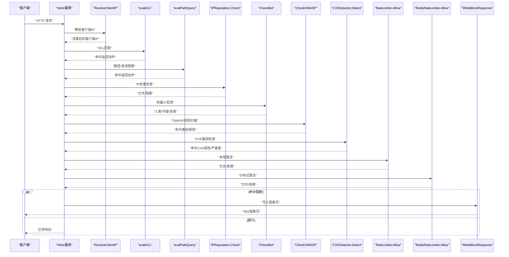
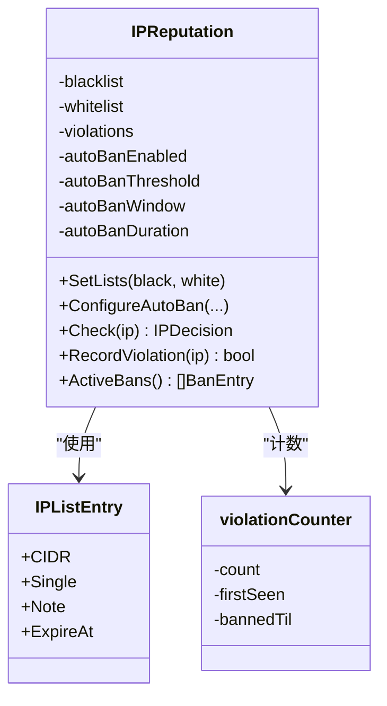
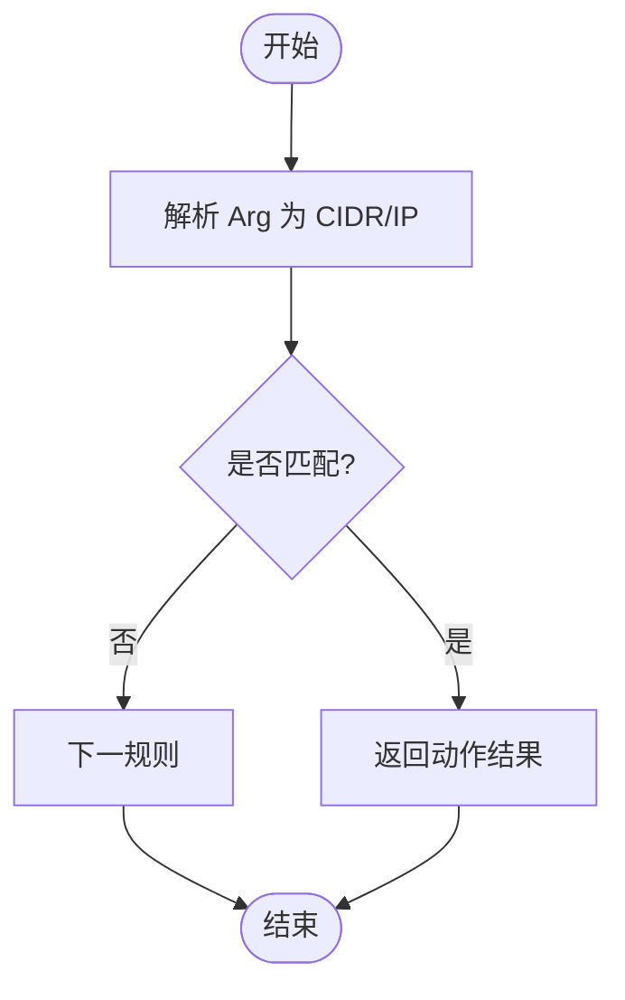
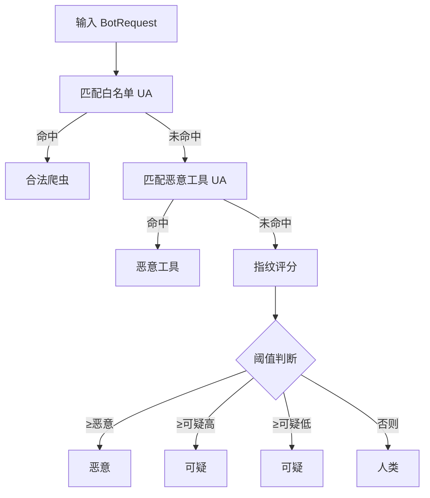
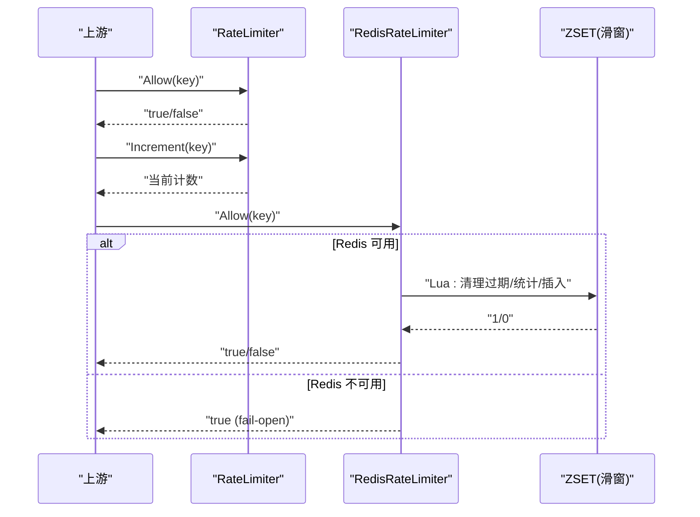
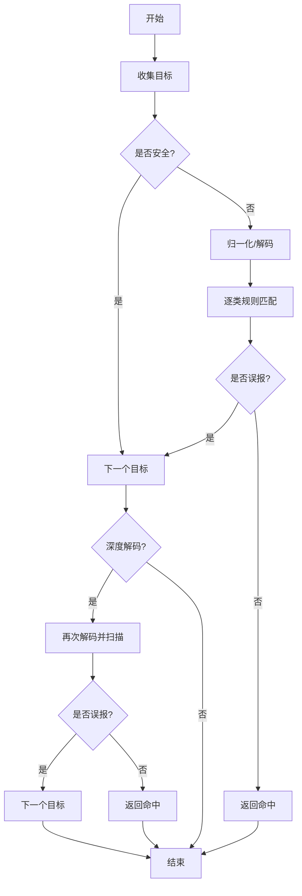
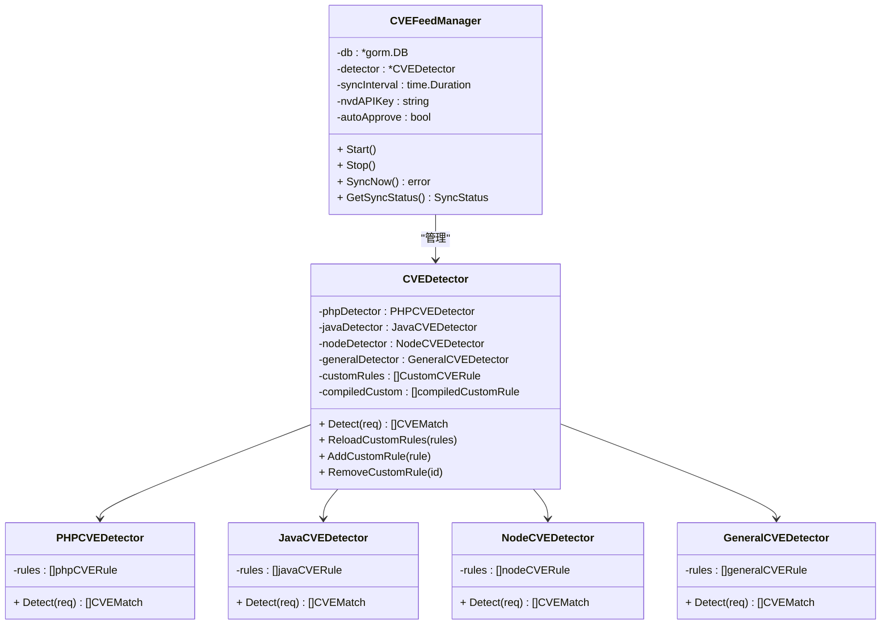
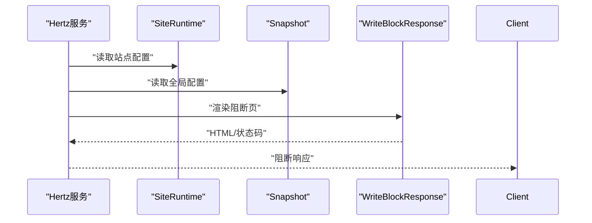
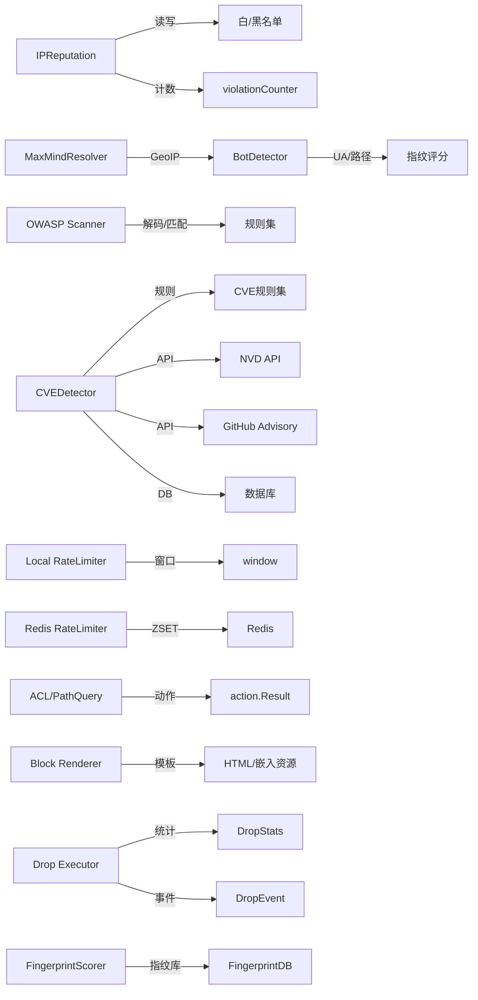

# 安全防护功能

<cite>
**本文引用的文件**
- [cmd/main.go](file://cmd/main.go)
- [internal/waf/iprep/iprep.go](file://internal/waf/iprep/iprep.go)
- [internal/waf/bot/bot.go](file://internal/waf/bot/bot.go)
- [internal/waf/ratelimit/ratelimit.go](file://internal/waf/ratelimit/ratelimit.go)
- [internal/waf/owasp/owasp.go](file://internal/waf/owasp/owasp.go)
- [internal/waf/pages/block.go](file://internal/waf/pages/block.go)
- [internal/security/clientip.go](file://internal/security/clientip.go)
- [internal/core/config.go](file://internal/core/config.go)
- [internal/waf/bot/geoip.go](file://internal/waf/bot/geoip.go)
- [internal/waf/bot/tls_fingerprint.go](file://internal/waf/bot/tls_fingerprint.go)
- [internal/waf/bot/fingerprint_db.go](file://internal/waf/bot/fingerprint_db.go)
- [internal/waf/ratelimit/redis.go](file://internal/waf/ratelimit/redis.go)
- [internal/waf/drop/drop.go](file://internal/waf/drop/drop.go)
- [internal/admin/protect/drop.go](file://internal/admin/protect/drop.go)
- [internal/store/repository/drop_event.go](file://internal/store/repository/drop_event.go)
- [frontend/app/(dashboard)/drop-policy/page.tsx](<file://frontend/app/(dashboard)/drop-policy/page.tsx>)
- [frontend/app/(dashboard)/protection/page.tsx](<file://frontend/app/(dashboard)/protection/page.tsx>)
- [frontend/app/(dashboard)/fingerprints/page.tsx](<file://frontend/app/(dashboard)/fingerprints/page.tsx>)
- [frontend/lib/api.ts](file://frontend/lib/api.ts)
- [internal/store/repository/bot_score.go](file://internal/store/repository/bot_score.go)
- [internal/waf/cve/detector.go](file://internal/waf/cve/detector.go)
- [internal/waf/cve/feed.go](file://internal/waf/cve/feed.go)
- [internal/waf/cve/php.go](file://internal/waf/cve/php.go)
- [internal/waf/cve/java.go](file://internal/waf/cve/java.go)
- [internal/waf/cve/node.go](file://internal/waf/cve/node.go)
- [internal/waf/cve/general.go](file://internal/waf/cve/general.go)
- [internal/admin/detect/cve.go](file://internal/admin/detect/cve.go)
- [internal/store/repository/cve_rule.go](file://internal/store/repository/cve_rule.go)
- [internal/store/cve.go](file://internal/store/cve.go)
- [frontend/app/(dashboard)/rules/cve/page.tsx](<file://frontend/app/(dashboard)/rules/cve/page.tsx>)
</cite>

## 目录
1. [简介](#简介)
2. [项目结构](#项目结构)
3. [核心组件](#核心组件)
4. [架构总览](#架构总览)
5. [详细组件分析](#详细组件分析)
6. [依赖分析](#依赖分析)
7. [性能考虑](#性能考虑)
8. [故障排查指南](#故障排查指南)
9. [结论](#结论)
10. [附录](#附录)

## 简介
本文件系统性梳理 My-OpenWaf 的安全防护能力，覆盖以下方面：
- IP 信誉系统：黑名单/白名单、自动封禁、过期清理与实时更新机制
- ACL 规则引擎：规则语法、匹配逻辑与执行优先级
- 机器人检测：指纹特征、恶意工具识别、阈值分级与误判抑制
- 速率限制：固定窗口与滑动窗口（Redis）实现、存储策略与突发处理
- OWASP 检测规则集：规则分类、检测精度与误报控制
- CVE 漏洞检测系统：多语言漏洞检测、自动规则同步、自定义规则管理
- 阻断机制：响应页面渲染、模板变量注入与调试信息输出

## 项目结构
后端采用分层设计，安全相关逻辑集中在 internal/waf 与 internal/security 下，前端位于 frontend。核心入口在 cmd/main.go，通过内部模块加载配置与运行时状态。

```mermaid
graph TB
subgraph "入口与配置"
M["cmd/main.go"]
CFG["internal/core/config.go"]
END
subgraph "安全核心"
IPREP["internal/waf/iprep/iprep.go"]
BOT["internal/waf/bot/bot.go"]
RL["internal/waf/ratelimit/ratelimit.go"]
RLR["internal/waf/ratelimit/redis.go"]
OWASP["internal/waf/owasp/owasp.go"]
BLOCK["internal/waf/pages/block.go"]
GEO["internal/waf/bot/geoip.go"]
FP["internal/waf/bot/tls_fingerprint.go"]
FPDB["internal/waf/bot/fingerprint_db.go"]
CVE["internal/waf/cve/detector.go"]
CVEFEED["internal/waf/cve/feed.go"]
DROP["internal/waf/drop/drop.go"]
END
subgraph "请求解析"
CLIIP["internal/security/clientip.go"]
END
M --> CFG
M --> IPREP
M --> BOT
M --> RL
M --> RLR
M --> OWASP
M --> BLOCK
M --> GEO
M --> FP
M --> FPDB
M --> CVE
M --> CVEFEED
M --> DROP
CLIIP --> IPREP
CLIIP --> BOT
CLIIP --> RL
CLIIP --> RLR
CLIIP --> OWASP
CLIIP --> BLOCK
```

**图表来源**
- [cmd/main.go](file://cmd/main.go)
- [internal/core/config.go](file://internal/core/config.go)
- [internal/waf/iprep/iprep.go](file://internal/waf/iprep/iprep.go)
- [internal/waf/bot/bot.go](file://internal/waf/bot/bot.go)
- [internal/waf/ratelimit/ratelimit.go](file://internal/waf/ratelimit/ratelimit.go)
- [internal/waf/ratelimit/redis.go](file://internal/waf/ratelimit/redis.go)
- [internal/waf/owasp/owasp.go](file://internal/waf/owasp/owasp.go)
- [internal/waf/pages/block.go](file://internal/waf/pages/block.go)
- [internal/waf/bot/geoip.go](file://internal/waf/bot/geoip.go)
- [internal/waf/bot/tls_fingerprint.go](file://internal/waf/bot/tls_fingerprint.go)
- [internal/waf/bot/fingerprint_db.go](file://internal/waf/bot/fingerprint_db.go)
- [internal/waf/cve/detector.go](file://internal/waf/cve/detector.go)
- [internal/waf/cve/feed.go](file://internal/waf/cve/feed.go)
- [internal/waf/drop/drop.go](file://internal/waf/drop/drop.go)
- [internal/security/clientip.go](file://internal/security/clientip.go)

**章节来源**
- [cmd/main.go](file://cmd/main.go)
- [internal/core/config.go](file://internal/core/config.go)

## 核心组件
- IP 信誉管理器：支持白/黑名单、自动封禁、过期清理与动态配置
- 机器人检测器：基于 UA 与路径特征的多维评分与阈值分级
- 速率限制器：本地固定窗口与 Redis 滑动窗口两种实现
- OWASP 规则集：内置多类攻击检测与深度解码扫描
- CVE 漏洞检测器：多语言漏洞检测、自动规则同步、自定义规则管理
- ACL 规则引擎：基于 CIDR/IP 的访问控制与路径/查询阻断
- 阻断响应：可配置模板与嵌入式页面，输出调试信息
- 客户端 IP 解析：X-Forwarded-For 处理与可信源校验
- 地理位置解析：可插拔 GeoResolver 接口
- TLS 指纹识别：JA3/JA4 指纹检测与浏览器环境一致性检查
- 零响应阻断：直接关闭 TCP 连接，不发送 HTTP 响应

**章节来源**
- [internal/waf/iprep/iprep.go](file://internal/waf/iprep/iprep.go)
- [internal/waf/bot/bot.go](file://internal/waf/bot/bot.go)
- [internal/waf/ratelimit/ratelimit.go](file://internal/waf/ratelimit/ratelimit.go)
- [internal/waf/ratelimit/redis.go](file://internal/waf/ratelimit/redis.go)
- [internal/waf/owasp/owasp.go](file://internal/waf/owasp/owasp.go)
- [internal/waf/pages/block.go](file://internal/waf/pages/block.go)
- [internal/security/clientip.go](file://internal/security/clientip.go)
- [internal/waf/bot/geoip.go](file://internal/waf/bot/geoip.go)
- [internal/waf/bot/tls_fingerprint.go](file://internal/waf/bot/tls_fingerprint.go)
- [internal/waf/bot/fingerprint_db.go](file://internal/waf/bot/fingerprint_db.go)
- [internal/waf/cve/detector.go](file://internal/waf/cve/detector.go)
- [internal/waf/cve/feed.go](file://internal/waf/cve/feed.go)
- [internal/waf/drop/drop.go](file://internal/waf/drop/drop.go)

## 架构总览
WAF 在请求进入后，先解析客户端 IP，再依次评估 IP 信誉、反重放、ACL、OWASP、CVE、机器人检测、速率限制、签名规则与自定义规则，最后根据动作类型进行放行或阻断，并输出相应响应页与调试头。



**图表来源**
- [internal/security/clientip.go](file://internal/security/clientip.go)
- [internal/waf/bot/bot.go](file://internal/waf/bot/bot.go)
- [internal/waf/owasp/owasp.go](file://internal/waf/owasp/owasp.go)
- [internal/waf/cve/detector.go](file://internal/waf/cve/detector.go)
- [internal/waf/ratelimit/ratelimit.go](file://internal/waf/ratelimit/ratelimit.go)
- [internal/waf/ratelimit/redis.go](file://internal/waf/ratelimit/redis.go)
- [internal/waf/pages/block.go](file://internal/waf/pages/block.go)

## 详细组件分析

### IP 信誉系统
- 数据结构
  - IPListEntry：支持单 IP 与 CIDR，带备注与过期时间
  - IPReputation：维护白/黑名单、违规计数器、自动封禁参数与清理协程
  - IPDecision：返回允许/阻断、命中情况、原因与分类
- 工作流程
  - 顺序检查：白名单 → 黑名单 → 自动封禁 → 允许
  - 自动封禁：按时间窗口统计违规次数，超过阈值在持续时间内封禁
  - 过期清理：定期删除已过期封禁记录
- 实时更新
  - 通过 SetLists 动态替换白/黑名单
  - ConfigureAutoBan 动态调整阈值、窗口与封禁时长
- 并发与原子
  - 使用读写锁保护列表；违规计数器使用互斥锁；封禁到期时间用原子操作



**图表来源**
- [internal/waf/iprep/iprep.go](file://internal/waf/iprep/iprep.go)

**章节来源**
- [internal/waf/iprep/iprep.go](file://internal/waf/iprep/iprep.go)

### ACL 规则引擎
- 规则语法
  - Phase：仅支持 ACL（基于 IP/CIDR）
  - Kind：支持 block_path、block_query_contains 等
  - Arg：CIDR 或前缀字符串
- 匹配逻辑
  - evalACL：解析 Arg 为 CIDR，匹配客户端 IP 所属网段
  - evalPathQuery：对路径前缀与查询包含进行匹配
- 执行优先级
  - ACL 优先于路径/查询阻断
  - 命中即返回对应动作，否则放行



**图表来源**
- [internal/waf/bot/bot.go](file://internal/waf/bot/bot.go)

**章节来源**
- [internal/waf/bot/bot.go](file://internal/waf/bot/bot.go)

### 机器人检测系统
- 输入结构：BotRequest（UA、方法、路径、头部、语言、编码、Referer、连接、Cookie）
- 检测步骤
  - 白名单 UA：直接判定为合法爬虫
  - 恶意工具 UA：直接判定为恶意
  - 指纹评分：基于 UA 长度、Accept/语言/编码、路径特征、连接方式等加权
  - 阈值分级：低/中/高三个级别，分别设定恶意与可疑阈值
- 误报控制
  - 对特定 CDN 回调函数名、常见自然语言模式进行抑制
- 输出：BotVerdict（是否机器人、分数、类别、原因、规则ID）



**图表来源**
- [internal/waf/bot/bot.go](file://internal/waf/bot/bot.go)

**章节来源**
- [internal/waf/bot/bot.go](file://internal/waf/bot/bot.go)

### TLS 指纹识别系统
- 指纹提取与评分
  - JA3/JA4 指纹哈希、TLS 版本、HTTP/2 设置与窗口大小、声明浏览器、Accept 语言/编码、头部顺序哈希
  - 通过请求头传递的TLS信息：X-JA3-Hash、X-JA4-Hash、X-TLS-Version、X-H2-Settings、X-H2-Window-Size
  - 已知恶意 JA3/JA4 直接加权并记录原因
  - 浏览器一致性检查（如声明浏览器与 Accept 编码/语言格式不一致）
  - HTTP/2 设置与窗口大小异常检测
  - 头部顺序与浏览器已知模式不匹配
- 指纹数据库管理
  - 浏览器JA3指纹：Chrome 120-130系列变体、Firefox 120-130系列变体、Safari 17-18系列变体、Edge（基于Chrome）指纹
  - 恶意工具JA3指纹：curl、python-requests、Go http client、Java HttpClient等指纹
  - HTTP/2设置配置：Chrome、Firefox、Safari、Edge的HTTP/2设置配置文件
  - 头部顺序模式：各浏览器典型头部顺序的MD5哈希模式

**章节来源**
- [internal/waf/bot/tls_fingerprint.go](file://internal/waf/bot/tls_fingerprint.go)
- [internal/waf/bot/fingerprint_db.go](file://internal/waf/bot/fingerprint_db.go)

### 速率限制机制
- 本地固定窗口
  - RateLimiter：以 (clientIP + host) 组合为键，固定窗口内计数
  - 超限返回 false，支持增量计数用于错误率统计
  - 清理器定时回收过期窗口
- 分布式滑动窗口（Redis）
  - RedisRateLimiter：使用 ZSET 记录时间戳，Lua 脚本原子判断与插入
  - 滑动窗口：移除窗口外元素后统计数量，不超过上限则插入新条目
  - Redis 错误时"放行"（fail-open），保证可用性
- 突发处理
  - 固定窗口：窗口边界瞬时可能超限，适合稳定 QPS
  - 滑动窗口：更平滑，适合突发流量场景



**图表来源**
- [internal/waf/ratelimit/ratelimit.go](file://internal/waf/ratelimit/ratelimit.go)
- [internal/waf/ratelimit/redis.go](file://internal/waf/ratelimit/redis.go)

**章节来源**
- [internal/waf/ratelimit/ratelimit.go](file://internal/waf/ratelimit/ratelimit.go)
- [internal/waf/ratelimit/redis.go](file://internal/waf/ratelimit/redis.go)

### OWASP 检测规则集
- 规则分类：SQL 注入、XSS、命令注入、路径穿越、SSRF、XXE、LDAP 注入、NoSQL 注入、模板注入、JNDI 注入、CRLF 注入、表达式语言、反序列化、WebShell、RevShell、协议违规等
- 扫描流程
  - 收集目标：路径、查询、头部（过滤标准字段）、Cookie 值、Referer 查询/片段
  - 快速路径：跳过明显安全的目标
  - 归一化：多轮 URL/HTML/JS/UTF-7 解码、大小写折叠、空白压缩、注释剥离
  - 规则匹配：逐类检测，必要时抑制误报（如 CDN 回调、自然语言）
  - 深度解码：对大量 JS 转义与 Base64 token 再次解码并扫描
  - 协议级检查：直接检查头部与路径中的危险模式
- 敏感度阈值：低/中/高三档，影响误报抑制强度
- 文件上传检测：双扩展名、空字节、危险扩展名等



**图表来源**
- [internal/waf/owasp/owasp.go](file://internal/waf/owasp/owasp.go)

**章节来源**
- [internal/waf/owasp/owasp.go](file://internal/waf/owasp/owasp.go)

### CVE 漏洞检测系统
CVE 漏洞检测系统是 My-OpenWaf 的重要安全增强功能，提供针对特定漏洞的精确检测能力。

- 检测架构
  - CVEDetector：协调器，管理多个技术专用检测器和自定义规则
  - 多语言检测器：PHP、Java、Node.js、通用漏洞检测器
  - 自动规则同步：从 NVD 和 GitHub Advisory API 获取最新漏洞信息
  - 实时规则管理：支持热重载和动态启停

- 检测能力
  - PHP 漏洞检测：反序列化、文件包含、Webshell 上传、ThinkPHP RCE、Laravel Ignition
  - Java 漏洞检测：Log4Shell、Spring4Shell、Fastjson、Struts2、Shiro、Jackson
  - Node.js 漏洞检测：原型污染、React SSR 注入、命令注入、EJS 模板注入、vm2 沙箱逃逸
  - 通用漏洞检测：SSRF、XXE、路径穿越、CRLF 注入、HTTP 请求走私、ShellShock

- 规则管理
  - 自动规则生成：基于 CWE 类型映射到检测模式
  - 手动规则创建：支持正则表达式模式、目标范围、严重度分级
  - 规则生命周期：启用/禁用、审核状态、版本管理
  - 热重载机制：运行时动态更新规则集

- 同步机制
  - NVD API 集成：获取最新的 CVE 信息和 CVSS 评分
  - GitHub Advisory 集成：获取开源生态漏洞信息
  - 定时同步：可配置同步间隔，支持手动触发
  - 审核流程：自动规则可配置自动批准或人工审核



**图表来源**
- [internal/waf/cve/detector.go](file://internal/waf/cve/detector.go)
- [internal/waf/cve/feed.go](file://internal/waf/cve/feed.go)
- [internal/waf/cve/php.go](file://internal/waf/cve/php.go)
- [internal/waf/cve/java.go](file://internal/waf/cve/java.go)
- [internal/waf/cve/node.go](file://internal/waf/cve/node.go)
- [internal/waf/cve/general.go](file://internal/waf/cve/general.go)

**章节来源**
- [internal/waf/cve/detector.go](file://internal/waf/cve/detector.go)
- [internal/waf/cve/feed.go](file://internal/waf/cve/feed.go)
- [internal/waf/cve/php.go](file://internal/waf/cve/php.go)
- [internal/waf/cve/java.go](file://internal/waf/cve/java.go)
- [internal/waf/cve/node.go](file://internal/waf/cve/node.go)
- [internal/waf/cve/general.go](file://internal/waf/cve/general.go)

### 阻断机制
- 行为：当任一阶段命中阻断动作时，不再继续后续处理
- 响应：优先使用站点运行时自定义 HTML，其次使用全局模板，最后回退到嵌入式页面
- 调试：设置 X-Request-ID 与 X-WAF-Action 响应头，便于溯源
- 维护模式：独立维护页，支持站点与全局配置



**图表来源**
- [internal/waf/pages/block.go](file://internal/waf/pages/block.go)

**章节来源**
- [internal/waf/pages/block.go](file://internal/waf/pages/block.go)

### 零响应阻断机制
- 执行器设计
  - 直接关闭TCP连接，不发送任何HTTP响应，避免客户端等待超时
  - 支持启用/禁用状态切换，便于动态调整阻断策略
  - 原子计数器确保并发环境下的统计数据准确性
- 阻断原因追踪
  - 记录来源类型（bot、cve、rule、ip_reputation）
  - 包含规则ID、客户端IP、主机、路径、详细描述等上下文信息
  - 时间戳记录阻断发生时间
- 统计与监控
  - 总阻断数统计
  - 按来源分类的阻断统计（Bot、CVE、规则、IP信誉）
  - 最近阻断时间记录
  - 支持统计重置功能

**章节来源**
- [internal/waf/drop/drop.go](file://internal/waf/drop/drop.go)

### 客户端 IP 解析与地理位置
- 客户端 IP 解析：支持 Strip 与 Trust-Outer 两种模式，结合可信源判断
- 地理位置解析：可插拔接口，全局指针持有解析器实例，便于热切换

**章节来源**
- [internal/security/clientip.go](file://internal/security/clientip.go)
- [internal/waf/bot/geoip.go](file://internal/waf/bot/geoip.go)

## 依赖分析
- 组件耦合
  - IP 信誉与速率限制均依赖并发安全的数据结构与清理协程
  - ACL 引擎与路径/查询阻断共享统一的动作返回结构
  - OWASP 规则集依赖多轮解码与正则匹配，计算量较大但具备误报抑制
  - CVE 检测器依赖数据库存储和外部 API，支持热重载和并发检测
  - 机器人检测系统依赖 TLS 指纹识别与地理信息解析
  - 阻断机制依赖零响应执行器与事件追踪系统
- 外部依赖
  - Redis：用于分布式滑动窗口
  - Hertz：HTTP 请求上下文与响应写入
  - NVD API 和 GitHub API：用于 CVE 规则同步
  - 数据库：存储 CVE 规则和同步日志
  - MaxMind 数据库：用于 GeoIP 解析
- 循环依赖
  - 未发现循环导入；各模块职责清晰



**图表来源**
- [internal/waf/iprep/iprep.go](file://internal/waf/iprep/iprep.go)
- [internal/waf/bot/bot.go](file://internal/waf/bot/bot.go)
- [internal/waf/owasp/owasp.go](file://internal/waf/owasp/owasp.go)
- [internal/waf/cve/detector.go](file://internal/waf/cve/detector.go)
- [internal/waf/cve/feed.go](file://internal/waf/cve/feed.go)
- [internal/waf/ratelimit/ratelimit.go](file://internal/waf/ratelimit/ratelimit.go)
- [internal/waf/ratelimit/redis.go](file://internal/waf/ratelimit/redis.go)
- [internal/waf/pages/block.go](file://internal/waf/pages/block.go)
- [internal/waf/drop/drop.go](file://internal/waf/drop/drop.go)
- [internal/waf/bot/tls_fingerprint.go](file://internal/waf/bot/tls_fingerprint.go)
- [internal/waf/bot/fingerprint_db.go](file://internal/waf/bot/fingerprint_db.go)
- [internal/waf/bot/geoip.go](file://internal/waf/bot/geoip.go)

**章节来源**
- [internal/waf/iprep/iprep.go](file://internal/waf/iprep/iprep.go)
- [internal/waf/bot/bot.go](file://internal/waf/bot/bot.go)
- [internal/waf/owasp/owasp.go](file://internal/waf/owasp/owasp.go)
- [internal/waf/cve/detector.go](file://internal/waf/cve/detector.go)
- [internal/waf/cve/feed.go](file://internal/waf/cve/feed.go)
- [internal/waf/ratelimit/ratelimit.go](file://internal/waf/ratelimit/ratelimit.go)
- [internal/waf/ratelimit/redis.go](file://internal/waf/ratelimit/redis.go)
- [internal/waf/pages/block.go](file://internal/waf/pages/block.go)
- [internal/waf/drop/drop.go](file://internal/waf/drop/drop.go)
- [internal/waf/bot/tls_fingerprint.go](file://internal/waf/bot/tls_fingerprint.go)
- [internal/waf/bot/fingerprint_db.go](file://internal/waf/bot/fingerprint_db.go)
- [internal/waf/bot/geoip.go](file://internal/waf/bot/geoip.go)

## 性能考虑
- IP 信誉
  - 列表顺序检查，建议将常用命中项置于前部；定期清理过期封禁减少遍历成本
- 机器人检测
  - 指纹评分线性扫描，阈值分级可按业务调优；对常见自然语言与 CDN 回调抑制显著降低误报
  - TLS 指纹识别采用内存映射，查询效率高
- 速率限制
  - 本地固定窗口轻量，Redis 滑窗更平滑但引入网络开销；合理设置窗口与上限
- OWASP 规则集
  - 多轮解码与正则匹配成本较高，建议启用敏感度阈值与快速路径；对超长目标截断
- CVE 漏洞检测
  - 多检测器顺序执行，先跑通用、PHP、Java、Node，再执行自定义规则与注册表规则
  - 外部 API 调用需考虑网络延迟，建议配置合理的超时和重试机制
  - 自定义规则正则表达式需谨慎设计，避免复杂模式导致性能问题
- 阻断响应
  - 模板渲染失败回退至嵌入式页面，确保稳定性
  - 零响应阻断避免HTTP响应生成的额外开销
- TLS 指纹识别
  - 指纹数据库采用内存映射，查询效率高
  - 指纹统计分析支持数据库缓存，减少重复查询

## 故障排查指南
- 阻断页面不显示或显示默认页
  - 检查站点运行时与全局 HTML 配置是否正确
  - 查看响应头 X-WAF-Action 与 X-Request-ID 以定位规则与请求
- 误判与漏判
  - IP 信誉：确认白/黑名单与过期时间；检查自动封禁阈值与窗口
  - 机器人检测：调整敏感度等级；核对 UA 与路径特征
  - OWASP：提高敏感度阈值减少误报；检查是否被误报抑制逻辑拦截
  - CVE 漏洞检测：检查规则启用状态和严重度配置；验证正则表达式有效性
  - TLS 指纹识别：检查上游是否正确透传 JA3/JA4 与 TLS 信息；调整浏览器环境一致性检查的严格程度
- 速率限制异常
  - 本地限流：确认窗口与上限配置；检查清理器是否运行
  - Redis 限流：确认 Redis 连接与 Lua 脚本执行；关注 fail-open 行为
- 客户端 IP 错误
  - 校验 XFF 模式与可信源配置；确认代理链路是否正确传递 X-Forwarded-For
- 零响应阻断问题
  - 检查阻断执行器是否启用，确认TCP连接是否正确关闭
  - 验证阻断统计是否正常更新
  - 确认阻断事件是否正确持久化到数据库
- CVE 漏洞检测问题
  - 检查 CVE 规则同步状态和错误日志
  - 验证外部 API 密钥配置和网络连通性
  - 确认自定义规则的正则表达式语法正确性

**章节来源**
- [internal/waf/pages/block.go](file://internal/waf/pages/block.go)
- [internal/waf/iprep/iprep.go](file://internal/waf/iprep/iprep.go)
- [internal/waf/bot/bot.go](file://internal/waf/bot/bot.go)
- [internal/waf/owasp/owasp.go](file://internal/waf/owasp/owasp.go)
- [internal/waf/ratelimit/ratelimit.go](file://internal/waf/ratelimit/ratelimit.go)
- [internal/waf/ratelimit/redis.go](file://internal/waf/ratelimit/redis.go)
- [internal/security/clientip.go](file://internal/security/clientip.go)
- [internal/waf/cve/feed.go](file://internal/waf/cve/feed.go)
- [internal/waf/drop/drop.go](file://internal/waf/drop/drop.go)

## 结论
本项目在安全防护方面提供了从 IP 信誉、ACL 控制、机器人检测、OWASP 规则集到 CVE 漏洞检测与速率限制的完整闭环。新增的 CVE 漏洞检测系统通过多语言专用检测器、自动规则同步和灵活的规则管理，显著增强了对已知漏洞的针对性防护能力。通过可配置的阈值、误报抑制与分布式限流，既能满足高可用需求，又能有效抵御多种 Web 攻击。建议在生产环境中结合业务流量特征与合规要求，动态调整敏感度与阈值，并完善日志与监控以便持续优化。

## 附录
- 配置要点
  - 数据库与 Redis：通过环境变量配置数据源与缓存
  - 管理端绑定地址：可通过环境变量设置
  - CVE 规则同步：配置 NVD API 密钥和同步间隔
  - TLS 指纹识别：配置指纹数据库更新频率和指纹统计缓存
- 调试建议
  - 启用详细日志与事件归档
  - 使用 X-Request-ID 关联请求链路
  - 定期审查阻断事件与误报抑制效果
  - 监控 CVE 规则同步状态和检测命中率
  - 监控指纹统计分析，识别新的攻击模式和指纹变异

**章节来源**
- [internal/core/config.go](file://internal/core/config.go)
- [internal/waf/cve/feed.go](file://internal/waf/cve/feed.go)
- [internal/store/cve.go](file://internal/store/cve.go)
- [internal/waf/drop/drop.go](file://internal/waf/drop/drop.go)
- [internal/waf/bot/tls_fingerprint.go](file://internal/waf/bot/tls_fingerprint.go)
- [internal/waf/bot/fingerprint_db.go](file://internal/waf/bot/fingerprint_db.go)
