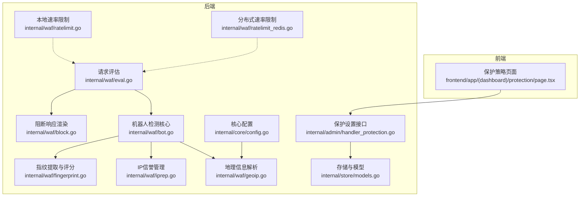
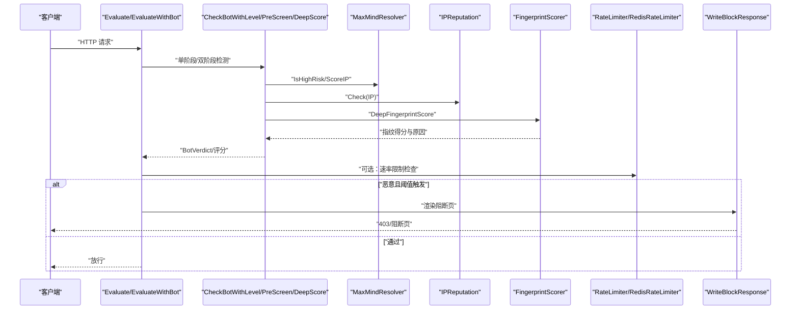
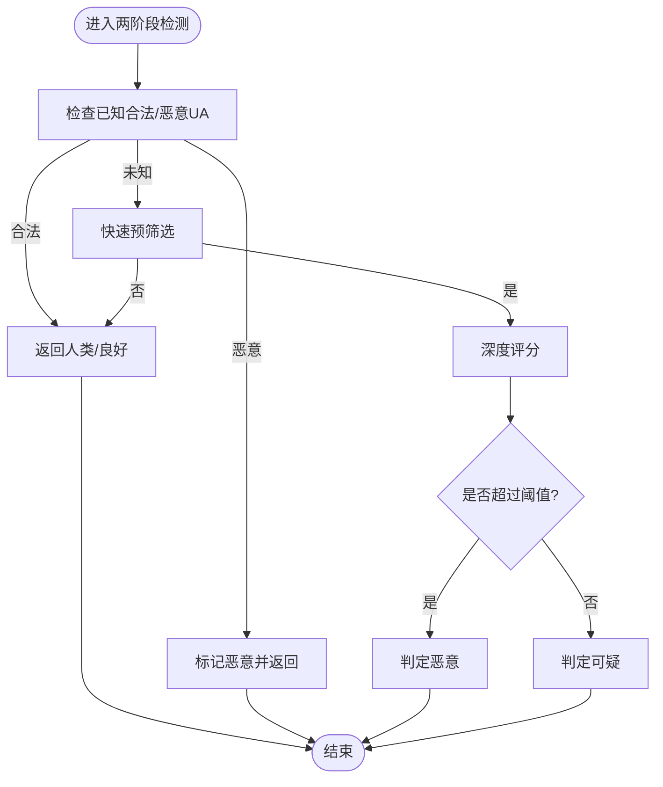
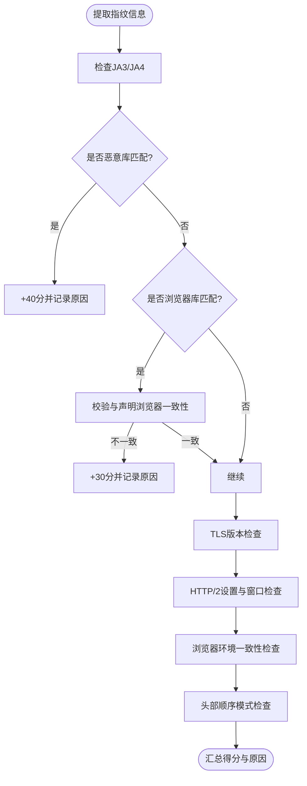
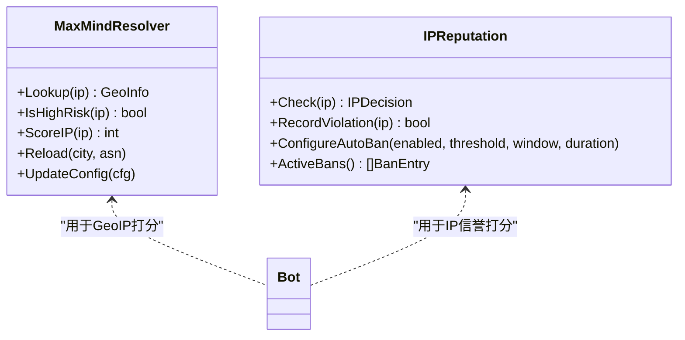
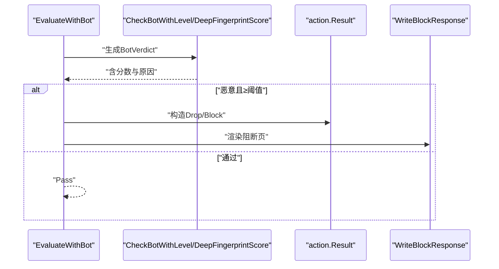
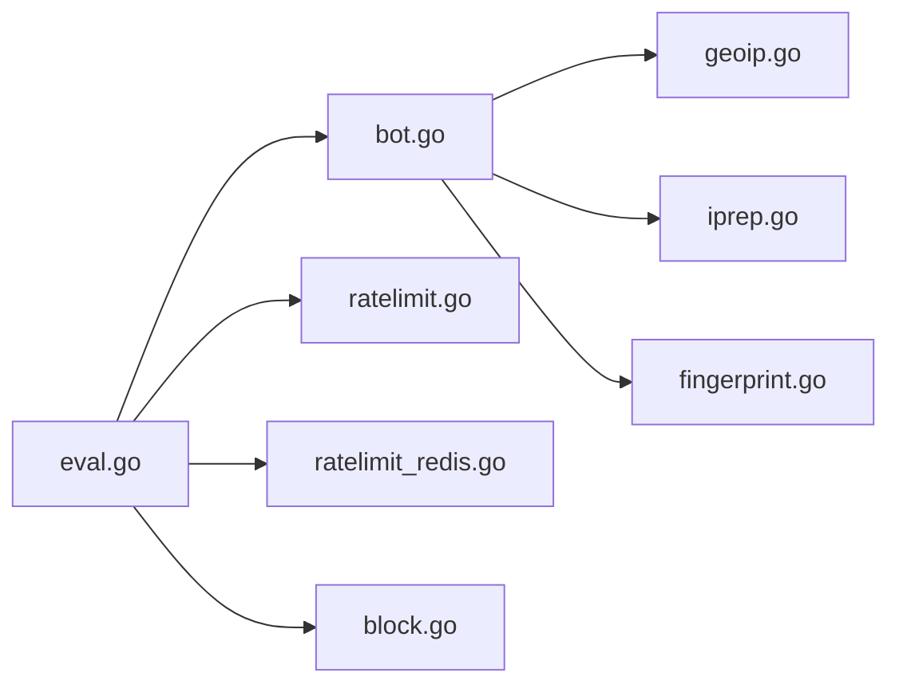

# 机器人检测

<cite>
**本文引用的文件**
- [bot.go](file://internal/waf/bot.go)
- [bot_test.go](file://internal/waf/bot_test.go)
- [fingerprint.go](file://internal/waf/fingerprint.go)
- [eval.go](file://internal/waf/eval.go)
- [iprep.go](file://internal/waf/iprep.go)
- [geoip.go](file://internal/waf/geoip.go)
- [ratelimit.go](file://internal/waf/ratelimit.go)
- [ratelimit_redis.go](file://internal/waf/ratelimit_redis.go)
- [models.go](file://internal/store/models.go)
- [config.go](file://internal/core/config.go)
- [block.go](file://internal/waf/block.go)
- [handler_protection.go](file://internal/admin/handler_protection.go)
- [page.tsx](file://frontend/app/(dashboard)/protection/page.tsx)
</cite>

## 目录
1. [简介](#简介)
2. [项目结构](#项目结构)
3. [核心组件](#核心组件)
4. [架构总览](#架构总览)
5. [详细组件分析](#详细组件分析)
6. [依赖分析](#依赖分析)
7. [性能考量](#性能考量)
8. [故障排查指南](#故障排查指南)
9. [结论](#结论)
10. [附录](#附录)

## 简介
本文件面向“机器人检测系统”的设计与实现，聚焦于以下目标：
- 解释机器人识别算法的实现原理：行为特征分析、请求模式识别与指纹数据库匹配。
- 说明检测阈值的设置与调整方法：误报率控制与漏报率优化。
- 阐述不同类型的机器人检测策略：爬虫检测、DDoS 攻击检测与自动化工具检测。
- 解释检测结果的评估机制与反馈循环。
- 提供配置示例与性能调优建议，并说明与其他安全机制的协同工作方式。

## 项目结构
机器人检测能力由后端 WAF 引擎与前端管理界面共同构成：
- 后端核心位于 internal/waf，包含两阶段检测（快速预筛选 + 深度评分）、指纹提取与评分、地理信息与信誉评估、速率限制等模块。
- 前端位于 frontend/app/(dashboard)，提供保护策略配置页面，支持全局与站点级策略的读取与保存。
- 存储与配置模型位于 internal/store 与 internal/core，用于持久化策略与运行时参数。

图表来源
- [eval.go:22-85](file://internal/waf/eval.go#L22-L85)
- [bot.go:126-454](file://internal/waf/bot.go#L126-L454)
- [fingerprint.go:42-163](file://internal/waf/fingerprint.go#L42-L163)
- [geoip.go:26-111](file://internal/waf/geoip.go#L26-L111)
- [iprep.go:18-124](file://internal/waf/iprep.go#L18-L124)
- [ratelimit.go:9-17](file://internal/waf/ratelimit.go#L9-L17)
- [ratelimit_redis.go:12-20](file://internal/waf/ratelimit_redis.go#L12-L20)
- [block.go:16-39](file://internal/waf/block.go#L16-L39)
- [models.go:245-294](file://internal/store/models.go#L245-L294)
- [config.go:10-18](file://internal/core/config.go#L10-L18)
- [handler_protection.go:21-106](file://internal/admin/handler_protection.go#L21-L106)

章节来源
- [eval.go:12-85](file://internal/waf/eval.go#L12-L85)
- [bot.go:126-454](file://internal/waf/bot.go#L126-L454)
- [fingerprint.go:42-163](file://internal/waf/fingerprint.go#L42-L163)
- [geoip.go:26-111](file://internal/waf/geoip.go#L26-L111)
- [iprep.go:18-124](file://internal/waf/iprep.go#L18-L124)
- [ratelimit.go:9-17](file://internal/waf/ratelimit.go#L9-L17)
- [ratelimit_redis.go:12-20](file://internal/waf/ratelimit_redis.go#L12-L20)
- [block.go:16-39](file://internal/waf/block.go#L16-L39)
- [models.go:245-294](file://internal/store/models.go#L245-L294)
- [config.go:10-18](file://internal/core/config.go#L10-L18)
- [handler_protection.go:21-106](file://internal/admin/handler_protection.go#L21-L106)

## 核心组件
- 两阶段检测流水线
  - 快速预筛选（PreScreen）：基于 UA、IP 信誉与 GeoIP 的 O(1) 快速判定，避免深度计算开销。
  - 深度评分（DeepScore）：整合 GeoIP 得分、指纹评分与 IP 信誉，输出综合得分与明细。
- 指纹评分器（FingerprintScorer）
  - 提取 JA3/JA4、TLS 版本、HTTP/2 设置、头部顺序等特征，与内置指纹库比对，给出风险分数与原因。
- 地理与信誉
  - MaxMindResolver：按 ASN/国家进行高风险判定与打分。
  - IPReputation：黑名单/白名单、自动封禁与违规计数。
- 评估与决策
  - Evaluate/EvaluateWithBot：在标准规则之后执行机器人检测，结合指纹增强，达到阈值即阻断或降级处理。
- 阻断与维护页面
  - WriteBlockResponse/WriteMaintenanceResponse：根据站点运行时配置渲染阻断页或维护页。
- 速率限制
  - 本地固定窗口与 Redis 滑动窗口，用于 DDoS 与错误率抑制，可与机器人检测联动。

章节来源
- [bot.go:126-454](file://internal/waf/bot.go#L126-L454)
- [fingerprint.go:30-163](file://internal/waf/fingerprint.go#L30-L163)
- [geoip.go:26-111](file://internal/waf/geoip.go#L26-L111)
- [iprep.go:18-124](file://internal/waf/iprep.go#L18-L124)
- [eval.go:22-85](file://internal/waf/eval.go#L22-L85)
- [block.go:16-39](file://internal/waf/block.go#L16-L39)
- [ratelimit.go:9-17](file://internal/waf/ratelimit.go#L9-L17)
- [ratelimit_redis.go:12-20](file://internal/waf/ratelimit_redis.go#L12-L20)

## 架构总览
机器人检测在请求处理流程中的位置如下：

图表来源
- [eval.go:22-85](file://internal/waf/eval.go#L22-L85)
- [bot.go:126-454](file://internal/waf/bot.go#L126-L454)
- [fingerprint.go:98-163](file://internal/waf/fingerprint.go#L98-L163)
- [geoip.go:153-223](file://internal/waf/geoip.go#L153-L223)
- [iprep.go:89-124](file://internal/waf/iprep.go#L89-L124)
- [ratelimit.go:48-92](file://internal/waf/ratelimit.go#L48-L92)
- [ratelimit_redis.go:66-85](file://internal/waf/ratelimit_redis.go#L66-L85)
- [block.go:16-39](file://internal/waf/block.go#L16-L39)

## 详细组件分析

### 两阶段检测流水线
- 快速预筛选（PreScreen）
  - 触发条件：UA 匹配已知恶意工具；IP 在黑名单/自动封禁；GeoIP 判定为高风险（数据中心/代理/高风险国家）。
  - 返回 true 时进入深度评分，否则直接放行。
- 深度评分（DeepScore）
  - GeoIP 得分：数据中心/代理/高风险国家分别赋分。
  - 指纹评分：UA/头部/路径等启发式 + TLS/HTTP2 指纹数据库匹配。
  - IP 信誉：黑名单/自动封禁等级赋分。
  - 综合得分与明细（Details）用于生成最终分类与规则标识。
- 两阶段合并（CheckBotTwoPhase）
  - 先快速判定已知合法/恶意 UA，再按阈值将深度评分结果映射为“恶意/可疑”两类。

图表来源
- [bot.go:126-161](file://internal/waf/bot.go#L126-L161)
- [bot.go:165-224](file://internal/waf/bot.go#L165-L224)
- [bot.go:396-454](file://internal/waf/bot.go#L396-L454)

章节来源
- [bot.go:126-224](file://internal/waf/bot.go#L126-L224)
- [bot.go:396-454](file://internal/waf/bot.go#L396-L454)

### 指纹提取与评分
- 提取内容
  - JA3/JA4 指纹哈希、TLS 版本、HTTP/2 设置与窗口大小、声明浏览器、Accept 语言/编码、头部顺序哈希。
- 评分逻辑
  - 已知恶意 JA3/JA4 直接加权并记录原因。
  - 浏览器一致性检查（如声明浏览器与 Accept 编码/语言格式不一致）。
  - HTTP/2 设置与窗口大小异常检测。
  - 头部顺序与浏览器已知模式不匹配。
- 输出
  - 风险分数、原因列表与匹配到的指纹库名称。

图表来源
- [fingerprint.go:42-163](file://internal/waf/fingerprint.go#L42-L163)
- [fingerprint.go:204-227](file://internal/waf/fingerprint.go#L204-L227)
- [fingerprint.go:189-201](file://internal/waf/fingerprint.go#L189-L201)

章节来源
- [fingerprint.go:9-28](file://internal/waf/fingerprint.go#L9-L28)
- [fingerprint.go:98-163](file://internal/waf/fingerprint.go#L98-L163)

### 地理与信誉
- 地理信息（MaxMindResolver）
  - 加载 City/ASN 数据库，支持热更新。
  - IsHighRisk：O(1) 判断数据中心/代理/高风险国家。
  - ScoreIP：按类别累加风险分。
- IP 信誉（IPReputation）
  - 黑/白名单即时匹配。
  - 自动封禁：基于时间窗口内的违规计数，超阈值临时封禁。
  - 违规计数清理：定期回收过期封禁状态。

图表来源
- [geoip.go:26-111](file://internal/waf/geoip.go#L26-L111)
- [iprep.go:18-124](file://internal/waf/iprep.go#L18-L124)

章节来源
- [geoip.go:153-223](file://internal/waf/geoip.go#L153-L223)
- [iprep.go:89-155](file://internal/waf/iprep.go#L89-L155)

### 评估与决策
- Evaluate/EvaluateWithBot
  - 在 ACL 与路径/查询规则之后执行机器人检测。
  - 单阶段：UA 启发式 + 指纹增强；双阶段：预筛选 + 深度评分。
  - 当恶意且阈值触发时，优先采用 Drop（最高严重性），否则 Block。
- 阻断页面
  - 根据站点运行时配置或全局默认模板渲染阻断页，附带请求 ID 与规则 ID。

图表来源
- [eval.go:22-85](file://internal/waf/eval.go#L22-L85)
- [block.go:16-39](file://internal/waf/block.go#L16-L39)

章节来源
- [eval.go:22-85](file://internal/waf/eval.go#L22-L85)
- [block.go:16-39](file://internal/waf/block.go#L16-L39)

### 速率限制与协同
- 本地固定窗口限流（RateLimiter）
  - 基于时间窗口与最大请求数，原子计数与过期清理。
- 分布式滑动窗口限流（RedisRateLimiter）
  - 使用 Redis ZSET 实现滑动窗口，Lua 原子脚本保证一致性。
- 与机器人检测的协同
  - 可在评估阶段结合错误率/请求率限制，抑制 DDoS 与暴力扫描流量，降低误判压力。

章节来源
- [ratelimit.go:9-117](file://internal/waf/ratelimit.go#L9-L117)
- [ratelimit_redis.go:12-89](file://internal/waf/ratelimit_redis.go#L12-L89)

### 配置与前端集成
- 后端配置（core.Config/BotConfig）
  - GeoIP 数据库路径、高风险国家/数据中心/代理 ASN 列表、检测阈值等。
- 系统设置（store.ProtectionConfig）
  - 全局保护策略（含机器人检测开关、自动封禁参数等）。
- 管理接口（admin.handler_protection）
  - 获取/保存保护设置，支持前端传入对象/数组字段的字符串化。
- 前端页面（protection/page.tsx）
  - 展示与编辑保护策略，支持“跟随全局配置/使用自定义配置”。

章节来源
- [config.go:10-18](file://internal/core/config.go#L10-L18)
- [models.go:245-294](file://internal/store/models.go#L245-L294)
- [handler_protection.go:21-106](file://internal/admin/handler_protection.go#L21-L106)
- [page.tsx](file://frontend/app/(dashboard)/protection/page.tsx#L51-L75)

## 依赖分析
- 组件耦合
  - Evaluate/EvaluateWithBot 依赖 Bot、FingerprintScorer、MaxMindResolver、IPReputation。
  - Bot 依赖 GeoIP 与 IP 信誉模块，指纹评分器作为独立组件复用。
  - 速率限制模块与评估模块松耦合，可通过配置启用。
- 外部依赖
  - MaxMind 数据库文件（City/ASN）。
  - Redis（可选，用于分布式限流）。
- 潜在环路
  - 未发现直接循环依赖；模块职责清晰，数据流单向。

图表来源
- [eval.go:22-85](file://internal/waf/eval.go#L22-L85)
- [bot.go:126-454](file://internal/waf/bot.go#L126-L454)
- [geoip.go:26-111](file://internal/waf/geoip.go#L26-L111)
- [iprep.go:18-124](file://internal/waf/iprep.go#L18-L124)
- [fingerprint.go:30-40](file://internal/waf/fingerprint.go#L30-L40)
- [ratelimit.go:9-17](file://internal/waf/ratelimit.go#L9-L17)
- [ratelimit_redis.go:12-20](file://internal/waf/ratelimit_redis.go#L12-L20)
- [block.go:16-39](file://internal/waf/block.go#L16-L39)

章节来源
- [eval.go:22-85](file://internal/waf/eval.go#L22-L85)
- [bot.go:126-454](file://internal/waf/bot.go#L126-L454)
- [geoip.go:26-111](file://internal/waf/geoip.go#L26-L111)
- [iprep.go:18-124](file://internal/waf/iprep.go#L18-L124)
- [fingerprint.go:30-40](file://internal/waf/fingerprint.go#L30-L40)
- [ratelimit.go:9-17](file://internal/waf/ratelimit.go#L9-L17)
- [ratelimit_redis.go:12-20](file://internal/waf/ratelimit_redis.go#L12-L20)
- [block.go:16-39](file://internal/waf/block.go#L16-L39)

## 性能考量
- 两阶段检测显著降低深度评分的触发频率，提升吞吐。
- 指纹评分器复用默认实例，减少分配开销。
- GeoIP 与 IP 信誉采用哈希集合与原子计数，查询/更新均为常数级复杂度。
- 速率限制本地与 Redis 两种实现，可根据部署规模选择。
- 建议
  - 将高成本指纹评分置于预筛选命中后再执行。
  - 合理设置 GeoIP 高风险清单与阈值，避免过度误报。
  - 对 Redis 限流开启连接池与超时控制，保障稳定性。

[本节为通用性能指导，无需特定文件来源]

## 故障排查指南
- 常见问题
  - 指纹库未命中但声明浏览器不一致：检查上游是否正确透传 JA3/JA4 与 TLS 信息。
  - GeoIP 数据库加载失败：确认路径与权限，查看日志警告并降级处理。
  - 自动封禁频繁误伤：降低阈值或延长窗口/封禁时长，或加入白名单。
  - 速率限制误杀：调整窗口与上限，区分 4xx/5xx 计数策略。
- 排查步骤
  - 查看 BotVerdict 的 Reason 与 Details，定位具体触发项（UA、GeoIP、指纹、IP 信誉）。
  - 结合系统事件与安全事件记录，核对规则 ID 与命中描述。
  - 使用测试用例验证指纹与 UA 规则的行为预期。

章节来源
- [bot.go:440-451](file://internal/waf/bot.go#L440-L451)
- [geoip.go:66-96](file://internal/waf/geoip.go#L66-L96)
- [iprep.go:110-155](file://internal/waf/iprep.go#L110-L155)
- [bot_test.go:5-79](file://internal/waf/bot_test.go#L5-L79)

## 结论
该机器人检测系统以“两阶段快速预筛选 + 深度指纹评分”为核心，结合地理与信誉信息，形成多维度的风险画像。通过可配置的阈值与评分权重，可在误报与漏报之间取得平衡；配合速率限制与阻断页面，能够有效抵御爬虫、自动化扫描与 DDoS 攻击。前端保护策略页面与后端配置模型打通，便于运维人员按需调整策略并观测效果。

[本节为总结，无需特定文件来源]

## 附录

### 检测阈值与调整方法
- 单阶段阈值（CheckBotWithLevel）
  - 低/中/高三种敏感度对应不同的恶意与可疑阈值，用于 UA 启发式与指纹增强后的综合评分。
- 两阶段阈值（CheckBotTwoPhase）
  - 默认阈值为 80；当综合得分达到阈值时判定为恶意，否则为可疑；可按业务需求调整。
- 误报率控制
  - 降低阈值或减少指纹评分权重；加入白名单与已知合法 UA；缩小高风险国家/ASN 列表。
- 漏报率优化
  - 提升阈值或增加指纹评分权重；扩大高风险国家/ASN 列表；启用更严格的 TLS/HTTP2 一致性检查。
- 参考实现位置
  - [阈值与分类映射:331-345](file://internal/waf/bot.go#L331-L345)
  - [两阶段阈值与分类:420-438](file://internal/waf/bot.go#L420-L438)

章节来源
- [bot.go:331-345](file://internal/waf/bot.go#L331-L345)
- [bot.go:420-438](file://internal/waf/bot.go#L420-L438)

### 不同类型机器人检测策略
- 爬虫检测
  - 已知合法 UA 白名单优先放行；UA 启发式与指纹一致性检查辅助识别伪装爬虫。
  - 参考：[已知合法 UA 列表:79-97](file://internal/waf/bot.go#L79-L97)
- DDoS 攻击检测
  - 速率限制（本地/Redis）与错误率统计；与机器人检测联动，对高风险来源实施降级或阻断。
  - 参考：[本地限流:9-117](file://internal/waf/ratelimit.go#L9-L117)、[Redis 限流:12-89](file://internal/waf/ratelimit_redis.go#L12-L89)
- 自动化工具检测
  - 已知恶意工具 UA 匹配；指纹库中恶意 JA3/JA4；UA/头部/路径等启发式组合。
  - 参考：[已知恶意工具 UA 列表:99-124](file://internal/waf/bot.go#L99-L124)

章节来源
- [bot.go:79-124](file://internal/waf/bot.go#L79-L124)
- [ratelimit.go:9-117](file://internal/waf/ratelimit.go#L9-L117)
- [ratelimit_redis.go:12-89](file://internal/waf/ratelimit_redis.go#L12-L89)

### 检测结果评估与反馈循环
- 评估指标
  - 误报率：将正常用户判定为机器人的比例；应通过白名单与阈值微调降低。
  - 漏报率：将攻击者判定为正常的比例；应通过指纹库扩展与阈值提升减少。
  - 响应时间：两阶段检测与指纹评分的延迟；可通过缓存与阈值优化改善。
- 反馈循环
  - 基于安全事件与系统日志，持续调整阈值、高风险清单与指纹库；前端保护策略页面支持快速迭代。

章节来源
- [models.go:212-236](file://internal/store/models.go#L212-L236)
- [handler_protection.go:21-106](file://internal/admin/handler_protection.go#L21-L106)

### 配置示例与性能调优建议
- 环境变量与默认值
  - MY_OPENWAF_GEOIP_DB：GeoIP 数据库路径（为空则降级）。
  - MY_OPENWAF_BOT_THRESHOLD：机器人检测阈值，默认 80。
  - MY_OPENWAF_DROP_ENABLED/MY_OPENWAF_DROP_BOT_THRESHOLD：阻断策略开关与阈值。
  - 参考：[配置加载:138-182](file://internal/core/config.go#L138-L182)
- 前端配置要点
  - 保护策略页面支持“跟随全局配置/使用自定义配置”，便于按站点差异化调整。
  - 参考：[保护策略页面](file://frontend/app/(dashboard)/protection/page.tsx#L51-L75)
- 调优建议
  - 从默认阈值开始，结合业务流量特征逐步微调；优先优化误报，再考虑漏报。
  - 对高频但低风险来源（如搜索引擎）建立白名单；对高风险地区/ASN 保持严格策略。
  - 开启 Redis 限流以支撑分布式部署，确保 Lua 脚本可用与网络稳定。

章节来源
- [config.go:138-182](file://internal/core/config.go#L138-L182)
- [page.tsx](file://frontend/app/(dashboard)/protection/page.tsx#L51-L75)