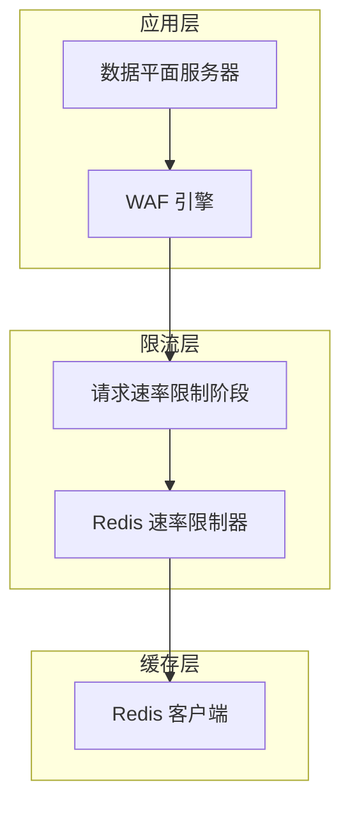
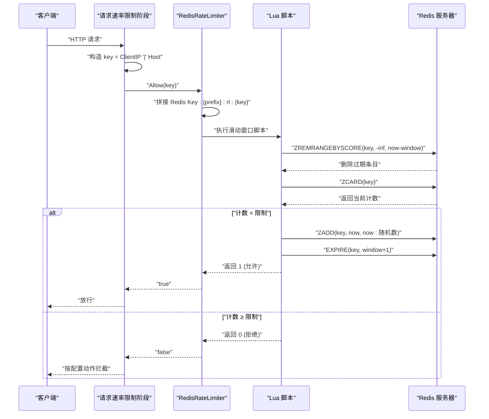
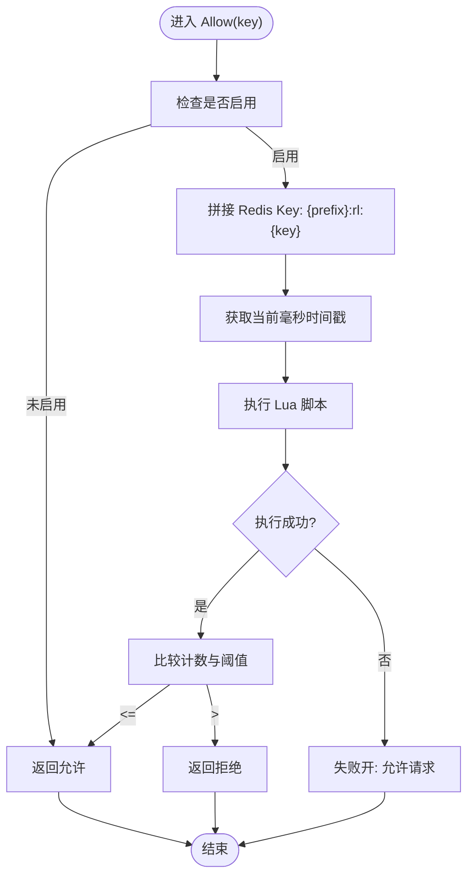
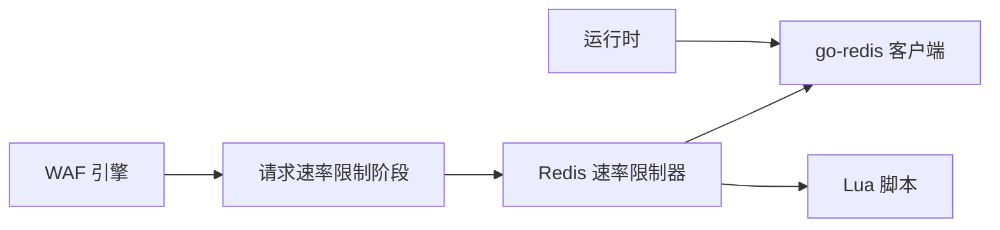

# 分布式滑动窗口限流

<cite>
**本文档引用的文件**
- [redis.go](file://internal/waf/ratelimit/redis.go)
- [ratelimit.go](file://internal/waf/ratelimit/ratelimit.go)
- [phases.go](file://internal/core/rules/phases.go)
- [engine.go](file://internal/core/engine/engine.go)
- [redis.go](file://internal/core/redis/redis.go)
- [runtime.go](file://internal/core/runtime.go)
- [protection.go](file://internal/store/protection.go)
- [分布式速率限制.md](file://docs/安全防护功能/速率限制机制/分布式速率限制.md)
- [速率限制机制.md](file://docs/安全防护功能/速率限制机制/速率限制机制.md)
- [限流配置管理.md](file://docs/安全防护功能/速率限制机制/限流配置管理.md)
</cite>

## 目录
1. [简介](#简介)
2. [项目结构](#项目结构)
3. [核心组件](#核心组件)
4. [架构概览](#架构概览)
5. [详细组件分析](#详细组件分析)
6. [依赖关系分析](#依赖关系分析)
7. [性能考虑](#性能考虑)
8. [故障排除指南](#故障排除指南)
9. [结论](#结论)
10. [附录](#附录)

## 简介
本文件面向分布式滑动窗口限流器的实现与使用，重点阐述 RedisRateLimiter 的设计与实现，包括：
- 基于有序集合（ZSET）的滑动窗口算法
- Lua 原子脚本的使用与执行流程
- Redis 键空间设计与命名规范
- 失败开（fail-open）策略及其安全考量
- 集成方式与配置管理
- 相比固定窗口的优势与高并发表现

## 项目结构
My-OpenWaf 在 WAF 引擎中通过规则阶段集成速率限制，支持本地固定窗口与 Redis 滑动窗口两种模式。Redis 模式通过 Lua 脚本保证原子性，键空间采用统一前缀，确保跨节点一致性与可运维性。

**图表来源**
- [engine.go:179-182](file://internal/core/engine/engine.go#L179-L182)
- [phases.go:159-198](file://internal/core/rules/phases.go#L159-L198)
- [redis.go:12-20](file://internal/waf/ratelimit/redis.go#L12-L20)

**章节来源**
- [engine.go:179-182](file://internal/core/engine/engine.go#L179-L182)
- [phases.go:159-198](file://internal/core/rules/phases.go#L159-L198)
- [redis.go:12-20](file://internal/waf/ratelimit/redis.go#L12-L20)

## 核心组件
- RedisRateLimiter：基于 Redis 的滑动窗口限流器，使用 Lua 脚本保证原子性，支持动态配置与失败开策略。
- 请求速率限制阶段：在规则执行链中插入，构造键（客户端 IP + '|' + Host），调用限流器并根据配置动作返回结果。
- Redis 客户端与连接池：通过统一的 Redis 工厂创建，设置合理的超时与连接参数。

**章节来源**
- [redis.go:12-20](file://internal/waf/ratelimit/redis.go#L12-L20)
- [phases.go:159-198](file://internal/core/rules/phases.go#L159-L198)
- [redis.go:17-30](file://internal/core/redis/redis.go#L17-L30)

## 架构概览
Redis 滑动窗口限流器通过 Lua 脚本在单次调用中完成“清理过期项 → 计数 → 写入新项 → 设置过期”的原子流程，键空间采用统一前缀，确保跨节点一致性与可运维性。

**图表来源**
- [redis.go:49-64](file://internal/waf/ratelimit/redis.go#L49-L64)
- [redis.go:87-105](file://internal/waf/ratelimit/redis.go#L87-L105)
- [phases.go:174-198](file://internal/core/rules/phases.go#L174-L198)

## 详细组件分析

### RedisRateLimiter 实现原理
- 键空间设计：使用统一前缀与命名规范，键格式为 `{prefix}:rl:{key}`，便于环境/租户隔离与运维管理。
- 滑动窗口算法：以有序集合记录每次允许的时间戳，Lua 脚本原子地清理过期项、计数并写入新项，最后设置过期时间。
- 原子脚本：
  - 清理过期项：基于时间窗口下界，删除过期条目。
  - 计数：统计当前窗口内请求数量。
  - 写入新项：添加当前时间戳作为分数，成员包含时间戳与随机数，避免重复分数导致的覆盖。
  - 设置过期：为键设置过期时间，避免无限增长。
- 失败开策略：Redis 调用异常时返回允许，确保服务可用性；同时提供 IsOverLimit 查询而不增量的方法，便于统计与观测。

**图表来源**
- [redis.go:87-105](file://internal/waf/ratelimit/redis.go#L87-L105)
- [redis.go:49-64](file://internal/waf/ratelimit/redis.go#L49-L64)

**章节来源**
- [redis.go:12-20](file://internal/waf/ratelimit/redis.go#L12-L20)
- [redis.go:49-64](file://internal/waf/ratelimit/redis.go#L49-L64)
- [redis.go:87-105](file://internal/waf/ratelimit/redis.go#L87-L105)
- [redis.go:127-144](file://internal/waf/ratelimit/redis.go#L127-L144)

### 键空间设计与命名规范
- 统一前缀：通过构造函数传入前缀，支持按环境/租户隔离。
- 键格式：`{prefix}:rl:{key}`，其中 key 通常为“客户端 IP + '|' + Host”，确保站点级隔离。
- 过期策略：Lua 脚本设置过期时间为窗口宽度加 1 秒，避免边界竞争。

**章节来源**
- [redis.go:95](file://internal/waf/ratelimit/redis.go#L95)
- [redis.go:59-60](file://internal/waf/ratelimit/redis.go#L59-L60)

### Lua 原子脚本解析
- 清理过期项：使用 ZREMRANGEBYSCORE 删除早于窗口下界的条目。
- 计算当前窗口内请求数：使用 ZCARD 获取当前计数。
- 写入新的时间戳：使用 ZADD 添加当前时间戳，成员包含时间戳与随机数，避免重复分数。
- 设置过期时间：使用 EXPIRE 为键设置过期时间。
- 返回值：允许返回 1，拒绝返回 0；异常时上层采用失败开策略返回允许。

**章节来源**
- [redis.go:49-64](file://internal/waf/ratelimit/redis.go#L49-L64)
- [redis.go:66-85](file://internal/waf/ratelimit/redis.go#L66-L85)

### 失败开策略与安全考虑
- 设计理念：在 Redis 调用异常时返回允许，避免外部依赖故障引发雪崩。
- 安全考虑：异常放行可能带来短期流量激增风险，需配合监控与告警；建议在 Redis 可用性恢复后尽快收敛流量。
- 行为表现：Allow 方法在 Redis 错误时返回允许；IsOverLimit 查询不增量，便于统计与观测。

**章节来源**
- [redis.go:101-104](file://internal/waf/ratelimit/redis.go#L101-L104)
- [redis.go:140-143](file://internal/waf/ratelimit/redis.go#L140-L143)

### 与引擎阶段的集成
- 阶段名称：rate_limit
- 键构造：客户端 IP + '|' + Host，实现站点级隔离。
- 动作类型：由保护配置决定（如拦截），若超限则返回相应动作。
- 启用条件：受保护配置与限流器 Enabled 状态共同控制。

**章节来源**
- [phases.go:159-198](file://internal/core/rules/phases.go#L159-L198)
- [engine.go:179-182](file://internal/core/engine/engine.go#L179-L182)

### 配置管理与热重载
- 配置项：请求/错误速率限制的开关、窗口（秒）、最大请求数、动作类型。
- 默认值：请求窗口 60 秒、配额 300；错误窗口 300 秒、配额 30。
- 初始化：应用启动时从快照加载保护配置，创建本地/Redis 限流器实例。
- 热重载：通过 Redis Pub/Sub 广播配置变更，各节点订阅回调中调用 Reconfigure 更新限流器参数。

**章节来源**
- [protection.go:75-103](file://internal/store/protection.go#L75-L103)
- [engine.go:179-182](file://internal/core/engine/engine.go#L179-L182)
- [速率限制机制.md:280-298](file://docs/安全防护功能/速率限制机制/速率限制机制.md#L280-L298)

## 依赖关系分析
- RedisRateLimiter 依赖 go-redis 客户端与 Lua 脚本，确保原子性与一致性。
- 引擎通过规则阶段注入限流器，受保护配置控制是否启用及动作类型。
- 运行时通过 Redis 工厂创建客户端并进行连通性校验，确保限流器可用。

**图表来源**
- [redis.go:12-20](file://internal/waf/ratelimit/redis.go#L12-L20)
- [engine.go:179-182](file://internal/core/engine/engine.go#L179-L182)
- [runtime.go:49-59](file://internal/core/runtime.go#L49-L59)

**章节来源**
- [redis.go:12-20](file://internal/waf/ratelimit/redis.go#L12-L20)
- [engine.go:179-182](file://internal/core/engine/engine.go#L179-L182)
- [runtime.go:49-59](file://internal/core/runtime.go#L49-L59)

## 性能考虑
- 原子脚本：Lua 脚本减少往返次数，保证清理、计数、写入的原子性。
- 过期与清理：Redis 限流器通过有序集合与 EXPIRE 自动回收，避免无限增长。
- 失败开策略：Redis 调用异常时允许请求，避免因外部依赖故障导致雪崩。
- 连接池与超时：Redis 客户端设置合理的超时参数，降低网络抖动影响。
- 热点规避：键包含前缀与站点标识，建议结合限流键的散列策略或分片键（在上游规则中扩展）。

**章节来源**
- [redis.go:67-85](file://internal/waf/ratelimit/redis.go#L67-L85)
- [redis.go:17-30](file://internal/core/redis/redis.go#L17-L30)
- [速率限制机制.md:497-504](file://docs/安全防护功能/速率限制机制/速率限制机制.md#L497-L504)

## 故障排除指南
- Redis 连接失败
  - 检查 Redis 地址配置与网络连通性
  - 验证连接池状态与超时设置
- 速率限制不生效
  - 确认限流器已启用与配置正确
  - 检查键空间命名与 Lua 脚本执行
- 性能问题
  - 监控 Redis 延迟与命令统计
  - 评估键数量增长与过期清理成本
- 热重载未生效
  - 检查 Redis Pub/Sub 通道是否正常发布/订阅
  - 确认回调函数中是否正确调用 Reconfigure

**章节来源**
- [速率限制机制.md:512-530](file://docs/安全防护功能/速率限制机制/速率限制机制.md#L512-L530)
- [分布式速率限制.md:332-360](file://docs/安全防护功能/速率限制机制/分布式速率限制.md#L332-L360)

## 结论
My-OpenWaf 的分布式滑动窗口限流器通过 Redis 有序集合与 Lua 原子脚本，提供了跨节点一致性的强准确限流能力。结合失败开策略与热重载机制，系统在保证性能的同时兼顾了高可用与可运维性。建议在高并发场景优先采用 Redis 限流器，并结合监控与键空间设计避免热点与资源浪费。

## 附录

### 配置示例与集成指南
- Redis 客户端配置
  - 地址、密码、数据库：通过运行时工厂创建客户端
  - 超时设置：连接 5 秒、读写 3 秒
- 键空间前缀设置
  - 通过构造函数传入前缀，支持按环境/租户隔离
- 动态配置更新
  - 保护配置模型包含请求/错误速率限制的开关、窗口、配额、动作
  - 通过 Redis Pub/Sub 实现跨节点热重载

**章节来源**
- [redis.go:17-30](file://internal/core/redis/redis.go#L17-L30)
- [redis.go:24-35](file://internal/waf/ratelimit/redis.go#L24-L35)
- [protection.go:75-103](file://internal/store/protection.go#L75-L103)
- [速率限制机制.md:280-298](file://docs/安全防护功能/速率限制机制/速率限制机制.md#L280-L298)

### 滑动窗口 vs 固定窗口
- 固定窗口（本地）
  - 优点：实现简单、CPU 开销低
  - 缺点：边界突发、无法平滑处理瞬时峰值
  - 适用：单节点、对精度要求不高
- 滑动窗口（Redis）
  - 优点：更贴近真实速率、抗边界突发
  - 缺点：有序集合增长与过期清理成本较高
  - 适用：多节点、强一致需求

**章节来源**
- [速率限制机制.md:543-551](file://docs/安全防护功能/速率限制机制/速率限制机制.md#L543-L551)