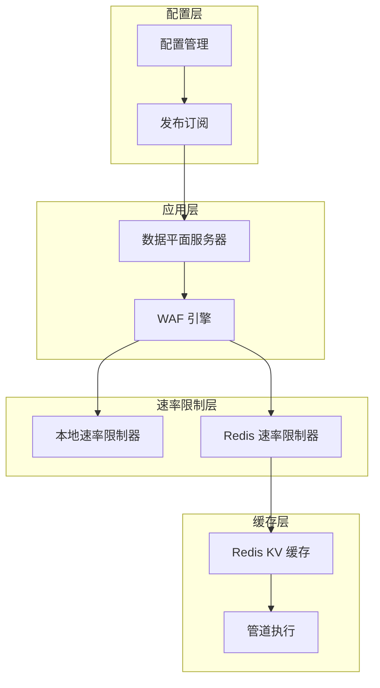
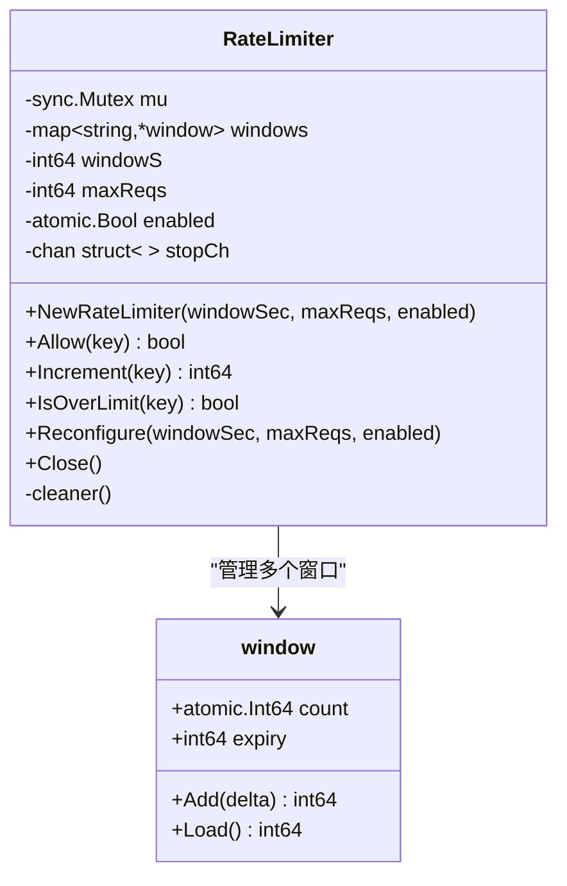
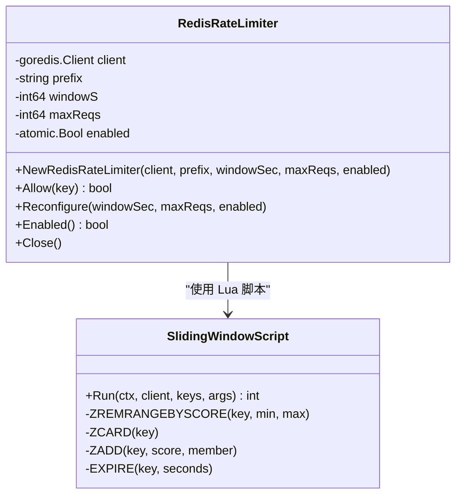
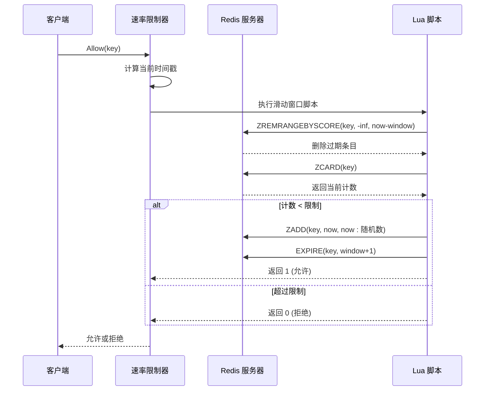
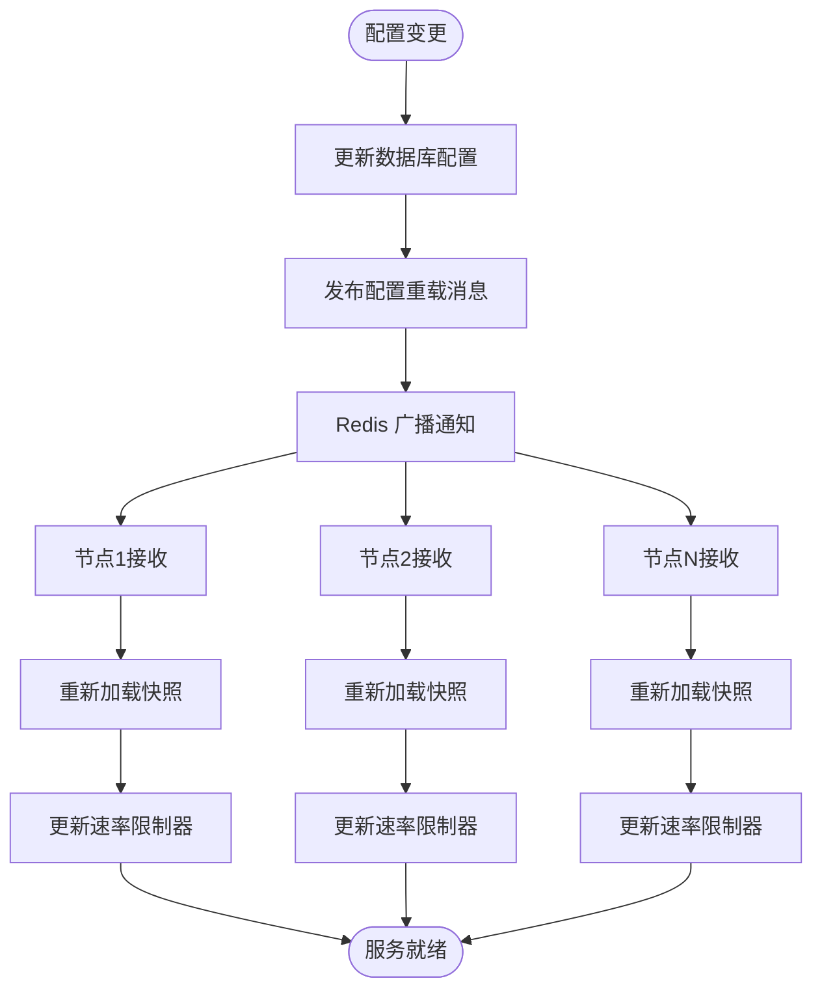
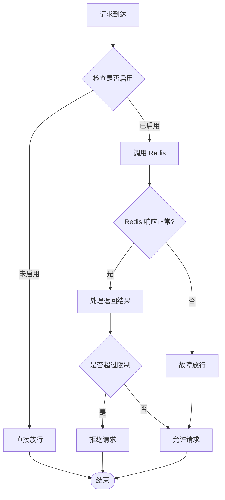
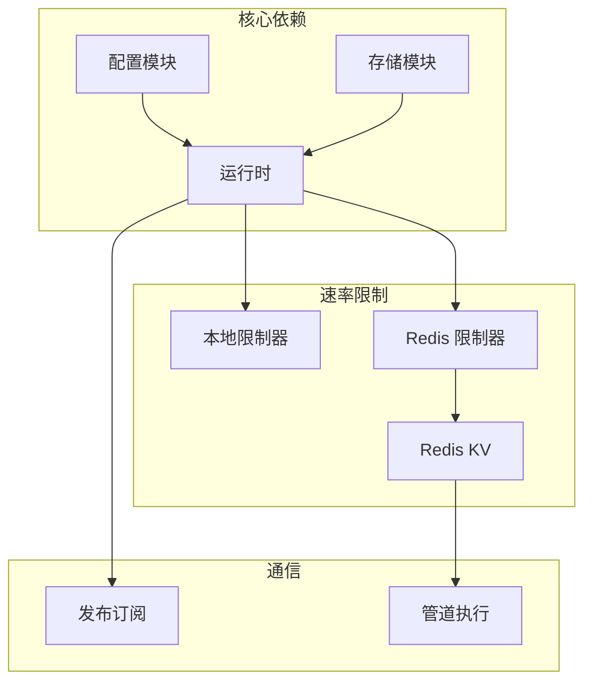

# 分布式速率限制

<cite>
**本文档引用的文件**
- [ratelimit.go](file://internal/waf/ratelimit.go)
- [ratelimit_redis.go](file://internal/waf/ratelimit_redis.go)
- [redis_kv.go](file://internal/cache/redis_kv.go)
- [redis.go](file://internal/core/redis/redis.go)
- [pubsub.go](file://internal/core/redis/pubsub.go)
- [runtime.go](file://internal/core/runtime.go)
- [server.go](file://internal/app/server.go)
- [models.go](file://internal/store/models.go)
- [config.go](file://internal/core/config.go)
</cite>

## 目录
1. [简介](#简介)
2. [项目结构](#项目结构)
3. [核心组件](#核心组件)
4. [架构概览](#架构概览)
5. [详细组件分析](#详细组件分析)
6. [依赖关系分析](#依赖关系分析)
7. [性能考虑](#性能考虑)
8. [故障排除指南](#故障排除指南)
9. [结论](#结论)

## 简介

My-OpenWaf 实现了完整的分布式速率限制解决方案，支持本地和分布式两种模式。该系统通过 Redis 提供跨节点一致性的速率限制能力，确保在多节点部署环境中的一致行为。

系统采用双层架构设计：
- **本地速率限制**：单节点内存中的固定窗口计数器
- **分布式速率限制**：基于 Redis 的滑动窗口实现，支持跨节点共享状态

## 项目结构

**图表来源**
- [server.go:93-110](file://internal/app/server.go#L93-L110)
- [ratelimit.go:9-22](file://internal/waf/ratelimit.go#L9-L22)
- [ratelimit_redis.go:12-20](file://internal/waf/ratelimit_redis.go#L12-L20)

**章节来源**
- [server.go:93-110](file://internal/app/server.go#L93-L110)
- [config.go:74-102](file://internal/core/config.go#L74-L102)

## 核心组件

### 本地速率限制器

本地速率限制器实现了基于固定窗口的内存计数机制：

**图表来源**
- [ratelimit.go:9-22](file://internal/waf/ratelimit.go#L9-L22)

### Redis 速率限制器

Redis 速率限制器基于滑动窗口算法，使用 Lua 脚本确保原子性：

**图表来源**
- [ratelimit_redis.go:12-20](file://internal/waf/ratelimit_redis.go#L12-L20)
- [ratelimit_redis.go:49-64](file://internal/waf/ratelimit_redis.go#L49-L64)

**章节来源**
- [ratelimit.go:9-116](file://internal/waf/ratelimit.go#L9-L116)
- [ratelimit_redis.go:12-88](file://internal/waf/ratelimit_redis.go#L12-L88)

## 架构概览

### 分布式窗口实现

系统采用 Redis Sorted Set 实现滑动窗口，每个窗口包含以下元素：

**图表来源**
- [ratelimit_redis.go:49-84](file://internal/waf/ratelimit_redis.go#L49-L84)

### 键空间设计策略

Redis 中的键命名遵循统一规范：

| 组件 | 键格式 | 描述 |
|------|--------|------|
| 速率限制 | `{prefix}:rl:{key}` | 滑动窗口计数器 |
| 配置同步 | `openwaf:config:reload` | 配置热重载通道 |
| 分布式缓存 | `openwaf:{key}` | 共享状态存储 |

**章节来源**
- [ratelimit_redis.go:74-74](file://internal/waf/ratelimit_redis.go#L74-L74)
- [pubsub.go:11-11](file://internal/core/redis/pubsub.go#L11-L11)

## 详细组件分析

### 配置管理与热重载

系统支持动态配置更新，通过 Redis 发布订阅实现多节点同步：

**图表来源**
- [server.go:220-260](file://internal/app/server.go#L220-L260)
- [pubsub.go:33-67](file://internal/core/redis/pubsub.go#L33-L67)

### 错误处理与容错机制

系统采用"故障时放行"策略，确保在 Redis 故障时服务不中断：

**图表来源**
- [ratelimit_redis.go:67-84](file://internal/waf/ratelimit_redis.go#L67-L84)

**章节来源**
- [server.go:220-260](file://internal/app/server.go#L220-L260)
- [ratelimit_redis.go:67-84](file://internal/waf/ratelimit_redis.go#L67-L84)

### 性能优化策略

#### 连接池配置

Redis 客户端采用以下超时设置：
- DialTimeout: 5秒（连接建立）
- ReadTimeout: 3秒（读取操作）
- WriteTimeout: 3秒（写入操作）

#### 批量操作优化

系统使用管道(Pipeline)执行原子操作：
- Incr + Expire 组合操作
- 减少网络往返次数
- 确保操作原子性

**章节来源**
- [redis.go:18-29](file://internal/core/redis/redis.go#L18-L29)
- [redis_kv.go:86-101](file://internal/cache/redis_kv.go#L86-L101)

## 依赖关系分析

### 组件耦合度

**图表来源**
- [runtime.go:17-25](file://internal/core/runtime.go#L17-L25)
- [server.go:93-110](file://internal/app/server.go#L93-L110)

### 外部依赖

系统主要依赖以下外部组件：
- **Redis go-redis v9**: Redis 客户端库
- **Go 标准库**: 并发控制、时间管理
- **GORM**: 数据库抽象层

**章节来源**
- [runtime.go:7-14](file://internal/core/runtime.go#L7-L14)
- [ratelimit_redis.go:9-9](file://internal/waf/ratelimit_redis.go#L9-L9)

## 性能考虑

### 网络延迟处理

系统通过以下机制优化网络性能：
- **短超时设置**: 50ms 请求超时，避免阻塞
- **故障放行**: Redis 错误时不影响业务
- **原子操作**: Lua 脚本减少网络往返

### 内存管理

- **本地清理**: 30秒定时清理过期窗口
- **Redis 过期**: 自动过期机制释放内存
- **键前缀**: 统一命名空间便于管理

### 扩展性设计

- **水平扩展**: 支持多节点部署
- **配置热重载**: 动态调整限制参数
- **监控集成**: 与指标系统无缝对接

## 故障排除指南

### 常见问题诊断

1. **Redis 连接失败**
   - 检查 Redis 地址配置
   - 验证网络连通性
   - 查看连接池状态

2. **速率限制不生效**
   - 确认限制器已启用
   - 检查键空间命名
   - 验证 Lua 脚本执行

3. **性能问题**
   - 监控 Redis 延迟
   - 检查网络状况
   - 评估键数量增长

### 调试建议

- 启用详细的日志记录
- 监控 Redis 命令统计
- 定期检查内存使用情况
- 验证配置同步机制

**章节来源**
- [redis.go:32-38](file://internal/core/redis/redis.go#L32-L38)
- [ratelimit_redis.go:80-82](file://internal/waf/ratelimit_redis.go#L80-L82)

## 结论

My-OpenWaf 的分布式速率限制系统提供了完整的跨节点一致性保障。通过精心设计的键空间、原子操作和故障处理机制，系统能够在保证性能的同时提供可靠的速率限制能力。

关键优势包括：
- **跨节点一致性**: 基于 Redis 的共享状态
- **高性能**: 原子 Lua 脚本和连接池优化
- **高可用**: 故障放行策略确保服务连续性
- **可扩展**: 支持动态配置和水平扩展

该实现为分布式 Web 应用提供了坚实的防护基础，能够有效应对各种流量攻击和滥用行为。