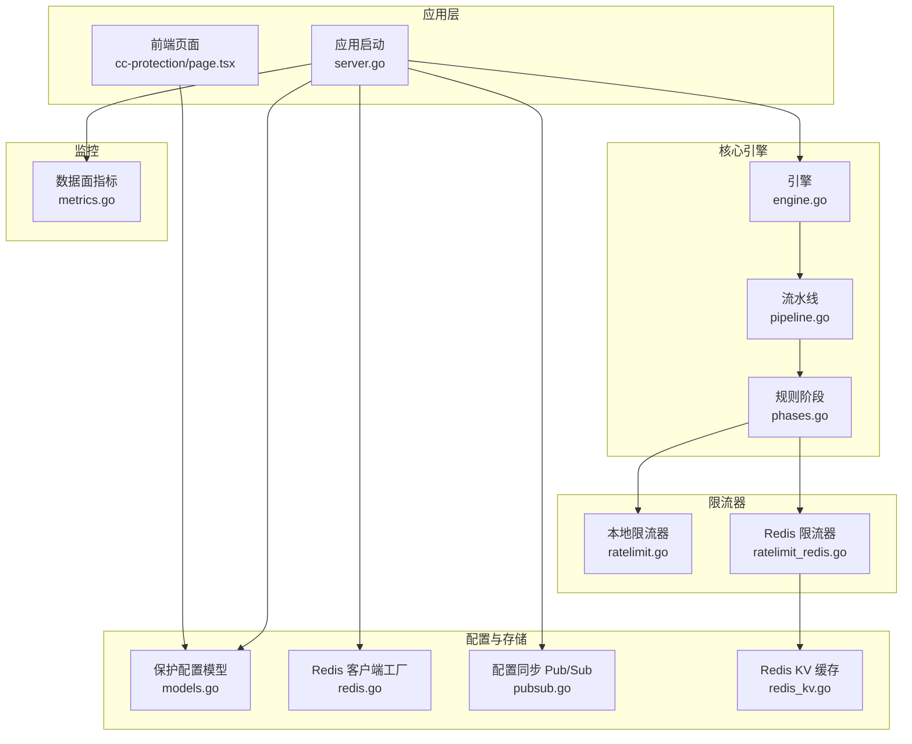
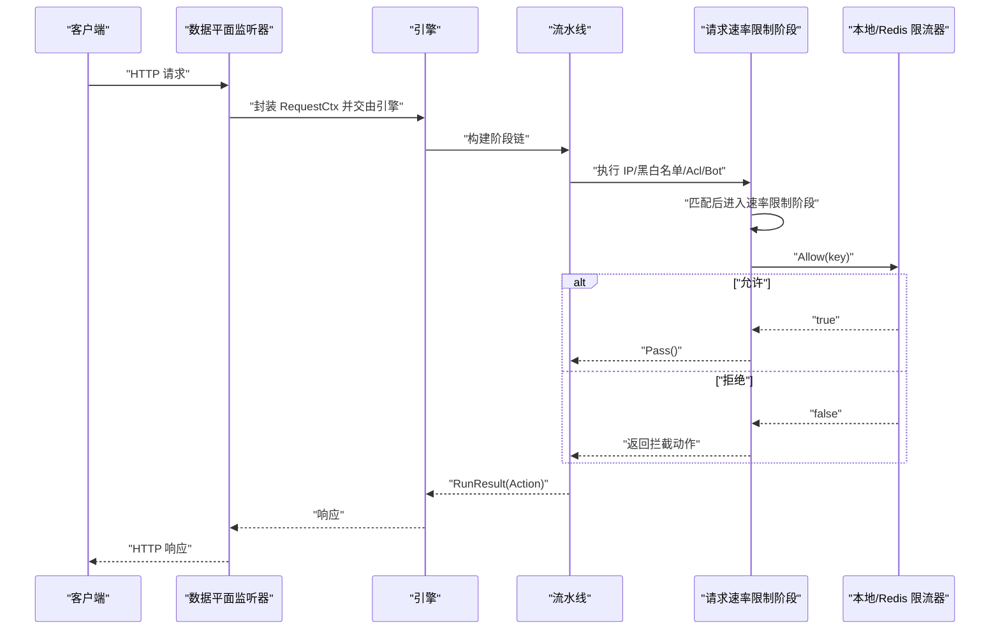
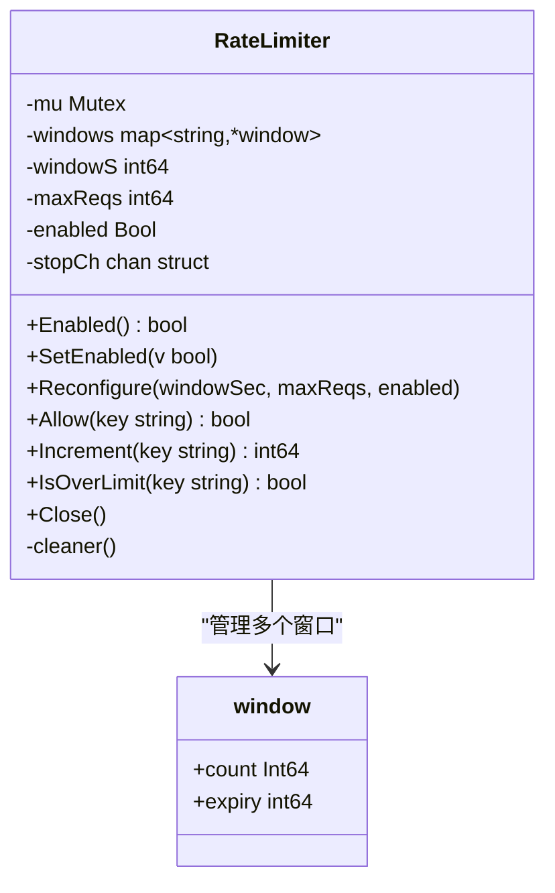
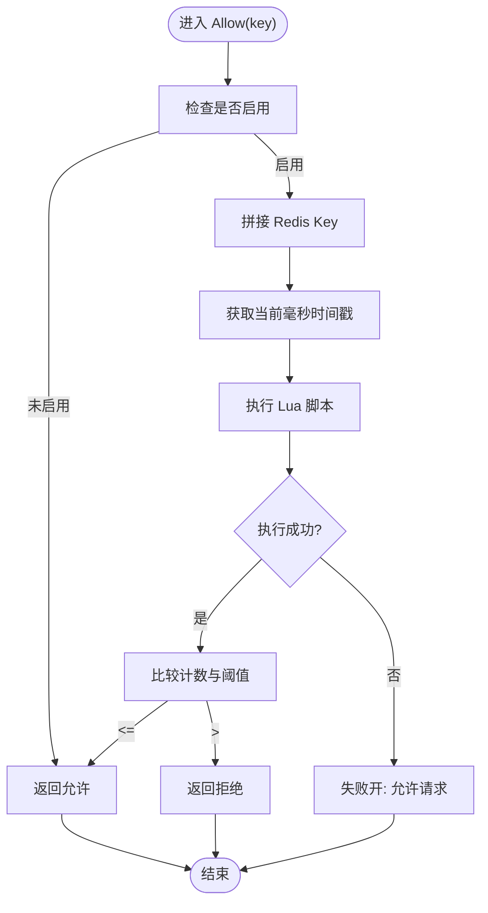
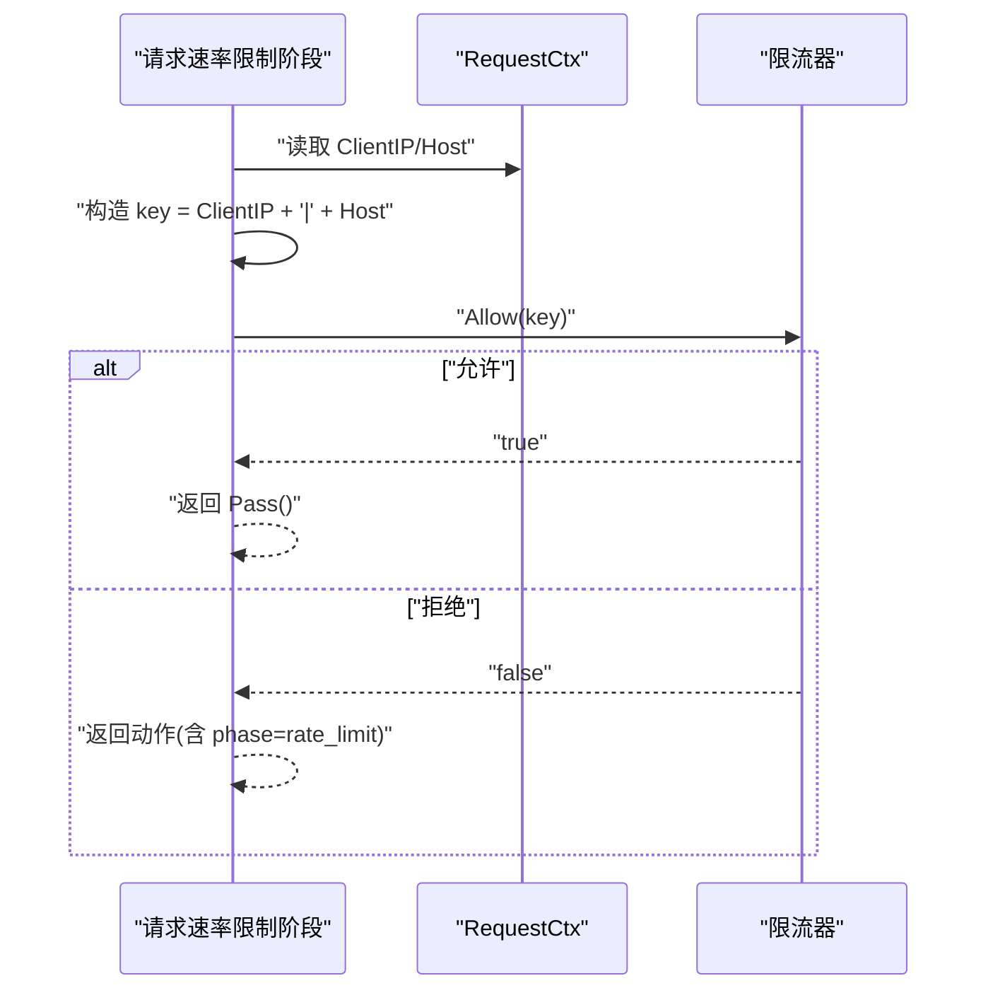
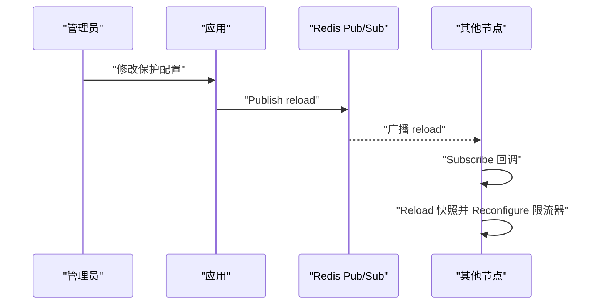
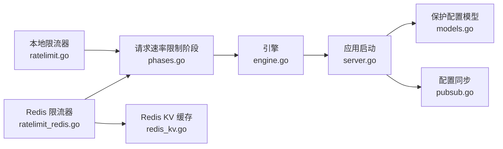

# 速率限制机制

<cite>
**本文引用的文件**
- [ratelimit.go](file://internal/waf/ratelimit.go)
- [ratelimit_redis.go](file://internal/waf/ratelimit_redis.go)
- [ratelimit_test.go](file://internal/waf/ratelimit_test.go)
- [server.go](file://internal/app/server.go)
- [engine.go](file://internal/core/engine/engine.go)
- [phases.go](file://internal/core/rules/phases.go)
- [models.go](file://internal/store/models.go)
- [redis.go](file://internal/core/redis/redis.go)
- [pubsub.go](file://internal/core/redis/pubsub.go)
- [redis_kv.go](file://internal/cache/redis_kv.go)
- [metrics.go](file://internal/dataplane/metrics.go)
- [page.tsx](file://frontend/app/(dashboard)/cc-protection/page.tsx)
</cite>

## 目录
1. [简介](#简介)
2. [项目结构](#项目结构)
3. [核心组件](#核心组件)
4. [架构总览](#架构总览)
5. [详细组件分析](#详细组件分析)
6. [依赖关系分析](#依赖关系分析)
7. [性能考量](#性能考量)
8. [故障排查指南](#故障排查指南)
9. [结论](#结论)
10. [附录](#附录)

## 简介
本文件系统性梳理 My-OpenWaf 的速率限制机制，覆盖以下要点：
- 速率限制算法实现：固定窗口（本地）、滑动窗口（Redis 分布式）
- Redis 集成与分布式一致性：键空间设计、Lua 原子脚本、失败开策略
- 限流策略配置项：窗口、配额、动作类型、是否启用
- 多维度限流：IP 级、站点级（Host）组合键
- 性能优化与监控：避免热点、内存清理、指标采集
- 缓存与持久化：Redis KV、配置同步与热重载

## 项目结构
与速率限制直接相关的模块分布如下：
- 内核层（规则执行链）：engine 负责组装阶段，包含请求速率限制阶段
- 规则阶段：按顺序执行 IP 黑白名单、ACL、机器人检测、速率限制等
- 本地限流器：固定窗口计数器，带过期清理
- Redis 限流器：基于有序集合的滑动窗口，Lua 原子脚本
- 配置模型：保护策略中包含请求/错误速率限制的开关、窗口、配额、动作
- 应用启动：从快照加载保护配置，初始化本地限流器，并支持热重载
- 前端界面：可视化展示与编辑请求/错误速率限制策略

**图表来源**
- [server.go:90-125](file://internal/app/server.go#L90-L125)
- [engine.go:103-106](file://internal/core/engine/engine.go#L103-L106)
- [phases.go:103-128](file://internal/core/rules/phases.go#L103-L128)
- [ratelimit.go:9-22](file://internal/waf/ratelimit.go#L9-L22)
- [ratelimit_redis.go:12-20](file://internal/waf/ratelimit_redis.go#L12-L20)
- [models.go:247-294](file://internal/store/models.go#L247-L294)
- [redis.go:17-30](file://internal/core/redis/redis.go#L17-L30)
- [pubsub.go:13-31](file://internal/core/redis/pubsub.go#L13-L31)
- [redis_kv.go:13-21](file://internal/cache/redis_kv.go#L13-L21)
- [metrics.go:9-28](file://internal/dataplane/metrics.go#L9-L28)

**章节来源**
- [server.go:90-125](file://internal/app/server.go#L90-L125)
- [engine.go:103-106](file://internal/core/engine/engine.go#L103-L106)
- [phases.go:103-128](file://internal/core/rules/phases.go#L103-L128)
- [models.go:247-294](file://internal/store/models.go#L247-L294)

## 核心组件
- 本地固定窗口限流器：以“客户端 IP + Host”为键，维护每个窗口内的计数与过期时间，周期性清理过期键，适合单节点部署
- Redis 滑动窗口限流器：以有序集合记录每次允许的时间戳，Lua 脚本原子地清理过期项、计数并写入新项，适合多节点共享状态
- 引擎阶段：在规则执行链中插入请求速率限制阶段，根据保护配置决定动作类型
- 配置模型：定义请求/错误速率限制的开关、窗口、配额、动作类型等
- 应用启动与热重载：从快照加载保护配置，初始化限流器；通过 Redis Pub/Sub 实现跨节点同步

**章节来源**
- [ratelimit.go:9-22](file://internal/waf/ratelimit.go#L9-L22)
- [ratelimit_redis.go:12-20](file://internal/waf/ratelimit_redis.go#L12-L20)
- [engine.go:103-106](file://internal/core/engine/engine.go#L103-L106)
- [models.go:247-294](file://internal/store/models.go#L247-L294)
- [server.go:220-242](file://internal/app/server.go#L220-L242)

## 架构总览
速率限制在请求处理流程中的位置如下：

**图表来源**
- [engine.go:57-129](file://internal/core/engine/engine.go#L57-L129)
- [phases.go:109-127](file://internal/core/rules/phases.go#L109-L127)
- [ratelimit.go:48-62](file://internal/waf/ratelimit.go#L48-L62)
- [ratelimit_redis.go:67-85](file://internal/waf/ratelimit_redis.go#L67-L85)

## 详细组件分析

### 本地固定窗口限流器（Fixed Window）
- 键空间设计：以“客户端 IP + '|' + Host”为键，区分同一 IP 下不同站点的独立配额
- 计数与过期：每个键维护一个原子计数器与到期时间；到期或不存在时重建窗口
- 清理策略：后台定时器定期扫描并删除已过期窗口，防止内存泄漏
- 功能接口：Allow/Increment/IsOverLimit/Reconfigure/Enabled/Close

**图表来源**
- [ratelimit.go:9-22](file://internal/waf/ratelimit.go#L9-L22)

**章节来源**
- [ratelimit.go:9-22](file://internal/waf/ratelimit.go#L9-L22)
- [ratelimit.go:48-62](file://internal/waf/ratelimit.go#L48-L62)
- [ratelimit.go:98-116](file://internal/waf/ratelimit.go#L98-L116)

### Redis 滑动窗口限流器（Sliding Window）
- 键空间设计：以“前缀:rl:键”命名，前缀可区分环境/集群，避免冲突
- 原子操作：Lua 脚本一次性完成清理过期项、计数、写入新项与设置过期时间
- 失败开策略：Redis 调用异常时返回允许，确保服务可用性
- 动作类型：通过上下文控制超限时的动作（如拦截）

**图表来源**
- [ratelimit_redis.go:67-85](file://internal/waf/ratelimit_redis.go#L67-L85)
- [ratelimit_redis.go:49-64](file://internal/waf/ratelimit_redis.go#L49-L64)

**章节来源**
- [ratelimit_redis.go:12-20](file://internal/waf/ratelimit_redis.go#L12-L20)
- [ratelimit_redis.go:49-64](file://internal/waf/ratelimit_redis.go#L49-L64)
- [ratelimit_redis.go:67-85](file://internal/waf/ratelimit_redis.go#L67-L85)

### 速率限制阶段与引擎集成
- 阶段名称：rate_limit
- 执行逻辑：构造键（客户端 IP + '|' + Host），调用限流器 Allow，若超限则返回对应动作
- 动作类型：由保护配置决定（如拦截）

**图表来源**
- [phases.go:109-127](file://internal/core/rules/phases.go#L109-L127)

**章节来源**
- [phases.go:103-128](file://internal/core/rules/phases.go#L103-L128)
- [engine.go:103-106](file://internal/core/engine/engine.go#L103-L106)

### 配置与热重载
- 配置项：请求/错误速率限制的开关、窗口（秒）、最大请求数、动作类型
- 默认值：请求窗口 60 秒、配额 300；错误窗口 300 秒、配额 30
- 初始化：应用启动时从快照加载保护配置，创建本地限流器实例
- 热重载：通过 Redis Pub/Sub 发布/订阅，跨节点同步配置变更并动态更新限流器参数

**图表来源**
- [server.go:220-242](file://internal/app/server.go#L220-L242)
- [pubsub.go:33-67](file://internal/core/redis/pubsub.go#L33-L67)

**章节来源**
- [models.go:247-294](file://internal/store/models.go#L247-L294)
- [server.go:90-102](file://internal/app/server.go#L90-L102)
- [server.go:220-242](file://internal/app/server.go#L220-L242)
- [pubsub.go:13-31](file://internal/core/redis/pubsub.go#L13-L31)

### 多维度限流实现
- IP 级：键为客户端 IP
- 站点级：键为“IP + '|' + Host”，实现按站点隔离
- API 级：可在上游规则中扩展键的组成（例如加入路径/方法），但默认阶段仅使用 IP+Host 组合键

**章节来源**
- [phases.go:113-117](file://internal/core/rules/phases.go#L113-L117)
- [ratelimit.go:48-62](file://internal/waf/ratelimit.go#L48-L62)

## 依赖关系分析
- 本地限流器依赖标准库的并发原语与时间包
- Redis 限流器依赖 go-redis 客户端与 Lua 脚本
- 引擎通过规则阶段注入限流器，受保护配置控制是否启用及动作类型
- 配置同步通过 Redis Pub/Sub 实现跨节点一致性

**图表来源**
- [ratelimit.go:9-22](file://internal/waf/ratelimit.go#L9-L22)
- [ratelimit_redis.go:12-20](file://internal/waf/ratelimit_redis.go#L12-L20)
- [phases.go:103-128](file://internal/core/rules/phases.go#L103-L128)
- [engine.go:103-106](file://internal/core/engine/engine.go#L103-L106)
- [server.go:90-125](file://internal/app/server.go#L90-L125)
- [models.go:247-294](file://internal/store/models.go#L247-L294)
- [pubsub.go:13-31](file://internal/core/redis/pubsub.go#L13-L31)
- [redis_kv.go:13-21](file://internal/cache/redis_kv.go#L13-L21)

**章节来源**
- [ratelimit.go:9-22](file://internal/waf/ratelimit.go#L9-L22)
- [ratelimit_redis.go:12-20](file://internal/waf/ratelimit_redis.go#L12-L20)
- [phases.go:103-128](file://internal/core/rules/phases.go#L103-L128)
- [engine.go:103-106](file://internal/core/engine/engine.go#L103-L106)
- [server.go:90-125](file://internal/app/server.go#L90-L125)
- [models.go:247-294](file://internal/store/models.go#L247-L294)
- [pubsub.go:13-31](file://internal/core/redis/pubsub.go#L13-L31)
- [redis_kv.go:13-21](file://internal/cache/redis_kv.go#L13-L21)

## 性能考量
- Redis 原子脚本：Lua 脚本减少往返次数，保证清理、计数、写入的原子性
- 过期与清理：本地限流器后台清理过期窗口，避免无限增长；Redis 限流器通过有序集合与 EXPIRE 自动回收
- 失败开策略：Redis 调用异常时允许请求，避免因外部依赖故障导致雪崩
- 热点规避：Redis 键包含“前缀:rl:键”，可通过前缀区分环境/租户；建议结合限流键的散列策略或分片键（在上游规则中扩展）
- 内存与 CPU：固定窗口对 CPU 友好；滑动窗口在高 QPS 下需关注有序集合大小与过期清理成本
- 监控：利用数据面指标统计请求总量、状态码分布、WAF 拦截数，辅助评估限流效果

**章节来源**
- [ratelimit_redis.go:67-85](file://internal/waf/ratelimit_redis.go#L67-L85)
- [ratelimit.go:98-116](file://internal/waf/ratelimit.go#L98-L116)
- [metrics.go:9-66](file://internal/dataplane/metrics.go#L9-L66)

## 故障排查指南
- 本地限流器不生效
  - 检查 Enabled 状态与 Reconfigure 是否正确调用
  - 确认键构造是否包含 Host，避免跨站点误判
- Redis 限流器异常
  - 查看 Redis 调用超时与错误日志
  - 确认 Lua 脚本执行结果与阈值比较逻辑
  - 失败开策略会放行请求，需结合监控定位
- 热重载未生效
  - 检查 Redis Pub/Sub 通道是否正常发布/订阅
  - 确认回调函数中是否正确调用 Reconfigure
- 前端策略未生效
  - 对比前端显示的窗口/配额与后端默认值
  - 确认保护配置已保存并触发热重载

**章节来源**
- [ratelimit_test.go:7-43](file://internal/waf/ratelimit_test.go#L7-L43)
- [server.go:220-242](file://internal/app/server.go#L220-L242)
- [pubsub.go:33-67](file://internal/core/redis/pubsub.go#L33-L67)
- [page.tsx:246-295](file://frontend/app/(dashboard)/cc-protection/page.tsx#L246-L295)

## 结论
本项目提供了两种速率限制实现：本地固定窗口与 Redis 滑动窗口。前者简单高效，后者具备分布式一致性与更强的准确性。通过保护配置模型与热重载机制，系统实现了灵活的策略管理与跨节点同步。建议在高并发场景优先采用 Redis 限流器，并结合监控与键空间设计避免热点与资源浪费。

## 附录

### 速率限制算法对比
- 固定窗口（本地）
  - 优点：实现简单、CPU 开销低
  - 缺点：边界突发、无法平滑处理瞬时峰值
  - 适用：单节点、对精度要求不高
- 滑动窗口（Redis）
  - 优点：更贴近真实速率、抗边界突发
  - 缺点：有序集合增长与过期清理成本较高
  - 适用：多节点、强一致需求

### 键空间设计与一致性
- 本地：map[string]*window，键为“IP|Host”
- Redis：以“前缀:rl:键”命名，Lua 原子脚本保证清理、计数、写入的一致性
- 一致性：通过 Redis Pub/Sub 实现配置热重载的一致性

**章节来源**
- [ratelimit.go:19-22](file://internal/waf/ratelimit.go#L19-L22)
- [ratelimit_redis.go:74](file://internal/waf/ratelimit_redis.go#L74)
- [server.go:220-242](file://internal/app/server.go#L220-L242)