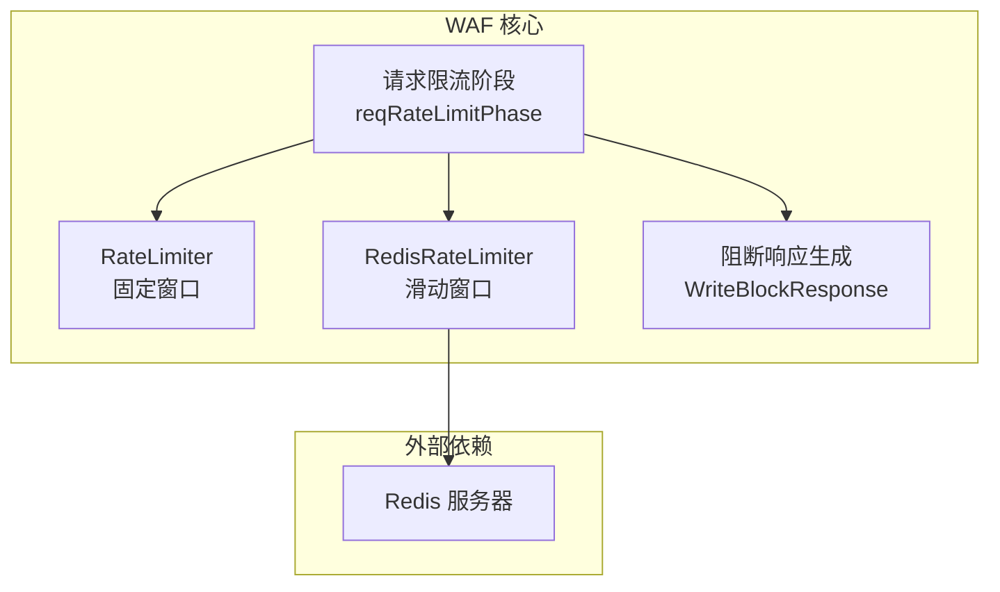
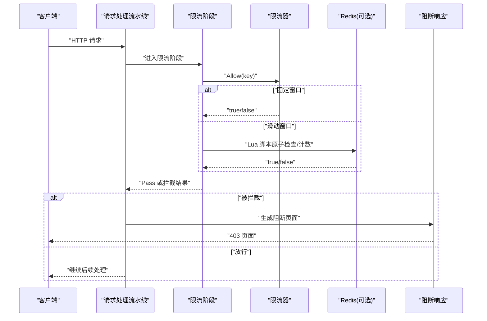
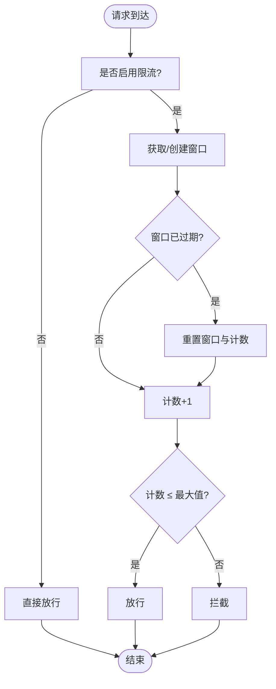
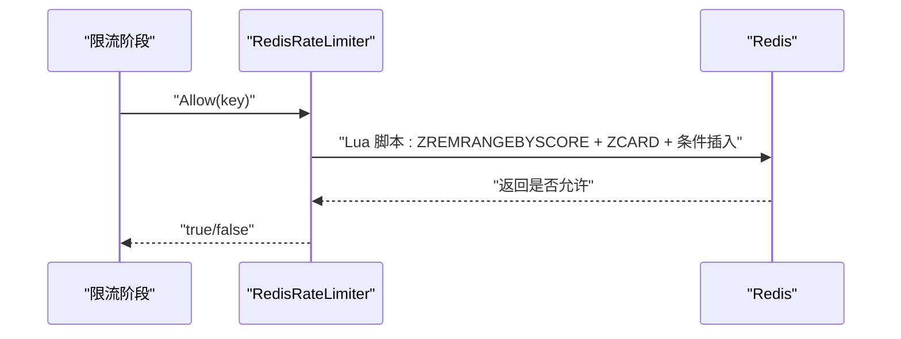
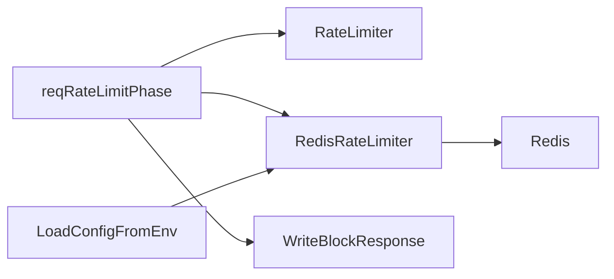

# 限流算法对比

<cite>
**本文引用的文件**
- [ratelimit.go](file://internal/waf/ratelimit.go)
- [ratelimit_redis.go](file://internal/waf/ratelimit_redis.go)
- [ratelimit_test.go](file://internal/waf/ratelimit_test.go)
- [phases.go](file://internal/core/rules/phases.go)
- [block.go](file://internal/waf/block.go)
- [config.go](file://internal/core/config.go)
- [go.mod](file://go.mod)
</cite>

## 目录
1. [简介](#简介)
2. [项目结构与定位](#项目结构与定位)
3. [核心组件](#核心组件)
4. [架构总览](#架构总览)
5. [详细组件分析](#详细组件分析)
6. [依赖关系分析](#依赖关系分析)
7. [性能与资源消耗](#性能与资源消耗)
8. [故障排查指南](#故障排查指南)
9. [结论与选型建议](#结论与选型建议)
10. [附录：部署与配置要点](#附录部署与配置要点)

## 简介
本文件围绕仓库中的限流实现进行系统化对比分析，重点覆盖以下算法与实现：
- 固定窗口（Fixed Window）：本地单机实现，基于时间窗口计数。
- 滑动窗口（Sliding Window）：基于 Redis 的分布式实现，使用有序集合与原子 Lua 脚本。
- 令牌桶与漏桶：在当前仓库中未直接实现，但可作为设计参考与选型依据。

通过对代码结构、数据流、错误处理与性能特征的深入分析，帮助读者理解各算法在工程实践中的差异，并给出可操作的选型建议与部署指引。

## 项目结构与定位
- 限流相关的核心代码位于 internal/waf 目录，包含本地固定窗口限流器与基于 Redis 的滑动窗口限流器。
- 限流在请求处理流水线中以独立阶段执行，通过 pipeline 阶段接入，满足按站点维度的细粒度控制。
- 前端界面支持对高频访问限制（固定窗口）进行开关与参数配置，体现与后端限流策略的联动。

图表来源
- [ratelimit.go:1-117](file://internal/waf/ratelimit.go#L1-L117)
- [ratelimit_redis.go:1-89](file://internal/waf/ratelimit_redis.go#L1-L89)
- [phases.go:96-128](file://internal/core/rules/phases.go#L96-L128)
- [block.go:16-39](file://internal/waf/block.go#L16-L39)

章节来源
- [ratelimit.go:1-117](file://internal/waf/ratelimit.go#L1-L117)
- [ratelimit_redis.go:1-89](file://internal/waf/ratelimit_redis.go#L1-L89)
- [phases.go:96-128](file://internal/core/rules/phases.go#L96-L128)
- [block.go:16-39](file://internal/waf/block.go#L16-L39)

## 核心组件
- RateLimiter（固定窗口）
  - 以 (客户端IP + Host) 组合作为键，维护每个键的时间窗口与计数。
  - 支持动态重配置窗口时长与最大请求数，以及启用/禁用。
  - 提供清理过期窗口的后台任务，避免内存无限增长。
- RedisRateLimiter（滑动窗口）
  - 使用 Redis 有序集合存储每次请求的时间戳，Lua 脚本原子地清理过期项并计数。
  - 支持分布式共享状态，适合多节点部署。
- 请求限流阶段（reqRateLimitPhase）
  - 将限流器接入请求处理流水线，在允许时放行，否则生成阻断动作。
- 阻断响应（WriteBlockResponse）
  - 当触发限流拦截时，返回统一的阻断页面或嵌入页面模板。

章节来源
- [ratelimit.go:9-92](file://internal/waf/ratelimit.go#L9-L92)
- [ratelimit_redis.go:12-85](file://internal/waf/ratelimit_redis.go#L12-L85)
- [phases.go:96-128](file://internal/core/rules/phases.go#L96-L128)
- [block.go:16-39](file://internal/waf/block.go#L16-L39)

## 架构总览
下图展示从请求进入、限流判断到可能的阻断响应的整体流程。

图表来源
- [phases.go:109-127](file://internal/core/rules/phases.go#L109-L127)
- [ratelimit.go:48-62](file://internal/waf/ratelimit.go#L48-L62)
- [ratelimit_redis.go:67-84](file://internal/waf/ratelimit_redis.go#L67-L84)
- [block.go:16-39](file://internal/waf/block.go#L16-L39)

## 详细组件分析

### 固定窗口（Fixed Window）实现与局限
- 实现要点
  - 键：客户端IP + Host，确保站点隔离。
  - 计数：每个键维护一个原子计数器；窗口到期后重置。
  - 动态配置：支持运行时调整窗口秒数与最大请求数。
  - 清理：后台定时器定期删除过期窗口，释放内存。
- 边界效应与突发处理
  - 边界效应：窗口切换瞬间可能出现瞬时超限，因为新窗口开始时计数从0起步。
  - 突发处理：固定窗口对突发流量的平滑能力有限，容易在窗口末尾与下一个窗口开头形成“双倍”峰值。
- 适用场景
  - 对突发不敏感、追求简单与低开销的场景。
  - 单机部署或对一致性要求不高的环境。

图表来源
- [ratelimit.go:48-92](file://internal/waf/ratelimit.go#L48-L92)

章节来源
- [ratelimit.go:9-92](file://internal/waf/ratelimit.go#L9-L92)
- [ratelimit_test.go:7-19](file://internal/waf/ratelimit_test.go#L7-L19)

### 滑动窗口（Sliding Window）实现与优势
- 实现要点
  - 键：前缀 + key，避免与其他模块冲突。
  - 计数：使用 Redis 有序集合记录请求时间戳，Lua 脚本原子清理过期项并计数。
  - 分布式：多节点共享状态，保证全局一致的速率控制。
  - 容错：Redis 调用失败时采用“宽松”策略（fail-open），优先保障可用性。
- 优势
  - 平滑流量：避免固定窗口的边界突变，更接近“平均速率”的效果。
  - 突发处理：在窗口内允许更灵活的突发，同时整体速率受控。
  - 分布式一致性：适合多实例部署，避免各自维护状态导致的不一致。
- 局限
  - 外部依赖：需要 Redis 连接与网络延迟。
  - 成本：相比本地实现，存在额外的网络与序列化成本。

图表来源
- [ratelimit_redis.go:49-84](file://internal/waf/ratelimit_redis.go#L49-L84)

章节来源
- [ratelimit_redis.go:12-85](file://internal/waf/ratelimit_redis.go#L12-L85)

### 令牌桶与漏桶（设计参考）
- 令牌桶（Token Bucket）
  - 特点：以固定速率向桶中添加令牌，请求消耗令牌；若无令牌则拒绝或排队。
  - 优势：对突发有良好容忍，输出相对平滑。
  - 适用：需要平滑输出与突发处理的场景。
- 漏桶（Leaky Bucket）
  - 特点：恒定速率出水，输入速率超过漏出速率时发生溢出。
  - 优势：严格控制输出速率，适合恒定带宽或下游处理能力受限的场景。
  - 适用：需要严格平滑输出的队列/缓冲场景。
- 当前仓库现状
  - 未提供令牌桶与漏桶的直接实现；可在现有 RateLimiter 与 RedisRateLimiter 基础上扩展，或引入第三方库。

[本节为概念性说明，不直接分析具体文件，故不附“章节来源”]

## 依赖关系分析
- 内部依赖
  - 请求限流阶段依赖 RateLimiter 与 RedisRateLimiter，二者均实现 Allow(key) 接口。
  - 阻断响应由 block.go 提供，当限流阶段返回拦截结果时调用。
- 外部依赖
  - Redis：用于滑动窗口的分布式状态存储。
  - Hertz：Web 框架，限流阶段在请求上下文中执行。
- 配置与环境
  - 通过环境变量加载配置，支持 Redis 地址、数据库驱动等关键参数。

图表来源
- [phases.go:96-128](file://internal/core/rules/phases.go#L96-L128)
- [ratelimit.go:1-117](file://internal/waf/ratelimit.go#L1-L117)
- [ratelimit_redis.go:1-89](file://internal/waf/ratelimit_redis.go#L1-L89)
- [block.go:16-39](file://internal/waf/block.go#L16-L39)
- [config.go:113-182](file://internal/core/config.go#L113-L182)

章节来源
- [go.mod:5-16](file://go.mod#L5-L16)
- [config.go:74-102](file://internal/core/config.go#L74-L102)

## 性能与资源消耗
- 固定窗口（本地）
  - CPU：轻量级，仅原子计数与时间比较。
  - 内存：按键维护窗口映射，后台清理周期性回收。
  - 可扩展性：单机，无跨节点同步开销。
- 滑动窗口（Redis）
  - CPU：Lua 脚本在 Redis 侧执行，减少往返次数。
  - 内存：有序集合存储时间戳，脚本会清理过期项。
  - 网络：存在 Redis 调用延迟与序列化成本。
  - 可扩展性：多节点共享状态，适合水平扩展。
- 测试与验证
  - 提供基础单元测试，验证允许/拒绝行为与禁用状态。

章节来源
- [ratelimit_test.go:7-43](file://internal/waf/ratelimit_test.go#L7-L43)
- [ratelimit.go:98-116](file://internal/waf/ratelimit.go#L98-L116)
- [ratelimit_redis.go:67-84](file://internal/waf/ratelimit_redis.go#L67-L84)

## 故障排查指南
- 常见问题
  - 限流未生效：确认限流阶段已启用且 Allow 返回 true。
  - 分布式节点不一致：检查 Redis 连接与键前缀是否一致。
  - Redis 调用失败：当前实现采用 fail-open，需关注可用性与降级策略。
- 排查步骤
  - 检查限流阶段执行路径与返回结果。
  - 查看 Redis 是否可达、Lua 脚本是否正常执行。
  - 观察阻断页面是否正确渲染，核对状态码与模板内容。
- 相关实现位置
  - 限流阶段：[phases.go:109-127](file://internal/core/rules/phases.go#L109-L127)
  - 阻断响应：[block.go:16-39](file://internal/waf/block.go#L16-L39)
  - Redis 允许逻辑：[ratelimit_redis.go:67-84](file://internal/waf/ratelimit_redis.go#L67-L84)

章节来源
- [phases.go:109-127](file://internal/core/rules/phases.go#L109-L127)
- [block.go:16-39](file://internal/waf/block.go#L16-L39)
- [ratelimit_redis.go:67-84](file://internal/waf/ratelimit_redis.go#L67-L84)

## 结论与选型建议
- 选择指南
  - 单机/低复杂度：优先固定窗口（RateLimiter），实现简单、资源占用低。
  - 分布式/高可用：优先滑动窗口（RedisRateLimiter），具备全局一致性与更好的突发处理能力。
  - 严格恒定输出：可考虑漏桶模型（当前未实现，可作为扩展方向）。
  - 需要平滑突发与平均速率控制：可考虑令牌桶模型（当前未实现，可作为扩展方向）。
- 部署建议
  - 固定窗口：无需外部依赖，适合边缘节点或轻量服务。
  - 滑动窗口：确保 Redis 高可用与低延迟，合理设置窗口与配额，避免误杀。
- 业务场景推荐
  - API 网关：滑动窗口，兼顾平滑与分布式一致性。
  - 静态资源：固定窗口，降低开销。
  - 下游限速：漏桶，严格控制输出速率。

[本节为总结性内容，不直接分析具体文件，故不附“章节来源”]

## 附录：部署与配置要点
- 环境变量与配置
  - 数据库与 Redis：通过环境变量加载，支持多种数据库驱动。
  - 限流参数：前端界面支持开启/关闭高频访问限制，并配置窗口与阈值。
- 关键配置项
  - Redis 地址、密码、DB：用于初始化 RedisRateLimiter。
  - 请求限流启用、窗口秒数、最大请求数：用于 RateLimiter 初始化与运行时调整。
- 相关实现位置
  - 配置加载：[config.go:113-182](file://internal/core/config.go#L113-L182)
  - 限流阶段接入：[phases.go:103-128](file://internal/core/rules/phases.go#L103-L128)
  - 前端配置入口：[page.tsx:227-261](file://frontend/app/(dashboard)/cc-protection/page.tsx#L227-L261)

章节来源
- [config.go:74-102](file://internal/core/config.go#L74-L102)
- [config.go:113-182](file://internal/core/config.go#L113-L182)
- [phases.go:103-128](file://internal/core/rules/phases.go#L103-L128)
- [frontend/app/(dashboard)/cc-protection/page.tsx:227-261](file://frontend/app/(dashboard)/cc-protection/page.tsx#L227-L261)