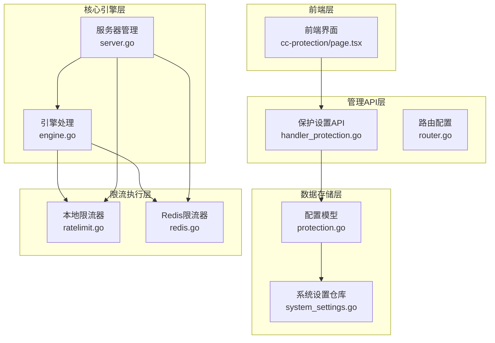
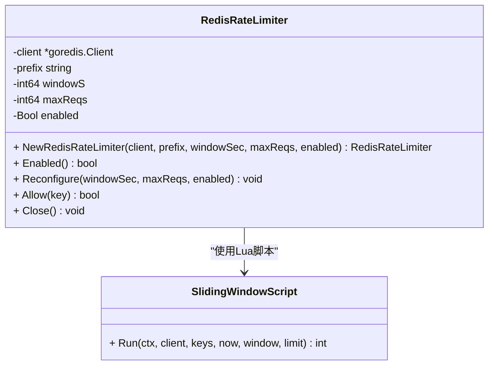
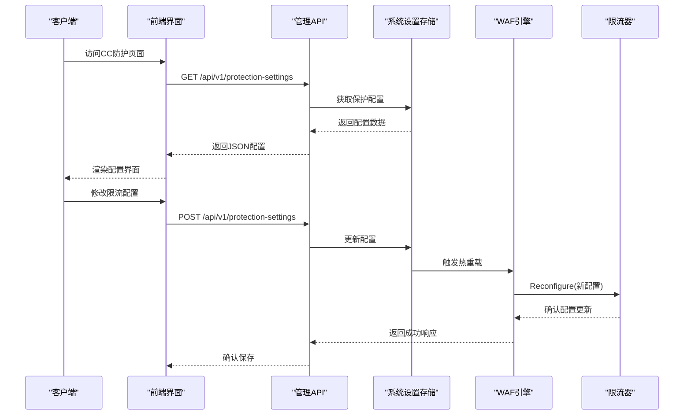
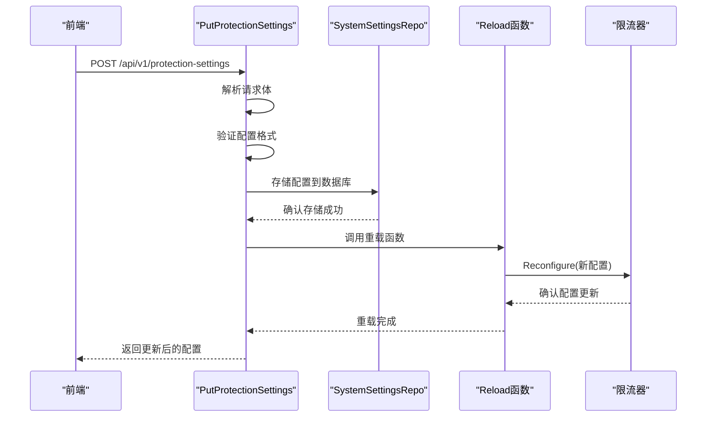
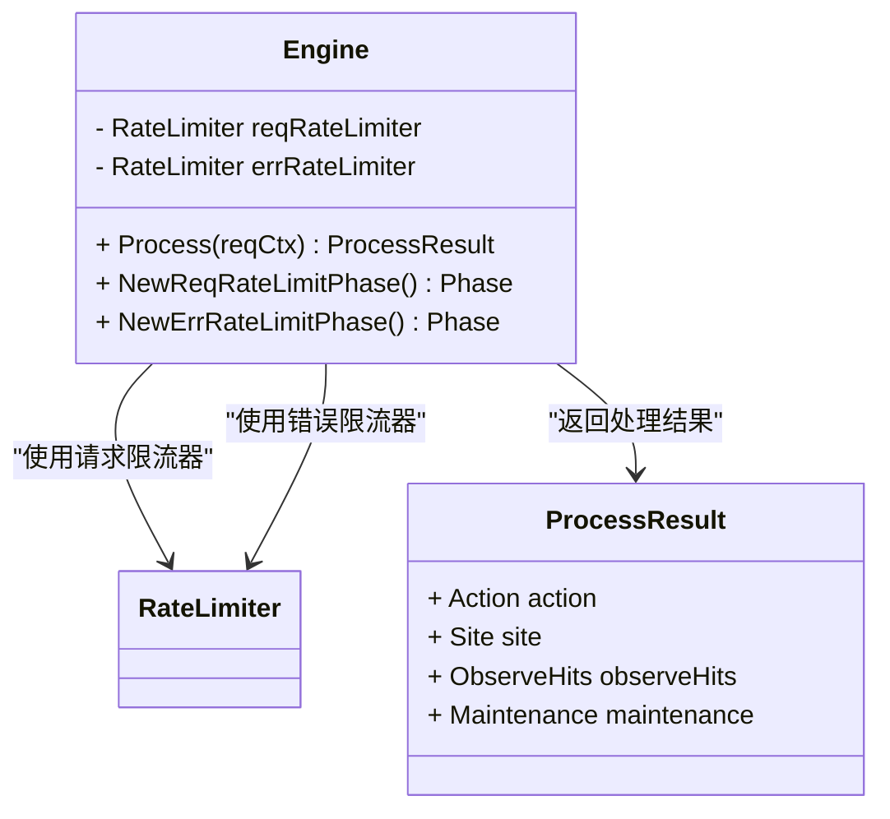
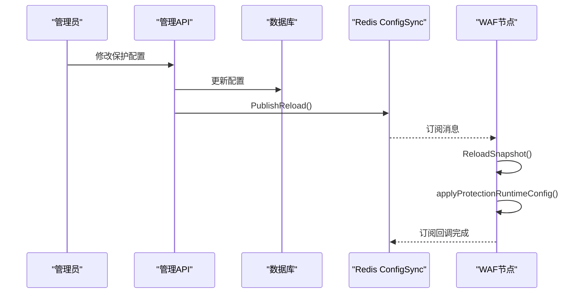
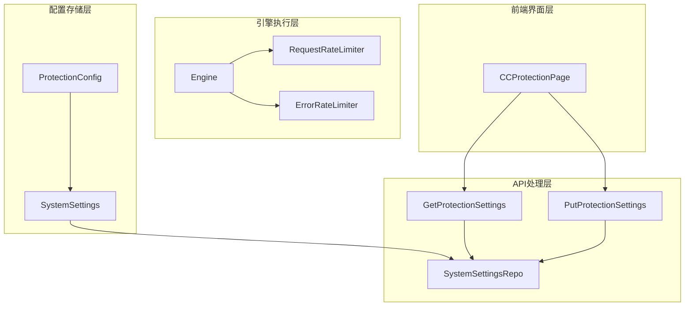
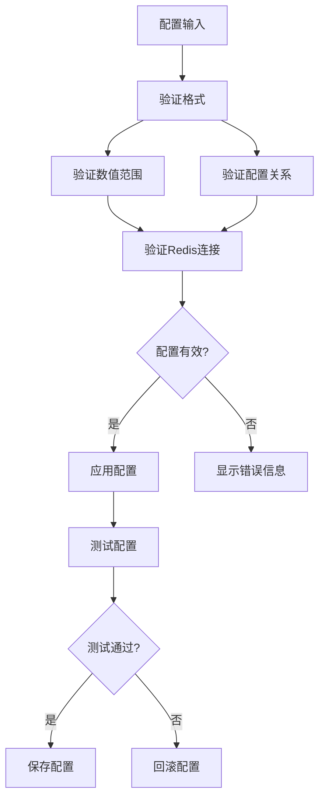

> [返回 安全防护功能](../安全防护功能.md)

# 限流配置管理

<cite>
**本文引用的文件**
- [ratelimit.go](file://internal/waf/ratelimit/ratelimit.go)
- [redis.go](file://internal/waf/ratelimit/redis.go)
- [protection.go](file://internal/store/protection.go)
- [engine.go](file://internal/core/engine/engine.go)
- [server.go](file://internal/app/server.go)
- [pubsub.go](file://internal/core/redis/pubsub.go)
- [page.tsx](file://frontend/app/(dashboard)/cc-protection/page.tsx)
- [api.ts](file://frontend/lib/api.ts)
- [system_settings.go](file://internal/store/repository/system_settings.go)
</cite>

## 目录
1. [简介](#简介)
2. [项目结构](#项目结构)
3. [核心组件](#核心组件)
4. [架构概览](#架构概览)
5. [详细组件分析](#详细组件分析)
6. [依赖关系分析](#依赖关系分析)
7. [性能考虑](#性能考虑)
8. [故障排除指南](#故障排除指南)
9. [结论](#结论)
10. [附录](#附录)

## 简介
本文件面向限流配置管理系统，聚焦于请求/错误速率限制的配置模型与运行机制。系统提供两类限流器：
- 本地限流器：基于内存的固定窗口算法，适用于单节点部署。
- Redis 分布式限流器：基于 Redis 的滑动窗口算法，支持多节点共享状态。

系统支持运行时热重载，通过 Redis Pub/Sub 实现跨节点配置同步；前端提供可视化配置界面，支持配置项的输入校验、实时预览与保存流程。

## 项目结构
My-OpenWaf 的限流配置管理采用分层架构，涉及前端界面、管理 API、核心引擎、数据存储与限流执行层：



**图表来源**
- [page.tsx](file://frontend/app/(dashboard)/cc-protection/page.tsx#L1-L847)
- [engine.go:1-308](file://internal/core/engine/engine.go#L1-L308)
- [server.go:1-655](file://internal/app/server.go#L1-L655)

**章节来源**
- [page.tsx](file://frontend/app/(dashboard)/cc-protection/page.tsx#L1-L847)
- [engine.go:1-308](file://internal/core/engine/engine.go#L1-L308)
- [server.go:1-655](file://internal/app/server.go#L1-L655)

## 核心组件

### 本地限流器（RateLimiter）
- 固定窗口算法，基于内存的窗口计数。
- 支持开关状态、窗口时长（秒）、最大请求数、动作类型等配置。
- 提供 Allow、Increment、IsOverLimit 等接口，支持动态 Reconfigure。

```mermaid
classDiagram
class RateLimiter {
- Mutex mu
- map~string,*window~ windows
- int64 windowS
- int64 maxReqs
- Bool enabled
- chan struct{} stopCh
+ NewRateLimiter(windowSec, maxReqs, enabled) RateLimiter
+ Enabled() bool
+ SetEnabled(v bool) void
+ Reconfigure(windowSec, maxReqs, enabled) void
+ Allow(key) bool
+ Increment(key) int64
+ IsOverLimit(key) bool
+ Close() void
-private cleaner() void
}
class Window {
- Int64 count
- int64 expiry
}
RateLimiter --> Window : "管理多个窗口"
```

**图表来源**
- [ratelimit.go:1-127](file://internal/waf/ratelimit/ratelimit.go#L1-L127)

**章节来源**
- [ratelimit.go:1-127](file://internal/waf/ratelimit/ratelimit.go#L1-L127)

### Redis 分布式限流器
- 滑动窗口算法，基于 Redis Sorted Set，Lua 脚本保证原子性。
- 支持跨节点共享状态，适合分布式部署。
- 提供 Allow、Increment、IsOverLimit 接口，Reconfigure 支持动态更新。



**图表来源**
- [redis.go:1-148](file://internal/waf/ratelimit/redis.go#L1-L148)

**章节来源**
- [redis.go:1-148](file://internal/waf/ratelimit/redis.go#L1-L148)

### 配置模型（ProtectionConfig）
- 请求频率限制：开关、窗口（秒）、最大请求数、动作类型。
- 错误频率限制：开关、窗口（秒）、最大错误数、是否统计 4xx/5xx/拦截、动作类型。
- 自动封禁：开关、阈值、窗口（秒）、持续时间、动作类型。
- 默认值来源于 DefaultProtectionConfig。

| 配置项 | 类型 | 默认值 | 描述 |
|--------|------|--------|------|
| request_ratelimit_enabled | bool | false | 请求频率限制开关 |
| request_ratelimit_window | int | 60 | 请求频率限制窗口大小(秒) |
| request_ratelimit_max | int | 300 | 请求频率限制最大请求数 |
| request_ratelimit_action | string | "rate_limit" | 请求频率超限时的动作 |
| error_ratelimit_enabled | bool | false | 错误频率限制开关 |
| error_ratelimit_window | int | 300 | 错误频率限制窗口大小(秒) |
| error_ratelimit_max | int | 30 | 错误频率限制最大错误数 |
| error_ratelimit_count_4xx | bool | true | 是否统计4xx错误 |
| error_ratelimit_count_5xx | bool | true | 是否统计5xx错误 |
| error_ratelimit_count_block | bool | true | 是否统计阻断错误 |
| error_ratelimit_action | string | "rate_limit" | 错误频率超限时的动作 |
| auto_ban_enabled | bool | false | 自动封禁开关 |
| auto_ban_threshold | int | 10 | 自动封禁阈值 |
| auto_ban_window | int | 60 | 自动封禁窗口大小(秒) |
| auto_ban_duration | int | 3600 | 自动封禁持续时间(秒) |

**章节来源**
- [protection.go:1-287](file://internal/store/protection.go#L1-L287)

## 架构概览
系统通过前端界面发起配置变更，后端持久化并触发热重载，Redis Pub/Sub 将变更广播至各节点，节点在订阅回调中动态更新限流器参数。



**图表来源**
- [page.tsx](file://frontend/app/(dashboard)/cc-protection/page.tsx#L96-L132)
- [api.ts:796-805](file://frontend/lib/api.ts#L796-L805)
- [server.go:313-350](file://internal/app/server.go#L313-L350)

**章节来源**
- [page.tsx](file://frontend/app/(dashboard)/cc-protection/page.tsx#L1-L847)
- [api.ts:796-805](file://frontend/lib/api.ts#L796-L805)
- [server.go:313-350](file://internal/app/server.go#L313-L350)

## 详细组件分析

### 前端配置界面
- 加载当前配置并渲染界面，支持高频访问、高频攻击、高频错误三类内置规则的开关与参数编辑。
- 保存流程：本地更新 -> 调用后端接口 -> 成功后刷新界面状态。


**图表来源**
- [page.tsx](file://frontend/app/(dashboard)/cc-protection/page.tsx#L155-L188)

**章节来源**
- [page.tsx](file://frontend/app/(dashboard)/cc-protection/page.tsx#L1-L847)

### 后端配置处理
- 后端通过专门的处理器处理配置更新，解析请求体、验证配置格式、存储到数据库，并调用重载函数。
- 重载函数从最新快照读取保护配置，调用 applyProtectionRuntimeConfig 应用到限流器与相关组件。



**图表来源**
- [api.ts:800-805](file://frontend/lib/api.ts#L800-L805)
- [system_settings.go:15-34](file://internal/store/repository/system_settings.go#L15-L34)
- [server.go:313-350](file://internal/app/server.go#L313-L350)

**章节来源**
- [api.ts:796-805](file://frontend/lib/api.ts#L796-L805)
- [system_settings.go:1-44](file://internal/store/repository/system_settings.go#L1-L44)
- [server.go:313-350](file://internal/app/server.go#L313-L350)

### 引擎集成
- WAF 引擎在构建阶段根据 ProtectionConfig 决定是否启用请求/错误限流阶段。
- 引擎持有 RateLimiterBackend 接口实例，允许本地或 Redis 限流器注入。



**图表来源**
- [engine.go:15-129](file://internal/core/engine/engine.go#L15-L129)

**章节来源**
- [engine.go:1-308](file://internal/core/engine/engine.go#L1-L308)

### 热重载机制
- 应用启动时从快照加载 ProtectionConfig，创建本地或 Redis 限流器实例。
- 参数验证：通过 applyProtectionRuntimeConfig 对限流器与相关组件进行 Reconfigure。
- Redis Pub/Sub：发布/订阅模式实现跨节点配置同步，节点在订阅回调中重新加载快照并应用配置。



**图表来源**
- [server.go:313-350](file://internal/app/server.go#L313-L350)
- [pubsub.go:1-77](file://internal/core/redis/pubsub.go#L1-L77)

**章节来源**
- [server.go:126-235](file://internal/app/server.go#L126-L235)
- [pubsub.go:1-77](file://internal/core/redis/pubsub.go#L1-L77)

## 依赖关系分析
限流配置管理的关键依赖关系如下：



**图表来源**
- [protection.go:1-287](file://internal/store/protection.go#L1-L287)
- [system_settings.go:1-44](file://internal/store/repository/system_settings.go#L1-L44)
- [engine.go:16-37](file://internal/core/engine/engine.go#L16-L37)

**章节来源**
- [protection.go:1-287](file://internal/store/protection.go#L1-L287)
- [system_settings.go:1-44](file://internal/store/repository/system_settings.go#L1-L44)
- [engine.go:1-308](file://internal/core/engine/engine.go#L1-L308)

## 性能考虑
- 本地限流器
  - 内存效率：每个限流键占用约 16 字节内存（窗口结构）。
  - 原子操作：使用原子计数器避免锁竞争。
  - 垃圾回收：定期清理过期窗口，防止内存泄漏。
  - 并发安全：使用互斥锁保护共享状态。
- Redis 限流器
  - 原子性保证：Lua 脚本确保计数操作的原子性。
  - 网络开销：每次请求需要一次 Redis 通信。
  - 扩展性：支持多节点共享状态。
  - 容错性：Redis 故障时采用"fail-open"策略。

最佳实践建议
- 窗口大小选择：短期突发（10-60 秒），平均流量（60-300 秒），长期趋势（300-1800 秒）。
- 配额设置：正常用户（峰值的 10-50 倍），异常检测（峰值的 5-10 倍），攻击防护（峰值的 2-5 倍）。
- 动作策略：人机验证（适用于误判风险较高场景），直接阻断（适用于明确的恶意行为），观察模式（用于监控和调试）。

**章节来源**
- [ratelimit.go:333-347](file://internal/waf/ratelimit/ratelimit.go#L333-L347)
- [redis.go:342-347](file://internal/waf/ratelimit/redis.go#L342-L347)

## 故障排除指南
常见问题及解决方案
- 配置不生效：检查 API 响应状态，确认配置存储成功。
- Redis 连接失败：检查 Redis 连接配置和网络连通性。
- 内存泄漏：检查 cleaner goroutine 是否正常运行。
- 性能下降：调整窗口大小和配额参数。

配置验证机制


**章节来源**
- [server.go:313-350](file://internal/app/server.go#L313-L350)

## 结论
My-OpenWaf 的限流配置管理系统提供了完整、灵活且高性能的流量控制解决方案。通过本地和分布式两种限流器模式，系统能够适应从单节点到多节点部署的各种场景需求。关键优势包括：多维度支持、动态更新、高可用性、易用性。建议在生产环境中根据实际业务场景合理配置窗口大小和配额参数，并建立完善的监控和告警机制。

## 附录
配置模板示例
- 基础防护配置
- 高级防护配置

最佳实践清单
- 初始配置：从保守配置开始，逐步调整到合适水平。
- 监控指标：建立 QPS、错误率、阻断率等关键指标监控。
- 灰度发布：新配置先在小范围内测试。
- 回滚机制：确保配置变更可以快速回滚。
- 文档记录：详细记录每次配置变更的原因和效果。

**章节来源**
- [protection.go:75-102](file://internal/store/protection.go#L75-L102)
