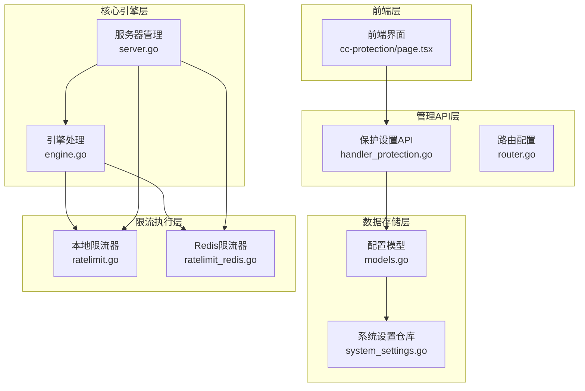
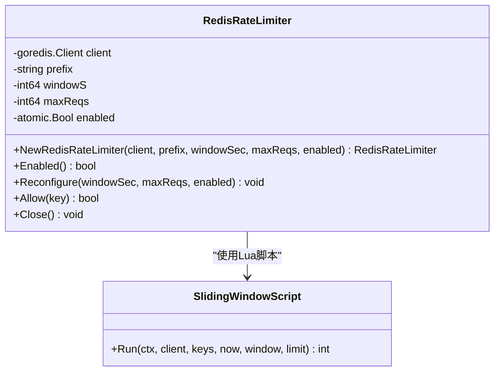
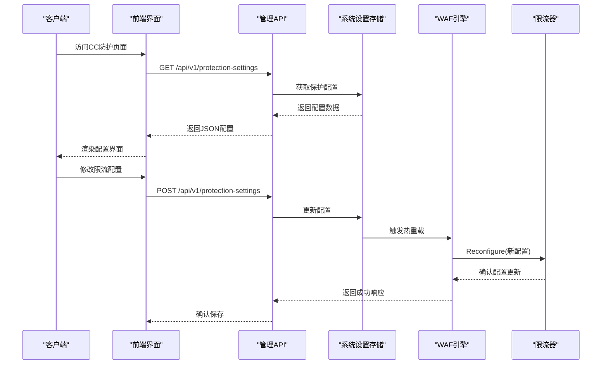
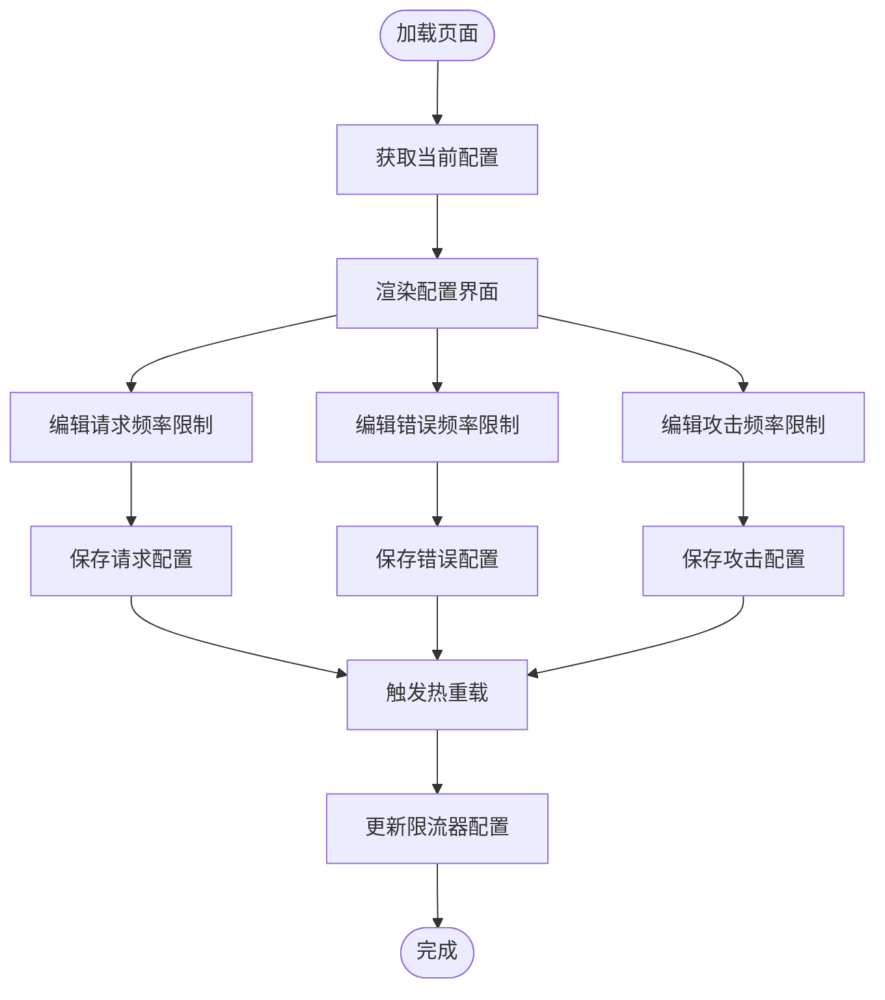
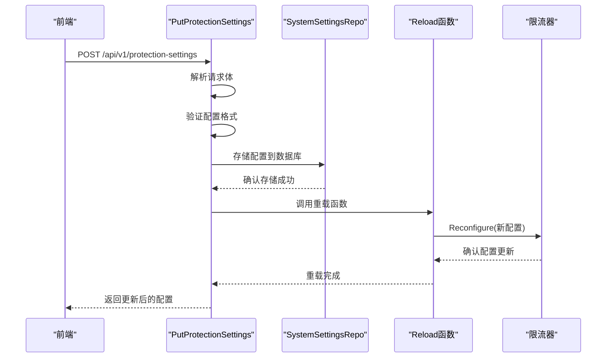
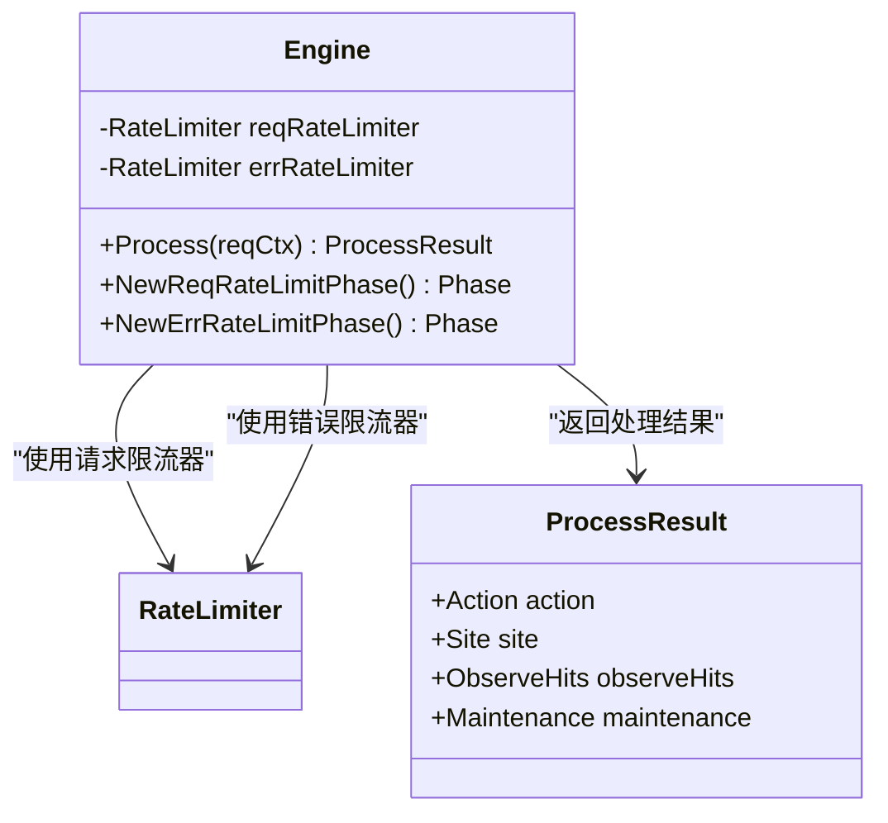
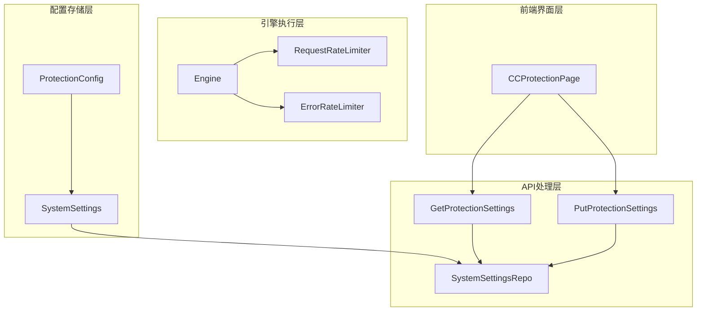
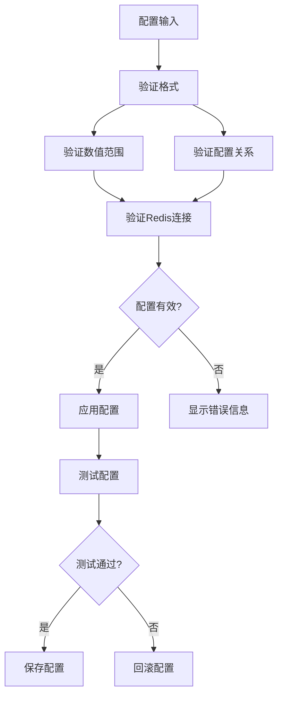

# 限流配置管理

<cite>
**本文档引用的文件**
- [ratelimit.go](file://internal/waf/ratelimit.go)
- [ratelimit_redis.go](file://internal/waf/ratelimit_redis.go)
- [ratelimit_test.go](file://internal/waf/ratelimit_test.go)
- [models.go](file://internal/store/models.go)
- [handler_protection.go](file://internal/admin/handler_protection.go)
- [router.go](file://internal/admin/router.go)
- [page.tsx](file://frontend/app/(dashboard)/cc-protection/page.tsx)
- [engine.go](file://internal/core/engine/engine.go)
- [server.go](file://internal/app/server.go)
- [runtime.go](file://internal/core/runtime.go)
- [system_settings.go](file://internal/store/repository/system_settings.go)
</cite>

## 目录
1. [简介](#简介)
2. [项目结构](#项目结构)
3. [核心组件](#核心组件)
4. [架构概览](#架构概览)
5. [详细组件分析](#详细组件分析)
6. [依赖关系分析](#依赖关系分析)
7. [性能考虑](#性能考虑)
8. [故障排除指南](#故障排除指南)
9. [结论](#结论)
10. [附录](#附录)

## 简介

限流配置管理是 My-OpenWaf 的核心安全功能之一，负责控制网络流量以防止滥用和攻击。该系统提供了多维度的限流能力，包括：

- **固定窗口限流器**：基于内存的本地限流器
- **滑动窗口限流器**：基于 Redis 的分布式限流器
- **多维度限流**：支持 IP 级别、用户级别和 API 级别的差异化配置
- **动态配置更新**：支持运行时重新配置和热重载
- **灵活的计数策略**：支持请求频率和错误频率的独立控制

## 项目结构

My-OpenWaf 的限流配置管理采用分层架构设计，主要分布在以下模块中：



**图表来源**
- [page.tsx](file://frontend/app/(dashboard)/cc-protection/page.tsx#L1-L557)
- [handler_protection.go:1-107](file://internal/admin/handler_protection.go#L1-L107)
- [engine.go:1-176](file://internal/core/engine/engine.go#L1-L176)
- [server.go:220-260](file://internal/app/server.go#L220-L260)

**章节来源**
- [page.tsx](file://frontend/app/(dashboard)/cc-protection/page.tsx#L1-L557)
- [handler_protection.go:1-107](file://internal/admin/handler_protection.go#L1-L107)
- [models.go:245-318](file://internal/store/models.go#L245-L318)

## 核心组件

### 本地限流器 (RateLimiter)

本地限流器实现了固定窗口算法，适用于单节点部署场景：

```mermaid
classDiagram
class RateLimiter {
-sync.Mutex mu
-map~string,*window~ windows
-int64 windowS
-int64 maxReqs
-atomic.Bool enabled
-chan struct{} stopCh
+NewRateLimiter(windowSec, maxReqs, enabled) RateLimiter
+Enabled() bool
+SetEnabled(v bool) void
+Reconfigure(windowSec, maxReqs, enabled) void
+Allow(key) bool
+Increment(key) int64
+IsOverLimit(key) bool
+Close() void
-cleaner() void
}
class Window {
-atomic.Int64 count
-int64 expiry
}
RateLimiter --> Window : "管理多个窗口"
```

**图表来源**
- [ratelimit.go:9-116](file://internal/waf/ratelimit.go#L9-L116)

### Redis 分布式限流器

Redis 限流器实现了滑动窗口算法，支持多节点分布式部署：



**图表来源**
- [ratelimit_redis.go:12-89](file://internal/waf/ratelimit_redis.go#L12-L89)

### 配置模型

ProtectionConfig 定义了完整的限流配置结构：

| 配置项 | 类型 | 默认值 | 描述 |
|--------|------|--------|------|
| request_ratelimit_enabled | bool | false | 请求频率限制开关 |
| request_ratelimit_window | int | 60 | 请求频率限制窗口大小(秒) |
| request_ratelimit_max | int | 300 | 请求频率限制最大请求数 |
| request_ratelimit_action | string | "intercept" | 请求频率超限时的动作 |
| error_ratelimit_enabled | bool | false | 错误频率限制开关 |
| error_ratelimit_window | int | 300 | 错误频率限制窗口大小(秒) |
| error_ratelimit_max | int | 30 | 错误频率限制最大错误数 |
| error_ratelimit_action | string | "intercept" | 错误频率超限时的动作 |
| error_ratelimit_count_4xx | bool | true | 是否统计4xx错误 |
| error_ratelimit_count_5xx | bool | true | 是否统计5xx错误 |
| error_ratelimit_count_block | bool | true | 是否统计阻断错误 |
| auto_ban_enabled | bool | false | 自动封禁开关 |
| auto_ban_threshold | int | 10 | 自动封禁阈值 |
| auto_ban_window | int | 60 | 自动封禁窗口大小(秒) |
| auto_ban_duration | int | 3600 | 自动封禁持续时间(秒) |

**章节来源**
- [models.go:247-318](file://internal/store/models.go#L247-L318)

## 架构概览

My-OpenWaf 的限流配置管理采用三层架构设计：



**图表来源**
- [page.tsx](file://frontend/app/(dashboard)/cc-protection/page.tsx#L96-L132)
- [handler_protection.go:60-106](file://internal/admin/handler_protection.go#L60-L106)
- [server.go:220-242](file://internal/app/server.go#L220-L242)

## 详细组件分析

### 前端配置界面

前端 CC 防护页面提供了直观的限流配置界面：



**图表来源**
- [page.tsx](file://frontend/app/(dashboard)/cc-protection/page.tsx#L155-L188)

### 后端配置处理

后端通过专门的处理器处理配置更新：



**图表来源**
- [handler_protection.go:60-106](file://internal/admin/handler_protection.go#L60-L106)

### 引擎集成

WAF 引擎在处理请求时集成限流功能：



**图表来源**
- [engine.go:15-129](file://internal/core/engine/engine.go#L15-L129)

**章节来源**
- [page.tsx](file://frontend/app/(dashboard)/cc-protection/page.tsx#L1-L557)
- [handler_protection.go:1-107](file://internal/admin/handler_protection.go#L1-L107)
- [engine.go:1-176](file://internal/core/engine/engine.go#L1-L176)

## 依赖关系分析

限流配置管理系统的关键依赖关系如下：



**图表来源**
- [models.go:245-318](file://internal/store/models.go#L245-L318)
- [handler_protection.go:21-106](file://internal/admin/handler_protection.go#L21-L106)
- [engine.go:16-37](file://internal/core/engine/engine.go#L16-L37)

**章节来源**
- [models.go:1-456](file://internal/store/models.go#L1-L456)
- [handler_protection.go:1-107](file://internal/admin/handler_protection.go#L1-L107)
- [engine.go:1-176](file://internal/core/engine/engine.go#L1-L176)

## 性能考虑

### 本地限流器性能特性

- **内存效率**：每个限流键占用约 16 字节内存（窗口结构）
- **原子操作**：使用原子计数器避免锁竞争
- **垃圾回收**：定期清理过期窗口，防止内存泄漏
- **并发安全**：使用互斥锁保护共享状态

### Redis 限流器性能特性

- **原子性保证**：Lua 脚本确保计数操作的原子性
- **网络开销**：每次请求需要一次 Redis 通信
- **扩展性**：支持多节点共享状态
- **容错性**：Redis 故障时采用"fail-open"策略

### 最佳实践建议

1. **窗口大小选择**：
   - 短期突发：窗口 10-60 秒
   - 平均流量：窗口 60-300 秒
   - 长期趋势：窗口 300-1800 秒

2. **配额设置**：
   - 正常用户：峰值的 10-50 倍
   - 异常检测：峰值的 5-10 倍
   - 攻击防护：峰值的 2-5 倍

3. **动作策略**：
   - 人机验证：适用于误判风险较高的场景
   - 直接阻断：适用于明确的恶意行为
   - 观察模式：用于监控和调试

## 故障排除指南

### 常见问题及解决方案

| 问题类型 | 症状 | 可能原因 | 解决方案 |
|----------|------|----------|----------|
| 配置不生效 | 限流规则未按预期工作 | 配置未正确保存或热重载失败 | 检查 API 响应状态，确认配置存储成功 |
| Redis 连接失败 | 限流器无法正常工作 | Redis 服务不可用 | 检查 Redis 连接配置和网络连通性 |
| 内存泄漏 | 系统内存持续增长 | 窗口清理机制失效 | 检查 cleaner goroutine 是否正常运行 |
| 性能下降 | 请求延迟增加 | 配置过于严格或窗口过小 | 调整窗口大小和配额参数 |

### 配置验证机制

系统提供了多层次的配置验证：



**章节来源**
- [ratelimit_test.go:1-43](file://internal/waf/ratelimit_test.go#L1-L43)
- [server.go:220-260](file://internal/app/server.go#L220-L260)

## 结论

My-OpenWaf 的限流配置管理系统提供了完整、灵活且高性能的流量控制解决方案。通过本地和分布式两种限流器模式，系统能够适应从单节点到多节点部署的各种场景需求。

关键优势包括：
- **多维度支持**：支持 IP、用户、API 多个维度的差异化配置
- **动态更新**：支持运行时配置更新和热重载
- **高可用性**：Redis 分布式模式提供跨节点状态共享
- **易用性**：直观的前端配置界面和完善的错误处理机制

建议在生产环境中根据实际业务场景合理配置窗口大小和配额参数，并建立完善的监控和告警机制。

## 附录

### 配置模板示例

#### 基础防护配置
```json
{
  "request_ratelimit_enabled": true,
  "request_ratelimit_window": 60,
  "request_ratelimit_max": 100,
  "request_ratelimit_action": "intercept",
  "error_ratelimit_enabled": true,
  "error_ratelimit_window": 300,
  "error_ratelimit_max": 10,
  "error_ratelimit_action": "intercept"
}
```

#### 高级防护配置
```json
{
  "request_ratelimit_enabled": true,
  "request_ratelimit_window": 60,
  "request_ratelimit_max": 300,
  "request_ratelimit_action": "captcha",
  "error_ratelimit_enabled": true,
  "error_ratelimit_window": 60,
  "error_ratelimit_max": 5,
  "error_ratelimit_action": "block",
  "auto_ban_enabled": true,
  "auto_ban_threshold": 10,
  "auto_ban_window": 60,
  "auto_ban_duration": 3600
}
```

### 最佳实践清单

1. **初始配置**：从保守配置开始，逐步调整到合适水平
2. **监控指标**：建立 QPS、错误率、阻断率等关键指标监控
3. **灰度发布**：新配置先在小范围内测试
4. **回滚机制**：确保配置变更可以快速回滚
5. **文档记录**：详细记录每次配置变更的原因和效果