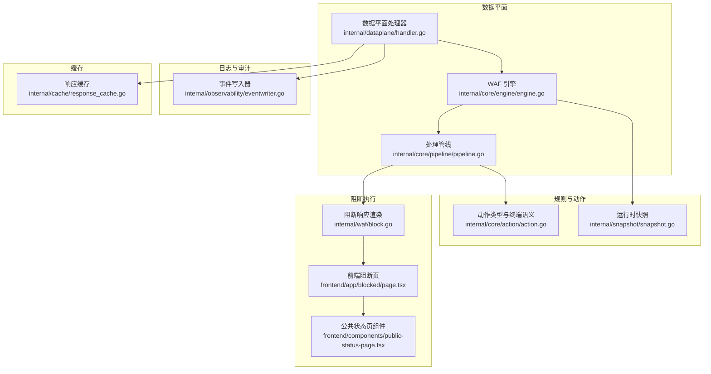
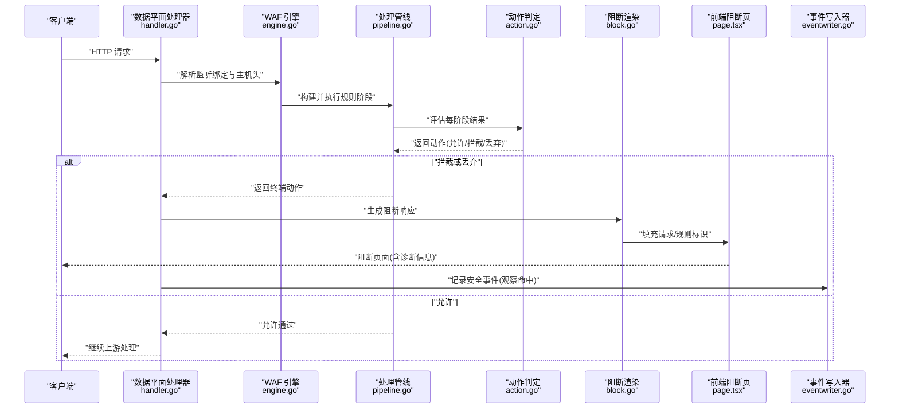
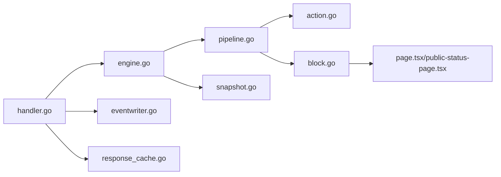

# 阻断机制

<cite>
**本文引用的文件**
- [block.go](file://internal/waf/block.go)
- [action.go](file://internal/core/action/action.go)
- [engine.go](file://internal/core/engine/engine.go)
- [pipeline.go](file://internal/core/pipeline/pipeline.go)
- [snapshot.go](file://internal/snapshot/snapshot.go)
- [handler.go](file://internal/dataplane/handler.go)
- [eventwriter.go](file://internal/observability/eventwriter.go)
- [response_cache.go](file://internal/cache/response_cache.go)
- [ratelimit.go](file://internal/waf/ratelimit.go)
- [iprep.go](file://internal/waf/iprep.go)
- [page.tsx](file://frontend/app/blocked/page.tsx)
- [public-status-page.tsx](file://frontend/components/public-status-page.tsx)
- [ratelimit_test.go](file://internal/waf/ratelimit_test.go)
- [iprep_test.go](file://internal/waf/iprep_test.go)
- [drop.go](file://internal/waf/drop.go)
</cite>

## 目录
1. [简介](#简介)
2. [项目结构](#项目结构)
3. [核心组件](#核心组件)
4. [架构总览](#架构总览)
5. [详细组件分析](#详细组件分析)
6. [依赖分析](#依赖分析)
7. [性能考虑](#性能考虑)
8. [故障排除指南](#故障排除指南)
9. [结论](#结论)
10. [附录](#附录)

## 简介
本文件系统性阐述 My-OpenWaf 的阻断机制，覆盖阻断决策的触发条件与执行流程、阻断类型与响应头设置、错误页面定制、阻断策略配置（持续时间、重定向、自定义消息）、阻断日志与审计、阻断与缓存系统的交互、阻断测试与验证方法以及性能影响与优化策略。目标是帮助运维与开发人员全面理解并正确配置与使用阻断能力。

## 项目结构
阻断机制由“决策引擎 + 执行管线 + 响应渲染 + 日志审计 + 缓存隔离”构成，前后端共同提供可定制的阻断页面与诊断信息。

图示来源
- [handler.go:105-169](file://internal/dataplane/handler.go#L105-L169)
- [engine.go:57-129](file://internal/core/engine/engine.go#L57-L129)
- [pipeline.go:46-70](file://internal/core/pipeline/pipeline.go#L46-L70)
- [action.go:29-61](file://internal/core/action/action.go#L29-L61)
- [snapshot.go:52-64](file://internal/snapshot/snapshot.go#L52-L64)
- [block.go:16-39](file://internal/waf/block.go#L16-L39)
- [page.tsx:7-21](file://frontend/app/blocked/page.tsx#L7-L21)
- [public-status-page.tsx:51-133](file://frontend/components/public-status-page.tsx#L51-L133)
- [eventwriter.go:12-39](file://internal/observability/eventwriter.go#L12-L39)
- [response_cache.go:25-54](file://internal/cache/response_cache.go#L25-L54)

章节来源
- [handler.go:105-169](file://internal/dataplane/handler.go#L105-L169)
- [engine.go:57-129](file://internal/core/engine/engine.go#L57-L129)
- [pipeline.go:46-70](file://internal/core/pipeline/pipeline.go#L46-L70)
- [block.go:16-39](file://internal/waf/block.go#L16-L39)
- [page.tsx:7-21](file://frontend/app/blocked/page.tsx#L7-L21)
- [public-status-page.tsx:51-133](file://frontend/components/public-status-page.tsx#L51-L133)
- [eventwriter.go:12-39](file://internal/observability/eventwriter.go#L12-L39)
- [response_cache.go:25-54](file://internal/cache/response_cache.go#L25-L54)

## 核心组件
- 决策与动作
  - 动作类型与终端语义：定义允许、拦截、观察、丢弃等动作及是否短路、是否记录日志等判定逻辑。
  - 终止条件：拦截与丢弃为终端动作，会短路后续阶段与上游请求。
- 处理引擎与管线
  - 引擎按顺序组装多阶段规则（IP信誉、ACL、机器人检测、速率限制、OWASP/CVE签名、自定义规则）。
  - 管线逐阶段执行，遇到终端结果立即返回。
- 阻断响应渲染
  - 支持站点级/全局级自定义 HTML 拦截页与状态码；若无模板则回退到内置嵌入页面。
  - 设置标准化响应头（如请求 ID、WAF 动作类型），便于审计与追踪。
- 日志与审计
  - 观察命中事件异步批量写入数据库，不阻塞热路径。
  - 访问日志与安全事件日志统一记录请求 ID、规则 ID、匹配描述、分类等。
- 缓存隔离
  - 阻断请求不进入上游，避免污染响应缓存；响应缓存仅针对安全 GET 请求进行缓存。

章节来源
- [action.go:29-61](file://internal/core/action/action.go#L29-L61)
- [engine.go:57-129](file://internal/core/engine/engine.go#L57-L129)
- [pipeline.go:46-70](file://internal/core/pipeline/pipeline.go#L46-L70)
- [block.go:16-39](file://internal/waf/block.go#L16-L39)
- [eventwriter.go:12-39](file://internal/observability/eventwriter.go#L12-L39)
- [response_cache.go:25-54](file://internal/cache/response_cache.go#L25-L54)

## 架构总览
下图展示一次请求从进入数据平面到阻断响应的关键交互：

图示来源
- [handler.go:105-169](file://internal/dataplane/handler.go#L105-L169)
- [engine.go:57-129](file://internal/core/engine/engine.go#L57-L129)
- [pipeline.go:46-70](file://internal/core/pipeline/pipeline.go#L46-L70)
- [action.go:29-61](file://internal/core/action/action.go#L29-L61)
- [block.go:16-39](file://internal/waf/block.go#L16-L39)
- [page.tsx:7-21](file://frontend/app/blocked/page.tsx#L7-L21)
- [eventwriter.go:12-39](file://internal/observability/eventwriter.go#L12-L39)

## 详细组件分析

### 阻断类型与触发条件
- 动作类型
  - 允许：放行请求。
  - 拦截：终端动作，阻断并返回阻断页。
  - 观察：非终端动作，仅记录日志，不影响放行。
  - 丢弃：最高优先级终端动作，直接关闭 TCP 连接，不发送任何响应。
- 触发条件
  - 引擎按序执行各阶段规则，任一阶段匹配且动作为拦截或丢弃即短路。
  - 机器人检测在高风险情况下可直接触发丢弃。
  - IP 信誉白名单可短路放行，黑名单可直接触发拦截。
  - 速率限制超过阈值可触发拦截或丢弃（取决于配置）。

章节来源
- [action.go:29-61](file://internal/core/action/action.go#L29-L61)
- [engine.go:87-120](file://internal/core/engine/engine.go#L87-L120)
- [pipeline.go:46-70](file://internal/core/pipeline/pipeline.go#L46-L70)
- [eval.go:68-79](file://internal/waf/eval.go#L68-L79)

### 响应头设置与错误页面定制
- 响应头
  - X-Request-ID：携带请求唯一标识，便于日志检索与审计。
  - X-WAF-Action：标准化动作类型（拦截/丢弃等），兼容历史别名。
- 错误页面
  - 站点级优先：若站点配置了自定义拦截 HTML 与状态码，则优先使用。
  - 全局回退：若站点未配置，则使用全局默认拦截 HTML 与状态码。
  - 模板渲染：支持 Go 模板语法，注入请求 ID、规则 ID 等变量。
  - 内置回退：若模板解析失败或资源缺失，回退到内置 HTML 片段。
- 前端阻断页
  - 提供统一的“公共状态页组件”，展示 HTTP 状态码、阻断原因、诊断信息等。
  - 页面内嵌请求 ID 与规则 ID 占位符，由后端替换。

章节来源
- [block.go:16-39](file://internal/waf/block.go#L16-L39)
- [block.go:68-94](file://internal/waf/block.go#L68-L94)
- [page.tsx:7-21](file://frontend/app/blocked/page.tsx#L7-L21)
- [public-status-page.tsx:51-133](file://frontend/components/public-status-page.tsx#L51-L133)

### 阻断策略配置选项
- 阻断持续时间
  - IP 黑名单/自动封禁：基于配置的封禁窗口与持续时间生效，到期自动清理。
  - 速率限制：固定窗口计数，窗口过期后重置。
- 重定向设置
  - 当前阻断页面主要通过返回 HTML 页面实现，未见内置重定向逻辑；可通过自定义拦截 HTML 或全局维护页面实现跳转。
- 自定义消息
  - 支持站点级/全局级自定义拦截 HTML，可在模板中插入请求 ID、规则 ID 等上下文信息。
  - 前端公共状态页组件提供统一的排障提示与诊断信息展示。

章节来源
- [iprep.go:68-79](file://internal/waf/iprep.go#L68-L79)
- [iprep.go:126-155](file://internal/waf/iprep.go#L126-L155)
- [ratelimit.go:24-46](file://internal/waf/ratelimit.go#L24-L46)
- [block.go:24-31](file://internal/waf/block.go#L24-L31)
- [public-status-page.tsx:102-106](file://frontend/components/public-status-page.tsx#L102-L106)

### 阻断日志记录与审计
- 观察命中日志
  - 管线收集所有观察命中，异步批量写入数据库，避免阻塞热路径。
  - 记录字段包括请求 ID、客户端 IP、主机、路径、方法、UA、规则 ID、相位、动作、分类、匹配描述等。
- 访问日志
  - 阻断发生时记录访问日志，包含请求 ID、动作类型、匹配描述等。
- 审计与检索
  - 请求 ID 是跨日志检索的关键字段，可用于关联全局访问日志与安全事件日志。

章节来源
- [eventwriter.go:12-39](file://internal/observability/eventwriter.go#L12-L39)
- [eventwriter.go:95-104](file://internal/observability/eventwriter.go#L95-L104)
- [handler.go:109-143](file://internal/dataplane/handler.go#L109-L143)
- [handler.go:145-157](file://internal/dataplane/handler.go#L145-L157)

### 阻断机制与缓存系统的交互
- 缓存隔离原则
  - 阻断请求不进入上游，因此不会污染响应缓存。
  - 响应缓存仅对安全的 GET 请求进行缓存，命中后直接返回缓存内容。
- 缓存键与过期
  - 缓存键由方法、主机、路径、查询串确定，过期时间基于 TTL 判断。
  - 缓存启停、默认 TTL、统计与清理均内置管理。
- 避免缓存污染
  - 阻断场景不写入缓存；缓存仅对允许的 GET 响应生效。

章节来源
- [response_cache.go:25-54](file://internal/cache/response_cache.go#L25-L54)
- [response_cache.go:78-91](file://internal/cache/response_cache.go#L78-L91)
- [response_cache.go:93-122](file://internal/cache/response_cache.go#L93-L122)
- [handler.go:145-157](file://internal/dataplane/handler.go#L145-L157)

### 阻断测试与验证方法
- 单元测试
  - 速率限制：验证启用/禁用、重新配置后的允许/拒绝行为。
  - IP 信誉：验证黑白名单与自动封禁阈值、窗口、持续时间的效果。
- 场景模拟建议
  - 使用引擎评估接口对已解析站点规则进行测试，构造不同路径、查询串、客户端 IP 等输入，验证动作类型与是否短路。
  - 结合前端阻断页占位符，验证请求 ID 与规则 ID 注入是否正确。

章节来源
- [ratelimit_test.go:7-43](file://internal/waf/ratelimit_test.go#L7-L43)
- [iprep_test.go:9-118](file://internal/waf/iprep_test.go#L9-L118)
- [engine.go:132-145](file://internal/core/engine/engine.go#L132-L145)

## 依赖分析
- 组件耦合
  - 数据平面处理器依赖引擎；引擎依赖快照与规则编译；管线依赖动作语义；阻断渲染依赖前端静态资源与模板。
- 关键依赖链
  - handler.go -> engine.go -> pipeline.go -> action.go
  - engine.go -> snapshot.go
  - pipeline.go -> action.go
  - block.go -> snapshot.go、adminweb 静态资源
  - eventwriter.go -> 存储仓库
  - response_cache.go -> 内存缓存与清理

图示来源
- [handler.go:105-169](file://internal/dataplane/handler.go#L105-L169)
- [engine.go:57-129](file://internal/core/engine/engine.go#L57-L129)
- [pipeline.go:46-70](file://internal/core/pipeline/pipeline.go#L46-L70)
- [action.go:29-61](file://internal/core/action/action.go#L29-L61)
- [snapshot.go:52-64](file://internal/snapshot/snapshot.go#L52-L64)
- [block.go:16-39](file://internal/waf/block.go#L16-L39)
- [page.tsx:7-21](file://frontend/app/blocked/page.tsx#L7-L21)
- [public-status-page.tsx:51-133](file://frontend/components/public-status-page.tsx#L51-L133)
- [eventwriter.go:12-39](file://internal/observability/eventwriter.go#L12-L39)
- [response_cache.go:25-54](file://internal/cache/response_cache.go#L25-L54)

## 性能考虑
- 热路径优化
  - 观察命中采用异步批量写入，避免阻塞请求处理。
  - 管线短路机制减少无效计算，终端动作立即返回。
- 缓存策略
  - 响应缓存采用分片锁与定期清理，降低锁竞争与内存占用。
  - 对单条目过大进行保护，避免缓存被异常大响应撑爆。
- 速率限制与 IP 信誉
  - 固定窗口计数与自动封禁窗口均带清理任务，防止长期占用内存。
- 建议
  - 合理设置速率限制窗口与阈值，避免误伤正常用户。
  - 控制自定义拦截 HTML 大小，避免模板解析与传输开销。
  - 在高并发场景下，适当增大事件写入缓冲区与批量大小。

章节来源
- [eventwriter.go:12-39](file://internal/observability/eventwriter.go#L12-L39)
- [pipeline.go:46-70](file://internal/core/pipeline/pipeline.go#L46-L70)
- [response_cache.go:142-162](file://internal/cache/response_cache.go#L142-L162)
- [ratelimit.go:98-116](file://internal/waf/ratelimit.go#L98-L116)
- [iprep.go:210-232](file://internal/waf/iprep.go#L210-L232)

## 故障排除指南
- 阻断页面未显示或显示默认页
  - 检查站点级/全局拦截 HTML 是否配置正确，模板语法是否有效。
  - 若模板解析失败，将回退到内置 HTML，确认日志中是否有解析错误记录。
- 请求 ID 未出现在页面
  - 确认阻断渲染是否设置了 X-Request-ID 头，前端占位符是否被正确替换。
- 观察命中未入库
  - 检查事件写入器缓冲区是否溢出（日志中可能有丢弃警告），适当增大缓冲或批量大小。
- 误封禁或漏封禁
  - 核对 IP 黑/白名单与自动封禁阈值、窗口、持续时间配置。
- 速率限制误判
  - 调整窗口秒数与最大请求数，或临时禁用以定位问题。

章节来源
- [block.go:68-94](file://internal/waf/block.go#L68-L94)
- [eventwriter.go:42-49](file://internal/observability/eventwriter.go#L42-L49)
- [iprep.go:68-79](file://internal/waf/iprep.go#L68-L79)
- [ratelimit.go:24-46](file://internal/waf/ratelimit.go#L24-L46)

## 结论
My-OpenWaf 的阻断机制通过“引擎 + 管线 + 动作语义”的清晰分层，实现了可配置、可观测、可扩展的阻断能力。其核心特性包括：
- 明确的动作优先级与短路机制，确保拦截与丢弃的即时生效；
- 可定制的阻断页面与标准化响应头，便于审计与用户提示；
- 异步日志与缓存隔离，保障性能与一致性；
- 丰富的配置项（速率限制、IP 信誉、自动封禁）满足多样化防护需求。

建议在生产环境中结合业务流量特征合理配置阈值与页面，配合日志与监控体系进行持续优化。

## 附录
- 术语
  - 终端动作：拦截、丢弃，会短路后续处理。
  - 观察动作：仅记录日志，不阻断请求。
  - 请求 ID：贯穿日志与页面的唯一标识，用于事件追踪。
- 相关实现参考
  - 阻断渲染与回退逻辑：[block.go:16-39](file://internal/waf/block.go#L16-L39)、[block.go:68-94](file://internal/waf/block.go#L68-L94)
  - 动作语义与短路判定：[action.go:29-61](file://internal/core/action/action.go#L29-L61)
  - 引擎与管线执行流程：[engine.go:57-129](file://internal/core/engine/engine.go#L57-L129)、[pipeline.go:46-70](file://internal/core/pipeline/pipeline.go#L46-L70)
  - 日志写入与缓冲：[eventwriter.go:12-39](file://internal/observability/eventwriter.go#L12-L39)
  - 缓存键与清理：[response_cache.go:56-67](file://internal/cache/response_cache.go#L56-L67)、[response_cache.go:142-162](file://internal/cache/response_cache.go#L142-L162)
  - IP 信誉与自动封禁：[iprep.go:68-79](file://internal/waf/iprep.go#L68-L79)、[iprep.go:126-155](file://internal/waf/iprep.go#L126-L155)
  - 速率限制：[ratelimit.go:24-46](file://internal/waf/ratelimit.go#L24-L46)、[ratelimit.go:98-116](file://internal/waf/ratelimit.go#L98-L116)
  - 前端阻断页与诊断信息：[page.tsx:7-21](file://frontend/app/blocked/page.tsx#L7-L21)、[public-status-page.tsx:51-133](file://frontend/components/public-status-page.tsx#L51-L133)