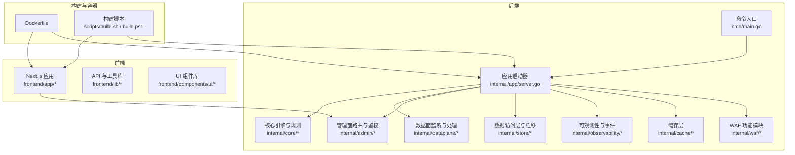
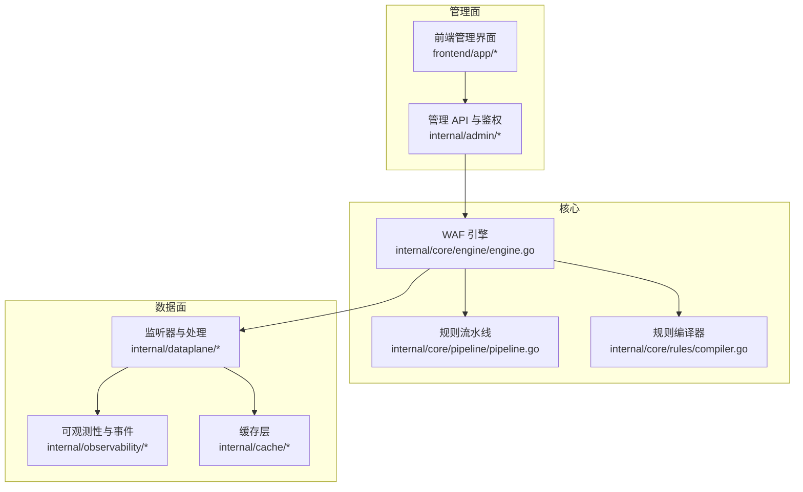
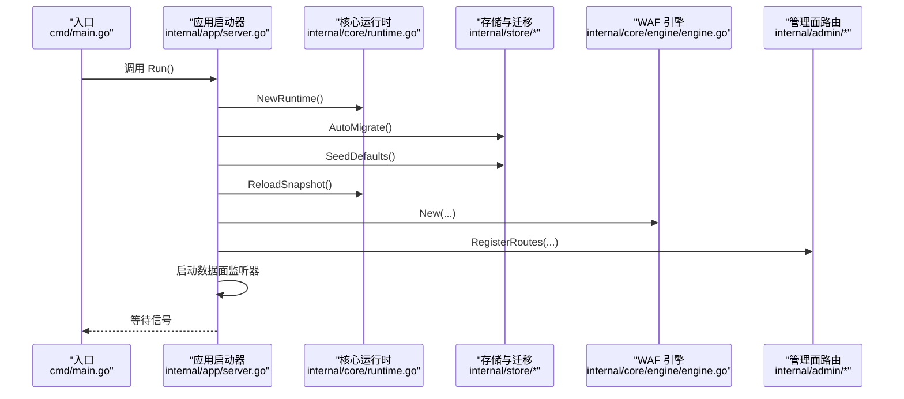
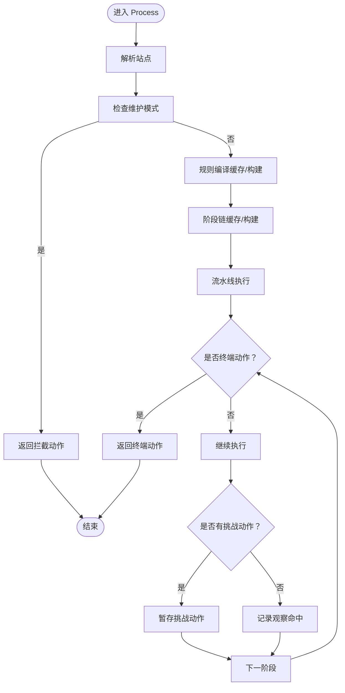
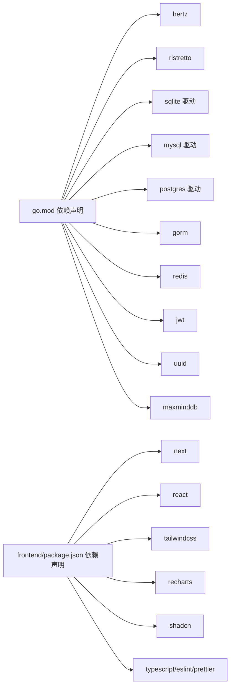

# 开发者指南

<cite>
**本文引用的文件**
- [README.md](file://README.md)
- [go.mod](file://go.mod)
- [frontend/package.json](file://frontend/package.json)
- [cmd/main.go](file://cmd/main.go)
- [cmd/pow-wasm/main.go](file://cmd/pow-wasm/main.go)
- [Dockerfile](file://Dockerfile)
- [scripts/build.sh](file://scripts/build.sh)
- [scripts/build.ps1](file://scripts/build.ps1)
- [internal/app/server.go](file://internal/app/server.go)
- [internal/core/engine/engine.go](file://internal/core/engine/engine.go)
- [internal/core/rules/compiler.go](file://internal/core/rules/compiler.go)
- [internal/core/pipeline/pipeline.go](file://internal/core/pipeline/pipeline.go)
- [frontend/next.config.mjs](file://frontend/next.config.mjs)
- [frontend/tsconfig.json](file://frontend/tsconfig.json)
- [frontend/eslint.config.mjs](file://frontend/eslint.config.mjs)
- [frontend/.prettierrc](file://frontend/.prettierrc)
</cite>

## 目录
1. [简介](#简介)
2. [项目结构](#项目结构)
3. [核心组件](#核心组件)
4. [架构总览](#架构总览)
5. [详细组件分析](#详细组件分析)
6. [依赖分析](#依赖分析)
7. [性能考虑](#性能考虑)
8. [故障排除指南](#故障排除指南)
9. [结论](#结论)
10. [附录](#附录)

## 简介
本指南面向新加入的开发者，提供从环境搭建到日常开发、测试、调试与性能分析的完整流程。项目采用前后端分离架构：后端基于 Go 语言与 Hertz 框架，前端基于 Next.js；同时包含用于人机验证的 WebAssembly 挑战模块。文档覆盖以下主题：
- 开发环境搭建与依赖安装
- 代码贡献流程与规范
- 测试要求与覆盖率
- 调试技巧与性能分析
- 常见问题排查
- 工具推荐与工作流建议
- 新手快速上手最佳实践

## 项目结构
项目采用多模块组织方式，后端以 internal 下的子包划分领域与职责，前端位于 frontend 目录，根目录提供构建脚本与容器化配置。

图表来源
- [cmd/main.go:1-10](file://cmd/main.go#L1-L10)
- [internal/app/server.go:1-655](file://internal/app/server.go#L1-L655)
- [Dockerfile:1-36](file://Dockerfile#L1-L36)
- [scripts/build.sh:1-11](file://scripts/build.sh#L1-L11)
- [scripts/build.ps1:1-18](file://scripts/build.ps1#L1-L18)

章节来源
- [README.md:1-17](file://README.md#L1-L17)
- [go.mod:1-58](file://go.mod#L1-L58)
- [frontend/package.json:1-45](file://frontend/package.json#L1-L45)

## 核心组件
- 应用入口与启动
  - 后端入口：cmd/main.go 调用 internal/app 的 Run() 初始化运行时、加载快照、迁移数据库、注册管理面路由与数据面监听器，并启动生命周期管理器等待信号。
  - 前端入口：Next.js 使用 next.config.mjs 配置静态导出输出目录，tsconfig.json 设置严格类型检查与路径别名，eslint.config.mjs 与 .prettierrc 提供统一的代码风格与校验。
- 核心引擎与规则
  - internal/core/engine/engine.go 实现 WAF 引擎，负责按站点解析、规则编译缓存、阶段链构建与执行。
  - internal/core/rules/compiler.go 将持久化规则转换为可执行的 Compiled 结构并排序。
  - internal/core/pipeline/pipeline.go 定义请求上下文与阶段接口，提供短路与挑战延迟执行的流水线执行逻辑。
- 数据面与管理面
  - internal/dataplane 提供监听器包装、指标、SSE、WebSocket 等数据平面能力。
  - internal/admin 注册管理 API、鉴权与会话管理。
- 存储与可观测性
  - internal/store 提供仓储与迁移；internal/observability 提供统一事件写入、归档与 Prometheus 指标。
- 缓存与性能
  - internal/cache 提供查询计数缓存与响应缓存；Dockerfile 与构建脚本优化二进制体积与运行时环境。
- WASM 挑战
  - cmd/pow-wasm/main.go 实现基于 WebAssembly 的 PoW 解题与回调桥接，用于 5s 盾等挑战场景。

章节来源
- [cmd/main.go:1-10](file://cmd/main.go#L1-L10)
- [internal/app/server.go:1-655](file://internal/app/server.go#L1-L655)
- [internal/core/engine/engine.go:1-308](file://internal/core/engine/engine.go#L1-L308)
- [internal/core/rules/compiler.go:1-91](file://internal/core/rules/compiler.go#L1-L91)
- [internal/core/pipeline/pipeline.go:1-124](file://internal/core/pipeline/pipeline.go#L1-L124)
- [frontend/next.config.mjs:1-12](file://frontend/next.config.mjs#L1-L12)
- [frontend/tsconfig.json:1-45](file://frontend/tsconfig.json#L1-L45)
- [frontend/eslint.config.mjs:1-19](file://frontend/eslint.config.mjs#L1-L19)
- [frontend/.prettierrc:1-12](file://frontend/.prettierrc#L1-L12)
- [cmd/pow-wasm/main.go:1-225](file://cmd/pow-wasm/main.go#L1-L225)

## 架构总览
系统分为“管理面”和“数据面”。管理面提供 API 与前端界面，数据面负责实际请求处理与安全策略执行。引擎根据站点与保护配置构建阶段链，逐阶段评估规则并产生动作（放行、拦截、验证码、阻断等）。

图表来源
- [internal/app/server.go:351-396](file://internal/app/server.go#L351-L396)
- [internal/core/engine/engine.go:37-245](file://internal/core/engine/engine.go#L37-L245)
- [internal/core/pipeline/pipeline.go:50-124](file://internal/core/pipeline/pipeline.go#L50-L124)
- [internal/core/rules/compiler.go:29-59](file://internal/core/rules/compiler.go#L29-L59)

## 详细组件分析

### 组件一：应用启动与生命周期管理
- 职责
  - 初始化运行时与数据库连接，自动迁移，种子默认凭据与首启提示。
  - 构建统一事件写入器、归档器、查询计数缓存、响应缓存与指标。
  - 注册管理面健康检查、状态、指标与路由，启动数据面监听器。
  - 支持分布式配置同步与热重启，按绑定地址聚合站点监听器。
- 关键流程
  - 读取配置 → 创建运行时 → 自动迁移 → 种子默认值 → 加载快照 → 构建引擎与各子系统 → 注册路由 → 启动监听器 → 等待信号。

图表来源
- [cmd/main.go:7-9](file://cmd/main.go#L7-L9)
- [internal/app/server.go:52-396](file://internal/app/server.go#L52-L396)

章节来源
- [internal/app/server.go:52-396](file://internal/app/server.go#L52-L396)

### 组件二：WAF 引擎与规则流水线
- 职责
  - 解析站点、编译规则、构建阶段链并执行。
  - 支持 IP 黑白名单、反重放、ACL、OWASP/CVE 并行检测、机器人检测、速率限制、签名与自定义规则等阶段。
  - 提供评估辅助函数用于测试。
- 执行流程
  - 匹配站点 → 维护模式检查 → 规则编译缓存命中 → 阶段链缓存命中 → 顺序执行阶段 → 返回动作与观察命中。

图表来源
- [internal/core/engine/engine.go:200-245](file://internal/core/engine/engine.go#L200-L245)
- [internal/core/pipeline/pipeline.go:78-118](file://internal/core/pipeline/pipeline.go#L78-L118)

章节来源
- [internal/core/engine/engine.go:37-245](file://internal/core/engine/engine.go#L37-L245)
- [internal/core/pipeline/pipeline.go:50-124](file://internal/core/pipeline/pipeline.go#L50-L124)
- [internal/core/rules/compiler.go:29-91](file://internal/core/rules/compiler.go#L29-L91)

### 组件三：前端管理界面与构建配置
- 职责
  - Next.js 应用提供管理界面，使用 TypeScript、TailwindCSS 与 shadcn 组件库。
  - ESLint 与 Prettier 统一代码风格；静态导出便于嵌入后端静态资源。
- 关键配置
  - next.config.mjs：静态导出、输出目录、图片未优化。
  - tsconfig.json：严格模式、路径别名、Bundler 模块解析。
  - eslint.config.mjs：继承 Next.js 推荐规则并调整忽略项。
  - .prettierrc：缩进、引号、尾逗号、宽度与 Tailwind 插件。

章节来源
- [frontend/next.config.mjs:1-12](file://frontend/next.config.mjs#L1-L12)
- [frontend/tsconfig.json:1-45](file://frontend/tsconfig.json#L1-L45)
- [frontend/eslint.config.mjs:1-19](file://frontend/eslint.config.mjs#L1-L19)
- [frontend/.prettierrc:1-12](file://frontend/.prettierrc#L1-L12)

### 组件四：WebAssembly 挑战模块
- 职责
  - 在浏览器侧执行 PoW 解题，通过 JS 桥接返回结果并触发回调。
  - 提供批量解题与异步定时器调度，避免阻塞事件循环。
- 关键点
  - 指令集封装核心算法，隐藏求解循环。
  - 暴露 solve_batch 与 solve_full 两个入口，支持自定义程序字节码。

章节来源
- [cmd/pow-wasm/main.go:113-225](file://cmd/pow-wasm/main.go#L113-L225)

## 依赖分析
- 后端依赖
  - Web 框架：github.com/cloudwego/hertz
  - 缓存：github.com/dgraph-io/ristretto
  - 数据库：github.com/glebarez/sqlite、gorm.io/driver/mysql、gorm.io/driver/postgres、gorm.io/gorm
  - Redis：github.com/redis/go-redis/v9
  - 加密与令牌：golang.org/x/crypto、github.com/golang-jwt/jwt/v5
  - 其他：github.com/google/uuid、github.com/oschwald/maxminddb-golang 等
- 前端依赖
  - Next.js、React、TailwindCSS、Recharts、shadcn 等
  - 开发工具：ESLint、Prettier、TypeScript

图表来源
- [go.mod:5-18](file://go.mod#L5-L18)
- [frontend/package.json:14-43](file://frontend/package.json#L14-L43)

章节来源
- [go.mod:1-58](file://go.mod#L1-L58)
- [frontend/package.json:1-45](file://frontend/package.json#L1-L45)

## 性能考虑
- 编译与缓存
  - 引擎对规则编译与阶段链进行按快照修订缓存，避免重复昂贵计算。
  - 查询计数缓存与响应缓存降低热点查询与重复响应写入压力。
- 并行与短路
  - OWASP 与 CVE 检测并行执行，提升吞吐。
  - 终端动作（拦截/阻断）立即短路，挑战动作延后但不阻断后续阶段。
- 构建与运行
  - Dockerfile 使用多阶段构建，启用 CGO 并裁剪二进制大小。
  - 构建脚本先构建前端静态产物，再打包到后端静态资源目录。

章节来源
- [internal/core/engine/engine.go:98-198](file://internal/core/engine/engine.go#L98-L198)
- [internal/app/server.go:102-122](file://internal/app/server.go#L102-L122)
- [Dockerfile:17](file://Dockerfile#L17)
- [scripts/build.sh:4-10](file://scripts/build.sh#L4-L10)

## 故障排除指南
- 首次运行凭据
  - 首次启动会在日志中打印管理员密码或 API Token，请妥善保存。
- 数据库迁移失败
  - 检查数据库驱动与 DSN 环境变量，确认权限与路径存在。
- TLS 证书缺失导致监听器跳过
  - 若站点未配置有效证书，监听器会被跳过；请上传或配置证书。
- 管理面不可达
  - 检查 AdminBind 端口与防火墙；确认健康检查端点 /healthz、/readyz 可访问。
- 前端静态资源未生效
  - 确认构建脚本已将 frontend/out 复制到 internal/core/adminweb/dist。
- WASM 挑战无法初始化
  - 确认浏览器支持 WebAssembly 且 __onWasmReady 回调被正确触发。

章节来源
- [internal/app/server.go:68-87](file://internal/app/server.go#L68-L87)
- [internal/app/server.go:300-304](file://internal/app/server.go#L300-L304)
- [scripts/build.ps1:9-11](file://scripts/build.ps1#L9-L11)

## 结论
本指南提供了从环境搭建到日常开发、测试、调试与性能分析的完整路径。建议新开发者先完成环境准备与首次构建，再逐步深入核心引擎与规则流水线，最后结合前端与 WASM 挑战模块理解整体架构。遵循本文的工具与流程建议，可显著提升开发效率与质量。

## 附录

### A. 开发环境搭建与依赖安装
- 后端
  - Go 版本：1.25.x（见 go.mod）
  - 依赖安装：进入项目根目录执行 go mod download
  - 构建：go build -o bin/my-openwaf ./cmd/... 或使用 scripts/build.sh / build.ps1
- 前端
  - Bun 版本：1.3.14（Dockerfile 使用 oven/bun:1.3.14-alpine）
  - 依赖安装：bun install --frozen-lockfile
  - 构建：bun run build（输出至 out 目录）
- 容器化
  - 使用 Dockerfile 进行多阶段构建，前端静态产物自动复制到后端静态目录

章节来源
- [go.mod:3](file://go.mod#L3)
- [scripts/build.sh:4-10](file://scripts/build.sh#L4-L10)
- [scripts/build.ps1:5-15](file://scripts/build.ps1#L5-L15)
- [Dockerfile:2-7](file://Dockerfile#L2-L7)

### B. 代码贡献流程与规范
- 提交前检查
  - 运行类型检查：bun run typecheck
  - 运行 ESLint：bun run lint
  - 运行 Prettier：bun run format
  - 后端：go vet、go test（如存在测试文件）
- 提交流程
  - fork 仓库 → 新建分支 → 提交更改 → 发起 Pull Request → 代码审查 → 合并

章节来源
- [frontend/tsconfig.json:10-12](file://frontend/tsconfig.json#L10-L12)
- [frontend/eslint.config.mjs:1-19](file://frontend/eslint.config.mjs#L1-L19)
- [frontend/.prettierrc:1-12](file://frontend/.prettierrc#L1-L12)

### C. 测试要求
- 后端测试
  - 建议为关键模块（如规则编译、流水线执行、速率限制、缓存）编写单元测试。
  - 使用 go test 运行测试套件，关注覆盖率与边界条件。
- 前端测试
  - 建议为关键组件与工具函数添加单元测试，确保类型安全与行为正确。
- 集成测试
  - 使用构建脚本生成可运行二进制，结合最小化配置进行端到端验证。

章节来源
- [internal/core/rules/compiler.go:29-91](file://internal/core/rules/compiler.go#L29-L91)
- [internal/core/pipeline/pipeline.go:78-118](file://internal/core/pipeline/pipeline.go#L78-L118)

### D. 调试技巧与性能分析
- 日志
  - 使用内置 slog 记录关键路径与错误信息，定位启动与运行期问题。
- 性能分析
  - 使用 Go pprof 采集 CPU/内存分析，结合 Docker 运行时导出分析文件。
  - 关注规则编译与流水线执行热点，必要时增加缓存或并行化。
- 前端调试
  - 使用 Next.js dev 模式与 React DevTools，结合 ESLint/Prettier 快速修复问题。

章节来源
- [internal/app/server.go:52-61](file://internal/app/server.go#L52-L61)

### E. 开发工具推荐与工作流建议
- IDE
  - GoLand/VSCode（Go 插件）、WebStorm（前端）
- 前端
  - ESLint + Prettier + TypeScript，TailwindCSS + shadcn 组件库
- 容器化
  - Docker Desktop，使用 Dockerfile 进行本地预生产验证
- 版本控制
  - Git，建议使用分支策略与 PR 审查流程

章节来源
- [frontend/package.json:14-43](file://frontend/package.json#L14-L43)
- [frontend/eslint.config.mjs:1-19](file://frontend/eslint.config.mjs#L1-L19)
- [frontend/.prettierrc:1-12](file://frontend/.prettierrc#L1-L12)
- [Dockerfile:1-36](file://Dockerfile#L1-L36)
