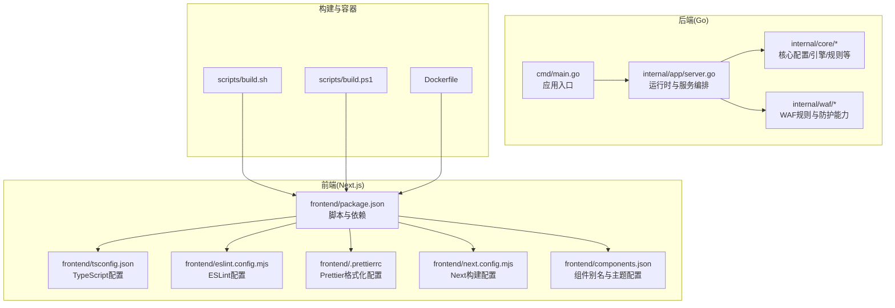
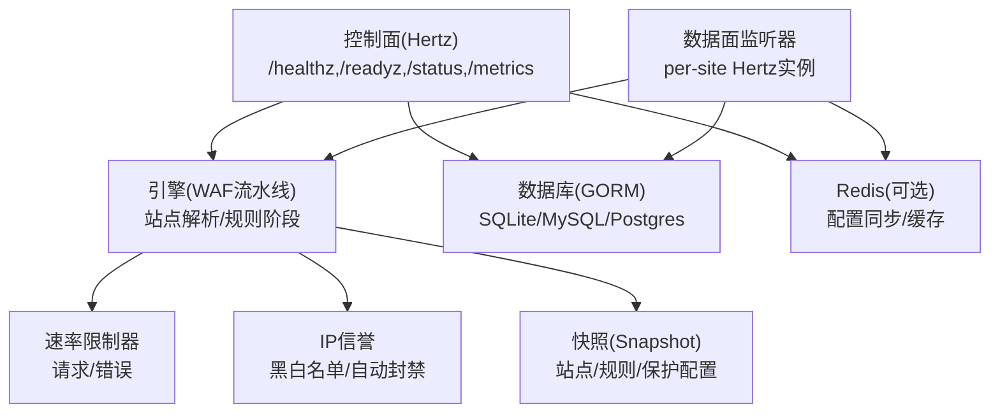
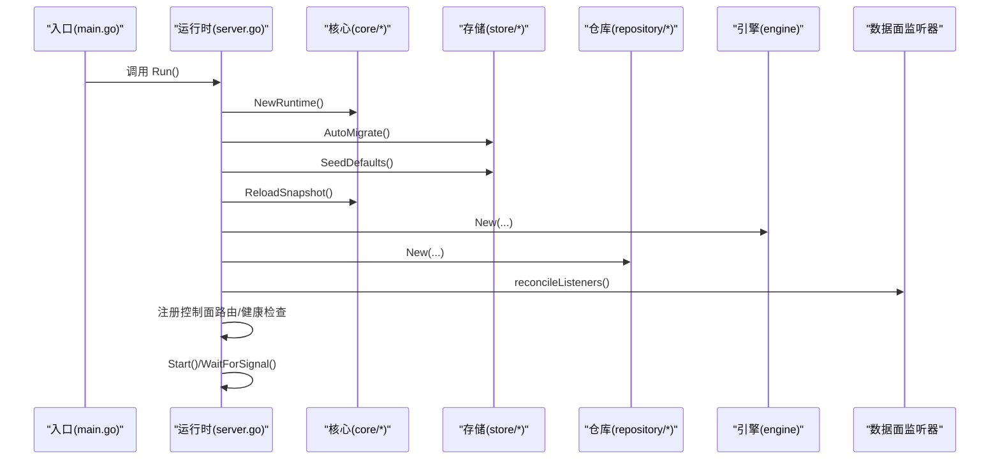
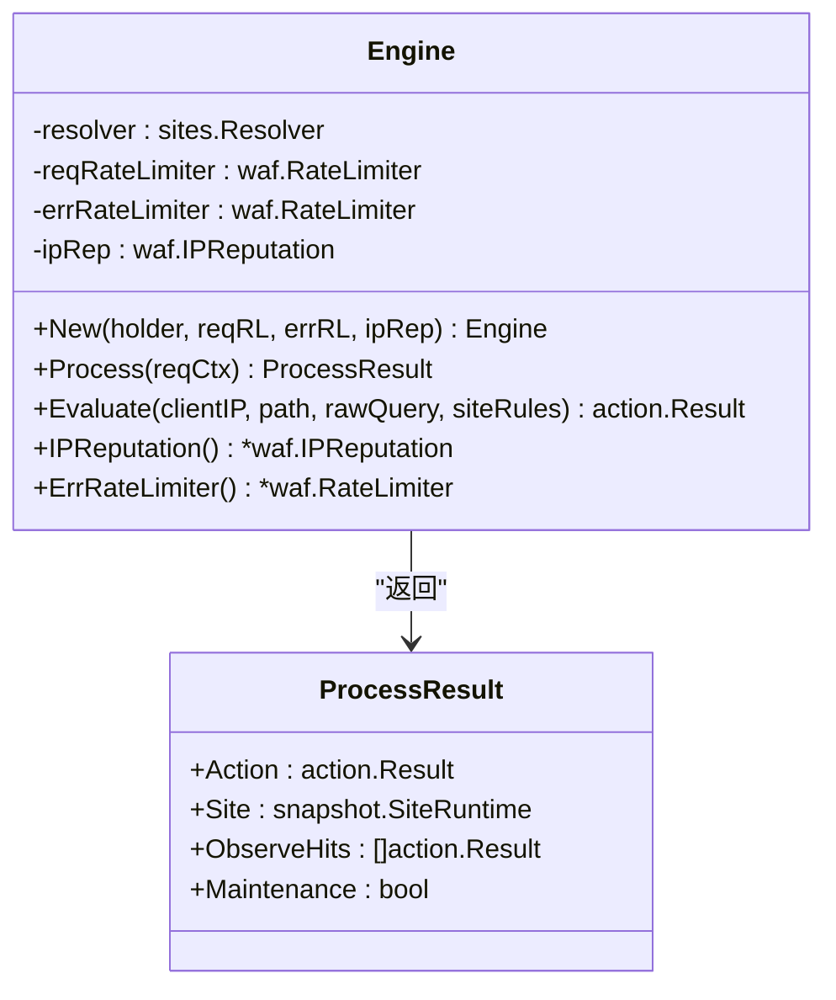
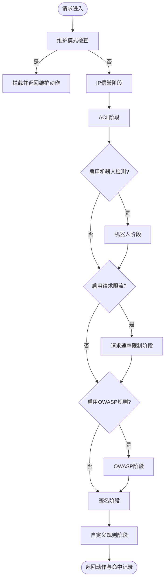
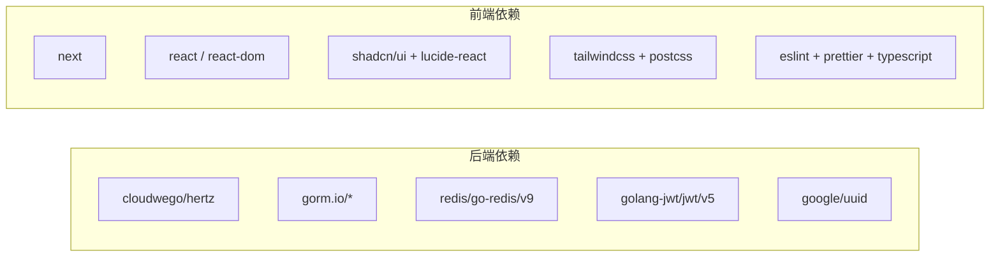

# 开发者指南

<cite>
**本文引用的文件**
- [README.md](file://README.md)
- [frontend/README.md](file://frontend/README.md)
- [go.mod](file://go.mod)
- [cmd/main.go](file://cmd/main.go)
- [internal/app/server.go](file://internal/app/server.go)
- [internal/core/config.go](file://internal/core/config.go)
- [internal/core/engine/engine.go](file://internal/core/engine/engine.go)
- [frontend/package.json](file://frontend/package.json)
- [frontend/tsconfig.json](file://frontend/tsconfig.json)
- [frontend/eslint.config.mjs](file://frontend/eslint.config.mjs)
- [frontend/.prettierrc](file://frontend/.prettierrc)
- [frontend/components.json](file://frontend/components.json)
- [frontend/next.config.mjs](file://frontend/next.config.mjs)
- [scripts/build.sh](file://scripts/build.sh)
- [scripts/build.ps1](file://scripts/build.ps1)
- [Dockerfile](file://Dockerfile)
</cite>

## 目录
1. [简介](#简介)
2. [项目结构](#项目结构)
3. [核心组件](#核心组件)
4. [架构总览](#架构总览)
5. [详细组件分析](#详细组件分析)
6. [依赖分析](#依赖分析)
7. [性能考虑](#性能考虑)
8. [故障排查指南](#故障排查指南)
9. [结论](#结论)
10. [附录](#附录)

## 简介
本指南面向贡献者与维护者，系统化阐述 My-OpenWaf 的开发流程与最佳实践，覆盖编码与提交规范、分支管理策略、开发环境与调试工具、测试策略、代码审查流程、开发工具推荐以及常见问题与排障建议。内容基于仓库中的实际实现与配置文件进行提炼，确保可操作性与一致性。

## 项目结构
项目采用前后端分离与多模块组织方式：
- 后端（Go）：入口位于 cmd/main.go，运行时初始化与服务编排集中在 internal/app/server.go；核心能力如规则引擎、站点解析、速率限制等分布在 internal/core 与 internal/waf 等子包。
- 前端（Next.js）：位于 frontend 目录，使用 shadcn/ui 组件体系，构建产物输出至 out 并在构建脚本中复制到后端嵌入资源目录，最终由后端提供控制台界面。
- 构建与打包：提供跨平台构建脚本与 Dockerfile，支持前端构建、静态资源注入与二进制打包。
- 依赖管理：go.mod 管理 Go 模块依赖；frontend/package.json 管理前端依赖与脚本。

**图表来源**
- [cmd/main.go:1-10](file://cmd/main.go#L1-L10)
- [internal/app/server.go:1-465](file://internal/app/server.go#L1-L465)
- [frontend/package.json:1-45](file://frontend/package.json#L1-L45)
- [frontend/tsconfig.json:1-45](file://frontend/tsconfig.json#L1-L45)
- [frontend/eslint.config.mjs:1-19](file://frontend/eslint.config.mjs#L1-L19)
- [frontend/.prettierrc:1-12](file://frontend/.prettierrc#L1-L12)
- [frontend/next.config.mjs:1-12](file://frontend/next.config.mjs#L1-L12)
- [frontend/components.json:1-26](file://frontend/components.json#L1-L26)
- [scripts/build.sh:1-11](file://scripts/build.sh#L1-L11)
- [scripts/build.ps1:1-18](file://scripts/build.ps1#L1-L18)
- [Dockerfile:1-36](file://Dockerfile#L1-L36)

**章节来源**
- [README.md:1-1](file://README.md#L1-L1)
- [frontend/README.md:1-22](file://frontend/README.md#L1-L22)
- [go.mod:1-57](file://go.mod#L1-L57)
- [cmd/main.go:1-10](file://cmd/main.go#L1-L10)
- [internal/app/server.go:1-465](file://internal/app/server.go#L1-L465)
- [frontend/package.json:1-45](file://frontend/package.json#L1-L45)
- [frontend/tsconfig.json:1-45](file://frontend/tsconfig.json#L1-L45)
- [frontend/eslint.config.mjs:1-19](file://frontend/eslint.config.mjs#L1-L19)
- [frontend/.prettierrc:1-12](file://frontend/.prettierrc#L1-L12)
- [frontend/next.config.mjs:1-12](file://frontend/next.config.mjs#L1-L12)
- [frontend/components.json:1-26](file://frontend/components.json#L1-L26)
- [scripts/build.sh:1-11](file://scripts/build.sh#L1-L11)
- [scripts/build.ps1:1-18](file://scripts/build.ps1#L1-L18)
- [Dockerfile:1-36](file://Dockerfile#L1-L36)

## 核心组件
- 应用入口与运行时
  - 入口函数位于 cmd/main.go，调用 internal/app 的 Run 函数启动服务。
  - internal/app/server.go 负责初始化运行时、数据库迁移、默认凭证生成、快照加载、监听器热启停、事件写入与归档、指标收集、健康检查与生命周期管理。
- 核心配置
  - internal/core/config.go 定义配置项与从环境变量加载逻辑，支持数据库驱动、DSN、数据目录、Redis 连接参数、管理端绑定地址与静态资源目录覆盖。
- 引擎与规则处理
  - internal/core/engine/engine.go 实现请求处理流水线，包含站点解析、维护模式检查、IP信誉、ACL、机器人检测、请求速率限制、OWASP 规则、签名与自定义规则阶段，并提供评估辅助接口。

**章节来源**
- [cmd/main.go:1-10](file://cmd/main.go#L1-L10)
- [internal/app/server.go:1-465](file://internal/app/server.go#L1-L465)
- [internal/core/config.go:1-67](file://internal/core/config.go#L1-L67)
- [internal/core/engine/engine.go:1-146](file://internal/core/engine/engine.go#L1-L146)

## 架构总览
系统采用“控制面 + 数据面”的双平面架构：
- 控制面（Admin Plane）
  - 提供健康检查、就绪检查、状态查询、指标导出与管理 API。
  - 通过内部路由注册与 JWT 认证保护。
- 数据面（Data Plane）
  - 每个站点独立监听，按需热启停，支持 TLS 终止与 SNI 证书。
  - 请求进入后经引擎流水线处理，结合速率限制、IP 黑白名单与自动封禁策略，最终返回动作结果。
- 观测性
  - 异步事件写入与归档、Prometheus 兼容指标、生命周期管理与信号等待。

**图表来源**
- [internal/app/server.go:245-280](file://internal/app/server.go#L245-L280)
- [internal/app/server.go:108-131](file://internal/app/server.go#L108-L131)
- [internal/core/engine/engine.go:43-106](file://internal/core/engine/engine.go#L43-L106)

## 详细组件分析

### 组件一：应用运行时与服务编排
- 关键职责
  - 初始化运行时与数据库迁移，生成首次运行凭据并打印横幅提示。
  - 加载快照、构建事件写入器与归档器、指标收集器。
  - 基于快照为每个站点创建独立监听器，支持配置漂移检测与热重启。
  - 启动 Redis 配置同步订阅，实现分布式热重载。
  - 注册控制面路由与健康检查端点。
- 处理流程（序列图）

**图表来源**
- [cmd/main.go:7-9](file://cmd/main.go#L7-L9)
- [internal/app/server.go:33-280](file://internal/app/server.go#L33-L280)

**章节来源**
- [cmd/main.go:1-10](file://cmd/main.go#L1-L10)
- [internal/app/server.go:1-465](file://internal/app/server.go#L1-L465)

### 组件二：核心配置加载
- 配置项
  - 数据库：驱动类型、DSN、数据目录。
  - 缓存/消息：Redis 地址、密码、DB 索引。
  - 管理端：绑定地址与静态资源目录覆盖。
- 加载策略
  - 从环境变量读取，未设置时采用默认值或基于数据目录推导。

**章节来源**
- [internal/core/config.go:10-67](file://internal/core/config.go#L10-L67)

### 组件三：WAF 引擎与规则流水线
- 结构关系（类图）

**图表来源**
- [internal/core/engine/engine.go:15-146](file://internal/core/engine/engine.go#L15-L146)

- 流水线阶段（流程图）
  - 维护模式检查
  - IP 信誉（白名单短路、黑名单拦截）
  - ACL
  - 机器人检测（可选）
  - 请求速率限制（可选）
  - OWASP 规则（可选）
  - 签名与自定义规则

**图表来源**
- [internal/core/engine/engine.go:43-106](file://internal/core/engine/engine.go#L43-L106)

**章节来源**
- [internal/core/engine/engine.go:1-146](file://internal/core/engine/engine.go#L1-L146)

### 组件四：前端工程与构建
- 工程配置
  - TypeScript 严格模式、路径别名、增量编译与 bundler 解析。
  - ESLint 使用 next/core-web-vitals 与 next/typescript 规则集，覆盖核心 Web 指标与 TS 规范。
  - Prettier 配置遵循 Tailwind 最佳实践，统一代码风格。
  - Next.js 静态导出（export）、输出目录 out、尾斜杠与图片未优化。
  - shadcn/ui 组件别名与主题配置。
- 构建脚本
  - 跨平台脚本分别执行前端构建、复制 out 到后端嵌入目录、清理旧 dist、go mod tidy 与二进制构建。
- Docker 打包
  - 分阶段构建：Node 前端构建 -> Go 后端构建 -> 运行时镜像，注入前端静态资源，设置默认环境变量与卷。

**章节来源**
- [frontend/tsconfig.json:1-45](file://frontend/tsconfig.json#L1-L45)
- [frontend/eslint.config.mjs:1-19](file://frontend/eslint.config.mjs#L1-L19)
- [frontend/.prettierrc:1-12](file://frontend/.prettierrc#L1-L12)
- [frontend/next.config.mjs:1-12](file://frontend/next.config.mjs#L1-L12)
- [frontend/components.json:1-26](file://frontend/components.json#L1-L26)
- [frontend/package.json:1-45](file://frontend/package.json#L1-L45)
- [scripts/build.sh:1-11](file://scripts/build.sh#L1-L11)
- [scripts/build.ps1:1-18](file://scripts/build.ps1#L1-L18)
- [Dockerfile:1-36](file://Dockerfile#L1-L36)

## 依赖分析
- 后端依赖
  - Web 框架：cloudwego/hertz
  - ORM：gorm.io 与驱动（mysql/postgres/sqlite）
  - 缓存/KV：dgraph-io/ristretto、redis/go-redis/v9
  - 加密与令牌：golang-jwt/jwt/v5、crypto 包
  - UUID：google/uuid
- 前端依赖
  - 框架：next、react、react-dom
  - UI：shadcn/ui、lucide-react、recharts
  - 样式：tailwindcss、postcss
  - 类型与校验：@types/*、eslint、prettier、typescript

**图表来源**
- [go.mod:5-56](file://go.mod#L5-L56)
- [frontend/package.json:14-43](file://frontend/package.json#L14-L43)

**章节来源**
- [go.mod:1-57](file://go.mod#L1-L57)
- [frontend/package.json:1-45](file://frontend/package.json#L1-L45)

## 性能考虑
- 监听器热启停与配置漂移检测
  - 基于指纹快速识别配置变更，仅重启受影响监听器，降低停机与抖动风险。
- 速率限制与 IP 信誉
  - 将 IP 白名单短路与黑名单拦截前置，减少后续规则计算开销。
- 异步事件写入与归档
  - 事件写入器采用异步批处理，避免阻塞主处理链路。
- 指标与可观测性
  - Prometheus 兼容指标采集，便于外部监控与告警。
- 建议
  - 在高并发场景下优先启用 Redis 以提升配置同步与缓存命中率。
  - 合理配置速率限制窗口与阈值，避免误伤正常流量。
  - 对前端静态资源与缓存策略进行压测验证。

[本节为通用指导，无需特定文件引用]

## 故障排查指南
- 启动失败
  - 检查数据库连接参数与驱动选择是否正确。
  - 查看首次运行凭据输出与日志，确认凭据生成与快照加载是否成功。
- 监听器异常
  - 关注配置漂移日志，确认指纹变化与重启行为是否符合预期。
  - 若 TLS 启用但证书缺失，监听器可能无法启动。
- 速率限制与封禁
  - 核对保护配置中的限流窗口与阈值，以及 IP 名单生效情况。
- 观测性
  - 通过 /metrics 端点验证指标导出，检查事件写入与归档任务状态。
- 日志
  - 使用内置 Banner 输出与 slog 记录，定位初始化与重载过程中的错误。

**章节来源**
- [internal/app/server.go:33-280](file://internal/app/server.go#L33-L280)

## 结论
本指南基于仓库现有实现，提供了从环境搭建、编码与提交规范、测试策略、调试技巧到代码审查与工具推荐的完整开发流程。建议在贡献前先完成本地构建与端到端验证，再提交 PR 并配合自动化检查与审查流程，确保质量与一致性。

[本节为总结性内容，无需特定文件引用]

## 附录

### A. 编码与提交规范
- Go 后端
  - 使用 gofmt 与 go vet，遵循 Go 官方风格与包命名约定。
  - 错误处理应携带上下文信息，避免无意义的空错误。
  - 新增功能需配套单元测试与集成测试。
- 前端
  - TypeScript 严格模式，遵循 ESLint 与 Prettier 规则。
  - 组件命名与导出保持一致，样式调整遵循 Tailwind 与 shadcn/ui 设计系统。
  - 新页面与路由需完善类型声明与路径别名引用。

[本节为通用规范，无需特定文件引用]

### B. 分支管理策略
- 主分支保护：禁止直接推送，所有改动通过 Pull Request 合并。
- 分支命名：feature/xxx、fix/xxx、docs/xxx、chore/xxx。
- 提交信息：采用动词开头的简短描述，必要时补充影响范围与相关 Issue。

[本节为通用规范，无需特定文件引用]

### C. 开发环境设置
- 后端
  - 安装 Go 版本与依赖（见 go.mod），使用 IDE 插件支持导入与格式化。
  - 配置数据库（sqlite 默认，或 MySQL/Postgres），设置环境变量覆盖默认值。
- 前端
  - 安装 Node.js 与包管理器，执行安装脚本后运行 dev 服务器。
  - 配置 IDE 的 TypeScript 与 ESLint/Prettier 插件，启用保存时格式化。
- 构建与容器
  - 使用提供的构建脚本或 Dockerfile 进行本地打包与运行。

**章节来源**
- [go.mod:1-57](file://go.mod#L1-L57)
- [frontend/package.json:6-12](file://frontend/package.json#L6-L12)
- [scripts/build.sh:1-11](file://scripts/build.sh#L1-L11)
- [scripts/build.ps1:1-18](file://scripts/build.ps1#L1-L18)
- [Dockerfile:1-36](file://Dockerfile#L1-L36)

### D. 测试策略
- 单元测试
  - Go：针对核心包（如 engine、rules、waf）编写单元测试，覆盖关键路径与边界条件。
  - 前端：组件与工具函数使用 Jest 或 React Testing Library，确保覆盖率与稳定性。
- 集成测试
  - 通过最小化环境启动后端与前端，验证控制台与 API 的端到端交互。
- 端到端测试
  - 使用浏览器自动化工具模拟真实用户场景，覆盖登录、站点配置、规则编辑与事件查看等流程。

[本节为通用策略，无需特定文件引用]

### E. 调试技巧
- 日志分析
  - 使用 slog 输出结构化日志，结合横幅输出与 Info/Error 级别区分问题定位阶段。
- 性能分析
  - 导出 Prometheus 指标，结合外部监控系统观察 QPS、错误率与延迟。
- 问题定位
  - 从监听器热启停日志入手，逐步缩小到具体站点与规则阶段。
  - 对热点路径（速率限制、IP 信誉、规则编译）进行性能剖析。

**章节来源**
- [internal/app/server.go:33-280](file://internal/app/server.go#L33-L280)

### F. 代码审查流程
- 审查标准
  - 正确性：逻辑清晰、边界处理完备、错误处理充分。
  - 可维护性：命名规范、注释清晰、模块职责单一。
  - 性能与安全：避免热点路径阻塞、注意输入校验与权限控制。
- 反馈机制
  - 使用 PR 评论与修订建议，要求修改后重新审查。
- 质量保证
  - 必须通过 CI 检查（格式化、类型检查、测试与构建）方可合并。

[本节为通用流程，无需特定文件引用]

### G. 开发工具推荐
- 编辑器与插件
  - VS Code：Go、ESLint、Prettier、Tailwind CSS IntelliSense。
  - IntelliJ/Goland：Go 插件与前端工具链。
- 自动化工具
  - Pre-commit 钩子：格式化与基础检查。
  - CI/CD：自动化构建、测试与打包发布。

[本节为通用建议，无需特定文件引用]