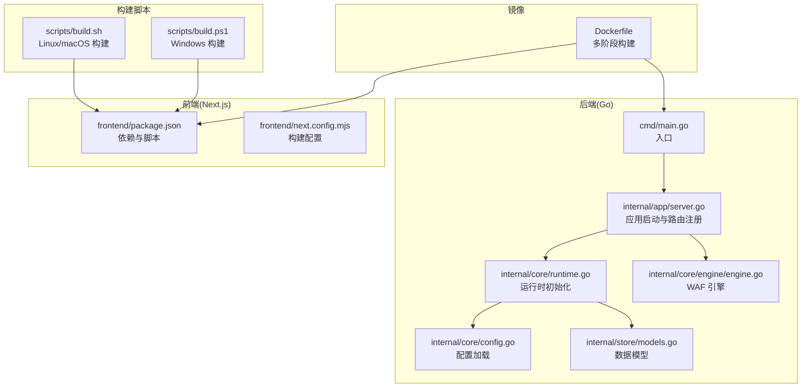
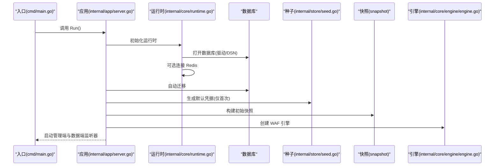
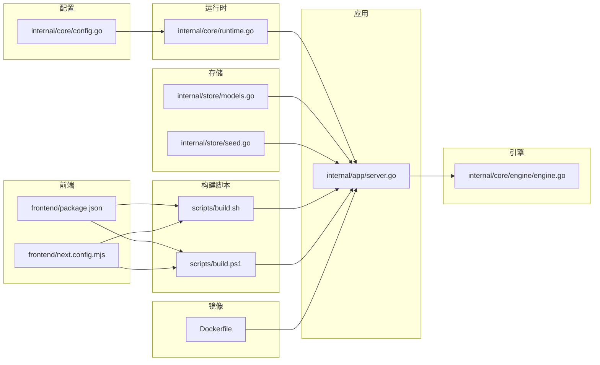

# 快速开始

<cite>
**本文引用的文件**
- [README.md](file://README.md)
- [go.mod](file://go.mod)
- [cmd/main.go](file://cmd/main.go)
- [Dockerfile](file://Dockerfile)
- [scripts/build.sh](file://scripts/build.sh)
- [scripts/build.ps1](file://scripts/build.ps1)
- [frontend/package.json](file://frontend/package.json)
- [frontend/next.config.mjs](file://frontend/next.config.mjs)
- [internal/core/config.go](file://internal/core/config.go)
- [internal/core/runtime.go](file://internal/core/runtime.go)
- [internal/app/server.go](file://internal/app/server.go)
- [internal/store/models.go](file://internal/store/models.go)
- [internal/store/seed.go](file://internal/store/seed.go)
- [internal/core/engine/engine.go](file://internal/core/engine/engine.go)
</cite>

## 目录
1. [简介](#简介)
2. [项目结构](#项目结构)
3. [核心组件](#核心组件)
4. [架构总览](#架构总览)
5. [详细组件分析](#详细组件分析)
6. [依赖关系分析](#依赖关系分析)
7. [性能与资源建议](#性能与资源建议)
8. [故障排查指南](#故障排查指南)
9. [结论](#结论)
10. [附录](#附录)

## 简介
本指南面向首次接触 My-OpenWaf 的用户，帮助你在最短时间内完成安装、构建与启动，并提供本地开发、容器化部署与生产环境配置的完整路径。你将获得：
- 环境要求与依赖安装说明
- 项目克隆与构建流程
- 多种部署方式与初始配置
- 常见问题与验证方法

## 项目结构
My-OpenWaf 是一个前后端分离的 Web 应用，后端采用 Go（Hertz 框架），前端采用 Next.js。项目通过脚本在构建时将前端产物嵌入到后端可执行文件中，最终以单一二进制运行。

图表来源
- [cmd/main.go:1-10](file://cmd/main.go#L1-L10)
- [internal/app/server.go:1-465](file://internal/app/server.go#L1-L465)
- [internal/core/runtime.go:1-127](file://internal/core/runtime.go#L1-L127)
- [internal/core/config.go:1-67](file://internal/core/config.go#L1-L67)
- [internal/store/models.go:1-350](file://internal/store/models.go#L1-L350)
- [internal/core/engine/engine.go:1-146](file://internal/core/engine/engine.go#L1-L146)
- [frontend/package.json:1-45](file://frontend/package.json#L1-L45)
- [frontend/next.config.mjs:1-12](file://frontend/next.config.mjs#L1-L12)
- [scripts/build.sh:1-11](file://scripts/build.sh#L1-L11)
- [scripts/build.ps1:1-18](file://scripts/build.ps1#L1-L18)
- [Dockerfile:1-36](file://Dockerfile#L1-L36)

章节来源
- [README.md:1-1](file://README.md#L1-L1)
- [go.mod:1-57](file://go.mod#L1-L57)
- [cmd/main.go:1-10](file://cmd/main.go#L1-L10)
- [frontend/package.json:1-45](file://frontend/package.json#L1-L45)
- [frontend/next.config.mjs:1-12](file://frontend/next.config.mjs#L1-L12)
- [scripts/build.sh:1-11](file://scripts/build.sh#L1-L11)
- [scripts/build.ps1:1-18](file://scripts/build.ps1#L1-L18)
- [Dockerfile:1-36](file://Dockerfile#L1-L36)

## 核心组件
- 后端入口与启动
  - 入口函数位于 [cmd/main.go:1-10](file://cmd/main.go#L1-L10)，调用内部应用启动逻辑。
  - 应用启动主流程在 [internal/app/server.go:33-280](file://internal/app/server.go#L33-L280)，负责初始化运行时、迁移数据库、生成默认凭据、热重载、监听器管理等。
- 运行时与配置
  - 运行时初始化在 [internal/core/runtime.go:28-80](file://internal/core/runtime.go#L28-L80)，打开数据库与可选 Redis，构建缓存层与快照持有者。
  - 配置加载在 [internal/core/config.go:31-66](file://internal/core/config.go#L31-L66)，支持从环境变量读取数据库驱动、DSN、数据目录、Redis、管理端绑定地址等。
- 数据模型与种子
  - 数据模型定义在 [internal/store/models.go:1-350](file://internal/store/models.go#L1-L350)，涵盖站点、证书、策略、规则、系统设置、管理员账户等。
  - 种子数据在 [internal/store/seed.go:15-61](file://internal/store/seed.go#L15-L61)，首次运行自动生成默认 API Key 与管理员账户。
- WAF 引擎
  - 引擎在 [internal/core/engine/engine.go:24-106](file://internal/core/engine/engine.go#L24-L106) 中组织处理流程，按阶段执行 IP 黑白名单、ACL、机器人检测、限流、OWASP 规则等。

章节来源
- [cmd/main.go:1-10](file://cmd/main.go#L1-L10)
- [internal/app/server.go:33-280](file://internal/app/server.go#L33-L280)
- [internal/core/runtime.go:28-80](file://internal/core/runtime.go#L28-L80)
- [internal/core/config.go:31-66](file://internal/core/config.go#L31-L66)
- [internal/store/models.go:1-350](file://internal/store/models.go#L1-L350)
- [internal/store/seed.go:15-61](file://internal/store/seed.go#L15-L61)
- [internal/core/engine/engine.go:24-106](file://internal/core/engine/engine.go#L24-L106)

## 架构总览
下图展示了从进程启动到服务就绪的关键交互，以及前端静态资源的嵌入方式。

图表来源
- [cmd/main.go:7-9](file://cmd/main.go#L7-L9)
- [internal/app/server.go:37-73](file://internal/app/server.go#L37-L73)
- [internal/core/runtime.go:41-79](file://internal/core/runtime.go#L41-L79)
- [internal/store/seed.go:15-61](file://internal/store/seed.go#L15-L61)
- [internal/core/engine/engine.go:24-31](file://internal/core/engine/engine.go#L24-L31)

## 详细组件分析

### 环境要求与依赖
- Go 版本
  - 项目模块声明使用 Go 1.25.5，建议使用该版本或兼容版本进行构建与运行。
- 前端工具链
  - Node.js 用于前端构建；Next.js 16.1.7，TypeScript 5.x。
- 数据库
  - 默认 SQLite（无需额外服务），也可选择 MySQL 或 PostgreSQL。
- 缓存与分布式
  - 可选 Redis（用于分布式配置同步与共享状态）。
- 容器化
  - 使用 Docker 多阶段构建，最终运行于 Alpine Linux。

章节来源
- [go.mod:3](file://go.mod#L3)
- [frontend/package.json:14-43](file://frontend/package.json#L14-L43)
- [Dockerfile:10](file://Dockerfile#L10)
- [Dockerfile:20](file://Dockerfile#L20)

### 安装与构建步骤

#### 步骤 1：准备环境
- 安装 Go 1.25.x 或以上版本。
- 安装 Node.js 与 npm（用于前端构建）。
- 准备 Docker（如需容器化部署）。

章节来源
- [go.mod:3](file://go.mod#L3)
- [frontend/package.json:14-43](file://frontend/package.json#L14-L43)
- [Dockerfile:10](file://Dockerfile#L10)

#### 步骤 2：克隆仓库
- 使用 Git 克隆仓库到本地工作目录。

章节来源
- [README.md:1](file://README.md#L1)

#### 步骤 3：构建前端静态资源
- 进入前端目录，执行构建脚本以生成静态输出。
- Linux/macOS 使用 [scripts/build.sh](file://scripts/build.sh#L5)。
- Windows 使用 [scripts/build.ps1:5-7](file://scripts/build.ps1#L5-L7)。

章节来源
- [scripts/build.sh:5](file://scripts/build.sh#L5)
- [scripts/build.ps1:5-7](file://scripts/build.ps1#L5-L7)
- [frontend/next.config.mjs:3-5](file://frontend/next.config.mjs#L3-L5)

#### 步骤 4：构建后端二进制
- 在项目根目录执行 Go 构建，生成可执行文件。
- Linux/macOS 使用 [scripts/build.sh](file://scripts/build.sh#L10)。
- Windows 使用 [scripts/build.ps1](file://scripts/build.ps1#L15)。

章节来源
- [scripts/build.sh:10](file://scripts/build.sh#L10)
- [scripts/build.ps1:15](file://scripts/build.ps1#L15)

#### 步骤 5：验证构建产物
- 构建完成后，可在 bin 目录（Linux/macOS）或 bin 目录（Windows）找到可执行文件。

章节来源
- [scripts/build.sh:10](file://scripts/build.sh#L10)
- [scripts/build.ps1:15](file://scripts/build.ps1#L15)

### 部署方式

#### 本地开发环境
- 设置环境变量（示例）
  - 数据库驱动与 DSN：参考 [internal/core/config.go:44-47](file://internal/core/config.go#L44-L47) 与 [internal/core/config.go:32-42](file://internal/core/config.go#L32-L42)。
  - 管理端绑定地址：参考 [internal/core/config.go:51-54](file://internal/core/config.go#L51-L54)。
  - 可选 Redis：参考 [internal/core/config.go:60-64](file://internal/core/config.go#L60-L64)。
- 启动应用
  - 直接运行已构建的二进制文件，应用会自动迁移数据库并生成默认凭据（首次运行）。
  - 关键启动流程参见 [internal/app/server.go:37-73](file://internal/app/server.go#L37-L73)。

章节来源
- [internal/core/config.go:31-66](file://internal/core/config.go#L31-L66)
- [internal/app/server.go:37-73](file://internal/app/server.go#L37-L73)

#### Docker 容器部署
- 构建镜像
  - 使用 [Dockerfile:1-36](file://Dockerfile#L1-L36) 进行多阶段构建，前端在 stage 1 构建，后端在 stage 2 构建并复制前端静态资源，最终在 stage 3 运行。
- 运行容器
  - 默认暴露端口 9443，挂载数据卷至 /app/data。
  - 环境变量默认值参见 [Dockerfile:26-29](file://Dockerfile#L26-L29)。
- 示例命令（概念性）
  - docker build -t my-openwaf .
  - docker run -d -p 9443:9443 -v ./data:/app/data --name my-openwaf my-openwaf

章节来源
- [Dockerfile:1-36](file://Dockerfile#L1-L36)

#### 生产环境配置
- 数据库选择
  - SQLite：无需额外服务，适合小规模或测试环境。
  - MySQL/PostgreSQL：适合生产，需正确配置驱动与 DSN。
- Redis（可选）
  - 用于分布式配置同步与共享缓存，提升高可用性。
- 管理端与数据端
  - 管理端默认绑定地址可由环境变量覆盖，数据端按站点配置动态监听。

章节来源
- [internal/core/config.go:44-66](file://internal/core/config.go#L44-L66)
- [internal/app/server.go:246-279](file://internal/app/server.go#L246-L279)

### 初始配置与启动示例

- 环境变量（示例）
  - MY_OPENWAF_DB_DRIVER：sqlite/mysql/postgres
  - MY_OPENWAF_DSN：SQLite 文件路径或完整 DSN
  - MY_OPENWAF_DATA：数据目录（SQLite 默认使用该目录下的 waf.db）
  - MY_OPENWAF_ADMIN_BIND：管理端绑定地址（默认 :9443）
  - MY_OPENWAF_REDIS_ADDR/MY_OPENWAF_REDIS_PASSWORD/MY_OPENWAF_REDIS_DB：Redis 可选配置
- 首次运行提示
  - 首次启动会打印管理员用户名与密码（仅一次），请妥善保存。
  - 参考 [internal/app/server.go:55-68](file://internal/app/server.go#L55-L68) 与 [internal/store/seed.go:43-58](file://internal/store/seed.go#L43-L58)。

章节来源
- [internal/core/config.go:31-66](file://internal/core/config.go#L31-L66)
- [internal/app/server.go:55-68](file://internal/app/server.go#L55-L68)
- [internal/store/seed.go:43-58](file://internal/store/seed.go#L43-L58)

### 验证安装成功
- 访问管理端健康检查
  - GET /healthz：存活探针
  - GET /readyz：就绪探针
  - GET /status：状态信息
  - 参考 [internal/app/server.go:247-249](file://internal/app/server.go#L247-L249)
- 登录后台
  - 使用首次运行生成的管理员凭据登录后台界面。
- 查看默认站点与规则
  - 首次运行会生成默认 API Key 与管理员账户，可在后台查看与配置站点、规则等。

章节来源
- [internal/app/server.go:247-249](file://internal/app/server.go#L247-L249)
- [internal/store/seed.go:15-61](file://internal/store/seed.go#L15-L61)

## 依赖关系分析

图表来源
- [internal/core/config.go:31-66](file://internal/core/config.go#L31-L66)
- [internal/core/runtime.go:28-80](file://internal/core/runtime.go#L28-L80)
- [internal/app/server.go:33-280](file://internal/app/server.go#L33-L280)
- [internal/store/models.go:1-350](file://internal/store/models.go#L1-L350)
- [internal/store/seed.go:15-61](file://internal/store/seed.go#L15-L61)
- [internal/core/engine/engine.go:24-106](file://internal/core/engine/engine.go#L24-L106)
- [frontend/package.json:1-45](file://frontend/package.json#L1-L45)
- [frontend/next.config.mjs:1-12](file://frontend/next.config.mjs#L1-L12)
- [scripts/build.sh:1-11](file://scripts/build.sh#L1-L11)
- [scripts/build.ps1:1-18](file://scripts/build.ps1#L1-L18)
- [Dockerfile:1-36](file://Dockerfile#L1-L36)

## 性能与资源建议
- 数据库
  - SQLite 适合小规模与开发测试；生产建议使用 MySQL/PostgreSQL 并合理配置连接池与索引。
- 缓存
  - 启用 Redis 可提升分布式场景下的配置同步与缓存命中率。
- 监听器
  - 按站点动态启停监听器，减少资源占用；注意 TLS 证书与 SNI 配置变更时的热重启。
- 日志与可观测性
  - 使用内置健康检查与指标接口，结合外部监控系统进行告警与容量规划。

[本节为通用建议，不直接分析具体文件]

## 故障排查指南

- 构建失败
  - 前端构建失败：确认 Node.js 与 npm 版本满足要求，参考 [frontend/package.json:14-43](file://frontend/package.json#L14-L43)。
  - Go 构建失败：确保 Go 版本与依赖完整，参考 [go.mod](file://go.mod#L3)。
- 运行时错误
  - 数据库连接失败：检查驱动与 DSN，参考 [internal/core/config.go:44-47](file://internal/core/config.go#L44-L47)。
  - Redis 连接失败：检查地址、密码与 DB，参考 [internal/core/config.go:60-64](file://internal/core/config.go#L60-L64)。
- 首次运行无凭据
  - 确认数据库已迁移且种子数据生成，参考 [internal/app/server.go:49-68](file://internal/app/server.go#L49-L68) 与 [internal/store/seed.go:15-61](file://internal/store/seed.go#L15-L61)。
- 容器启动异常
  - 确认端口映射与数据卷挂载，参考 [Dockerfile:26-35](file://Dockerfile#L26-L35)。

章节来源
- [frontend/package.json:14-43](file://frontend/package.json#L14-L43)
- [go.mod:3](file://go.mod#L3)
- [internal/core/config.go:44-66](file://internal/core/config.go#L44-L66)
- [internal/app/server.go:49-68](file://internal/app/server.go#L49-L68)
- [internal/store/seed.go:15-61](file://internal/store/seed.go#L15-L61)
- [Dockerfile:26-35](file://Dockerfile#L26-L35)

## 结论
通过本指南，你可以基于 Go 与 Node.js 环境完成项目构建，并选择本地或容器化方式快速启动 My-OpenWaf。首次运行会自动生成默认凭据，请妥善保存。后续可根据业务需求切换数据库与启用 Redis，以满足更高性能与可用性要求。

[本节为总结，不直接分析具体文件]

## 附录

### 常用环境变量一览
- MY_OPENWAF_DB_DRIVER：数据库驱动（sqlite/mysql/postgres）
- MY_OPENWAF_DSN：数据库连接串或 SQLite 文件路径
- MY_OPENWAF_DATA：数据目录（SQLite 默认使用该目录）
- MY_OPENWAF_ADMIN_BIND：管理端绑定地址（默认 :9443）
- MY_OPENWAF_REDIS_ADDR/MY_OPENWAF_REDIS_PASSWORD/MY_OPENWAF_REDIS_DB：Redis 可选配置
- MY_OPENWAF_ADMIN_STATIC_DIR：本地开发时覆盖嵌入式前端静态资源目录

章节来源
- [internal/core/config.go:31-66](file://internal/core/config.go#L31-L66)