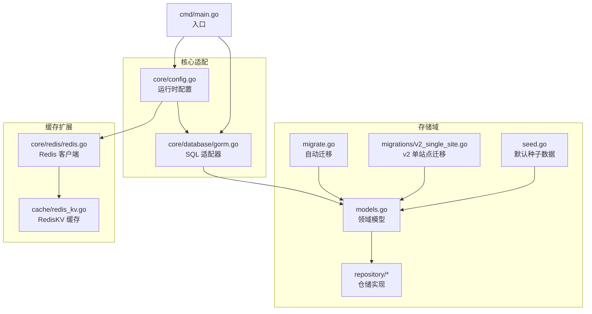
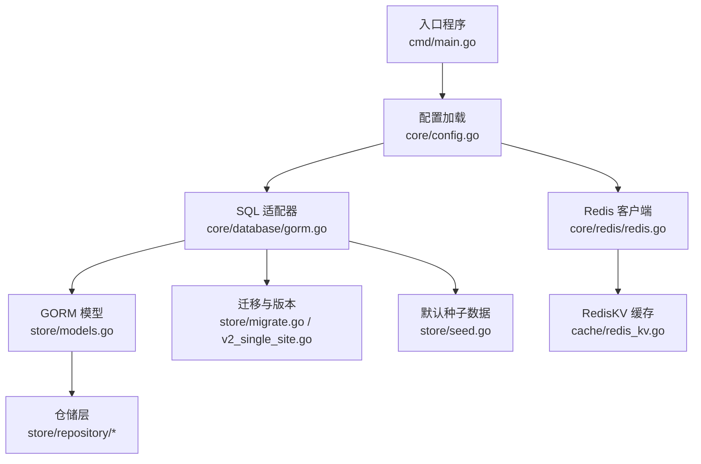
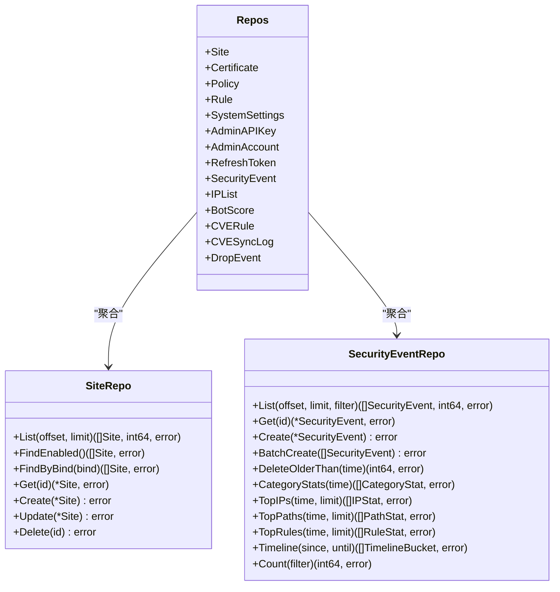
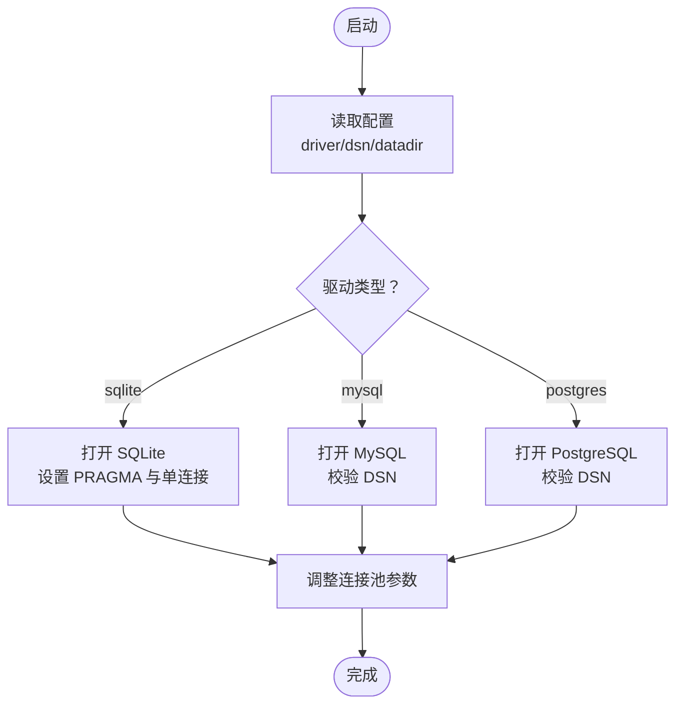
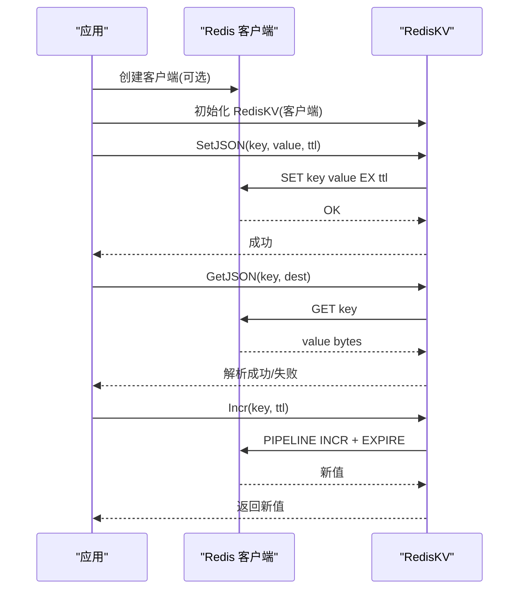
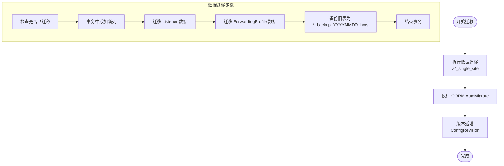
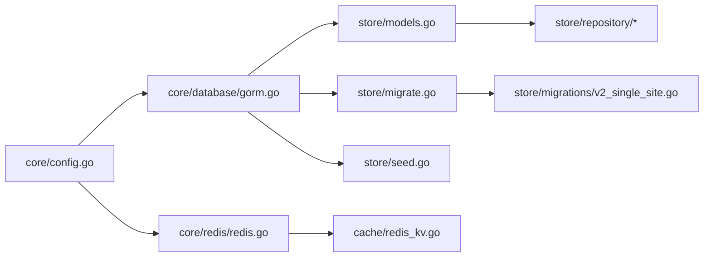

# 存储后端扩展

<cite>
**本文引用的文件**
- [internal/store/doc.go](file://internal/store/doc.go)
- [internal/store/models.go](file://internal/store/models.go)
- [internal/store/migrate.go](file://internal/store/migrate.go)
- [internal/store/seed.go](file://internal/store/seed.go)
- [internal/store/migrations/v2_single_site.go](file://internal/store/migrations/v2_single_site.go)
- [internal/store/repository/repository.go](file://internal/store/repository/repository.go)
- [internal/store/repository/site.go](file://internal/store/repository/site.go)
- [internal/store/repository/admin_account.go](file://internal/store/repository/admin_account.go)
- [internal/store/repository/security_event.go](file://internal/store/repository/security_event.go)
- [internal/core/database/gorm.go](file://internal/core/database/gorm.go)
- [internal/core/config.go](file://internal/core/config.go)
- [internal/core/redis/redis.go](file://internal/core/redis/redis.go)
- [internal/cache/redis_kv.go](file://internal/cache/redis_kv.go)
- [cmd/main.go](file://cmd/main.go)
</cite>

## 目录
1. [简介](#简介)
2. [项目结构](#项目结构)
3. [核心组件](#核心组件)
4. [架构总览](#架构总览)
5. [详细组件分析](#详细组件分析)
6. [依赖分析](#依赖分析)
7. [性能考虑](#性能考虑)
8. [故障排查指南](#故障排查指南)
9. [结论](#结论)
10. [附录](#附录)

## 简介
本文件系统性阐述 My-OpenWaf 的存储后端扩展体系，覆盖以下主题：
- 存储抽象层：接口与数据模型映射、事务管理策略
- 关系型数据库适配器：SQLite、MySQL、PostgreSQL 的连接与池化
- 非关系型存储扩展：Redis 键值缓存与分布式共享状态
- 存储迁移机制：迁移接口、版本管理与回滚策略
- 连接池管理：连接配置、健康检查与故障恢复
- 性能优化：索引设计、查询优化与缓存策略
- 扩展开发工具与测试方法

## 项目结构
存储相关代码主要分布在 internal/store（领域模型、迁移、仓储）、internal/core/database（SQL 适配器）与 internal/cache（Redis 扩展）等目录。



**图表来源**
- [internal/store/models.go:1-456](file://internal/store/models.go#L1-L456)
- [internal/store/migrate.go:1-56](file://internal/store/migrate.go#L1-L56)
- [internal/store/migrations/v2_single_site.go:1-189](file://internal/store/migrations/v2_single_site.go#L1-L189)
- [internal/store/seed.go:1-68](file://internal/store/seed.go#L1-L68)
- [internal/store/repository/repository.go:1-41](file://internal/store/repository/repository.go#L1-L41)
- [internal/core/database/gorm.go:1-111](file://internal/core/database/gorm.go#L1-L111)
- [internal/core/config.go:1-183](file://internal/core/config.go#L1-L183)
- [internal/core/redis/redis.go:1-39](file://internal/core/redis/redis.go#L1-L39)
- [internal/cache/redis_kv.go:1-113](file://internal/cache/redis_kv.go#L1-L113)
- [cmd/main.go:1-200](file://cmd/main.go#L1-L200)

**章节来源**
- [internal/store/doc.go:1-4](file://internal/store/doc.go#L1-L4)
- [internal/store/models.go:1-456](file://internal/store/models.go#L1-L456)
- [internal/store/migrate.go:1-56](file://internal/store/migrate.go#L1-L56)
- [internal/store/migrations/v2_single_site.go:1-189](file://internal/store/migrations/v2_single_site.go#L1-L189)
- [internal/store/seed.go:1-68](file://internal/store/seed.go#L1-L68)
- [internal/store/repository/repository.go:1-41](file://internal/store/repository/repository.go#L1-L41)
- [internal/core/database/gorm.go:1-111](file://internal/core/database/gorm.go#L1-L111)
- [internal/core/config.go:1-183](file://internal/core/config.go#L1-L183)
- [internal/core/redis/redis.go:1-39](file://internal/core/redis/redis.go#L1-L39)
- [internal/cache/redis_kv.go:1-113](file://internal/cache/redis_kv.go#L1-L113)
- [cmd/main.go:1-200](file://cmd/main.go#L1-L200)

## 核心组件
- 领域模型与映射：使用 GORM 定义实体、索引与字段约束，统一 JSON 序列化标签，便于前后端交互。
- 仓储层：按实体拆分仓储，封装 CRUD 与聚合查询，屏蔽底层 ORM 细节。
- 自动迁移与版本：通过 AutoMigrate 与版本表管理 schema 版本；提供数据迁移脚本处理历史表合并。
- 默认种子数据：首次运行生成默认 API Key 与管理员账户，保障初始可用性。
- SQL 适配器：支持 sqlite、mysql、postgres 三类驱动，统一连接参数与连接池配置。
- Redis 扩展：提供可选的 Redis 客户端与分布式键值缓存实现，支持 TTL、原子计数与 JSON 序列化。

**章节来源**
- [internal/store/models.go:1-456](file://internal/store/models.go#L1-L456)
- [internal/store/repository/repository.go:1-41](file://internal/store/repository/repository.go#L1-L41)
- [internal/store/migrate.go:1-56](file://internal/store/migrate.go#L1-L56)
- [internal/store/seed.go:1-68](file://internal/store/seed.go#L1-L68)
- [internal/core/database/gorm.go:1-111](file://internal/core/database/gorm.go#L1-L111)
- [internal/core/redis/redis.go:1-39](file://internal/core/redis/redis.go#L1-L39)
- [internal/cache/redis_kv.go:1-113](file://internal/cache/redis_kv.go#L1-L113)

## 架构总览
存储后端采用“模型 + 仓储 + 迁移 + 适配器”的分层设计，SQL 使用 GORM 抽象，Redis 提供可选的分布式缓存能力。入口程序负责加载配置并初始化数据库与缓存客户端。



**图表来源**
- [cmd/main.go:1-200](file://cmd/main.go#L1-L200)
- [internal/core/config.go:1-183](file://internal/core/config.go#L1-L183)
- [internal/core/database/gorm.go:1-111](file://internal/core/database/gorm.go#L1-L111)
- [internal/core/redis/redis.go:1-39](file://internal/core/redis/redis.go#L1-L39)
- [internal/store/models.go:1-456](file://internal/store/models.go#L1-L456)
- [internal/store/repository/repository.go:1-41](file://internal/store/repository/repository.go#L1-L41)
- [internal/store/migrate.go:1-56](file://internal/store/migrate.go#L1-L56)
- [internal/store/migrations/v2_single_site.go:1-189](file://internal/store/migrations/v2_single_site.go#L1-L189)
- [internal/store/seed.go:1-68](file://internal/store/seed.go#L1-L68)
- [internal/cache/redis_kv.go:1-113](file://internal/cache/redis_kv.go#L1-L113)

## 详细组件分析

### 存储抽象层与数据模型映射
- 模型定义：涵盖站点、证书、策略、规则、系统设置、安全事件、IP 黑白名单、会话与令牌黑名单等，统一使用 GORM 标签声明主键、索引与字段长度。
- 映射策略：通过 GORM 的标签完成数据库列名、类型与约束映射；JSON 标签用于 API 序列化，避免重复定义。
- 兼容性与演进：提供 v2 数据迁移脚本，将旧的 Listener 与 ForwardingProfile 合并到 Site，并备份原表，确保平滑升级。

```mermaid
erDiagram
SITE {
uint id PK
string host
string upstream_urls
string bind
string network
bool enabled
bool tls_enabled
string min_tls_version
string max_tls_version
string cipher_suites
string alpn
uint cert_id
uint policy_id
bool bot_protection_enabled
string bot_protection_level
string attack_protection_level
string xff_mode
string trusted_cidr
bool preserve_original_host
int64 max_body_bytes
bool upstream_tls_skip_verify
string upstream_tls_server_name
bool maintenance_enabled
string maintenance_html
int maintenance_status
string block_html
int block_status
}
CERTIFICATE {
uint id PK
string name
text cert_pem
text key_pem
}
POLICY {
uint id PK
string name
}
RULE {
uint id PK
string name
uint policy_id FK
string phase
text pattern
string action
int priority
bool enabled
}
SYSTEM_SETTINGS {
uint id PK
string key UK
text value
}
ADMIN_ACCOUNT {
uint id PK
string username UK
string password_hash
}
ADMIN_API_KEY {
uint id PK
string name
string token_hash
datetime last_used_at
}
REFRESH_TOKEN {
uint id PK
string jti UK
string token_hash
datetime expires_at
bool revoked
string replaced_by
}
SECURITY_EVENT {
uint id PK
datetime created_at IDX
string request_id IDX
string client_ip IDX
string host IDX
string path
string method
string user_agent
uint rule_id IDX
string rule_id_str IDX
string phase IDX
string action IDX
string category IDX
string match_desc
string geo_country
string geo_city
int status_code
}
IP_LIST_ENTRY {
uint id PK
string kind IDX
string value IDX
string note
bool enabled
}
CONFIG_REVISION {
uint id PK
uint64 revision
}
TOKEN_BLACKLIST {
uint id PK
string jti UK
datetime expires_at IDX
string reason
}
LOGIN_ATTEMPT {
uint id PK
string username IDX
string ip IDX
bool success
string user_agent
datetime created_at IDX
}
ACTIVE_SESSION {
uint id PK
string username IDX
string jti UK
string ip
string user_agent
string device_info
datetime login_at
datetime last_active_at
datetime expires_at IDX
}
DROP_EVENT {
uint id PK
string client_ip IDX
string source
string rule_id
string detail
string host
string path
datetime created_at IDX
}
BOT_SCORE_LOG {
uint id PK
string client_ip IDX
string host
string path
int total_score IDX
int geoip_score
int fingerprint_score
int behavior_score
int ip_rep_score
bool is_high_risk
string action
text details
datetime created_at IDX
}
FINGERPRINT_RECORD {
uint id PK
string ja3_hash IDX
string browser
int64 count
datetime last_seen
bool is_known_good
}
CVE_SYNC_LOG {
uint id PK
string source
string status
int rules_added
string error
datetime started_at
datetime finished_at
}
SITE ||--o{ RULE : "has"
SITE ||--o{ SECURITY_EVENT : "generates"
SITE ||--o{ IP_LIST_ENTRY : "impacts"
SITE ||--|| CERTIFICATE : "uses"
SITE ||--|| POLICY : "inherits"
```

**图表来源**
- [internal/store/models.go:14-456](file://internal/store/models.go#L14-L456)

**章节来源**
- [internal/store/models.go:1-456](file://internal/store/models.go#L1-L456)
- [internal/store/migrations/v2_single_site.go:10-189](file://internal/store/migrations/v2_single_site.go#L10-L189)

### 事务管理与仓储模式
- 事务策略：SQL 适配器在打开连接时禁用默认事务包装，以减少单条写入的事务开销；复杂批量操作建议显式使用事务。
- 仓储职责：每个实体拥有独立仓储，提供列表、分页、过滤、聚合统计与批量写入等能力；仓储内部封装 GORM 查询链，保证一致性与可维护性。
- 示例流程：站点仓储提供启用筛选、绑定查找、分页列表与 CRUD；安全事件仓储提供多维过滤、Top 统计与时间线聚合。



**图表来源**
- [internal/store/repository/repository.go:5-41](file://internal/store/repository/repository.go#L5-L41)
- [internal/store/repository/site.go:9-45](file://internal/store/repository/site.go#L9-L45)
- [internal/store/repository/security_event.go:11-192](file://internal/store/repository/security_event.go#L11-L192)

**章节来源**
- [internal/store/repository/repository.go:1-41](file://internal/store/repository/repository.go#L1-L41)
- [internal/store/repository/site.go:1-45](file://internal/store/repository/site.go#L1-L45)
- [internal/store/repository/admin_account.go:1-38](file://internal/store/repository/admin_account.go#L1-L38)
- [internal/store/repository/security_event.go:1-192](file://internal/store/repository/security_event.go#L1-L192)

### 关系型数据库适配器（MySQL、PostgreSQL、SQLite）
- 驱动选择：根据环境变量选择 sqlite、mysql 或 postgres；不支持的驱动返回错误。
- 连接参数：MySQL/Postgres 必须提供 DSN；SQLite 支持自定义路径或基于 DataDir 的默认路径。
- 连接池调优：
  - 非 SQLite：最大连接数、空闲连接数、连接最大生命周期与空闲生命周期。
  - SQLite：强制单连接，启用 WAL、超时与缓存等 PRAGMA 优化。
- 日志与准备语句：全局日志级别为 Warn，启用 PrepareStmt 缓存预编译语句，提升重复查询性能。



**图表来源**
- [internal/core/database/gorm.go:17-111](file://internal/core/database/gorm.go#L17-L111)
- [internal/core/config.go:74-102](file://internal/core/config.go#L74-L102)

**章节来源**
- [internal/core/database/gorm.go:1-111](file://internal/core/database/gorm.go#L1-L111)
- [internal/core/config.go:1-183](file://internal/core/config.go#L1-L183)

### NoSQL 存储扩展（Redis）
- 可选客户端：当未配置地址时返回空客户端；否则创建带超时与认证参数的 Redis 客户端。
- 健康检查：Ping 方法在客户端存在时执行 PING，不存在则视为无需检查。
- 分布式键值缓存：提供字节与 JSON 读写、TTL 设置、原子递增、存在性检查与删除；所有操作均带超时控制。
- 使用场景：跨节点共享状态（如响应缓存、限流元数据、IP 封禁同步）。



**图表来源**
- [internal/core/redis/redis.go:10-39](file://internal/core/redis/redis.go#L10-L39)
- [internal/cache/redis_kv.go:13-113](file://internal/cache/redis_kv.go#L13-L113)

**章节来源**
- [internal/core/redis/redis.go:1-39](file://internal/core/redis/redis.go#L1-L39)
- [internal/cache/redis_kv.go:1-113](file://internal/cache/redis_kv.go#L1-L113)

### 存储迁移机制（接口、版本与回滚）
- 自动迁移：先执行数据迁移（如 v2 合并 Listener/ForwardingProfile），再对模型进行 AutoMigrate。
- 版本管理：通过 ConfigRevision 实体记录当前版本号，提供递增与查询。
- 回滚策略：v2 迁移通过重命名旧表为备份表实现软回滚；Schema 迁移由 GORM 负责，遵循其幂等与增量策略。
- 数据迁移流程：添加新列、从旧表迁移数据、备份旧表、删除旧表。



**图表来源**
- [internal/store/migrate.go:9-56](file://internal/store/migrate.go#L9-L56)
- [internal/store/migrations/v2_single_site.go:16-189](file://internal/store/migrations/v2_single_site.go#L16-L189)

**章节来源**
- [internal/store/migrate.go:1-56](file://internal/store/migrate.go#L1-L56)
- [internal/store/migrations/v2_single_site.go:1-189](file://internal/store/migrations/v2_single_site.go#L1-L189)

### 默认种子数据与初始化
- 首次运行检测：若未存在默认 API Key，则生成随机令牌并哈希保存；若未存在管理员账户，则生成随机密码并哈希保存。
- 返回信息：首次运行的令牌与密码用于引导用户完成初始配置。

**章节来源**
- [internal/store/seed.go:13-68](file://internal/store/seed.go#L13-L68)

## 依赖分析
- 组件耦合：仓储层仅依赖 GORM 与模型；迁移与种子逻辑独立于业务；Redis 扩展可选，不影响 SQL 主路径。
- 外部依赖：GORM（SQL 抽象）、sqlite/mysql/postgres 驱动、go-redis 客户端。
- 循环依赖：通过拆分 store/doc.go 与各子模块避免循环导入。



**图表来源**
- [internal/core/config.go:74-102](file://internal/core/config.go#L74-L102)
- [internal/core/database/gorm.go:17-111](file://internal/core/database/gorm.go#L17-L111)
- [internal/store/models.go:1-456](file://internal/store/models.go#L1-L456)
- [internal/store/repository/repository.go:1-41](file://internal/store/repository/repository.go#L1-L41)
- [internal/store/migrate.go:9-56](file://internal/store/migrate.go#L9-L56)
- [internal/store/migrations/v2_single_site.go:16-189](file://internal/store/migrations/v2_single_site.go#L16-L189)
- [internal/store/seed.go:13-68](file://internal/store/seed.go#L13-L68)
- [internal/core/redis/redis.go:10-39](file://internal/core/redis/redis.go#L10-L39)
- [internal/cache/redis_kv.go:13-113](file://internal/cache/redis_kv.go#L13-L113)

**章节来源**
- [internal/core/config.go:1-183](file://internal/core/config.go#L1-L183)
- [internal/core/database/gorm.go:1-111](file://internal/core/database/gorm.go#L1-L111)
- [internal/store/models.go:1-456](file://internal/store/models.go#L1-L456)
- [internal/store/repository/repository.go:1-41](file://internal/store/repository/repository.go#L1-L41)
- [internal/store/migrate.go:1-56](file://internal/store/migrate.go#L1-L56)
- [internal/store/migrations/v2_single_site.go:1-189](file://internal/store/migrations/v2_single_site.go#L1-L189)
- [internal/store/seed.go:1-68](file://internal/store/seed.go#L1-L68)
- [internal/core/redis/redis.go:1-39](file://internal/core/redis/redis.go#L1-L39)
- [internal/cache/redis_kv.go:1-113](file://internal/cache/redis_kv.go#L1-L113)

## 性能考虑
- 连接池参数
  - 非 SQLite：合理设置最大并发连接、空闲连接与生命周期，避免连接争用与资源泄漏。
  - SQLite：单连接避免锁竞争，结合 WAL、超时与缓存 PRAGMA 提升并发读写性能。
- 查询优化
  - 为高频过滤字段建立索引（如 created_at、client_ip、host、rule_id 等）。
  - 使用仓储提供的聚合查询（Top、Timeline、统计）替代全表扫描。
  - 批量写入：使用 BatchCreate 减少往返次数。
- 缓存策略
  - RedisKV：对热点数据设置 TTL，使用原子递增与管道减少 RTT。
  - 响应缓存：结合前端与后端缓存策略，降低数据库压力。
- 日志与准备语句
  - 全局日志级别设为 Warn，避免调试日志影响生产性能。
  - 启用 PrepareStmt 缓存重复查询计划。

**章节来源**
- [internal/core/database/gorm.go:24-61](file://internal/core/database/gorm.go#L24-L61)
- [internal/cache/redis_kv.go:31-113](file://internal/cache/redis_kv.go#L31-L113)
- [internal/store/repository/security_event.go:55-192](file://internal/store/repository/security_event.go#L55-L192)

## 故障排查指南
- 连接失败
  - 检查驱动与 DSN 是否正确配置；SQLite 路径是否存在且可写。
  - 查看连接池参数是否合理，避免连接耗尽。
- 迁移异常
  - v2 数据迁移会备份旧表，确认备份表存在；必要时回退至备份表。
  - AutoMigrate 失败时检查字段冲突与索引重复。
- Redis 不可用
  - 确认 Redis 地址、密码与 DB 选择；使用 Ping 检测连通性。
  - 观察超时错误，适当增大客户端超时时间。
- 权限与安全
  - 种子数据首次运行生成随机令牌与密码，请妥善保存。
  - 密码使用哈希存储，仓储提供验证与更新接口。

**章节来源**
- [internal/core/database/gorm.go:35-111](file://internal/core/database/gorm.go#L35-L111)
- [internal/store/migrations/v2_single_site.go:16-189](file://internal/store/migrations/v2_single_site.go#L16-L189)
- [internal/core/redis/redis.go:17-39](file://internal/core/redis/redis.go#L17-L39)
- [internal/store/seed.go:13-68](file://internal/store/seed.go#L13-L68)

## 结论
该存储后端扩展以 GORM 为核心，结合仓储模式与迁移机制，提供了清晰的 SQL 层抽象；通过可选的 Redis 扩展满足分布式共享状态需求。配合合理的连接池与缓存策略，可在生产环境中获得稳定与高性能的表现。建议在部署前完善监控与告警，定期评估索引与查询计划，确保系统长期可维护性。

## 附录
- 开发工具与测试方法
  - 使用 GORM 的 AutoMigrate 在测试环境快速构建 schema。
  - 利用仓储层的聚合查询编写端到端测试，覆盖 Top 统计与时间线。
  - 对 RedisKV 进行单元测试，模拟超时、命中与失败场景。
  - 通过环境变量切换驱动与 DSN，支持多环境对比测试。